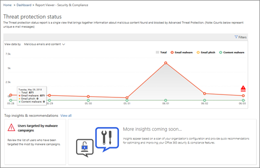

# Stapsgewijze instructies - Van een gedetailleerd rapport tot een inzicht

Als u nieuw bent [in rapporten &amp; en inzichten in](reports-and-insights-in-security-and-compliance.md)het Security Compliance Center, kan dit helpen om te zien hoe u eenvoudig navigeren van een gedetailleerd rapport naar een inzicht en aanbevolen acties. 
  
Dit is een van de vele &amp; walkthroughs voor het Security Compliance Center. Zie de sectie [Gerelateerde onderwerpen](#related-topics) om extra walkthroughs te bekijken. 
  
## Walkthrough: Van een gedetailleerd rapport naar een inzicht

Laten we door de stroom van een gedetailleerd rapport naar een inzicht en acties lopen. (Dit is een korte [anti-spam en anti-malware](anti-spam-and-anti-malware-protection.md) voorbeeld.) 
  
1. We beginnen met [security compliance &amp; center](https://protection.office.com) rapporten. (Ga naar **Dashboard Rapporten** \> **.)**  
  
2. We kiezen een rapport om een gedetailleerder beeld te krijgen. (Kies een rapport, zoals het rapport **Status bedreigingsbeveiliging.)** 
  
3. We zien een insights indicator in de grafiek en onder het rapport. Het plaatsen van de muisaanwijzer op de insights marker geeft enkele extra details. (Plaats de plaats van de markering voor inzichten om aanvullende details te zien.)
    
4. Als u klikt op de markering inzichten in de grafiek of op de widget Inzichten over malware onder de grafiek, wordt een detailvenster geopend. (Selecteer onder de grafiek de widget Insights.)  In het detailvenster vindt u informatie en aanbevelingen om rekening mee te houden, waaronder het beoordelen van beleid, het uitvoeren van verdere verkenning en het bewerken van de status. ([Meer informatie over antispam en bescherming tegen malware in Office 365](anti-spam-and-anti-malware-protection.md).)
    
Op deze manier kunnen we overgaan van een gedetailleerd rapport naar een inzicht en aanbevolen acties. 
  
## Verwante onderwerpen

[Walkthrough: Van inzicht tot een gedetailleerd rapport](from-an-insight-to-a-detailed-report.md)
  
[Walkthrough: van een dashboard naar een inzicht](from-a-dashboard-to-an-insight.md)
  

