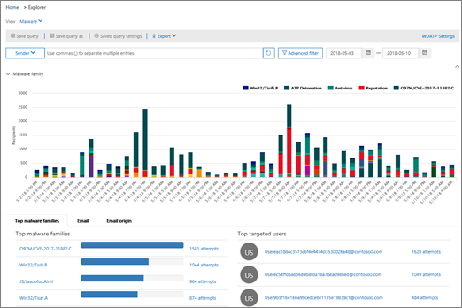

# Stapsgewijze instructies - Van een inzicht tot een gedetailleerd rapportWalkthrough - From an insight to a detailed report

Als u nieuw bent [in rapporten &amp; en inzichten in het Security Compliance Center,](reports-and-insights-in-security-and-compliance.md)kan dit helpen om te zien hoe u eenvoudig navigeren van een inzicht naar een gedetailleerd rapport.If you're new to [reports and insights in the Security &amp; Compliance Center](reports-and-insights-in-security-and-compliance.md), it might help to see how you can easily navigate from an insight to a detailed report. 
  
Dit is een van de vele walkthroughs voor het [Security &amp; Compliance Center.](https://protection.office.com)This is one of several walkthroughs for the [Security &amp; Compliance Center](https://protection.office.com). Zie de sectie [Gerelateerde onderwerpen](#related-topics) om extra walkthroughs te bekijken.To see additional walkthroughs, see the [Related topics](#related-topics) section. 
  
## Van inzicht tot een gedetailleerd rapportFrom an insight to a detailed report

Laten we door de stroom van het dashboard naar een inzicht naar een gedetailleerd rapport voor gegevensverkenning lopen.Let's walk through the flow from the dashboard to an insight to a detailed report for data exploration. (Dit is een kort voorbeeld [van gegevensverliespreventie.)](../../compliance/data-loss-prevention-policies.md)(This is a brief [data loss prevention](../../compliance/data-loss-prevention-policies.md) example.) 
  
1. We beginnen met een dashboard in het [Security &amp; Compliance Center.](https://protection.office.com)We begin with a dashboard in the [Security &amp; Compliance Center](https://protection.office.com). (Ga naar **Dashboard Rapporten** \> **.)**(Go to **Reports** \> **Dashboard**.) 
  
2. In de linkerbovenhoek van het dashboard, naast \*\*aanbevelingen voor Top insights, &amp; \*\*hebben we een link.In the upper left corner of the dashboard, next to **Top insights &amp; recommendations**, we have a link. (Klik op **Alles weergeven**.)(Click **View all**.)  Dit brengt ons naar een lijst met inzichten voor onze organisatie.This takes us to a list of insights for our organization. 
  
3. Als u een item in de lijst selecteert, wordt een deelvenster geopend waarin we meer details over dat item kunnen weergeven.Selecting an item in the list opens a pane where we can view more details about that item. (Klik op een item.)(Click an item.)  We zien aanbevolen acties die we moeten overwegen, zoals het herzien van beleid.We see recommended actions we should consider, such as reviewing policies. ([Meer informatie over beleid ter voorkoming van gegevensverlies](../../compliance/data-loss-prevention-policies.md).)([Learn more about data loss prevention policies](../../compliance/data-loss-prevention-policies.md).)
    
4. We hebben ook een link om meer details te bekijken.We also have a link to view more details. (Klik op **Gerelateerde activiteit weergeven in Explorer**.)(Click **See related activity in Explorer**.) Dit brengt ons naar een rapporttype genaamd [Threat Explorer (en real-time detecties),](threat-explorer.md)waar we filters kunnen toepassen en in specifieke details kunnen inzoomen.This takes us to a report type called [Threat Explorer (and real-time detections)](threat-explorer.md), where we can apply filters and drill into specific details. 
  
Op deze manier kunnen we gemakkelijk van inzicht in de onderliggende details gaan en beter geïnformeerde beslissingen nemen over het voorkomen van gegevensverlies voor een organisatie.In this way, we can move easily from an insight into its underlying details, and make more informed decisions about data loss prevention for an organization.
  
## Verwante onderwerpenRelated topics

[Walkthrough: Van een gedetailleerd rapport naar een inzichtWalkthrough: From a detailed report to an insight](from-a-detailed-report-to-an-insight.md)
  
[Walkthrough: van een dashboard naar een inzichtWalkthrough: From a dashboard to an insight](from-a-dashboard-to-an-insight.md)
  

