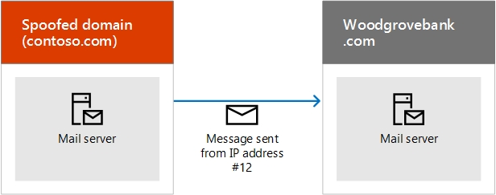

# <a name="how-microsoft-365-uses-sender-policy-framework-spf-to-prevent-spoofing"></a><span data-ttu-id="7f48b-103">Hoe Microsoft 365 SPF (Sender Policy Framework) gebruikt om adresvervalsing te voorkomen</span><span class="sxs-lookup"><span data-stu-id="7f48b-103">How Microsoft 365 uses Sender Policy Framework (SPF) to prevent spoofing</span></span>

[!INCLUDE [Microsoft 365 Defender rebranding](../includes/microsoft-defender-for-office.md)]


 <span data-ttu-id="7f48b-104">**Overzicht:** In dit artikel wordt beschreven hoe Microsoft 365 de SPF-TXT-record (Sender Policy Framework) in DNS gebruikt om ervoor te zorgen dat e-mail systemen berichten die vanuit uw aangepaste domein worden verzonden, worden vertrouwd.</span><span class="sxs-lookup"><span data-stu-id="7f48b-104">**Summary:** This article describes how Microsoft 365 uses the Sender Policy Framework (SPF) TXT record in DNS to ensure that destination email systems trust messages sent from your custom domain.</span></span> <span data-ttu-id="7f48b-105">Dit geldt voor uitgaande e-mail verzonden via Microsoft 365.</span><span class="sxs-lookup"><span data-stu-id="7f48b-105">This applies to outbound mail sent from Microsoft 365.</span></span> <span data-ttu-id="7f48b-106">Berichten die worden verzonden vanaf Microsoft 365 naar een geadresseerde in Microsoft 365, worden altijd SPF weergegeven.</span><span class="sxs-lookup"><span data-stu-id="7f48b-106">Messages sent from Microsoft 365 to a recipient within Microsoft 365 will always pass SPF.</span></span>

<span data-ttu-id="7f48b-107">Een SPF TXT-record is een DNS-record die helpt spoofing en phishing te voorkomen door de domeinnaam te verifiëren van e-mailberichten die worden verzonden.</span><span class="sxs-lookup"><span data-stu-id="7f48b-107">An SPF TXT record is a DNS record that helps prevent spoofing and phishing by verifying the domain name from which email messages are sent.</span></span> <span data-ttu-id="7f48b-108">SPF valideert de oorsprong van e-mailberichten door het IP-adres van de afzender te verifiëren tegen de gemoedeerde eigenaar van het verzendende domein.</span><span class="sxs-lookup"><span data-stu-id="7f48b-108">SPF validates the origin of email messages by verifying the IP address of the sender against the alleged owner of the sending domain.</span></span>

> [!NOTE]
> <span data-ttu-id="7f48b-109">SPF-recordtypen werden via IETF (Internet Engineering Task Force) in 2014 gedeprecieerd.</span><span class="sxs-lookup"><span data-stu-id="7f48b-109">SPF record types were deprecated by the Internet Engineering Task Force (IETF) in 2014.</span></span> <span data-ttu-id="7f48b-110">Zorg er in plaats daarvan voor dat u TXT-records in DNS gebruikt voor het publiceren van uw SPF-gegevens.</span><span class="sxs-lookup"><span data-stu-id="7f48b-110">Instead, ensure that you use TXT records in DNS to publish your SPF information.</span></span> <span data-ttu-id="7f48b-111">De rest van dit artikel gebruikt de term SPF TXT-record voor duidelijkheid.</span><span class="sxs-lookup"><span data-stu-id="7f48b-111">The rest of this article uses the term SPF TXT record for clarity.</span></span>

<span data-ttu-id="7f48b-112">Domeinbeheerders publiceren SPF-informatie in TXT-records in DNS.</span><span class="sxs-lookup"><span data-stu-id="7f48b-112">Domain administrators publish SPF information in TXT records in DNS.</span></span> <span data-ttu-id="7f48b-113">De SPF-gegevens identificeren geautoriseerde uitgaande e-mailservers.</span><span class="sxs-lookup"><span data-stu-id="7f48b-113">The SPF information identifies authorized outbound email servers.</span></span> <span data-ttu-id="7f48b-114">Doel-e-mail systemen verifieert dat berichten afkomstig zijn van gemachtigde uitgaande e-mailservers.</span><span class="sxs-lookup"><span data-stu-id="7f48b-114">Destination email systems verify that messages originate from authorized outbound email servers.</span></span> <span data-ttu-id="7f48b-115">Als u al bekend bent met SPF, of als u een eenvoudige implementatie hebt en alleen weet wat u wilt opnemen in uw SPF TXT-record in DNS voor Microsoft 365, gaat u naar [SPF instellen in Microsoft 365 om spoofing te helpen voorkomen](set-up-spf-in-office-365-to-help-prevent-spoofing.md).</span><span class="sxs-lookup"><span data-stu-id="7f48b-115">If you are already familiar with SPF, or you have a simple deployment, and just need to know what to include in your SPF TXT record in DNS for Microsoft 365, you can go to [Set up SPF in Microsoft 365 to help prevent spoofing](set-up-spf-in-office-365-to-help-prevent-spoofing.md).</span></span> <span data-ttu-id="7f48b-116">Lees verder als u geen implementatie hebt die volledig gehost is in Microsoft 365, of als u meer wilt weten over de manier waarop SPF werkt of hoe u problemen met SPF voor Microsoft 365 oplost.</span><span class="sxs-lookup"><span data-stu-id="7f48b-116">If you do not have a deployment that is fully-hosted in Microsoft 365, or you want more information about how SPF works or how to troubleshoot SPF for Microsoft 365, keep reading.</span></span>

> [!NOTE]
> <span data-ttu-id="7f48b-117">Eerder hebt u een andere SPF TXT-record aan uw aangepaste domein toegevoegd als u ook SharePoint Online gebruikt.</span><span class="sxs-lookup"><span data-stu-id="7f48b-117">Previously, you had to add a different SPF TXT record to your custom domain if you also used SharePoint Online.</span></span> <span data-ttu-id="7f48b-118">Dit is niet meer nodig.</span><span class="sxs-lookup"><span data-stu-id="7f48b-118">This is no longer required.</span></span> <span data-ttu-id="7f48b-119">Deze wijziging moet het risico verkleinen dat SharePoint Online-meldingsberichten in de map Ongewenste e-mail terechtkomen.</span><span class="sxs-lookup"><span data-stu-id="7f48b-119">This change should reduce the risk of SharePoint Online notification messages ending up in the Junk Email folder.</span></span> <span data-ttu-id="7f48b-120">U hoeft geen wijzigingen direct aan te brengen, maar als u de fout ' te veel zoekresultaten ' ontvangt, wijzigt u de SPF TXT-record zoals beschreven in [SPF instellen in Microsoft 365 om spoofing te helpen voorkomen](set-up-spf-in-office-365-to-help-prevent-spoofing.md).</span><span class="sxs-lookup"><span data-stu-id="7f48b-120">You do not need to make any changes immediately, but if you receive the "too many lookups" error, modify your SPF TXT record as described in [Set up SPF in Microsoft 365 to help prevent spoofing](set-up-spf-in-office-365-to-help-prevent-spoofing.md).</span></span>

## <a name="how-spf-works-to-prevent-spoofing-and-phishing-in-microsoft-365"></a><span data-ttu-id="7f48b-121">Hoe SPF werkt spoofing en phishing voorkomen in Microsoft 365</span><span class="sxs-lookup"><span data-stu-id="7f48b-121">How SPF works to prevent spoofing and phishing in Microsoft 365</span></span>
<span data-ttu-id="7f48b-122"><a name="HowSPFWorks"> </a></span><span class="sxs-lookup"><span data-stu-id="7f48b-122"><a name="HowSPFWorks"> </a></span></span>

<span data-ttu-id="7f48b-123">SPF bepaalt of een afzender al dan niet mag worden verzonden namens een domein.</span><span class="sxs-lookup"><span data-stu-id="7f48b-123">SPF determines whether or not a sender is permitted to send on behalf of a domain.</span></span> <span data-ttu-id="7f48b-124">Als de afzender dit niet mag doen, dat wil zeggen als de e-mail melding mislukt op de server voor het ontvangen van de e-mail, bepaalt het antispambeleid dat op de server is geconfigureerd wat er met het bericht moet worden gedaan.</span><span class="sxs-lookup"><span data-stu-id="7f48b-124">If the sender is not permitted to do so, that is, if the email fails the SPF check on the receiving server, the spam policy configured on that server determines what to do with the message.</span></span>

<span data-ttu-id="7f48b-125">Elke SPF TXT-record bevat drie gedeelten: de declaratie dat het een SPF TXT-record is, welke IP-adressen zijn toegestaan voor het verzenden van e-mail van uw domein en de externe domeinen die namens de domeinnamen en een afdwingings regel kunnen verzenden.</span><span class="sxs-lookup"><span data-stu-id="7f48b-125">Each SPF TXT record contains three parts: the declaration that it is an SPF TXT record, the IP addresses that are allowed to send mail from your domain and the external domains that can send on your domain's behalf, and an enforcement rule.</span></span> <span data-ttu-id="7f48b-126">U hebt alledrie een geldige SPF TXT-record nodig.</span><span class="sxs-lookup"><span data-stu-id="7f48b-126">You need all three in a valid SPF TXT record.</span></span> <span data-ttu-id="7f48b-127">In dit artikel wordt beschreven hoe u uw SPF TXT-record kunt maken en de aanbevolen procedures voor het werken met de Services kunt in Microsoft 365.</span><span class="sxs-lookup"><span data-stu-id="7f48b-127">This article describes how you form your SPF TXT record and provides best practices for working with the services in Microsoft 365.</span></span> <span data-ttu-id="7f48b-128">Koppelingen naar instructies voor het werken met uw domeinregistratieservice voor het publiceren van uw record met DNS is ook beschikbaar.</span><span class="sxs-lookup"><span data-stu-id="7f48b-128">Links to instructions on working with your domain registrar to publish your record to DNS are also provided.</span></span>

### <a name="spf-basics-ip-addresses-allowed-to-send-from-your-custom-domain"></a><span data-ttu-id="7f48b-129">SPF-basisbeginselen: IP-adressen die mogen worden verzonden vanuit uw aangepaste domein</span><span class="sxs-lookup"><span data-stu-id="7f48b-129">SPF basics: IP addresses allowed to send from your custom domain</span></span>
<span data-ttu-id="7f48b-130"><a name="SPFBasicsIPaddresses"> </a></span><span class="sxs-lookup"><span data-stu-id="7f48b-130"><a name="SPFBasicsIPaddresses"> </a></span></span>

<span data-ttu-id="7f48b-131">Bekijk de syntaxis van basis voor een SPF-regel:</span><span class="sxs-lookup"><span data-stu-id="7f48b-131">Take a look at the basic syntax for an SPF rule:</span></span>

<span data-ttu-id="7f48b-132">v = spf1 \<IP\>\<enforcement rule\></span><span class="sxs-lookup"><span data-stu-id="7f48b-132">v=spf1 \<IP\> \<enforcement rule\></span></span>

<span data-ttu-id="7f48b-133">Stel dat u bijvoorbeeld de volgende SPF-regel bestaat voor contoso.com:</span><span class="sxs-lookup"><span data-stu-id="7f48b-133">For example, let's say the following SPF rule exists for contoso.com:</span></span>

<span data-ttu-id="7f48b-134">v = spf1 \<IP address #1\> \<IP address #2\> \<IP address #3\>\<enforcement rule\></span><span class="sxs-lookup"><span data-stu-id="7f48b-134">v=spf1 \<IP address #1\> \<IP address #2\> \<IP address #3\> \<enforcement rule\></span></span>

<span data-ttu-id="7f48b-135">In dit voorbeeld wordt met de SPF-regel de ontvangende e-mailserver geïnstrueerd alleen e-mail te accepteren van deze IP-adressen voor de domein contoso.com:</span><span class="sxs-lookup"><span data-stu-id="7f48b-135">In this example, the SPF rule instructs the receiving email server to only accept mail from these IP addresses for the domain contoso.com:</span></span>

- <span data-ttu-id="7f48b-136">IP-adres #1</span><span class="sxs-lookup"><span data-stu-id="7f48b-136">IP address #1</span></span>

- <span data-ttu-id="7f48b-137">IP-adres #2</span><span class="sxs-lookup"><span data-stu-id="7f48b-137">IP address #2</span></span>

- <span data-ttu-id="7f48b-138">IP-adres #3</span><span class="sxs-lookup"><span data-stu-id="7f48b-138">IP address #3</span></span>

<span data-ttu-id="7f48b-139">Met deze SPF-regel wordt de e-mailserver van de ontvangst van een bericht op de plaats van contoso.com, maar niet uit een van deze drie IP-adressen, moet de ontvangende server de nalevings regel op het bericht toepassen.</span><span class="sxs-lookup"><span data-stu-id="7f48b-139">This SPF rule tells the receiving email server that if a message comes from contoso.com, but not from one of these three IP addresses, the receiving server should apply the enforcement rule to the message.</span></span> <span data-ttu-id="7f48b-140">De handhavings regel is meestal een van de volgende opties:</span><span class="sxs-lookup"><span data-stu-id="7f48b-140">The enforcement rule is usually one of these options:</span></span>

- <span data-ttu-id="7f48b-141">**Moeilijk mislukt.**</span><span class="sxs-lookup"><span data-stu-id="7f48b-141">**Hard fail.**</span></span> <span data-ttu-id="7f48b-142">Markeer het bericht met ' moeilijk fout ' in de envelop van het bericht en voer vervolgens het geconfigureerde spam beleid van de ontvangen server voor dit type bericht uit.</span><span class="sxs-lookup"><span data-stu-id="7f48b-142">Mark the message with 'hard fail' in the message envelope and then follow the receiving server's configured spam policy for this type of message.</span></span>

- <span data-ttu-id="7f48b-143">**Vloeiend, mislukt.**</span><span class="sxs-lookup"><span data-stu-id="7f48b-143">**Soft fail.**</span></span> <span data-ttu-id="7f48b-144">Markeer het bericht met ' zacht fout ' in de bericht envelop.</span><span class="sxs-lookup"><span data-stu-id="7f48b-144">Mark the message with 'soft fail' in the message envelope.</span></span> <span data-ttu-id="7f48b-145">Meestal zijn e-mailservers zodanig geconfigureerd dat ze deze berichten toch leveren.</span><span class="sxs-lookup"><span data-stu-id="7f48b-145">Typically, email servers are configured to deliver these messages anyway.</span></span> <span data-ttu-id="7f48b-146">De meeste eindgebruikers zien dit vinkje niet.</span><span class="sxs-lookup"><span data-stu-id="7f48b-146">Most end users do not see this mark.</span></span>

- <span data-ttu-id="7f48b-147">**Neutraal.**</span><span class="sxs-lookup"><span data-stu-id="7f48b-147">**Neutral.**</span></span> <span data-ttu-id="7f48b-148">Niets doen, dat wil zeggen, dat wil zeggen dat u de envelop met berichten niet markeert.</span><span class="sxs-lookup"><span data-stu-id="7f48b-148">Do nothing, that is, do not mark the message envelope.</span></span> <span data-ttu-id="7f48b-149">Dit is meestal gereserveerd voor testdoeleinden en wordt zelden gebruikt.</span><span class="sxs-lookup"><span data-stu-id="7f48b-149">This is usually reserved for testing purposes and is rarely used.</span></span>

<span data-ttu-id="7f48b-150">In de volgende voorbeelden wordt getoond hoe SPF in verschillende situaties werkt.</span><span class="sxs-lookup"><span data-stu-id="7f48b-150">The following examples show how SPF works in different situations.</span></span> <span data-ttu-id="7f48b-151">In deze voorbeelden is contoso.com de afzender en woodgrovebank.com de ontvanger.</span><span class="sxs-lookup"><span data-stu-id="7f48b-151">In these examples, contoso.com is the sender and woodgrovebank.com is the receiver.</span></span>

### <a name="example-1-email-authentication-of-a-message-sent-directly-from-sender-to-receiver"></a><span data-ttu-id="7f48b-152">Voorbeeld 1: e-mail verificatie van een bericht dat rechtstreeks van afzender naar ontvanger is verzonden</span><span class="sxs-lookup"><span data-stu-id="7f48b-152">Example 1: Email authentication of a message sent directly from sender to receiver</span></span>
<span data-ttu-id="7f48b-153"><a name="spfExample1"> </a></span><span class="sxs-lookup"><span data-stu-id="7f48b-153"><a name="spfExample1"> </a></span></span>

<span data-ttu-id="7f48b-154">SPF werkt het best wanneer het pad van afzender naar ontvanger direct is, bijvoorbeeld:</span><span class="sxs-lookup"><span data-stu-id="7f48b-154">SPF works best when the path from sender to receiver is direct, for example:</span></span>


<span data-ttu-id="7f48b-156">Wanneer woodgrovebank.com het bericht ontvangt, als het IP-adres #1 in de SPF TXT-record voor contoso.com, wordt het bericht doorgegeven aan de SPF-controle en is de verificatie geauthenticeerd.</span><span class="sxs-lookup"><span data-stu-id="7f48b-156">When woodgrovebank.com receives the message, if IP address #1 is in the SPF TXT record for contoso.com, the message passes the SPF check and is authenticated.</span></span>

### <a name="example-2-spoofed-sender-address-fails-the-spf-check"></a><span data-ttu-id="7f48b-157">Voorbeeld 2: certificaat met spoofing mislukt de SPF-controle</span><span class="sxs-lookup"><span data-stu-id="7f48b-157">Example 2: Spoofed sender address fails the SPF check</span></span>
<span data-ttu-id="7f48b-158"><a name="spfExample2"> </a></span><span class="sxs-lookup"><span data-stu-id="7f48b-158"><a name="spfExample2"> </a></span></span>

<span data-ttu-id="7f48b-159">Stel dat een phisher een manier voor spoofing contoso.com:</span><span class="sxs-lookup"><span data-stu-id="7f48b-159">Suppose a phisher finds a way to spoof contoso.com:</span></span>



<span data-ttu-id="7f48b-161">Aangezien IP-adres #12 zich niet in de SPF TXT-record van contoso. com bevindt, mislukt het bericht de SPF-controle en kan de ontvanger deze als spam markeren.</span><span class="sxs-lookup"><span data-stu-id="7f48b-161">Since IP address #12 is not in contoso.com's SPF TXT record, the message fails the SPF check and the receiver may choose to mark it as spam.</span></span>

### <a name="example-3-spf-and-forwarded-messages"></a><span data-ttu-id="7f48b-162">Voorbeeld 3: SPF en doorgestuurde berichten</span><span class="sxs-lookup"><span data-stu-id="7f48b-162">Example 3: SPF and forwarded messages</span></span>
<span data-ttu-id="7f48b-163"><a name="spfExample3"> </a></span><span class="sxs-lookup"><span data-stu-id="7f48b-163"><a name="spfExample3"> </a></span></span>

<span data-ttu-id="7f48b-164">Eén nadeel van SPF is dat het niet werkt als een e-mailbericht is doorgestuurd.</span><span class="sxs-lookup"><span data-stu-id="7f48b-164">One drawback of SPF is that it doesn't work when an email has been forwarded.</span></span> <span data-ttu-id="7f48b-165">Stel dat de gebruiker bij woodgrovebank.com een doorstuurregel heeft ingesteld voor het verzenden van alle e-mailberichten naar een outlook.com-account:</span><span class="sxs-lookup"><span data-stu-id="7f48b-165">For example, suppose the user at woodgrovebank.com has set up a forwarding rule to send all email to an outlook.com account:</span></span>


<span data-ttu-id="7f48b-167">Het bericht geeft de SPF-controle aan op woodgrovebank.com, maar het is niet mogelijk dat de SPF-controle bij outlook.com is mislukt, omdat IP #25 zich niet in de SPF TXT-record van contoso. com bevindt.</span><span class="sxs-lookup"><span data-stu-id="7f48b-167">The message originally passes the SPF check at woodgrovebank.com but it fails the SPF check at outlook.com because IP #25 is not in contoso.com's SPF TXT record.</span></span> <span data-ttu-id="7f48b-168">Outlook.com kan vervolgens het bericht als spam markeren.</span><span class="sxs-lookup"><span data-stu-id="7f48b-168">Outlook.com might then mark the message as spam.</span></span> <span data-ttu-id="7f48b-169">Om dit probleem tijdelijk op te lossen, gebruikt u SPF samen met andere verificatiemethoden voor e-mail, zoals DKIM en DMARC.</span><span class="sxs-lookup"><span data-stu-id="7f48b-169">To work around this problem, use SPF in conjunction with other email authentication methods such as DKIM and DMARC.</span></span>

### <a name="spf-basics-including-third-party-domains-that-can-send-mail-on-behalf-of-your-domain"></a><span data-ttu-id="7f48b-170">SPF-basisbeginselen: ook domeinen van derden die e-mail verzenden namens uw domein</span><span class="sxs-lookup"><span data-stu-id="7f48b-170">SPF basics: Including third-party domains that can send mail on behalf of your domain</span></span>
<span data-ttu-id="7f48b-171"><a name="SPFBasicsIncludes"> </a></span><span class="sxs-lookup"><span data-stu-id="7f48b-171"><a name="SPFBasicsIncludes"> </a></span></span>

<span data-ttu-id="7f48b-172">Naast IP-adressen kunt u ook uw SPF TXT-record configureren, zodat domeinen als afzenders worden opgenomen.</span><span class="sxs-lookup"><span data-stu-id="7f48b-172">In addition to IP addresses, you can also configure your SPF TXT record to include domains as senders.</span></span> <span data-ttu-id="7f48b-173">Deze worden toegevoegd aan de statement. SPF TXT-record.</span><span class="sxs-lookup"><span data-stu-id="7f48b-173">These are added to the SPF TXT record as "include" statements.</span></span> <span data-ttu-id="7f48b-174">In contoso.com kunt u bijvoorbeeld alle IP-adressen van de e-mailservers van contoso.net en contoso.org opnemen.</span><span class="sxs-lookup"><span data-stu-id="7f48b-174">For example, contoso.com might want to include all of the IP addresses of the mail servers from contoso.net and contoso.org which it also owns.</span></span> <span data-ttu-id="7f48b-175">Om dit te doen, publiceert contoso.com een SPF TXT-record die er zo uitziet:</span><span class="sxs-lookup"><span data-stu-id="7f48b-175">To do this, contoso.com publishes an SPF TXT record that looks like this:</span></span>

```text
v=spf1 include:contoso.net include:contoso.org -all
```

<span data-ttu-id="7f48b-176">Wanneer de ontvangende server deze record in DNS ziet, wordt ook een DNS-zoekopdracht uitgevoerd op de SPF TXT-record voor contoso.net en vervolgens voor contoso.org. Als er een aanvullend include-instructie is binnen de records voor contoso.net of contoso.org, wordt deze ook gebruikt.</span><span class="sxs-lookup"><span data-stu-id="7f48b-176">When the receiving server sees this record in DNS, it also performs a DNS lookup on the SPF TXT record for contoso.net and then for contoso.org. If it finds an additional include statement within the records for contoso.net or contoso.org, it will follow those too.</span></span> <span data-ttu-id="7f48b-177">Om te voorkomen dat u denial of service-aanvallen kunt voorkomen, is het maximale aantal DNS-zoekopdrachten voor één e-mailbericht 10.</span><span class="sxs-lookup"><span data-stu-id="7f48b-177">In order to help prevent denial of service attacks, the maximum number of DNS lookups for a single email message is 10.</span></span> <span data-ttu-id="7f48b-178">Elk van de instructies omvat een extra DNS-zoekopdracht.</span><span class="sxs-lookup"><span data-stu-id="7f48b-178">Each include statement represents an additional DNS lookup.</span></span> <span data-ttu-id="7f48b-179">Als een bericht de tien limiet overschrijdt, mislukt het bericht SPF.</span><span class="sxs-lookup"><span data-stu-id="7f48b-179">If a message exceeds the 10 limit, the message fails SPF.</span></span> <span data-ttu-id="7f48b-180">Wanneer een bericht deze limiet heeft bereikt, wordt, afhankelijk van de manier waarop de server wordt geconfigureerd, een bericht weergegeven met de tekst ' te veel zoekwaarden ' of ' het maximum aantal hops voor het bericht is overschreden ' (die kunnen optreden wanneer de zoekopdrachten lussen en de DNS-time-out overschrijden).</span><span class="sxs-lookup"><span data-stu-id="7f48b-180">Once a message reaches this limit, depending on the way the receiving server is configured, the sender may get a message that says the message generated "too many lookups" or that the "maximum hop count for the message has been exceeded" (which can happen when the lookups loop and surpass the DNS timeout).</span></span> <span data-ttu-id="7f48b-181">Voor tips over hoe u dit kunt voorkomen, raadpleegt u [problemen oplossen: Best practices voor spf in Microsoft 365](how-office-365-uses-spf-to-prevent-spoofing.md#SPFTroubleshoot).</span><span class="sxs-lookup"><span data-stu-id="7f48b-181">For tips on how to avoid this, see [Troubleshooting: Best practices for SPF in Microsoft 365](how-office-365-uses-spf-to-prevent-spoofing.md#SPFTroubleshoot).</span></span>

## <a name="requirements-for-your-spf-txt-record-and-microsoft-365"></a><span data-ttu-id="7f48b-182">Vereisten voor uw SPF TXT-record en Microsoft 365</span><span class="sxs-lookup"><span data-stu-id="7f48b-182">Requirements for your SPF TXT record and Microsoft 365</span></span>
<span data-ttu-id="7f48b-183"><a name="SPFReqsinO365"> </a></span><span class="sxs-lookup"><span data-stu-id="7f48b-183"><a name="SPFReqsinO365"> </a></span></span>

<span data-ttu-id="7f48b-184">Als u e-mail instelt bij het instellen van Microsoft 365, hebt u al een SPF TXT-record gemaakt waarmee de Microsoft Messaging-servers als een legitieme bron van e-mailberichten voor uw domein worden geïdentificeerd.</span><span class="sxs-lookup"><span data-stu-id="7f48b-184">If you set up mail when you set up Microsoft 365, you already created an SPF TXT record that identifies the Microsoft messaging servers as a legitimate source of mail for your domain.</span></span> <span data-ttu-id="7f48b-185">Deze record ziet er waarschijnlijk zo uit:</span><span class="sxs-lookup"><span data-stu-id="7f48b-185">This record probably looks like this:</span></span>

```text
v=spf1 include:spf.protection.outlook.com -all
```

<span data-ttu-id="7f48b-186">Als u een volledig gehoste klant bent, hebt u geen on-premises e-mailservers die uitgaande e-mail verzenden, dit is de enige SPF TXT-record die u moet publiceren voor Office 365.</span><span class="sxs-lookup"><span data-stu-id="7f48b-186">If you're a fully-hosted customer, that is, you have no on-premises mail servers that send outbound mail, this is the only SPF TXT record that you need to publish for Office 365.</span></span>

<span data-ttu-id="7f48b-187">Als u een hybride implementatie hebt (dat wil zeggen: u beschikt over bepaalde postvakken on-premises en hebt u gehost in Microsoft 365) of u kunt een zelfstandige klant met Exchange Online Protection (dat wil zeggen dat uw organisatie gebruikmaakt van EOP om uw on-premises postvakken te beschermen) door het uitgaande IP-adres toe te voegen voor elk van uw on-premises Edge-e-mailservers in de SPF</span><span class="sxs-lookup"><span data-stu-id="7f48b-187">If you have a hybrid deployment (that is, you have some mailboxes on-premises and some hosted in Microsoft 365), or if you're an Exchange Online Protection (EOP) standalone customer (that is, your organization uses EOP to protect your on-premises mailboxes), you should add the outbound IP address for each of your on-premises edge mail servers to the SPF TXT record in DNS.</span></span>

## <a name="form-your-spf-txt-record-for-microsoft-365"></a><span data-ttu-id="7f48b-188">De SPF TXT-record voor Microsoft 365 maken</span><span class="sxs-lookup"><span data-stu-id="7f48b-188">Form your SPF TXT record for Microsoft 365</span></span>
<span data-ttu-id="7f48b-189"><a name="FormYourSPF"> </a></span><span class="sxs-lookup"><span data-stu-id="7f48b-189"><a name="FormYourSPF"> </a></span></span>

<span data-ttu-id="7f48b-190">Gebruik de syntaxisinformatie in dit artikel om de SPF TXT-record voor uw aangepaste domein te vormen.</span><span class="sxs-lookup"><span data-stu-id="7f48b-190">Use the syntax information in this article to form the SPF TXT record for your custom domain.</span></span> <span data-ttu-id="7f48b-191">Hoewel er andere syntaxis opties zijn die hier niet worden vermeld, zijn dit de meestgebruikte opties.</span><span class="sxs-lookup"><span data-stu-id="7f48b-191">Although there are other syntax options that are not mentioned here, these are the most commonly used options.</span></span> <span data-ttu-id="7f48b-192">Wanneer u het record hebt gemaakt, moet u het record bij uw domeinregistrar bijwerken.</span><span class="sxs-lookup"><span data-stu-id="7f48b-192">Once you have formed your record, you need to update the record at your domain registrar.</span></span>

<span data-ttu-id="7f48b-193">Zie [externe DNS-records vereist voor SPF](https://docs.microsoft.com/microsoft-365/enterprise/external-domain-name-system-records)voor informatie over de domeinen die u moet opnemen voor microsoft 365.</span><span class="sxs-lookup"><span data-stu-id="7f48b-193">For information about the domains you will need to include for Microsoft 365, see [External DNS records required for SPF](https://docs.microsoft.com/microsoft-365/enterprise/external-domain-name-system-records).</span></span> <span data-ttu-id="7f48b-194">Volg de [Stapsgewijze instructies](https://docs.microsoft.com/microsoft-365/admin/get-help-with-domains/create-dns-records-at-any-dns-hosting-provider#add-a-txt-record-for-spf-to-help-prevent-email-spam) voor het bijwerken van SPF (txt)-records voor uw domeinregistratie.</span><span class="sxs-lookup"><span data-stu-id="7f48b-194">Use the [step-by-step instructions](https://docs.microsoft.com/microsoft-365/admin/get-help-with-domains/create-dns-records-at-any-dns-hosting-provider#add-a-txt-record-for-spf-to-help-prevent-email-spam) for updating SPF (TXT) records for your domain registrar.</span></span>

### <a name="spf-txt-record-syntax-for-microsoft-365"></a><span data-ttu-id="7f48b-195">SPF TXT-record syntaxis voor Microsoft 365</span><span class="sxs-lookup"><span data-stu-id="7f48b-195">SPF TXT record syntax for Microsoft 365</span></span>
<span data-ttu-id="7f48b-196"><a name="SPFSyntaxO365"> </a></span><span class="sxs-lookup"><span data-stu-id="7f48b-196"><a name="SPFSyntaxO365"> </a></span></span>

<span data-ttu-id="7f48b-197">Een typische SPF TXT-record voor Microsoft 365 heeft de volgende syntaxis:</span><span class="sxs-lookup"><span data-stu-id="7f48b-197">A typical SPF TXT record for Microsoft 365 has the following syntax:</span></span>

```text
v=spf1 [<ip4>|<ip6>:<IP address>] [include:<domain name>] <enforcement rule>
```

<span data-ttu-id="7f48b-198">Bijvoorbeeld:</span><span class="sxs-lookup"><span data-stu-id="7f48b-198">For example:</span></span>

```text
v=spf1 ip4:192.168.0.1 ip4:192.168.0.2 include:spf.protection.outlook.com -all
```

<span data-ttu-id="7f48b-199">waarbij:</span><span class="sxs-lookup"><span data-stu-id="7f48b-199">where:</span></span>

- <span data-ttu-id="7f48b-200">**v = spf1** is vereist.</span><span class="sxs-lookup"><span data-stu-id="7f48b-200">**v=spf1** is required.</span></span> <span data-ttu-id="7f48b-201">Hiermee wordt de TXT-record gedefinieerd als een SPF TXT-record.</span><span class="sxs-lookup"><span data-stu-id="7f48b-201">This defines the TXT record as an SPF TXT record.</span></span>

- <span data-ttu-id="7f48b-202">**IP4** geeft aan dat u adressen van IP-adres 4 gebruikt.</span><span class="sxs-lookup"><span data-stu-id="7f48b-202">**ip4** indicates that you are using IP version 4 addresses.</span></span> <span data-ttu-id="7f48b-203">**ip6** geeft aan dat u adressen van IP-versie 6 gebruikt.</span><span class="sxs-lookup"><span data-stu-id="7f48b-203">**ip6** indicates that you are using IP version 6 addresses.</span></span> <span data-ttu-id="7f48b-204">Als u IPv6 IP-adressen gebruikt, vervangt u **IP4** door **ip6** in de voorbeelden in dit artikel.</span><span class="sxs-lookup"><span data-stu-id="7f48b-204">If you are using IPv6 IP addresses, replace **ip4** with **ip6** in the examples in this article.</span></span> <span data-ttu-id="7f48b-205">U kunt ook IP-adresbereiken opgeven met behulp van CIDR-notatie, bijvoorbeeld **ip4:192.168.0.1/26**.</span><span class="sxs-lookup"><span data-stu-id="7f48b-205">You can also specify IP address ranges using CIDR notation, for example **ip4:192.168.0.1/26**.</span></span>

- <span data-ttu-id="7f48b-206">_IP-adres_ is het IP-adres dat u wilt toevoegen aan de SPF TXT-record.</span><span class="sxs-lookup"><span data-stu-id="7f48b-206">_IP address_ is the IP address that you want to add to the SPF TXT record.</span></span> <span data-ttu-id="7f48b-207">Meestal is dit het IP-adres van de server voor uitgaande e-mail voor uw organisatie.</span><span class="sxs-lookup"><span data-stu-id="7f48b-207">Usually, this is the IP address of the outbound mail server for your organization.</span></span> <span data-ttu-id="7f48b-208">U kunt meerdere uitgaande e-mailservers vermelden.</span><span class="sxs-lookup"><span data-stu-id="7f48b-208">You can list multiple outbound mail servers.</span></span> <span data-ttu-id="7f48b-209">Zie voor meer informatie [: SPF TXT-record voor meerdere uitgaande on-premises e-mailservers en Microsoft 365](how-office-365-uses-spf-to-prevent-spoofing.md#ExampleSPFMultipleMailServerO365).</span><span class="sxs-lookup"><span data-stu-id="7f48b-209">For more information, see [Example: SPF TXT record for multiple outbound on-premises mail servers and Microsoft 365](how-office-365-uses-spf-to-prevent-spoofing.md#ExampleSPFMultipleMailServerO365).</span></span>

- <span data-ttu-id="7f48b-210">_domeinnaam_ is het domein dat u wilt toevoegen als een legitieme afzender.</span><span class="sxs-lookup"><span data-stu-id="7f48b-210">_domain name_ is the domain you want to add as a legitimate sender.</span></span> <span data-ttu-id="7f48b-211">Zie [externe DNS-records die vereist zijn voor SPF](https://docs.microsoft.com/microsoft-365/enterprise/external-domain-name-system-records)voor een lijst met domeinnamen die u moet opnemen voor microsoft 365.</span><span class="sxs-lookup"><span data-stu-id="7f48b-211">For a list of domain names you should include for Microsoft 365, see [External DNS records required for SPF](https://docs.microsoft.com/microsoft-365/enterprise/external-domain-name-system-records).</span></span>

- <span data-ttu-id="7f48b-212">Nalevings regel is meestal een van de volgende opties:</span><span class="sxs-lookup"><span data-stu-id="7f48b-212">Enforcement rule is usually one of the following:</span></span>

  - <span data-ttu-id="7f48b-213">-all</span><span class="sxs-lookup"><span data-stu-id="7f48b-213">-all</span></span>

    <span data-ttu-id="7f48b-214">Geeft aan dat het moeilijk mislukt is.</span><span class="sxs-lookup"><span data-stu-id="7f48b-214">Indicates hard fail.</span></span> <span data-ttu-id="7f48b-215">Als u alle geautoriseerde IP-adressen voor uw domein weet, kunt u deze in de SPF TXT-record vermelden en de kwalificatie-all (harde fout) gebruiken.</span><span class="sxs-lookup"><span data-stu-id="7f48b-215">If you know all of the authorized IP addresses for your domain, list them in the SPF TXT record and use the -all (hard fail) qualifier.</span></span> <span data-ttu-id="7f48b-216">Als u alleen SPF gebruikt, dat wil zeggen dat u niet gebruikmaakt van DMARC of DKIM, moet u de kwalificatie-all gebruiken.</span><span class="sxs-lookup"><span data-stu-id="7f48b-216">Also, if you are only using SPF, that is, you are not using DMARC or DKIM, you should use the -all qualifier.</span></span> <span data-ttu-id="7f48b-217">U wordt aangeraden altijd deze aanduiding te gebruiken.</span><span class="sxs-lookup"><span data-stu-id="7f48b-217">We recommend that you use always this qualifier.</span></span>

  - <span data-ttu-id="7f48b-218">~ all</span><span class="sxs-lookup"><span data-stu-id="7f48b-218">~all</span></span>

    <span data-ttu-id="7f48b-219">Duidt op zacht fouten.</span><span class="sxs-lookup"><span data-stu-id="7f48b-219">Indicates soft fail.</span></span> <span data-ttu-id="7f48b-220">Als u niet zeker weet of u de volledige lijst met IP-adressen hebt, moet u de kwalificatie alles gebruiken (vloeiend) gebruiken.</span><span class="sxs-lookup"><span data-stu-id="7f48b-220">If you're not sure that you have the complete list of IP addresses, then you should use the ~all (soft fail) qualifier.</span></span> <span data-ttu-id="7f48b-221">Als u DMARC gebruikt met p = Quarantine of p = verwerpen, kunt u ook de ~ all gebruiken.</span><span class="sxs-lookup"><span data-stu-id="7f48b-221">Also, if you are using DMARC with p=quarantine or p=reject, then you can use ~all.</span></span> <span data-ttu-id="7f48b-222">U kunt ook-all gebruiken.</span><span class="sxs-lookup"><span data-stu-id="7f48b-222">Otherwise, use -all.</span></span>

  - <span data-ttu-id="7f48b-223">? alles</span><span class="sxs-lookup"><span data-stu-id="7f48b-223">?all</span></span>

    <span data-ttu-id="7f48b-224">Geeft neutraal aan.</span><span class="sxs-lookup"><span data-stu-id="7f48b-224">Indicates neutral.</span></span> <span data-ttu-id="7f48b-225">Dit wordt gebruikt bij het testen van SPF.</span><span class="sxs-lookup"><span data-stu-id="7f48b-225">This is used when testing SPF.</span></span> <span data-ttu-id="7f48b-226">U wordt aangeraden deze kwalificatie niet te gebruiken in uw Live implementatie.</span><span class="sxs-lookup"><span data-stu-id="7f48b-226">We do not recommend that you use this qualifier in your live deployment.</span></span>

### <a name="example-spf-txt-record-to-use-when-all-of-your-mail-is-sent-by-microsoft-365"></a><span data-ttu-id="7f48b-227">Voorbeeld: SPF TXT-record die moet worden gebruikt wanneer al uw e-mailberichten worden verzonden door Microsoft 365</span><span class="sxs-lookup"><span data-stu-id="7f48b-227">Example: SPF TXT record to use when all of your mail is sent by Microsoft 365</span></span>
<span data-ttu-id="7f48b-228"><a name="ExampleSPFNoSP"> </a></span><span class="sxs-lookup"><span data-stu-id="7f48b-228"><a name="ExampleSPFNoSP"> </a></span></span>

<span data-ttu-id="7f48b-229">Als u al uw e-mailberichten verzendt door Microsoft 365, gebruikt u dit in uw SPF TXT-record:</span><span class="sxs-lookup"><span data-stu-id="7f48b-229">If all of your mail is sent by Microsoft 365, use this in your SPF TXT record:</span></span>

```text
v=spf1 include:spf.protection.outlook.com -all
```

### <a name="example-spf-txt-record-for-a-hybrid-scenario-with-one-on-premises-exchange-server-and-microsoft-365"></a><span data-ttu-id="7f48b-230">Voorbeeld: SPF TXT-record voor een hybride scenario met een on-premises Exchange-Server en Microsoft 365</span><span class="sxs-lookup"><span data-stu-id="7f48b-230">Example: SPF TXT record for a hybrid scenario with one on-premises Exchange Server and Microsoft 365</span></span>
<span data-ttu-id="7f48b-231"><a name="ExampleSPFHybridOneExchangeServer"> </a></span><span class="sxs-lookup"><span data-stu-id="7f48b-231"><a name="ExampleSPFHybridOneExchangeServer"> </a></span></span>

<span data-ttu-id="7f48b-232">Als in een hybride omgeving het IP-adres van uw on-premises Exchange-Server is 192.168.0.1, moet u de SPF TXT-record als volgt instellen:</span><span class="sxs-lookup"><span data-stu-id="7f48b-232">In a hybrid environment, if the IP address of your on-premises Exchange Server is 192.168.0.1, in order to set the SPF enforcement rule to hard fail, form the SPF TXT record as follows:</span></span>

```text
v=spf1 ip4:192.168.0.1 include:spf.protection.outlook.com -all
```

### <a name="example-spf-txt-record-for-multiple-outbound-on-premises-mail-servers-and-microsoft-365"></a><span data-ttu-id="7f48b-233">Voorbeeld: SPF TXT-record voor meerdere uitgaande on-premises e-mailservers en Microsoft 365</span><span class="sxs-lookup"><span data-stu-id="7f48b-233">Example: SPF TXT record for multiple outbound on-premises mail servers and Microsoft 365</span></span>
<span data-ttu-id="7f48b-234"><a name="ExampleSPFMultipleMailServerO365"> </a></span><span class="sxs-lookup"><span data-stu-id="7f48b-234"><a name="ExampleSPFMultipleMailServerO365"> </a></span></span>

<span data-ttu-id="7f48b-235">Als u meerdere servers voor uitgaande e-mail hebt, neemt u het IP-adres voor elke e-mailserver op in de SPF TXT-record en scheidt u elk IP-adres met een spatie, gevolgd door een ' ip4: '-instructie.</span><span class="sxs-lookup"><span data-stu-id="7f48b-235">If you have multiple outbound mail servers, include the IP address for each mail server in the SPF TXT record and separate each IP address with a space followed by an "ip4:" statement.</span></span> <span data-ttu-id="7f48b-236">Bijvoorbeeld:</span><span class="sxs-lookup"><span data-stu-id="7f48b-236">For example:</span></span>

```text
v=spf1 ip4:192.168.0.1 ip4:192.168.0.2 ip4:192.168.0.3 include:spf.protection.outlook.com -all
```

## <a name="next-steps-set-up-spf-for-microsoft-365"></a><span data-ttu-id="7f48b-237">Volgende stappen: SPF voor Microsoft 365 instellen</span><span class="sxs-lookup"><span data-stu-id="7f48b-237">Next steps: Set up SPF for Microsoft 365</span></span>
<span data-ttu-id="7f48b-238"><a name="SPFNextSteps"> </a></span><span class="sxs-lookup"><span data-stu-id="7f48b-238"><a name="SPFNextSteps"> </a></span></span>

<span data-ttu-id="7f48b-239">Wanneer u de SPF TXT-record hebt gemaakt, volgt u de stappen in [SPF instellen in Microsoft 365 om spoofing te helpen voorkomen](set-up-spf-in-office-365-to-help-prevent-spoofing.md) dat u dit aan uw domein toevoegt.</span><span class="sxs-lookup"><span data-stu-id="7f48b-239">Once you have formulated your SPF TXT record, follow the steps in [Set up SPF in Microsoft 365 to help prevent spoofing](set-up-spf-in-office-365-to-help-prevent-spoofing.md) to add it to your domain.</span></span>

<span data-ttu-id="7f48b-240">Hoewel SPF is bedoeld om spoofing te helpen voorkomen, maar geen spoofing-technieken waarmee SPF geen bescherming biedt.</span><span class="sxs-lookup"><span data-stu-id="7f48b-240">Although SPF is designed to help prevent spoofing, but there are spoofing techniques that SPF cannot protect against.</span></span> <span data-ttu-id="7f48b-241">Om deze te beschermen, moet u ook de opties DKIM en DMARC voor Microsoft 365 configureren.</span><span class="sxs-lookup"><span data-stu-id="7f48b-241">In order to protect against these, once you have set up SPF, you should also configure DKIM and DMARC for Microsoft 365.</span></span> <span data-ttu-id="7f48b-242">Als u aan de slag wilt gaan, raadpleegt u [dkim gebruiken voor het valideren van uitgaande e-mail verzonden vanaf uw aangepaste domein in Microsoft 365](use-dkim-to-validate-outbound-email.md).</span><span class="sxs-lookup"><span data-stu-id="7f48b-242">To get started, see [Use DKIM to validate outbound email sent from your custom domain in Microsoft 365](use-dkim-to-validate-outbound-email.md).</span></span> <span data-ttu-id="7f48b-243">Zie vervolgens [DMARC gebruiken om e-mail in Microsoft 365 te valideren](use-dmarc-to-validate-email.md).</span><span class="sxs-lookup"><span data-stu-id="7f48b-243">Next, see [Use DMARC to validate email in Microsoft 365](use-dmarc-to-validate-email.md).</span></span>

## <a name="troubleshooting-best-practices-for-spf-in-microsoft-365"></a><span data-ttu-id="7f48b-244">Probleemoplossing: Aanbevolen procedures voor SPF in Microsoft 365</span><span class="sxs-lookup"><span data-stu-id="7f48b-244">Troubleshooting: Best practices for SPF in Microsoft 365</span></span>
<span data-ttu-id="7f48b-245"><a name="SPFTroubleshoot"> </a></span><span class="sxs-lookup"><span data-stu-id="7f48b-245"><a name="SPFTroubleshoot"> </a></span></span>

<span data-ttu-id="7f48b-246">U kunt maar één SPF TXT-record voor uw aangepaste domein maken.</span><span class="sxs-lookup"><span data-stu-id="7f48b-246">You can only create one SPF TXT record for your custom domain.</span></span> <span data-ttu-id="7f48b-247">Wanneer meerdere records worden gemaakt, mislukt dit met een Round Robin-situatie en SPF mislukt.</span><span class="sxs-lookup"><span data-stu-id="7f48b-247">Creating multiple records causes a round robin situation and SPF will fail.</span></span> <span data-ttu-id="7f48b-248">Om dit te voorkomen, kunt u afzonderlijke records voor elk subdomein maken.</span><span class="sxs-lookup"><span data-stu-id="7f48b-248">To avoid this, you can create separate records for each subdomain.</span></span> <span data-ttu-id="7f48b-249">Maak bijvoorbeeld één record voor contoso.com en een andere record voor bulkmail.contoso.com.</span><span class="sxs-lookup"><span data-stu-id="7f48b-249">For example, create one record for contoso.com and another record for bulkmail.contoso.com.</span></span>

<span data-ttu-id="7f48b-250">Als een e-mailbericht na ontvangst van een e-mailbericht meer dan 10 DNS-lookups veroorzaakt, reageert de ontvangende e-mailserver met een permanente fout, ook wel een  _Perm error_, en zorgt u ervoor dat het bericht mislukt met de SPF-controle.</span><span class="sxs-lookup"><span data-stu-id="7f48b-250">If an email message causes more than 10 DNS lookups before it is delivered, the receiving mail server will respond with a permanent error, also called a  _permerror_, and cause the message to fail the SPF check.</span></span> <span data-ttu-id="7f48b-251">De ontvangende server kan ook reageren op een rapport niet-uitgevoerde bezorging (NDR) met een foutmelding die er ongeveer als volgt uitziet:</span><span class="sxs-lookup"><span data-stu-id="7f48b-251">The receiving server may also respond with a non-delivery report (NDR) that contains an error similar to these:</span></span>

- <span data-ttu-id="7f48b-252">Het bericht heeft het aantal hops overschreden.</span><span class="sxs-lookup"><span data-stu-id="7f48b-252">The message exceeded the hop count.</span></span>

- <span data-ttu-id="7f48b-253">Het bericht vereist te veel zoekopdrachten.</span><span class="sxs-lookup"><span data-stu-id="7f48b-253">The message required too many lookups.</span></span>

## <a name="avoiding-the-too-many-lookups-error-when-you-use-third-party-domains-with-microsoft-365"></a><span data-ttu-id="7f48b-254">De fout ' te veel zoekacties ' vermijden wanneer u domeinen van derden gebruikt met Microsoft 365</span><span class="sxs-lookup"><span data-stu-id="7f48b-254">Avoiding the "too many lookups" error when you use third-party domains with Microsoft 365</span></span>
<span data-ttu-id="7f48b-255"><a name="SPFTroubleshoot"> </a></span><span class="sxs-lookup"><span data-stu-id="7f48b-255"><a name="SPFTroubleshoot"> </a></span></span>

<span data-ttu-id="7f48b-256">Met sommige SPF TXT-records voor domeinen van derden wordt de server voor het ontvangen van een groot aantal DNS-lookups doorgestuurd.</span><span class="sxs-lookup"><span data-stu-id="7f48b-256">Some SPF TXT records for third-party domains direct the receiving server to perform a large number of DNS lookups.</span></span> <span data-ttu-id="7f48b-257">Wanneer u bijvoorbeeld op deze wijze Salesforce.com bevat, bevat de record 5 instructies voor de record:</span><span class="sxs-lookup"><span data-stu-id="7f48b-257">For example, at the time of this writing, Salesforce.com contains 5 include statements in its record:</span></span>

```text
v=spf1 include:_spf.google.com
include:_spfblock.salesforce.com
include:_qa.salesforce.com
include:_spfblock1.salesforce.com
include:spf.mandrillapp.com mx ~all
```

<span data-ttu-id="7f48b-258">Om de fout te voorkomen, kunt u een beleid implementeren waarbij iedereen die bulkmail verstuurt, bijvoorbeeld een subdomein voor dit doel moet gebruiken.</span><span class="sxs-lookup"><span data-stu-id="7f48b-258">To avoid the error, you can implement a policy where anyone sending bulk email, for example, has to use a subdomain specifically for this purpose.</span></span> <span data-ttu-id="7f48b-259">Vervolgens definieert u een andere SPF TXT-record voor het subdomein dat de bulk-mail bevat.</span><span class="sxs-lookup"><span data-stu-id="7f48b-259">You then define a different SPF TXT record for the subdomain that includes the bulk email.</span></span>

 <span data-ttu-id="7f48b-260">In sommige gevallen, zoals in het voorbeeld salesforce.com, moet u het domein gebruiken in uw SPF TXT-record, maar in andere gevallen is het mogelijk dat de derde partij al een subdomein heeft gemaakt waarmee u dit doel kunt gebruiken.</span><span class="sxs-lookup"><span data-stu-id="7f48b-260">In some cases, like the salesforce.com example, you have to use the domain in your SPF TXT record, but in other cases, the third-party may have already created a subdomain for you to use for this purpose.</span></span> <span data-ttu-id="7f48b-261">Exacttarget.com heeft bijvoorbeeld een subdomein gemaakt dat u moet gebruiken voor uw SPF TXT-record:</span><span class="sxs-lookup"><span data-stu-id="7f48b-261">For example, exacttarget.com has created a subdomain that you need to use for your SPF TXT record:</span></span>

```text
cust-spf.exacttarget.com
```

<span data-ttu-id="7f48b-262">Wanneer u domeinen van derden opneemt in uw SPF TXT-record, moet u bevestigen met de derde van de domein-of subdomein die moet worden gebruikt om te voorkomen dat de limiet voor 10 lookup wordt overschreden.</span><span class="sxs-lookup"><span data-stu-id="7f48b-262">When you include third-party domains in your SPF TXT record, you need to confirm with the third-party which domain or subdomain to use in order to avoid running into the 10 lookup limit.</span></span>

## <a name="how-to-view-your-current-spf-txt-record-and-determine-the-number-of-lookups-that-it-requires"></a><span data-ttu-id="7f48b-263">Uw huidige SPF TXT-record weergeven en het aantal zoekopdrachten bepalen dat nodig is.</span><span class="sxs-lookup"><span data-stu-id="7f48b-263">How to view your current SPF TXT record and determine the number of lookups that it requires</span></span>
<span data-ttu-id="7f48b-264"><a name="SPFTroubleshoot"> </a></span><span class="sxs-lookup"><span data-stu-id="7f48b-264"><a name="SPFTroubleshoot"> </a></span></span>

<span data-ttu-id="7f48b-265">U kunt via nslookup de DNS-records weergeven, inclusief uw SPF TXT-record.</span><span class="sxs-lookup"><span data-stu-id="7f48b-265">You can use nslookup to view your DNS records, including your SPF TXT record.</span></span> <span data-ttu-id="7f48b-266">U kunt ook een aantal gratis online hulpmiddelen gebruiken om de inhoud van uw SPF TXT-record weer te geven.</span><span class="sxs-lookup"><span data-stu-id="7f48b-266">Or, if you prefer, there are a number of free, online tools available that you can use to view the contents of your SPF TXT record.</span></span> <span data-ttu-id="7f48b-267">Door te kijken naar de SPF TXT-record en de reeks include-instructies en omleidingen te volgen, kunt u bepalen hoeveel DNS-lookups de record vereist.</span><span class="sxs-lookup"><span data-stu-id="7f48b-267">By looking at your SPF TXT record and following the chain of include statements and redirects, you can determine how many DNS lookups the record requires.</span></span> <span data-ttu-id="7f48b-268">Met sommige online hulpmiddelen wordt zelfs geteld en worden deze zoekopdrachten voor u weergegeven.</span><span class="sxs-lookup"><span data-stu-id="7f48b-268">Some online tools will even count and display these lookups for you.</span></span> <span data-ttu-id="7f48b-269">Als u dit nummer bijhoudt, kunt u ervoor zorgen dat berichten die van uw organisatie worden verzonden, geen permanente fout, zogeheten Perm error, van de ontvangende server worden geactiveerd.</span><span class="sxs-lookup"><span data-stu-id="7f48b-269">Keeping track of this number will help prevent messages sent from your organization from triggering a permanent error, called a permerror, from the receiving server.</span></span>

## <a name="for-more-information"></a><span data-ttu-id="7f48b-270">Voor meer informatie</span><span class="sxs-lookup"><span data-stu-id="7f48b-270">For more information</span></span>
<span data-ttu-id="7f48b-271"><a name="SPFTroubleshoot"> </a></span><span class="sxs-lookup"><span data-stu-id="7f48b-271"><a name="SPFTroubleshoot"> </a></span></span>

<span data-ttu-id="7f48b-272">Hulp nodig bij het toevoegen van de SPF TXT-record?</span><span class="sxs-lookup"><span data-stu-id="7f48b-272">Need help adding the SPF TXT record?</span></span> <span data-ttu-id="7f48b-273">Lees het artikel [DNS-records maken bij een DNS-hosting provider voor Microsoft 365](https://docs.microsoft.com/microsoft-365/admin/get-help-with-domains/create-dns-records-at-any-dns-hosting-provider#add-a-txt-record-for-spf-to-help-prevent-email-spam) voor gedetailleerde informatie over het gebruik van Framework met verzenderings beleid met uw aangepaste domein in microsoft 365.</span><span class="sxs-lookup"><span data-stu-id="7f48b-273">Read the article [Create DNS records at any DNS hosting provider for Microsoft 365](https://docs.microsoft.com/microsoft-365/admin/get-help-with-domains/create-dns-records-at-any-dns-hosting-provider#add-a-txt-record-for-spf-to-help-prevent-email-spam) for detailed information about usage of Sender Policy Framework with your custom domain in Microsoft 365.</span></span> <span data-ttu-id="7f48b-274">[Anti spambericht koppen](anti-spam-message-headers.md) bevatten de syntaxis en veldnamen velden die worden gebruikt door microsoft 365 voor spf-controles.</span><span class="sxs-lookup"><span data-stu-id="7f48b-274">[Anti-spam message headers](anti-spam-message-headers.md) includes the syntax and header fields used by Microsoft 365 for SPF checks.</span></span>


