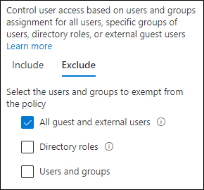

# Beleid voor het toestaan van toegang via gast en externe B2BPolicies for allowing guest and external B2B access

In dit artikel wordt uitgelegd hoe u de aanbevolen beleidsregels voor identiteit en Apparaattoegang aanpast om toegang te krijgen tot gast en externe gebruikers die een Azure Active Directory-Business-to-Business-account (B2B) bieden.This article describes how to adjust the recommended common identity and device access policies to allow access for guest and external users that have an Azure Active Directory (Azure AD) Business-to-Business (B2B) account. Deze richtlijnen zijn van toepassing op de [veelgebruikte beleidsregels voor identiteit en toegang tot apparaten](identity-access-policies.md).This guidance builds on the [common identity and device access policies](identity-access-policies.md).

Deze aanbevelingen zijn bedoeld om toe te passen op de **basis** niveau beveiliging.These recommendations are designed to apply to the **baseline** tier of protection. U kunt echter ook de aanbevelingen aanpassen op basis van de granulatie van uw behoeften voor **gevoelige** en **sterk gereguleerde** bescherming.However, you can also adjust the recommendations based on the granularity of your needs for **sensitive** and **highly regulated** protection.

Als u een pad opgeeft voor B2B-accounts voor verificatie met de Azure AD-Tenant, bieden deze accounts geen toegang tot uw gehele omgeving.Providing a path for B2B accounts to authenticate with your Azure AD tenant doesn't give these accounts access to your entire environment. B2B-gebruikers en hun accounts hebben alleen toegang tot de bronnen die met hen zijn gedeeld (zoals bestanden) binnen de services die zijn toegewezen aan voorwaardelijke toegangsbeleid.B2B users and their accounts only have access to resources that are shared with them (such as files) within the services granted in Conditional Access policies.

## Veelgebruikte beleidsregels bijwerken om gast en externe toegang toe te staan en te beschermenUpdating the common policies to allow and protect guest and external access

In het volgende diagram ziet u welke beleidsregels u toevoegt of bijwerkt in de algemene beleidsregels voor identiteit en Apparaattoegang om gast en externe toegang te beschermen met Azure AD B2B-accounts.To protect guest and external access with Azure AD B2B accounts, the following diagram illustrates which policies to add or update from the the common identity and device access policies.

[Een grotere versie van deze afbeelding weergevenSee a larger version of this image](https://github.com/MicrosoftDocs/microsoft-365-docs/raw/public/microsoft-365/media/microsoft-365-policies-configurations/identity-access-ruleset-guest.png)

In de volgende tabel vindt u een overzicht van de beleidsregels die u moet maken en bijwerken.The following table lists the policies you either need to create and update. De koppeling common policies naar de gekoppelde configuratie-instructies in het artikel [common Identity en Apparaattoegang-beleid](identity-access-policies.md) .The common policies link to the associated configuration instructions in the [Common identity and device access policies](identity-access-policies.md) article.

|BeveiligingsniveauProtection level|LijnenPolicies|Meer informatieMore information|
|---|---|---|
|**Basislijn****Baseline**|[MFA vereisen altijd voor gast en externe gebruikersRequire MFA always for guest and external users](identity-access-policies.md#require-mfa-based-on-sign-in-risk)|Maak dit nieuwe beleid en configureer de volgende opties:Create this new policy and configure: <ul><li> Voor **toewijzingen > gebruikers en groepen > toevoegen**, kiest **u gebruikers en groepen selecteren** en selecteert u vervolgens **alle gast en externe gebruikers**.For **Assignments > Users and groups > Include**, choose **Select users and groups**, and then select **All guest and external users**. </li><li> Voor **toewijzingen > voorwaarden > aanmelden**, schakelt u alle opties uit als u meervoudige verificatie (MFA) altijd wilt afdwingen.For **Assignments > Conditions > Sign-in**, leave all options unchecked to always enforce multi-factor authentication (MFA).</li>|
||[MFA vereisen wanneer het aanmeld risico *normaal* of *hoog* isRequire MFA when sign-in risk is *medium* or *high*](identity-access-policies.md#require-mfa-based-on-sign-in-risk)|Dit beleid wijzigen om gast en externe gebruikers uit te sluiten.Modify this policy to exclude guest and external users.|
||[Eis conforme pc’sRequire compliant PCs](identity-access-policies.md#require-compliant-pcs-but-not-compliant-phones-and-tablets)|Dit beleid wijzigen om gast en externe gebruikers uit te sluiten.Modify this policy to exclude guest and external users.|

Als u gast en externe gebruikers wilt opnemen in en uitsluiten van beleidsregels voor voorwaardelijke toegang voor **toewijzingen > gebruikers en groepen > toevoegen** of **uitsluiten**, controleert u **alle gast en externe gebruikers**.To include or exclude guest and external users in Conditional Access policies, for **Assignments > Users and groups > Include** or **Exclude**, check **All guest and external users**.

## Meer informatieMore information

### Gast en externe toegang met Microsoft teamsGuest and external access with Microsoft Teams

In Microsoft teams wordt het volgende gedefinieerd:Microsoft Teams defines the following:

- **Gasttoegang** maakt gebruik van een Azure AD B2B-account dat kan worden toegevoegd als lid van een team en gemachtigd zijn om toegang te krijgen tot de communicatie en de bronnen van het team.**Guest access** uses an Azure AD B2B account that can be added as a member of a team and have all permissioned access to the communications and resources of the team.

- **Externe toegang** is bedoeld voor externe gebruikers die geen B2B-account hebben.**External access** is for an external user that does not have a B2B account. Externe toegang omvat uitnodigingen en deelnemen aan gesprekken, chats en vergaderingen, maar omvat geen team lidmaatschap en toegang tot de bronnen van het team.External access can include invitations and participation in calls, chats, and meetings, but does not include team membership and access to the resources of the team.

Zie de [vergelijking tussen gast en externe toegang voor teams](https://docs.microsoft.com/microsoftteams/communicate-with-users-from-other-organizations#compare-external-and-guest-access)voor meer informatie.For more information, see the [comparison between guest and external access for teams](https://docs.microsoft.com/microsoftteams/communicate-with-users-from-other-organizations#compare-external-and-guest-access).

Beleidsregels voor voorwaardelijke toegang gelden alleen voor gasttoegang in teams omdat er een Azure AD B2B-account is.Conditional Access policies only apply to guest access in Teams because there is a corresponding Azure AD B2B account.

Raadpleeg [beleids aanbevelingen voor het beveiligen van teams-chats,-groepen en-bestanden](teams-access-policies.md) voor meer informatie over het beveiligen van identiteits-en Apparaattoegang voor teams.See [Policy recommendations for securing Teams chats, groups, and files](teams-access-policies.md) for more information about securing identity and device access policies for Teams.

### MFA vereisen altijd voor gast en externe gebruikersRequire MFA always for guest and external users

Dit beleid vraagt bezoekers zich voor MFA aan te melden bij uw Tenant, ongeacht of ze zich voor MFA registreren in hun thuis Tenant.This policy prompts guests to register for MFA in your tenant, regardless of whether they're registered for MFA in their home tenant. Bij het openen van bronnen in de Tenant zijn gast en externe gebruikers verplicht MFA te gebruiken voor elke aanvraag.When accessing resources in your tenant, guest and external users are required to use MFA for every request.

### Gast en externe gebruikers uitsluiten van MFA op basis van risicoExcluding guest and external users from risk-based MFA

Organisaties kunnen op basis van risico beleid voor B2B-gebruikers die gebruikmaken van Azure Active Directory-identiteitsbeveiliging, beperkingen instellen voor de implementatie van Azure AD-identiteitsbeveiliging voor B2B-samenwerkings gebruikers in een resource directory, omdat hun identiteit in hun basismap zich bevindt.While organizations can enforce risk-based policies for B2B users using Azure AD Identity Protection, there are limitations in the implementation of Azure AD Identity Protection for B2B collaboration users in a resource directory due to their identity existing in their home directory. Vanwege deze beperkingen adviseert Microsoft gastgebruikers uit te sluiten van op riskniveau MFA-beleidsregels en vragen deze gebruikers altijd MFA te gebruiken.Due to these limitations, Microsoft recommends you exclude guest users from risk-based MFA policies and require these users to always use MFA.

Zie [beperkingen van identiteits bescherming voor B2B-samenwerkings gebruikers](https://docs.microsoft.com/azure/active-directory/identity-protection/concept-identity-protection-b2b#limitations-of-identity-protection-for-b2b-collaboration-users)voor meer informatie.For more information, see [Limitations of Identity Protection for B2B collaboration users](https://docs.microsoft.com/azure/active-directory/identity-protection/concept-identity-protection-b2b#limitations-of-identity-protection-for-b2b-collaboration-users).

### Gebruikers van het beheer van apparaten zonder gast en externe gebruikers uitsluitenExcluding guest and external users from device management

Er kan slechts één organisatie een apparaat beheren.Only one organization can manage a device. Als u gast en externe gebruikers niet uitsluiten van beleidsregels waarvoor de naleving van een apparaat is vereist, blok keert dit beleid deze gebruikers.If you don't exclude guest and external users from policies that require device compliance, these policies will block these users.

## Volgende stapNext step

Beleidsregels voor voorwaardelijke toegang configureren voor:Configure Conditional Access policies for:

- [Microsoft TeamsMicrosoft Teams](teams-access-policies.md)
- [Exchange OnlineExchange Online](secure-email-recommended-policies.md)
- [SharePointSharePoint](sharepoint-file-access-policies.md)
