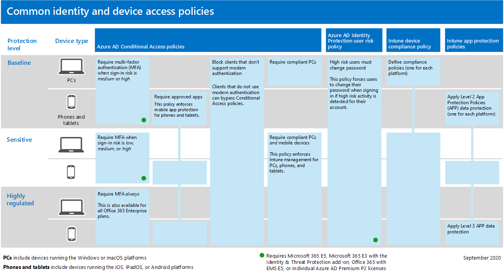

# Algemeen beleid voor identiteiten en apparaattoegangCommon identity and device access policies

**Van toepassing op****Applies to**
- [Exchange Online ProtectionExchange Online Protection](exchange-online-protection-overview.md)
- [Abonnement 1 en abonnement 2 voor Microsoft Defender voor Office 365Microsoft Defender for Office 365 plan 1 and plan 2](defender-for-office-365.md)
- AzureAzure

In dit artikel worden de algemene aanbevolen beleidsregels beschreven voor het beveiligen van toegang tot Microsoft 365 cloudservices, inclusief on-premises toepassingen die zijn gepubliceerd met Azure Active Directory (Azure AD) Application Proxy.This article describes the common recommended policies for securing access to Microsoft 365 cloud services, including on-premises applications published with Azure Active Directory (Azure AD) Application Proxy.

In deze richtlijn wordt besproken hoe u het aanbevolen beleid implementeert in een nieuwe omgeving.This guidance discusses how to deploy the recommended policies in a newly-provisioned environment. Als u dit beleid in een afzonderlijke labomgeving instelt, kunt u de aanbevolen beleidsregels begrijpen en evalueren voordat u de implementatie naar uw preproductie- en productieomgevingen organiseert.Setting up these policies in a separate lab environment allows you to understand and evaluate the recommended policies before staging the rollout to your preproduction and production environments. Uw nieuwe inrichtingsomgeving kan alleen in de cloud of hybride zijn om aan uw evaluatiebehoeften te voldoen.Your newly provisioned environment can be cloud-only or hybrid to reflect your evaluation needs.

## BeleidssetPolicy set

In het volgende diagram ziet u de aanbevolen set beleidsregels.The following diagram illustrates the recommended set of policies. Hier ziet u op welke beveiligingslaag elk beleid van toepassing is en of het beleid van toepassing is op pc's of telefoons en tablets, of beide categorieën apparaten.It shows which tier of protections each policy applies to and whether the policies apply to PCs or phones and tablets, or both categories of devices. Het geeft ook aan waar u dit beleid configureert.It also indicates where you configure these policies.

Hier volgt een PDF-overzicht van één pagina met koppelingen naar het afzonderlijke beleid:Here's a one-page PDF summary with links to the individual policies:

   [Weergeven als pdf-bestand](../../downloads/MSFT-cloud-architecture-identity-device-protection-handout.pdf) \| [Downloaden als PDF](https://github.com/MicrosoftDocs/microsoft-365-docs/raw/public/microsoft-365/downloads/MSFT-cloud-architecture-identity-device-protection-handout.pdf)[View as a PDF](../../downloads/MSFT-cloud-architecture-identity-device-protection-handout.pdf) \| [Download as a PDF](https://github.com/MicrosoftDocs/microsoft-365-docs/raw/public/microsoft-365/downloads/MSFT-cloud-architecture-identity-device-protection-handout.pdf)

In de rest van dit artikel wordt beschreven hoe u dit beleid configureert.The rest of this article describes how to configure these policies.

> [!NOTE]
> Het is raadzaam om het gebruik van meervoudige verificatie (MFA) te vereisen voordat u apparaten in Intune inschrijft om ervoor te zorgen dat het apparaat in het bezit is van de beoogde gebruiker.Requiring the use of multi-factor authentication (MFA) is recommended before enrolling devices in Intune to assure that the device is in the possession of the intended user. U moet apparaten registreren in Intune voordat u het nalevingsbeleid voor apparaten kunt afdwingen.You must enroll devices in Intune before you can enforce device compliance policies.

Om u de tijd te geven om deze taken uit te voeren, raden we u aan het basislijnbeleid in de volgorde in deze tabel te implementeren.To give you time to accomplish these tasks, we recommend implementing the baseline policies in the order listed in this table. Het MFA-beleid voor gevoelige en sterk gereguleerde beveiligingsniveaus kan echter op elk moment worden geïmplementeerd.However, the MFA policies for sensitive and highly regulated levels of protection can be implemented at any time.

|BeveiligingsniveauProtection level|BeleidPolicies|Meer informatieMore information|LicentiesLicensing|
|---|---|---|---|
|**Basislijn****Baseline**|[MFA vereisen wanneer het aanmeldingsrisico gemiddeld *of* *hoog* isRequire MFA when sign-in risk is *medium* or *high*](#require-mfa-based-on-sign-in-risk)||Microsoft 365 E5 of Microsoft 365 E3 met de E5-beveiligings-invoegingMicrosoft 365 E5 or Microsoft 365 E3 with the E5 Security add-on|
||[Clients blokkeren die moderne verificatie niet ondersteunenBlock clients that don't support modern authentication](#block-clients-that-dont-support-multi-factor)|Clients die geen moderne verificatie gebruiken, kunnen beleidsregels voor voorwaardelijke toegang omzeilen, dus het is belangrijk om deze te blokkeren.Clients that do not use modern authentication can bypass Conditional Access policies, so it's important to block these.|Microsoft 365 E3 of E5Microsoft 365 E3 or E5|
||[Gebruikers met een hoog risico moeten het wachtwoord wijzigenHigh risk users must change password](#high-risk-users-must-change-password)|Dwingt gebruikers hun wachtwoord te wijzigen wanneer ze zich aanmelden als er activiteit met een hoog risico wordt gedetecteerd voor hun account.Forces users to change their password when signing in if high-risk activity is detected for their account.|Microsoft 365 E5 of Microsoft 365 E3 met de E5-beveiligings-invoegingMicrosoft 365 E5 or Microsoft 365 E3 with the E5 Security add-on|
||[App-gegevensbescherming (Application Protection Policies) toepassenApply Application Protection Policies (APP) data protection](#apply-app-data-protection-policies)|Eén Intune App Protection-beleid per platform (Windows, iOS/iPadOS, Android).One Intune App Protection policy per platform (Windows, iOS/iPadOS, Android).|Microsoft 365 E3 of E5Microsoft 365 E3 or E5|
||[Goedgekeurde apps en app-beveiliging vereisenRequire approved apps and app protection](#require-approved-apps-and-app-protection)|Dwingt mobiele app-beveiliging af voor telefoons en tablets met iOS, iPadOS of Android.Enforces mobile app protection for phones and tablets using iOS, iPadOS, or Android.|Microsoft 365 E3 of E5Microsoft 365 E3 or E5|
||[Beleidsregels voor apparaat compliance definiërenDefine device compliance policies](#define-device-compliance-policies)|Eén beleid voor elk platform.One policy for each platform.|Microsoft 365 E3 of E5Microsoft 365 E3 or E5|
||[Eis conforme pc’sRequire compliant PCs](#require-compliant-pcs-but-not-compliant-phones-and-tablets)|Intune-beheer van pc's afdwingt met Windows of MacOS.Enforces Intune management of PCs using Windows or MacOS.|Microsoft 365 E3 of E5Microsoft 365 E3 or E5|
|**Gevoelig****Sensitive**|[MFA vereisen wanneer het aanmeldingsrisico *laag,* *gemiddeld* of *hoog is*Require MFA when sign-in risk is *low*, *medium*, or *high*](#require-mfa-based-on-sign-in-risk)||Microsoft 365 E5 of Microsoft 365 E3 met de E5-beveiligings-invoegingMicrosoft 365 E5 or Microsoft 365 E3 with the E5 Security add-on|
||[Compatibele pc's *en mobiele* apparaten vereisenRequire compliant PCs *and* mobile devices](#require-compliant-pcs-and-mobile-devices)|Intune-beheer wordt afgedwongen voor zowel pc's (Windows of MacOS) als telefoons of tablets (iOS, iPadOS of Android).Enforces Intune management for both PCs (Windows or MacOS) and phones or tablets (iOS, iPadOS, or Android).|Microsoft 365 E3 of E5Microsoft 365 E3 or E5|
|**Sterk gereglementeerd****Highly regulated**|[*Altijd* MFA vereisen*Always* require MFA](#assigning-policies-to-groups-and-users)||Microsoft 365 E3 of E5Microsoft 365 E3 or E5|
|

## Beleid toewijzen aan groepen en gebruikersAssigning policies to groups and users

Voordat u beleid configureert, identificeert u de Azure AD-groepen die u gebruikt voor elke beveiligingslaag.Before configuring policies, identify the Azure AD groups you are using for each tier of protection. Normaal gesproken geldt basislijnbeveiliging voor iedereen in de organisatie.Typically, baseline protection applies to everybody in the organization. Een gebruiker die is opgenomen voor zowel basislijn als gevoelige beveiliging, heeft alle basislijnbeleidsregels plus het gevoelige beleid toegepast.A user who is included for both baseline and sensitive protection will have all the baseline policies applied plus the sensitive policies. Beveiliging is cumulatief en het meest beperkende beleid wordt afgedwongen.Protection is cumulative and the most restrictive policy is enforced.

Een aanbevolen oefening is het maken van een Azure AD-groep voor uitsluiting van voorwaardelijke toegang.A recommended practice is to create an Azure AD group for Conditional Access exclusion. Voeg deze groep toe aan al uw beleidsregels voor Voorwaardelijke toegang in de instelling **Uitsluit** van de instelling **Gebruikers** en groepen in **de sectie** Toewijzingen.Add this group to all of your Conditional Access policies in the **Exclude** value of the **Users and groups** setting in the **Assignments** section. Dit geeft u een methode om toegang te bieden tot een gebruiker terwijl u toegangsproblemen oplost.This gives you a method to provide access to a user while you troubleshoot access issues. Dit wordt alleen aanbevolen als tijdelijke oplossing.This is recommended as a temporary solution only. Controleer deze groep op wijzigingen en zorg ervoor dat de uitsluitingsgroep alleen wordt gebruikt zoals bedoeld.Monitor this group for changes and be sure the exclusion group is being used only as intended.

Hier volgen een voorbeeld van groepstoewijzingen en uitsluitingen voor het vereisen van MFA.Here's an example of group assignment and exclusions for requiring MFA.

Hier zijn de resultaten:Here are the results:

- Alle gebruikers moeten MFA gebruiken wanneer het aanmeldingsrisico gemiddeld of hoog is.All users are required to use MFA when the sign-in risk is medium or high.

- Leden van de groep Leidinggevend personeel moeten MFA gebruiken wanneer het aanmeldingsrisico laag, gemiddeld of hoog is.Members of the Executive Staff group are required to use MFA when the sign-in risk is low, medium, or high.

  In dit geval komen leden van de groep Leidinggevend personeel overeen met zowel het basislijnbeleid als het gevoelige beleid Voorwaardelijke toegang.In this case, members of the Executive Staff group match both the baseline and sensitive Conditional Access policies. De toegangsbesturingselementen voor beide beleidsregels worden gecombineerd, wat in dit geval overeenkomt met het gevoelige beleid Voorwaardelijke toegang.The access controls for both policies are combined, which in this case is equivalent to the sensitive Conditional Access policy.

- Leden van de groep Top Secret Project X zijn altijd verplicht om MFA te gebruikenMembers of the Top Secret Project X group are always required to use MFA

  In dit geval komen leden van de groep Top Secret Project X overeen met zowel het basislijnbeleid als het sterk gereguleerde beleid voor voorwaardelijke toegang.In this case, members of the Top Secret Project X group match both the baseline and highly-regulated Conditional Access policies. De toegangsbesturingselementen voor beide beleidsregels worden gecombineerd.The access controls for both policies are combined. Omdat het toegangsbeheer voor het sterk gereguleerde beleid voor voorwaardelijke toegang restrictiever is, wordt het gebruikt.Because the access control for the highly-regulated Conditional Access policy is more restrictive, it is used.

Wees voorzichtig bij het toepassen van hogere beveiligingsniveaus op groepen en gebruikers.Be careful when applying higher levels of protection to groups and users. Leden van de groep Top Secret Project X moeten bijvoorbeeld MFA gebruiken telkens wanneer ze zich aanmelden, zelfs als ze niet werken aan de sterk gereguleerde inhoud voor Project X.For example, members of the Top Secret Project X group will be required to use MFA every time they sign in, even if they are not working on the highly-regulated content for Project X.

Alle Azure AD-groepen die als onderdeel van deze aanbevelingen zijn gemaakt, moeten worden gemaakt als Microsoft 365 groepen.All Azure AD groups created as part of these recommendations must be created as Microsoft 365 groups. Dit is belangrijk voor de implementatie van gevoeligheidslabels bij het beveiligen van documenten in Microsoft Teams en SharePoint.This is important for the deployment of sensitivity labels when securing documents in Microsoft Teams and SharePoint.

## MFA vereisen op basis van aanmeldingsrisicoRequire MFA based on sign-in risk

U moet uw gebruikers laten registreren voor MFA voordat ze het moeten gebruiken.You should have your users register for MFA prior to requiring its use. Als u Microsoft 365 E5, Microsoft 365 E3 met de E5-beveiligingsinvoegtekst, Office 365 met EMS E5 of afzonderlijke Azure AD Premium P2-licenties hebt, kunt u het MFA-registratiebeleid met Azure AD Identity Protection gebruiken om te vereisen dat gebruikers zich registreren voor MFA.If you have Microsoft 365 E5, Microsoft 365 E3 with the E5 Security add-on, Office 365 with EMS E5, or individual Azure AD Premium P2 licenses, you can use the MFA registration policy with Azure AD Identity Protection to require that users register for MFA. Het [vereiste werk omvat](identity-access-prerequisites.md) het registreren van alle gebruikers met MFA.The [prerequisite work](identity-access-prerequisites.md) includes registering all users with MFA.

Nadat uw gebruikers zijn geregistreerd, kunt u MFA vereisen voor aanmelding met een nieuw beleid voor voorwaardelijke toegang.After your users are registered, you can require MFA for sign-in with a new Conditional Access policy.

1. Ga naar de [Azure-portal](https://portal.azure.com)en meld u aan met uw referenties.Go to the [Azure portal](https://portal.azure.com), and sign in with your credentials.
2. Kies in de lijst met Azure-services **Azure Active Directory.**In the list of Azure services, choose **Azure Active Directory**.
3. Kies in **de** lijst Beheren **de** optie Beveiliging en kies vervolgens **Voorwaardelijke toegang.**In the **Manage** list, choose **Security**, and then choose **Conditional Access**.
4. Kies **Nieuw beleid** en typ de naam van het nieuwe beleid.Choose **New policy** and type the new policy's name.

In de volgende tabellen worden de beleidsinstellingen voor Voorwaardelijke toegang beschreven die MFA vereisen op basis van aanmeldingsrisico.The following tables describes the Conditional Access policy settings to require MFA based on sign-in risk.

In de **sectie Opdrachten:**In the **Assignments** section:

|InstellingSetting|EigenschappenProperties|WaardenValues|OpmerkingenNotes|
|---|---|---|---|
|Gebruikers en groepenUsers and groups|OpnemenInclude|**Selecteer gebruikers en groepen > Gebruikers en groepen:** Selecteer specifieke groepen met gerichte gebruikersaccounts.**Select users and groups > Users and groups**:  Select specific groups containing targeted user accounts.|Begin met de groep met testgebruikersaccounts.Start with the group that includes pilot user accounts.|
||UitsluitenExclude|**Gebruikers en groepen:** selecteer de uitzonderingsgroep Voorwaardelijke toegang; serviceaccounts (app-identiteiten).**Users and groups**: Select your Conditional Access exception group; service accounts (app identities).|Lidmaatschap moet worden gewijzigd op een zo nodig, tijdelijke basis.Membership should be modified on an as-needed, temporary basis.|
|Cloud-apps of -actiesCloud apps or actions|**Cloud-apps > Include****Cloud apps > Include**|**Apps selecteren:** selecteer de apps op wie u dit beleid wilt toepassen.**Select apps**: Select the apps you want this policy to apply to. Selecteer bijvoorbeeld Exchange Online.For example, select Exchange Online.||
|VoorwaardenConditions|||Configureer voorwaarden die specifiek zijn voor uw omgeving en behoeften.Configure conditions that are specific to your environment and needs.|
||AanmeldingsrisicoSign-in risk||Zie de richtlijnen in de volgende tabel.See the guidance in the following table.|
|

### Instellingen voor aanmeldingsrisicoSign-in risk condition settings

Pas de instellingen voor risiconiveau toe op basis van het beveiligingsniveau dat u wilt instellen.Apply the risk level settings based on the protection level you are targeting.

|Niveau van beveiligingLevel of protection|Waarden op risiconiveau die nodig zijnRisk level values needed|ActieAction|
|---|---|---|
|BasislijnBaseline|Hoog, gemiddeldHigh, medium|Controleer beide.Check both.|
|GevoeligSensitive|Hoog, gemiddeld, laagHigh, medium, low|Controleer alle drie.Check all three.|
|Sterk gereglementeerdHighly regulated||Laat alle opties uitgeschakeld om MFA altijd af te dwingen.Leave all options unchecked to always enforce MFA.|
|

In de **sectie Besturingselementen van Access:**In the **Access controls** section:

|InstellingSetting|EigenschappenProperties|WaardenValues|ActieAction|
|---|---|---|---|
|GrantGrant|**Grant access****Grant access**||SelecteerSelect|
|||**Meervoudige verificatie vereisen****Require Multi-factor authentication**|ChequeCheck|
||**Alle geselecteerde besturingselementen vereisen****Require all the selected controls**||SelecteerSelect|
|

Kies **Selecteren om** de instellingen voor verlenen op **te** slaan.Choose **Select** to save the **Grant** settings.

Selecteer ten slotte **Aan** voor **beleid inschakelen** en kies vervolgens **Maken.**Finally, select **On** for **Enable policy**, and then choose **Create**.

U kunt ook het hulpprogramma [Wat als gebruiken](/azure/active-directory/active-directory-conditional-access-whatif) om het beleid te testen.Also consider using the [What if](/azure/active-directory/active-directory-conditional-access-whatif) tool to test the policy.

## Clients blokkeren die geen ondersteuning bieden voor meerdere factorenBlock clients that don't support multi-factor

Gebruik de instellingen in deze tabellen voor een beleid voor Voorwaardelijke toegang om clients te blokkeren die geen ondersteuning bieden voor meervoudige verificatie.Use the settings in these tables for a Conditional Access policy to block clients that don't support multi-factor authentication.

Zie [dit artikel voor](../../enterprise/microsoft-365-client-support-multi-factor-authentication.md) een lijst met clients in Microsoft 365 die meervoudige verificatie ondersteunen.See [this article](../../enterprise/microsoft-365-client-support-multi-factor-authentication.md) for a list of clients in Microsoft 365 that do support multi-factor authentication.

In de **sectie Opdrachten:**In the **Assignments** section:

|InstellingSetting|EigenschappenProperties|WaardenValues|OpmerkingenNotes|
|---|---|---|---|
|Gebruikers en groepenUsers and groups|OpnemenInclude|**Selecteer gebruikers en groepen > Gebruikers en groepen:** Selecteer specifieke groepen met gerichte gebruikersaccounts.**Select users and groups > Users and groups**:  Select specific groups containing targeted user accounts.|Begin met de groep met testgebruikersaccounts.Start with the group that includes pilot user accounts.|
||UitsluitenExclude|**Gebruikers en groepen:** selecteer de uitzonderingsgroep Voorwaardelijke toegang; serviceaccounts (app-identiteiten).**Users and groups**: Select your Conditional Access exception group; service accounts (app identities).|Lidmaatschap moet worden gewijzigd op een zo nodig, tijdelijke basis.Membership should be modified on an as-needed, temporary basis.|
|Cloud-apps of -actiesCloud apps or actions|**Cloud-apps > Include****Cloud apps > Include**|**Selecteer apps:** Selecteer de apps die overeenkomen met de clients die geen ondersteuning bieden voor moderne verificatie.**Select apps**: Select the apps corresponding to the clients that do not support modern authentication.||
|VoorwaardenConditions|**Client-apps****Client apps**|Kies **Ja** voor **configureren**Choose **Yes** for **Configure** 
 De vinkjes voor **browser-** en **mobiele apps en desktopcl** clients verwijderenClear the check marks for **Browser** and **Mobile apps and desktop clients**||
|

In de **sectie Besturingselementen van Access:**In the **Access controls** section:

|InstellingSetting|EigenschappenProperties|WaardenValues|ActieAction|
|---|---|---|---|
|GrantGrant|**Toegang blokkeren****Block access**||SelecteerSelect|
||**Alle geselecteerde besturingselementen vereisen****Require all the selected controls**||SelecteerSelect|
|

Kies **Selecteren om** de instellingen voor verlenen op **te** slaan.Choose **Select** to save the **Grant** settings.

Selecteer ten slotte **Aan** voor **beleid inschakelen** en kies vervolgens **Maken.**Finally, select **On** for **Enable policy**, and then choose **Create**.

U kunt het hulpprogramma [Wat als gebruiken](/azure/active-directory/active-directory-conditional-access-whatif) om het beleid te testen.Consider using the [What if](/azure/active-directory/active-directory-conditional-access-whatif) tool to test the policy.

Voor Exchange Online kunt u verificatiebeleid gebruiken om basisverificatie uit te [schakelen,](/exchange/clients-and-mobile-in-exchange-online/disable-basic-authentication-in-exchange-online)waardoor alle aanvragen voor clienttoegang moderne verificatie moeten gebruiken.For Exchange Online, you can use authentication policies to [disable Basic authentication](/exchange/clients-and-mobile-in-exchange-online/disable-basic-authentication-in-exchange-online), which forces all client access requests to use modern authentication.

## Gebruikers met een hoog risico moeten het wachtwoord wijzigenHigh risk users must change password

Als u ervoor wilt zorgen dat de gecompromitteerde accounts van alle gebruikers met een hoog risico worden gedwongen een wachtwoordwijziging uit te voeren wanneer u zich aanmeldt, moet u het volgende beleid toepassen.To ensure that all high-risk users' compromised accounts are forced to perform a password change when signing-in, you must apply the following policy.

Meld u aan bij [de https://portal.azure.com) Microsoft Azure portal (](https://portal.azure.com/) met uw beheerdersreferenties en navigeer vervolgens naar **Azure AD Identity Protection > Gebruikersrisicobeleid**.Log in to the [Microsoft Azure portal (https://portal.azure.com)](https://portal.azure.com/) with your administrator credentials, and then navigate to **Azure AD Identity Protection > User Risk Policy**.

In de **sectie Opdrachten:**In the **Assignments** section:

|TypeType|EigenschappenProperties|WaardenValues|ActieAction|
|---|---|---|---|
|GebruikersUsers|OpnemenInclude|**Alle gebruikers****All users**|SelecteerSelect|
|GebruikersrisicoUser risk|**Hoog****High**||SelecteerSelect|
|

In de tweede **sectie Opdrachten:**In the second **Assignments** section:

|TypeType|EigenschappenProperties|WaardenValues|ActieAction|
|---|---|---|---|
|ToegangAccess|**Toegang toestaan****Allow access**||SelecteerSelect|
|||**Wachtwoordwijziging vereisen****Require password change**|ChequeCheck|
|

Kies **Klaar om** de **Access-instellingen op te** slaan.Choose **Done** to save the **Access** settings.

Selecteer ten slotte **Aan** voor **afdwingen beleid** en kies vervolgens **Opslaan.**Finally, select **On** for **Enforce policy**, and then choose **Save**.

U kunt het hulpprogramma [Wat als gebruiken](/azure/active-directory/active-directory-conditional-access-whatif) om het beleid te testen.Consider using the [What if](/azure/active-directory/active-directory-conditional-access-whatif) tool to test the policy.

Gebruik dit beleid in combinatie met [Azure AD-wachtwoordbeveiliging](/azure/active-directory/authentication/concept-password-ban-bad)configureren, waarmee bekende zwakke wachtwoorden en hun varianten en aanvullende zwakke termen worden gedetecteerd en blokkeert die specifiek zijn voor uw organisatie.Use this policy in conjunction with [Configure Azure AD password protection](/azure/active-directory/authentication/concept-password-ban-bad), which detects and blocks known weak passwords and their variants and additional weak terms that are specific to your organization. Als u Azure AD-wachtwoordbeveiliging gebruikt, zorgt u ervoor dat gewijzigde wachtwoorden sterke wachtwoorden zijn.Using Azure AD password protection ensures that changed passwords are strong ones.

## APP-beleid voor gegevensbescherming toepassenApply APP data protection policies

APP's definiëren welke apps zijn toegestaan en welke acties ze kunnen uitvoeren met de gegevens van uw organisatie.APPs define which apps are allowed and the actions they can take with your organization's data. Met de beschikbare opties in APP kunnen organisaties de beveiliging aanpassen aan hun specifieke behoeften.The choices available in APP enable organizations to tailor the protection to their specific needs. Voor sommige is het mogelijk niet duidelijk welke beleidsinstellingen nodig zijn om een volledig scenario te implementeren.For some, it may not be obvious which policy settings are required to implement a complete scenario. Om organisaties te helpen prioriteit te geven aan het uitharden van mobiele client-eindpunten, heeft Microsoft taxonomie geïntroduceerd voor het APP-gegevensbeveiligingskader voor het beheer van mobiele apps voor iOS en Android.To help organizations prioritize mobile client endpoint hardening, Microsoft has introduced taxonomy for its APP data protection framework for iOS and Android mobile app management.

Het FRAMEWORK VOOR APP-gegevensbescherming is ingedeeld in drie verschillende configuratieniveaus, met elk niveau dat van het vorige niveau is afgebouwd:The APP data protection framework is organized into three distinct configuration levels, with each level building off the previous level:

- **Enterprise Basic Data Protection** (niveau 1) zorgt ervoor dat apps worden beveiligd met een pincode en versleuteld zijn en selectieve veegbewerkingen uitvoeren.**Enterprise basic data protection** (Level 1) ensures that apps are protected with a PIN and encrypted and performs selective wipe operations. Voor Android-apparaten valideert dit niveau de bevestiging van Android-apparaten.For Android devices, this level validates Android device attestation. Dit is een configuratie op invoerniveau die vergelijkbare gegevensbescherming biedt in Exchange Online postvakbeleid en WAARMEE IT en de gebruikerspopulatie app worden gebruikt.This is an entry level configuration that provides similar data protection control in Exchange Online mailbox policies and introduces IT and the user population to APP.
- **Enterprise enhanced data protection** (Level 2) introduces APP data leakage prevention mechanisms and minimum OS requirements.**Enterprise enhanced data protection** (Level 2) introduces APP data leakage prevention mechanisms and minimum OS requirements. Dit is de configuratie die van toepassing is op de meeste mobiele gebruikers die toegang hebben tot werk- of schoolgegevens.This is the configuration that is applicable to most mobile users accessing work or school data.
- **Enterprise High Data Protection** (niveau 3) introduceert geavanceerde mechanismen voor gegevensbeveiliging, verbeterde pincodeconfiguratie en APP Mobile Threat Defense.**Enterprise high data protection** (Level 3) introduces advanced data protection mechanisms, enhanced PIN configuration, and APP Mobile Threat Defense. Deze configuratie is wenselijk voor gebruikers die toegang hebben tot gegevens met een hoog risico.This configuration is desirable for users that are accessing high risk data.

Als u de specifieke aanbevelingen wilt zien voor elk configuratieniveau en de minimale apps die moeten worden beveiligd, bekijkt u Het kader voor gegevensbescherming met behulp van beleid voor [app-beveiliging.](/mem/intune/apps/app-protection-framework)To see the specific recommendations for each configuration level and the minimum apps that must be protected, review [Data protection framework using app protection policies](/mem/intune/apps/app-protection-framework).

Met behulp van de principes die worden beschreven in configuraties voor [identiteits-](microsoft-365-policies-configurations.md)en apparaattoegang, worden de beveiligingslagen Basislijn en Gevoelige beveiliging nauw verbonden met de verbeterde instellingen voor gegevensbescherming op niveau 2.Using the principles outlined in [Identity and device access configurations](microsoft-365-policies-configurations.md), the Baseline and Sensitive protection tiers map closely with the Level 2 enterprise enhanced data protection settings. De hooggeguleerde beveiligingslaag wordt nauw verbonden met de instellingen voor hoge gegevensbescherming van het bedrijf niveau 3.The Highly regulated protection tier maps closely to the Level 3 enterprise high data protection settings.

|BeveiligingsniveauProtection level|App-beveiligingsbeleidApp Protection Policy|Meer informatieMore information|
|---|---|---|
|BasislijnBaseline|[Verbeterde gegevensbescherming op niveau 2Level 2 enhanced data protection](/mem/intune/apps/app-protection-framework#level-2-enterprise-enhanced-data-protection)|De beleidsinstellingen die in niveau 2 zijn afgedwongen, bevatten alle beleidsinstellingen die worden aanbevolen voor niveau 1 en worden alleen toegevoegd aan of bijgewerkt aan de onderstaande beleidsinstellingen om meer besturingselementen en een geavanceerdere configuratie dan niveau 1 te implementeren.The policy settings enforced in level 2 include all the policy settings recommended for level 1 and only adds to or updates the below policy settings to implement more controls and a more sophisticated configuration than level 1.|
|GevoeligSensitive|[Verbeterde gegevensbescherming op niveau 2Level 2 enhanced data protection](/mem/intune/apps/app-protection-framework#level-2-enterprise-enhanced-data-protection)|De beleidsinstellingen die in niveau 2 zijn afgedwongen, bevatten alle beleidsinstellingen die worden aanbevolen voor niveau 1 en worden alleen toegevoegd aan of bijgewerkt aan de onderstaande beleidsinstellingen om meer besturingselementen en een geavanceerdere configuratie dan niveau 1 te implementeren.The policy settings enforced in level 2 include all the policy settings recommended for level 1 and only adds to or updates the below policy settings to implement more controls and a more sophisticated configuration than level 1.|
|Sterk gereguleerdHighly Regulated|[Niveau 3 enterprise high data protectionLevel 3 enterprise high data protection](/mem/intune/apps/app-protection-framework#level-3-enterprise-high-data-protection)|De beleidsinstellingen die in niveau 3 zijn afgedwongen, bevatten alle beleidsinstellingen die worden aanbevolen voor niveau 1 en 2 en worden alleen toegevoegd aan of bijgewerkt aan de onderstaande beleidsinstellingen om meer besturingselementen en een geavanceerdere configuratie dan niveau 2 te implementeren.The policy settings enforced in level 3 include all the policy settings recommended for level 1 and 2 and only adds to or updates the below policy settings to implement more controls and a more sophisticated configuration than level 2.|
|

Als u een nieuw beleid voor app-beveiliging wilt maken voor elk platform (iOS en Android) binnen Microsoft Endpoint Manager met de instellingen voor het gegevensbeveiligingskader, kunt u het volgende doen:To create a new app protection policy for each platform (iOS and Android) within Microsoft Endpoint Manager using the data protection framework settings, you can:

1. Maak het beleid handmatig door de stappen te volgen in Het maken en implementeren van app-beveiligingsbeleid [met Microsoft Intune.](/mem/intune/apps/app-protection-policies)Manually create the policies by following the steps in [How to create and deploy app protection policies with Microsoft Intune](/mem/intune/apps/app-protection-policies).
2. Importeer de [voorbeeld-Intune App Protection Policy Configuration Framework JSON-sjablonen](https://github.com/microsoft/Intune-Config-Frameworks/tree/master/AppProtectionPolicies) [met PowerShell-scripts van Intune.](https://github.com/microsoftgraph/powershell-intune-samples)Import the sample [Intune App Protection Policy Configuration Framework JSON templates](https://github.com/microsoft/Intune-Config-Frameworks/tree/master/AppProtectionPolicies) with [Intune's PowerShell scripts](https://github.com/microsoftgraph/powershell-intune-samples).

## Goedgekeurde apps en APP-beveiliging vereisenRequire approved apps and APP protection

Als u het APP-beveiligingsbeleid wilt afdwingen dat u hebt toegepast in Intune, moet u een beleid voor voorwaardelijke toegang maken om goedgekeurde client-apps en de voorwaarden te vereisen die zijn ingesteld in het APP-beveiligingsbeleid.To enforce the APP protection policies you applied in Intune, you must create a Conditional Access policy to require approved client apps and the conditions set in the APP protection policies.

Voor het afdwingen van app-beveiligingsbeleid is een set beleidsregels vereist die worden beschreven in App-beveiligingsbeleid vereisen voor toegang tot [cloud-apps met voorwaardelijke toegang.](/azure/active-directory/conditional-access/app-protection-based-conditional-access)Enforcing APP protection policies requires a set of policies described in in [Require app protection policy for cloud app access with Conditional Access](/azure/active-directory/conditional-access/app-protection-based-conditional-access). Dit beleid wordt elk opgenomen in deze aanbevolen set identiteits- en toegangsconfiguratiebeleid.These policies are each included in this recommended set of identity and access configuration policies.

Als u het beleid voor voorwaardelijke toegang wilt maken waarvoor goedgekeurde apps en APP-beveiliging vereist zijn, volgt u 'Stap 1: Configure an Azure AD Conditional Access policy for Microsoft 365' in [Scenario 1: Microsoft 365 apps](/azure/active-directory/conditional-access/app-protection-based-conditional-access#scenario-1-office-365-apps-require-approved-apps-with-app-protection-policies)require approved apps with app protection policies , which allows Outlook for iOS and Android, but blocks OAuth capable Exchange ActiveSync clients from connecting to Exchange Online.To create the Conditional Access policy that requires approved apps and APP protection, follow "Step 1: Configure an Azure AD Conditional Access policy for Microsoft 365" in [Scenario 1: Microsoft 365 apps require approved apps with app protection policies](/azure/active-directory/conditional-access/app-protection-based-conditional-access#scenario-1-office-365-apps-require-approved-apps-with-app-protection-policies), which allows Outlook for iOS and Android, but blocks OAuth capable Exchange ActiveSync clients from connecting to Exchange Online.

   > [!NOTE]
   > Dit beleid zorgt ervoor dat mobiele gebruikers toegang hebben tot alle Office eindpunten met de toepasselijke apps.This policy ensures mobile users can access all Office endpoints using the applicable apps.

Als u mobiele toegang tot Exchange Online inschakelen, implementeert u [Block ActiveSync-clients,](secure-email-recommended-policies.md#block-activesync-clients)waardoor Exchange ActiveSync clients die gebruikmaken van basisverificatie, geen verbinding kunnen maken met Exchange Online.If you are enabling mobile access to Exchange Online, implement [Block ActiveSync clients](secure-email-recommended-policies.md#block-activesync-clients), which prevents Exchange ActiveSync clients leveraging basic authentication from connecting to Exchange Online. Dit beleid wordt niet in de afbeelding boven aan dit artikel beschreven.This policy is not pictured in the illustration at the top of this article. Het wordt beschreven en afgebeeld in [beleidsaanbevelingen voor het beveiligen van e-mail.](secure-email-recommended-policies.md)It is described and pictured in [Policy recommendations for securing email](secure-email-recommended-policies.md).

Als u het beleid Voorwaardelijke toegang wilt maken waarvoor Edge voor iOS en Android vereist is, volgt u 'Stap 2: Een Azure AD Conditional Access-beleid configureren voor Microsoft 365' in scenario [2: Browser-apps](/azure/active-directory/conditional-access/app-protection-based-conditional-access#scenario-2-browser-apps-require-approved-apps-with-app-protection-policies)vereisen goedgekeurde apps met app-beveiligingsbeleid, waarmee Edge voor iOS en Android kan worden ondersteund, maar andere webbrowsers op mobiele apparaten geen verbinding maken met Microsoft 365-eindpunten.To create the Conditional Access policy that requires Edge for iOS and Android, follow "Step 2: Configure an Azure AD Conditional Access policy for Microsoft 365" in [Scenario 2: Browser apps require approved apps with app protection policies](/azure/active-directory/conditional-access/app-protection-based-conditional-access#scenario-2-browser-apps-require-approved-apps-with-app-protection-policies), which allows Edge for iOS and Android, but blocks other mobile device web browsers from connecting to Microsoft 365 endpoints.

 Deze beleidsregels maken gebruik van de [grant-besturingselementen Vereist goedgekeurde client-app](/azure/active-directory/conditional-access/concept-conditional-access-grant#require-approved-client-app) en [Beleid voor app-beveiliging vereisen.](/azure/active-directory/conditional-access/concept-conditional-access-grant#require-app-protection-policy)These policies leverage the grant controls [Require approved client app](/azure/active-directory/conditional-access/concept-conditional-access-grant#require-approved-client-app) and [Require app protection policy](/azure/active-directory/conditional-access/concept-conditional-access-grant#require-app-protection-policy).

Ten slotte zorgt het blokkeren van oudere verificatie voor andere client-apps op iOS- en Android-apparaten ervoor dat deze clients beleidsregels voor voorwaardelijke toegang niet kunnen omzeilen.Finally, blocking legacy authentication for other client apps on iOS and Android devices ensures that these clients cannot bypass Conditional Access policies. Als u de richtlijnen in dit artikel volgt, hebt u Al [Block-clients](#block-clients-that-dont-support-multi-factor)geconfigureerd die geen ondersteuning bieden voor moderne verificatie.If you're following the guidance in this article, you've already configured [Block clients that don't support modern authentication](#block-clients-that-dont-support-multi-factor).

<!---
With Conditional Access, organizations can restrict access to approved (modern authentication capable) iOS and Android client apps with Intune app protection policies applied to them. Several Conditional Access policies are required, with each policy targeting all potential users. Details on creating these policies can be found in [Require app protection policy for cloud app access with Conditional Access](/azure/active-directory/conditional-access/app-protection-based-conditional-access).

1. Follow "Step 1: Configure an Azure AD Conditional Access policy for Microsoft 365" in [Scenario 1: Microsoft 365 apps require approved apps with app protection policies](/azure/active-directory/conditional-access/app-protection-based-conditional-access#scenario-1-office-365-apps-require-approved-apps-with-app-protection-policies), which allows Outlook for iOS and Android, but blocks OAuth capable Exchange ActiveSync clients from connecting to Exchange Online.

   > [!NOTE]
   > This policy ensures mobile users can access all Office endpoints using the applicable apps.

2. If enabling mobile access to Exchange Online, implement [Block ActiveSync clients](secure-email-recommended-policies.md#block-activesync-clients), which prevents Exchange ActiveSync clients leveraging basic authentication from connecting to Exchange Online.

   The above policies leverage the grant controls [Require approved client app](/azure/active-directory/conditional-access/concept-conditional-access-grant#require-approved-client-app) and [Require app protection policy](/azure/active-directory/conditional-access/concept-conditional-access-grant#require-app-protection-policy).

3. Disable legacy authentication for other client apps on iOS and Android devices. For more information, see [Block clients that don't support modern authentication](#block-clients-that-dont-support-modern-authentication).
-->

## Beleidsregels voor apparaat compliance definiërenDefine device-compliance policies

Apparaatconforme beleidsregels definiëren de vereisten waar apparaten aan moeten voldoen om te worden bepaald als compatibel.Device-compliance policies define the requirements that devices must meet to be determined as compliant. U maakt Intune-beleid voor apparaat compliance vanuit het Microsoft Endpoint Manager beheercentrum.You create Intune device compliance policies from within the Microsoft Endpoint Manager admin center.

U moet een beleid maken voor elk pc-, telefoon- of tabletplatform:You must create a policy for each PC, phone, or tablet platform:

- Android-apparaatbeheerderAndroid device administrator
- Android EnterpriseAndroid Enterprise
- iOS/iPadOSiOS/iPadOS
- macOSmacOS
- Windows 8.1 en hogerWindows 8.1 and later
- Windows 10 en hogerWindows 10 and later

Als u beleidsregels voor apparaat compliance wilt maken, meld u zich aan [bij het Microsoft Endpoint Manager beheercentrum](https://endpoint.microsoft.com) met uw beheerdersreferenties en gaat u naar **Beleidsregels** voor apparaten \>  \> **compliancebeleid.**To create device compliance policies, log in to the [Microsoft Endpoint Manager Admin Center](https://endpoint.microsoft.com) with your administrator credentials, and then navigate to **Devices** \> **Compliance policies** \> **Policies**. Selecteer **Beleid maken.**Select **Create Policy**.

Als u beleidsregels voor apparaat compliance wilt geïmplementeerd, moeten ze worden toegewezen aan gebruikersgroepen.For device compliance policies to be deployed, they must be assigned to user groups. U wijst een beleid toe nadat u het hebt maken en opslaan.You assign a policy after you create and save it. Selecteer in het beheercentrum het beleid en selecteer **vervolgens Toewijzingen.**In the admin center, select the policy and then select **Assignments**. Nadat u de groepen hebt geselecteerd die u het beleid wilt ontvangen, **selecteert** u Opslaan om die groepstoewijzing op te slaan en het beleid te implementeren.After selecting the groups that you want to receive the policy, select **Save** to save that group assignment and deploy the policy.

Zie Een compliancebeleid maken in Microsoft Intune in de Intune-documentatie voor [stapsgewijse](/mem/intune/protect/create-compliance-policy) richtlijnen voor het maken van compliancebeleid in Intune.For step-by-step guidance on creating compliance policies in Intune, see [Create a compliance policy in Microsoft Intune](/mem/intune/protect/create-compliance-policy) in the Intune documentation.

### Aanbevolen instellingen voor Windows 10 en hogerRecommended settings for Windows 10 and later

De volgende instellingen worden aanbevolen voor pc's met Windows 10 en hoger, zoals geconfigureerd in stap **2: Nalevingsinstellingen**, van het proces voor het maken van beleid.The following settings are recommended for PCs running Windows 10 and later, as configured in **Step 2: Compliance settings**, of the policy creation process.

Zie **deze tabel voor > Windows evaluatieregels** voor gezondheidsattests.For **Device health > Windows Health Attestation Service evaluation rules**, see this table.

|EigenschappenProperties|WaardeValue|ActieAction|
|---|---|---|
|Vereist BitLockerRequire BitLocker|VereisenRequire|SelecteerSelect|
|Secure Boot vereisen om te worden ingeschakeld op het apparaatRequire Secure Boot to be enabled on the device|VereisenRequire|SelecteerSelect|
|Codeintegriteit vereisenRequire code integrity|VereisenRequire|SelecteerSelect|
|

Geef **voor Apparaateigenschappen** de juiste waarden op voor besturingssysteemversies op basis van uw IT- en beveiligingsbeleid.For **Device properties**, specify appropriate values for operating system versions based on your IT and security policies.

Selecteer Vereisen voor compliance door **Configuration Manager.**For **Configuration Manager Compliance**, select **Require**.

Zie **deze tabel voor** systeembeveiliging.For **System security**, see this table.

|TypeType|EigenschappenProperties|WaardeValue|ActieAction|
|---|---|---|---|
|WachtwoordPassword|Een wachtwoord vereisen om mobiele apparaten te ontgrendelenRequire a password to unlock mobile devices|VereisenRequire|SelecteerSelect|
||Eenvoudige wachtwoordenSimple passwords|BlokkerenBlock|SelecteerSelect|
||WachtwoordtypePassword type|Apparaat standaardDevice default|SelecteerSelect|
||Minimale wachtwoordlengteMinimum password length|66|TypeType|
||Maximumminuten van inactiviteit voordat wachtwoord is vereistMaximum minutes of inactivity before password is required|1515|TypeType 
 Deze instelling wordt ondersteund voor Android-versies 4.0 en hoger of KNOX 4.0 en hoger.This setting is supported for Android versions 4.0 and above or KNOX 4.0 and above. Voor iOS-apparaten wordt deze ondersteund voor iOS 8.0 en hoger.For iOS devices, it's supported for iOS 8.0 and above.|
||Wachtwoordverloop (dagen)Password expiration (days)|4141|TypeType|
||Aantal eerdere wachtwoorden om hergebruik te voorkomenNumber of previous passwords to prevent reuse|55|TypeType|
||Wachtwoord vereisen wanneer het apparaat terugkomt uit de niet-actieve status (mobiel en holografische toestand)Require password when device returns from idle state (Mobile and Holographic)|VereisenRequire|Beschikbaar voor Windows 10 en hogerAvailable for Windows 10 and later|
|VersleutelingEncryption|Versleuteling van gegevensopslag op apparaatEncryption of data storage on device|VereisenRequire|SelecteerSelect|
|ApparaatbeveiligingDevice Security|FirewallFirewall|VereisenRequire|SelecteerSelect|
||AntivirusAntivirus|VereisenRequire|SelecteerSelect|
||AntispywareAntispyware|VereisenRequire|SelecteerSelect 
 Voor deze instelling is een anti-spywareoplossing vereist die is geregistreerd bij Windows-beveiliging Center.This setting requires an Anti-Spyware solution registered with Windows Security Center.|
|DefenderDefender|Microsoft Defender AntimalwareMicrosoft Defender Antimalware|VereisenRequire|SelecteerSelect|
||Microsoft Defender Antimalware minimumversieMicrosoft Defender Antimalware minimum version||TypeType 
 Alleen ondersteund voor Windows 10 bureaublad.Only supported for Windows 10 desktop. Microsoft raadt versies aan die niet meer dan vijf van de meest recente versie achterblijven.Microsoft recommends versions no more than five behind from the most recent version.|
||Microsoft Defender Antimalware-handtekening up-to-dateMicrosoft Defender Antimalware signature up to date|VereisenRequire|SelecteerSelect|
||Realtime beveiligingReal-time protection|VereisenRequire|SelecteerSelect 
 Alleen ondersteund voor Windows 10 bureaubladOnly supported for Windows 10 desktop|
|

#### Microsoft Defender voor EindpuntMicrosoft Defender for Endpoint

|TypeType|EigenschappenProperties|WaardeValue|ActieAction|
|---|---|---|---|
|Microsoft Defender voor eindpuntregels in het Microsoft Endpoint Manager beheercentrumMicrosoft Defender for Endpoint rules in the Microsoft Endpoint Manager admin center|[Vereisen dat het apparaat zich op of onder de machinerisicoscoreRequire the device to be at or under the machine-risk score](/mem/intune/protect/advanced-threat-protection-configure#create-and-assign-compliance-policy-to-set-device-risk-level)|GemiddeldMedium|SelecteerSelect|
|

## Compatibele pc's vereisen (maar niet compatibele telefoons en tablets)Require compliant PCs (but not compliant phones and tablets)

Voordat u een beleid toevoegt om compatibele pc's te vereisen, moet u uw apparaten registreren voor beheer in Intune.Before adding a policy to require compliant PCs, be sure to enroll your devices for management in Intune. Het is raadzaam meervoudige verificatie te gebruiken voordat u apparaten inschrijft bij Intune om te garanderen dat het apparaat in het bezit is van de beoogde gebruiker.Using multi-factor authentication is recommended before enrolling devices into Intune for assurance that the device is in the possession of the intended user.

Compatibele pc's vereisen:To require compliant PCs:

1. Ga naar de [Azure-portal](https://portal.azure.com)en meld u aan met uw referenties.Go to the [Azure portal](https://portal.azure.com), and sign in with your credentials.
2. Kies in de lijst met Azure-services **Azure Active Directory.**In the list of Azure services, choose **Azure Active Directory**.
3. Kies in **de** lijst Beheren **de** optie Beveiliging en kies vervolgens **Voorwaardelijke toegang.**In the **Manage** list, choose **Security**, and then choose **Conditional Access**.
4. Kies **Nieuw beleid** en typ de naam van het nieuwe beleid.Choose **New policy** and type the new policy's name.

5. Kies **onder Opdrachten** de optie Gebruikers en **groepen** en vermeld op wie u het beleid wilt toepassen.Under **Assignments**, choose **Users and groups** and include who you want the policy to apply to. Sluit ook de uitsluitingsgroep Voorwaardelijke toegang uit.Also exclude your Conditional Access exclusion group.

6. Kies **onder Opdrachten** de optie **Cloud-apps of -acties.**Under **Assignments**, choose **Cloud apps or actions**.

7. Kies **voor** Opnemen de **optie Apps > Selecteren** en selecteer vervolgens de gewenste apps in de lijst met **cloud-apps.**For **Include**, choose **Select apps > Select**, and then select the desired apps from the **Cloud apps** list. Selecteer bijvoorbeeld Exchange Online.For example, select Exchange Online. Kies **Selecteren** wanneer u klaar bent.Choose **Select** when done.

8. Als u compatibele pc's (maar niet compatibele telefoons en tablets) wilt vereisen, kiest u onder Opdrachten de optie **Voorwaarden > Apparaatplatforms.**To require compliant PCs (but not compliant phones and tablets), under **Assignments**, choose **Conditions > Device platforms**. Selecteer **Ja** voor **configureren.**Select **Yes** for **Configure**. Kies **Apparaatplatforms selecteren,** selecteer **Windows** **en macOS** en kies vervolgens **Klaar.**Choose  **Select device platforms**, select **Windows** and **macOS**, and then choose **Done**.

9. Kies **onder Access-besturingselementen** de optie **Grant** .Under **Access controls**, choose **Grant** .

10. Kies **Toegang verlenen en** controleer vervolgens Apparaat vereisen dat moet worden gemarkeerd als **compatibel**.Choose **Grant access** and then check **Require device to be marked as compliant**. Selecteer Alle geselecteerde besturingselementen vereisen voor meerdere **besturingselementen.**For multiple controls, select **Require all the selected controls**. Als u klaar is, kiest u **Selecteren.**When complete, choose **Select**.

11. Selecteer **Aan** voor **beleid inschakelen** en kies vervolgens **Maken.**Select **On** for **Enable policy**, and then choose **Create**.

> [!NOTE]
> Zorg ervoor dat uw apparaat voldoet voordat u dit beleid inschakelen.Make sure that your device is compliant before enabling this policy. Anders kunt u niet meer worden vergrendeld en kunt u dit beleid pas wijzigen als uw gebruikersaccount is toegevoegd aan de uitsluitingsgroep Voorwaardelijke toegang.Otherwise, you could get locked out and will be unable to change this policy until your user account has been added to the Conditional Access exclusion group.

## Compatibele pc's *en mobiele* apparaten vereisenRequire compliant PCs *and* mobile devices

Naleving vereisen voor alle apparaten:To require compliance for all devices:

1. Ga naar de [Azure-portal](https://portal.azure.com)en meld u aan met uw referenties.Go to the [Azure portal](https://portal.azure.com), and sign in with your credentials.
2. Kies in de lijst met Azure-services **Azure Active Directory.**In the list of Azure services, choose **Azure Active Directory**.
3. Kies in **de** lijst Beheren **de** optie Beveiliging en kies vervolgens **Voorwaardelijke toegang.**In the **Manage** list, choose **Security**, and then choose **Conditional Access**.
4. Kies **Nieuw beleid** en typ de naam van het nieuwe beleid.Choose **New policy** and type the new policy's name.

5. Kies **onder Opdrachten** de optie Gebruikers en **groepen** en vermeld op wie u het beleid wilt toepassen.Under **Assignments**, choose **Users and groups** and include who you want the policy to apply to. Sluit ook de uitsluitingsgroep Voorwaardelijke toegang uit.Also exclude your Conditional Access exclusion group.

6. Kies **onder Opdrachten** de optie **Cloud-apps of -acties.**Under **Assignments**, choose **Cloud apps or actions**.

7. Kies **voor** Opnemen de **optie Apps > Selecteren** en selecteer vervolgens de gewenste apps in de lijst met **cloud-apps.**For **Include**, choose **Select apps > Select**, and then select the desired apps from the **Cloud apps** list. Selecteer bijvoorbeeld Exchange Online.For example, select Exchange Online. Kies **Selecteren** wanneer u klaar bent.Choose **Select** when done.

8. Kies **onder Access-besturingselementen** de optie **Grant** .Under **Access controls**, choose **Grant** .

9. Kies **Toegang verlenen en** controleer vervolgens Apparaat vereisen dat moet worden gemarkeerd als **compatibel**.Choose **Grant access** and then check **Require device to be marked as compliant**. Selecteer Alle geselecteerde besturingselementen vereisen voor meerdere **besturingselementen.**For multiple controls, select **Require all the selected controls**. Als u klaar is, kiest u **Selecteren.**When complete, choose **Select**.

10. Selecteer **Aan** voor **beleid inschakelen** en kies vervolgens **Maken.**Select **On** for **Enable policy**, and then choose **Create**.

> [!NOTE]
> Zorg ervoor dat uw apparaat voldoet voordat u dit beleid inschakelen.Make sure that your device is compliant before enabling this policy. Anders kunt u niet meer worden vergrendeld en kunt u dit beleid pas wijzigen als uw gebruikersaccount is toegevoegd aan de uitsluitingsgroep Voorwaardelijke toegang.Otherwise, you could get locked out and will be unable to change this policy until your user account has been added to the Conditional Access exclusion group.

## Volgende stapNext step

[Meer informatie over beleidsaanbevelingen voor gast- en externe gebruikersLearn about policy recommendations for guest and external users](identity-access-policies-guest-access.md)