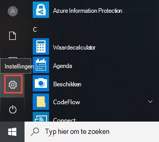
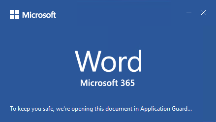

# <a name="application-guard-for-office-for-admins"></a><span data-ttu-id="1cd82-105">Application Guard voor Office voor beheerders</span><span class="sxs-lookup"><span data-stu-id="1cd82-105">Application Guard for Office for admins</span></span>

<span data-ttu-id="1cd82-106">**Van toepassing op:** Word, Excel en PowerPoint voor Microsoft 365, Windows 10 Enterprise</span><span class="sxs-lookup"><span data-stu-id="1cd82-106">**Applies to:** Word, Excel, and PowerPoint for Microsoft 365, Windows 10 Enterprise</span></span>

<span data-ttu-id="1cd82-107">Microsoft Defender Application Guard voor Office (Application Guard voor Office) helpt voorkomen dat niet-vertrouwde bestanden toegang krijgen tot vertrouwde bronnen, zodat uw bedrijf veilig blijft voor nieuwe en nieuwe aanvallen.</span><span class="sxs-lookup"><span data-stu-id="1cd82-107">Microsoft Defender Application Guard for Office (Application Guard for Office) helps prevent untrusted files from accessing trusted resources, keeping your enterprise safe from new and emerging attacks.</span></span> <span data-ttu-id="1cd82-108">In dit artikel worden beheerders beschreven bij het instellen van apparaten voor een preview van Application Guard voor Office.</span><span class="sxs-lookup"><span data-stu-id="1cd82-108">This article walks admins through setting up devices for a preview of Application Guard for Office.</span></span> <span data-ttu-id="1cd82-109">Het artikel bevat informatie over systeemvereisten en installatiestappen om Application Guard voor Office op een apparaat in teschakelen.</span><span class="sxs-lookup"><span data-stu-id="1cd82-109">It provides information about system requirements and installation steps to enable Application Guard for Office on a device.</span></span>

## <a name="prerequisites"></a><span data-ttu-id="1cd82-110">Vereisten</span><span class="sxs-lookup"><span data-stu-id="1cd82-110">Prerequisites</span></span>

### <a name="minimum-hardware-requirements"></a><span data-ttu-id="1cd82-111">Minimale hardwarevereisten</span><span class="sxs-lookup"><span data-stu-id="1cd82-111">Minimum hardware requirements</span></span>

* <span data-ttu-id="1cd82-112">**CPU:** 64-bits, 4-cores (fysiek of virtueel), virtualisatieextensies (Intel VT-x OR AMD-V), Core i5-equivalent of hoger aanbevolen</span><span class="sxs-lookup"><span data-stu-id="1cd82-112">**CPU**: 64-bit, 4 cores (physical or virtual), virtualization extensions (Intel VT-x OR AMD-V), Core i5 equivalent or higher recommended</span></span>
* <span data-ttu-id="1cd82-113">**Fysiek geheugen**: 8 GB RAM</span><span class="sxs-lookup"><span data-stu-id="1cd82-113">**Physical memory**: 8-GB RAM</span></span>
* <span data-ttu-id="1cd82-114">**Harde schijf:** 10 GB beschikbare ruimte op het systeemstation (SSD aanbevolen)</span><span class="sxs-lookup"><span data-stu-id="1cd82-114">**Hard disk**: 10 GB of free space on the system drive (SSD recommended)</span></span>

### <a name="minimum-software-requirements"></a><span data-ttu-id="1cd82-115">Minimale softwarevereisten</span><span class="sxs-lookup"><span data-stu-id="1cd82-115">Minimum software requirements</span></span>

* <span data-ttu-id="1cd82-116">**Windows 10**: Windows 10 Enterprise edition, Client Build versie 2004 (20H1) build 19041 of hoger</span><span class="sxs-lookup"><span data-stu-id="1cd82-116">**Windows 10**: Windows 10 Enterprise edition, Client Build version 2004 (20H1) build 19041 or later</span></span>
* <span data-ttu-id="1cd82-117">**Office:** Office Current-kanaal build versie 2011 16.0.13530.10000 of hoger.</span><span class="sxs-lookup"><span data-stu-id="1cd82-117">**Office**: Office Current Channel Build version 2011 16.0.13530.10000 or later.</span></span> <span data-ttu-id="1cd82-118">Zowel 32 bits- als 64 bitsversies van Office worden ondersteund.</span><span class="sxs-lookup"><span data-stu-id="1cd82-118">Both 32-bit and 64-bit versions of Office are supported.</span></span>
* <span data-ttu-id="1cd82-119">**Updatepakket:** Windows 10 cumulatieve maandelijkse beveiligingsupdate [KB4571756](https://support.microsoft.com/help/4571756/windows-10-update-KB4571756)</span><span class="sxs-lookup"><span data-stu-id="1cd82-119">**Update package**: Windows 10 cumulative monthly security update [KB4571756](https://support.microsoft.com/help/4571756/windows-10-update-KB4571756)</span></span>

<span data-ttu-id="1cd82-120">Raadpleeg de systeemvereisten voor Microsoft Defender Application Guard voor gedetailleerde [systeemvereisten.](https://docs.microsoft.com/windows/security/threat-protection/microsoft-defender-application-guard/reqs-md-app-guard)</span><span class="sxs-lookup"><span data-stu-id="1cd82-120">For detailed system requirements, refer to [System requirements for Microsoft Defender Application Guard](https://docs.microsoft.com/windows/security/threat-protection/microsoft-defender-application-guard/reqs-md-app-guard).</span></span> <span data-ttu-id="1cd82-121">Zie Overzicht van updatekanalen voor Microsoft 365 voor meer informatie over [Office-updatekanalen.](https://docs.microsoft.com/deployoffice/overview-update-channels)</span><span class="sxs-lookup"><span data-stu-id="1cd82-121">To learn more about Office update channels, see [Overview of update channels for Microsoft 365](https://docs.microsoft.com/deployoffice/overview-update-channels).</span></span>

### <a name="licensing-requirements"></a><span data-ttu-id="1cd82-122">Licentievereisten</span><span class="sxs-lookup"><span data-stu-id="1cd82-122">Licensing requirements</span></span>

* <span data-ttu-id="1cd82-123">Microsoft 365 E5 of Microsoft 365 E5-beveiliging</span><span class="sxs-lookup"><span data-stu-id="1cd82-123">Microsoft 365 E5 or Microsoft 365 E5 Security</span></span>

## <a name="deploy-application-guard-for-office"></a><span data-ttu-id="1cd82-124">Application Guard implementeren voor Office</span><span class="sxs-lookup"><span data-stu-id="1cd82-124">Deploy Application Guard for Office</span></span>

### <a name="enable-application-guard-for-office"></a><span data-ttu-id="1cd82-125">Application Guard inschakelen voor Office</span><span class="sxs-lookup"><span data-stu-id="1cd82-125">Enable Application Guard for Office</span></span>

1. <span data-ttu-id="1cd82-126">Download en installeer **windows 10 cumulatieve maandelijkse beveiligingsupdates KB4571756.**</span><span class="sxs-lookup"><span data-stu-id="1cd82-126">Download and install **Windows 10 cumulative monthly security updates KB4571756**.</span></span>

2. <span data-ttu-id="1cd82-127">Selecteer **Microsoft Defender Application Guard onder** Windows-functies en selecteer **OK.**</span><span class="sxs-lookup"><span data-stu-id="1cd82-127">Select **Microsoft Defender Application Guard** under Windows Features and  select **OK**.</span></span> <span data-ttu-id="1cd82-128">Als u de functie Application Guard inschakelen, wordt het systeem opnieuw opgestart.</span><span class="sxs-lookup"><span data-stu-id="1cd82-128">Enabling the Application Guard feature will prompt a system reboot.</span></span> <span data-ttu-id="1cd82-129">U kunt ervoor kiezen om nu opnieuw op te starten of na stap 3.</span><span class="sxs-lookup"><span data-stu-id="1cd82-129">You can choose to reboot now or after step 3.</span></span>

   

   <span data-ttu-id="1cd82-131">De functie kan ook worden ingeschakeld door de volgende PowerShell-opdracht als administrator uit te voeren:</span><span class="sxs-lookup"><span data-stu-id="1cd82-131">The feature can also be enabled by running the following PowerShell command as administrator:</span></span>

   ```powershell
   Enable-WindowsOptionalFeature -online -FeatureName Windows-Defender-ApplicationGuard
   ```

3. <span data-ttu-id="1cd82-132">Zoek naar **Microsoft Defender Application Guard in de beheerde modus,** een groepsbeleid in beheersjablonen voor **computerconfiguratie \\ \\ Windows-onderdelen \\ Microsoft Defender Application Guard.**</span><span class="sxs-lookup"><span data-stu-id="1cd82-132">Search for **Microsoft Defender Application Guard in Managed Mode**, a group policy in **Computer Configuration\\Administrative Templates\\Windows Components\\Microsoft Defender Application Guard**.</span></span> <span data-ttu-id="1cd82-133">Schakel dit beleid in door de waarde onder Opties in te stellen als **2** of **3** en vervolgens **OK** of Toepassen te **selecteren.**</span><span class="sxs-lookup"><span data-stu-id="1cd82-133">Turn on this policy by setting the value under Options as **2** or **3**, and then selecting **OK** or **Apply**.</span></span>

   

   <span data-ttu-id="1cd82-135">In plaats daarvan kunt u het bijbehorende CSP-beleid instellen:</span><span class="sxs-lookup"><span data-stu-id="1cd82-135">Instead, you can set the corresponding CSP policy:</span></span>

   > <span data-ttu-id="1cd82-136">OMA-URI: **./Device/Vendor/MSFT/WindowsDefenderApplicationGuard/Settings/AllowWindowsDefenderApplicationGuard**</span><span class="sxs-lookup"><span data-stu-id="1cd82-136">OMA-URI: **./Device/Vendor/MSFT/WindowsDefenderApplicationGuard/Settings/AllowWindowsDefenderApplicationGuard**</span></span> <br> <span data-ttu-id="1cd82-137">Gegevenstype: **Geheel getal**</span><span class="sxs-lookup"><span data-stu-id="1cd82-137">Data type: **Integer**</span></span> <br> <span data-ttu-id="1cd82-138">Waarde: **2**</span><span class="sxs-lookup"><span data-stu-id="1cd82-138">Value: **2**</span></span>

4. <span data-ttu-id="1cd82-139">Start het systeem opnieuw op.</span><span class="sxs-lookup"><span data-stu-id="1cd82-139">Restart the system.</span></span>

### <a name="set-diagnostics--feedback-to-send-full-data"></a><span data-ttu-id="1cd82-140">Diagnostische gegevens instellen & feedback om volledige gegevens te verzenden</span><span class="sxs-lookup"><span data-stu-id="1cd82-140">Set Diagnostics & feedback to send full data</span></span>

<span data-ttu-id="1cd82-141">Deze stap zorgt ervoor dat Microsoft wordt bereikt met de gegevens die nodig zijn voor het identificeren en oplossen van problemen.</span><span class="sxs-lookup"><span data-stu-id="1cd82-141">This step ensures that the data necessary to identify and fix problems is reaching Microsoft.</span></span> <span data-ttu-id="1cd82-142">Volg deze stappen om diagnostische gegevens in teschakelen op uw Windows-apparaat:</span><span class="sxs-lookup"><span data-stu-id="1cd82-142">Follow these steps to enable diagnostics on your Windows device:</span></span>

1. <span data-ttu-id="1cd82-143">Open **Instellingen** vanuit het Startmenu.</span><span class="sxs-lookup"><span data-stu-id="1cd82-143">Open **Settings** from the Start menu.</span></span>

   

2. <span data-ttu-id="1cd82-145">Selecteer **Privacy in Windows-instellingen.** </span><span class="sxs-lookup"><span data-stu-id="1cd82-145">On **Windows Settings**, select **Privacy**.</span></span>

   

3. <span data-ttu-id="1cd82-147">Selecteer Onder Privacy de **optie Diagnostische & feedback** en selecteer **Optionele diagnostische gegevens.**</span><span class="sxs-lookup"><span data-stu-id="1cd82-147">Under Privacy, select **Diagnostics & feedback** and select **Optional diagnostic data**.</span></span>

   

<span data-ttu-id="1cd82-149">Raadpleeg de diagnostische windows-gegevens in uw organisatie configureren voor meer informatie over het configureren van de diagnostische instellingen [van Windows.](https://docs.microsoft.com/windows/privacy/configure-windows-diagnostic-data-in-your-organization#enterprise-management)</span><span class="sxs-lookup"><span data-stu-id="1cd82-149">For more on configuring Windows diagnostic settings, refer to [Configuring Windows diagnostic data in your organization](https://docs.microsoft.com/windows/privacy/configure-windows-diagnostic-data-in-your-organization#enterprise-management).</span></span>

### <a name="confirm-that-application-guard-for-office-is-enabled-and-working"></a><span data-ttu-id="1cd82-150">Controleren of Application Guard voor Office is ingeschakeld en werkt</span><span class="sxs-lookup"><span data-stu-id="1cd82-150">Confirm that Application Guard for Office is enabled and working</span></span>

<span data-ttu-id="1cd82-151">Start Word, Excel of PowerPoint op een apparaat waarop het beleid is geïmplementeerd voordat u bevestigt dat Application Guard voor Office is ingeschakeld.</span><span class="sxs-lookup"><span data-stu-id="1cd82-151">Before confirming that Application Guard for Office is enabled, launch Word, Excel, or PowerPoint on a device where the policies have been deployed.</span></span> <span data-ttu-id="1cd82-152">Zorg ervoor dat Office is geactiveerd.</span><span class="sxs-lookup"><span data-stu-id="1cd82-152">Make sure Office is activated.</span></span> <span data-ttu-id="1cd82-153">Mogelijk moet u uw werkidentiteit gebruiken om het Office-product eerst te activeren.</span><span class="sxs-lookup"><span data-stu-id="1cd82-153">You may need to use your work identity to activate the Office product first.</span></span>

<span data-ttu-id="1cd82-154">Om te bevestigen dat Application Guard voor Office is ingeschakeld, start u Word, Excel of PowerPoint en opent u vervolgens een niet-vertrouwd document.</span><span class="sxs-lookup"><span data-stu-id="1cd82-154">To confirm that Application Guard for Office is enabled, launch Word, Excel, or PowerPoint, and then open an untrusted document.</span></span> <span data-ttu-id="1cd82-155">U kunt bijvoorbeeld een document openen dat is gedownload van internet of een e-mailbijlage van iemand buiten uw organisatie.</span><span class="sxs-lookup"><span data-stu-id="1cd82-155">For example, you can open a document that was downloaded from the internet or an email attachment from someone outside your organization.</span></span>

<span data-ttu-id="1cd82-156">Wanneer u een niet-vertrouwd bestand voor het eerst opent, ziet u mogelijk een welkomstscherm van Office zoals in het volgende voorbeeld.</span><span class="sxs-lookup"><span data-stu-id="1cd82-156">When you first open an untrusted file, you may see an Office splash screen like the following example.</span></span> <span data-ttu-id="1cd82-157">Deze wordt mogelijk enige tijd weergegeven terwijl Application Guard voor Office wordt geactiveerd en het bestand wordt geopend.</span><span class="sxs-lookup"><span data-stu-id="1cd82-157">It might be displayed for some time while Application Guard for Office is being activated and the file is being opened.</span></span> <span data-ttu-id="1cd82-158">De volgende openen van niet-vertrouwde bestanden zouden sneller moeten zijn.</span><span class="sxs-lookup"><span data-stu-id="1cd82-158">Subsequent openings of untrusted files should be faster.</span></span>



<span data-ttu-id="1cd82-160">Bij het openen moet het bestand een paar visuele indicatoren weergeven dat het bestand is geopend in Application Guard voor Office:</span><span class="sxs-lookup"><span data-stu-id="1cd82-160">Upon being opened, the file should display a few visual indicators that the file was opened inside Application Guard for Office:</span></span>

* <span data-ttu-id="1cd82-161">Een bijroep op het lint</span><span class="sxs-lookup"><span data-stu-id="1cd82-161">A callout in the ribbon</span></span>

  

* <span data-ttu-id="1cd82-163">Het toepassingspictogram met een schild op de taakbalk</span><span class="sxs-lookup"><span data-stu-id="1cd82-163">The application icon with a shield in the taskbar</span></span>

  

## <a name="configure-application-guard-for-office"></a><span data-ttu-id="1cd82-165">Application Guard configureren voor Office</span><span class="sxs-lookup"><span data-stu-id="1cd82-165">Configure Application Guard for Office</span></span>

<span data-ttu-id="1cd82-166">Office ondersteunt de volgende beleidsregels waarmee u de mogelijkheden van Application Guard voor Office kunt configureren.</span><span class="sxs-lookup"><span data-stu-id="1cd82-166">Office supports the following policies to enable you to configure the capabilities of Application Guard for Office.</span></span> <span data-ttu-id="1cd82-167">Dit beleid kan worden geconfigureerd via groepsbeleid of via de Office-cloudbeleidsservice.</span><span class="sxs-lookup"><span data-stu-id="1cd82-167">These policies can be configured through Group policies or through the Office cloud policy service.</span></span>

> [!NOTE]
> <span data-ttu-id="1cd82-168">Als u dit beleid configureert, kunnen sommige functies worden uitgeschakeld voor bestanden die worden geopend in Application Guard voor Office.</span><span class="sxs-lookup"><span data-stu-id="1cd82-168">Configuring these policies can disable some functionalities for files opened in Application Guard for Office.</span></span>

|<span data-ttu-id="1cd82-169">Beleid</span><span class="sxs-lookup"><span data-stu-id="1cd82-169">Policy</span></span>|<span data-ttu-id="1cd82-170">Beschrijving</span><span class="sxs-lookup"><span data-stu-id="1cd82-170">Description</span></span>|
|---|---|
|<span data-ttu-id="1cd82-171">Application Guard niet gebruiken voor Office</span><span class="sxs-lookup"><span data-stu-id="1cd82-171">Don't use Application Guard for Office</span></span>|<span data-ttu-id="1cd82-172">Als u dit beleid inschakelen, wordt in Word, Excel en PowerPoint de isolatiecontainer beveiligde weergave gebruikt in plaats van Application Guard voor Office.</span><span class="sxs-lookup"><span data-stu-id="1cd82-172">Enabling this policy will force Word, Excel, and PowerPoint to use the Protected View isolation container instead of Application Guard for Office.</span></span> <span data-ttu-id="1cd82-173">Dit beleid kan worden gebruikt om Application Guard tijdelijk uit te schakelen voor Office als er problemen zijn met het inschakelen van Het inschakelen voor Microsoft Edge.</span><span class="sxs-lookup"><span data-stu-id="1cd82-173">This policy can be used to temporarily disable Application Guard for Office when there are issues in leaving it enabled for Microsoft Edge.</span></span>|
|<span data-ttu-id="1cd82-174">Application Guard voor het maken van office-containers configureren</span><span class="sxs-lookup"><span data-stu-id="1cd82-174">Configure Application Guard for Office container pre-creation</span></span>|<span data-ttu-id="1cd82-175">Dit beleid bepaalt of de Application Guard voor Office-container voor het isoleren van niet-vertrouwde bestanden vooraf is gemaakt voor betere run time-prestaties.</span><span class="sxs-lookup"><span data-stu-id="1cd82-175">This policy determines if the Application Guard for Office container, for isolating untrusted files, is pre-created for improved run-time performance.</span></span> <span data-ttu-id="1cd82-176">Als u deze instelling inschakelen, kunt u het aantal dagen opgeven dat een container nog moet worden gemaakt of de container vooraf laten maken door de ingebouwde heuristische functie van Office.</span><span class="sxs-lookup"><span data-stu-id="1cd82-176">If you enable this setting, you can specify the number of days to continue pre-creating a container or let the Office built-in heuristic pre-create the container.</span></span>
|<span data-ttu-id="1cd82-177">Kopiëren/plakken niet toestaan voor Office-documenten die zijn geopend in Application Guard voor Office</span><span class="sxs-lookup"><span data-stu-id="1cd82-177">Don't allow copy/paste for Office documents opened in Application Guard for Office</span></span>|<span data-ttu-id="1cd82-178">Als u dit beleid inschakelen, kan een gebruiker geen inhoud kopiëren en kopiëren uit een document dat is geopend in Application Guard voor Office naar een document dat daarbuiten is geopend.</span><span class="sxs-lookup"><span data-stu-id="1cd82-178">Enabling this policy will prevent a user from copying and pasting content from a document opened in Application Guard for Office to a document opened outside of it.</span></span>|
|<span data-ttu-id="1cd82-179">Hardwareversnelling uitschakelen in Application Guard voor Office</span><span class="sxs-lookup"><span data-stu-id="1cd82-179">Disable hardware acceleration in Application Guard for Office</span></span>|<span data-ttu-id="1cd82-180">Dit beleid bepaalt of Application Guard voor Office hardwareversnelling gebruikt om afbeeldingen weer te geven.</span><span class="sxs-lookup"><span data-stu-id="1cd82-180">This policy controls whether Application Guard for Office uses hardware acceleration to render graphics.</span></span> <span data-ttu-id="1cd82-181">Als u deze instelling inschakelen, maakt Application Guard voor Office gebruik van renderen op basis van software (CPU) en worden grafische stuurprogramma's van derden niet geladen en wordt er geen interactie mogelijk met verbonden grafische hardware.</span><span class="sxs-lookup"><span data-stu-id="1cd82-181">If you enable this setting, Application Guard for Office uses software-based (CPU) rendering and won't load any third-party graphics drivers or interact with any connected graphics hardware.</span></span>
|<span data-ttu-id="1cd82-182">Niet-ondersteunde bestandstypenbeveiliging uitschakelen in Application Guard voor Office</span><span class="sxs-lookup"><span data-stu-id="1cd82-182">Disable unsupported file types protection in Application Guard for Office</span></span>|<span data-ttu-id="1cd82-183">Met dit beleid wordt bepaald of in Application Guard voor Office niet-ondersteunde bestandstypen niet kunnen worden geopend of dat de omleiding naar de beveiligde weergave wordt ingeschakeld.</span><span class="sxs-lookup"><span data-stu-id="1cd82-183">This policy controls whether Application Guard for Office will block unsupported file types from being opened or if it will enable the redirection to Protected View.</span></span>
|<span data-ttu-id="1cd82-184">Camera- en microfoontoegang uitschakelen voor documenten die worden geopend in Application Guard voor Office</span><span class="sxs-lookup"><span data-stu-id="1cd82-184">Turn off camera and microphone access for documents opened in Application Guard for Office</span></span>|<span data-ttu-id="1cd82-185">Als u dit beleid inschakelen, wordt office-toegang tot de camera en microfoon in Application Guard voor Office verwijderd.</span><span class="sxs-lookup"><span data-stu-id="1cd82-185">Enabling this policy will remove Office access to the camera and microphone inside Application Guard for Office.</span></span>|
|<span data-ttu-id="1cd82-186">Afdrukken beperken vanuit documenten die zijn geopend in Application Guard voor Office</span><span class="sxs-lookup"><span data-stu-id="1cd82-186">Restrict printing from documents opened in Application Guard for Office</span></span>|<span data-ttu-id="1cd82-187">Als u dit beleid inschakelen, beperkt u de printers waarmee een gebruiker kan afdrukken vanuit een bestand dat is geopend in Application Guard voor Office.</span><span class="sxs-lookup"><span data-stu-id="1cd82-187">Enabling this policy will limit the printers that a user can print to from a file opened in Application Guard for Office.</span></span> <span data-ttu-id="1cd82-188">U kunt dit beleid bijvoorbeeld gebruiken om gebruikers te beperken om alleen af te drukken naar PDF.</span><span class="sxs-lookup"><span data-stu-id="1cd82-188">For example, you can use this policy to restrict users to only print to PDF.</span></span>|
|<span data-ttu-id="1cd82-189">Voorkomen dat gebruikers Application Guard voor Office-beveiliging voor bestanden verwijderen</span><span class="sxs-lookup"><span data-stu-id="1cd82-189">Prevent users from removing Application Guard for Office protection on files</span></span>|<span data-ttu-id="1cd82-190">Als u dit beleid inschakelen, wordt de optie (binnen de Office-toepassingservaring) verwijderd om Application Guard voor Office-beveiliging uit te schakelen of om een bestand te openen buiten Application Guard voor Office.</span><span class="sxs-lookup"><span data-stu-id="1cd82-190">Enabling this policy will remove the option (within the Office application experience) to disable Application Guard for Office protection or to open a file outside Application Guard for Office.</span></span> <p> <span data-ttu-id="1cd82-191">**Opmerking:** Gebruikers kunnen dit beleid nog steeds omzeilen door de eigenschap Mark-of-the-Web handmatig uit het bestand te verwijderen of door een document naar een vertrouwde locatie te verplaatsen.</span><span class="sxs-lookup"><span data-stu-id="1cd82-191">**Note:** Users can still bypass this policy by manually removing the mark-of-the-web property from the file or by moving a document to a Trusted location.</span></span>|
|

> [!NOTE]
> <span data-ttu-id="1cd82-192">Voor het volgende beleid moet de gebruiker zich afloggen en zich opnieuw aanmelden bij Windows om van kracht te worden:</span><span class="sxs-lookup"><span data-stu-id="1cd82-192">The following policies will require the user to sign out and sign in again to Windows to take effect:</span></span>
>
> * <span data-ttu-id="1cd82-193">Kopiëren/plakken uitschakelen voor documenten die zijn geopend in Application Guard voor Office</span><span class="sxs-lookup"><span data-stu-id="1cd82-193">Disable copy/paste for documents opened in Application Guard for Office</span></span>
> * <span data-ttu-id="1cd82-194">Afdrukken beperken voor documenten die zijn geopend in Application Guard voor Office</span><span class="sxs-lookup"><span data-stu-id="1cd82-194">Restrict printing for documents opened in Application Guard for Office</span></span>
> * <span data-ttu-id="1cd82-195">Camera- en microfoontoegang uitschakelen voor documenten die zijn geopend in Application Guard voor Office</span><span class="sxs-lookup"><span data-stu-id="1cd82-195">Turn off camera and mic access to documents opened in Application Guard for Office</span></span>

## <a name="submit-feedback"></a><span data-ttu-id="1cd82-196">Feedback verzenden</span><span class="sxs-lookup"><span data-stu-id="1cd82-196">Submit feedback</span></span>

### <a name="submit-feedback-via-feedback-hub"></a><span data-ttu-id="1cd82-197">Feedback verzenden via de Feedback-hub</span><span class="sxs-lookup"><span data-stu-id="1cd82-197">Submit feedback via Feedback Hub</span></span>

<span data-ttu-id="1cd82-198">Als u problemen ondervindt bij het starten van Application Guard voor Office, wordt u aangeraden uw feedback in te dienen via de Feedback-hub:</span><span class="sxs-lookup"><span data-stu-id="1cd82-198">If you encounter any issues when launching Application Guard for Office, you're encouraged to submit your feedback via Feedback Hub:</span></span>

1. <span data-ttu-id="1cd82-199">Open de **app Feedback-hub** en meld u aan.</span><span class="sxs-lookup"><span data-stu-id="1cd82-199">Open the **Feedback Hub app** and sign in.</span></span>

2. <span data-ttu-id="1cd82-200">Als er een dialoogvenster met fouten wordt weergegeven bij het starten van Application Guard, selecteert u Rapporteren bij **Microsoft** in het dialoogvenster fout om een nieuwe feedback-inzending te starten.</span><span class="sxs-lookup"><span data-stu-id="1cd82-200">If you get an error dialog while launching Application Guard, select **Report to Microsoft** in the error dialog to start a new feedback submission.</span></span> <span data-ttu-id="1cd82-201">Anders navigeert u naar de juiste categorie voor Application Guard en selecteert u nieuwe <https://aka.ms/mdagoffice-fb> **+ &nbsp; feedback toevoegen** in de rechterboventoepassing.</span><span class="sxs-lookup"><span data-stu-id="1cd82-201">Otherwise, navigate to <https://aka.ms/mdagoffice-fb> to select the correct category for Application Guard, then select **+&nbsp;Add new feedback** near the top right.</span></span>

3. <span data-ttu-id="1cd82-202">Voer een samenvatting in het **vak Uw feedback** samenvatten als dit nog niet voor u is ingevuld.</span><span class="sxs-lookup"><span data-stu-id="1cd82-202">Enter a summary in the **Summarize your feedback** box if it isn't already filled in for you.</span></span>

4. <span data-ttu-id="1cd82-203">Voer een gedetailleerde beschrijving in van het probleem dat u hebt ervaren en welke stappen u hebt ondernomen in het vak **Meer** informatie. Selecteer vervolgens **Volgende.**</span><span class="sxs-lookup"><span data-stu-id="1cd82-203">Enter a detailed description of the issue that you experienced and what steps you took in the **Explain in more detail** box, then select **Next**.</span></span>

5. <span data-ttu-id="1cd82-204">Selecteer de bel naast **Probleem.**</span><span class="sxs-lookup"><span data-stu-id="1cd82-204">Select the bubble next to **Problem**.</span></span> <span data-ttu-id="1cd82-205">Zorg ervoor dat de geselecteerde categorie Beveiliging **en privacy Microsoft Defender Application Guard - \> Office** is en selecteer vervolgens **Volgende.**</span><span class="sxs-lookup"><span data-stu-id="1cd82-205">Make sure the category selected is **Security and Privacy \> Microsoft Defender Application Guard – Office**, then select **Next**.</span></span>

6. <span data-ttu-id="1cd82-206">Selecteer **Nieuwe feedback** en vervolgens **Volgende.**</span><span class="sxs-lookup"><span data-stu-id="1cd82-206">Select **New feedback**, then **Next**.</span></span>

7. <span data-ttu-id="1cd82-207">Traceringen verzamelen over het probleem:</span><span class="sxs-lookup"><span data-stu-id="1cd82-207">Collect traces about the issue:</span></span>

   1. <span data-ttu-id="1cd82-208">Vouw de **tegel Mijn probleem opnieuw maken** uit.</span><span class="sxs-lookup"><span data-stu-id="1cd82-208">Expand the **Recreate my problem** tile.</span></span>

   2. <span data-ttu-id="1cd82-209">Als het probleem zich voordoet terwijl Application Guard wordt uitgevoerd, open dan een Application Guard-exemplaar.</span><span class="sxs-lookup"><span data-stu-id="1cd82-209">If the issue you're experiencing occurs while Application Guard is running, open an Application Guard instance.</span></span> <span data-ttu-id="1cd82-210">Bij het openen van een exemplaar kunnen extra traceringen worden verzameld in de Application Guard-container.</span><span class="sxs-lookup"><span data-stu-id="1cd82-210">Opening an instance allows additional traces to be collected from within the Application Guard container.</span></span>

   3. <span data-ttu-id="1cd82-211">Selecteer **Opname starten en** wacht totdat de tegel niet meer draait en *zeg: Opname stoppen.*</span><span class="sxs-lookup"><span data-stu-id="1cd82-211">Select **Start recording**, and wait for the tile to stop spinning and say *Stop recording*.</span></span>

   4. <span data-ttu-id="1cd82-212">Reproduceer het probleem volledig met Application Guard.</span><span class="sxs-lookup"><span data-stu-id="1cd82-212">Fully reproduce the issue with Application Guard.</span></span> <span data-ttu-id="1cd82-213">Verveelvoud alleen wanneer u probeert een Application Guard-exemplaar te starten en te wachten totdat het niet lukt of een probleem reproduceren in een uitgevoerd Application Guard-exemplaar.</span><span class="sxs-lookup"><span data-stu-id="1cd82-213">Reproduction might include attempting to launch an Application Guard instance and waiting until it fails, or reproducing an issue in a running Application Guard instance.</span></span>

   5. <span data-ttu-id="1cd82-214">Selecteer de **tegel Opname** stoppen.</span><span class="sxs-lookup"><span data-stu-id="1cd82-214">Select the **Stop recording** tile.</span></span>

   6. <span data-ttu-id="1cd82-215">Houd alle exemplaren van Application Guard open, zelfs enkele minuten na het indienen, zodat de diagnostische gegevens van containers ook kunnen worden verzameld.</span><span class="sxs-lookup"><span data-stu-id="1cd82-215">Keep any running Application Guard instance(s) open, even for a few minutes after submission, so that container diagnostics can also be collected.</span></span>

8. <span data-ttu-id="1cd82-216">Voeg relevante schermafbeeldingen of bestanden toe die betrekking hebben op het probleem.</span><span class="sxs-lookup"><span data-stu-id="1cd82-216">Attach any relevant screenshots or files related to the problem.</span></span>

9. <span data-ttu-id="1cd82-217">Selecteer **Verzenden.**</span><span class="sxs-lookup"><span data-stu-id="1cd82-217">Select **Submit**.</span></span>

### <a name="submit-feedback-via-office-customer-voice"></a><span data-ttu-id="1cd82-218">Feedback verzenden via Office Customer Voice</span><span class="sxs-lookup"><span data-stu-id="1cd82-218">Submit feedback via Office Customer Voice</span></span>

<span data-ttu-id="1cd82-219">U kunt vanuit Office ook feedback verzenden als het probleem zich voordeed wanneer Office-documenten worden geopend in Application Guard.</span><span class="sxs-lookup"><span data-stu-id="1cd82-219">You may also submit feedback from within Office if the issue happens when Office documents are opened in Application Guard.</span></span> <span data-ttu-id="1cd82-220">Raadpleeg het [Office Insider-handboek voor het](https://insider.office.com/handbook) indienen van feedback.</span><span class="sxs-lookup"><span data-stu-id="1cd82-220">Refer to the [Office Insider Handbook](https://insider.office.com/handbook) for submitting feedback.</span></span>

## <a name="integration-with-microsoft-defender-for-endpoint-and-microsoft-defender-for-office-365"></a><span data-ttu-id="1cd82-221">Integratie met Microsoft Defender voor eindpunt en Microsoft Defender voor Office 365</span><span class="sxs-lookup"><span data-stu-id="1cd82-221">Integration with Microsoft Defender for Endpoint and Microsoft Defender for Office 365</span></span>

<span data-ttu-id="1cd82-222">Application Guard voor Office is geïntegreerd met Microsoft Defender for Endpoint voor het bewaken en waarschuwen van schadelijke activiteiten in de geïsoleerde omgeving.</span><span class="sxs-lookup"><span data-stu-id="1cd82-222">Application Guard for Office is integrated with Microsoft Defender for Endpoint to provide monitoring and alerting on malicious activity that happens in the isolated environment.</span></span>

<span data-ttu-id="1cd82-223">Microsoft Defender for Endpoint is een beveiligingsplatform dat is ontworpen om bedrijfsnetwerken te helpen geavanceerde bedreigingen te voorkomen, te detecteren, te onderzoeken en erop te reageren.</span><span class="sxs-lookup"><span data-stu-id="1cd82-223">Microsoft Defender for Endpoint is a security platform designed to help enterprise networks prevent, detect, investigate, and respond to advanced threats.</span></span> <span data-ttu-id="1cd82-224">Zie Microsoft Defender for [Endpoint](https://www.microsoft.com/microsoft-365/windows/microsoft-defender-atp)voor meer informatie over dit platform.</span><span class="sxs-lookup"><span data-stu-id="1cd82-224">For more details about this platform, see [Microsoft Defender for Endpoint](https://www.microsoft.com/microsoft-365/windows/microsoft-defender-atp).</span></span> <span data-ttu-id="1cd82-225">Zie Onboard-apparaten voor de Microsoft Defender for [Endpoint-service](https://docs.microsoft.com/windows/security/threat-protection/microsoft-defender-atp/onboard-configure)voor meer informatie over onboarding-apparaten voor dit platform.</span><span class="sxs-lookup"><span data-stu-id="1cd82-225">To learn more about onboarding devices to this platform, see [Onboard devices to the Microsoft Defender for Endpoint service](https://docs.microsoft.com/windows/security/threat-protection/microsoft-defender-atp/onboard-configure).</span></span>

<span data-ttu-id="1cd82-226">U kunt ook Microsoft Defender voor Office 365 configureren voor gebruik met Defender voor het eindpunt.</span><span class="sxs-lookup"><span data-stu-id="1cd82-226">You can also configure Microsoft Defender for Office 365 to work with Defender for Endpoint.</span></span> <span data-ttu-id="1cd82-227">Raadpleeg Defender voor [Office 365 integreren](integrate-office-365-ti-with-wdatp.md)met Microsoft Defender voor eindpunt voor meer informatie.</span><span class="sxs-lookup"><span data-stu-id="1cd82-227">For more info, refer to [Integrate Defender for Office 365 with Microsoft Defender for Endpoint](integrate-office-365-ti-with-wdatp.md).</span></span>

## <a name="limitations-and-considerations"></a><span data-ttu-id="1cd82-228">Beperkingen en overwegingen</span><span class="sxs-lookup"><span data-stu-id="1cd82-228">Limitations and considerations</span></span>

* <span data-ttu-id="1cd82-229">Application Guard voor Office is een beperkte modus die niet-vertrouwde documenten isoleert, zodat ze geen toegang hebben tot vertrouwde bedrijfsbronnen, een intranet, de identiteit van de gebruiker en willekeurige bestanden op de computer.</span><span class="sxs-lookup"><span data-stu-id="1cd82-229">Application Guard for Office is a restricted mode that isolates untrusted documents so that they can't access trusted corporate resources, an intranet, the user's identity, and arbitrary files on the computer.</span></span> <span data-ttu-id="1cd82-230">Als een gebruiker probeert toegang te krijgen tot een functie die afhankelijk is van dergelijke toegang (bijvoorbeeld het invoegen van een afbeelding uit een lokaal bestand op schijf) mislukt de toegang en wordt een prompt zoals in het volgende voorbeeld geproduceerd.</span><span class="sxs-lookup"><span data-stu-id="1cd82-230">As a result, if a user tries to access a feature that has a dependency on such access—for example, inserting a picture from a local file on disk—the access will fail and produce a prompt like the following example.</span></span> <span data-ttu-id="1cd82-231">Als gebruikers voor een niet-vertrouwd document toegang moeten hebben tot vertrouwde bronnen, moet de beveiliging van Application Guard worden verwijderd uit het document.</span><span class="sxs-lookup"><span data-stu-id="1cd82-231">To enable an untrusted document to access trusted resources, users must remove Application Guard protection from the document.</span></span>

  

  > [!NOTE]
  > <span data-ttu-id="1cd82-233">Adviseer gebruikers om de beveiliging alleen te verwijderen als ze het bestand en de bron vertrouwen of waar het vandaan komt.</span><span class="sxs-lookup"><span data-stu-id="1cd82-233">Advise users to only remove protection if they trust the file and its source or where it came from.</span></span>

* <span data-ttu-id="1cd82-234">Actieve inhoud in documenten, zoals macro's en ActiveX-besturingselementen, is uitgeschakeld in Application Guard voor Office.</span><span class="sxs-lookup"><span data-stu-id="1cd82-234">Active content in documents like macros and ActiveX controls are disabled in Application Guard for Office.</span></span> <span data-ttu-id="1cd82-235">Gebruikers moeten Application Guard-beveiliging verwijderen om actieve inhoud in teschakelen.</span><span class="sxs-lookup"><span data-stu-id="1cd82-235">Users need to remove Application Guard protection to enable active content.</span></span>

* <span data-ttu-id="1cd82-236">Niet-vertrouwde bestanden van netwerk shares of bestanden die vanuit OneDrive, OneDrive voor Bedrijven of SharePoint Online vanuit een andere organisatie worden geopend als alleen-lezen in Application Guard.</span><span class="sxs-lookup"><span data-stu-id="1cd82-236">Untrusted files from network shares or files shared from OneDrive, OneDrive for Business, or SharePoint Online from a different organization open as read-only in Application Guard.</span></span> <span data-ttu-id="1cd82-237">Gebruikers kunnen een lokale kopie van dergelijke bestanden opslaan om in de container te blijven werken of de beveiliging verwijderen om rechtstreeks met het oorspronkelijke bestand te werken.</span><span class="sxs-lookup"><span data-stu-id="1cd82-237">Users can save a local copy of such files to continue working in the container or remove protection to directly work with the original file.</span></span>

* <span data-ttu-id="1cd82-238">Bestanden die worden beveiligd door IRM (Information Rights Management), worden standaard geblokkeerd.</span><span class="sxs-lookup"><span data-stu-id="1cd82-238">Files that are protected by Information Rights Management (IRM) are blocked by default.</span></span> <span data-ttu-id="1cd82-239">Als gebruikers dergelijke bestanden willen openen in de beveiligde weergave, moet een beheerder beleidsinstellingen configureren voor niet-ondersteunde bestandstypen voor de organisatie.</span><span class="sxs-lookup"><span data-stu-id="1cd82-239">If users want to open such files in Protected View, an administrator must configure policy settings for unsupported file types for the organization.</span></span>

* <span data-ttu-id="1cd82-240">Aanpassingen van Office-toepassingen in Application Guard voor Office blijven niet aanwezig nadat een gebruiker zich heeft af- en weer heeft meldt, of nadat het apparaat opnieuw is opgestart.</span><span class="sxs-lookup"><span data-stu-id="1cd82-240">Any customizations to Office applications in Application Guard for Office won't persist after a user signs out and signs in again or after the device restarts.</span></span>

* <span data-ttu-id="1cd82-241">Alleen hulpprogramma's voor toegankelijkheid die gebruikmaken van het UIA-framework kunnen een toegankelijke ervaring bieden voor bestanden die worden geopend in Application Guard voor Office.</span><span class="sxs-lookup"><span data-stu-id="1cd82-241">Only Accessibility tools that use the UIA framework can provide an accessible experience for files opened in Application Guard for Office.</span></span>

* <span data-ttu-id="1cd82-242">Netwerkconnectiviteit is vereist voor de eerste keer starten van Application Guard na de installatie.</span><span class="sxs-lookup"><span data-stu-id="1cd82-242">Network connectivity is required for the first launch of Application Guard after installation.</span></span> <span data-ttu-id="1cd82-243">Er is verbinding vereist om de licentie te valideren door Application Guard.</span><span class="sxs-lookup"><span data-stu-id="1cd82-243">Connectivity is required for Application Guard to validate the license.</span></span>

* <span data-ttu-id="1cd82-244">In de informatiesectie van het document wordt met de eigenschap Laatst gewijzigd *door* **mogelijk WDAGUt heleAccount** weergegeven als gebruiker.</span><span class="sxs-lookup"><span data-stu-id="1cd82-244">In the document's info section, the *Last Modified By* property may display **WDAGUtilityAccount** as the user.</span></span> <span data-ttu-id="1cd82-245">WDAGUtilityAccount is de anonieme gebruiker die is geconfigureerd in Application Guard.</span><span class="sxs-lookup"><span data-stu-id="1cd82-245">WDAGUtilityAccount is the anonymous user configured in Application Guard.</span></span> <span data-ttu-id="1cd82-246">De identiteit van de bureaubladgebruiker wordt niet gedeeld binnen de Application Guard-container.</span><span class="sxs-lookup"><span data-stu-id="1cd82-246">The desktop user's identity isn't shared inside the Application Guard container.</span></span>

## <a name="performance-optimizations-for-application-guard-for-office"></a><span data-ttu-id="1cd82-247">Prestatie-optimalisaties voor Application Guard voor Office</span><span class="sxs-lookup"><span data-stu-id="1cd82-247">Performance optimizations for Application Guard for Office</span></span>

<span data-ttu-id="1cd82-248">Deze sectie bevat een overzicht van de prestatie-optimalisaties die worden gebruikt in Application Guard voor Office.</span><span class="sxs-lookup"><span data-stu-id="1cd82-248">This section provides an overview of the performance optimizations used in Application Guard for Office.</span></span> <span data-ttu-id="1cd82-249">Deze informatie kan beheerders helpen rapporten te diagnosticeren van gebruikers met betrekking tot de prestaties van Office of het algemene systeem wanneer Application Guard is ingeschakeld.</span><span class="sxs-lookup"><span data-stu-id="1cd82-249">This information can help administrators diagnose reports from users related to the performance of Office or the overall system when Application Guard is enabled.</span></span>

<span data-ttu-id="1cd82-250">Application Guard gebruikt een gevirtualiseerde container om niet-vertrouwde documenten weg te isoleren van het systeem.</span><span class="sxs-lookup"><span data-stu-id="1cd82-250">Application Guard uses a virtualized container to isolate untrusted documents away from the system.</span></span> <span data-ttu-id="1cd82-251">Het proces voor het maken van een container en het instellen van de Application Guard-container om Office-documenten te openen, heeft een overhead voor de prestaties die een negatieve invloed kan hebben op de gebruikerservaring wanneer gebruikers een niet-vertrouwd document openen.</span><span class="sxs-lookup"><span data-stu-id="1cd82-251">The process of creating a container and setting up the Application Guard container to open Office documents has a performance overhead that might negatively affect user experience when users open an untrusted document.</span></span>

<span data-ttu-id="1cd82-252">Om gebruikers de verwachte ervaring met het openen van bestanden te bieden, wordt in Application Guard logica gebruikt om vooraf een container te maken wanneer de volgende heuristic aan een systeem is voldaan: Een gebruiker heeft in de afgelopen 28 dagen een bestand geopend in de beveiligde weergave of in Application Guard.</span><span class="sxs-lookup"><span data-stu-id="1cd82-252">To provide users with the expected file-opening experience, Application Guard uses logic to pre-create a container when the following heuristic is met on a system: A user has opened a file in either Protected View or Application Guard in the past 28 days.</span></span>

<span data-ttu-id="1cd82-253">Als aan deze heuristische waarde wordt voldaan, wordt er in Office vooraf een Application Guard-container voor de gebruiker aan het maken nadat deze zich heeft aanmelden bij Windows.</span><span class="sxs-lookup"><span data-stu-id="1cd82-253">When this heuristic is met, Office will pre-create an Application Guard container for the user after they sign in to Windows.</span></span> <span data-ttu-id="1cd82-254">Terwijl deze vooraf aan te maken bewerking wordt uitgevoerd, kunnen de prestaties van het systeem traag zijn, maar het effect wordt opgelost zodra de bewerking is voltooid.</span><span class="sxs-lookup"><span data-stu-id="1cd82-254">While this pre-create operation is in progress, the system may experience slow performance, but the effect will resolve as soon as the operation completes.</span></span>

> [!NOTE]
> <span data-ttu-id="1cd82-255">De hints die nodig zijn voor de heuristic om de container vooraf te maken, worden gegenereerd door Office-toepassingen wanneer een gebruiker deze gebruikt.</span><span class="sxs-lookup"><span data-stu-id="1cd82-255">The hints needed for the heuristic to pre-create the container are generated by Office applications as a user uses them.</span></span> <span data-ttu-id="1cd82-256">Als een gebruiker Office installeert op een nieuw systeem waarop Application Guard is ingeschakeld, maakt Office de container pas na de eerste keer dat een gebruiker een niet-vertrouwd document op het systeem opent.</span><span class="sxs-lookup"><span data-stu-id="1cd82-256">If a user installs Office on a new system where Application Guard is enabled, Office will not pre-create the container until after the first time a user opens an untrusted document on the system.</span></span> <span data-ttu-id="1cd82-257">De gebruiker ziet dat het langer duurt om dit eerste bestand te openen in Application Guard.</span><span class="sxs-lookup"><span data-stu-id="1cd82-257">The user will observe that this first file takes longer to open in Application Guard.</span></span>

## <a name="known-issues"></a><span data-ttu-id="1cd82-258">Bekende problemen</span><span class="sxs-lookup"><span data-stu-id="1cd82-258">Known issues</span></span>

* <span data-ttu-id="1cd82-259">Als u `http` webkoppelingen (of `https` ) selecteert, wordt de browser niet geopend.</span><span class="sxs-lookup"><span data-stu-id="1cd82-259">Selecting web links (`http` or `https`) doesn't open the browser.</span></span>
* <span data-ttu-id="1cd82-260">Het is op dit moment niet mogelijk om inhoud of afbeeldingen in RTF-indeling (Rich Text Format) of afbeeldingen te kopiëren in Office-documenten die zijn geopend met Application Guard.</span><span class="sxs-lookup"><span data-stu-id="1cd82-260">Pasting rich text format (RTF) content or images in Office documents opened with Application Guard isn't supported at this time.</span></span>
* <span data-ttu-id="1cd82-261">Updates voor .NET zorgen ervoor dat bestanden niet kunnen worden geopend in Application Guard.</span><span class="sxs-lookup"><span data-stu-id="1cd82-261">Updates to .NET cause files to fail to open in Application Guard.</span></span> <span data-ttu-id="1cd82-262">Als tijdelijke oplossing kunnen gebruikers hun apparaat opnieuw opstarten wanneer ze deze fout te zien krijgen.</span><span class="sxs-lookup"><span data-stu-id="1cd82-262">As a workaround, users can restart their device when they come across this failure.</span></span> <span data-ttu-id="1cd82-263">Meer informatie over het probleem bij het ontvangen van een foutbericht bij het openen van [Windows Defender Application Guard of Windows Sandbox.](https://support.microsoft.com/help/4575917/receiving-an-error-message-when-attempting-to-open-windows-defender-ap)</span><span class="sxs-lookup"><span data-stu-id="1cd82-263">Learn more about the issue at [Receiving an error message when attempting to open Windows Defender Application Guard or Windows Sandbox](https://support.microsoft.com/help/4575917/receiving-an-error-message-when-attempting-to-open-windows-defender-ap).</span></span>
