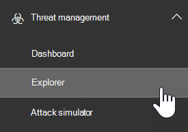
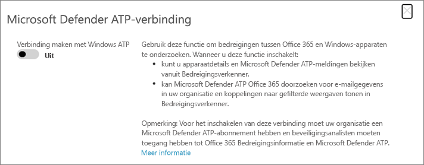

# Office 365 Advanced Threat Protection integreren met geavanceerde bedreigingsbeveiliging van Microsoft DefenderIntegrate Office 365 Advanced Threat Protection with Microsoft Defender Advanced Threat Protection

[Office 365 Advanced Threat Protection](https://docs.microsoft.com/microsoft-365/security/office-365-security/office-365-atp?view=o365-worldwide) (Office 365 ATP) kan worden geconfigureerd om te werken met [Microsoft Defender Advanced Threat Protection](https://docs.microsoft.com/windows/security/threat-protection) (Microsoft Defender ATP).[Office 365 Advanced Threat Protection](https://docs.microsoft.com/microsoft-365/security/office-365-security/office-365-atp?view=o365-worldwide) (Office 365 ATP) can be configured to work with [Microsoft Defender Advanced Threat Protection](https://docs.microsoft.com/windows/security/threat-protection) (Microsoft Defender ATP).

Als u Office 365 ATP integreert met Microsoft Defender ATP, kan uw beveiligingsteam snel kunnen controleren en actie ondernemen als de apparaten van gebruikers gevaar lopen.Integrating Office 365 ATP with Microsoft Defender ATP can help your security operations team monitor and take action quickly if users' devices are at risk. Zodra integratie is ingeschakeld, kan uw beveiligingsteam bijvoorbeeld de apparaten zien die mogelijk worden beïnvloed door een gedetecteerd e-mailbericht en hoeveel recente waarschuwingen deze apparaten hebben in Microsoft Defender ATP.For example, once integration is enabled, your security operations team will be able to see the devices that are potentially affected by a detected email message, as well as how many recent alerts those devices have in Microsoft Defender ATP. 

In de volgende afbeelding wordt weergegeven hoe het tabblad **Apparaten** eruitziet als Microsoft Defender ATP-integratie is ingeschakeld:The following image depicts what the **Devices** tab looks like have Microsoft Defender ATP integration enabled:
  

  
In dit voorbeeld u zien dat de ontvangers van het gedetecteerde e-mailbericht vier apparaten hebben en één een waarschuwing.In this example, you can see that the recipients of the detected email message have four devices and one has an alert. Als u op de koppeling voor een apparaat klikt, wordt de pagina geopend in het Microsoft Defender Security Center ( [https://securitycenter.windows.com](https://securitycenter.windows.com) ).Clicking the link for a device opens its page in the Microsoft Defender Security Center ([https://securitycenter.windows.com](https://securitycenter.windows.com)).

> [!TIP]
> **[Meer informatie over het Microsoft Defender Security Center](https://docs.microsoft.com/windows/security/threat-protection/microsoft-defender-atp/use)** (ook wel de Microsoft Defender ATP-portal genoemd).)**[Learn more about the Microsoft Defender Security Center](https://docs.microsoft.com/windows/security/threat-protection/microsoft-defender-atp/use)** (also referred to as the Microsoft Defender ATP portal.)
  
## VereistenRequirements

- Uw organisatie moet beschikken over Office 365 ATP Plan 2 (of Office 365 E5) en Microsoft Defender ATP.Your organization must have Office 365 ATP Plan 2 (or Office 365 E5) and Microsoft Defender ATP.
    
- U moet een globale beheerder zijn of een beveiligingsbeheerdersrol (zoals beveiligingsbeheerder) hebben toegewezen in het [Security &amp; Compliance Center](https://protection.office.com).You must be a global administrator or have a security administrator role (such as Security Administrator) assigned in the [Security &amp; Compliance Center](https://protection.office.com). (Zie [machtigingen in het Security &amp; Compliance Center](permissions-in-the-security-and-compliance-center.md))(See [Permissions in the Security &amp; Compliance Center](permissions-in-the-security-and-compliance-center.md))
    
- U moet toegang hebben tot zowel [Explorer (of real-time detecties)](threat-explorer.md) in het Security & Compliance Center als het Microsoft Defender Security Center.You must have access to both [Explorer (or real-time detections)](threat-explorer.md) in the Security & Compliance Center and the Microsoft Defender Security Center.
    
## Office 365 ATP integreren met Microsoft Defender ATPTo integrate Office 365 ATP with Microsoft Defender ATP

De integratie van Office 365 ATP met Microsoft Defender ATP is opgezet met behulp van zowel het Security & Compliance Center als het Microsoft Defender Security Center.Integrating Office 365 ATP with Microsoft Defender ATP is set up by using both the Security & Compliance Center AND the Microsoft Defender Security Center.
  
1. Ga als globale beheerder of beveiligingsbeheerder naar [https://protection.office.com](https://protection.office.com) en meld u aan.As a global administrator or a security administrator, go to [https://protection.office.com](https://protection.office.com) and sign in. (Hiermee gaat u naar het Office 365 Security & Compliance Center.)(This takes you to the Office 365 Security & Compliance Center.)
    
2. Kies in het navigatiedeelvenster **Bedreigingsbeheerverkenner**  >  **Explorer**.In the navigation pane, choose **Threat management** > **Explorer**.  
    
3. Kies in de rechterbovenhoek van het scherm **WDATP-instellingen.**In the upper right corner of the screen, choose **WDATP Settings**.
    
4. Schakel verbinding **maken met Windows ATP**in het dialoogvenster Microsoft Defender ATP in .In the Microsoft Defender ATP connection dialog box, turn on **Connect to Windows ATP**.  
    
5. Ga naar het Microsoft Defender Security Center ( [https://securitycenter.windows.com](https://securitycenter.windows.com) ).Go to the Microsoft Defender Security Center ([https://securitycenter.windows.com](https://securitycenter.windows.com)).

6. Kies **Instellingen op**de navigatiebalk .In the navigation bar, choose **Settings**. Kies vervolgens onder **Algemeen** **geavanceerde functies**.Then, under **General**, choose **Advanced features**.

7. Schuif omlaag naar de Verbinding Met De Informatie van de Bedreiging van **Office 365**en schakel de verbinding in.Scroll down to **Office 365 Threat Intelligence connection**, and turn the connection on.  

## Verwante artikelenRelated articles

[Mogelijkheden voor bedreigingsonderzoek en -reactie in Office 365Threat investigation and response capabilities in Office 365](office-365-ti.md)
  
[Office 365 Advanced Threat ProtectionOffice 365 Advanced Threat Protection](office-365-atp.md)
  
[Microsoft Defender ATPMicrosoft Defender ATP](https://docs.microsoft.com/windows/security/threat-protection)
