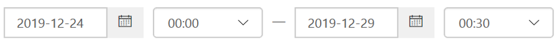

# Schadelijke e-mailberichten onderzoeken die zijn uitgebracht in Office 365Investigate malicious email that was delivered in Office 365

[!INCLUDE [Microsoft 365 Defender rebranding](../includes/microsoft-defender-for-office.md)]

[Microsoft Defender voor Office 365](office-365-atp.md) biedt u de mogelijkheid activiteiten te onderzoeken waarmee de personen in uw organisatie risico lopen en om uw organisatie te beveiligen.[Microsoft Defender for Office 365](office-365-atp.md) enables you to investigate activities that put people in your organization at risk, and to take action to protect your organization. Als u bijvoorbeeld bij het beveiligingsteam van uw organisatie bent, kunt u verdachte e-mailberichten zoeken en onderzoeken die zijn ontvangen.For example, if you are part of your organization's security team, you can find and investigate suspicious email messages that were delivered. U kunt dit doen met behulp van de [bedreigings Verkenner (of realtime detectie)](threat-explorer.md).You can do this by using [Threat Explorer (or real-time detections)](threat-explorer.md).

> [!NOTE]
> Ga naar het artikel herstel [hier](remediate-malicious-email-delivered-office-365.md).Jump to the remediation article [here](remediate-malicious-email-delivered-office-365.md).

## Voordat u begintBefore you begin

Controleer of aan de volgende vereisten wordt voldaan:Make sure that the following requirements are met:

- Uw organisatie heeft [Microsoft Defender voor Office 365](office-365-atp.md) en [licenties toegewezen aan gebruikers](../../admin/manage/assign-licenses-to-users.md).Your organization has [Microsoft Defender for Office 365](office-365-atp.md) and [licenses are assigned to users](../../admin/manage/assign-licenses-to-users.md).

- [controlelogboekregistratie](../../compliance/turn-audit-log-search-on-or-off.md) is ingeschakeld voor uw organisatie.[audit logging](../../compliance/turn-audit-log-search-on-or-off.md) is turned on for your organization.

- Uw organisatie bevat beleidsregels die zijn gedefinieerd voor anti-spam, anti-malware, anti phishing en dergelijke.Your organization has policies defined for anti-spam, anti-malware, anti-phishing, and so on. Zie [beveiliging tegen bedreigingen in Office 365](protect-against-threats.md).See [Protect against threats in Office 365](protect-against-threats.md).

- U bent een globale beheerder of u hebt de rol beveiliging beheerder of zoeken en wissen toegewezen in de beveiligings & nalevings centrum.You are a global administrator, or you have either the Security Administrator or the Search and Purge role assigned in the Security & Compliance Center. Zie [machtigingen in het beveiligings & nalevings centrum](permissions-in-the-security-and-compliance-center.md).See [Permissions in the Security & Compliance Center](permissions-in-the-security-and-compliance-center.md). Voor sommige acties moet aan u ook een nieuwe preview-rol zijn toegewezen.For some actions, you must also have a new Preview role assigned.

### Machtigingen voor voorbeeld van rollenPreview role permissions

Als u bepaalde acties wilt uitvoeren, zoals het weergeven van berichtkoppen of het downloaden van e-mailberichten, moet u een nieuwe rol genaamd *voorbeeld* toevoegen aan een andere bijbehorende rollen groep.To perform certain actions, such as viewing message headers or downloading email message content, you must have a new role called *Preview* added to another appropriate role group. In de volgende tabel worden vereiste rollen en machtigingen duidelijker.The following table clarifies required roles and permissions.

****

|ActiviteitActivity|Rollen groepRole group|Is de functie voorbeeld nodig?Preview role needed?|
|---|---|---|
|Het gebruik van bedreigings Verkenner (en real-time detecties) om bedreigingen te analyserenUse Threat Explorer (and real-time detections) to analyze threats |Globale beheerderGlobal Administrator 
 BeveiligingsbeheerderSecurity Administrator 
 Beveiligings lezerSecurity Reader|NeeNo|
|De weergave van bedreigings Verkenner (en realtime-detectie) gebruiken om kopteksten voor e-mailberichten weer te geven en voorbeelden van e-mailberichten in quarantaine te downloadenUse Threat Explorer (and real-time detections) to view headers for email messages as well as preview and download quarantined email messages|Globale beheerderGlobal Administrator 
 BeveiligingsbeheerderSecurity Administrator 
 Beveiligings lezerSecurity Reader|NeeNo|
|Met behulp van de bedreigings Verkenner kopteksten en e-mailberichten die zijn bezorgd bij postvakken weergevenUse Threat Explorer to view headers and download email messages delivered to mailboxes|Globale beheerderGlobal Administrator 
 BeveiligingsbeheerderSecurity Administrator 
 Beveiligings lezerSecurity Reader 
 VoorbeeldPreview|JaYes|
|

> [!NOTE]
> *Voorbeeld* is een rol en geen rollen groep. de rol van voorbeeld moet worden toegevoegd aan een bestaande rollen groep voor Office 365.*Preview* is a role and not a role group; the Preview role must be added to an existing role group for Office 365. De rol van de globale beheerder wordt het Microsoft 365-Beheercentrum toegewezen [https://admin.microsoft.com](https://admin.microsoft.com) , en de rollen Beveiligingsbeheerder en beveiligings lezer worden toegewezen in het beveiligings & nalevings centrum ( [https://protection.office.com](https://protection.office.com) ).The Global Administrator role is assigned the Microsoft 365 admin center ([https://admin.microsoft.com](https://admin.microsoft.com)), and the Security Administrator and Security Reader roles are assigned in the Security & Compliance Center ([https://protection.office.com](https://protection.office.com)). Als u meer wilt weten over rollen en machtigingen, raadpleegt u [machtigingen in de sectie beveiliging & nalevings centrum](permissions-in-the-security-and-compliance-center.md).To learn more about roles and permissions, see [Permissions in the Security & Compliance Center](permissions-in-the-security-and-compliance-center.md).

## Verdachte e-mail vinden die is bezorgdFind suspicious email that was delivered

Bedreigings Verkenner is een krachtig rapport waarmee u kunt zoeken naar meerdere doeleinden, zoals berichten zoeken en verwijderen, het IP-adres van een kwaadwillende e-mail verzender identificeren of een incident voor verder onderzoek starten.Threat Explorer is a powerful report that can serve multiple purposes, such as finding and deleting messages, identifying the IP address of a malicious email sender, or starting an incident for further investigation. In de volgende procedure wordt beschreven hoe u met Verkenner schadelijke e-mail van de postvakken van de ontvanger kunt vinden en verwijderen.The following procedure focuses on using Explorer to find and delete malicious email from recipient's mailboxes.

> [!NOTE]
> Standaardzoekopdrachten in Explorer bevatten momenteel geen zapped-items.Default searches in Explorer don't currently include Zapped items.  Dit geldt voor alle weergaven, bijvoorbeeld malware of phishing.This applies to all views, for example malware or phish views. Als u zapped-items wilt opnemen, moet u een actie voor de leverings actie toevoegen zodat de waarde ' verwijderd door ZAP ' wordt vermeld.To include Zapped items you need to add a 'Delivery action' set to include 'Removed by ZAP'. Als u alle opties opneemt, ziet u alle resultaten van de bezorgings actie, waaronder zapped-items.If you include all options, you'll see all delivery action results, including Zapped items.

1. **Ga naar Threat Explorer**: Ga naar [https://protection.office.com](https://protection.office.com) en meld u aan met uw werk-of schoolaccount voor Office 365.**Navigate to Threat Explorer**: Go to [https://protection.office.com](https://protection.office.com) and sign in using your work or school account for Office 365. U gaat nu naar de beveiligings & compliance Center.This takes you to the Security & Compliance Center.

2. Kies in de navigatiebalk aan de linkerkant de optie **Threat Management** \> **Explorer**.In the left navigation quick-launch, choose **Threat management** \> **Explorer**.

    

    U ziet mogelijk de kolom nieuwe **speciale acties** .You may notice the new **Special actions** column. Deze functie is bedoeld om beheerders een e-mailbericht te sturen.This feature is aimed at telling admins the outcome of processing an email. De kolom **speciale acties** kan worden geopend op dezelfde plaats als de bezorgings **actie** en de **bezorgingslocatie**.The **Special actions** column can be accessed in the same place as **Delivery action** and **Delivery location**. Speciale acties kunnen worden bijgewerkt aan het einde van de e-mail tijdlijn van de bedreiging van de bedreiging, een nieuwe functie waarmee u de jacht-ervaring beter kunt benutten.Special actions might be updated at the end of Threat Explorer's email timeline, which is a new feature aimed at making the hunting experience better for admins.

3. **Weergaven in de bedreigings Verkenner**: Kies in het menu **weergave** de optie **alle e-mail**.**Views in Threat Explorer**: In the **View** menu, choose **All email**.

    

    De weergave van de *malware* is op dit moment de standaardweergave en de e-mailberichten worden vastgelegd waarbij een schadelijke schadelijke bedreiging wordt gedetecteerd.The *Malware* view is currently the default, and captures emails where a malware threat is detected. De weergave *phishing* werkt op dezelfde manier, voor phishing.The *Phish* view operates in the same way, for Phish.

    De weergave *e-mail* bevat echter elk e-mailbericht dat door de organisatie is ontvangen, of bedreigingen zijn gedetecteerd.However, *All email* view lists every mail received by the organization, whether threats were detected or not. Zoals u kunt zien, is dit een groot aantal gegevens, wat de voorwaarde is: in deze weergave wordt een tijdelijke aanduiding weergegeven om aan te geven dat er een filter wordt toegepast.As you can imagine, this is a lot of data, which is why this view shows a placeholder that asks a filter be applied. (Deze weergave is alleen beschikbaar voor de klanten van Defender voor Office 365.(This view is only available for Defender for Office 365 P2 customers.)

    De weergave *ingediende items* toont alle e-mailberichten die zijn verzonden door een beheerder of gebruiker die bij Microsoft werd gerapporteerd.*Submissions* view shows up all mails submitted by admin or user that were reported to Microsoft.

4. **Zoeken en filteren in de bedreigings Verkenner**: filters worden boven aan de pagina weergegeven in de zoekbalk om beheerders in hun onderzoek te helpen.**Search and filter in Threat Explorer**: Filters appear at the top of the page in the search bar to help admins in their investigations. U kunt op elk gewenst moment meerdere filters toepassen, en meerdere door lijstscheidingstekens gescheiden waarden toevoegen aan een filter om de zoekopdracht te verfijnen.Notice that multiple filters can be applied at the same time, and multiple comma-separated values added to a filter to narrow down the search. BelangRemember:

    - Filters doen nauwkeurig overeen met de meeste filtervoorwaarden.Filters do exact matching on most filter conditions.
    - Het onderwerp-filter gebruikt een contain-query.Subject filter uses a CONTAINS query.
    - URL-filters werken met of zonder protocollen (bijv.URL filters work with or without protocols (ex. https).https).
    - URL-domein, URL-pad en URL-domein en-padcomponenten vereisen geen protocol om te filteren.URL domain, URL path, and URL domain and path filters don't require a protocol to filter.
    - U moet telkens wanneer u de filterwaarden wijzigt, op het pictogram Vernieuwen klikken om relevante resultaten te bereiken.You must click the Refresh icon every time you change the filter values to get relevant results.

5. **Geavanceerde filters**: met deze filters kunt u complexe query's maken en de gegevensset filteren.**Advanced filters**: With these filters, you can build complex queries and filter your data set. Met klikken op *Geavanceerde filters* wordt een flyout geopend met opties.Clicking on *Advanced Filters* opens a flyout with options.

   Geavanceerde filtering is een fantastische aanvulling op de mogelijkheden van zoeken.Advanced filtering is a great addition to search capabilities. Er is een Booleaanse waarde **niet** filter geïntroduceerd voor de *ontvanger*, het domein van de *afzender* en het domein van de *afzender* , zodat beheerders door geen waarden kunnen onderzoeken.A boolean **NOT** filter has been introduced on *Recipient*, *Sender* and *Sender domain* to allow admins to investigate by excluding values. Deze optie wordt weergegeven onder selectie parameter *bevat geen van*.This option appears under selection parameter *Contains none of*. Laat beheerders **geen** waarschuwingen, standaardantwoord boxen van hun onderzoek, en kan handig zijn voor gevallen waarin beheerders zoeken naar een specifiek onderwerp (subject = "aandacht") waarbij de ontvanger kan worden ingesteld op *geen van defaultMail \@ contoso.com*.**NOT** will let admins exclude alert mailboxes, default reply mailboxes from their investigations, and is useful for cases where admins search for a specific subject (subject="Attention") where the Recipient can be set to *none of defaultMail\@contoso.com*. Dit is een exacte waarde waarnaar wordt gezocht.This is an exact value search.

   

   *Door uren te filteren* wordt het beveiligingsteam van uw organisatie sneller ingezoomd.*Filtering by hours* will help your organization's security team drill down quickly. De kortste toegestane tijdsduur is 30 minuten.The shortest allowed time duration is 30 minutes. Als u de verdachte actie kunt specificeren op basis van tijdskader (bijvoorbeeld 3 uur geleden gebeurd), wordt de context beperkt en wordt het probleem door u gespeld.If you can narrow the suspicious action by time-frame (e.g. it happened 3 hours ago), this will limit the context and help pinpoint the problem.

   

6. **Velden in de bedreigings Verkenner: met** bedreigings Verkenner worden veel meer beveiligingsgegevens voor beveiliging weergeven, zoals de *bezorgings actie*, *bezorgingslocatie*, *speciale actie*, *richting*, *overschrijvingen* en de bedreiging van de *URL*.**Fields in threat explorer**: Threat Explorer exposes a lot more security-related mail information such as *Delivery action*, *Delivery location*, *Special action*, *Directionality*, *Overrides*, and *URL threat*. Ook kan het beveiligingsteam van uw organisatie een betere zekerheid krijgen.It also allows your organization's security team to investigate with a higher certainty.

    De *bezorgings actie* is de actie die op een e-mail is uitgevoerd vanwege bestaande beleidsregels of detecties.*Delivery action* is the action taken on an email due to existing policies or detections. Dit zijn de mogelijke acties waarmee een e-mail kan worden verzonden:Here are the possible actions an email can take:

    - **Bezorgd** -e-mail is bezorgd in het postvak in of de map van een gebruiker en de gebruiker kan deze rechtstreeks openen.**Delivered** – email was delivered to inbox or folder of a user and the user can directly access it.
    - **Ongewenst** (afgeleverd aan ongewenste e-mail) – e-mail is verzonden naar de map Ongewenste e-mail van de gebruiker of een map die is verwijderd, en de gebruiker heeft toegang tot e-mailberichten in hun ongewenste map.**Junked** (Delivered to junk)– email was sent to either user's junk folder or deleted folder, and the user has access to email messages in their Junk or Deleted folder.
    - **Geblokkeerde** e-mail: alle e-mailberichten die zijn gequarantined, dat niet is gelukt of zijn verwijderd.**Blocked** – any email messages that are quarantined, that failed, or were dropped. (Dit is helemaal niet toegankelijk voor de gebruiker).(This is completely inaccessible by the user.)
    - **Vervangen** : alle e-mailberichten waarin schadelijke bijlagen worden vervangen door txt-bestanden die aangeven dat de bijlage schadelijk is**Replaced** – any email where malicious attachments are replaced by .txt files that state the attachment was malicious

    **Bezorgingslocatie**: het filter bezorgingslocatie is beschikbaar om beheerders te helpen begrijpen waar kwaadaardige e-mailberichten zijn beëindigd en welke acties hieraan zijn ondergebracht.**Delivery location**: The Delivery location filter is available in order to help admins understand where suspected malicious mail ended-up and what actions were taken on it. De gegevens die worden geretourneerd, kunnen worden geëxporteerd naar het werkblad.The resulting data can be exported to spreadsheet. Mogelijke bezorgingslocaties zijn:Possible delivery locations are:

    - **Postvak in of map** : het e-mailbericht bevindt zich in het postvak in of een specifieke map, volgens uw e-mail regels.**Inbox or folder** – The email is in the Inbox or a specific folder, according to your email rules.
    - **On-premises of extern** : het postvak bestaat niet in de Cloud, maar is on-premises.**On-prem or external** – The mailbox doesn't exist in the Cloud but is on-premises.
    - **Map Ongewenste** E-mail: de e-mail bevindt zich in de map Ongewenste e-mail van een gebruiker.**Junk folder** – The email is in a user's Junk mail folder.
    - **Map Verwijderde items** : de e-mail bevindt zich in de map Verwijderde items van een gebruiker.**Deleted items folder** – The email is in a user's Deleted items folder.
    - **Quarantine** : de e-mail in quarantaine, en niet in het postvak van een gebruiker.**Quarantine** – The email in quarantine, and not in a user's mailbox.
    - **Mislukt** : het e-mailbericht kon het postvak niet bereiken.**Failed** – The email failed to reach the mailbox.
    - **Neergezet** -de e-mail is ergens in de e-mail stroom verdwenen.**Dropped** – The email was lost somewhere in the mail flow.

    **Richting**: met deze optie kan uw bedrijfsactiviteiten team filteren op de ' direction ' waarnaar een e-mailbericht wordt verzonden.**Directionality**: This option allows your security operations team to filter by the 'direction' a mail comes from, or is going. Waarden in de richting zijn *Inkomend*, *uitgaand* en *binnenste organisatie* (corresponderend met e-mail van derden, die wordt verstuurd vanuit uw organisatie of intern verzonden naar uw organisatie).Directionality values are *Inbound*, *Outbound*, and *Intra-org* (corresponding to mail coming into your org from outside, being sent out of your org, or being sent internally to your org, respectively). Deze informatie biedt bescherming van beveiligingsactiviteiten teams om spoofing en imitatie te voorkomen, omdat de waarde van de richting niet klopt (ex.This information can help security operations teams spot spoofing and impersonation, because a mismatch between the Directionality value (ex. *Inkomend*), en het domein van de afzender (die *wordt weergegeven* als een intern domein), blijkt duidelijk!*Inbound*), and the domain of the sender (which *appears* to be an internal domain) will be evident! De waarde richting is gescheiden en kan variëren van de bericht tracering.The Directionality value is separate, and can differ from, the Message Trace. Resultaten kunnen worden geëxporteerd naar spreadsheet.Results can be exported to spreadsheet.

    **Overschrijvingen**: dit filter bevat informatie die wordt weergegeven op het tabblad Details van het e-mailbericht en wordt gebruikt om het weergeven van de organisatie of het gebruikersbeleid, zodat e-mailberichten kunnen worden toegestaan en *geblokkeerd.***Overrides**: This filter takes information that appears on the mail's details tab and uses it to expose where organizational, or user policies, for allowing and blocking mails have been *overridden*. Het belangrijkste voor dit filter is dat het beveiligingsteam van uw organisatie het beveiligingsteam van uw organisatie kan bekijken hoeveel verdachte e-mailberichten zijn bezorgd vanwege de configuratie.The most important thing about this filter is that it helps your organization's security team see how many suspicious emails were delivered due to configuration. Zo nodig kunnen ze de verkoopkans wijzigen en blokkeren.This gives them an opportunity to modify allows and blocks as needed. Dit filter kan worden geëxporteerd naar spreadsheet.This result set of this filter can be exported to spreadsheet.

    ****

    |De bedreiging negerenThreat Explorer Overrides|Wat ze betekenenWhat they mean|
    |---|---|
    |Toegestaan door het beleid voor de organisatieAllowed by Org Policy|E-mail is in het postvak toegestaan volgens de door u ingestelde organisatiebeleid.Mail was allowed into the mailbox as directed by the organization policy.|
    |Geblokkeerd door organisatiebeleidBlocked by Org policy|E-mail is geblokkeerd voor levering aan het postvak, zoals door het organisatiebeleid werd doorgestuurd.Mail was blocked from delivery to the mailbox as directed by the organization policy.|
    |Bestandsextensie geblokkeerd door organisatiebeleidFile extension blocked by Org Policy|Het bestand is geblokkeerd voor levering aan het postvak, zoals door het organisatiebeleid werd doorgestuurd.File was blocked from delivery to the mailbox as directed by the organization policy.|
    |Toegestaan door gebruikersbeleidAllowed by User Policy|E-mail werd toegestaan in het postvak, zoals door het gebruikersbeleid is doorgestuurd.Mail was allowed into the mailbox as directed by the user policy.|
    |Geblokkeerd door gebruikersbeleidBlocked by User Policy|E-mail is geblokkeerd voor levering aan het postvak, zoals door het gebruikersbeleid werd doorgestuurd.Mail was blocked from delivery to the mailbox as directed by the user policy.|
    |

    **URL Threat**: het veld URL Threat is opgenomen op het tabblad *Details* van een e-mailbericht om de bedreiging aan te geven die wordt weergegeven door een URL.**URL threat**: The URL threat field has been included on the *details* tab of an email to indicate the threat presented by a URL. Bedreigingen die door een URL worden gepresenteerd, kunnen *malware*, *phishing* of *spam* bevatten en een URL zonder *bedreiging* zeg *geen* in de sectie bedreigingen.Threats presented by a URL can include *Malware*, *Phish*, or *Spam*, and a URL with *no threat* will say *None* in the threats section.

7. **Weergave van e-mail tijdlijn**: het team van uw beveiligingsactiviteiten moet mogelijk uitgebreide informatie over de e-mail bekijken om verder te kunnen onderzoeken.**Email timeline view**: Your security operations team might need to deep-dive into email details to investigate further. Met de e-mail tijdlijn kunnen beheerdersacties weergeven die zijn gemaakt voor een e-mailbericht van aflevering tot na levering.The email timeline allows admins to view actions taken on an email from delivery to post-delivery. Als u een e-mail tijdlijn wilt weergeven, klikt u op het onderwerp van een e-mailbericht en vervolgens op e-mail tijdlijn.To view an email timeline, click on the subject of an email message, and then click Email timeline. (Het wordt weergegeven onder andere koppen op het deelvenster, zoals Summary or details). U kunt deze resultaten exporteren naar een werkblad.(It appears among other headings on the panel like Summary or Details.) These results can be exported to spreadsheet.

    De e-mail tijdlijn wordt geopend in een tabel waarin alle gebeurtenissen voor de bezorging van de e-mail en de bezorging van de e-mail worden weergegeven.Email timeline will open to a table that shows all delivery and post-delivery events for the email. Als het e-mailbericht geen verdere acties bevat, ziet u één gebeurtenis voor de oorspronkelijke aflevering met een resultaat, zoals *geblokkeerd*, met een verdict zoals *phishing*.If there are no further actions on the email, you should see a single event for the original delivery that states a result, such as *Blocked*, with a verdict like *Phish*. Beheerders kunnen de volledige e-mail tijdlijn exporteren, inclusief alle details op het tabblad en e-mailadres (zoals het onderwerp, de afzender, de geadresseerde, het netwerk en de bericht-ID).Admins can export the entire email timeline, including all details on the tab and email (such as, Subject, Sender, Recipient, Network, and Message ID). De e-mail tijdlijn snijdt voor willekeurige berichten omdat er minder tijd is besteed aan het controleren van verschillende locaties om te zien welke gebeurtenissen zijn aangebracht sinds de e-mail is ontvangen.The email timeline cuts down on randomization because there is less time spent checking different locations to try to understand events that happened since the email arrived. Wanneer meerdere gebeurtenissen plaatsvinden aan of sluiten op een e-mail, worden deze gebeurtenissen weergegeven in een tijdlijnweergave.When multiple events happen at, or close to, the same time on an email, those events show up in a timeline view.

8. **Preview/Download**: met de bedreigings Verkenner krijgt u uw beveiligingsactiviteiten team de details die ze nodig hebben om verdachte e-mail te onderzoeken.**Preview / download**: Threat Explorer gives your security operations team the details they need to investigate suspicious email. Het team van uw beveiligingsactiviteiten kan een van de volgende handelingen uitvoeren:Your security operations team can either:

    - [Controleer de bezorgings actie en de locatie](#check-the-delivery-action-and-location).[Check the delivery action and location](#check-the-delivery-action-and-location).

    - [De tijdlijn van uw E-mail bekijken](#view-the-timeline-of-your-email).[View the timeline of your email](#view-the-timeline-of-your-email).

### Controleer de bezorgings actie en de locatieCheck the delivery action and location

In de fase van de [bedreiging](threat-explorer.md), de realtime-bezorgings **status** en de bezorgingslocatie, hebt u nu de kolommen **leverings actie** en **bezorgingslocatie** .In [Threat Explorer (and real-time detections)](threat-explorer.md), you now have **Delivery Action** and **Delivery Location** columns instead of the former **Delivery Status** column. Dit levert een uitgebreide foto van de plaats van uw e-mailberichten.This results in a more complete picture of where your email messages land. Onderdeel van het doel van deze wijziging is het maken van onderzoek eenvoudiger voor beveiligings werkactiviteiten teams, maar het resultaat van de e-mail is in één oogopslag bekend.Part of the goal of this change is to make investigations easier for security operations teams, but the net result is knowing the location of problem email messages at a glance.

De bezorgings status is nu uitgebroken in twee kolommen:Delivery Status is now broken out into two columns:

- **Bezorgings actie** : wat is de status van dit e-mailbericht?**Delivery action** - What is the status of this email?

- **Bezorgingslocatie** : waar werd dit e-mailbericht rondgestuurd als resultaat?**Delivery location** - Where was this email routed as a result?

De bezorgings actie is de actie die op een e-mail is uitgevoerd vanwege bestaande beleidsregels of detecties.Delivery action is the action taken on an email due to existing policies or detections. Dit zijn de mogelijke acties waarmee een e-mail kan worden verzonden:Here are the possible actions an email can take:

- **Bezorgd** -e-mail is bezorgd in het postvak in of de map van een gebruiker en de gebruiker kan deze rechtstreeks openen.**Delivered** – email was delivered to inbox or folder of a user and the user can directly access it.

- **Ongewenst** – e-mail is verzonden naar de map Ongewenste e-mail van de gebruiker of de map die is verwijderd, en de gebruiker heeft toegang tot e-mailberichten in zijn of haar map.**Junked** – email was sent to either user's junk folder or deleted folder, and the user has access to email messages in their Junk or Deleted folder.

- **Geblokkeerde** e-mail: alle e-mailberichten die zijn gequarantined, dat niet is gelukt of zijn verwijderd.**Blocked** – any email messages that are quarantined, that failed, or were dropped. (Dit is helemaal niet toegankelijk voor de gebruiker).(This is completely inaccessible by the user.)

- **Vervangen** : alle e-mailberichten waarin schadelijke bijlagen worden vervangen door txt-bestanden die aangeven dat de bijlage schadelijk is.**Replaced** – any email where malicious attachments are replaced by .txt files that state the attachment was malicious.

Locatie van levering toont de resultaten van beleidsregels en detecties die na levering worden uitgevoerd.Delivery location shows the results of policies and detections that run post-delivery. Het is gekoppeld aan een bezorgings actie.It's linked to a Delivery Action. Dit veld is toegevoegd om inzicht te krijgen in de actie die optreedt wanneer er een probleem met de e-mail is gevonden.This field was added to give insight into the action taken when a problem mail is found. Dit zijn de mogelijke waarden van de lever locatie:Here are the possible values of delivery location:

- **Postvak in of map** : het e-mailbericht bevindt zich in het postvak in of de map (volgens uw e-mail regels).**Inbox or folder** – The email is in the inbox or a folder (according to your email rules).

- **On-premises of extern** : het postvak bestaat niet in de Cloud, maar is on-premises.**On-prem or external** – The mailbox doesn't exist on cloud but is on-premises.

- **Map Ongewenste e-mail** : het e-mailbericht bevindt zich in de map Ongewenste e-mail van een gebruiker.**Junk folder** – The email is in a user's Junk folder.

- **Map Verwijderde items** : de e-mail bevindt zich in de map Verwijderde items van een gebruiker.**Deleted items folder** – The email is in a user's Deleted items folder.

- **Quarantine** : de e-mail in quarantaine, en niet in het postvak van een gebruiker.**Quarantine** – The email in quarantine, and not in a user's mailbox.

- **Mislukt** : het e-mailbericht kon het postvak niet bereiken.**Failed** – The email failed to reach the mailbox.

- **Neergezet** : de e-mail wordt ergens in de e-mail stroom neergezet.**Dropped** – The email gets lost somewhere in the mail flow.

### De tijdlijn van uw e-mailbericht weergevenView the timeline of your email

**E-mail tijdlijn** is een veld in de Threat Explorer waarmee u de jacht eenvoudiger kunt maken voor uw beveiligingsactiviteiten.**Email Timeline** is a field in Threat Explorer that makes hunting easier for your security operations team. Wanneer meerdere gebeurtenissen plaatsvinden op of dicht bij een e-mailbericht, worden deze gebeurtenissen weergegeven in een tijdlijnweergave.When multiple events happen at or close to the same time on an email, those events show up in a timeline view. Sommige gebeurtenissen die plaatsvinden na de bezorging van e-mail, worden vastgelegd in de kolom **speciale acties** .Some events that happen post-delivery to email are captured in the **Special actions** column. Wanneer u de gegevens van de tijdlijn van een e-mailbericht combineert met speciale acties die na de levering zijn uitgevoerd, levert beheerders inzicht in beleidsregels en bedreigings afhandeling op, bijvoorbeeld de manier waarop de e-mail is gerouteerd, en in sommige gevallen, wat de laatste beoordeling was.Combining information from the timeline of an email message with any special actions that were taken post-delivery gives admins insight into policies and threat handling (such as where the mail was routed, and, in some cases, what the final assessment was).

> [!IMPORTANT]
> Ga naar [een sectie voor herstel.](remediate-malicious-email-delivered-office-365.md)Jump to a remediation topic [here](remediate-malicious-email-delivered-office-365.md).

## Verwante onderwerpenRelated topics

[Kwaadwillende e-mailberichten herstellen die worden bezorgd in Office 365Remediate malicious email delivered in Office 365](remediate-malicious-email-delivered-office-365.md)

[Microsoft Defender voor Office 365Microsoft Defender for Office 365](office-365-ti.md)

[Beveiliging tegen bedreigingen in Office 365Protect against threats in Office 365](protect-against-threats.md)

[Rapporten weergeven voor Defender voor Office 365View reports for Defender for Office 365](view-reports-for-atp.md)
