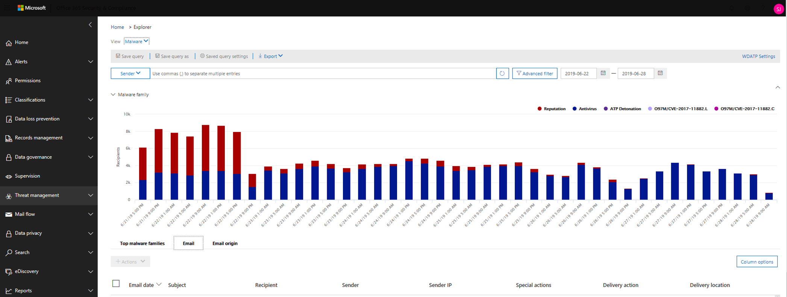

# Schadelijke e-mailberichten onderzoeken die zijn uitgebracht in Office 365

Met [Bebeschermings beveiliging van Office 365](office-365-atp.md) kunt u activiteiten onderzoeken waarmee mensen in uw organisatie worden bedreigd en om actie te ondernemen om uw organisatie te beveiligen. Als u bijvoorbeeld bij het beveiligingsteam van uw organisatie bent, kunt u verdachte e-mailberichten zoeken en onderzoeken die zijn ontvangen. U kunt dit doen met behulp van de [bedreigings Verkenner (of realtime detectie)](threat-explorer.md).

> [!NOTE]
> Ga naar het artikel herstel [hier](https://docs.microsoft.com/microsoft-365/security/mtp/article-submission/remediate-malicious-email-delivered-office-365?view=o365-21vianet&branch=pr-en-us-4258).

## Voordat u begint

Controleer of aan de volgende vereisten wordt voldaan:

- Uw organisatie heeft [Office 365 Advanced Threat Protection](office-365-atp.md) en [licenties zijn toegewezen aan gebruikers](../../admin/manage/assign-licenses-to-users.md).

- [controlelogboekregistratie](../../compliance/turn-audit-log-search-on-or-off.md) is ingeschakeld voor uw organisatie.

- Uw organisatie bevat beleidsregels die zijn gedefinieerd voor anti-spam, anti-malware, anti phishing en dergelijke. Zie [beveiliging tegen bedreigingen in Office 365](protect-against-threats.md).

- U bent een globale beheerder of u hebt de rol beveiligingsbeheerder of zoeken en verwijderen toegewezen in het beveiligings &amp; centrum. Zie [machtigingen in het beveiligings &amp; conformiteitscentrum](permissions-in-the-security-and-compliance-center.md). Voor sommige acties moet aan u ook een nieuwe preview-rol zijn toegewezen.

### Machtigingen voor voorbeeld van rollen

Als u bepaalde acties wilt uitvoeren, zoals het weergeven van berichtkoppen of het downloaden van e-mailberichten, moet u een nieuwe rol genaamd *voorbeeld* toevoegen aan een andere bijbehorende rollen groep. In de volgende tabel worden vereiste rollen en machtigingen duidelijker.

****

|Activiteit|Rollen groep|Is de functie voorbeeld nodig?|
|---|---|---|
|Het gebruik van bedreigings Verkenner (en real-time detecties) om bedreigingen te analyseren |Globale beheerder   Beveiligingsbeheerder   Beveiligings lezer|Nee|
|De weergave van bedreigings Verkenner (en realtime-detectie) gebruiken om kopteksten voor e-mailberichten weer te geven en voorbeelden van e-mailberichten in quarantaine te downloaden|Globale beheerder   Beveiligingsbeheerder  Beveiligings lezer|Nee|
|Met behulp van de bedreigings Verkenner kopteksten en e-mailberichten die zijn bezorgd bij postvakken weergeven|Globale beheerder  Beveiligingsbeheerder   Beveiligings lezer   Voorbeeld|Ja|
|

> [!NOTE]
> *Voorbeeld* is een rol en geen rollen groep. de rol van voorbeeld moet worden toegevoegd aan een bestaande rollen groep voor Office 365. De rol van de globale beheerder wordt het Microsoft 365-Beheercentrum toegewezen [https://admin.microsoft.com](https://admin.microsoft.com) , en de rollen Beveiligingsbeheerder en beveiligings lezer worden toegewezen in het beveiligings & nalevings centrum ( [https://protection.office.com](https://protection.office.com) ). Als u meer wilt weten over rollen en machtigingen, raadpleegt u [machtigingen in de sectie beveiliging & nalevings centrum](permissions-in-the-security-and-compliance-center.md).

## Verdachte e-mail zoeken en verwijderen die is afgeleverd

Bedreigings Verkenner is een krachtig rapport waarmee u kunt zoeken naar meerdere doeleinden, zoals berichten zoeken en verwijderen, het IP-adres van een kwaadwillende e-mail verzender identificeren of een incident voor verder onderzoek starten. In de volgende procedure wordt beschreven hoe u met Verkenner schadelijke e-mail van de postvakken van de ontvanger kunt vinden en verwijderen.

> [!NOTE]
> Standaardzoekopdrachten in Explorer bevatten momenteel geen zapped-items.  Dit geldt voor alle weergaven, bijvoorbeeld malware of phishing. Als u zapped-items wilt opnemen, moet u een actie voor de leverings actie toevoegen zodat de waarde ' verwijderd door ZAP ' wordt vermeld. Als u alle opties opneemt, ziet u alle resultaten van de bezorgings actie, waaronder zapped-items.

1. **Ga naar Threat Explorer**: Ga naar [https://protection.office.com](https://protection.office.com) en meld u aan met uw werk-of schoolaccount voor Office 365. U gaat nu naar het beveiligings &amp; conformiteitscentrum.

2. Kies in de navigatiebalk aan de linkerkant de optie **Threat Management** \> **Explorer**.

    

    <!-- You may notice the new **Special actions** column. This feature is aimed at telling admins the outcome of processing an email. The **Special actions** column can be accessed in the same place as **Delivery action** and **Delivery location**. Special actions might be updated at the end of Threat Explorer's email timeline, which is a new feature aimed at making the hunting experience better for admins.-->

3. **Weergaven in de bedreigings Verkenner**: Kies in het menu **weergave** de optie **alle e-mail**.

    

    De weergave van de *malware* is op dit moment de standaardweergave en de e-mailberichten worden vastgelegd waarbij een schadelijke schadelijke bedreiging wordt gedetecteerd. De weergave *phishing* werkt op dezelfde manier, voor phishing.

    De weergave *e-mail* bevat echter elk e-mailbericht dat door de organisatie is ontvangen, of bedreigingen zijn gedetecteerd. Zoals u kunt zien, is dit een groot aantal gegevens, wat de voorwaarde is: in deze weergave wordt een tijdelijke aanduiding weergegeven om aan te geven dat er een filter wordt toegepast. (Deze weergave is alleen beschikbaar voor ATP P2-klanten.)

    De weergave *ingediende items* toont alle e-mailberichten die zijn verzonden door een beheerder of gebruiker die bij Microsoft werd gerapporteerd.

4. **Zoeken en filteren in de bedreigings Verkenner**: filters worden boven aan de pagina weergegeven in de zoekbalk om beheerders in hun onderzoek te helpen. U kunt op elk gewenst moment meerdere filters toepassen, en meerdere door lijstscheidingstekens gescheiden waarden toevoegen aan een filter om de zoekopdracht te verfijnen. Belang

    - Filters doen nauwkeurig overeen met de meeste filtervoorwaarden.
    - Het onderwerp-filter gebruikt een contain-query.
    - URL-filters werken met of zonder protocollen (bijv. https).
    - URL-domein, URL-pad en URL-domein en-padcomponenten vereisen geen protocol om te filteren.
    - U moet telkens wanneer u de filterwaarden wijzigt, op het pictogram Vernieuwen klikken om relevante resultaten te bereiken.

5. **Geavanceerde filters**: met deze filters kunt u complexe query's maken en de gegevensset filteren. Met klikken op *Geavanceerde filters* wordt een flyout geopend met opties.

   Geavanceerde filtering is een fantastische aanvulling op de mogelijkheden van zoeken. Er is een Booleaanse waarde **niet** filter geïntroduceerd voor de *ontvanger*, het domein van de *afzender* en het domein van de *afzender* , zodat beheerders door geen waarden kunnen onderzoeken. Deze optie wordt weergegeven onder selectie parameter *bevat geen van*. Laat beheerders **geen** waarschuwingen, standaardantwoord boxen van hun onderzoek, en kan handig zijn voor gevallen waarin beheerders zoeken naar een specifiek onderwerp (subject = "aandacht") waarbij de ontvanger kan worden ingesteld op *geen van defaultMail \@ contoso.com*. Dit is een exacte waarde waarnaar wordt gezocht.

   

   *Door uren te filteren* wordt het beveiligingsteam van uw organisatie sneller ingezoomd. De kortste toegestane tijdsduur is 30 minuten. Als u de verdachte actie kunt specificeren op basis van tijdskader (bijvoorbeeld 3 uur geleden gebeurd), wordt de context beperkt en wordt het probleem door u gespeld.

   

6. **Velden in de bedreigings Verkenner: met**bedreigings Verkenner worden veel meer beveiligingsgegevens voor beveiliging weergeven, zoals de *bezorgings actie*, *bezorgingslocatie*, *speciale actie*, *richting*, *overschrijvingen*en de bedreiging van de *URL*. Ook kan het beveiligingsteam van uw organisatie een betere zekerheid krijgen.

    De *bezorgings actie* is de actie die op een e-mail is uitgevoerd vanwege bestaande beleidsregels of detecties. Dit zijn de mogelijke acties waarmee een e-mail kan worden verzonden:

    - **Bezorgd** -e-mail is bezorgd in het postvak in of de map van een gebruiker en de gebruiker kan deze rechtstreeks openen.
    - **Ongewenst** (afgeleverd aan ongewenste e-mail) – e-mail is verzonden naar de map Ongewenste e-mail van de gebruiker of een map die is verwijderd, en de gebruiker heeft toegang tot e-mailberichten in hun ongewenste map.
    - **Geblokkeerde** e-mail: alle e-mailberichten die zijn gequarantined, dat niet is gelukt of zijn verwijderd. (Dit is helemaal niet toegankelijk voor de gebruiker).
    - **Vervangen** : alle e-mailberichten waarin schadelijke bijlagen worden vervangen door txt-bestanden die aangeven dat de bijlage schadelijk is

    **Bezorgingslocatie**: het filter bezorgingslocatie is beschikbaar om beheerders te helpen begrijpen waar kwaadaardige e-mailberichten zijn beëindigd en welke acties hieraan zijn ondergebracht. De gegevens die worden geretourneerd, kunnen worden geëxporteerd naar het werkblad. Mogelijke bezorgingslocaties zijn:

    - **Postvak in of map** : het e-mailbericht bevindt zich in het postvak in of een specifieke map, volgens uw e-mail regels.
    - **On-premises of extern** : het postvak bestaat niet in de Cloud, maar is on-premises.
    - **Map Ongewenste** E-mail: de e-mail bevindt zich in de map Ongewenste e-mail van een gebruiker.
    - **Map Verwijderde items** : de e-mail bevindt zich in de map Verwijderde items van een gebruiker.
    - **Quarantine** : de e-mail in quarantaine, en niet in het postvak van een gebruiker.
    - **Mislukt** : het e-mailbericht kon het postvak niet bereiken.
    - **Neergezet** -de e-mail is ergens in de e-mail stroom verdwenen.

    **Richting**: met deze optie kan uw bedrijfsactiviteiten team filteren op de ' direction ' waarnaar een e-mailbericht wordt verzonden. Waarden in de richting zijn *Inkomend*, *uitgaand*en *binnenste organisatie* (corresponderend met e-mail van derden, die wordt verstuurd vanuit uw organisatie of intern verzonden naar uw organisatie). Deze informatie biedt bescherming van beveiligingsactiviteiten teams om spoofing en imitatie te voorkomen, omdat de waarde van de richting niet klopt (ex. *Inkomend*), en het domein van de afzender (die *wordt weergegeven* als een intern domein), blijkt duidelijk! De waarde richting is gescheiden en kan variëren van de bericht tracering. Resultaten kunnen worden geëxporteerd naar spreadsheet.

    **Overschrijvingen**: dit filter bevat informatie die wordt weergegeven op het tabblad Details van het e-mailbericht en wordt gebruikt om het weergeven van de organisatie of het gebruikersbeleid, zodat e-mailberichten kunnen worden toegestaan en *geblokkeerd.* Het belangrijkste voor dit filter is dat het beveiligingsteam van uw organisatie het beveiligingsteam van uw organisatie kan bekijken hoeveel verdachte e-mailberichten zijn bezorgd vanwege de configuratie. Zo nodig kunnen ze de verkoopkans wijzigen en blokkeren. Dit filter kan worden geëxporteerd naar spreadsheet.

    ****

    |De bedreiging negeren|Wat ze betekenen|
    |---|---|
    |Toegestaan door het beleid voor de organisatie|E-mail is in het postvak toegestaan volgens de door u ingestelde organisatiebeleid.|
    |Geblokkeerd door organisatiebeleid|E-mail is geblokkeerd voor levering aan het postvak, zoals door het organisatiebeleid werd doorgestuurd.|
    |Bestandsextensie geblokkeerd door organisatiebeleid|Het bestand is geblokkeerd voor levering aan het postvak, zoals door het organisatiebeleid werd doorgestuurd.|
    |Toegestaan door gebruikersbeleid|E-mail werd toegestaan in het postvak, zoals door het gebruikersbeleid is doorgestuurd.|
    |Geblokkeerd door gebruikersbeleid|E-mail is geblokkeerd voor levering aan het postvak, zoals door het gebruikersbeleid werd doorgestuurd.|
    |

    **URL Threat**: het veld URL Threat is opgenomen op het tabblad *Details* van een e-mailbericht om de bedreiging aan te geven die wordt weergegeven door een URL. Bedreigingen die door een URL worden gepresenteerd, kunnen *malware*, *phishing*of *spam*bevatten en een URL zonder *bedreiging* zeg *geen* in de sectie bedreigingen.

7. **Weergave van e-mail tijdlijn**: het team van uw beveiligingsactiviteiten moet mogelijk uitgebreide informatie over de e-mail bekijken om verder te kunnen onderzoeken. Met de e-mail tijdlijn kunnen beheerdersacties weergeven die zijn gemaakt voor een e-mailbericht van aflevering tot na levering. Als u een e-mail tijdlijn wilt weergeven, klikt u op het onderwerp van een e-mailbericht en vervolgens op e-mail tijdlijn. (Het wordt weergegeven onder andere koppen op het deelvenster, zoals Summary or details). U kunt deze resultaten exporteren naar een werkblad.

    De e-mail tijdlijn wordt geopend in een tabel waarin alle gebeurtenissen voor de bezorging van de e-mail en de bezorging van de e-mail worden weergegeven. Als het e-mailbericht geen verdere acties bevat, ziet u één gebeurtenis voor de oorspronkelijke aflevering met een resultaat, zoals *geblokkeerd*, met een verdict zoals *phishing*. Beheerders kunnen de volledige e-mail tijdlijn exporteren, inclusief alle details op het tabblad en e-mailadres (zoals het onderwerp, de afzender, de geadresseerde, het netwerk en de bericht-ID). De e-mail tijdlijn snijdt voor willekeurige berichten omdat er minder tijd is besteed aan het controleren van verschillende locaties om te zien welke gebeurtenissen zijn aangebracht sinds de e-mail is ontvangen. Wanneer meerdere gebeurtenissen plaatsvinden aan of sluiten op een e-mail, worden deze gebeurtenissen weergegeven in een tijdlijnweergave.

8. **Preview/Download**: met de bedreigings Verkenner krijgt u uw beveiligingsactiviteiten team de details die ze nodig hebben om verdachte e-mail te onderzoeken. Het team van uw beveiligingsactiviteiten kan een van de volgende handelingen uitvoeren:

    - [Controleer de bezorgings actie en de locatie](#check-the-delivery-action-and-location).

    - [De tijdlijn van uw E-mail bekijken](#view-the-timeline-of-your-email).

### Controleer de bezorgings actie en de locatie

In de fase van de [bedreiging](threat-explorer.md), de realtime-bezorgings **status** en de bezorgingslocatie, hebt u nu de kolommen **leverings actie** en **bezorgingslocatie** . Dit levert een uitgebreide foto van de plaats van uw e-mailberichten. Onderdeel van het doel van deze wijziging is het maken van onderzoek eenvoudiger voor beveiligings werkactiviteiten teams, maar het resultaat van de e-mail is in één oogopslag bekend.

De bezorgings status is nu uitgebroken in twee kolommen:

- **Bezorgings actie** : wat is de status van dit e-mailbericht?

- **Bezorgingslocatie** : waar werd dit e-mailbericht rondgestuurd als resultaat?

De bezorgings actie is de actie die op een e-mail is uitgevoerd vanwege bestaande beleidsregels of detecties. Dit zijn de mogelijke acties waarmee een e-mail kan worden verzonden:

- **Bezorgd** -e-mail is bezorgd in het postvak in of de map van een gebruiker en de gebruiker kan deze rechtstreeks openen.

- **Ongewenst** – e-mail is verzonden naar de map Ongewenste e-mail van de gebruiker of de map die is verwijderd, en de gebruiker heeft toegang tot e-mailberichten in zijn of haar map.

- **Geblokkeerde** e-mail: alle e-mailberichten die zijn gequarantined, dat niet is gelukt of zijn verwijderd. (Dit is helemaal niet toegankelijk voor de gebruiker).

- **Vervangen** : alle e-mailberichten waarin schadelijke bijlagen worden vervangen door txt-bestanden die aangeven dat de bijlage schadelijk is.

Locatie van levering toont de resultaten van beleidsregels en detecties die na levering worden uitgevoerd. Het is gekoppeld aan een bezorgings actie. Dit veld is toegevoegd om inzicht te krijgen in de actie die optreedt wanneer er een probleem met de e-mail is gevonden. Dit zijn de mogelijke waarden van de lever locatie:

- **Postvak in of map** : het e-mailbericht bevindt zich in het postvak in of de map (volgens uw e-mail regels).

- **On-premises of extern** : het postvak bestaat niet in de Cloud, maar is on-premises.

- **Map Ongewenste e-mail** : het e-mailbericht bevindt zich in de map Ongewenste e-mail van een gebruiker.

- **Map Verwijderde items** : de e-mail bevindt zich in de map Verwijderde items van een gebruiker.

- **Quarantine** : de e-mail in quarantaine, en niet in het postvak van een gebruiker.

- **Mislukt** : het e-mailbericht kon het postvak niet bereiken.

- **Neergezet** : de e-mail wordt ergens in de e-mail stroom neergezet.

### De tijdlijn van uw e-mailbericht weergeven

**E-mail tijdlijn** is een veld in de Threat Explorer waarmee u de jacht eenvoudiger kunt maken voor uw beveiligingsactiviteiten. Wanneer meerdere gebeurtenissen plaatsvinden op of dicht bij een e-mailbericht, worden deze gebeurtenissen weergegeven in een tijdlijnweergave. Sommige gebeurtenissen die plaatsvinden na de bezorging van e-mail, worden vastgelegd in de kolom **speciale acties** . Wanneer u de gegevens van de tijdlijn van een e-mailbericht combineert met speciale acties die na de levering zijn uitgevoerd, levert beheerders inzicht in beleidsregels en bedreigings afhandeling op, bijvoorbeeld de manier waarop de e-mail is gerouteerd, en in sommige gevallen, wat de laatste beoordeling was.

> [!IMPORTANT]
> Ga naar [een sectie voor herstel.](https://docs.microsoft.com/microsoft-365/security/mtp/article-submission/remediate-malicious-email-delivered-office-365?view=o365-worldwide)

<!-- Reference material

1. **Navigate to Threat Explorer**: Go to [https://protection.office.com](https://protection.office.com) and sign in using your work or school account for Office 365. This takes you to the Security &amp; Compliance Center.

2. In the left navigation quick-launch, choose **Threat management** \> **Explorer**.

3. Click on the subject of an email message, and then click **Email timeline**. (It appears among other headings on the panel like **Summary** or **Details**.)

    Once you've opened the email timeline, you should see a table that tells you the post-delivery events for that mail. In the case of no further events for the email, you should see a single event for the original delivery that states a result like **Blocked** with a verdict like **Phish**. The tab also has the option to export the entire email timeline, and this exports all the details on the tab and details on the email (things like Subject, Sender, Recipient, Network, and Message ID).

    The email timeline cuts down on randomization because there is less time spent checking different locations to try to understand events that happened since the email arrived. When multiple events happen at, or close to, the same time on an email, those events show up in a timeline view.

    Some events that happen post-delivery to your mail are captured in the **Special actions** column. Combining the information from the email timeline along with special actions taken on email post-delivery gives admins insight into how their policies work, where the email was finally routed, and, in some cases, what the final assessment was.

4. In the **View** menu, choose **All email**.

    

    Notice the labels that appear in the report, such as **Delivered**, **Unknown**, or **Delivered to junk**.

    

    (Depending on the actions that were taken on email messages for your organization, you might see other labels, such as **Blocked** or **Replaced**.)

5. In the report, choose **Delivered** to view only email messages that ended up in users' inboxes.

    

6. Below the chart, review the **Email** list below the chart.

    

7. In the list, choose an item to view more details about that email message. For example, you can click the subject line to view information about the sender, recipients, attachments, and other similar email messages.

    

8. After viewing information about email messages, select one or more items in the list to activate **+ Actions**.

9. Use the **+ Actions** list to apply an action, such as **Move to deleted** items. This deletes the selected messages from the recipients' mailboxes.

    

## Dealing with suspicious email messages

Malicious attackers might be sending mail to people in your organization in an attempt to phish their credentials and gain access to your corporate secrets. To help prevent this, you use the threat protection services in Office 365, including [Exchange Online Protection](exchange-online-protection-overview.md) and [Advanced Threat Protection](office-365-atp.md). However, it occasionally happens that an attacker sends email that contains a link (URL) that only later points to malicious content (such as malware). Or, you might realize too late that someone in your organization has been compromised, and while they were compromised, an attacker used their account to send email to other people in your organization. As part of dealing with either of these scenarios, you can remove suspicious email messages from user inboxes. To do that, you can use [Threat Explorer](threat-explorer.md).

## Finding re-routed email messages after actions are taken

Threat Explorer provides your security operations team with the details they need to investigate suspicious email. Your security operations team can:

- [View the email headers and download the email body](#view-the-email-headers-and-download-the-email-body)

- [Check the delivery action and location](#check-the-delivery-action-and-location)

- [View the timeline of your email](#view-the-timeline-of-your-email)

### View the email headers and download the email body

The ability to preview email headers and download the body of an email body are powerful capabilities in Threat Explorer. Appropriate [permissions](permissions-in-the-security-and-compliance-center.md) must be assigned. See [Preview role permissions](#preview-role-permissions).

To access your message header and email download options, follow these steps:

1. Go to [https://protection.office.com](https://protection.office.com) and sign in using your work or school account for Office 365. This takes you to the Security &amp; Compliance Center.

2. In the left navigation, choose **Threat management** \> **Explorer**.

3. Click on a subject in the Threat Explorer table.

    This opens the flyout, where both header preview and email download links are positioned.

    

> [!IMPORTANT]
> This capability doesn't show up for email messages that were never found in a user's mailbox, which can happen if an email was dropped or its delivery failed. In cases where email messages were deleted from users' mailboxes, admins see a "Mail not found" error message.
-->

## Verwante onderwerpen

[Kwaadwillende e-mailberichten herstellen die worden bezorgd in Office 365](https://docs.microsoft.com/microsoft-365/security/mtp/article-submission/remediate-malicious-email-delivered-office-365?view=o365-worldwide)

[Office 365 Advanced Threat Protection](office-365-ti.md)

[Beveiliging tegen bedreigingen in Office 365](protect-against-threats.md)

[Rapporten weergeven voor Office 365 Advanced Threat Protection](view-reports-for-atp.md)
