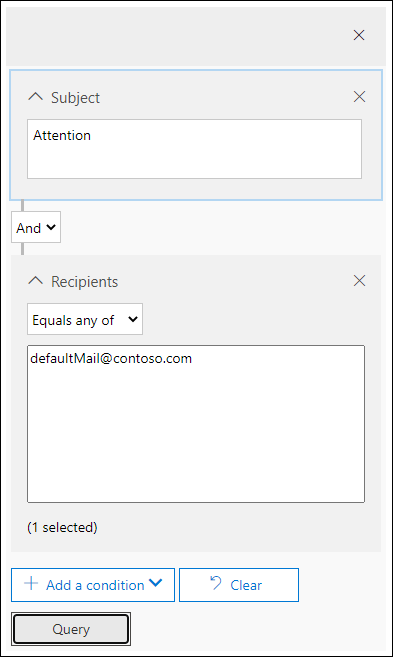

# Kwaadaardige e-mail onderzoeken en herstellen die in Office 365 is geleverdInvestigate and remediate malicious email that was delivered in Office 365

[Met Office 365 Advanced Threat Protection](office-365-atp.md) u activiteiten onderzoeken die mensen in uw organisatie in gevaar brengen en actie ondernemen om uw organisatie te beschermen.[Office 365 Advanced Threat Protection](office-365-atp.md) enables you to investigate activities that put people in your organization at risk, and to take action to protect your organization. Als u bijvoorbeeld deel uitmaakt van het beveiligingsteam van uw organisatie, u verdachte e-mailberichten die zijn bezorgd, vinden en onderzoeken.For example, if you are part of your organization's security team, you can find and investigate suspicious email messages that were delivered. U dit doen met [Threat Explorer (of real-time detecties).](threat-explorer.md)You can do this by using [Threat Explorer (or real-time detections)](threat-explorer.md).
  
## Voordat u begint...Before you begin...

Zorg ervoor dat aan de volgende eisen wordt voldaan:Make sure that the following requirements are met:
  
- Uw organisatie heeft [Office 365 Advanced Threat Protection](office-365-atp.md) en licenties zijn toegewezen aan [gebruikers.](../../admin/manage/assign-licenses-to-users.md)Your organization has [Office 365 Advanced Threat Protection](office-365-atp.md) and [licenses are assigned to users](../../admin/manage/assign-licenses-to-users.md).
    
- [controlelogboekregistratie](../../compliance/turn-audit-log-search-on-or-off.md) is ingeschakeld voor uw organisatie.[audit logging](../../compliance/turn-audit-log-search-on-or-off.md) is turned on for your organization. 
    
- Uw organisatie heeft beleid gedefinieerd voor anti-spam, anti-malware, anti-phishing, enzovoort.Your organization has policies defined for anti-spam, anti-malware, anti-phishing, and so on. Zie [Beschermen tegen bedreigingen in Office 365](protect-against-threats.md).See [Protect against threats in Office 365](protect-against-threats.md).
    
- U bent een globale beheerder of u hebt de beveiligingsbeheerder of &amp; de rol Zoeken en verwijderen toegewezen in het Security Compliance Center.You are a global administrator, or you have either the Security Administrator or the Search and Purge role assigned in the Security &amp; Compliance Center. Zie [Machtigingen in &amp; het Security Compliance Center](permissions-in-the-security-and-compliance-center.md).See [Permissions in the Security &amp; Compliance Center](permissions-in-the-security-and-compliance-center.md). Voor sommige acties moet u ook een nieuwe voorbeeldrol hebben toegewezen.For some actions, you must also have a new Preview role assigned. 

#### Voorvertoning van functiemachtigingenPreview role permissions

Als u bepaalde acties wilt uitvoeren, zoals het bekijken van berichtkoppen of het downloaden van inhoud van e-mailberichten, moet u een nieuwe rol met de naam *Preview* hebben toegevoegd aan een andere geschikte rolgroep.To perform certain actions, such as viewing message headers or downloading email message content, you must have a new role called *Preview* added to another appropriate role group. In de volgende tabel worden vereiste rollen en machtigingen verduidelijkt.The following table clarifies required roles and permissions.

|ActiviteitActivity  |RolgroepRole group |Preview rol nodig?Preview role needed?  |
|---------|---------|---------|
|Threat Explorer (en realtime detecties) gebruiken om bedreigingen te analyserenUse Threat Explorer (and real-time detections) to analyze threats     |Globale beheerderGlobal Administrator   BeveiligingsbeheerderSecurity Administrator   BeveiligingslezerSecurity Reader     | NeeNo   |
|Threat Explorer (en realtime detecties) gebruiken om kopteksten voor e-mailberichten weer te geven en in quarantaine geplaatste e-mailberichten te bekijken en te downloadenUse Threat Explorer (and real-time detections) to view headers for email messages as well as preview and download quarantined email messages    |Globale beheerderGlobal Administrator   BeveiligingsbeheerderSecurity Administrator  BeveiligingslezerSecurity Reader   |       NeeNo  |
|Threat Explorer gebruiken om kopteksten weer te geven en e-mailberichten te downloaden die bij postvakken worden bezorgdUse Threat Explorer to view headers and download email messages delivered to mailboxes     |Globale beheerderGlobal Administrator  BeveiligingsbeheerderSecurity Administrator   BeveiligingslezerSecurity Reader   VoorbeeldPreview   |   JaYes      |

> [!NOTE]
> *Preview* is een rol en geen rolgroep; de voorbeeldrol moet worden toegevoegd aan een bestaande rolgroep voor Office 365.*Preview* is a role and not a role group; the Preview role must be added to an existing role group for Office 365. De functie Globale beheerder krijgt het Microsoft[https://admin.microsoft.com](https://admin.microsoft.com)365-beheercentrum ( ) toegewezen en de rollen[https://protection.office.com](https://protection.office.com)Beveiligingsbeheerder en Beveiligingslezer worden toegewezen in het Security & Compliance Center ( ).The Global Administrator role is assigned the Microsoft 365 admin center ([https://admin.microsoft.com](https://admin.microsoft.com)), and the Security Administrator and Security Reader roles are assigned in the Security & Compliance Center ([https://protection.office.com](https://protection.office.com)). Zie [Machtigingen in het Beveiligings& Compliance Center](permissions-in-the-security-and-compliance-center.md)voor meer informatie over rollen en machtigingen.To learn more about roles and permissions, see [Permissions in the Security & Compliance Center](permissions-in-the-security-and-compliance-center.md).

## Verdachte e-mail zoeken en verwijderen die is bezorgdFind and delete suspicious email that was delivered

Threat Explorer is een krachtig rapport dat meerdere doeleinden kan dienen, zoals het vinden en verwijderen van berichten, het identificeren van het IP-adres van een kwaadaardige e-mailafzender of het starten van een incident voor verder onderzoek.Threat Explorer is a powerful report that can serve multiple purposes, such as finding and deleting messages, identifying the IP address of a malicious email sender, or starting an incident for further investigation. De volgende procedure is gericht op het gebruik van Explorer om schadelijke e-mail uit de postvakken van de ontvanger te vinden en te verwijderen.The following procedure focuses on using Explorer to find and delete malicious email from recipient's mailboxes.

> [!NOTE]
> Standaardzoekopdrachten in Explorer bevatten momenteel geen Zapped-items.Default searches in Explorer don't currently include Zapped items.  Dit geldt voor alle weergaven, bijvoorbeeld malware of phish-weergaven.This applies to all views, for example malware or phish views. Om Zapped-items op te nemen, moet je een 'Delivery-actie' toevoegen om 'Verwijderd door ZAP' op te nemen.To include Zapped items you need to add a 'Delivery action' set to include 'Removed by ZAP'. Als u alle opties opneemt, ziet u alle resultaten van de leveringsactie, inclusief Zapped-artikelen.If you include all options, you'll see all delivery action results, including Zapped items.

1. **Navigeer naar Threat Explorer:** Ga naar [https://protection.office.com](https://protection.office.com) en meld u aan met uw werk- of schoolaccount voor Office 365.**Navigate to Threat Explorer**: Go to [https://protection.office.com](https://protection.office.com) and sign in using your work or school account for Office 365. Dit brengt u &amp; naar het Security Compliance Center.This takes you to the Security &amp; Compliance Center.

2. Kies in de snelle lancering van de navigatienavigatie de optie **Threat management** \> **Explorer**.In the left navigation quick-launch, choose **Threat management** \> **Explorer**.

    

    <!-- You may notice the new **Special actions** column. This feature is aimed at telling admins the outcome of processing an email. The **Special actions** column can be accessed in the same place as **Delivery action** and **Delivery location**. Special actions might be updated at the end of Threat Explorer's email timeline, which is a new feature aimed at making the hunting experience better for admins.-->

3. **Weergaven in Threat Explorer:** Kies in het menu **Weergave** **alle e-mail**.**Views in Threat Explorer**: In the **View** menu, choose **All email**.

    

    De *malware* weergave is momenteel de standaard, en vangt e-mails waar een malware bedreiging wordt gedetecteerd.The *Malware* view is currently the default, and captures emails where a malware threat is detected. De *Phish-visie* werkt op dezelfde manier, voor Phish.The *Phish* view operates in the same way, for Phish.

    Alle *e-mailweergave* bevat echter elke e-mail die door de organisatie is ontvangen, ongeacht of er bedreigingen zijn gedetecteerd of niet.However, *All email* view lists every mail received by the organization, whether threats were detected or not. Zoals u zich voorstellen, dit is een heleboel gegevens, dat is de reden waarom deze weergave toont een tijdelijke aanduiding die vraagt een filter worden toegepast.As you can imagine, this is a lot of data, which is why this view shows a placeholder that asks a filter be applied. (Deze weergave is alleen beschikbaar voor ATP P2-klanten.)(This view is only available for ATP P2 customers.)

    *In de weergave Inzendingen* toont alle e-mails die zijn ingediend door de beheerder of gebruiker die aan Microsoft zijn gemeld.*Submissions* view shows up all mails submitted by admin or user that were reported to Microsoft.

4. **Zoeken en filteren in Threat Explorer:** filters worden boven aan de pagina in de zoekbalk weergegeven om beheerders te helpen bij hun onderzoeken.**Search and filter in Threat Explorer**: Filters appear at the top of the page in the search bar to help admins in their investigations. Merk op dat meerdere filters tegelijkertijd kunnen worden toegepast en meerdere door komma's gescheiden waarden die aan een filter zijn toegevoegd om de zoekopdracht te beperken.Notice that multiple filters can be applied at the same time, and multiple comma-separated values added to a filter to narrow down the search. Herinneren:Remember:
    - Filters doen exacte matching op de meeste filtervoorwaarden.Filters do exact matching on most filter conditions.
    - Onderwerpfilter gebruikt een CONTAINS-query.Subject filter uses a CONTAINS query.
    - URL-filters werken met of zonder protocollen (bijvoorbeeld.URL filters work with or without protocols (ex. https).https).
    - Voor URL-domein-, URL-pad- en URL-domein- en padfilters is geen protocol vereist dat wordt gefilterd.URL domain, URL path, and URL domain and path filters don't require a protocol to filter.
    - U moet telkens op het pictogram Vernieuwen klikken wanneer u de filterwaarden wijzigt om relevante resultaten te krijgen.You must click the Refresh icon every time you change the filter values to get relevant results.

5. **Geavanceerde filters:** Met deze filters u complexe query's maken en uw gegevensset filteren.**Advanced filters**: With these filters, you can build complex queries and filter your data set. Als u op *Geavanceerde filters klikt,* wordt een flyout met opties geopend.Clicking on *Advanced Filters* opens a flyout with options.

   Geavanceerde filtering is een geweldige aanvulling op de zoekmogelijkheden.Advanced filtering is a great addition to search capabilities. Er is een booleaans **NIET-filter** geïntroduceerd op het domein *Ontvanger,* *Afzender* en *Afzender,* zodat beheerders het kunnen onderzoeken door waarden uit te sluiten.A boolean **NOT** filter has been introduced on *Recipient*, *Sender* and *Sender domain* to allow admins to investigate by excluding values. Deze optie wordt weergegeven onder selectieparameter *Bevat geen van*.This option appears under selection parameter *Contains none of*. **NOT** laat beheerders waarschuwingspostvakken uitsluiten, standaard postvakken beantwoorden van hun onderzoeken en is handig voor gevallen waarin beheerders zoeken naar een specifiek onderwerp (onderwerp="Aandacht") waarbij de ontvanger kan worden ingesteld op *geen van defaultMail@contoso.com*.**NOT** will let admins exclude alert mailboxes, default reply mailboxes from their investigations, and is useful for cases where admins search for a specific subject (subject="Attention") where the Recipient can be set to *none of defaultMail@contoso.com*. Dit is een exacte waarde zoeken.This is an exact value search.

   

   *Filteren op uren* helpt het beveiligingsteam van uw organisatie snel in te zoomen.*Filtering by hours* will help your organization's security team drill down quickly. De kortste toegestane tijdis 30 minuten.The shortest allowed time duration is 30 minutes. Als u de verdachte actie beperken op tijdskader (bijvoorbeeld het gebeurde 3 uur geleden), zal dit de context beperken en helpen het probleem lokaliseren.If you can narrow the suspicious action by time-frame (e.g. it happened 3 hours ago), this will limit the context and help pinpoint the problem.

  

6. **Velden in threat explorer**: Threat Explorer onthult veel meer beveiligingsgerelateerde e-mailinformatie, zoals *delivery actie*, *Delivery locatie*, *Speciale actie*, *Directionaliteit*, *Overrides*en *URL bedreiging*.**Fields in threat explorer**: Threat Explorer exposes a lot more security-related mail information such as *Delivery action*, *Delivery location*, *Special action*, *Directionality*, *Overrides*, and *URL threat*. Het stelt het beveiligingsteam van uw organisatie ook in staat om met een grotere zekerheid te onderzoeken.It also allows your organization's security team to investigate with a higher certainty. 

    *Leveringsactie* is de actie die wordt uitgevoerd op een e-mail vanwege bestaande beleidsregels of detecties.*Delivery action* is the action taken on an email due to existing policies or detections. Hier zijn de mogelijke acties die een e-mail kan ondernemen:Here are the possible actions an email can take:
    - **Geleverd** - e-mail is geleverd aan de inbox of map van een gebruiker en de gebruiker heeft er rechtstreeks toegang toe.**Delivered** – email was delivered to inbox or folder of a user and the user can directly access it.
    - **Ongewenste** e-mail (geleverd aan ongewenste e-mail): e-mail is verzonden naar de ongewenste map van een gebruiker of verwijderde map, en de gebruiker heeft toegang tot e-mailberichten in de map Ongewenste of verwijderde bestanden.**Junked** (Delivered to junk)– email was sent to either user's junk folder or deleted folder, and the user has access to email messages in their Junk or Deleted folder.
    - **Geblokkeerd** : alle e-mailberichten die in quarantaine zijn geplaatst, die zijn mislukt of zijn verwijderd.**Blocked** – any email messages that are quarantined, that failed, or were dropped. (Dit is volledig ontoegankelijk voor de gebruiker.)(This is completely inaccessible by the user.)
    - **Vervangen** : elke e-mail waarin schadelijke bijlagen worden vervangen door .txt-bestanden waarin staat dat de bijlage schadelijk was**Replaced** – any email where malicious attachments are replaced by .txt files that state the attachment was malicious

    **Leveringslocatie**: Het filter Locatie bezorging is beschikbaar om beheerders te helpen begrijpen waar vermoedelijke schadelijke e-mail is beland en welke acties er op zijn uitgevoerd.**Delivery location**: The Delivery location filter is available in order to help admins understand where suspected malicious mail ended-up and what actions were taken on it. De resulterende gegevens kunnen worden geëxporteerd naar spreadsheets.The resulting data can be exported to spreadsheet. Mogelijke bezorglocaties zijn:Possible delivery locations are:
    - **Postvak IN of map** : de e-mail bevindt zich in het Postvak IN of een specifieke map, volgens uw e-mailregels.**Inbox or folder** – The email is in the Inbox or a specific folder, according to your email rules.
    - **On-prem of extern** – Het postvak bestaat niet in de cloud, maar is on-premises.**On-prem or external** – The mailbox doesn't exist in the Cloud but is on-premises.
    - **Map ongewenste e-mail** : de e-mail bevindt zich in de map Ongewenste e-mail van een gebruiker.**Junk folder** – The email is in a user's Junk mail folder.
    - **Map verwijderde items :** de e-mail bevindt zich in de map Verwijderde items van een gebruiker.**Deleted items folder** – The email is in a user's Deleted items folder.
    - **Quarantaine** : de e-mail in quarantaine en niet in het postvak van een gebruiker.**Quarantine** – The email in quarantine, and not in a user's mailbox.
    - **Mislukt** : de e-mail kan het postvak niet bereiken.**Failed** – The email failed to reach the mailbox.
    - **Dropped** - De e-mail is ergens in de e-mailstroom verloren gegaan.**Dropped** – The email was lost somewhere in the mail flow.

    **Directionaliteit:** Met deze optie kan uw beveiligingsteam filteren op de 'richting' waar een e-mail vandaan komt of gaat.**Directionality**: This option allows your security operations team to filter by the 'direction' a mail comes from, or is going. Directionaliteitswaarden zijn *Inbound,* *Outbound*en *Intra-org* (overeenkomend met e-mail die van buitenaf in uw organisatie komt, vanuit uw organisatie wordt verzonden of intern naar uw organisatie wordt verzonden).Directionality values are *Inbound*, *Outbound*, and *Intra-org* (corresponding to mail coming into your org from outside, being sent out of your org, or being sent internally to your org, respectively). Deze informatie kan beveiligingsteams helpen spoofing en imitatie te herkennen, omdat er een mismatch is tussen de waarde Directionaliteit (bijvoorbeeld.This information can help security operations teams spot spoofing and impersonation, because a mismatch between the Directionality value (ex. *Inbound*), en het domein van de afzender (dat *lijkt* te zijn een intern domein) zal duidelijk zijn!*Inbound*), and the domain of the sender (which *appears* to be an internal domain) will be evident! De waarde Directionaliteit is gescheiden en kan afwijken van de berichttracering.The Directionality value is separate, and can differ from, the Message Trace. Resultaten kunnen worden geëxporteerd naar spreadsheets.Results can be exported to spreadsheet.

    **Overschrijft:** Met dit filter worden gegevens weergegeven die op het tabblad gegevens van de e-mail *worden*weergegeven en wordt deze gebruikt om aan te geven waar het organisatie- of gebruikersbeleid is weergegeven voor het toestaan en blokkeren van e-mails.**Overrides**: This filter takes information that appears on the mail's details tab and uses it to expose where organizational, or user policies, for allowing and blocking mails have been *overridden*. Het belangrijkste aan dit filter is dat het beveiligingsteam van uw organisatie helpt te zien hoeveel verdachte e-mails zijn bezorgd vanwege de configuratie.The most important thing about this filter is that it helps your organization's security team see how many suspicious emails were delivered due to configuration. Dit geeft hen de mogelijkheid om te wijzigen staat en blokken als dat nodig is.This gives them an opportunity to modify allows and blocks as needed. Deze resultatenset van dit filter kan worden geëxporteerd naar spreadsheets.This result set of this filter can be exported to spreadsheet.

|Overschrijft Threat ExplorerThreat Explorer Overrides  | Wat ze bedoelenWhat they mean  |
|---------|---------|
|Toegestaan door het org-beleidAllowed by Org Policy     |   E-mail is toegestaan in de mailbox zoals aangegeven door het organisatiebeleid.Mail was allowed into the mailbox as directed by the organization policy.       |
|Geblokkeerd door het beleid van de organisatieBlocked by Org policy      |  E-mail is geblokkeerd van levering naar het postvak zoals aangegeven door het organisatiebeleid.Mail was blocked from delivery to the mailbox as directed by the organization policy.    |
|Bestandsextensie geblokkeerd door org-beleidFile extension blocked by Org Policy     | Bestand is geblokkeerd van levering naar het postvak zoals aangegeven door het organisatiebeleid.File was blocked from delivery to the mailbox as directed by the organization policy.        |
|Toegestaan door gebruikersbeleidAllowed by User Policy     | E-mail is toegestaan in het postvak zoals aangegeven door het gebruikersbeleid.Mail was allowed into the mailbox as directed by the user policy.        |
|Geblokkeerd door gebruikersbeleidBlocked by User Policy     | E-mail is geblokkeerd van levering naar het postvak zoals aangegeven door het gebruikersbeleid.Mail was blocked from delivery to the mailbox as directed by the user policy.        |

**URL-dreiging:** het veld URL-dreiging is opgenomen op het *tabblad details* van een e-mail om de bedreiging aan te geven die wordt weergegeven door een URL.**URL threat**: The URL threat field has been included on the *details* tab of an email to indicate the threat presented by a URL. Bedreigingen gepresenteerd door een URL kan *malware,* *Phish*, of *Spam,* en een URL *zonder bedreiging* zal zeggen *Geen* in de bedreigingen sectie.Threats presented by a URL can include *Malware*, *Phish*, or *Spam*, and a URL with *no threat* will say *None* in the threats section.

7. **Tijdlijnweergave e-mail:** uw beveiligingsteam moet mogelijk dieper ingaan op e-mailgegevens om verder onderzoek te doen.**Email timeline view**: Your security operations team might need to deep-dive into email details to investigate further. Met de e-mailtijdlijn kunnen beheerders acties bekijken die zijn uitgevoerd op een e-mail, van levering tot na levering.The email timeline allows admins to view actions taken on an email from delivery to post-delivery. Als u een e-mailtijdlijn wilt weergeven, klikt u op het onderwerp van een e-mailbericht en klikt u vervolgens op Tijdlijn e-mail.To view an email timeline, click on the subject of an email message, and then click Email timeline. (Het verschijnt onder andere koppen in het paneel zoals Samenvatting of Details.) Deze resultaten kunnen worden geëxporteerd naar spreadsheets.(It appears among other headings on the panel like Summary or Details.) These results can be exported to spreadsheet.

    De tijdlijn van de e-mail wordt geopend voor een tabel met alle leverings- en post-deliverygebeurtenissen voor de e-mail.Email timeline will open to a table that shows all delivery and post-delivery events for the email. Als er geen verdere acties op de e-mail, moet u een enkele gebeurtenis voor de oorspronkelijke levering die een resultaat, zoals *Geblokkeerd,* met een vonnis als *Phish*staat.If there are no further actions on the email, you should see a single event for the original delivery that states a result, such as *Blocked*, with a verdict like *Phish*. Beheerders kunnen de volledige e-mailtijdlijn exporteren, inclusief alle gegevens op het tabblad en e-mail (zoals onderwerp, afzender, ontvanger, netwerk en bericht-id).Admins can export the entire email timeline, including all details on the tab and email (such as, Subject, Sender, Recipient, Network, and Message ID). De e-mailtijdlijn vermindert randomisatie omdat er minder tijd wordt besteed aan het controleren van verschillende locaties om te proberen gebeurtenissen te begrijpen die zijn gebeurd sinds de e-mail is aangekomen.The email timeline cuts down on randomization because there is less time spent checking different locations to try to understand events that happened since the email arrived. Wanneer meerdere gebeurtenissen op of in de buurt van een e-mail tegelijkertijd plaatsvinden, worden deze gebeurtenissen weergegeven in een tijdlijnweergave.When multiple events happen at, or close to, the same time on an email, those events show up in a timeline view.

8. **Preview / download**: Threat Explorer geeft uw beveiligingsteam de details die ze nodig hebben om verdachte e-mail te onderzoeken.**Preview / download**: Threat Explorer gives your security operations team the details they need to investigate suspicious email. Uw beveiligingsteam kan:Your security operations team can either:

    - [Controleer de leveringsactie en locatie](#check-the-delivery-action-and-location).[Check the delivery action and location](#check-the-delivery-action-and-location).

    - [Bekijk de tijdlijn van uw e-mail.](#view-the-timeline-of-your-email)[View the timeline of your email](#view-the-timeline-of-your-email).

    ##### Controleer de leveringsactie en -locatieCheck the delivery action and location

    In [Threat Explorer (en real-time detecties)](threat-explorer.md)hebt u nu **kolommen Leveringsactie** en **leveringslocatie** in plaats van de voormalige kolom **Leveringsstatus.**In [Threat Explorer (and real-time detections)](threat-explorer.md), you now have **Delivery Action** and **Delivery Location** columns instead of the former **Delivery Status** column. Dit resulteert in een completer beeld van waar uw e-mailberichten landen.This results in a more complete picture of where your email messages land. Een deel van het doel van deze wijziging is om onderzoeken gemakkelijker te maken voor beveiligingsteams, maar het nettoresultaat is het in één oogopslag kennen van de locatie van probleeme-mailberichten.Part of the goal of this change is to make investigations easier for security operations teams, but the net result is knowing the location of problem email messages at a glance.

    De leveringsstatus is nu opgesplitst in twee kolommen:Delivery Status is now broken out into two columns:

    - **Bezorgactie** - Wat is de status van deze e-mail?**Delivery action** - What is the status of this email?

    - **Leveringslocatie** - Waar is deze e-mail naartoe gerouteerd?**Delivery location** - Where was this email routed as a result?

    Leveringsactie is de actie die wordt uitgevoerd op een e-mail vanwege bestaande beleidsregels of detecties.Delivery action is the action taken on an email due to existing policies or detections. Hier zijn de mogelijke acties die een e-mail kan ondernemen:Here are the possible actions an email can take:

    - **Geleverd** - e-mail is geleverd aan de inbox of map van een gebruiker en de gebruiker heeft er rechtstreeks toegang toe.**Delivered** – email was delivered to inbox or folder of a user and the user can directly access it.

    - **Ongewenste** e-mail is verzonden naar de ongewenste map van een gebruiker of verwijderde map, en de gebruiker heeft toegang tot e-mailberichten in de map Ongewenste of verwijderde.**Junked** – email was sent to either user's junk folder or deleted folder, and the user has access to email messages in their Junk or Deleted folder.

    - **Geblokkeerd** : alle e-mailberichten die in quarantaine zijn geplaatst, die zijn mislukt of zijn verwijderd.**Blocked** – any email messages that are quarantined, that failed, or were dropped. (Dit is volledig ontoegankelijk voor de gebruiker.)(This is completely inaccessible by the user.)

    - **Vervangen** : elke e-mail waarin schadelijke bijlagen worden vervangen door .txt-bestanden waarin staat dat de bijlage schadelijk was.**Replaced** – any email where malicious attachments are replaced by .txt files that state the attachment was malicious.
 
    De leveringslocatie toont de resultaten van beleid en detecties die na levering worden uitgevoerd.Delivery location shows the results of policies and detections that run post-delivery. Het is gekoppeld aan een bezorgactie.It's linked to a Delivery Action. Dit veld is toegevoegd om inzicht te geven in de actie die wordt ondernomen wanneer een probleemmail wordt gevonden.This field was added to give insight into the action taken when a problem mail is found. Hier zijn de mogelijke waarden van de levering locatie:Here are the possible values of delivery location:

    - **Postvak IN of map** : de e-mail bevindt zich in de inbox of een map (volgens uw e-mailregels).**Inbox or folder** – The email is in the inbox or a folder (according to your email rules).

    - **On-prem of extern** – Het postvak bestaat niet in de cloud, maar is on-premises.**On-prem or external** – The mailbox doesn't exist on cloud but is on-premises.

    - **Map ongewenste e-mail** : de e-mail bevindt zich in de map Ongewenste e-mail.**Junk folder** – The email is in a user's Junk folder.

    - **Map verwijderde items :** de e-mail bevindt zich in de map Verwijderde items van een gebruiker.**Deleted items folder** – The email is in a user's Deleted items folder.

    - **Quarantaine** : de e-mail in quarantaine en niet in het postvak van een gebruiker.**Quarantine** – The email in quarantine, and not in a user's mailbox.

    - **Mislukt** : de e-mail kan het postvak niet bereiken.**Failed** – The email failed to reach the mailbox.

    - **Dropped** - De e-mail gaat ergens verloren in de e-mailstroom.**Dropped** – The email gets lost somewhere in the mail flow.

     ##### De tijdlijn van uw e-mail weergevenView the timeline of your email
  
     **E-mailtijdlijn** is een veld in Threat Explorer dat de jacht eenvoudiger maakt voor uw beveiligingsteam.**Email Timeline** is a field in Threat Explorer that makes hunting easier for your security operations team. Wanneer meerdere gebeurtenissen op of in de buurt van dezelfde tijd op een e-mail plaatsvinden, worden deze gebeurtenissen weergegeven in een tijdlijnweergave.When multiple events happen at or close to the same time on an email, those events show up in a timeline view. Sommige gebeurtenissen die plaatsvinden na levering aan e-mail worden vastgelegd in de kolom **Speciale acties.**Some events that happen post-delivery to email are captured in the **Special actions** column. Het combineren van informatie uit de tijdlijn van een e-mailbericht met speciale acties die na de levering zijn uitgevoerd, geeft beheerders inzicht in beleid en bedreigingsafhandeling (zoals waar de e-mail is gerouteerd en, in sommige gevallen, wat de uiteindelijke beoordeling was).Combining information from the timeline of an email message with any special actions that were taken post-delivery gives admins insight into policies and threat handling (such as where the mail was routed, and, in some cases, what the final assessment was).

<!-- Reference material

1. **Navigate to Threat Explorer**: Go to [https://protection.office.com](https://protection.office.com) and sign in using your work or school account for Office 365. This takes you to the Security &amp; Compliance Center. 

2. In the left navigation quick-launch, choose **Threat management** \> **Explorer**.

3. Click on the subject of an email message, and then click **Email timeline**. (It appears among other headings on the panel like **Summary** or **Details**.)

    Once you've opened the email timeline, you should see a table that tells you the post-delivery events for that mail. In the case of no further events for the email, you should see a single event for the original delivery that states a result like **Blocked** with a verdict like **Phish**. The tab also has the option to export the entire email timeline, and this exports all the details on the tab and details on the email (things like Subject, Sender, Recipient, Network, and Message ID).

    The email timeline cuts down on randomization because there is less time spent checking different locations to try to understand events that happened since the email arrived. When multiple events happen at, or close to, the same time on an email, those events show up in a timeline view. 
    
    Some events that happen post-delivery to your mail are captured in the **Special actions** column. Combining the information from the email timeline along with special actions taken on email post-delivery gives admins insight into how their policies work, where the email was finally routed, and, in some cases, what the final assessment was. 

4. In the **View** menu, choose **All email**.

    
  
    Notice the labels that appear in the report, such as **Delivered**, **Unknown**, or **Delivered to junk**.

    
    
    (Depending on the actions that were taken on email messages for your organization, you might see other labels, such as **Blocked** or **Replaced**.)
    
5. In the report, choose **Delivered** to view only email messages that ended up in users' inboxes.

    
  
6. Below the chart, review the **Email** list below the chart.

    
  
7. In the list, choose an item to view more details about that email message. For example, you can click the subject line to view information about the sender, recipients, attachments, and other similar email messages.

    
  
8. After viewing information about email messages, select one or more items in the list to activate **+ Actions**.
    
9. Use the **+ Actions** list to apply an action, such as **Move to deleted** items. This deletes the selected messages from the recipients' mailboxes.

    

## Dealing with suspicious email messages

Malicious attackers might be sending mail to people in your organization in an attempt to phish their credentials and gain access to your corporate secrets. To help prevent this, you use the threat protection services in Office 365, including [Exchange Online Protection](exchange-online-protection-overview.md) and [Advanced Threat Protection](office-365-atp.md). However, it occasionally happens that an attacker sends email that contains a link (URL) that only later points to malicious content (such as malware). Or, you might realize too late that someone in your organization has been compromised, and while they were compromised, an attacker used their account to send email to other people in your organization. As part of dealing with either of these scenarios, you can remove suspicious email messages from user inboxes. To do that, you can use [Threat Explorer](threat-explorer.md).

## Finding re-routed email messages after actions are taken

Threat Explorer provides your security operations team with the details they need to investigate suspicious email. Your security operations team can:

- [View the email headers and download the email body](#view-the-email-headers-and-download-the-email-body) 

- [Check the delivery action and location](#check-the-delivery-action-and-location)

- [View the timeline of your email](#view-the-timeline-of-your-email)

### View the email headers and download the email body

The ability to preview email headers and download the body of an email body are powerful capabilities in Threat Explorer. Appropriate [permissions](permissions-in-the-security-and-compliance-center.md) must be assigned. See [Preview role permissions](#preview-role-permissions).

To access your message header and email download options, follow these steps: 

1. Go to [https://protection.office.com](https://protection.office.com) and sign in using your work or school account for Office 365. This takes you to the Security &amp; Compliance Center. 
    
2. In the left navigation, choose **Threat management** \> **Explorer**.

3. Click on a subject in the Threat Explorer table. 

    This opens the flyout, where both header preview and email download links are positioned.

    

> [!IMPORTANT]
> This capability doesn't show up for email messages that were never found in a user's mailbox, which can happen if an email was dropped or its delivery failed. In cases where email messages were deleted from users' mailboxes, admins see a "Mail not found" error message.
-->

## Verwante onderwerpenRelated topics

[Office 365 Advanced Threat ProtectionOffice 365 Advanced Threat Protection](office-365-ti.md)
  
[Beschermen tegen bedreigingen in Office 365Protect against threats in Office 365](protect-against-threats.md)
  
[Rapporten weergeven voor geavanceerde bedreigingsbeveiliging van Office 365View reports for Office 365 Advanced Threat Protection](view-reports-for-atp.md)
