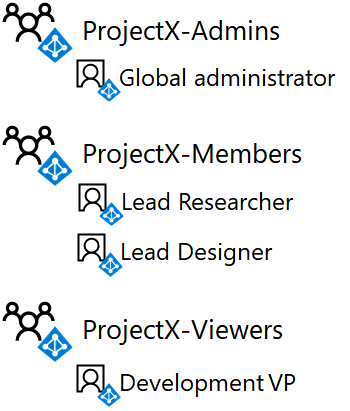

# <a name="isolated-sharepoint-online-team-site-devtest-environment"></a><span data-ttu-id="48e2d-103">Geïsoleerde ontwikkelaar van SharePoint Online-team site/testomgeving</span><span class="sxs-lookup"><span data-stu-id="48e2d-103">Isolated SharePoint Online team site dev/test environment</span></span>

[!INCLUDE [Microsoft 365 Defender rebranding](../includes/microsoft-defender-for-office.md)]


 <span data-ttu-id="48e2d-104">**Overzicht:** Configureer een SharePoint Online-team site die is geïsoleerd van de rest van de organisatie in uw Microsoft 365-ontwikkelomgeving/testomgeving.</span><span class="sxs-lookup"><span data-stu-id="48e2d-104">**Summary:** Configure a SharePoint Online team site that is isolated from the rest of the organization in your Microsoft 365 dev/test environment.</span></span>

<span data-ttu-id="48e2d-105">SharePoint Online-team sites in Microsoft 365 zijn locaties voor samenwerking waarbij een gemeenschappelijke documentbibliotheek, een OneNote-notitieblok en andere services worden gebruikt.</span><span class="sxs-lookup"><span data-stu-id="48e2d-105">SharePoint Online team sites in Microsoft 365 are locations for collaboration using a common document library, a OneNote notebook, and other services.</span></span> <span data-ttu-id="48e2d-106">In veel gevallen wilt u toegang hebben tot de hele afdeling of organisatie.</span><span class="sxs-lookup"><span data-stu-id="48e2d-106">In many cases, you want wide access and collaboration across departments or organizations.</span></span> <span data-ttu-id="48e2d-107">In sommige gevallen wilt u echter de toegang en machtigingen voor samenwerking tussen een kleine groep personen nauwkeurig beheren.</span><span class="sxs-lookup"><span data-stu-id="48e2d-107">However, in some cases, you want to tightly control the access and permissions for collaboration among a small group of people.</span></span>

<span data-ttu-id="48e2d-108">Toegang tot SharePoint Online-team sites en wat gebruikers kunnen doen, wordt beheerd door SharePoint-groepen en machtigingsniveaus.</span><span class="sxs-lookup"><span data-stu-id="48e2d-108">Access to SharePoint Online team sites and what users can do is controlled by SharePoint groups and permission levels.</span></span> <span data-ttu-id="48e2d-109">SharePoint Online-sites hebben standaard drie toegangsniveaus:</span><span class="sxs-lookup"><span data-stu-id="48e2d-109">By default, SharePoint Online sites have three levels of access:</span></span>

- <span data-ttu-id="48e2d-110">**Leden**van de site, die de bronnen op de site kunnen bekijken, maken en wijzigen.</span><span class="sxs-lookup"><span data-stu-id="48e2d-110">**Members**, who can view, create, and modify resources on the site.</span></span>

- <span data-ttu-id="48e2d-111">**Eigenaren**van de volledige controle over de site, waaronder de mogelijkheid om machtigingen te wijzigen.</span><span class="sxs-lookup"><span data-stu-id="48e2d-111">**Owners**, who have complete control of the site, including the ability to change permissions.</span></span>

- <span data-ttu-id="48e2d-112">**Gebruikers**die alleen de resources op de site kunnen weergeven.</span><span class="sxs-lookup"><span data-stu-id="48e2d-112">**Visitors**, who only can view resources on the site.</span></span>

<span data-ttu-id="48e2d-113">In dit artikel wordt u stapsgewijs begeleid bij de configuratie van een alleenstaande SharePoint Online-team site voor een Secret Research project met de naam Projectx.</span><span class="sxs-lookup"><span data-stu-id="48e2d-113">This article steps you through the configuration of an isolated SharePoint Online team site for a secret research project named ProjectX.</span></span> <span data-ttu-id="48e2d-114">De toegangsvereisten zijn:</span><span class="sxs-lookup"><span data-stu-id="48e2d-114">The access requirements are:</span></span>

- <span data-ttu-id="48e2d-115">Alleen leden van het project hebben toegang tot de site en de inhoud daarvan (documenten, OneNote-notitieblok, pagina's), met behulp van SharePoint-machtigingsniveaus die worden beheerd via groepslidmaatschap.</span><span class="sxs-lookup"><span data-stu-id="48e2d-115">Only members of the project can access the site and its contents (documents, OneNote Notebook, Pages), with edit and view SharePoint permission levels controlled through group membership.</span></span>

- <span data-ttu-id="48e2d-116">Alleen de site Auteur en leden van een groep beheerders van de site kunnen Sitebeheer uitvoeren, waaronder het wijzigen van machtigingen op siteniveau.</span><span class="sxs-lookup"><span data-stu-id="48e2d-116">Only the site creator and members of an Admins group for the site can perform site administration, which includes modifying site-level permissions.</span></span>

<span data-ttu-id="48e2d-117">U kunt op drie manieren een geïsoleerde SharePoint Online-team site instellen in uw Microsoft 365-ontwikkelomgeving/testomgeving:</span><span class="sxs-lookup"><span data-stu-id="48e2d-117">There are three phases to setting up an isolated SharePoint Online team site in your Microsoft 365 dev/test environment:</span></span>

1. <span data-ttu-id="48e2d-118">Maak de Microsoft 365 dev/testomgeving.</span><span class="sxs-lookup"><span data-stu-id="48e2d-118">Create the Microsoft 365 dev/test environment.</span></span>

2. <span data-ttu-id="48e2d-119">Maak de gebruikers en groepen voor Projectx.</span><span class="sxs-lookup"><span data-stu-id="48e2d-119">Create the users and groups for ProjectX.</span></span>

3. <span data-ttu-id="48e2d-120">Maak een nieuwe Projectx SharePoint Online-team site en Isoleer dit.</span><span class="sxs-lookup"><span data-stu-id="48e2d-120">Create a new ProjectX SharePoint Online team site and isolate it.</span></span>

> [!TIP]
> <span data-ttu-id="48e2d-121">Klik [hier](https://aka.ms/catlgstack) voor een visuele kaart voor alle artikelen in de ene Microsoft Cloud test lab-gids.</span><span class="sxs-lookup"><span data-stu-id="48e2d-121">Click [here](https://aka.ms/catlgstack) for a visual map to all the articles in the One Microsoft Cloud Test Lab Guide stack.</span></span>

## <a name="phase-1-build-out-your-lightweight-or-simulated-enterprise-microsoft-365-devtest-environment"></a><span data-ttu-id="48e2d-122">Fase 1: uw lichtgewicht of gesimuleerde Enterprise Microsoft 365 dev/testomgeving maken</span><span class="sxs-lookup"><span data-stu-id="48e2d-122">Phase 1: Build out your lightweight or simulated enterprise Microsoft 365 dev/test environment</span></span>

<span data-ttu-id="48e2d-123">Als u een afzonderlijke SharePoint Online-team site op een lichte manier wilt maken met de minimumvereisten, volgt u de instructies in de fasen 2 en 3 van [de Lightweight Base configuration](https://docs.microsoft.com/microsoft-365/enterprise/lightweight-base-configuration-microsoft-365-enterprise).</span><span class="sxs-lookup"><span data-stu-id="48e2d-123">If you just want to create an isolated SharePoint Online team site in a lightweight way with the minimum requirements, follow the instructions in phases 2 and 3 of [The lightweight base configuration](https://docs.microsoft.com/microsoft-365/enterprise/lightweight-base-configuration-microsoft-365-enterprise).</span></span>

<span data-ttu-id="48e2d-124">Als u een geïsoleerde SharePoint Online-team site wilt maken in de gesimuleerde Enterprise-configuratie, volgt u de instructies in de [wachtwoord hash-synchronisatie voor uw Microsoft 365-testomgeving](https://docs.microsoft.com/microsoft-365/enterprise/password-hash-sync-m365-ent-test-environment).</span><span class="sxs-lookup"><span data-stu-id="48e2d-124">If you want to create an isolated SharePoint Online team site in a simulated enterprise configuration, follow the instructions in [Password hash synchronization for your Microsoft 365 test environment](https://docs.microsoft.com/microsoft-365/enterprise/password-hash-sync-m365-ent-test-environment).</span></span>

> [!NOTE]
> <span data-ttu-id="48e2d-125">Voor het maken van een geïsoleerde SharePoint Online-site is de gesimuleerde Enterprise dev/testomgeving niet vereist, waaronder een gesimuleerd intranet dat verbonden is met internet en adreslijstsynchronisatie van een Active Directory Domain Services (AD DS)-forest.</span><span class="sxs-lookup"><span data-stu-id="48e2d-125">Creating an isolated SharePoint Online site does not require the simulated enterprise dev/test environment, which includes a simulated intranet connected to the Internet and directory synchronization for a Active Directory Domain Services (AD DS) forest.</span></span> <span data-ttu-id="48e2d-126">U kunt dit hier opgeven als een optie, zodat u een geïsoleerde SharePoint Online-site kunt testen en in een omgeving kunt experimenteren die een typische organisatie voorstelt.</span><span class="sxs-lookup"><span data-stu-id="48e2d-126">It is provided here as an option so that you can test an isolated SharePoint Online site and experiment with it in an environment that represents a typical organization.</span></span>

## <a name="phase-2-create-user-accounts-and-access-groups"></a><span data-ttu-id="48e2d-127">Fase 2: gebruikersaccounts en toegangsgroepen maken</span><span class="sxs-lookup"><span data-stu-id="48e2d-127">Phase 2: Create user accounts and access groups</span></span>

<span data-ttu-id="48e2d-128">Gebruik de instructies in [verbinding maken met Office 365 PowerShell](https://docs.microsoft.com/microsoft-365/enterprise/connect-to-microsoft-365-powershell) om verbinding te maken met uw proefabonnement met uw globale-beheerdersaccount van:</span><span class="sxs-lookup"><span data-stu-id="48e2d-128">Use the instructions in [Connect to Office 365 PowerShell](https://docs.microsoft.com/microsoft-365/enterprise/connect-to-microsoft-365-powershell) to connect to your trial subscription with your global administrator account from:</span></span>

- <span data-ttu-id="48e2d-129">Uw computer (voor de lichte Microsoft 365-omgeving voor ontwikkelaars/testen).</span><span class="sxs-lookup"><span data-stu-id="48e2d-129">Your computer (for the lightweight Microsoft 365 dev/test environment).</span></span>

- <span data-ttu-id="48e2d-130">De virtuele computer van CLIENT1 (voor de gesimuleerde Enterprise Microsoft 365 dev/testomgeving).</span><span class="sxs-lookup"><span data-stu-id="48e2d-130">The CLIENT1 virtual machine (for the simulated enterprise Microsoft 365 dev/test environment).</span></span>

<span data-ttu-id="48e2d-131">Als u de nieuwe toegangsgroepen wilt maken voor de team site van Projectx SharePoint Online, voert u deze opdrachten uit in de Windows Azure Active Directory-module voor Windows PowerShell:</span><span class="sxs-lookup"><span data-stu-id="48e2d-131">To create the new access groups for the ProjectX SharePoint Online team site, run these commands from the Windows Azure Active Directory Module for Windows PowerShell prompt:</span></span>

```powershell
$groupName="ProjectX-Members"
$groupDesc="People allowed to collaborate for ProjectX."
New-MsolGroup -DisplayName $groupName -Description $groupDesc
$groupName="ProjectX-Admins"
$groupDesc="People allowed to administer SharePoint for ProjectX."
New-MsolGroup -DisplayName $groupName -Description $groupDesc
$groupName="ProjectX-Viewers"
$groupDesc="People allowed to view the SharePoint resources for ProjectX."
New-MsolGroup -DisplayName $groupName -Description $groupDesc
```

<span data-ttu-id="48e2d-132">Vul de naam van uw organisatie in (voorbeeld: contosotoycompany), het landnummer van twee tekens voor uw locatie en voer de volgende opdrachten uit vanuit de Windows Azure Active Directory-module voor Windows PowerShell-prompt:</span><span class="sxs-lookup"><span data-stu-id="48e2d-132">Fill in your organization name (example: contosotoycompany), the two-character country code for your location, and then run the following commands from the Windows Azure Active Directory Module for Windows PowerShell prompt:</span></span>

```powershell
$orgName="<organization name>"
$loc="<two-character country code, such as US>"
$licAssignment= $orgName + ":ENTERPRISEPREMIUM"
$userName= "designer@" + $orgName + ".onmicrosoft.com"
New-MsolUser -DisplayName "Lead Designer" -FirstName Lead -LastName Designer -UserPrincipalName $userName -UsageLocation $loc -LicenseAssignment $licAssignment -ForceChangePassword $false
```

<span data-ttu-id="48e2d-133">Let in de weergave van de **MsolUser-** opdracht op het gegenereerde wachtwoord voor het account van de potentiële klant en neem het op een veilige locatie op.</span><span class="sxs-lookup"><span data-stu-id="48e2d-133">From the display of the **New-MsolUser** command, note the generated password for the Lead Designer account and record it in a safe location.</span></span>

<span data-ttu-id="48e2d-134">Voer de volgende opdrachten uit in de Windows Azure Active Directory-module voor Windows PowerShell:</span><span class="sxs-lookup"><span data-stu-id="48e2d-134">Run the following commands from the Windows Azure Active Directory Module for Windows PowerShell prompt:</span></span>

```powershell
$userName= "researcher@" + $orgName + ".onmicrosoft.com"
New-MsolUser -DisplayName "Lead Researcher" -FirstName Lead -LastName Researcher -UserPrincipalName $userName -UsageLocation $loc -LicenseAssignment $licAssignment -ForceChangePassword $false
```

<span data-ttu-id="48e2d-135">Let in de weergave van de **MsolUser-** opdracht op het gegenereerde wachtwoord voor het account van de potentiële klant voor de potentiële klant en leg dit op een veilige plaats vast.</span><span class="sxs-lookup"><span data-stu-id="48e2d-135">From the display of the **New-MsolUser** command, note the generated password for the Lead Researcher account and record it in a safe location.</span></span>

<span data-ttu-id="48e2d-136">Voer de volgende opdrachten uit in de Windows Azure Active Directory-module voor Windows PowerShell:</span><span class="sxs-lookup"><span data-stu-id="48e2d-136">Run the following commands from the Windows Azure Active Directory Module for Windows PowerShell prompt:</span></span>

```powershell
$userName= "devvp@" + $orgName + ".onmicrosoft.com"
New-MsolUser -DisplayName "Development VP" -FirstName Development -LastName VP -UserPrincipalName $userName -UsageLocation $loc -LicenseAssignment $licAssignment -ForceChangePassword $false
```

<span data-ttu-id="48e2d-137">Let in de weergave van de **nieuwe MsolUser-** opdracht op het gegenereerde wachtwoord voor het account van Development VP en leg dit op een veilige plaats vast.</span><span class="sxs-lookup"><span data-stu-id="48e2d-137">From the display of the **New-MsolUser** command, note the generated password for the Development VP account and record it in a safe location.</span></span>

<span data-ttu-id="48e2d-138">Vervolgens kunt u de nieuwe accounts toevoegen aan de nieuwe toegangsgroepen door deze PowerShell-opdrachten uit te voeren vanuit de Windows Azure Active Directory-module voor Windows PowerShell:</span><span class="sxs-lookup"><span data-stu-id="48e2d-138">Next, to add the new accounts to the new access groups, run these PowerShell commands from the Windows Azure Active Directory Module for Windows PowerShell prompt:</span></span>

```powershell
$grpName="ProjectX-Members"
$userUPN="designer@" + $orgName + ".onmicrosoft.com"
Add-MsolGroupMember -GroupObjectId (Get-MsolGroup | Where { $_.DisplayName -eq $grpName }).ObjectID -GroupMemberObjectId (Get-MsolUser | Where { $_.UserPrincipalName -eq $userUPN }).ObjectID -GroupMemberType "User"
$userUPN="researcher@" + $orgName + ".onmicrosoft.com"
Add-MsolGroupMember -GroupObjectId (Get-MsolGroup | Where { $_.DisplayName -eq $grpName }).ObjectID -GroupMemberObjectId (Get-MsolUser | Where { $_.UserPrincipalName -eq $userUPN }).ObjectID -GroupMemberType "User"
$grpName="ProjectX-Admins"
Add-MsolGroupMember -GroupObjectId (Get-MsolGroup | Where { $_.DisplayName -eq $grpName }).ObjectID -GroupMemberObjectId (Get-MsolUser | Where { $_.UserPrincipalName -eq $userCredential.UserName }).ObjectID -GroupMemberType "User"
$grpName="ProjectX-Viewers"
$userUPN="devvp@" + $orgName + ".onmicrosoft.com"
Add-MsolGroupMember -GroupObjectId (Get-MsolGroup | Where { $_.DisplayName -eq $grpName }).ObjectID -GroupMemberObjectId (Get-MsolUser | Where { $_.UserPrincipalName -eq $userUPN }).ObjectID -GroupMemberType "User"
```

<span data-ttu-id="48e2d-139">Uitvoer</span><span class="sxs-lookup"><span data-stu-id="48e2d-139">Results:</span></span>

- <span data-ttu-id="48e2d-140">De groep Projectx-leden bevat de gebruikersaccounts voor de potentiële klant en de gebruikers van de potentiële klant</span><span class="sxs-lookup"><span data-stu-id="48e2d-140">The ProjectX-Members access group contains the Lead Designer and Lead Researcher user accounts</span></span>

- <span data-ttu-id="48e2d-141">De groep Projectx-beheerderstoegang bevat het account van de globale beheerder voor uw proefabonnement.</span><span class="sxs-lookup"><span data-stu-id="48e2d-141">The ProjectX-Admins access group contains the global administrator account for your trial subscription</span></span>

- <span data-ttu-id="48e2d-142">De groep Projectx-viewers heeft het gebruikersaccount Development VP.</span><span class="sxs-lookup"><span data-stu-id="48e2d-142">The ProjectX-Viewers access group contains the Development VP user account</span></span>

<span data-ttu-id="48e2d-143">Afbeelding 1 toont de toegangsgroepen en hun lidmaatschap.</span><span class="sxs-lookup"><span data-stu-id="48e2d-143">Figure 1 shows the access groups and their membership.</span></span>

<span data-ttu-id="48e2d-144">**Afbeelding 1**</span><span class="sxs-lookup"><span data-stu-id="48e2d-144">**Figure 1**</span></span>



## <a name="phase-3-create-a-new-projectx-sharepoint-online-team-site-and-isolate-it"></a><span data-ttu-id="48e2d-146">Fase 3: Maak een nieuwe Projectx SharePoint Online-team site en Isoleer dit</span><span class="sxs-lookup"><span data-stu-id="48e2d-146">Phase 3: Create a new ProjectX SharePoint Online team site and isolate it</span></span>

<span data-ttu-id="48e2d-147">Ga als volgt te werk om een SharePoint Online-team site voor Projectx te maken:</span><span class="sxs-lookup"><span data-stu-id="48e2d-147">To create a SharePoint Online team site for ProjectX, do the following:</span></span>

1. <span data-ttu-id="48e2d-148">Meld u aan bij het Microsoft 365-Beheercentrum [https://admin.microsoft.com](https://admin.microsoft.com) met uw globale beheerdersaccount en gebruik een browser op uw lokale computer (Lightweight Configuration) of op CLIENT1 (gesimuleerde Enterprise Configuration).</span><span class="sxs-lookup"><span data-stu-id="48e2d-148">Using a browser on either your local computer (lightweight configuration) or on CLIENT1 (simulated enterprise configuration), sign in to the Microsoft 365 admin center ([https://admin.microsoft.com](https://admin.microsoft.com)) using your global administrator account.</span></span>

2. <span data-ttu-id="48e2d-149">Klik in de lijst met tegels op **SharePoint**.</span><span class="sxs-lookup"><span data-stu-id="48e2d-149">In the list of tiles, click **SharePoint**.</span></span>

3. <span data-ttu-id="48e2d-150">Klik in het nieuwe SharePoint-tabblad in uw browser op **+ Site maken**.</span><span class="sxs-lookup"><span data-stu-id="48e2d-150">On the new SharePoint tab in your browser, click **+ Create site**.</span></span>

4. <span data-ttu-id="48e2d-151">In de naam van de **team site**typt u **projectx**.</span><span class="sxs-lookup"><span data-stu-id="48e2d-151">In **Team site name**, type **ProjectX**.</span></span> <span data-ttu-id="48e2d-152">Selecteer bij **privacyinstellingen**de optie **persoonlijke leden hebben toegang tot deze site**.</span><span class="sxs-lookup"><span data-stu-id="48e2d-152">In **Privacy settings**, select **Private - only members can access this site**.</span></span>

5. <span data-ttu-id="48e2d-153">Typ in de beschrijving van de **team site**een **SharePoint-site voor projectx**en klik vervolgens op **volgende**.</span><span class="sxs-lookup"><span data-stu-id="48e2d-153">In **Team site description**, type **SharePoint site for ProjectX**, and then click **Next**.</span></span>

6. <span data-ttu-id="48e2d-154">Aan **wie wilt u toevoegen**? Klik op **Voltooien**.</span><span class="sxs-lookup"><span data-stu-id="48e2d-154">On the **Who do you want to add**? pane, click **Finish**.</span></span>

7. <span data-ttu-id="48e2d-155">Klik op het tabblad nieuw **projectx-start** in de browser op het pictogram instellingen in de werkbalk en klik vervolgens op **site machtigingen**.</span><span class="sxs-lookup"><span data-stu-id="48e2d-155">On the new **ProjectX-Home** tab in your browser, in the tool bar, click the settings icon, and then click **Site permissions**.</span></span>

8. <span data-ttu-id="48e2d-156">Klik in het deelvenster **Sitemachtigingen** op **Geavanceerde machtigingsinstellingen**.</span><span class="sxs-lookup"><span data-stu-id="48e2d-156">In the **Site permissions** pane, click **Advanced permissions settings**.</span></span>

9. <span data-ttu-id="48e2d-157">Klik op het tabblad nieuwe **machtigingen: Project X** in de browser op **instellingen voor toegangsaanvragen**.</span><span class="sxs-lookup"><span data-stu-id="48e2d-157">In the new **Permissions: Project X** tab in your browser, click **Access Request Settings**.</span></span>

10. <span data-ttu-id="48e2d-158">Schakel in het dialoogvenster **instellingen voor toegangsaanvragen** **het vakje leden toestaan de site en afzonderlijke bestanden en mappen te delen** en **toegangsaanvragen toe** (zodat alle drie de selectievakjes zijn uitgeschakeld), en klik vervolgens op **OK**.</span><span class="sxs-lookup"><span data-stu-id="48e2d-158">In the **Access Requests Settings** dialog box, clear **Allow members to share the site and individual files and folders** and **Allow access requests** (so that all three check boxes are cleared), and then click **OK**.</span></span>

11. <span data-ttu-id="48e2d-159">Klik op **projectx-leden** in de lijst.</span><span class="sxs-lookup"><span data-stu-id="48e2d-159">Click **ProjectX Members** in the list.</span></span>

12. <span data-ttu-id="48e2d-160">Klik op de pagina **Personen en groepen** op **Nieuw**.</span><span class="sxs-lookup"><span data-stu-id="48e2d-160">On the **People and Groups** page, click **New**.</span></span>

13. <span data-ttu-id="48e2d-161">Typ in het dialoogvenster **delen** de tekst **projectx-leden**, Selecteer deze en klik vervolgens op **delen**.</span><span class="sxs-lookup"><span data-stu-id="48e2d-161">In the **Share** dialog box, type **ProjectX-Members**, select it, and then click **Share**.</span></span>

14. <span data-ttu-id="48e2d-162">Klik op de terugknop in uw browser.</span><span class="sxs-lookup"><span data-stu-id="48e2d-162">Click the back button on your browser.</span></span>

15. <span data-ttu-id="48e2d-163">Klik op **projectx-eigenaren** in de lijst.</span><span class="sxs-lookup"><span data-stu-id="48e2d-163">Click **ProjectX Owners** in the list.</span></span>

16. <span data-ttu-id="48e2d-164">Klik op de pagina **Personen en groepen** op **Nieuw**.</span><span class="sxs-lookup"><span data-stu-id="48e2d-164">On the **People and Groups** page, click **New**.</span></span>

17. <span data-ttu-id="48e2d-165">Typ in het dialoogvenster **delen** **projectx-beheerders**, selecteer het en klik vervolgens op **delen**.</span><span class="sxs-lookup"><span data-stu-id="48e2d-165">In the **Share** dialog box, type **ProjectX-Admins**, select it, and then click **Share**.</span></span>

18. <span data-ttu-id="48e2d-166">Klik op de terugknop in uw browser.</span><span class="sxs-lookup"><span data-stu-id="48e2d-166">Click the back button on your browser.</span></span>

19. <span data-ttu-id="48e2d-167">Klik op de **bezoekers van projectx** in de lijst.</span><span class="sxs-lookup"><span data-stu-id="48e2d-167">Click **ProjectX Visitors** in the list.</span></span>

20. <span data-ttu-id="48e2d-168">Klik op de pagina **Personen en groepen** op **Nieuw**.</span><span class="sxs-lookup"><span data-stu-id="48e2d-168">On the **People and Groups** page, click **New**.</span></span>

21. <span data-ttu-id="48e2d-169">In het dialoogvenster **delen** typt u **Projectx-viewers**, selecteert u het en klikt u op **delen**.</span><span class="sxs-lookup"><span data-stu-id="48e2d-169">In the **Share** dialog box, type **ProjectX-Viewers**, select it, and then click **Share**.</span></span>

22. <span data-ttu-id="48e2d-170">Sluit het tabblad **personen en groepen** in uw browser, klik op het tabblad **Start** in uw browser en sluit het deelvenster **site machtigingen** .</span><span class="sxs-lookup"><span data-stu-id="48e2d-170">Close the **People and Groups** tab in your browser, click the **ProjectX-Home** tab in your browser, and then close the **Site permissions** pane.</span></span>

<span data-ttu-id="48e2d-171">Dit zijn de resultaten van het configureren van machtigingen:</span><span class="sxs-lookup"><span data-stu-id="48e2d-171">Here are the results of configuring permissions:</span></span>

- <span data-ttu-id="48e2d-172">De SharePoint-groep leden van Projectx bevat alleen de groep Projectx-leden (die alleen de gebruikersaccounts voor de potentiële klant en de gebruikers van de potentiële klant voor de potentiële klanten bevat) en de Projectx-groep (die alleen het globale beheerdersaccount bevat).</span><span class="sxs-lookup"><span data-stu-id="48e2d-172">The ProjectX Members SharePoint group contains only the ProjectX-Members access group (which contains only the Lead Designer and Lead Researcher user accounts) and the ProjectX group (which contains only the global administrator user account).</span></span>

- <span data-ttu-id="48e2d-173">De SharePoint-groep eigenaren van Projectx bevat alleen de groep Projectx-beheerderstoegang (die alleen het hoofd beheerders gebruikersaccount bevat).</span><span class="sxs-lookup"><span data-stu-id="48e2d-173">The ProjectX Owners SharePoint group contains only the ProjectX-Admins access group (which contains only the global administrator user account).</span></span>

- <span data-ttu-id="48e2d-174">De SharePoint-groep voor bezoekers van Projectx bevat alleen de groep Projectx-viewers, die alleen het gebruikersaccount van Development VP bevat.</span><span class="sxs-lookup"><span data-stu-id="48e2d-174">The ProjectX Visitors SharePoint group contains only the ProjectX-Viewers access group (which contains only the Development VP user account).</span></span>

- <span data-ttu-id="48e2d-175">Leden kunnen geen machtigingen op siteniveau wijzigen (dit kan alleen worden uitgevoerd door leden van de groep Projectx-beheerders).</span><span class="sxs-lookup"><span data-stu-id="48e2d-175">Members cannot modify site-level permissions (this can only be done by members of the ProjectX-Admins group).</span></span>

- <span data-ttu-id="48e2d-176">Andere gebruikersaccounts hebben geen toegang tot de site of de bijbehorende resources en kunnen geen toegang tot de site aanvragen.</span><span class="sxs-lookup"><span data-stu-id="48e2d-176">Other user accounts cannot access the site or its resources or request access to the site.</span></span>

<span data-ttu-id="48e2d-177">Afbeelding 2 toont de SharePoint-groepen en hun lidmaatschap.</span><span class="sxs-lookup"><span data-stu-id="48e2d-177">Figure 2 shows the SharePoint groups and their membership.</span></span>

<span data-ttu-id="48e2d-178">**Afbeelding 2**</span><span class="sxs-lookup"><span data-stu-id="48e2d-178">**Figure 2**</span></span>


<span data-ttu-id="48e2d-180">Laten we Access demonstreren met behulp van de gebruikersaccount van de potentiële klant:</span><span class="sxs-lookup"><span data-stu-id="48e2d-180">Now let's demonstrate access using the Lead Designer user account:</span></span>

1. <span data-ttu-id="48e2d-181">Sluit het tabblad **Start van projectx** in uw browser en klik op het tabblad **Start van Microsoft Office** in uw browser.</span><span class="sxs-lookup"><span data-stu-id="48e2d-181">Close the **ProjectX-Home** tab in your browser, and then click the **Microsoft Office Home** tab in your browser.</span></span>

2. <span data-ttu-id="48e2d-182">Klik op de naam van de globale beheerder en klik vervolgens op **Afmelden**.</span><span class="sxs-lookup"><span data-stu-id="48e2d-182">Click the name of your global administrator, and then click **Sign out**.</span></span>

3. <span data-ttu-id="48e2d-183">Meld u aan bij het Microsoft 365-Beheercentrum ( [https://admin.microsoft.com](https://admin.microsoft.com) ) met behulp van de naam van het account en het wachtwoord van de potentiële klant.</span><span class="sxs-lookup"><span data-stu-id="48e2d-183">Sign in to the Microsoft 365 admin center ([https://admin.microsoft.com](https://admin.microsoft.com)) using the Lead Designer account name and its password.</span></span>

4. <span data-ttu-id="48e2d-184">Klik in de lijst met tegels op **SharePoint**.</span><span class="sxs-lookup"><span data-stu-id="48e2d-184">In the list of tiles, click **SharePoint**.</span></span>

5. <span data-ttu-id="48e2d-185">Typ op het tabblad nieuwe **SharePoint** in uw browser **projectx** in het zoekvak, activeer de zoekfunctie en klik vervolgens op de **projectx** -team site.</span><span class="sxs-lookup"><span data-stu-id="48e2d-185">On the new **SharePoint** tab in your browser, type **ProjectX** in the search box, activate the search, and then click the **ProjectX** team site.</span></span> <span data-ttu-id="48e2d-186">U ziet nu een nieuw tabblad in uw browser voor de Projectx-team site.</span><span class="sxs-lookup"><span data-stu-id="48e2d-186">You should see a new tab in your browser for the ProjectX team site.</span></span>

6. <span data-ttu-id="48e2d-187">Klik op het pictogram instellingen.</span><span class="sxs-lookup"><span data-stu-id="48e2d-187">Click the settings icon.</span></span> <span data-ttu-id="48e2d-188">Let erop dat er geen optie is voor **site machtigingen**.</span><span class="sxs-lookup"><span data-stu-id="48e2d-188">Notice that there is no option for **Site Permissions**.</span></span> <span data-ttu-id="48e2d-189">Dit klopt niet omdat alleen de leden van de groep Projectx-beheerdersmachtigingen voor de site kunnen wijzigen.</span><span class="sxs-lookup"><span data-stu-id="48e2d-189">This is correct because only the members of the ProjectX-Admins group can modify permissions on the site</span></span>

7. <span data-ttu-id="48e2d-190">Open Kladblok of een teksteditor van uw keuze.</span><span class="sxs-lookup"><span data-stu-id="48e2d-190">Open Notepad or a text editor of your choice.</span></span>

8. <span data-ttu-id="48e2d-191">Kopieer de URL van de Projectx-team site en plak deze op een nieuwe regel in Kladblok of in de teksteditor.</span><span class="sxs-lookup"><span data-stu-id="48e2d-191">Copy the URL of the ProjectX team site and paste it on a new line in Notepad or your text editor.</span></span>

9. <span data-ttu-id="48e2d-192">Klik op het tabblad nieuw **projectx-start** in de browser op **documenten**.</span><span class="sxs-lookup"><span data-stu-id="48e2d-192">On the new **ProjectX-Home** tab in your browser, click **Documents**.</span></span>

10. <span data-ttu-id="48e2d-193">Kopieer de URL van de map Projectx en plak deze op een nieuwe regel in Kladblok of in de teksteditor.</span><span class="sxs-lookup"><span data-stu-id="48e2d-193">Copy the URL of the ProjectX documents folder and paste it on a new line in Notepad or your text editor.</span></span>

11. <span data-ttu-id="48e2d-194">Klik in uw browser op het tabblad nieuwe **projectx-documenten** op **Nieuw > Word-document**.</span><span class="sxs-lookup"><span data-stu-id="48e2d-194">On the new **ProjectX-Documents** tab in your browser, click **New > Word document**.</span></span>

12. <span data-ttu-id="48e2d-195">Voer wat tekst op de pagina in, wacht tot de status is **opgeslagen**en klik op de knop terug in uw browser en vernieuw de pagina.</span><span class="sxs-lookup"><span data-stu-id="48e2d-195">Type some text on the page, wait for the status to indicate **Saved**, click the back button on your browser, and then refresh the page.</span></span> <span data-ttu-id="48e2d-196">U ziet nu een nieuwe **Document.docx** in de map **documenten** .</span><span class="sxs-lookup"><span data-stu-id="48e2d-196">You should see a new **Document.docx** in the **Documents** folder.</span></span>

13. <span data-ttu-id="48e2d-197">Klik op het beletselteken voor het **Document.docx** document en klik vervolgens op **koppeling weer**geven.</span><span class="sxs-lookup"><span data-stu-id="48e2d-197">Click the ellipsis for the **Document.docx** document, and then click **Get a link**.</span></span>

14. <span data-ttu-id="48e2d-198">Kopieer de URL in het dialoogvenster **' Document.docx ' delen** en plak deze op een nieuwe regel in Kladblok of in de teksteditor en sluit vervolgens het dialoogvenster **' Document.docx '** .</span><span class="sxs-lookup"><span data-stu-id="48e2d-198">Copy the URL in the **Share 'Document.docx'** dialog box and paste it on a new line in Notepad or your text editor, and then close the **Share 'Document.docx'** dialog box.</span></span>

15. <span data-ttu-id="48e2d-199">Sluit de tabbladen **projectx-documenten** en **SharePoint** in uw browser en klik vervolgens op het tabblad **Start van Microsoft Office** .</span><span class="sxs-lookup"><span data-stu-id="48e2d-199">Close the **ProjectX-Documents** and **SharePoint** tabs in your browser, and then click the **Microsoft Office Home** tab.</span></span>

16. <span data-ttu-id="48e2d-200">Klik op de naam van de ontwerper van de **potentiële klant** en klik vervolgens op **Afmelden**.</span><span class="sxs-lookup"><span data-stu-id="48e2d-200">Click the **Lead Designer** name, and then click **Sign out**.</span></span>

<span data-ttu-id="48e2d-201">Laten we nu eens kijken hoe u het gebruikersaccount van Development VP gebruikt:</span><span class="sxs-lookup"><span data-stu-id="48e2d-201">Now let's demonstrate access using the Development VP user account:</span></span>

1. <span data-ttu-id="48e2d-202">Meld u aan bij het Microsoft 365-Beheercentrum ( [https://admin.microsoft.com](https://admin.microsoft.com) ) met de accountnaam van Development VP en het bijbehorende wachtwoord.</span><span class="sxs-lookup"><span data-stu-id="48e2d-202">Sign in to the Microsoft 365 admin center ([https://admin.microsoft.com](https://admin.microsoft.com)) using the Development VP account name and its password.</span></span>

2. <span data-ttu-id="48e2d-203">Klik in de lijst met tegels op **SharePoint**.</span><span class="sxs-lookup"><span data-stu-id="48e2d-203">In the list of tiles, click **SharePoint**.</span></span>

3. <span data-ttu-id="48e2d-204">Typ op het tabblad nieuwe **SharePoint** in uw browser **projectx** in het zoekvak, activeer de zoekfunctie en klik vervolgens op de **projectx** -team site.</span><span class="sxs-lookup"><span data-stu-id="48e2d-204">On the new **SharePoint** tab in your browser, type **ProjectX** in the search box, activate the search, and then click the **ProjectX** team site.</span></span> <span data-ttu-id="48e2d-205">U ziet nu een nieuw tabblad in uw browser voor de Projectx-team site.</span><span class="sxs-lookup"><span data-stu-id="48e2d-205">You should see a new tab in your browser for the ProjectX team site.</span></span>

4. <span data-ttu-id="48e2d-206">Klik op **documenten**en klik vervolgens op het **Document.docx** bestand.</span><span class="sxs-lookup"><span data-stu-id="48e2d-206">Click **Documents**, and then click the **Document.docx** file.</span></span>

5. <span data-ttu-id="48e2d-207">Probeer de tekst te wijzigen op het tabblad **Document.docx** in de browser.</span><span class="sxs-lookup"><span data-stu-id="48e2d-207">In the **Document.docx** tab in your browser, try to modify the text.</span></span> <span data-ttu-id="48e2d-208">U ziet een bericht **met de mededeling dat het document alleen-lezen is.**</span><span class="sxs-lookup"><span data-stu-id="48e2d-208">You should see a message stating **This document is read-only.**</span></span> <span data-ttu-id="48e2d-209">Dit wordt verwacht omdat het gebruikersaccount van Development VP alleen weergave machtigingen voor de site heeft.</span><span class="sxs-lookup"><span data-stu-id="48e2d-209">This is expected because the Development VP user account only has view permissions for the site.</span></span>

6. <span data-ttu-id="48e2d-210">Sluit de tabbladen **Document.docx**, **projectx-documenten**en **SharePoint** in uw browser.</span><span class="sxs-lookup"><span data-stu-id="48e2d-210">Close the **Document.docx**, **ProjectX-Documents**, and **SharePoint** tabs in your browser.</span></span>

7. <span data-ttu-id="48e2d-211">Ga naar het tabblad **Start van Microsoft Office** , klik op de naam van de naam van de **ontwikkelaars** en klik vervolgens op **Afmelden**.</span><span class="sxs-lookup"><span data-stu-id="48e2d-211">Click the **Microsoft Office Home** tab, click the **Development VP** name, and then click **Sign out**.</span></span>

<span data-ttu-id="48e2d-212">Laten we nu eens kijken naar Access met een gebruikersaccount zonder machtigingen:</span><span class="sxs-lookup"><span data-stu-id="48e2d-212">Now let's demonstrate access with a user account that has no permissions:</span></span>

1. <span data-ttu-id="48e2d-213">Meld u aan bij het Microsoft 365-Beheercentrum ( [https://admin.microsoft.com](https://admin.microsoft.com) ) met behulp van de accountnaam en het wachtwoord van de gebruiker.</span><span class="sxs-lookup"><span data-stu-id="48e2d-213">Sign in to the Microsoft 365 admin center ([https://admin.microsoft.com](https://admin.microsoft.com)) using the User 3 account name and its password.</span></span>

2. <span data-ttu-id="48e2d-214">Klik in de lijst met tegels op **SharePoint**.</span><span class="sxs-lookup"><span data-stu-id="48e2d-214">In the list of tiles, click **SharePoint**.</span></span>

3. <span data-ttu-id="48e2d-215">Typ op het tabblad nieuwe **SharePoint** in uw browser **projectx** in het zoekvak en activeer vervolgens de zoekopdracht.</span><span class="sxs-lookup"><span data-stu-id="48e2d-215">On the new **SharePoint** tab in your browser, type **ProjectX** in the search box and then activate the search.</span></span> <span data-ttu-id="48e2d-216">U ziet het bericht **er niets** te zien.</span><span class="sxs-lookup"><span data-stu-id="48e2d-216">You should see the message **Nothing here matches your search.**</span></span>

4. <span data-ttu-id="48e2d-217">Kopieer de URL van de Projectx-site in de adresbalk van uw browser in het geopende exemplaar van Kladblok of in de teksteditor **.**</span><span class="sxs-lookup"><span data-stu-id="48e2d-217">From the open instance of Notepad or your text editor, copy the URL for the ProjectX site into the address bar of your browser and press **Enter**.</span></span> <span data-ttu-id="48e2d-218">U dient een pagina **toegang geweigerd** te zien.</span><span class="sxs-lookup"><span data-stu-id="48e2d-218">You should see an **Access Denied** page.</span></span>

5. <span data-ttu-id="48e2d-219">Kopieer in Kladblok of teksteditor de URL voor de map Projectx-documenten naar de adresbalk van uw browser en druk op **Enter**.</span><span class="sxs-lookup"><span data-stu-id="48e2d-219">From Notepad or your text editor, copy the URL for the ProjectX Documents folder into the address bar of your browser and press **Enter**.</span></span> <span data-ttu-id="48e2d-220">U dient een pagina **toegang geweigerd** te zien.</span><span class="sxs-lookup"><span data-stu-id="48e2d-220">You should see an **Access Denied** page.</span></span>

6. <span data-ttu-id="48e2d-221">Kopieer de URL voor het Documents.docx bestand in de adresbalk van uw browser en druk op **Enter**.</span><span class="sxs-lookup"><span data-stu-id="48e2d-221">From Notepad or your text editor, copy the URL for the Documents.docx file into the address bar of your browser and press **Enter**.</span></span> <span data-ttu-id="48e2d-222">U dient een pagina **toegang geweigerd** te zien.</span><span class="sxs-lookup"><span data-stu-id="48e2d-222">You should see an **Access Denied** page.</span></span>

7. <span data-ttu-id="48e2d-223">Sluit het tabblad **SharePoint** in de browser, klik op het tabblad **Start van Microsoft Office** , klik op de naam van de **gebruiker** en klik vervolgens op **Afmelden**.</span><span class="sxs-lookup"><span data-stu-id="48e2d-223">Close the **SharePoint** tab in your browser, click the **Microsoft Office Home** tab, click the **User 3** name, and then click **Sign out**.</span></span>

<span data-ttu-id="48e2d-224">De geïsoleerde SharePoint Online-site is nu klaar voor een extra experimentatie.</span><span class="sxs-lookup"><span data-stu-id="48e2d-224">Your isolated SharePoint Online site is now ready for your additional experimentation.</span></span>

## <a name="next-step"></a><span data-ttu-id="48e2d-225">Volgende stap</span><span class="sxs-lookup"><span data-stu-id="48e2d-225">Next Step</span></span>

<span data-ttu-id="48e2d-226">Als u klaar bent om een geïsoleerde SharePoint Online-teamsite in productie te implementeren, raadpleegt u de stapsgewijze overwegingen voor het ontwerpen in [Een geïsoleerde SharePoint Online-teamsite ontwerpen](design-an-isolated-sharepoint-online-team-site.md).</span><span class="sxs-lookup"><span data-stu-id="48e2d-226">When you are ready to deploy an isolated SharePoint Online team site in production, see the step-by-step design considerations in [Design an isolated SharePoint Online team site](design-an-isolated-sharepoint-online-team-site.md).</span></span>

## <a name="see-also"></a><span data-ttu-id="48e2d-227">Zie ook</span><span class="sxs-lookup"><span data-stu-id="48e2d-227">See Also</span></span>

[<span data-ttu-id="48e2d-228">Geïsoleerde SharePoint Online-teamsites</span><span class="sxs-lookup"><span data-stu-id="48e2d-228">Isolated SharePoint Online team sites</span></span>](isolated-sharepoint-online-team-sites.md)

[<span data-ttu-id="48e2d-229">Testlabrichtlijnen voor cloudacceptatie (TLG's)</span><span class="sxs-lookup"><span data-stu-id="48e2d-229">Cloud adoption Test Lab Guides (TLGs)</span></span>](https://docs.microsoft.com/microsoft-365/enterprise/cloud-adoption-test-lab-guides-tlgs)

[<span data-ttu-id="48e2d-230">De basisconfiguratie voor een gesimuleerde Enterprise</span><span class="sxs-lookup"><span data-stu-id="48e2d-230">The simulated enterprise base configuration</span></span>](https://docs.microsoft.com/microsoft-365/enterprise/simulated-ent-base-configuration-microsoft-365-enterprise)

[<span data-ttu-id="48e2d-231">De lichtgewicht basisconfiguratie</span><span class="sxs-lookup"><span data-stu-id="48e2d-231">The lightweight base configuration</span></span>](https://docs.microsoft.com/microsoft-365/enterprise/lightweight-base-configuration-microsoft-365-enterprise)

[<span data-ttu-id="48e2d-232">Cloud adoption and hybrid solutions</span><span class="sxs-lookup"><span data-stu-id="48e2d-232">Cloud adoption and hybrid solutions</span></span>](https://docs.microsoft.com/office365/enterprise/cloud-adoption-and-hybrid-solutions)
