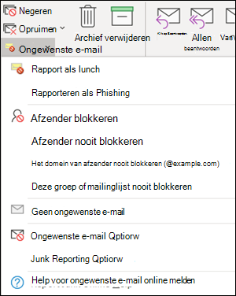
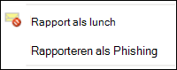
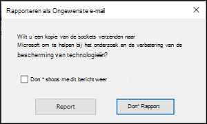
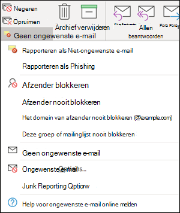
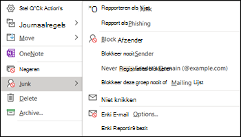
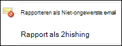
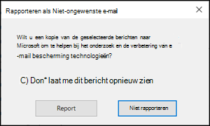

# <a name="install-and-use-the-junk-email-reporting-add-in-for-microsoft-outlook"></a>De invoegtoepassing voor het rapporteren van ongewenste E-mail voor Microsoft Outlook installeren en gebruiken

> [!NOTE]
> Als u momenteel de invoegtoepassing voor het rapporteren van ongewenste E-mail niet gebruikt, wordt u aangeraden de [invoegtoepassing bericht rapporteren](enable-the-report-message-add-in.md) te gebruiken. Zie voor meer informatie [berichten en bestanden rapporteren aan Microsoft](report-junk-email-messages-to-microsoft.md).

Met de invoegtoepassing voor het rapporteren van ongewenste E-mail voor Microsoft Outlook kunnen gebruikersfout berichten verzenden (goede e-mailberichten die als spam zijn gemarkeerd), onjuiste negatieven (onjuiste e-mail toegestaan) en phishingberichten aan Microsoft. Als uw organisatie Exchange Online Protection niet gebruikt (bijvoorbeeld on-premises Exchange of e-mailservices die niet werken met Exchange Online), heeft uw verzenden van het rapport ongewenste e-mail geen gevolgen voor spamfilters.

In dit onderwerp wordt uitgelegd hoe u de invoegtoepassing voor het rapporteren van ongewenste E-mail installeert en gebruikt.

## <a name="what-do-you-need-to-know-before-you-begin"></a>Wat moet u weten voordat u begint?

- Als u de invoegtoepassing voor het rapporteren van ongewenste E-mail wilt installeren, raadpleegt u de sectie [invoegtoepassing voor ongewenste E-mail installeren](#install-the-junk-email-reporting-add-in) verderop in dit onderwerp.

- De invoegtoepassing voor het rapporteren van ongewenste E-mail werkt met de volgende versies van Outlook:

  - Outlook 2013 of later
  - Outlook inbegrepen in Microsoft 365 apps for Enterprise

- Zie [berichten en bestanden rapporteren aan Microsoft](report-junk-email-messages-to-microsoft.md)voor meer informatie over het rapporteren van berichten aan Microsoft.

## <a name="use-the-junk-email-reporting-add-in-to-report-spam-and-phishing-messages"></a>De invoegtoepassing voor het rapporteren van ongewenste E-mail gebruiken om spam en phishing-berichten te rapporteren

1. Voor berichten in het postvak in of een andere e-mailmap met uitzondering van ongewenste E-mail, gebruikt u een van de volgende methoden om spam en phishing-berichten te rapporteren:

   - Selecteer het bericht of open het bericht. Klik op het lint op het tabblad **Start** of **bericht** op **ongewenste e-mail**en selecteer vervolgens **rapporteren als ongewenste e-mail** of **rapporteren als phishing**.

     

   - Klik met de rechtermuisknop op het bericht, selecteer **ongewenste e-mail**en selecteer vervolgens **rapporteren als ongewenste e-mail** of **rapporteren als phishing**.

     

   - Selecteer meerdere berichten, klik met de rechtermuisknop en selecteer vervolgens **rapporteren als ongewenste e-mail** of **rapporteren als phishing**.

     

2. In het dialoogvenster dat wordt weergegeven, leest u de informatie en klikt u op **rapport**. Als u van gedachten verandert, klikt u op **niet melden**.

   

   

3. De geselecteerde berichten worden naar Microsoft verzonden voor analyse en:

   - Verplaatst naar de map Ongewenste E-mail als deze als spam is gerapporteerd.
   - Verwijderd als phishing werd gerapporteerd.
   
   Als u wilt controleren of de berichten zijn verzonden, opent u de map **verzonden items** om de verzonden berichten te bekijken.

## <a name="use-the-junk-email-reporting-add-in-to-report-non-spam-and-phishing-messages-from-the-junk-email-folder"></a>De invoegtoepassing voor het rapporteren van ongewenste E-mail gebruiken om niet-spamberichten en phishingberichten te rapporteren vanuit de map Ongewenste E-mail

1. Gebruik een van de volgende methoden in de map Ongewenste E-mail om spam te rapporteren met een fout positief of malafide bericht:

   - Selecteer het bericht of open het bericht. Klik op het lint op het tabblad **Start** of **bericht** op **geen ongewenste E-mail**en selecteer vervolgens **als niet-ongewenste e-mail melden** of **rapporteren als phishing**.

     

   - Klik met de rechtermuisknop op het bericht en klik op **ongewenste e-mail**en selecteer vervolgens **rapporteren als geen ongewenste e-mail** of **Meld als phishing**.

     

   - Selecteer meerdere berichten, klik met de rechtermuisknop en selecteer vervolgens **rapporteren als geen ongewenste e-mail** of **rapporteren als phishing**.

     

2. In het dialoogvenster dat wordt weergegeven, leest u de informatie en klikt u op **rapport**. Als u van gedachten verandert, klikt u op **niet melden**.

   

   

3. De geselecteerde berichten worden naar Microsoft verzonden voor analyse en:

   - Verplaatst naar de map Ongewenste E-mail als deze als spam is gerapporteerd.
   - Verwijderd als phishing werd gerapporteerd.

   Als u wilt controleren of de berichten zijn verzonden, opent u de map **verzonden items** om de verzonden berichten te bekijken.

## <a name="install-the-junk-email-reporting-add-in"></a>De invoegtoepassing voor het rapporteren van ongewenste E-mail installeren

- U moet beheerdersmachtigingen hebben voor de computer waarop u de invoegtoepassing wilt installeren.

- Ga naar <https://www.microsoft.com/download/details.aspx?id=18275> en Download het juiste MSI-bestand voor uw versie van Office op een locatie die u kunt vinden:

  - **32-bits**: `Junk Reporting Add-in for Office 2007, 2010, 2013, and 2016 (32-bit).msi`
  - **64-bits**: `Junk Reporting Add-in for Office 2007, 2010, 2013, and 2016 (64-bit).msi`

- Voor Outlook 2013 of hoger is het enige voorwaarden de Microsoft .NET Framework 2,0. In Windows 10 installeert u .NET Framework 2,0 niet vanaf een download.

### <a name="install-the-junk-email-reporting-add-in-using-the-setup-wizard"></a>De invoegtoepassing voor het rapporteren van ongewenste E-mail installeren met de wizard Setup

1. Sluit Outlook op uw computer.

2. In Windows 10 controleert u of .NET Framework 2,0 is ingeschakeld. Zie voor instructies [het artikel .NET Framework 3,5 inschakelen in het Configuratiescherm](https://docs.microsoft.com/dotnet/framework/install/dotnet-35-windows-10#enable-the-net-framework-35-in-control-panel).

3. Zoek het MSI-bestand dat u hebt gedownload en dubbelklik erop.

4. Klik op de pagina **Welkom bij Microsoft de instelling voor het rapporteren van de invoegtoepassing voor ongewenste e-mail** op **volgende**.

5. Bekijk de licentieovereenkomst, klik op **Ik ga akkoord met de voorwaarden in de licentieovereenkomst** als u akkoord gaat met de voorwaarden en klik op **volgende**.

6. Wanneer de wizard is voltooid, klikt u op **Voltooien**.

Start Outlook.

Zoek de knop **ongewenste e-mail** op het lint van Outlook. U kunt nu ongewenste e-mailberichten voor Microsoft rapporteren door het e-mailbericht in uw postvak in te selecteren en te klikken op de knop **Ongewenste E-mail melden** .

Kies de pijl-omlaag naast **ongewenste e-mail** voor meer opties, zoals **rapporteren als phishing,** als u malafide e-mailberichten bij Microsoft wilt melden. U kunt ook in de map Ongewenste e-mail de optie **geen ongewenste E-mail melden** als een e-mailadres verkeerd is aangemerkt als ongewenste e-mail.

### <a name="install-the-junk-email-reporting-add-in-using-silent-mode"></a>De invoegtoepassing voor het rapporteren van ongewenste E-mail installeren via de Stille modus

1. Sluit Outlook op uw computer.

2. In Windows 10 installeert u .NET Framework 2,0 door de volgende opdracht uit te voeren:

   ```dos
   DISM /Online /Enable-Feature /FeatureName:NetFx3 /All
   ```

3. Als u de invoegtoepassing wilt installeren zonder tussenkomst van de gebruiker, opent u een opdracht prompt en gebruikt u de volgende syntaxis:

   ```dos
   msiexec /qn /i "<PathToMSIFile>\<MSIFile>" [MaxMessageSelection=<1-50>] [BccEmailAddress="<EmailAddress1>; <EmailAddress2>"...]
   ```

   - `MaxMessageSelection` Hiermee geeft u het maximum aantal berichten op dat u voor één verzenden kunt selecteren. Geldige waarden liggen tussen 1 en 50. De standaardwaarde is 15.

   - `BccEmailAddress` Hiermee geeft u meer BCC-geadresseerden op die een kopie ontvangen van alle gebruikers inzendingen. De standaardwaarde is leeg (geen extra BCC-geadresseerden).

   In dit voorbeeld wordt de 64-bits versie van de invoegtoepassing geïnstalleerd vanaf het opgegeven pad, met de standaardinstellingen.

   ```dos
   msiexec /qn /i "C:\Downloads\Junk Reporting Add-in for Office 2007, 2010, 2013, and 2016 (64-bit).msi"
   ```

   In dit voorbeeld wordt de 32-bits versie van de invoegtoepassing in het opgegeven pad geïnstalleerd met de volgende aanvullende instellingen:

   - Er kunnen maximaal 20 berichten in één aanvraag worden geselecteerd.
   - junkreports@contoso.com en hollyd@treyresearch.net ontvangen BCC-kopieën van alle inzendingen.

   ```dos
   msiexec /qn /i "C:\Downloads\Junk Reporting Add-in for Office 2007, 2010, 2013, and 2016 (32-bit).msi" MaxMessageSelection=20 BccEmailAddress="junkreports@contoso.com; hollyd@treyresearch.net"
   ```

### <a name="how-do-you-know-this-worked"></a>Hoe weet u of dit heeft gewerkt?

Als u wilt controleren of de invoegtoepassing voor het rapporteren van ongewenste E-mail is geïnstalleerd, voert u de volgende stappen uit in Outlook:

- Selecteer het bericht of open het bericht. Klik op het lint op het tabblad **Start** of **bericht** op **ongewenste e-mail**en controleer of de volgende opties beschikbaar zijn:

  - **Rapporteren als ongewenste E-mail**
  - **Melden als phishing**
  - **Opties voor ongewenste e-mail**
  - **De Help voor ongewenste E-mail online rapporteren**

  

- Klik met de rechtermuisknop op het bericht, selecteer **ongewenste e-mail**en controleer of de volgende opties beschikbaar zijn:

  - **Rapporteren als ongewenste E-mail**
  - **Melden als phishing**
  - **Opties voor ongewenste e-mail**
  - **De Help voor ongewenste E-mail online rapporteren**

  

- Selecteer meerdere berichten, klik met de rechtermuisknop en controleer of de volgende opties beschikbaar zijn:

  - **Rapporteren als ongewenste E-mail**
  - **Melden als phishing**

  

- Ga als volgt te werk in de map **ongewenste e-mail** en controleer of de vorige opties voor het rapporteren van **Ongewenste E-mail** **geen ongewenste e-mail**zijn.

  

  

  

## <a name="uninstall-the-junk-email-reporting-add-in"></a>De invoegtoepassing voor het rapporteren van ongewenste E-mail verwijderen

Nadat u Outlook hebt gesloten, gebruikt u een van de volgende procedures om de invoegtoepassing voor het rapporteren van ongewenste E-mail te verwijderen:

- **Configuratiescherm**: druk op de Windows-toets + R. Voer in het dialoogvenster **uitvoeren** dat wordt geopend, Enter `control appwiz.cpl` en klik vervolgens op **OK**.

  Selecteer de **invoegtoepassing voor het rapporteren van ongewenste e-mail van Microsoft** in de lijst en klik op **verwijderen**.

- **Windows-installatiepakket**: Zoek of download het juiste MSI-bestand en dubbelklik erop.

  - **32-bits**: `Junk Reporting Add-in for Office 2007, 2010, 2013, and 2016 (32-bit).msi`

  - **64-bits**: `Junk Reporting Add-in for Office 2007, 2010, 2013, and 2016 (64-bit).msi`

  Selecteer in het dialoogvenster dat wordt weergegeven de optie **Microsoft-invoegtoepassing voor ongewenste E-mail verwijderen voor Outlook** en klik op **volgende**.

- **Stille modus**: Zoek of download het juiste MSI-bestand. In het venster met de opdracht prompt vervangt u \<PathToFile\> de locatie van het MSI-bestand en voert u een van de volgende opdrachten uit:

  - **32-bits**:

    ```dos
    msiexec /x "<PathToFile>\Junk Reporting Add-in for Office 2007, 2010, 2013, and 2016 (32-bit).msi" /qn MSIRESTARTMANAGERCONTROL="DisableShutdown"
    ```

  - **64-bits**:

    ```dos
    msiexec /x "<PathToFile>\Junk Reporting Add-in for Office 2007, 2010, 2013, and 2016 (64-bit).msi" /qn MSIRESTARTMANAGERCONTROL="DisableShutdown"
    ```

Wanneer u Outlook opent na de verwijdering, worden de opties ongewenste e-mail, geen ongewenste e-mail en malafide rapporten verwijderd.

## <a name="troubleshooting-the-junk-email-reporting-add-in"></a>Problemen oplossen met de invoegtoepassing voor het rapporteren van ongewenste E-mail

Af en toe kunt u problemen ondervinden met Outlook na het toevoegen van de invoegtoepassing voor het rapporteren van ongewenste e-mail. In deze sectie worden problemen beschreven die u kunt ondervinden, samen met tips voor het oplossen van deze problemen.

### <a name="troubleshooting-for-users"></a>Probleemoplossing voor gebruikers

U kunt een of meer van de volgende problemen ondervinden:

- Er gebeurt niets wanneer u op **Ongewenste E-mail rapporteren** klikt
- Outlook reageert niet meer nadat u een e-mailbericht hebt geselecteerd
- Gerapporteerde ongewenste e-mail kan niet worden bezorgd vanwege een niet-bezorgbaar antwoord

Voer de volgende stappen uit om dit probleem op te lossen:

1. Sluit Outlook af en start het programma opnieuw.
2. Maak een testbericht en verzend dit, en controleer of de geadresseerde het bericht heeft ontvangen.
3. Als het probleem zich blijft voordoen, neemt u contact op met uw beheerder.

Zie [berichten en bestanden rapporteren aan Microsoft](report-junk-email-messages-to-microsoft.md)voor andere methoden die u kunt gebruiken om berichten naar Microsoft te verzenden.

### <a name="troubleshooting-for-admins"></a>Probleemoplossing voor beheerders

#### <a name="problem-an-error-message-continually-appears-that-asks-users-to-contact-their-system-administrator"></a>Probleem: er wordt voortdurend een foutbericht weergegeven dat gebruikers vragen om contact op te nemen met hun systeembeheerder

1. Controleer of stel de `LoggingLevel` registersleutel in op de waarde ' uitgebreid '.

   - **32-bits versie van Outlook op 32-bits Windows**:

     ```text
     Windows Registry Editor Version 5.00

     [HKEY_LOCAL_MACHINE\Software\Microsoft\Junk Email Reporting\Addins]
     "LoggingLevel"="Verbose"
     ```

   - **32-bits versie van Outlook op 64-bits Windows**:

     ```text
     Windows Registry Editor Version 5.00

     [HKEY_LOCAL_MACHINE\Software\Wow6432Node\Microsoft\Junk Email Reporting\Addins]
     "LoggingLevel"="Verbose"
     ```

   - **64-bits Outlook**:

     ```text
     Windows Registry Editor Version 5.00

     [HKEY_LOCAL_MACHINE\Software\Microsoft\Junk E-mail Reporting\Addins]
     "LoggingLevel"="Verbose"
     ```

2. Start Outlook opnieuw en vraag gebruikers om opnieuw te rapporteren wanneer ze het foutbericht zien.

3. Verzamel de logboekinformatie op de volgende locatie:

   `%LOCALAPPDATA%\Microsoft\Junk Email Reporting Add-in\SpamReporterAddinLog.txt`

4. Neem contact op met de technische ondersteuning van Exchange Online Protection en verstrek de logboekinformatie.

#### <a name="problem-users-selected-not-to-receive-a-confirmation-prompt-when-they-report-messages-and-now-they-want-the-prompt-back"></a>Probleem: gebruikers die hebben geselecteerd, geen bevestigingsprompt ontvangen wanneer ze berichten rapporteren, en nu willen ze de prompt weer terugvinden.

1. Maak de `ConfirmReportJunk` registersleutel met de waarde ' True ':

   ```text
   Windows Registry Editor Version 5.00

   HKEY_CURRENT_USER\Software\Microsoft\Junk E-mail Reporting\Preferences]
   "ConfirmReportJunk"="True"
   ```

2. Start Outlook opnieuw.
