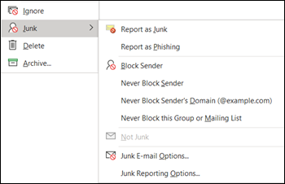

# <a name="install-and-use-the-junk-email-reporting-add-in-for-microsoft-outlook-in-office-365"></a>De invoegtoepassing Voor melding van ongewenste e-mail rapportage voor Microsoft Outlook installeren en gebruiken in Office 365

> [!NOTE]
> Als u momenteel de invoegtoepassing Ongewenste e-mailrapportage niet gebruikt, raden we in plaats daarvan de [invoegtoepassing Rapportbericht](enable-the-report-message-add-in.md) aan.

Met de invoegtoepassing Ongewenste e-mailrapportage voor Microsoft Outlook kunnen gebruikers valse positieven (goede e-mail gemarkeerd als spam), valse negatieven (slechte e-mail toegestaan) en phishingberichten indienen bij Exchange Online Protection (EOP). Als uw organisatie Geen EOP gebruikt, heeft het indienen van uw ongewenste e-mailrapport geen invloed op uw spamfiltering.

In dit onderwerp wordt uitgelegd hoe u de invoegtoepassing Ongewenste e-mailrapportage installeert en gebruikt.

## <a name="what-do-you-need-to-know-before-you-begin"></a>Wat moet u weten voordat u begint?

- Zie de invoegtoepassing Voor het rapporteren van [ongewenste e-mail](#install-the-junk-email-reporting-add-in) later in dit onderwerp als u de invoegtoepassing Voor ongewenste e-mailrapportage wilt installeren.

- De invoegtoepassing Voor ongewenste e-mailrapportage werkt met de volgende versies van Outlook:

  - Outlook 2013 of hoger
  - Outlook inbegrepen bij Office 365 ProPlus

- Zie [Berichten en bestanden rapporteren aan Microsoft in Office 365](report-junk-email-messages-to-microsoft.md)voor meer informatie over het rapporteren van berichten aan Microsoft.

## <a name="use-the-junk-email-reporting-add-in-to-report-spam-and-phishing-messages"></a>De invoegtoepassing Ongewenste e-mailrapportage gebruiken om spam- en phishingberichten te melden

1. Voor berichten in het Postvak IN of een andere e-mailmap, met uitzondering van Ongewenste e-mail, gebruikt u een van de volgende methoden om spam- en phishingberichten te melden:

   - Selecteer het bericht of open het bericht. Klik op het tabblad **Start** of **Bericht** op het lint op **Ongewenste e-mail**en selecteer **Vervolgens Rapporteren als ongewenste e-mail** of **Rapport als phishing**.

     

   - Klik met de rechtermuisknop op het bericht, selecteer **Ongewenste e-mail**en selecteer **Vervolgens Rapporteren als ongewenste e-mail** of Rapport als **phishing**.

     

   - Selecteer meerdere berichten, klik met de rechtermuisknop en selecteer **Rapporteren als ongewenste e-mail** of **Rapport als phishing**.

     

2. Lees in het dialoogvenster dat wordt weergegeven de informatie en klik op **Rapport**. Als u van gedachten verandert, klikt u op **Niet rapporteren.**

   

   

3. De geselecteerde berichten worden naar Microsoft verzonden voor analyse en verplaatst naar de map Ongewenste e-mail. Als u wilt bevestigen dat de berichten zijn verzonden, opent u de map **Verzonden items** om de ingediende berichten weer te geven.

## <a name="use-the-junk-email-reporting-add-in-to-report-non-spam-and-phishing-messages-from-the-junk-email-folder"></a>De invoegtoepassing Ongewenste e-mailrapportage gebruiken om niet-spam- en phishingberichten te melden vanuit de map Ongewenste e-mail

1. Gebruik in de map Ongewenste e-mail een van de volgende methoden om valse positieven of phishingberichten te melden:

   - Selecteer het bericht of open het bericht. Klik op het tabblad **Start** of **Bericht** op het lint op **Geen ongewenstee informatie**en selecteer Vervolgens Rapporteren als Niet ongewenste **e-mail** of **Rapport als phishing**.

     

   - Klik met de rechtermuisknop op het bericht, klik op **Ongewenste e-mail**en selecteer **Rapporteren als Niet ongewenste e-mail** of Rapport als **phishing**.

     

   - Selecteer meerdere berichten, klik met de rechtermuisknop en selecteer **Rapporteren als Niet ongewenste e-mail** of Meld als **phishing**.

     

2. Lees in het dialoogvenster dat wordt weergegeven de informatie en klik op **Rapport**. Als u van gedachten verandert, klikt u op **Niet rapporteren.**

   

   

3. De geselecteerde berichten worden naar Microsoft verzonden voor analyse en verplaatst naar de map Ongewenste e-mail. Als u wilt bevestigen dat de berichten zijn verzonden, opent u de map **Verzonden items** om de ingediende berichten weer te geven.

## <a name="install-the-junk-email-reporting-add-in"></a>De invoegtoepassing Voor het melden van ongewenste e-mail installeren

- U moet beheerdersbevoegdheden hebben op de computer waar u de invoegtoepassing installeert.

- Ga <https://www.microsoft.com/download/details.aspx?id=18275> naar en download het juiste .msi-bestand voor uw versie van Office naar een locatie die gemakkelijk te vinden is:

  - **32-bits**:`Junk Reporting Add-in for Office 2007, 2010, 2013, and 2016 (32-bit).msi`

  - **64-bits**:`Junk Reporting Add-in for Office 2007, 2010, 2013, and 2016 (64-bit).msi`

- Voor Outlook 2013 of hoger is de enige voorwaarde het Microsoft .NET Framework 2.0. In Windows 10 installeert u het .NET Framework 2.0 niet vanaf een download.

### <a name="install-the-junk-email-reporting-add-in-using-the-setup-wizard"></a>De invoegtoepassing voor ongewenste e-mailrapportage installeren met de wizard Setup

1. Sluit Outlook op uw computer.

2. Controleer in Windows 10 of het .NET Framework 2.0 is ingeschakeld. Zie Het [.NET Framework 3.5 inschakelen in het Configuratiescherm](https://docs.microsoft.com/dotnet/framework/install/dotnet-35-windows-10#enable-the-net-framework-35-in-control-panel)voor instructies .

3. Zoek het .msi-bestand dat je hebt gedownload en dubbelklik erop.

4. Klik op de pagina **Invoegtoepassing Installatie van ongewenste e-mail van Microsoft** op de pagina Welkom bij Microsoft Ongewenste E-mailrapportage op **Volgende**.

5. Bekijk de licentieovereenkomst, klik op **Ik accepteer de voorwaarden in de licentieovereenkomst** als u akkoord gaat met de voorwaarden en klik vervolgens op **Volgende**.

6. Wanneer de wizard is voltooid, klikt u op **Voltooien**.

Outlook starten.

Zoek naar de knop **Ongewenstee inhoud** op het outlook-lint. U nu ongewenste e-mailberichten aan Microsoft rapporteren door de ongewenste e-mailberichten in uw Postvak IN te selecteren en op de knop **Ongewenste e-mail** melden te klikken.

Kies de pijl-omlaag naast **Ongewenstee opties** voor meer opties, zoals **Melden als Phishing** als u phishing-scam-e-mails aan Microsoft wilt melden. In uw map met ongewenste e-mail u ook verwijderen, **Geen ongewenste e-mail** melden als een e-mail onjuist is geïdentificeerd als ongewenste e-mail.

### <a name="install-the-junk-email-reporting-add-in-using-silent-mode"></a>De invoegtoepassing voor ongewenste e-mailrapportage installeren met de stille modus

1. Sluit Outlook op uw computer.

2. Installeer in Windows 10 het .NET Framework 2.0 door de volgende opdracht uit te voeren:

   ```dos
   DISM /Online /Enable-Feature /FeatureName:NetFx3 /All
   ```

3. Als u de invoegtoepassing zonder gebruikersinteractie wilt installeren, opent u een opdrachtprompt en gebruikt u de volgende syntaxis:

   ```dos
   msiexec /qn /i "<PathToMSIFile>\<MSIFile>" [MaxMessageSelection=<1-50>] [BccEmailAddress="<EmailAddress1>; <EmailAddress2>"...]
   ```

   - `MaxMessageSelection`hiermee geeft u het maximumaantal berichten op dat u voor één inzending selecteren. Geldige waarden zijn 1 tot 50. De standaardwaarde is 15.

   - `BccEmailAddress`hiermee worden extra BCC-ontvangers opgegeven die een kopie van alle gebruikersinzendingen ontvangen. De standaardwaarde is leeg (geen extra BCC-ontvangers).

   In dit voorbeeld wordt de 64-bits versie van de invoegtoepassing vanaf het opgegeven pad geïnstalleerd met de standaardinstellingen.

   ```dos
   msiexec /qn /i "C:\Downloads\Junk Reporting Add-in for Office 2007, 2010, 2013, and 2016 (64-bit).msi"
   ```

   In dit voorbeeld wordt de 32-bits versie van de invoegtoepassing vanaf het opgegeven pad geïnstalleerd met de volgende aanvullende instellingen:

   - Er kunnen maximaal 20 berichten in één inzending worden geselecteerd.
   - junkreports@contoso.com en hollyd@treyresearch.net ontvangen BCC kopieën van alle inzendingen.

   ```dos
   msiexec /qn /i "C:\Downloads\Junk Reporting Add-in for Office 2007, 2010, 2013, and 2016 (32-bit).msi" MaxMessageSelection=20 BccEmailAddress="junkreports@contoso.com; hollyd@treyresearch.net"
   ```

### <a name="how-do-you-know-this-worked"></a>Hoe weet u of dit heeft gewerkt?

Als u wilt controleren of u de invoegtoepassing Ongewenste e-mailrapportage hebt geïnstalleerd, doet u een van de volgende stappen in Outlook:

- Selecteer het bericht of open het bericht. Klik op het tabblad **Start** of **Bericht** op het lint op **Ongewenste e-mail**en controleer of de volgende opties beschikbaar zijn:

  - **Rapporteren als Ongewenste e-mail**
  - **Rapporteren als Phishing**
  - **Opties voor meldingen van ongewenste e-mail**
  - **Help voor ongewenste e-mail online melden**

  

- Klik met de rechtermuisknop op het bericht, selecteer **Ongewenste en**controleer of de volgende opties beschikbaar zijn:

  - **Rapporteren als Ongewenste e-mail**
  - **Rapporteren als Phishing**
  - **Opties voor meldingen van ongewenste e-mail**
  - **Help voor ongewenste e-mail online melden**

  

- Selecteer meerdere berichten, klik met de rechtermuisknop en controleer of de volgende opties beschikbaar zijn:

  - **Rapporteren als Ongewenste e-mail**
  - **Rapporteren als Phishing**

  

- Doe de eerdere acties in de map **Ongewenste e-mail** en controleer of de vorige **opties voor ongewenste e-rapportage** nu **geen ongewenste e-mail**zijn.

  

  

  

## <a name="uninstall-the-junk-email-reporting-add-in"></a>De invoegtoepassing voor het melden van ongewenste e-mail verwijderen

Nadat u Outlook hebt gesloten, gebruikt u een van de volgende procedures om de invoegtoepassing Voor het melden van ongewenste e-mailrapporten te verwijderen:

- **Configuratiescherm**: Druk op de Windows-toets + R. Voer **Run** in het dialoogvenster `control appwiz.cpl` Uitvoeren dat wordt geopend, in en klik op **OK**.

  Zoek en selecteer **microsoft ongewenste e-mailrapportage-invoegtoepassing** in de lijst en klik op **Verwijderen**.

- **Windows Installer-pakket**: Zoek of download het juiste .msi-bestand en dubbelklik erop.

  - **32-bits**:`Junk Reporting Add-in for Office 2007, 2010, 2013, and 2016 (32-bit).msi`

  - **64-bits**:`Junk Reporting Add-in for Office 2007, 2010, 2013, and 2016 (64-bit).msi`

  Selecteer in het dialoogvenster dat wordt weergegeven de optie **Invoegtoepassing voor microsoft-e-mailrapportage voor Outlook verwijderen** en klik op **Volgende**.

- **Stille modus**: Zoek of download het juiste .msi-bestand. Vervang PathToFile\> in \<een opdrachtpromptvenster door de locatie van het MSI-bestand en voer een van de volgende opdrachten uit:

  - **32-bits**:

    ```dos
    msiexec /x "<PathToFile>\Junk Reporting Add-in for Office 2007, 2010, 2013, and 2016 (32-bit).msi" /qn MSIRESTARTMANAGERCONTROL="DisableShutdown"
    ```

  - **64-bits**:

    ```dos
    msiexec /x "<PathToFile>\Junk Reporting Add-in for Office 2007, 2010, 2013, and 2016 (64-bit).msi" /qn MSIRESTARTMANAGERCONTROL="DisableShutdown"
    ```

Wanneer u Outlook opent na het verwijderen, moeten de opties voor ongewenste e-mail, niet voor ongewenste e-mail en phishing-rapportage worden verdwenen.

## <a name="troubleshooting-the-junk-email-reporting-add-in"></a>Problemen met de invoegtoepassing Ongewenste e-mailrapportage oplossen

Af en toe u problemen ondervinden met Outlook nadat u de invoegtoepassing Voor ongewenste e-mailrapportage hebt toegevoegd. In dit gedeelte worden problemen beschreven die u tegenkomen, samen met tips voor het oplossen van deze problemen.

### <a name="troubleshooting-for-users"></a>Probleemoplossing voor gebruikers

U ondervindt een of meer van de volgende problemen:

- Er gebeurt niets wanneer u op **Ongewenste e-mail** melden klikt
- Outlook reageert niet meer nadat u een e-mailbericht hebt geselecteerd
- Gerapporteerde ongewenste e-mail kan niet worden bezorgd vanwege een "onbestelbaar" antwoord

Ga als volgt te werk om dit probleem op te lossen:

1. Outlook sluiten en opnieuw starten.
2. Maak en verstuur een testbericht en controleer of de ontvanger het bericht heeft ontvangen.
3. Als het probleem blijft bestaan, neemt u contact op met uw beheerder.

Zie [Berichten en bestanden rapporteren aan Microsoft voor](report-junk-email-messages-to-microsoft.md)andere methoden die u gebruiken om berichten naar Microsoft te verzenden.

### <a name="troubleshooting-for-admins"></a>Probleemoplossing voor beheerders

#### <a name="problem-an-error-message-continually-appears-that-asks-users-to-contact-their-system-administrator"></a>Probleem: er verschijnt voortdurend een foutbericht waarin gebruikers wordt gevraagd contact op te nemen met hun systeembeheerder

1. Controleer of `LoggingLevel` stel de registersleutel in op de waarde "Verbose":

   - **32-bits Outlook op 32-bits Windows:**

     ```text
     Windows Registry Editor Version 5.00

     [HKEY_LOCAL_MACHINE\Software\Microsoft\Junk Email Reporting\Addins]
     "LoggingLevel"="Verbose"
     ```

   - **32-bits Outlook op 64-bits Windows:**

     ```text
     Windows Registry Editor Version 5.00

     [HKEY_LOCAL_MACHINE\Software\Wow6432Node\Microsoft\Junk Email Reporting\Addins]
     "LoggingLevel"="Verbose"
     ```

   - **64-bits Outlook:**

     ```text
     Windows Registry Editor Version 5.00

     [HKEY_LOCAL_MACHINE\Software\Microsoft\Junk E-mail Reporting\Addins]
     "LoggingLevel"="Verbose"
     ```

2. Start Outlook opnieuw op en vraag gebruikers om terug te rapporteren wanneer ze het foutbericht zien.

3. Verzamel de loggegevens op de volgende locatie:

   `%LOCALAPPDATA%\Microsoft\Junk Email Reporting Add-in\SpamReporterAddinLog.txt`

4. Neem contact op met de technische ondersteuning van Exchange Online Protection en geef hen de loggegevens.

#### <a name="problem-users-selected-not-to-receive-a-confirmation-prompt-when-they-report-messages-and-now-they-want-the-prompt-back"></a>Probleem: gebruikers hebben ervoor gekozen om geen bevestigingsprompt te ontvangen wanneer ze berichten rapporteren, en nu willen ze de prompt terug

1. Maak `ConfirmReportJunk`de registersleutel wih de waarde "True":

   ```text
   Windows Registry Editor Version 5.00

   HKEY_CURRENT_USER\Software\Microsoft\Junk E-mail Reporting\Preferences]
   "ConfirmReportJunk"="True"
   ```

2. Outlook opnieuw starten.
