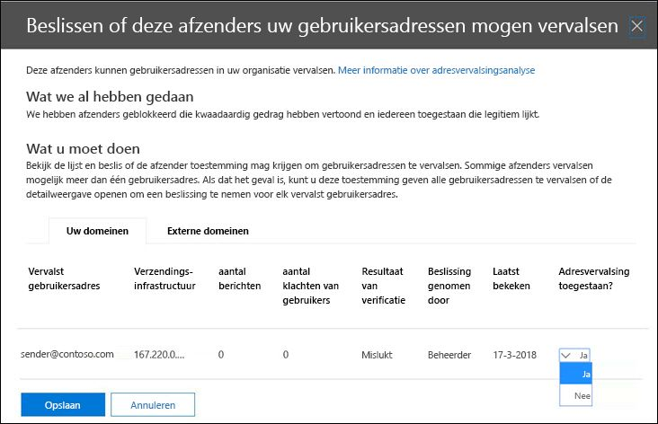

# <a name="configure-spoof-intelligence-in-eop"></a>Spoofinformatie configureren in EOP

In Microsoft 365-organisaties met postvakken in Exchange Online- of zelfstandige Exchange Online Protection (EOP)-organisaties zonder Exchange Online-postvakken worden binnenkomende e-mailberichten vanaf oktober 2018 automatisch beschermd tegen spoofing door EOP. EOP maakt gebruik van spoofintelligentie als onderdeel van de algehele verdediging van uw organisatie tegen phishing. Zie [Bescherming tegen spoofing in EOP](anti-spoofing-protection.md)voor meer informatie.

Wanneer een afzender een e-mailadres vervalst, lijkt dit een gebruiker te zijn in een van de domeinen van uw organisatie of een gebruiker in een extern domein dat e-mail naar uw organisatie verzendt. Aanvallers die afzenders spoofen om spam of phishing-e-mail te verzenden, moeten worden geblokkeerd. Maar er zijn scenario's waar legitieme afzenders zijn spoofing. Bijvoorbeeld:

- Legitieme scenario's voor het vervalsen van interne domeinen:

  - Afzenders van derden gebruiken uw domein om bulkmail naar uw eigen werknemers te sturen voor bedrijfspeilingen.

  - Een extern bedrijf genereert en verzendt namens u reclame- of productupdates.

  - Een assistent moet regelmatig e-mail sturen voor een andere persoon binnen uw organisatie.

  - Een interne toepassing verzendt e-mailmeldingen.

- Legitieme scenario's voor het vervalsen van externe domeinen:

  - De afzender staat op een mailinglijst (ook wel een discussielijst genoemd) en de mailinglijst stuurt e-mail van de oorspronkelijke afzender door aan alle deelnemers op de mailinglijst.

  - Een extern bedrijf stuurt e-mail namens een ander bedrijf (bijvoorbeeld een geautomatiseerd rapport of een software-as-a-service bedrijf).

Spoofinformatie, en met name het standaard -informatiebeleid (en alleen) spoofintelligentie, helpt ervoor te zorgen dat de vervalste e-mail die door legitieme afzenders wordt verzonden, niet verstrikt raakt in spamfilters in Microsoft 365 of externe e-mailsystemen, terwijl uw gebruikers worden beschermd tegen spam of phishingaanvallen.

U spoofinformatie beheren in het Security & Compliance Center of in PowerShell (Exchange Online PowerShell voor Microsoft 365-organisaties met postvakken in Exchange Online; standalone EOP PowerShell voor organisaties zonder Exchange Online-postvakken).

## <a name="what-do-you-need-to-know-before-you-begin"></a>Wat moet u weten voordat u begint?

- U opent het Beveiligings- en compliancecentrum in <https://protection.office.com/>. Gebruik <https://protection.office.com/antispam> om direct naar de pagina **Antispaminstellingen** te gaan. Gebruik **Anti-phishing** <https://protection.office.com/antiphishing> .

- Zie [Verbinding maken met Exchange Online PowerShell](https://docs.microsoft.com/powershell/exchange/exchange-online/connect-to-exchange-online-powershell/connect-to-exchange-online-powershell) als u verbinding wilt maken met Exchange Online PowerShell. Zie Verbinding maken met Exchange [Online Protection PowerShell](https://docs.microsoft.com/powershell/exchange/exchange-eop/connect-to-exchange-online-protection-powershell)als u verbinding wilt maken met zelfstandige EOP PowerShell.

- U moet beschikken over bepaalde machtigingen om deze procedures te kunnen uitvoeren. Als u het spoofinformatiebeleid wilt wijzigen of spoofinformatie wilt inschakelen of uitschakelen, moet u lid zijn van de rolgroepen **Organisatiebeheer** of **Beveiligingsbeheerder.** Voor alleen-lezen toegang tot het spoof-informatiebeleid moet u lid zijn van de rolgroep **Security Reader.** Zie [Machtigingen in het beveiligings- en compliancecentrum](permissions-in-the-security-and-compliance-center.md) voor meer informatie over groepen in het Beveiligings- en compliancecentrum.

- Voor onze aanbevolen instellingen voor spoofinformatie, [eop standaard anti-phishing beleidsinstellingen](recommended-settings-for-eop-and-office365-atp.md#eop-default-anti-phishing-policy-settings).

## <a name="use-the-security--compliance-center-to-manage-spoofed-senders"></a>Het Beveiligings& Compliance Center gebruiken om vervalste afzenders te beheren

> [!NOTE]
> Als u een Microsoft 365 Enterprise E5-abonnement hebt of een office 365 Advanced Threat Protection (Office 365 ATP)-add-on hebt aangeschaft, u ook afzenders beheren die uw domein spoofen via het [Spoof Intelligence-inzicht](walkthrough-spoof-intelligence-insight.md).

1. Ga in het Beveiligings- en compliancecentrum naar **Risicobeheer** \> **Beleid** \> **Antispam**.

2. Klik op de pagina **Antispam-instellingen** op  om het **informatiebeleid voor spoofen**uit te vouwen.

   

3. Maak een van de volgende selecties:

   - **Nieuwe afzenders bekijken**
   - **Mij afzenders laten zien die ik al heb beoordeeld**

4. Selecteer een van de volgende tabbladen in de **optie-knop Om te bepalen of deze afzenders uw gebruikersflyout mogen spoofen** die wordt weergegeven:

   - **Uw domeinen:** afzenders spoofing gebruikers in uw interne domeinen.
   - **Externe domeinen:** afzenders spoofing gebruikers in externe domeinen.

5. Klik  Mag **spoofen?** Kies **Ja** om de vervalste afzender toe te staan of kies **Nee** om het bericht als vervalst te markeren. De actie wordt beheerd door het standaard antiphishingbeleid of het aangepaste ATP-antiphishingbeleid (de standaardwaarde is **Bericht verplaatsen naar ongewenste e-mail).** Zie [Spoofinstellingen in antiphishingbeleid](set-up-anti-phishing-policies.md#spoof-settings)voor meer informatie.

   

   De kolommen en waarden die u ziet, worden uitgelegd in de volgende lijst:

   - **Vervalste gebruiker**: het gebruikersaccount dat wordt vervalst. Dit is de afzender van het bericht in het Van-adres (ook wel `5322.From` het adres genoemd) dat wordt weergegeven in e-mailclients. De geldigheid van dit adres wordt niet gecontroleerd door SPF.

     - Op het tabblad **Uw domeinen** bevat de waarde één e-mailadres of als de bron-e-mailserver meerdere gebruikersaccounts vervalst, bevat deze meer **dan één**.

     - Op het tabblad **Externe domeinen** bevat de waarde het domein van de vervalste gebruiker, niet het volledige e-mailadres.

   - **Infrastructuur verzenden:** het domein in een reverse DNS lookup (PTR-record) van het IP-adres van de bron-e-mailserver of het IP-adres als de bron geen PTR-record heeft.

     Zie Een overzicht van de normen [voor e-mailberichten](how-office-365-validates-the-from-address.md#an-overview-of-email-message-standards)voor meer informatie over berichtbronnen en afzenders van berichten.

   - **aantal berichten:** het aantal berichten van de verzendende infrastructuur naar uw organisatie die de opgegeven vervalste afzender of afzenders bevatten in de afgelopen 30 dagen.

   - **# van de klachten van gebruikers**: Klachten ingediend door uw gebruikers tegen deze afzender in de afgelopen 30 dagen. Klachten zijn meestal in de vorm van ongewenste inzendingen bij Microsoft.

   - **Verificatieresultaat:** een van de volgende waarden:

      - **Geslaagd**: De afzender heeft e-mailverificatiecontroles (SPF of DKIM) door de afzender doorgegeven.
      - **Mislukt:** de verificatiecontroles van de afzender is mislukt voor eop-afzenders.
      - **Onbekend**: Het resultaat van deze controles is niet bekend.

   - **Beslissing ingesteld door**: Geeft aan wie heeft bepaald of de verzendende infrastructuur de gebruiker mag spoofen:

       - **Spoofintelligentiebeleid** (automatisch)
       - **Beheerder** (handleiding)

   - **Laatst gezien**: de laatste datum waarop een bericht is ontvangen van de verzendende infrastructuur die de vervalste gebruiker bevat.

   - **Toegestaan om te spoofen?**: De waarden die je hier ziet zijn:

     - **Ja:** Berichten van de combinatie van vervalste gebruiker en verzendende infrastructuur zijn toegestaan en worden niet behandeld als vervalste e-mail.

     - **Nee:** Berichten van de combinatie van vervalste gebruiker en verzendende infrastructuur zijn gemarkeerd als vervalst. De actie wordt beheerd door het standaard antiphishingbeleid of het aangepaste ATP-antiphishingbeleid (de standaardwaarde is **Bericht verplaatsen naar ongewenste e-mail).** Zie de volgende sectie voor meer informatie.

     - **Sommige gebruikers** (alleen het tabblad**Uw domeinen):** een verzendende infrastructuur is spoofing meerdere gebruikers, waar sommige vervalste gebruikers zijn toegestaan en anderen niet. Gebruik het tabblad **Gedetailleerd** om de specifieke adressen te bekijken.

6. Klik onder aan de pagina op **Opslaan**.

## <a name="use-powershell-to-manage-spoofed-senders"></a>PowerShell gebruiken om vervalste afzenders te beheren

Als u toegestane en geblokkeerde afzenders wilt weergeven in spoofinformatie, gebruikt u de volgende syntaxis:

```powershell
Get-PhishFilterPolicy [-AllowedToSpoof <Yes | No | Partial>] [-ConfidenceLevel <Low | High>] [-DecisionBy <Admin | SpoofProtection>] [-Detailed] [-SpoofType <Internal | External>]
```

In dit voorbeeld worden gedetailleerde informatie geretourneerd over alle afzenders die gebruikers in uw domeinen mogen spoofen.

```powershell
Get-PhishFilter -AllowedToSpoof Yes -Detailed -SpoofType Internal
```

Zie [Get-PhishFilterPolicy](https://docs.microsoft.com/powershell/module/exchange/advanced-threat-protection/get-phishfilterpolicy)voor gedetailleerde syntaxis- en parameterinformatie.

Voer de volgende stappen uit om toegestane en geblokkeerde afzenders in spoofinformatie te configureren:

1. Leg de huidige lijst met gedetecteerde vervalste afzenders vast door de uitvoer van de cmdlet **Get-PhishFilterPolicy** naar een CSV-bestand te schrijven:

   ```powershell
   Get-PhishFilterPolicy -Detailed | Export-CSV "C:\My Documents\Spoofed Senders.csv"
   ```

2. Bewerk het CSV-bestand om de waarden **SpoofedUser** (e-mailadres) en **AllowedToSpoof** (Ja of Nee) toe te voegen of te wijzigen. Sla het bestand op, lees het bestand en sla de inhoud op als een variabele met de `$UpdateSpoofedSenders` naam:

   ```powershell
   $UpdateSpoofedSenders = Get-Content -Raw "C:\My Documents\Spoofed Senders.csv"
   ```

3. Gebruik de `$UpdateSpoofedSenders` variabele om het spoofintelligentiebeleid te configureren:

   ```powershell
   Set-PhishFilterPolicy -Identity Default -SpoofAllowBlockList $UpdateSpoofedSenders
   ```

Zie [Set-PhishFilterPolicy voor](https://docs.microsoft.com/powershell/module/exchange/advanced-threat-protection/set-phishfilterpolicy)gedetailleerde syntaxis- en parameterinformatie .

## <a name="use-the-security--compliance-center-to-configure-spoof-intelligence"></a>Het Beveiligingscentrum & compliance gebruiken om spoofinformatie te configureren

De configuratieopties voor spoofinformatie worden beschreven in [spoofinstellingen in antiphishingbeleid.](set-up-anti-phishing-policies.md#spoof-settings)

U spoofinformatie-instellingen configureren in het standaard beleid voor antiphishing en ook in aangepast beleid. Zie een van de volgende onderwerpen voor instructies op basis van uw abonnement:

- [Anti-phishingbeleid configureren in EOP](configure-anti-phishing-policies-eop.md).

- [Atp-antiphishingbeleid configureren in Microsoft 365](configure-atp-anti-phishing-policies.md).

## <a name="how-do-you-know-these-procedures-worked"></a>Hoe weet ik of deze procedures zijn geslaagd?

Gebruik een van de volgende stappen om te controleren of u spoofinformatie hebt geconfigureerd met afzenders die wel en niet mogen spoofen en dat u de instellingen voor spoofinformatie hebt geconfigureerd:

- Ga in het Security & Compliance Center naar **Bedreigingsbeheer** \> **Beleid** \> **Anti-spam** \> uitbreiden **Spoofintelligentiebeleid** \> selecteer Mij **afzenders tonen die ik al heb gecontroleerd,** \> selecteer het tabblad Uw **domeinen** of **externe domeinen** en controleer of de waarde Toegestaan is om te **spoofen?**

- Voer in PowerShell de volgende opdrachten uit om de afzenders weer te geven die wel en niet mogen spoofen:

  ```powershell
  Get-PhishFilter -AllowedToSpoof Yes -SpoofType Internal
  Get-PhishFilter -AllowedToSpoof No -SpoofType Internal
  Get-PhishFilter -AllowedToSpoof Yes -SpoofType External
  Get-PhishFilter -AllowedToSpoof No -SpoofType External
  ```

- Voer in PowerShell de volgende opdracht uit om de lijst met alle vervalste afzenders naar een CSV-bestand te exporteren:

   ```powershell
   Get-PhishFilterPolicy -Detailed | Export-CSV "C:\My Documents\Spoofed Senders.csv"
   ```

- Ga in Microsoft 365-organisaties met Exchange Online-postvakken een van de volgende stappen uit:

  - Ga in het Security & Compliance Center naar **Threat management** \> **Policy** \> **Anti-phishing** \> klik op **Standaardbeleid** en bekijk de details in de flyout.

  - Voer in Exchange Online PowerShell de volgende opdracht uit en controleer de instellingen:

    ```PowerShell
    Get-AntiPhishPolicy -Identity "Office365 AntiPhish Default"
    ```

- Ga in Microsoft 365 ATP-organisaties een van de volgende stappen uit:

  - Ga in het Security & Compliance Center naar **Threat management** \> **Policy** \> **ATP anti-phishing** en doe een van de volgende stappen:

    - Selecteer een beleid in de lijst. Controleer in de flyout die wordt weergegeven de waarden in de sectie **Spoof.**
    - Klik **op Standaardbeleid**. Controleer in de flyout die wordt weergegeven de waarden in de sectie **Spoof.**

  - Vervang in Exchange Online PowerShell \< Naam \> door Office365 AntiPhish Default of de naam van een aangepast ATP-antiphishingbeleid en voer de volgende opdracht uit en controleer de instellingen:

    ```PowerShell
    Get-AntiPhishPolicy -Identity "<Name>"
    ```

## <a name="other-ways-to-manage-spoofing-and-phishing"></a>Andere manieren om spoofing en phishing te beheren

Wees ijverig over spoofing en phishing bescherming. Dit zijn gerelateerde manieren om te controleren of afzenders uw domein spoofen en te voorkomen dat ze uw organisatie beschadigen:

- Controleer het **spoof-e-mailrapport**. U dit rapport vaak gebruiken om vervalste afzenders te bekijken en te beheren. Zie Rapport [Spoofdetecties](view-email-security-reports.md#spoof-detections-report)voor informatie .

- Bekijk de SPF-configuratie (Sender Policy Framework). Zie voor een korte introductie van SPF en om het snel te configureren [SPF in Microsoft 365 instellen om spoofing te voorkomen](set-up-spf-in-office-365-to-help-prevent-spoofing.md). Voor een beter begrip van hoe Office 365 gebruikmaakt van SPF of voor het oplossen van problemen of niet-standaardimplementaties zoals hybride implementaties, begint u met [Hoe Office 365 gebruikmaakt van SPF (Sender Policy Framework) om spoofing te voorkomen](how-office-365-uses-spf-to-prevent-spoofing.md).

- Controleer de configuratie van uw DomainKeys Identified Mail (DKIM). U moet DKIM gebruiken naast SPF en DMARC om te voorkomen dat aanvallers berichten verzenden die eruit zien alsof ze uit uw domein komen. Met DKIM kunt u een digitale handtekening toevoegen aan e-mailberichten in de berichtkop. Zie [DKIM gebruiken om uitgaande e-mail die vanuit uw aangepaste domein in Office 365 is verzonden, te valideren](use-dkim-to-validate-outbound-email.md)voor informatie.

- Controleer uw domeingebaseerde berichtverificatie- en rapportageconfiguratie (DMARC). De implementatie van DMARC met SPF en DKIM biedt extra bescherming tegen adresvervalsing en phishing-email. DMARC helpt ontvangende e-mailsystemen vast te stellen wat er moet gebeuren met berichten die zijn verzonden vanuit uw domein die niet door de SPF- en DKIM-controles komen. Zie [DMARC gebruiken om e-mail in Office 365 te valideren](use-dmarc-to-validate-email.md)voor meer informatie.