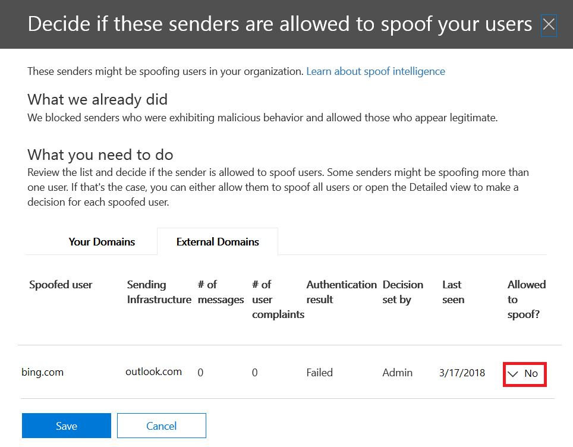
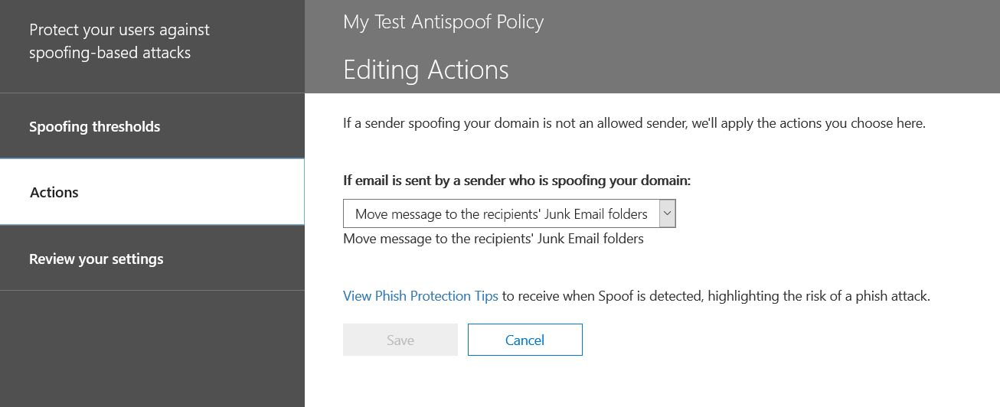

# Meer informatie over spoofintelligentie

Gebruik spoofinformatie in &amp; het Security Compliance Center op de **pagina Anti-spam-instellingen** om alle afzenders te bekijken die domeinen spoofen die deel uitmaken van uw organisatie of externe domeinen spoofen. Spoofinformatie is beschikbaar als onderdeel van Office 365 Enterprise E5 of afzonderlijk als onderdeel van Advanced Threat Protection (ATP) en vanaf oktober 2018 Exchange Online Protection (EOP).

## Tegen welke soorten e-mailspoofing kan ik controleren en tegen welke moet ik beschermen met spoofinformatie?

Voor domeinen die u bezit, u afzenders bekijken die uw domein spoofen en vervolgens ervoor kiezen om de afzender toe te staan de afzender voort te zetten of te blokkeren. Voor externe domeinen u het afzenderdomein toestaan in combinatie met de verzendinfrastructuur, hoewel er geen persoon e-mailadres verzendt.

Wanneer een afzender een e-mailadres vervalst, lijkt deze e-mail te verzenden namens een of meer gebruikersaccounts binnen een van de domeinen van uw organisatie of een extern domein dat naar uw organisatie wordt verzonden. Verrassend, zijn er sommige wettige bedrijfsredenen voor spoofing. In deze gevallen blokkeert u bijvoorbeeld niet dat de afzender uw domein spooft:

- U hebt afzenders van derden die uw domein gebruiken om bulkmail naar uw eigen werknemers te verzenden voor bedrijfspeilingen.

- U hebt een extern bedrijf ingehuurd om namens u reclame- of productupdates te genereren en uit te zenden.

- Een assistent die regelmatig e-mail moet sturen naar een andere persoon binnen uw organisatie.

- Een toepassing die is geconfigureerd om de eigen organisatie te spoofen om interne meldingen per e-mail te verzenden.

Externe domeinen verzenden vaak vervalste e-mail, en veel van deze redenen zijn legitiem. Hier volgen bijvoorbeeld enkele legitieme gevallen waarin externe afzenders vervalste e-mail verzenden:

- De afzender staat op een lijst met discussiemailing en de mailinglijst stuurt de e-mail van de oorspronkelijke afzender door naar alle deelnemers op de mailinglijst.

- Een extern bedrijf stuurt e-mail namens een ander bedrijf (bijvoorbeeld een geautomatiseerd rapport of een software-as-a-servicebedrijf).

U hebt een manier nodig om ervoor te zorgen dat de e-mail die door legitieme spoofers wordt verzonden, niet verstrikt raakt in spamfilters in Office 365- of externe e-mailsystemen. Normaal gesproken behandelt Office 365 deze e-mailberichten als spam. Als Office 365-beheerder u dit voorkomen door spooffilters &amp; in te stellen in het Security Compliance Center. Als u eigenaar bent van het domein, u SPF, DKIM en DMARC configureren om deze afzenders mogelijk te maken.

Aan de andere kant moeten kwaadwillenden, afzenders die uw domein of externe domeinen spoofen om spam of phishing-e-mail te verzenden, worden geblokkeerd. Spoofing is ook een veel voorkomende manier voor phishers om gebruikersreferenties te krijgen. Office 365 heeft ingebouwde spoofbeveiliging om uw organisatie te beschermen tegen afzenders van deze schadelijke e-mails. Spoofbeveiliging voor de domeinen van uw organisatie is altijd ingeschakeld voor alle Office 365-klanten en externe domeinspoofbeveiliging is standaard ingeschakeld voor klanten van Advanced Threat Protection en vanaf oktober 2018 ook voor EOP-klanten. Om deze bescherming verder te versterken, u ons vertellen welke afzenders gemachtigd zijn om de domeinen van uw organisatie te spoofen en namens u e-mail te verzenden en of externe domeinen mogen spoofen. E-mails die worden verzonden van een afzender die u niet goedkeurt, worden behandeld als spam of spoofing door Office 365. Houd de afzenders die uw domein spoofen in de &amp; gaten en help ons de informatie over spoofs te verbeteren door het Security Compliance Center te gebruiken.

## Spoofintelligence beheren in &amp; het Security Compliance Center

Het spoofintelligentiebeleid dat u hebt ingesteld, wordt altijd afgedwongen door Office 365. U het niet uitschakelen, maar u wel kiezen hoeveel u het actief wilt beheren.

U de afzenders bekijken die uw domein of externe domeinen spoofen en vervolgens beslissen of &amp; elke afzender dit moet mogen doen met behulp van het Security Compliance Center. Voor elk vervalst gebruikersaccount dat een afzender spooft vanuit uw domein of een extern domein, u de informatie in de volgende tabel bekijken.

|**Parameter**|**Beschrijving**|
|:-----|:-----|
|Afzender    |Ook wel de ware afzender genoemd. Dit is meestal het domein van waaruit de spoof e-mail afkomstig is. Office 365 bepaalt het domein van de DNS-record (PTR) van het verzendende IP-adres dat uw organisatie spooft. Als er geen domein wordt gevonden, wordt in het rapport in plaats daarvan het IP-adres van de afzender weergegeven.    |
|Vervalste gebruiker    |Het gebruikersaccount dat wordt vervalst door de afzender.    **Alleen intern** tabblad. Dit veld bevat één e-mailadres of als de afzender meerdere gebruikersaccounts spooft, bevat het **meer dan één**.    **Alleen extern** tabblad. Externe domeinen bevatten alleen een verzendend domein en bevatten geen volledig e-mailadres.    **Tip! Voor geavanceerde beheerders.** De vervalste gebruiker is het Adres Van (5322.Van) dat ook het adres is dat wordt weergegeven als het adres van de e-mailclient. Dit wordt ook wel de header genoemd. De geldigheid van dit adres wordt niet gecontroleerd door SPF.           |
|Aantal berichten    |Het aantal e-mailberichten dat de afzender in de afgelopen 30 dagen naar uw organisatie heeft verzonden namens de geïdentificeerde vervalste afzender of afzenders.    |
|Aantal klachten van gebruikers    |Klachten ingediend door gebruikers tegen deze afzender door uw gebruikers in de afgelopen 30 dagen. Klachten zijn meestal in de vorm van ongewenste inzendingen aan Microsoft.    |
|Verificatieresultaat    |Deze waarde wordt **doorgegeven** als de afzender de verificatiecontroles van Exchange Online Protection (EOP), zoals SPF of DKIM, **heeft doorstaan** als de afzender geen EOP-afzenderverificatiecontroles heeft uitgevoerd of **onbekend** is als het resultaat van deze controles niet bekend is.    |
|Besluit van    |Hiermee ziet u of de Office 365-beheerder of het spoofintelligentiebeleid heeft bepaald of de afzender de gebruiker al dan niet mag spoofen.    |
|Laatst gezien    |De laatste datum waarop een bericht is ontvangen door deze afzender namens deze vervalste gebruiker.    |
|Mag je spoofen?    | Hiermee wordt weergegeven of deze afzender e-mail mag verzenden namens de vervalste gebruiker. Mogelijke waarden zijn:    **Ja, ja** Alle vervalste adressen van deze spoofing-afzender mogen uw organisatie spoofen.    **Nee** Vervalste adressen van deze spoofing-afzender mogen uw organisatie niet spoofen. In plaats daarvan worden berichten van deze afzender gemarkeerd als spam door Office 365.    **Sommige gebruikers** Als een afzender meerdere gebruikers spooft, mogen sommige vervalste adressen van deze afzender uw organisatie spoofen, de rest wordt gemarkeerd als spam. Gebruik het tabblad **Gedetailleerd** om de specifieke adressen weer te geven.    |
|Spooftype    |Deze waarde is **intern** als het domein een van de ingerichte domeinen van uw organisatie is, anders is de waarde **Extern**.    |

 **Afzenders beheren die uw domein spoofen &amp; met behulp van het Security Compliance Center**

1. Ga naar het [Security &amp; Compliance Center](https://protection.office.com).

2. Meld u aan bij Office 365 met uw werk- of schoolaccount. Uw account moet beheerdersreferenties hebben in uw Office 365-organisatie.

3. Vouw in &amp; het Security Compliance Center **antispam**uit voor **threat management** \> **policy.** \>

    

4. Schuif op de pagina **Anti-spam-instellingen** in het rechterdeelvenster omlaag en vouw **het spoof-intelligentiebeleid**uit .

    

5. Als u de lijst met afzenders wilt weergeven die uw domein spoofen, kiest u **Nieuwe afzenders controleren** en selecteert u het tabblad **Uw domeinen.**

    Als je afzenders al hebt beoordeeld en een aantal van je eerdere keuzes wilt wijzigen, kun je **Afzenders weergeven** die ik al heb beoordeeld, kiezen. In beide gevallen wordt het volgende deelvenster weergegeven.

    

    Elke vervalste gebruiker wordt weergegeven in een aparte rij, zodat u kiezen of de afzender elke gebruiker afzonderlijk wilt spoofen of blokkeren.

    Als u een afzender wilt toevoegen aan de lijst toestaan voor een gebruiker, selecteert u **Ja** in de kolom **Toegestaan om te spoofen.** Als u een afzender wilt toevoegen aan de bloklijst voor een gebruiker, kiest u **Nee**.

    Als u het beleid wilt instellen voor domeinen waarvan u niet de eigenaar bent, selecteert u het tabblad **Externe domeinen.** Wijzig een afzender in **Ja** in de kolom **Toegestaan om te spoofen** zodat die afzender niet-geverifieerde e-mail naar uw organisatie kan verzenden. Als u denkt dat Office 365 een fout heeft gemaakt door de afzender vervalste e-mail te laten verzenden, wijzigt u de kolom **Toegestaan om te spoofen** in **Nee.**

    

6. Kies **Opslaan** om eventuele wijzigingen op te slaan.

Als u een Office 365 Enterprise E5-abonnement hebt of advanced threat protection apart hebt aangeschaft als add-on, u ook afzenders beheren die uw domein spoofen via de [Spoof Intelligence Insight](https://docs.microsoft.com/office365/securitycompliance/walkthrough-spoof-intelligence-insight).

## Het anti-spoofingbeleid configureren

Naast het toestaan of blokkeren van een bepaalde afzender van het verzenden van vervalste e-mail naar uw organisatie, u ook configureren hoe streng u wilt dat het filter is en de actie die u moet ondernemen wanneer een spoofingbericht wordt gevonden.

Anti-spoofing bescherming wordt toegepast op e-mail van afzenders van domeinen die zich buiten uw Office 365-organisatie bevinden. U het beleid toepassen op ontvangers waarvan de postvakken een licentie hebben voor Office 365 Enterprise E5, Advanced Threat Protection en vanaf oktober 2018 ook EOP-klanten. U beheert het anti-spoofing beleid samen met de andere anti-phishing-instellingen. Zie [Office 365 ATP-antiphishing- en antiphishingbeleid instellen](set-up-anti-phishing-policies.md)voor meer informatie over antiphishing-instellingen.

Office 365 bevat standaardanti-spoofingbeveiliging die altijd wordt uitgevoerd. Deze standaardbeveiliging is niet &amp; zichtbaar in het Security Compliance Center of kan worden opgehaald via Windows PowerShell-cmdlets. U de standaardanti-spoofingbeveiliging niet wijzigen. In plaats daarvan u configureren hoe strikt Office 365 de anti-spoofing-beveiliging afdwingt in elk antiphishingbeleid dat u maakt.

Hoewel het anti-spoofing-beleid wordt weergegeven onder het &amp; anti-phishingbeleid in het Security Compliance Center, neemt het zijn standaardgedrag niet over van de bestaande phishing-instelling onder de antispamconfiguratie. Als u instellingen onder **Anti-spam** \> **Phishing** hebt die u wilt repliceren voor anti-spoofing, moet u een anti-phishingbeleid maken en vervolgens het spoofgedeelte van het antiphishingbeleid bewerken om uw spoofinstellingen weer te geven zoals beschreven in de volgende sectie, in plaats van de standaardinstellingen te accepteren die op de achtergrond worden uitgevoerd.

 **Anti-spoofingbeveiliging configureren binnen een antiphishingbeleid met &amp; behulp van het Security Compliance Center**

1. Ga naar het [Security &amp; Compliance Center](https://protection.office.com).

2. Meld u aan bij Office 365 met uw werk- of schoolaccount. Uw account moet beheerdersreferenties hebben in uw Office 365-organisatie.

3. Breid in &amp; het Security Compliance Center **het Threat Management** \> **Policy** \> **Anti-phishing**uit.

4. Selecteer op de **anti-phishingpagina** in het rechterdeelvenster het anti-phishingbeleid dat u wilt configureren.

5. **Kies**bewerken op de pagina die wordt weergegeven in de rij **Spoof** .

6. Configureer vervolgens de acties die moeten worden uitgevoerd wanneer een bericht wordt gedetecteerd als een cross-domain-spoof. Het standaardgedrag is om het bericht te verplaatsen naar de map ongewenste e-mail van de ontvanger. De andere optie is om het bericht naar de quarantaine te sturen. Zie [E-mailberichten in quarantaine in Office 365](quarantine-email-messages.md)voor meer informatie over het beheren van berichten die naar quarantaine zijn verzonden.

    

7. Maak uw keuze en **kies**opslaan.

## Andere manieren om spoofing en phishing te beheren met Office 365

Wees ijverig over spoofing en phishing bescherming. Hier volgen gerelateerde manieren om te controleren of afzenders uw domein spoofen en voorkomen dat ze uw organisatie beschadigen:

- Controleer het spoofmailrapport van Exchange Online Protection als onderdeel van uw routine. U dit rapport vaak gebruiken om vervalste afzenders te bekijken en te beheren. Zie **Spoof-e-mailrapport** in rapporten over [e-mailbeveiliging gebruiken in Office 365 voor informatie om gegevens over malware, spam en regeldetecties weer te geven.](https://docs.microsoft.com/exchange/monitoring/use-mail-protection-reports)

Voor meer geavanceerde Office 365-beheerders u deze controles ook uitvoeren:

- Bekijk de SPF-configuratie (Sender Policy Framework). Zie [SPF instellen in Office 365](set-up-spf-in-office-365-to-help-prevent-spoofing.md)om spoofing te voorkomen voor een snelle inleiding tot SPF en om deze snel te configureren. Voor een meer diepgaand inzicht in hoe Office 365 SPF gebruikt, of voor het oplossen van problemen of niet-standaardimplementaties zoals hybride implementaties, begint u met [hoe Office 365 Sender Policy Framework (SPF) gebruikt om spoofing te voorkomen.](how-office-365-uses-spf-to-prevent-spoofing.md)

- Bekijk de DKIM-configuratie (DomainKeys Identified Mail). U moet DKIM gebruiken in aanvulling op SPF en DMARC om te voorkomen dat spoofers berichten verzenden die eruit zien alsof ze afkomstig zijn uit uw domein. Met DKIM u een digitale handtekening toevoegen aan e-mailberichten in de berichtkop. Zie [DKIM gebruiken om uitgaande e-mails die vanuit uw aangepaste domein zijn verzonden in Office 365 te valideren](use-dkim-to-validate-outbound-email.md)voor informatie.

- Controleer de configuratie van uw domeinverificatie, rapportage en conformiteit (DMARC). Het implementeren van DMARC met SPF en DKIM biedt extra bescherming tegen spoofing en phishing e-mail. DMARC helpt bij het ontvangen van e-mailsystemen bepalen wat te doen met berichten die vanuit uw domein worden verzonden en die niet voldoen aan Controles met SPF of DKIM. Zie [DMARC gebruiken om e-mail te valideren in Office 365](use-dmarc-to-validate-email.md)voor informatie.

- Gebruik de [cmdlet Get-PhishFilterPolicy](https://docs.microsoft.com/powershell/module/exchange/advanced-threat-protection/get-phishfilterpolicy) in Exchange Online PowerShell of Exchange Online Protection PowerShell om gedetailleerde gegevens over vervalste afzenders te verzamelen, lijsten voor toestaan en blokkeren te genereren en u te helpen bepalen hoe u uitgebreidere SPF-, DKIM- en DMARC DNS-records genereren zonder dat uw legitieme e-mail wordt gevangen in externe spamfilters. Zie [Hoe antispoofing-beveiliging werkt in Office 365](https://blogs.msdn.microsoft.com/tzink/2016/02/23/how-antispoofing-protection-works-in-office-365/)voor meer informatie.
