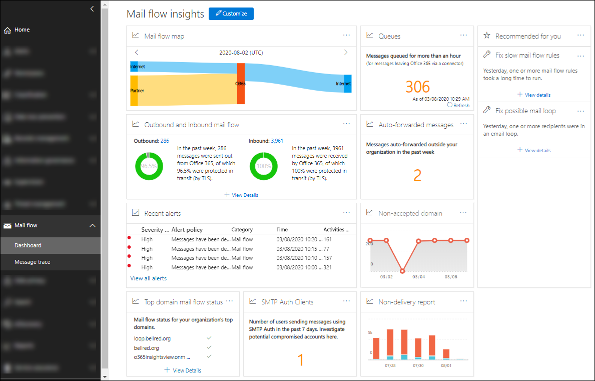

# Inzicht in e-mailstromen in het Security & Compliance CenterMail flow insights in the Security & Compliance Center

Beheerders kunnen het dashboard voor e-mailstroom gebruiken in het Security & Compliance Center om trends, inzichten te ontdekken en acties te ondernemen om problemen met betrekking tot de e-mailstroom in hun Office 365-organisatie op te lossen.Admins can use mail flow dashboard in the Security & Compliance Center to discover trends, insights and take actions to fix issues related to mail flow in their Office 365 organization.

De inzichten, rapporten en widgets die beschikbaar zijn in het dashboard van de e-mailstroom zijn:The insights, reports, and widgets that are available in the mail flow dashboard are:

- [Rapport van de e-mailstroomkaartMail flow map report](mfi-mail-flow-map-report.md)

- [Statusinzicht domeinmailstroomDomain mail flow status insight](mfi-domain-mail-flow-status-insight.md)

- [SMTP Auth-clients rapporterenSMTP Auth clients report](mfi-smtp-auth-clients-report.md)

- [Inzicht in afzenderdomeinSender domain insight](mfi-sender-domain-insight.md)

- [Rapport niet-leveringNon-delivery report](mfi-non-delivery-report.md)

- [Niet-geaccepteerd domeinrapportNon-accepted domain report](mfi-non-accepted-domain-report.md)

- [Uitgaande en binnenkomende e-mailstroomOutbound and inbound mail flow](mfi-outbound-and-inbound-mail-flow.md)

- [Wachtrijwaarschuwingen en wachtrijenQueue alerts and Queues](mfi-queue-alerts-and-queues.md)

- [Rapport met automatisch doorgestuurde berichtenAuto-forwarded messages report](mfi-auto-forwarded-messages-report.md)

- [Inzicht in e-maillusMail loop insight](mfi-mail-loop-insight.md)

- [Inzicht in de regels voor trage e-mailregelsSlow mail flow rules insight](mfi-slow-mail-flow-rules-insight.md)

## Machtigingen die nodig zijn om het dashboard van de e-mailstroom weer te gevenPermissions required to view the mail flow dashboard

Het dashboard van de e-mailstroom is beschikbaar voor:The mail flow dashboard is available to:

- Leden van de **algemene beheerdersrol van Office 365.**Members of the **Office 365 global administrator** role.

- Leden van **de office 365 Exchange-beheerdersrol.**Members of **Office 365 Exchange administrator** role.

- Leden van de **functie Mail flow administrator** in het Security & Compliance Center.Members of the **Mail flow administrator role** in the Security & Compliance Center. Als deze rol expliciet is toegewezen aan een gebruiker die geen lid is van de rollen van de globale beheerder of Exchange-beheerder:If this role is explicitly assigned to a user who isn't a member of the global administrator or Exchange administrator roles:

  - De gebruiker moet zich rechtstreeks aanmelden bij [https://protection.office.com](https://protection.office.com)het Security & Compliance Center op .The user must log in to the Security & Compliance Center directly at [https://protection.office.com](https://protection.office.com).

  - De gebruiker heeft alleen-lezen toestemming voor het dashboard van de e-mailstroom.The user will only have read-only permission to the mail flow dashboard.

  - De gebruiker heeft geen toegang tot de Office 365-beheerportal.The user won't have access to the Office 365 admin portal.

Zie Algemene beheerrollen voor [Office 365-beheerders](https://docs.microsoft.com/office365/admin/add-users/about-admin-roles)voor meer informatie over de globale beheerrol van Office 365 .For more information about the Office 365 global administrator role, see [About Office 365 admin roles](https://docs.microsoft.com/office365/admin/add-users/about-admin-roles).

Zie Gebruikers toegang geven tot het Office [365 Security & Compliance Center](grant-access-to-the-security-and-compliance-center.md)voor informatie over het toewijzen van functies voor beveiliging & Compliance Center aan gebruikers.For information on assigning Security & Compliance Center roles to users, see [Give users access to the Office 365 Security & Compliance Center](grant-access-to-the-security-and-compliance-center.md).

## Waar vindt u het dashboard van de e-mailstroomWhere to find the mail flow dashboard

1. Ga naar het Security [https://protection.office.com](https://protection.office.com)& Compliance Center op .Go to the Security & Compliance Center at [https://protection.office.com](https://protection.office.com).

2. Vouw **de e-mailstroom** uit en selecteer **vervolgens Dashboard**.Expand **Mail flow** and then select **Dashboard**.

   
