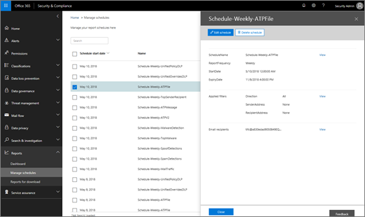

# Schema's voor meerdere &amp; rapporten beheren in het Security Compliance CenterManage schedules for multiple reports in the Security &amp; Compliance Center

In het &amp; Security Compliance Center zijn verschillende [rapporten en inzichten](reports-and-insights-in-security-and-compliance.md) beschikbaar om het beveiligingsteam van uw organisatie te helpen bedreigingen voor uw organisatie te beperken en aan te pakken.In the Security &amp; Compliance Center, several [reports and insights](reports-and-insights-in-security-and-compliance.md) are available to help your organization's security team mitigate and address threats to your organization. Als u lid bent van het beveiligingsteam van uw organisatie, u schema's beheren voor een of meer rapporten.If you're a member of your organization's security team, you can manage schedules for one or more reports. 
  
## Schema's voor rapporten beherenManage schedules for reports

> [!IMPORTANT]
> Zorg ervoor dat u over de benodigde machtigingen beschikt die zijn [toegewezen in het Office 365 Security &amp; Compliance Center](permissions-in-the-security-and-compliance-center.md).Make sure that you have the necessary [permissions assigned in the Office 365 Security &amp; Compliance Center](permissions-in-the-security-and-compliance-center.md). Over het algemeen hebben wereldwijde office 365-beheerders, beveiligingsbeheerders &amp; en beveiligingslezers toegang tot rapporten in het Security Compliance Center.In general, Office 365 global administrators, security administrators, and security readers can access reports in the Security &amp; Compliance Center. 
  

1. Ga [https://protection.office.com](https://protection.office.com) naar en meld je aan.Go to [https://protection.office.com](https://protection.office.com) and sign in. Dit brengt u naar het Security & Compliance Center.This takes you to the Security & Compliance Center.

2. Ga in &amp; het Security Compliance Center naar **Rapporten** \> **beheren van schema's**.In the Security &amp; Compliance Center, go to **Reports** \> **Manage schedules**.
    
3. Selecteer een item in de lijst.Select an item in the list.
    
4. Bekijk de informatie voor het schema van het rapport.Review the information for the report's schedule.
    
5. Bewerk of verwijder de planning, en klik vervolgens op **Sluiten**.As appropriate, edit or delete the schedule, and then click **Close**.
    
## Verwante onderwerpenRelated topics

[Rapporten en inzichten in het &amp; Office 365 Security Compliance CenterReports and insights in the Office 365 Security &amp; Compliance Center](reports-and-insights-in-security-and-compliance.md)
  
[Een planning maken voor een &amp; rapport in het Security Compliance CenterCreate a schedule for a report in the Security &amp; Compliance Center](create-a-schedule-for-a-report.md)
  
[Een aangepast rapport downloaden &amp; in het Security Compliance CenterDownload a custom report in the Security &amp; Compliance Center](set-up-and-download-a-custom-report.md)
  
[Bestaande rapporten downloaden &amp; in het Security Compliance CenterDownload existing reports in the Security &amp; Compliance Center](download-existing-reports.md)
  

