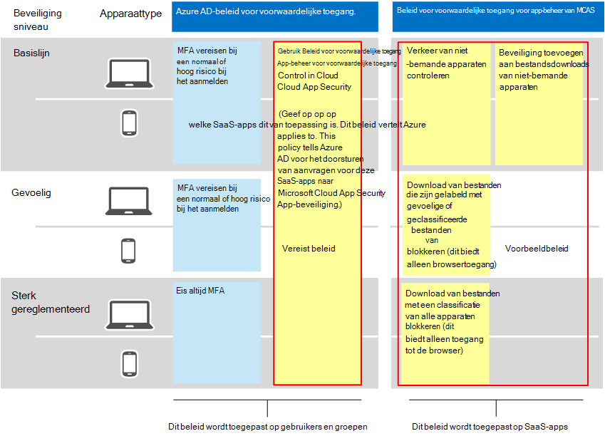

# Aanbevolen Microsoft Cloud App-beveiligingsbeleid voor SaaS-apps
Microsoft Cloud App Security is gebaseerd op beleid voor voorwaardelijke toegang van Azure AD om het in realtime controleren en beheren van gedetailleerde acties met SaaS-apps mogelijk te maken, zoals het blokkeren van downloads, uploaden, kopiëren en plakken en afdrukken. Met deze functie wordt beveiliging toegevoegd aan sessies die inherent risico's met zich brengen, zoals wanneer bedrijfsresources worden gebruikt vanaf niet-bemande apparaten of door gastgebruikers. 

Microsoft Cloud App Security integreert ook inheems met Microsoft Information Protection, waarmee in realtime inhoud wordt gecontroleerd om gevoelige gegevens te vinden op basis van gevoelige informatietypen en gevoeligheidslabels en om passende actie te ondernemen. 

Deze richtlijnen omvatten aanbevelingen voor deze scenario's:
- SaaS-apps in IT-beheer brengen
- Beveiliging voor specifieke SaaS-apps afstemmen
- Preventie van gegevensverlies (DLP) configureren om te voldoen aan gegevensbeschermingsvoorschriften

## SaaS-apps in IT-beheer brengen

De eerste stap in het gebruik van Microsoft Cloud App Security voor het beheren van SaaS-apps is om deze te ontdekken en vervolgens toe te voegen aan uw Azure AD-tenant. Zie [SaaS-apps](https://docs.microsoft.com/cloud-app-security/tutorial-shadow-it)in uw netwerk ontdekken en beheren als u hulp nodig hebt bij detectie. Nadat u apps hebt gevonden, voegt [u deze toe aan uw Azure AD-tenant.](https://docs.microsoft.com/azure/active-directory/manage-apps/add-application-portal)  

U kunt beginnen deze te beheren door het volgende te doen:
1. Maak eerst in Azure AD een nieuw beleid voor voorwaardelijke toegang en configureer dit in 'Voorwaardelijke toegang app-beheer gebruiken'. Hiermee wordt de aanvraag omgeleid naar Cloud App Security. U kunt één beleid maken en alle SaaS-apps aan dit beleid toevoegen.
1. Maak vervolgens in Cloud App Security sessiebeleid. Maak één beleid voor elk besturingselement dat u wilt toepassen. 

Machtigingen voor SaaS-apps zijn meestal gebaseerd op zakelijke behoefte aan toegang tot de app. Deze machtigingen kunnen zeer dynamisch zijn. Het gebruik van cloud-appbeveiligingsbeleid zorgt voor beveiliging van app-gegevens, ongeacht of gebruikers zijn toegewezen aan een Azure AD-groep die is gekoppeld aan basislijnbeveiliging, gevoelige of sterk gereguleerde beveiliging.

Als u gegevens in uw verzameling SaaS-apps wilt beveiligen, wordt in het volgende diagram het benodigde beleid voor voorwaardelijke toegang van Azure AD en voorgestelde beleidsregels weergegeven die u kunt maken in Cloud App-beveiliging. In dit voorbeeld zijn de beleidsregels die zijn gemaakt in Cloud App Security van toepassing op alle SaaS-apps die u beheert. Deze zijn ontworpen om de juiste besturingselementen toe te passen op basis van de vraag of apparaten worden beheerd en gevoeligheidslabels die al op bestanden zijn toegepast. 

 

In de volgende tabel ziet u het nieuwe beleid voor voorwaardelijke toegang dat u moet maken in Azure AD.

|Beveiligingsniveau|Beleid|Meer informatie|
|---|---|---|
|Alle beveiligingsniveaus | [Voorwaardelijke toegang app-beheer gebruiken in cloud-app-beveiliging](https://docs.microsoft.com/cloud-app-security/proxy-deployment-aad#configure-integration-with-azure-ad) |Hiermee configureert u uw IdP (Azure AD) om te werken met Cloud App Security. |

In deze volgende tabel ziet u het bovenstaande voorbeeldbeleid dat u kunt maken om alle SaaS-apps te beveiligen. Zorg ervoor dat u uw eigen bedrijfs-, beveiligings- en compliancedoelstellingen evalueert en vervolgens beleid maakt dat de meest geschikte bescherming biedt voor uw omgeving. 

|Beveiligingsniveau|Beleid|
|---|---|
|Basislijn | Verkeer van niet-bemande apparaten controleren  Beveiliging toevoegen aan bestandsdownloads van niet-bemande apparaten | 
|Gevoelig  | Download van bestanden die zijn gelabeld met gevoelige of geclassificeerde bestanden van niet-bemande apparaten blokkeren (dit biedt alleen browsertoegang)  | 
| Sterk gereglementeerd | Download van bestanden met een classificatie van alle apparaten blokkeren (dit biedt alleen toegang tot de browser)  |   
|  |   |  

Zie Appbesturingselement voor voorwaardelijke toegang implementeren voor aanbevolen apps voor end-to-endinstructies voor het instellen van Voorwaardelijke toegangsbeheer voor [apps.](https://docs.microsoft.com/cloud-app-security/proxy-deployment-aad) In dit artikel wordt u beschreven hoe u het vereiste beleid voor voorwaardelijke toegang in Azure AD maakt en uw SaaS-apps test.

Zie Apps beveiligen met Microsoft Cloud App Security Conditional Access App Control voor meer [informatie.](https://docs.microsoft.com/cloud-app-security/proxy-intro-aad) 

## Beveiliging voor specifieke SaaS-apps afstemmen
Mogelijk wilt u extra monitoring en besturingselementen toepassen op specifieke SaaS-apps in uw omgeving. Cloud App Security stelt u in staat om dit te doen. Als een app zoals Box bijvoorbeeld veel wordt gebruikt in uw omgeving, is het zinvol om extra besturingselementen toe te passen. Of als uw juridische of financiële afdeling een specifieke SaaS-app gebruikt voor gevoelige zakelijke gegevens, kunt u zich richten op extra beveiliging voor deze apps. 

U kunt uw Box-omgeving bijvoorbeeld beveiligen met deze typen ingebouwde beleidssjablonen voor het opsporen van anomaly's:
- Activiteit van anonieme IP-adressen
- Activiteit uit een niet-vaak land
- Activiteit van verdachte IP-adressen
- Onmogelijk reizen
- Activiteit uitgevoerd door beëindigde gebruiker (vereist AAD als IdP)
- Malwaredetectie
- Meerdere mislukte aanmeldingspogingen
- Ransomware-activiteit
- Riskante Oauth-app
- Ongebruikelijke activiteit voor het delen van bestanden

Dit zijn voorbeelden. Er worden regelmatig aanvullende beleidssjablonen toegevoegd. Zie Verbonden [apps beveiligen](https://docs.microsoft.com/cloud-app-security/protect-connected-apps)voor voorbeelden van het toepassen van extra beveiliging op specifieke apps. 

[Hoe Cloud App Security uw Box-omgeving](https://docs.microsoft.com/cloud-app-security/protect-box) helpt beveiligen, toont de typen besturingselementen waarmee u uw zakelijke gegevens kunt beveiligen in Box en andere apps met gevoelige gegevens.

## Preventie van gegevensverlies (DLP) configureren om te voldoen aan gegevensbeschermingsvoorschriften

Cloud App Security kan een waardevol hulpmiddel zijn voor het configureren van beveiliging voor nalevingsregels. In dit geval maakt u specifieke beleidsregels om te zoeken naar specifieke gegevens die door een verordening worden toegepast en om elk beleid zo te configureren dat de juiste actie wordt ondernomen. 

In de volgende afbeelding en tabel vindt u verschillende voorbeelden van beleidsregels die kunnen worden geconfigureerd om te voldoen aan de Algemene verordening gegevensbescherming (AVG). In deze voorbeelden wordt in beleid naar specifieke gegevens op zoek. Op basis van de gevoeligheid van de gegevens is elk beleid zo geconfigureerd dat de juiste actie wordt ondernomen. 

|Beveiligingsniveau|Voorbeeldbeleid|
|:---------------|:-------|
| Basislijn |Waarschuwing wanneer bestanden met dit gevoelige informatietype ('Creditcardnummer') buiten de organisatie worden gedeeld   Downloads van bestanden met dit gevoelige informatietype ('Creditcardnummer') blokkeren op niet-bemande apparaten|
| Gevoelig  | Downloads van bestanden met dit gevoelige informatietype ('Creditcardnummer') beveiligen op beheerde apparaten   Downloads van bestanden met dit gevoelige informatietype ('Creditcardnummer') blokkeren op niet-bemande apparaten   Waarschuwing wanneer een bestand met een van deze labels wordt geüpload naar OneDrive voor Bedrijven of Box (Klantgegevens, Personeelszaken: Salarisgegevens,Personeelszaken, Werknemersgegevens)|
| Sterk gereglementeerd |Waarschuwing wanneer bestanden met dit label ('Hoog geclassificeerd') worden gedownload naar beheerde apparaten 
Downloads van bestanden met dit label ('Hoog geclassificeerd') blokkeren op niet-bemande apparaten |
| | |

## Volgende stappen

Zie Microsoft [Cloud App Security-documentatie](https://docs.microsoft.com//cloud-app-security/)voor meer informatie over het gebruik van cloud-appbeveiliging. 