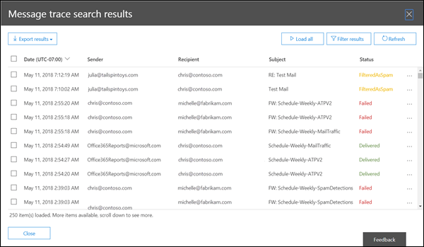

# Berichttracering in het Beveiligings- en compliancecentrum

[!INCLUDE [Microsoft 365 Defender rebranding](../includes/microsoft-defender-for-office.md)]

**Van toepassing op**
- [Exchange Online Protection](exchange-online-protection-overview.md)
- [Abonnement 1 en abonnement 2 voor Microsoft Defender voor Office 365](defender-for-office-365.md)
- [Microsoft 365 Defender](../defender/microsoft-365-defender.md)

Bericht traceren in het Beveiligings- & compliancecentrum volgt e-mailberichten terwijl ze door uw Exchange Online reizen. U kunt bepalen of een bericht is ontvangen, geweigerd, uitgesteld of bezorgd door de service. Ook wordt weergegeven welke acties zijn uitgevoerd op het bericht voordat het de uiteindelijke status heeft bereikt.

U kunt de informatie uit bericht traceren gebruiken om gebruikersvragen efficiënt te beantwoorden over wat er met berichten is gebeurd, problemen met de e-mailstroom op te lossen en beleidswijzigingen te valideren.

## Wat moet u weten voordat u begint?

- U moet lid zijn van de rollengroepen **Organisatiebeheer,** **Compliancebeheer** of **Helpdesk** **in** Exchange Online om bericht traceren te gebruiken. Zie [Machtigingen in Exchange Online](/exchange/permissions-exo/permissions-exo) voor meer informatie.

  **Opmerkingen:** Lidmaatschap van de bijbehorende Azure Active Directory rol in het Microsoft 365-beheercentrum  geeft gebruikers de vereiste machtigingen en machtigingen voor andere functies in Microsoft 365. Zie[Over beheerdersrollen](../../admin/add-users/about-admin-roles.md) voor meer informatie.

- Het maximum aantal berichten dat wordt weergegeven in de resultaten van een berichtspoor, is afhankelijk van het rapporttype dat u hebt geselecteerd (zie de sectie [Rapporttype](#choose-report-type) kiezen voor meer informatie). De [cmdlet Get-HistoricalSearch](/powershell/module/exchange/get-historicalsearch) in Exchange Online PowerShell of zelfstandige EOP PowerShell retourneert alle berichten in de resultaten.

## Bericht traceren openen

Open het Beveiligingscentrum & compliancecentrum op <https://protection.office.com/> en ga naar **E-mailstroombericht** \> **traceren.**

Als u rechtstreeks naar de pagina **Bericht traceren wilt** gaan, opent u <https://protection.office.com/messagetrace> .

## Pagina Bericht traceren

Vanaf hier kunt u een nieuwe standaard trace starten door op de **knop Een trace starten te** klikken. Hiermee wordt gezocht naar alle berichten voor alle afzenders en geadresseerden van de afgelopen twee dagen. U kunt ook een van de opgeslagen query's uit de beschikbare querycategorieën gebruiken en deze als uitgangspunt gebruiken voor uw eigen query's:

- **Standaardquery's:** ingebouwde query's die worden geleverd door Microsoft 365.
- **Aangepaste query's:** query's die zijn opgeslagen door beheerders in uw organisatie voor toekomstig gebruik.
- **Automatisch opgeslagen query's:** de laatste tien laatst uitgevoerd query's. Met deze lijst kunt u eenvoudig gaan waar u gebleven was.

Op deze pagina vindt u ook een sectie **Downloadbare** rapporten voor de aanvragen die u hebt ingediend, evenals de rapporten zelf wanneer er beschikbaar zijn om te downloaden.

## Opties voor een nieuw bericht traceren

### Filteren op afzenders en geadresseerden

De standaardwaarden zijn **Alle afzenders en** **Alle** geadresseerden, maar u kunt de volgende velden gebruiken om de resultaten te filteren:

- **Door deze personen:** Klik in dit veld om een of meer afzenders uit uw organisatie te selecteren. U kunt ook een naam beginnen te typen en de items in de lijst worden gefilterd op wat u hebt getypt, net zoals een zoekpagina zich gedraagt.
- **Voor deze personen:** Klik in dit veld om een of meer geadresseerden in uw organisatie te selecteren.

> [!NOTE]
>
> - U kunt ook de e-mailadressen van externe afzenders en geadresseerden typen. Jokertekens worden ondersteund (bijvoorbeeld), maar u kunt niet meerdere jokertekens tegelijk in hetzelfde veld `*@contoso.com` gebruiken.
> - U kunt meerdere afzenders of lijsten met geadresseerden plakken, gescheiden door puntkomma's ( `;` ). spaties `\s` (), het rijtuig retourneert ( `\r` ) of de volgende lijnen ( `\n` ).

### Tijdbereik

De standaardwaarde is **2 dagen,** maar u kunt datum-/tijdbereiken opgeven van maximaal 90 dagen. Wanneer u datum-/tijdbereiken gebruikt, moet u rekening houden met de volgende problemen:

- Standaard selecteert u het tijdbereik in de **schuifregelaarweergave** met een tijdregel. U kunt alleen de dag- of tijdinstellingen selecteren die worden weergegeven. Als u een tussenwaarde probeert te selecteren, wordt de start-/eindballon uitlijnen op de dichtstbijzijnde weergegeven instelling.

  

  U kunt echter ook  overschakelen naar aangepaste weergave,  waar u de waarden **Begindatum** en  Einddatum (inclusief tijden) kunt opgeven en u ook de tijdzone voor het datum-/tijdbereik kunt selecteren. Houd er rekening **mee dat de instelling Tijdzone** van toepassing is op zowel de query-invoer als de queryresultaten.

  

  De resultaten zijn tien dagen of minder direct beschikbaar als **overzichtsrapport.** Als u een tijdsbereik opgeeft dat zelfs iets groter is dan 10 dagen, worden de resultaten vertraagd omdat ze alleen beschikbaar zijn als een downloadbaar CSV-bestand **(** Uitgebreide samenvatting of **Uitgebreide** rapporten).

  Zie de sectie [Rapporttype](#choose-report-type) kiezen in dit artikel voor meer informatie over de verschillende rapporttypen.

  > [!NOTE]
  > Uitgebreide overzichts- en uitgebreide rapporten worden voorbereid met behulp van gearchiveerde gegevens over bericht traceren en het kan enkele uren duren voordat uw rapport kan worden gedownload. Afhankelijk van het aantal andere beheerders dat ook rapportaanvragen rond dezelfde tijd heeft ingediend, ziet u mogelijk ook een vertraging voordat de verwerking wordt gestart voor uw in wachtrij geplaatste aanvraag.

- Als u  een query opspart in de schuifregelaarweergave, wordt het relatieve tijdsbereik (bijvoorbeeld 3 dagen vanaf vandaag) op de balk op slaan. Als u een query **op** slaat in de aangepaste weergave, wordt het absolute datum-/tijdbereik op slaan (bijvoorbeeld 2018-05-06 13:00 tot 2018-05-08 18:00).

### Meer zoekopties

#### Bezorgingsstatus

U kunt de standaardwaarde **Alles** geselecteerd laten of u kunt een van de volgende waarden selecteren om de resultaten te filteren:

- **Bezorgd:** het bericht is bezorgd op de gewenste bestemming.
- **In** behandeling: De bezorging van het bericht wordt geprobeerd of opnieuw geprobeerd.
- **Uitgebreid:** een geadresseerde van een distributiegroep is vóór de bezorging uitgebreid naar de afzonderlijke leden van de groep.
- **Mislukt:** het bericht is niet bezorgd.
- **In quarantaine** geplaatst: het bericht is in quarantaine geplaatst (als spam, bulkmail of phishing). Zie In quarantaine geplaatste [e-mailberichten in EOP](quarantine-email-messages.md)voor meer informatie.
- **Gefilterd als spam:** het bericht is geïdentificeerd als spam en is geweigerd of geblokkeerd (niet in quarantaine geplaatst).
- **Status verkrijgen:** Het bericht is onlangs ontvangen door Microsoft 365, maar er zijn nog geen andere statusgegevens beschikbaar. Over een paar minuten terug.

> [!NOTE]
> De waarden **In behandeling,** **Quarantaine** en Filteren als **spam** zijn alleen beschikbaar voor zoekopdrachten die minder dan 10 dagen duren. Er kan ook een vertraging van 5 tot 10 minuten zijn tussen de werkelijke en gerapporteerde bezorgingsstatus.

#### Bericht-id

Dit is de internetbericht-id (ook wel client-id genoemd) die wordt gevonden in het veld **Bericht-id:** koptekst in de berichtkoptekst. Gebruikers kunnen u deze waarde geven om specifieke berichten te onderzoeken.

Deze waarde is constant voor de levensduur van het bericht. Voor berichten die in Microsoft 365 of Exchange worden gemaakt, is de waarde in de notatie , inclusief de `<GUID@ServerFQDN>` hoekhaken ( \< \> ). Bijvoorbeeld `<d9683b4c-127b-413a-ae2e-fa7dfb32c69d@DM3NAM06BG401.Eop-nam06.prod.protection.outlook.com>`. In andere berichtensystemen kunnen verschillende syntaxis of waarden worden gebruikt. Deze waarde moet uniek zijn, maar niet alle e-mailsystemen voldoen strikt aan deze vereiste. Als het **bericht-id:** koptekstveld niet bestaat of leeg is voor binnenkomende berichten uit externe bronnen, wordt een willekeurige waarde toegewezen.

Wanneer u **Bericht-id gebruikt om** de resultaten te filteren, moet u de volledige tekenreeks opnemen, inclusief eventuele hoekhaken.

#### Richting

U kunt de standaardwaarde **Alles** geselecteerd laten, of u kunt **Inkomende** berichten (berichten die zijn verzonden naar geadresseerden in uw organisatie) of Uitgaande **(berichten** die zijn verzonden van gebruikers in uw organisatie) selecteren om de resultaten te filteren.

#### Oorspronkelijk IP-adres van client

U kunt de resultaten op client-IP-adres opslaan om gehackte computers te onderzoeken die grote hoeveelheden spam of malware verzenden. Hoewel de berichten mogelijk afkomstig zijn van meerdere afzenders, is het waarschijnlijk dat op dezelfde computer alle berichten worden gegenereerd.

> [!NOTE]
> De IP-adresgegevens van de client zijn slechts 10 dagen beschikbaar  en zijn alleen beschikbaar in de **uitgebreide** samenvatting of uitgebreide rapporten (downloadbare CSV-bestanden).

### Rapporttype kiezen

De beschikbare rapporttypen zijn:

- **Overzicht:** Beschikbaar als het tijdsbereik kleiner is dan 10 dagen en er geen extra filteropties nodig zijn. De resultaten zijn vrijwel direct beschikbaar nadat u op **Zoeken hebt geklikt.** Het rapport retourneert maximaal 20000 resultaten.
- **Uitgebreide** samenvatting of **Uitgebreid:** Deze rapporten zijn alleen beschikbaar als downloadbare CSV-bestanden en vereisen een of meer van de volgende filteropties, ongeacht het tijdsbereik: Door deze personen **,** Aan deze personen of **Bericht-id.** U kunt jokertekens gebruiken voor de afzenders of geadresseerden (bijvoorbeeld \* @contoso.com). Het uitgebreide overzichtsrapport retourneert maximaal 50000 resultaten. Het rapport Uitgebreid retourneert maximaal 1000 resultaten.

> [!NOTE]
>
> - Uitgebreide overzichts- en uitgebreide rapporten worden voorbereid met behulp van gearchiveerde gegevens over bericht traceren en het kan enkele uren duren voordat uw rapport kan worden gedownload. Afhankelijk van hoeveel andere beheerders rond dezelfde tijd ook rapportaanvragen hebben ingediend, ziet u mogelijk ook een vertraging voordat uw wachtrijaanvraag wordt verwerkt.
> - Hoewel u een uitgebreid overzicht of uitgebreid rapport kunt selecteren voor een datum-/tijdbereik, zijn meestal de laatste vier uur van gearchiveerde gegevens nog niet beschikbaar voor deze twee typen rapporten.
> - De maximale grootte voor een downloadbaar rapport is 500 MB. Als een downloadbaar rapport meer dan 500 MB bedraagt, kunt u het rapport niet openen in Excel of Kladblok.

Wanneer u op **Volgende** klikt, ziet u een overzichtspagina met de filteropties die u hebt geselecteerd, een unieke (bewerkbare) titel voor het rapport en het e-mailadres dat de melding ontvangt wanneer de bericht trace wordt voltooid (ook bewerkbaar en moet zich in een van de geaccepteerde domeinen van uw organisatie) plaatsen. Klik **op Rapport voorbereiden** om de berichtspoor te verzenden. Op de **hoofdpagina Bericht** traceren ziet u de status van het rapport in de **sectie Downloadbare** rapporten.

Zie de volgende sectie voor meer informatie over de informatie die wordt geretourneerd in de verschillende rapporttypen.

## Resultaten van bericht traceren

De verschillende rapporttypen retourneren verschillende informatieniveaus. De informatie die beschikbaar is in de verschillende rapporten, wordt beschreven in de volgende secties.

### Uitvoer overzichtsrapport

Na het uitvoeren van de bericht trace worden de resultaten weergegeven, gesorteerd op aflopende datum/tijd (meest recente eerste).

Het overzichtsrapport bevat de volgende informatie:

- **Datum:** De datum en tijd waarop het bericht is ontvangen door de service, met behulp van de geconfigureerde UTC-tijdzone.
- **Afzender:** het e-mailadres van de afzender @ *(aliasdomein).*
- **Geadresseerde:** Het e-mailadres van de geadresseerde of geadresseerde. Voor een bericht dat naar meerdere geadresseerden wordt verzonden, is er één regel per geadresseerde. Als de geadresseerde een distributiegroep, dynamische distributiegroep of beveiligingsgroep met e-mail is, is de groep de eerste geadresseerde en staat elk lid van de groep op een aparte regel.
- **Onderwerp:** De eerste 256 tekens van het veld **Onderwerp:** van het bericht.
- **Status:** deze waarden worden beschreven in de [sectie Bezorgingsstatus.](#delivery-status)

Standaard worden de eerste 250 resultaten geladen en direct beschikbaar. Wanneer u omlaag schuift, wordt er een kleine pauze in de volgende batch met resultaten geladen. In plaats van te schuiven, kunt u op **Alles laden** klikken om alle resultaten tot een maximum van 10.000 te laden.

U kunt op de kolomkoppen klikken om de resultaten te sorteren op de waarden in die kolom in oplopende of aflopende volgorde.

U kunt op **Resultaten filteren klikken** om de resultaten te filteren op een of meer kolommen.

U kunt de resultaten exporteren nadat u een of  meer rijen hebt geselecteerd door op Resultaten exporteren te klikken en vervolgens Alle resultaten **exporteren,** Geladen resultaten exporteren of Exporteren geselecteerd **te selecteren.**

#### Gerelateerde records zoeken voor dit bericht

Gerelateerde berichtenrecords zijn records die dezelfde bericht-id hebben gedeeld. Zelfs één bericht dat tussen twee personen is verzonden, kan meerdere records genereren. Het aantal records neemt toe wanneer het bericht wordt beïnvloed door uitbreiding van distributiegroep, doorsturen, regels voor e-mailstroom (ook wel transportregels genoemd), enzovoort.

Nadat u het selectievakje van een rij hebt geselecteerd, kunt u  gerelateerde records voor het bericht  zoeken door te klikken op de knop Gerelateerde zoeken die wordt weergegeven of door Meer opties te selecteren Meer gerelateerde records zoeken voor  \> **bericht**).

Zie de sectie Bericht-id eerder in dit artikel voor meer informatie over de bericht-id.

#### Details van bericht traceren

In de uitvoer van het overzichtsrapport kunt u de details van een bericht bekijken met behulp van een van de volgende methoden:

- Selecteer de rij (klik ergens in de rij behalve het selectievakje).
- Schakel het selectievakje van de rij in en klik op **Meer opties** Meer informatie  \> **weergeven.**

   

De details van de berichtspoorgegevens bevatten de volgende aanvullende informatie die niet aanwezig is in het overzichtsrapport:

- **Berichtgebeurtenissen:** deze sectie bevat classificaties die helpen bij het categoriseren van de acties die de service op berichten uitdeelt. **Enkele van de interessantere gebeurtenissen** die u mogelijk tegenkomt, zijn:
  - **Ontvangen:** Het bericht is ontvangen door de service.
  - **Verzenden:** Het bericht is verzonden door de service.
  - **Mislukt:** het bericht kan niet worden bezorgd.
  - **Bezorgen:** Het bericht is bezorgd in een postvak.
  - Uitvv:Het bericht is verzonden naar een distributiegroep die is uitgebreid.
  - **Overdracht:** Geadresseerden zijn verplaatst naar een bericht met een bifurcated bericht vanwege inhoudsconversie, limieten voor geadresseerden van berichten of agenten.
  - **Uitstel**: De bezorging van het bericht is uitgesteld en kan later opnieuw worden geprobeerd.
  - **Opgelost:** het bericht is omgeleid naar een nieuw adres van de geadresseerde op basis van een Active Directory-zoekbericht. Wanneer dit gebeurt, wordt het oorspronkelijke adres van de geadresseerde weergegeven in een aparte rij in het berichtspoor, samen met de uiteindelijke bezorgingsstatus voor het bericht.

  > [!NOTE]
  >
  > - Een onregelmatig bericht dat is bezorgd, genereert meerdere **gebeurtenisgegevens** in de berichtspoor.
  > - Deze lijst is niet bedoeld om volledig te zijn. Zie Gebeurtenistypen in het logboek voor het bijhouden [van berichten voor beschrijvingen van meer gebeurtenissen.](/Exchange/mail-flow/transport-logs/message-tracking#event-types-in-the-message-tracking-log) Houd er rekening mee dat deze koppeling een Exchange Server (on-premises Exchange) onderwerp is.

- **Meer informatie:** Deze sectie bevat de volgende details:
  - **Bericht-id:** deze waarde wordt beschreven in de [sectie Bericht-id](#message-id) eerder in dit artikel. Bijvoorbeeld `<d9683b4c-127b-413a-ae2e-fa7dfb32c69d@DM3NAM06BG401.Eop-nam06.prod.protection.outlook.com>`.
  - **Berichtgrootte**
  - **Van IP:** het IP-adres van de computer die het bericht heeft verzonden. Voor uitgaande berichten die vanaf Exchange Online verzonden, is deze waarde leeg.
  - **Ip:** het IP-adres of de adressen waarop de service het bericht heeft geprobeerd te bezorgen. Als het bericht meerdere geadresseerden heeft, worden deze weergegeven. Voor binnenkomende berichten die naar Exchange Online verzonden, is deze waarde leeg.

### Uitgebreide overzichtsrapporten

Beschikbare (voltooide) Uitgebreide overzichtsrapporten zijn beschikbaar in de sectie **Downloadbare** rapporten aan het begin van de bericht trace. De volgende informatie is beschikbaar in het rapport:

- **origin_timestamp:** De datum en tijd waarop het bericht in eerste instantie door de service is ontvangen, met behulp van de * geconfigureerde UTC-tijdzone.
- **sender_address**: Het e-mailadres van de afzender @ *(aliasdomein).*
- **Recipient_status**: De status van de bezorging van het bericht aan de geadresseerde. Als het bericht naar meerdere geadresseerden is verzonden, worden alle geadresseerden en de bijbehorende status voor elk bericht weergegeven in de indeling: \<*email address*\> ## \<*status*\> . Bijvoorbeeld:
  - **##Receive: Verzenden** betekent dat het bericht is ontvangen door de service en naar de beoogde bestemming is verzonden.
  - **##Receive, Mislukt** betekent dat het bericht is ontvangen door de service, maar dat de bezorging naar de beoogde bestemming is mislukt.
  - **##Receive betekent Leveren** dat het bericht is ontvangen door de service en is bezorgd in het postvak van de geadresseerde.
- **message_subject:** De eerste 256 tekens van het veld Onderwerp van **het** bericht.
- **total_bytes:** De grootte van het bericht in bytes, inclusief bijlagen.
- **message_id:** Deze waarde wordt beschreven in de sectie [Bericht-id](#message-id) eerder in dit artikel. Bijvoorbeeld `<d9683b4c-127b-413a-ae2e-fa7dfb32c69d@DM3NAM06BG401.Eop-nam06.prod.protection.outlook.com>`.
- **network_message_id:** een unieke bericht-id-waarde die blijft bestaan in alle exemplaren van het bericht die mogelijk worden gemaakt als gevolg van de uitbreiding van de distributiegroep. Een voorbeeldwaarde is `1341ac7b13fb42ab4d4408cf7f55890f` .
- **original_client_ip**: Het IP-adres van de client van de afzender.
- **directionaliteit:** geeft aan of het bericht binnenkomende (1) naar uw organisatie is verzonden of dat het uitgaande bericht (2) vanuit uw organisatie is verzonden.
- **connector_id:** De naam van de bron- of doelconnector. Zie E-mailstroom configureren met behulp van verbindingslijnen in Office 365 voor meer informatie over [verbindingslijnen in Exchange Online](/Exchange/mail-flow-best-practices/use-connectors-to-configure-mail-flow/use-connectors-to-configure-mail-flow).
- **delivery_priority:** * Of het bericht is verzonden met **hoge,** **lage** of **normale** prioriteit.

* Deze eigenschappen zijn alleen beschikbaar in uitgebreide overzichtsrapporten.

### Uitgebreide rapporten

Beschikbare (voltooide) uitgebreide rapporten zijn beschikbaar in de sectie **Downloadbare rapporten** aan het begin van berichtspoor. Vrijwel alle informatie uit een uitgebreid overzichtsrapport is beschikbaar in een uitgebreid rapport (met uitzondering van origin_timestamp **en** **delivery_priority).** De volgende aanvullende informatie is alleen beschikbaar in een uitgebreid rapport:

- **client_ip:** het IP-adres van de e-mailserver of berichtenclient die het bericht heeft verzonden.
- **client_hostname:** De hostnaam of FQDN van de e-mailserver of berichtenclient die het bericht heeft verzonden.
- **server_ip**: Het IP-adres van de bron- of doelserver.
- **server_hostname**: De hostnaam of FQDN van de doelserver.
- **source_context:** Extra informatie die is gekoppeld aan het **bronveld.** Bijvoorbeeld:
  - `Protocol Filter Agent`
  - `3489061114359050000`
- **bron:** het Exchange Online onderdeel dat verantwoordelijk is voor de gebeurtenis. Bijvoorbeeld:
  - `AGENT`
  - `MAILBOXRULE`
  - `SMTP`
- **event_id:** Deze komen overeen met de **waarden voor berichtgebeurtenissen** die worden uitgelegd in de sectie Gerelateerde [records zoeken voor dit bericht.](#find-related-records-for-this-message)
- **internal_message_id:** een berichtaanduiding die is toegewezen door de Exchange Online server die momenteel het bericht verwerkt.
- **recipient_address:** De e-mailadressen van de geadresseerden van het bericht. Meerdere e-mailadressen worden gescheiden door het puntkommateken (;).
- **recipient_count:** Het totale aantal geadresseerden in het bericht.
- **related_recipient_address:** Gebruikt met , en gebeurtenissen om andere e-mailadressen van geadresseerden weer te geven `EXPAND` die aan het bericht zijn `REDIRECT` `RESOLVE` gekoppeld.
- **verwijzing**: Dit veld bevat aanvullende informatie voor specifieke typen gebeurtenissen. Bijvoorbeeld:
  - **DSN:** bevat de rapportkoppeling, de message_id-waarde van de bijbehorende melding over de bezorgingsstatus (ook wel een DSN-, niet-bezorgingsrapport, **NDR- of** bouncebericht genoemd) als er na deze gebeurtenis een DSN wordt gegenereerd. Als dit een DSN-bericht is, bevat dit veld de message_id van het oorspronkelijke bericht waar de DSN voor is gegenereerd. 
  - **UITV:Bevat** **de related_recipient_address** van de gerelateerde berichten.
  - **ONTVANGEN**: Kan de **message_id** van het gerelateerde bericht bevatten als het bericht is gegenereerd door andere processen (bijvoorbeeld regels voor Postvak IN).
  - **VERZENDEN:** bevat **de internal_message_id** waarde van alle DSN-berichten.
  - **OVERDRACHT:** bevat **de internal_message_id** waarde van het bericht dat wordt gevorkt (bijvoorbeeld door inhoudsconversie, limieten voor geadresseerden van berichten of agenten).
  - **POSTVAKREGEL:** bevat **de internal_message_id** waarde van het binnenkomende bericht waardoor de regel Postvak IN het uitgaande bericht heeft gegenereerd. Voor andere typen gebeurtenissen is dit veld meestal leeg.
- **return_path:** het e-mailadres retourneert dat is opgegeven door de **opdracht MAIL FROM** die het bericht heeft verzonden. Hoewel dit veld nooit leeg is, kan de adreswaarde van de null-afzender worden weergegeven als `<>` .
- **message_info:** Aanvullende informatie over het bericht. Bijvoorbeeld:
  - De datum-tijd van de bericht origination in UTC `DELIVER` voor en `SEND` gebeurtenissen. De origination date-time is de tijd waarop het bericht voor het eerst de Exchange Online heeft ingevoerd. De UTC-datum-tijd wordt weergegeven in de datum-tijdnotatie ISO 8601: , waarbij = jaar, = maand, = dag, het begin van de tijdcomponent `yyyy-mm-ddThh:mm:ss.fffZ` `yyyy` `mm` `dd` `T` aangeeft, `hh` = uur, `mm` = minuut, = tweede, `ss` = `fff` `Z` `Zulu` breuken van een seconde, en betekent , wat een andere manier is om UTC aan te duiden.
  - Verificatiefouten. U ziet bijvoorbeeld de waarde en het type verificatie dat is gebruikt `11a` toen de verificatiefout plaatsvond.
- **tenant_id:** een GUID-waarde die de Exchange Online vertegenwoordigt `39238e87-b5ab-4ef6-a559-af54c6b07b42` (bijvoorbeeld).
- **original_server_ip:** Het IP-adres van de oorspronkelijke server.
- **custom_data:** bevat gegevens die betrekking hebben op specifieke gebeurtenistypen. Zie de volgende secties voor meer informatie.

#### custom_data waarden

Het **custom_data** veld voor een gebeurtenis wordt door verschillende Exchange Online gebruikt om gegevens over berichtverwerking `AGENTINFO` te logboeken. Enkele van de interessantere agenten worden in de volgende secties beschreven.

#### Spamfilteragent

Een **custom_data** die begint met `S:SFA` is afkomstig van de spamfilteragent. De belangrijkste details worden in de volgende tabel beschreven:

 

****

|Waarde|Beschrijving|
|---|---|
|`SFV=NSPM`|Het bericht is gemarkeerd als niet-spam en is verzonden naar de beoogde geadresseerden.|
|`SFV=SPM`|Het bericht is gemarkeerd als spam door antispamfiltering (ook wel inhoudsfilter genoemd).|
|`SFV=BLK`|Filteren is overgeslagen en het bericht is geblokkeerd omdat het afkomstig is van een geblokkeerde afzender.|
|`SFV=SKS`|Het bericht is gemarkeerd als spam voordat het werd verwerkt door antispamfilters. Dit geldt ook voor berichten waarin het bericht een e-mailstroomregel (ook wel een transportregel genoemd) koppelt om het automatisch te markeren als spam en alle extra filtering te omzeilen.|
|`SCL=<number>`|Zie Betrouwbaarheidsniveaus voor spam voor meer informatie over de verschillende SCL-waarden en wat [ze betekenen.](spam-confidence-levels.md)|
|`PCL=<number>`|De pcl-waarde (Phishing Confidence Level) van het bericht. Deze kunnen op dezelfde manier worden geïnterpreteerd als de SCL-waarden die zijn gedocumenteerd in [de betrouwbaarheidsniveaus van spam.](spam-confidence-levels.md)|
|`DI=SB`|De afzender van het bericht is geblokkeerd.|
|`DI=SQ`|Het bericht is in quarantaine geplaatst.|
|`DI=SD`|Het bericht is verwijderd.|
|`DI=SJ`|Het bericht is verzonden naar de map Ongewenste e-mail van de geadresseerde.|
|`DI=SN`|Het bericht is gerouteerd via de normale groep uitgaande bezorging.|
|`DI=SO`|Het bericht is door de groep met hogere risico's gestuurd. Zie Risicovolle [bezorgingsgroep voor](high-risk-delivery-pool-for-outbound-messages.md)uitgaande berichten voor meer informatie.|
|`SFS=[a]|SFS=[b]`|Dit geeft aan dat spamregels zijn afgestemd.|
|`IPV=CAL`|Het bericht is toegestaan via de spamfilters omdat het IP-adres is opgegeven in een lijst met IP-toestaan in het verbindingsfilter.|
|`H=<EHLOstring>`|De HELO- of EHLO-tekenreeks van de verbindende e-mailserver.|
|`PTR=<ReverseDNS>`|De PTR-record van het verzendende IP-adres, ook wel het omgekeerde DNS-adres genoemd.|
|

Een voorbeeld **custom_data** waarde voor een bericht dat is gefilterd op spam als dit:

`S:SFA=SUM|SFV=SPM|IPV=CAL|SRV=BULK|SFS=470454002|SFS=349001|SCL=9|SCORE=-1|LIST=0|DI=SN|RD=ftmail.inc.com|H=ftmail.inc.com|CIP=98.129.140.74|SFP=1501|ASF=1|CTRY=US|CLTCTRY=|LANG=en|LAT=287|LAT=260|LAT=18;`

#### Malwarefilteragent

Een **custom_data** waarde die begint met `S:AMA` is afkomstig van de malwarefilteragent. De belangrijkste details worden in de volgende tabel beschreven:

 

****

|Waarde|Beschrijving|
|---|---|
|`AMA=SUM|v=1|` of `AMA=EV|v=1`|Het bericht is vastgesteld dat het malware bevat. `SUM` geeft aan dat de malware kan zijn gedetecteerd door een aantal engines. `EV` geeft aan dat de malware is gedetecteerd door een specifieke engine. Wanneer malware wordt gedetecteerd door een engine, worden de volgende acties veroorzaakt.|
|`Action=r`|Het bericht is vervangen.|
|`Action=p`|Het bericht is overgeslagen.|
|`Action=d`|Het bericht is uitgesteld.|
|`Action=s`|Het bericht is verwijderd.|
|`Action=st`|Het bericht is overgeslagen.|
|`Action=sy`|Het bericht is overgeslagen.|
|`Action=ni`|Het bericht is geweigerd.|
|`Action=ne`|Het bericht is geweigerd.|
|`Action=b`|Het bericht is geblokkeerd.|
|`Name=<malware>`|De naam van de malware die is gedetecteerd.|
|`File=<filename>`|De naam van het bestand met de malware.|
|

Een voorbeeld **custom_data** waarde voor een bericht dat malware bevat, ziet er als volgende uit:

`S:AMA=SUM|v=1|action=b|error=|atch=1;S:AMA=EV|engine=M|v=1|sig=1.155.974.0|name=DOS/Test_File|file=filename;S:AMA=EV|engine=A|v=1|sig=201707282038|name=Test_File|file=filename`

#### Transportregelagent

Een **custom_data** waarde die begint met is afkomstig van de `S:TRA` transportregelagent voor e-mailstroomregels (ook wel transportregels genoemd). De belangrijkste details worden in de volgende tabel beschreven:

 

****

|Waarde|Beschrijving|
|---|---|
|`ETR|ruleId=<guid>`|De regel-id die is overeenkomen.|
|`St=<datetime>`|De datum en tijd in UTC wanneer de regel overeenkomst heeft plaatsgevonden.|
|`Action=<ActionDefinition>`|De actie die is toegepast. Zie Acties voor e-mailstroomregelacties in Exchange Online voor [een lijst met beschikbare acties.](/exchange/security-and-compliance/mail-flow-rules/mail-flow-rule-actions)|
|`Mode=<Mode>`|De modus van de regel. Geldige waarden zijn:<ul><li>**Afdwingen:** Alle acties op de regel worden afgedwongen.</li><li>**Test met beleid Tips: Er** worden beleidstipacties verzonden, maar andere handhavingsacties worden niet uitgevoerd.</li><li>**Test zonder beleid Tips:** acties worden weergegeven in een logboekbestand, maar afzenders worden op geen enkele manier op de hoogte gesteld en er wordt geen actie ondernomen.</li></ul>|
|

Een voorbeeld **custom_data** waarde voor berichten die overeenkomt met de voorwaarden van een e-mailstroomregel, ziet er als volgende uit:

`S:TRA=ETR|ruleId=19a25eb2-3e43-4896-ad9e-47b6c359779d|st=7/17/2017 12:31:25 AM|action=ApplyHtmlDisclaimer|sev=1|mode=Enforce`
