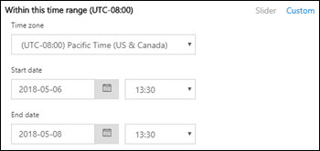

# Berichttracering in het Beveiligings- en compliancecentrumMessage trace in the Security & Compliance Center

[!INCLUDE [Microsoft 365 Defender rebranding](../includes/microsoft-defender-for-office.md)]

**Van toepassing op****Applies to**
- [Exchange Online ProtectionExchange Online Protection](exchange-online-protection-overview.md)
- [Abonnement 1 en abonnement 2 voor Microsoft Defender voor Office 365Microsoft Defender for Office 365 plan 1 and plan 2](defender-for-office-365.md)
- [Microsoft 365 DefenderMicrosoft 365 Defender](../defender/microsoft-365-defender.md)

Berichten traceren in het Beveiligings- & compliancecentrum volgt e-mailberichten terwijl ze door uw Exchange Online-organisatie reizen.Message trace in the Security & Compliance Center follows email messages as they travel through your Exchange Online organization. U kunt bepalen of een bericht is ontvangen, geweigerd, uitgesteld of bezorgd door de service.You can determine if a message was received, rejected, deferred, or delivered by the service. Ook wordt weergegeven welke acties zijn uitgevoerd op het bericht voordat het de uiteindelijke status heeft bereikt.It also shows what actions were taken on the message before it reached its final status.

U kunt de informatie uit bericht traceren gebruiken om gebruikersvragen efficiënt te beantwoorden over wat er met berichten is gebeurd, problemen met de e-mailstroom op te lossen en beleidswijzigingen te valideren.You can use the information from message trace to efficiently answer user questions about what happened to messages, troubleshoot mail flow issues, and validate policy changes.

## Wat moet u weten voordat u begint?What do you need to know before you begin?

- U moet lid zijn van de rollengroepen **Organisatiebeheer,** **Compliancebeheer** of **Helpdesk** in **Exchange Online** om bericht traceren te kunnen gebruiken.You need to be a member of the **Organization Management**, **Compliance Management** or **Help Desk** role groups in **Exchange Online** to use message trace. Zie [Machtigingen in Exchange Online](/exchange/permissions-exo/permissions-exo) voor meer informatie.For more information, see [Permissions in Exchange Online](/exchange/permissions-exo/permissions-exo).

  **Opmerkingen:** Lidmaatschap van de bijbehorende Azure Active Directory-rol in het Microsoft  365-beheercentrum biedt gebruikers de vereiste machtigingen en machtigingen voor andere functies in Microsoft 365.**Notes**: Membership in the corresponding Azure Active Directory role in the Microsoft 365 admin center gives users the required permissions _and_ permissions for other features in Microsoft 365. Zie[Over beheerdersrollen](../../admin/add-users/about-admin-roles.md) voor meer informatie.For more information, see [About admin roles](../../admin/add-users/about-admin-roles.md).

- Het maximum aantal berichten dat wordt weergegeven in de resultaten van een berichtspoor, is afhankelijk van het rapporttype dat u hebt geselecteerd (zie de sectie [Rapporttype](#choose-report-type) kiezen voor meer informatie).The maximum number of messages that are displayed in the results of a message trace depends on the report type you selected (see the [Choose report type](#choose-report-type) section for details). De [cmdlet Get-HistoricalSearch](/powershell/module/exchange/get-historicalsearch) in Exchange Online PowerShell of zelfstandige EOP PowerShell retourneert alle berichten in de resultaten.The [Get-HistoricalSearch](/powershell/module/exchange/get-historicalsearch) cmdlet in Exchange Online PowerShell or standalone EOP PowerShell returns all messages in the results.

## Bericht traceren openenOpen message trace

Open het Beveiligingscentrum & compliancecentrum op <https://protection.office.com/> en ga naar **E-mailstroombericht** \> **traceren.**Open the Security & Compliance Center at <https://protection.office.com/>, and then go to **Mail flow** \> **Message trace**.

Als u rechtstreeks naar de pagina **Bericht traceren wilt** gaan, opent u <https://protection.office.com/messagetrace> .To go directly to the **Message trace** page, open <https://protection.office.com/messagetrace>.

## Pagina Bericht tracerenMessage trace page

Vanaf hier kunt u een nieuwe standaard trace starten door op de **knop Een trace starten te** klikken.From here you can start a new default trace by clicking on the **Start a trace** button. Hiermee wordt gezocht naar alle berichten voor alle afzenders en geadresseerden van de afgelopen twee dagen.This will search for all messages for all senders and recipients for the last two days. U kunt ook een van de opgeslagen query's uit de beschikbare querycategorieën gebruiken en deze als uitgangspunt gebruiken voor uw eigen query's:Or you can use one of the stored queries from the available query categories and either run them as-is or use them as starting points for your own queries:

- **Standaardquery's:** Ingebouwde query's die worden geleverd door Microsoft 365.**Default queries**: Built-in queries provided by Microsoft 365.
- **Aangepaste query's:** query's die zijn opgeslagen door beheerders in uw organisatie voor toekomstig gebruik.**Custom queries**: Queries saved by admins in your organization for future use.
- **Automatisch opgeslagen query's:** de laatste tien laatst uitgevoerd query's.**Autosaved queries**: The last ten most recently run queries. Met deze lijst kunt u eenvoudig gaan waar u gebleven was.This list makes it simple to pick up where you left off.

Op deze pagina vindt u ook een sectie **Downloadbare** rapporten voor de aanvragen die u hebt ingediend, evenals de rapporten zelf wanneer er beschikbaar zijn om te downloaden.Also on this page is a **Downloadable reports** section for the requests you've submitted, as well as the reports themselves when they're are available for download.

## Opties voor een nieuw bericht tracerenOptions for a new message trace

### Filteren op afzenders en geadresseerdenFilter by senders and recipients

De standaardwaarden zijn **Alle afzenders en** **Alle** geadresseerden, maar u kunt de volgende velden gebruiken om de resultaten te filteren:The default values are **All senders** and **All recipients**, but you can use the following fields to filter the results:

- **Door deze personen:** Klik in dit veld om een of meer afzenders uit uw organisatie te selecteren.**By these people**: Click in this field to select one or more senders from your organization. U kunt ook een naam beginnen te typen en de items in de lijst worden gefilterd op wat u hebt getypt, net zoals een zoekpagina zich gedraagt.You can also start to type a name and the items in the list will be filtered by what you've typed, much like how a search page behaves.
- **Voor deze personen:** Klik in dit veld om een of meer geadresseerden in uw organisatie te selecteren.**To these people**: Click in this field to select one or more recipients in your organization.

> [!NOTE]
>
> - U kunt ook de e-mailadressen van externe afzenders en geadresseerden typen.You can also type the email addresses of external senders and recipients. Jokertekens worden ondersteund (bijvoorbeeld), maar u kunt niet meerdere jokertekens tegelijk in hetzelfde veld `*@contoso.com` gebruiken.Wildcards are supported (for example, `*@contoso.com`), but you can't use multiple wildcard entries in the same field at the same time.
> - U kunt meerdere afzenders of lijsten met geadresseerden plakken, gescheiden door puntkomma's ( `;` ).You can paste multiple senders or recipients lists separated by semicolons (`;`). spaties `\s` (), het rijtuig retourneert ( `\r` ) of de volgende lijnen ( `\n` ).spaces (`\s`), carriage returns (`\r`), or next lines (`\n`).

### TijdbereikTime range

De standaardwaarde is **2 dagen,** maar u kunt datum-/tijdbereiken opgeven van maximaal 90 dagen.The default value is **2 days**, but you can specify date/time ranges of up to 90 days. Wanneer u datum-/tijdbereiken gebruikt, moet u rekening houden met de volgende problemen:When you use date/time ranges, consider these issues:

- Standaard selecteert u het tijdbereik in de **schuifregelaarweergave** met een tijdregel.By default, you select the time range in **Slider** view using a time line. U kunt alleen de dag- of tijdinstellingen selecteren die worden weergegeven.You can only select the day or time settings that are displayed. Als u een tussenwaarde probeert te selecteren, wordt de start-/eindballon uitlijnen op de dichtstbijzijnde weergegeven instelling.Trying to select an in-between value will snap the start/end bubble to the nearest displayed setting.

  

  U kunt echter ook  overschakelen naar aangepaste weergave,  waar u de waarden **Begindatum** en  Einddatum (inclusief tijden) kunt opgeven en u ook de tijdzone voor het datum-/tijdbereik kunt selecteren.But, you can also switch to **Custom** view where you can specify the **Start date** and **End date** values (including times), and you can also select the **Time zone** for the date/time range. Houd er rekening **mee dat de instelling Tijdzone** van toepassing is op zowel de query-invoer als de queryresultaten.Note that the **Time zone** setting applies to both your query inputs and your query results.

  

  De resultaten zijn tien dagen of minder direct beschikbaar als **overzichtsrapport.**For 10 days or less, the results are available instantly as a **Summary** report. Als u een tijdsbereik opgeeft dat zelfs iets groter is dan 10 dagen, worden de resultaten vertraagd omdat ze alleen beschikbaar zijn als een downloadbaar CSV-bestand **(** Uitgebreide samenvatting of **Uitgebreide** rapporten).If you specify a time range that's even slightly greater than 10 days, the results will be delayed as they are only available as a downloadable CSV file ( **Enhanced summary** or **Extended** reports).

  Zie de sectie [Rapporttype](#choose-report-type) kiezen in dit artikel voor meer informatie over de verschillende rapporttypen.For more information about the different report types, see the [Choose report type](#choose-report-type) section in this article.

  > [!NOTE]
  > Uitgebreide overzichts- en uitgebreide rapporten worden voorbereid met behulp van gearchiveerde gegevens over bericht traceren en het kan enkele uren duren voordat uw rapport kan worden gedownload.Enhanced summary and Extended reports are prepared using archived message trace data, and it can take up to several hours before your report is available for download. Afhankelijk van het aantal andere beheerders dat ook rapportaanvragen rond dezelfde tijd heeft ingediend, ziet u mogelijk ook een vertraging voordat de verwerking wordt gestart voor uw in wachtrij geplaatste aanvraag.Depending on how many other admins have also submitted report requests around the same time, you might also notice a delay before processing starts for your queued request.

- Als u  een query opspart in de schuifregelaarweergave, wordt het relatieve tijdsbereik (bijvoorbeeld 3 dagen vanaf vandaag) op de balk op slaan.Saving a query in **Slider** view saves the relative time range (for example, 3 days from today). Als u een query **op** slaat in de aangepaste weergave, wordt het absolute datum-/tijdbereik op slaan (bijvoorbeeld 2018-05-06 13:00 tot 2018-05-08 18:00).Saving a query in **Custom** view saves the absolute date/time range (for example, 2018-05-06 13:00 to 2018-05-08 18:00).

### Meer zoekoptiesMore search options

#### BezorgingsstatusDelivery status

U kunt de standaardwaarde **Alles** geselecteerd laten of u kunt een van de volgende waarden selecteren om de resultaten te filteren:You can leave the default value **All** selected, or you can select one of the following values to filter the results:

- **Bezorgd:** het bericht is bezorgd op de gewenste bestemming.**Delivered**: The message was successfully delivered to the intended destination.
- **In** behandeling: De bezorging van het bericht wordt geprobeerd of opnieuw geprobeerd.**Pending**: Delivery of the message is being attempted or re-attempted.
- **Uitgebreid:** een geadresseerde van een distributiegroep is vóór de bezorging uitgebreid naar de afzonderlijke leden van de groep.**Expanded**: A distribution group recipient was expanded before delivery to the individual members of the group.
- **Mislukt:** het bericht is niet bezorgd.**Failed**: The message was not delivered.
- **In quarantaine** geplaatst: het bericht is in quarantaine geplaatst (als spam, bulkmail of phishing).**Quarantined**: The message was quarantined (as spam, bulk mail, or phishing). Zie In quarantaine geplaatste [e-mailberichten in EOP](quarantine-email-messages.md)voor meer informatie.For more information, see [Quarantined email messages in EOP](quarantine-email-messages.md).
- **Gefilterd als spam:** het bericht is geïdentificeerd als spam en is geweigerd of geblokkeerd (niet in quarantaine geplaatst).**Filtered as spam**: The message was identified spam, and was rejected or blocked (not quarantined).
- **Status verkrijgen:** Het bericht is onlangs ontvangen door Microsoft 365, maar er zijn nog geen andere statusgegevens beschikbaar.**Getting status:** The message was recently received by Microsoft 365, but no other status data is yet available. Over een paar minuten terug.Check back in a few minutes.

> [!NOTE]
> De waarden **In behandeling,** **Quarantaine** en Filteren als **spam** zijn alleen beschikbaar voor zoekopdrachten die minder dan 10 dagen duren.The values **Pending,** **Quarantined**, and **Filter as spam** are only available for searches less than 10 days. Er kan ook een vertraging van 5 tot 10 minuten zijn tussen de werkelijke en gerapporteerde bezorgingsstatus.Also, there might be a 5 to 10 minute delay between the actual and reported delivery status.

#### Bericht-idMessage ID

Dit is de internetbericht-id (ook wel client-id genoemd) die wordt gevonden in het veld **Bericht-id:** koptekst in de berichtkoptekst.This is the internet message ID (also known as the Client ID) that's found in the **Message-ID:** header field in the message header. Gebruikers kunnen u deze waarde geven om specifieke berichten te onderzoeken.Users can give you this value to investigate specific messages.

Deze waarde is constant voor de levensduur van het bericht.This value is constant for the lifetime of the message. Voor berichten die zijn gemaakt in Microsoft 365 of Exchange, is de waarde in de notatie , inclusief `<GUID@ServerFQDN>` de hoekhaken ( \< \> ).For messages created in Microsoft 365 or Exchange, the value is in the format `<GUID@ServerFQDN>`, including the angle brackets (\< \>). Bijvoorbeeld `<d9683b4c-127b-413a-ae2e-fa7dfb32c69d@DM3NAM06BG401.Eop-nam06.prod.protection.outlook.com>`.For example, `<d9683b4c-127b-413a-ae2e-fa7dfb32c69d@DM3NAM06BG401.Eop-nam06.prod.protection.outlook.com>`. In andere berichtensystemen kunnen verschillende syntaxis of waarden worden gebruikt.Other messaging systems might use different syntax or values. Deze waarde moet uniek zijn, maar niet alle e-mailsystemen voldoen strikt aan deze vereiste.This value is supposed to be unique, but not all email systems strictly follow this requirement. Als het **bericht-id:** koptekstveld niet bestaat of leeg is voor binnenkomende berichten uit externe bronnen, wordt een willekeurige waarde toegewezen.If the **Message-ID:** header field doesn't exist or is blank for incoming messages from external sources, an arbitrary value is assigned.

Wanneer u **Bericht-id gebruikt om** de resultaten te filteren, moet u de volledige tekenreeks opnemen, inclusief eventuele hoekhaken.When you use **Message ID** to filter the results, be sure to include the full string, including any angle brackets.

#### RichtingDirection

U kunt de standaardwaarde **Alles** geselecteerd laten, of u kunt **Inkomende** berichten (berichten die zijn verzonden naar geadresseerden in uw organisatie) of Uitgaande **(berichten** die zijn verzonden van gebruikers in uw organisatie) selecteren om de resultaten te filteren.You can leave the default value **All** selected, or you can select **Inbound** (messages sent to recipients in your organization) or **Outbound** (messages sent from users in your organization) to filter the results.

#### Oorspronkelijk IP-adres van clientOriginal client IP address

U kunt de resultaten op client-IP-adres opslaan om gehackte computers te onderzoeken die grote hoeveelheden spam of malware verzenden.You can filer the results by client IP address to investigate hacked computers that are sending large amounts of spam or malware. Hoewel de berichten mogelijk afkomstig zijn van meerdere afzenders, is het waarschijnlijk dat op dezelfde computer alle berichten worden gegenereerd.Although the messages might appear to come from multiple senders, it's likely that the same computer is generating all of the messages.

> [!NOTE]
> De IP-adresgegevens van de client zijn slechts 10 dagen beschikbaar  en zijn alleen beschikbaar in de **uitgebreide** samenvatting of uitgebreide rapporten (downloadbare CSV-bestanden).The client IP address information is only available for 10 days, and is only available in the **Enhanced summary** or **Extended** reports (downloadable CSV files).

### Rapporttype kiezenChoose report type

De beschikbare rapporttypen zijn:The available report types are:

- **Overzicht:** Beschikbaar als het tijdsbereik kleiner is dan 10 dagen en er geen extra filteropties nodig zijn.**Summary**: Available if the time range is less than 10 days, and requires no additional filtering options. De resultaten zijn vrijwel direct beschikbaar nadat u op **Zoeken hebt geklikt.**The results are available almost immediately after you click **Search**. Het rapport retourneert maximaal 20000 resultaten.The report returns up to 20000 results.
- **Uitgebreide** samenvatting of **Uitgebreid:** Deze rapporten zijn alleen beschikbaar als downloadbare CSV-bestanden en vereisen een of meer van de volgende filteropties, ongeacht het tijdsbereik: Door deze personen **,** Aan deze personen of **Bericht-id.****Enhanced summary** or **Extended**: These reports are only available as downloadable CSV files, and require one or more of the following filtering options regardless of the time range: **By these people**, **To these people**, or **Message ID**. U kunt jokertekens gebruiken voor de afzenders of geadresseerden (bijvoorbeeld \* @contoso.com).You can use wildcards for the senders or the recipients (for example, \*@contoso.com). Het uitgebreide overzichtsrapport retourneert maximaal 50000 resultaten.The Enhanced summary report returns up to 50000 results. Het rapport Uitgebreid retourneert maximaal 1000 resultaten.The Extended report returns up to 1000 results.

> [!NOTE]
>
> - Uitgebreide overzichts- en uitgebreide rapporten worden voorbereid met behulp van gearchiveerde gegevens over bericht traceren en het kan enkele uren duren voordat uw rapport kan worden gedownload.Enhanced summary and Extended reports are prepared using archived message trace data, and it can take up to several hours before your report is available to download. Afhankelijk van hoeveel andere beheerders rond dezelfde tijd ook rapportaanvragen hebben ingediend, ziet u mogelijk ook een vertraging voordat uw wachtrijaanvraag wordt verwerkt.Depending on how many other admins have also submitted report requests around the same time, you might also notice a delay before your queued request starts to be processed.
> - Hoewel u een uitgebreid overzicht of uitgebreid rapport kunt selecteren voor een datum-/tijdbereik, zijn meestal de laatste vier uur van gearchiveerde gegevens nog niet beschikbaar voor deze twee typen rapporten.While you can select an Enhanced summary or Extended report for any date/time range, commonly the last four hours of archived data will not yet be available for these two types of reports.
> - De maximale grootte voor een downloadbaar rapport is 500 MB.The maximum size for a downloadable report is 500 MB. Als een downloadbaar rapport meer dan 500 MB bedraagt, kunt u het rapport niet openen in Excel of Kladblok.If a downloadable report exceeds 500 MB, you can't open the report in Excel or Notepad.

Wanneer u op **Volgende** klikt, ziet u een overzichtspagina met de filteropties die u hebt geselecteerd, een unieke (bewerkbare) titel voor het rapport en het e-mailadres dat de melding ontvangt wanneer de bericht trace wordt voltooid (ook bewerkbaar en moet zich in een van de geaccepteerde domeinen van uw organisatie) plaatsen.When you click **Next**, you're presented with a summary page that lists the filtering options that you selected, a unique (editable) title for the report, and the email address that receives the notification when the message trace completes (also editable, and must be in one of your organization's accepted domains). Klik **op Rapport voorbereiden** om de berichtspoor te verzenden.Click **Prepare report** to submit the message trace. Op de **hoofdpagina Bericht** traceren ziet u de status van het rapport in de **sectie Downloadbare** rapporten.On the main **Message trace** page, you can see the status of the report in the **Downloadable reports** section.

Zie de volgende sectie voor meer informatie over de informatie die wordt geretourneerd in de verschillende rapporttypen.For more information about the information that's returned in the different report types, see the next section.

## Resultaten van bericht tracerenMessage trace results

De verschillende rapporttypen retourneren verschillende informatieniveaus.The different report types return different levels of information. De informatie die beschikbaar is in de verschillende rapporten, wordt beschreven in de volgende secties.The information that's available in the different reports is described in the following sections.

### Uitvoer overzichtsrapportSummary report output

Na het uitvoeren van de bericht trace worden de resultaten weergegeven, gesorteerd op aflopende datum/tijd (meest recente eerste).After running the message trace, the results will be listed, sorted by descending date/time (most recent first).

Het overzichtsrapport bevat de volgende informatie:The summary report contains the following information:

- **Datum:** De datum en tijd waarop het bericht is ontvangen door de service, met behulp van de geconfigureerde UTC-tijdzone.**Date**: The date and time at which the message was received by the service, using the configured UTC time zone.
- **Afzender:** het e-mailadres van de afzender @ *(aliasdomein).***Sender**: The email address of the sender (*alias*@*domain*).
- **Geadresseerde:** Het e-mailadres van de geadresseerde of geadresseerde.**Recipient**: The email address of the recipient or recipients. Voor een bericht dat naar meerdere geadresseerden wordt verzonden, is er één regel per geadresseerde.For a message sent to multiple recipients, there's one line per recipient. Als de geadresseerde een distributiegroep, dynamische distributiegroep of beveiligingsgroep met e-mail is, is de groep de eerste geadresseerde en staat elk lid van de groep op een aparte regel.If the recipient is a distribution group, dynamic distribution group, or mail-enabled security group, the group will be the first recipient, and then each member of the group is on a separate line.
- **Onderwerp:** De eerste 256 tekens van het veld **Onderwerp:** van het bericht.**Subject**: The first 256 characters of the message's **Subject:** field.
- **Status:** deze waarden worden beschreven in de [sectie Bezorgingsstatus.](#delivery-status)**Status**: These values are described in the [Delivery status](#delivery-status) section.

Standaard worden de eerste 250 resultaten geladen en direct beschikbaar.By default, the first 250 results are loaded and readily available. Wanneer u omlaag schuift, wordt er een kleine pauze in de volgende batch met resultaten geladen.When you scroll down, there's a slight pause as the next batch of results are loaded. In plaats van te schuiven, kunt u op **Alles laden** klikken om alle resultaten tot een maximum van 10.000 te laden.Instead of scrolling, you can click **Load all** to load all of the results up to a maximum of 10,000.

U kunt op de kolomkoppen klikken om de resultaten te sorteren op de waarden in die kolom in oplopende of aflopende volgorde.You can click on the column headers to sort the results by the values in that column in ascending or descending order.

U kunt op **Resultaten filteren klikken** om de resultaten te filteren op een of meer kolommen.You can click **Filter results** to filter the results by one or more columns.

U kunt de resultaten exporteren nadat u een of  meer rijen hebt geselecteerd door op Resultaten exporteren te klikken en vervolgens Alle resultaten **exporteren,** Geladen resultaten exporteren of Exporteren geselecteerd **te selecteren.**You can export the results after you've selected one or more rows by clicking **Export results** and then selecting **Export all results**, **Export loaded results**, or **Export selected**.

#### Gerelateerde records zoeken voor dit berichtFind related records for this message

Gerelateerde berichtenrecords zijn records die dezelfde bericht-id hebben gedeeld.Related message records are records that shared the same Message ID. Zelfs één bericht dat tussen twee personen is verzonden, kan meerdere records genereren.Remember, even a single message sent between two people can generate multiple records. Het aantal records neemt toe wanneer het bericht wordt beïnvloed door uitbreiding van distributiegroep, doorsturen, regels voor e-mailstroom (ook wel transportregels genoemd), enzovoort.The number of records increases when the message is affected by distribution group expansion, forwarding, mail flow rules (also known as transport rules), etc.

Nadat u het selectievakje van een rij hebt geselecteerd, kunt u  gerelateerde records voor het bericht  zoeken door te klikken op de knop Gerelateerde zoeken die wordt weergegeven of door Meer opties te selecteren Meer gerelateerde records zoeken voor  \> **bericht**).After you select a row's check box, you can find related records for the message by clicking the **Find related** button that appears, or by selecting **More options**  \> **Find related records for this message**).

Zie de sectie Bericht-id eerder in dit artikel voor meer informatie over de bericht-id.For more information about the Message ID, see the Message ID section earlier in this article.

#### Details van bericht tracerenMessage trace details

In de uitvoer van het overzichtsrapport kunt u de details van een bericht bekijken met behulp van een van de volgende methoden:In the summary report output, you can view details about a message by using either of the following methods:

- Selecteer de rij (klik ergens in de rij behalve het selectievakje).Select the row (click anywhere in the row except the check box).
- Schakel het selectievakje van de rij in en klik op **Meer opties** Meer informatie  \> **weergeven.**Select the row's check box and click **More options**  \> **View message details**.

   

De details van de berichtspoorgegevens bevatten de volgende aanvullende informatie die niet aanwezig is in het overzichtsrapport:The message trace details contain the following additional information that's not present in the summary report:

- **Berichtgebeurtenissen:** deze sectie bevat classificaties die helpen bij het categoriseren van de acties die de service op berichten uitdeelt.**Message events**: This section contains classifications that help categorize the actions that the service takes on messages. **Enkele van de interessantere gebeurtenissen** die u mogelijk tegenkomt, zijn:**Some of the more interesting events** that you might encounter are:
  - **Ontvangen:** Het bericht is ontvangen door de service.**Receive**: The message was received by the service.
  - **Verzenden:** Het bericht is verzonden door de service.**Send**: The message was sent by the service.
  - **Mislukt:** het bericht kan niet worden bezorgd.**Fail**: The message failed to be delivered.
  - **Bezorgen:** Het bericht is bezorgd in een postvak.**Deliver**: The message was delivered to a mailbox.
  - Uitvv:Het bericht is verzonden naar een distributiegroep die is uitgebreid.**Expand**: The message was sent to a distribution group that was expanded.
  - **Overdracht:** Geadresseerden zijn verplaatst naar een bericht met een bifurcated bericht vanwege inhoudsconversie, limieten voor geadresseerden van berichten of agenten.**Transfer**: Recipients were moved to a bifurcated message because of content conversion, message recipient limits, or agents.
  - **Uitstel**: De bezorging van het bericht is uitgesteld en kan later opnieuw worden geprobeerd.**Defer**: The message delivery was postponed and might be re-attempted later.
  - **Opgelost:** het bericht is omgeleid naar een nieuw adres van de geadresseerde op basis van een Active Directory-zoekbericht.**Resolved**: The message was redirected to a new recipient address based on an Active Directory look up. Wanneer dit gebeurt, wordt het oorspronkelijke adres van de geadresseerde weergegeven in een aparte rij in het berichtspoor, samen met de uiteindelijke bezorgingsstatus voor het bericht.When this happens, the original recipient address is listed in a separate row in the message trace along with the final delivery status for the message.

  > [!NOTE]
  >
  > - Een onregelmatig bericht dat is bezorgd, genereert meerdere **gebeurtenisgegevens** in de berichtspoor.An uneventful message that's successfully delivered will generate multiple **Event** entries in the message trace.
  > - Deze lijst is niet bedoeld om volledig te zijn.This list is not meant to be exhaustive. Zie Gebeurtenistypen in het logboek voor het bijhouden [van berichten voor beschrijvingen van meer gebeurtenissen.](/Exchange/mail-flow/transport-logs/message-tracking#event-types-in-the-message-tracking-log)For descriptions of more events, see [Event types in the message tracking log](/Exchange/mail-flow/transport-logs/message-tracking#event-types-in-the-message-tracking-log). Houd er rekening mee dat deze koppeling een Exchange Server-onderwerp (on-premises Exchange) is.Note that this link is an Exchange Server (on-premises Exchange) topic.

- **Meer informatie:** Deze sectie bevat de volgende details:**More information**: This section contains the following details:
  - **Bericht-id:** deze waarde wordt beschreven in de [sectie Bericht-id](#message-id) eerder in dit artikel.**Message ID**: This value is described in the [Message ID](#message-id) section earlier in this article. Bijvoorbeeld `<d9683b4c-127b-413a-ae2e-fa7dfb32c69d@DM3NAM06BG401.Eop-nam06.prod.protection.outlook.com>`.For example, `<d9683b4c-127b-413a-ae2e-fa7dfb32c69d@DM3NAM06BG401.Eop-nam06.prod.protection.outlook.com>`.
  - **Berichtgrootte****Message size**
  - **Van IP:** het IP-adres van de computer die het bericht heeft verzonden.**From IP**: The IP address of the computer that sent the message. Voor uitgaande berichten die vanuit Exchange Online worden verzonden, is deze waarde leeg.For outbound messages sent from Exchange Online, this value is blank.
  - **Ip:** het IP-adres of de adressen waarop de service het bericht heeft geprobeerd te bezorgen.**To IP**: The IP address or addresses where the service attempted to deliver the message. Als het bericht meerdere geadresseerden heeft, worden deze weergegeven.If the message has multiple recipients, these are displayed. Voor binnenkomende berichten die naar Exchange Online worden verzonden, is deze waarde leeg.For inbound messages sent to Exchange Online, this value is blank.

### Uitgebreide overzichtsrapportenEnhanced summary reports

Beschikbare (voltooide) Uitgebreide overzichtsrapporten zijn beschikbaar in de sectie **Downloadbare** rapporten aan het begin van de bericht trace.Available (completed) Enhanced summary reports are available in the **Downloadable reports** section at the beginning message trace. De volgende informatie is beschikbaar in het rapport:The following information is available in the report:

- **origin_timestamp:** De datum en tijd waarop het bericht in eerste instantie door de service is ontvangen, met behulp van de \* geconfigureerde UTC-tijdzone.**origin_timestamp**\*: The date and time when the message was initially received by the service, using the configured UTC time zone.
- **sender_address**: Het e-mailadres van de afzender @ *(aliasdomein).***sender_address**: The sender's email address (*alias*@*domain*).
- **Recipient_status**: De status van de bezorging van het bericht aan de geadresseerde.**Recipient_status**: The status of the delivery of the message to the recipient. Als het bericht naar meerdere geadresseerden is verzonden, worden alle geadresseerden en de bijbehorende status voor elk bericht weergegeven in de indeling: \<*email address*\> ## \<*status*\> .If the message was sent to multiple recipients, it will show all the recipients and the corresponding status for each, in the format: \<*email address*\>##\<*status*\>. Bijvoorbeeld:For example:
  - **##Receive: Verzenden** betekent dat het bericht is ontvangen door de service en naar de beoogde bestemming is verzonden.**##Receive, Send** means the message was received by the service and was sent to the intended destination.
  - **##Receive, Mislukt** betekent dat het bericht is ontvangen door de service, maar dat de bezorging naar de beoogde bestemming is mislukt.**##Receive, Fail** means the message was received by the service but delivery to the intended destination failed.
  - **##Receive betekent Leveren** dat het bericht is ontvangen door de service en is bezorgd in het postvak van de geadresseerde.**##Receive, Deliver** means the message was received by the service and was delivered to the recipient's mailbox.
- **message_subject:** De eerste 256 tekens van het veld Onderwerp van **het** bericht.**message_subject**: The first 256 characters of the message's **Subject** field.
- **total_bytes:** De grootte van het bericht in bytes, inclusief bijlagen.**total_bytes**: The size of the message in bytes, including attachments.
- **message_id:** Deze waarde wordt beschreven in de sectie [Bericht-id](#message-id) eerder in dit artikel.**message_id**: This value is described in the [Message ID](#message-id) section earlier in this article. Bijvoorbeeld `<d9683b4c-127b-413a-ae2e-fa7dfb32c69d@DM3NAM06BG401.Eop-nam06.prod.protection.outlook.com>`.For example, `<d9683b4c-127b-413a-ae2e-fa7dfb32c69d@DM3NAM06BG401.Eop-nam06.prod.protection.outlook.com>`.
- **network_message_id:** een unieke bericht-id-waarde die blijft bestaan in alle exemplaren van het bericht die mogelijk worden gemaakt als gevolg van de uitbreiding van de distributiegroep.**network_message_id**: A unique message ID value that persists across all copies of the message that might be created due to bifurcation or distribution group expansion. Een voorbeeldwaarde is `1341ac7b13fb42ab4d4408cf7f55890f` .An example value is `1341ac7b13fb42ab4d4408cf7f55890f`.
- **original_client_ip**: Het IP-adres van de client van de afzender.**original_client_ip**: The IP address of the sender's client.
- **directionaliteit:** geeft aan of het bericht binnenkomende (1) naar uw organisatie is verzonden of dat het uitgaande bericht (2) vanuit uw organisatie is verzonden.**directionality**: Indicates whether the message was sent inbound (1) to your organization, or whether it was sent outbound (2) from your organization.
- **connector_id:** De naam van de bron- of doelconnector.**connector_id**: The name of the source or destination connector. Zie E-mailstroom configureren met [connectors in Office 365](/Exchange/mail-flow-best-practices/use-connectors-to-configure-mail-flow/use-connectors-to-configure-mail-flow)voor meer informatie over verbindingslijnen in Exchange Online.For more information about connectors in Exchange Online, see [Configure mail flow using connectors in Office 365](/Exchange/mail-flow-best-practices/use-connectors-to-configure-mail-flow/use-connectors-to-configure-mail-flow).
- **delivery_priority:** \* Of het bericht is verzonden met **hoge,** **lage** of **normale** prioriteit.**delivery_priority**\*: Whether the message was sent with **High**, **Low**, or **Normal** priority.

\* Deze eigenschappen zijn alleen beschikbaar in uitgebreide overzichtsrapporten.\* These properties are only available in Enhanced summary reports.

### Uitgebreide rapportenExtended reports

Beschikbare (voltooide) uitgebreide rapporten zijn beschikbaar in de sectie **Downloadbare rapporten** aan het begin van berichtspoor.Available (completed) Extended reports are available in the **Downloadable reports** section at the beginning of message trace. Vrijwel alle informatie uit een uitgebreid overzichtsrapport is beschikbaar in een uitgebreid rapport (met uitzondering van origin_timestamp **en** **delivery_priority).**Virtually all of the information from an Enhanced summary report is available in an Extended report (with the exception of **origin_timestamp** and **delivery_priority**). De volgende aanvullende informatie is alleen beschikbaar in een uitgebreid rapport:The following additional information is only available in an Extended report:

- **client_ip:** het IP-adres van de e-mailserver of berichtenclient die het bericht heeft verzonden.**client_ip**: The IP address of the email server or messaging client that submitted the message.
- **client_hostname:** De hostnaam of FQDN van de e-mailserver of berichtenclient die het bericht heeft verzonden.**client_hostname**: The host name or FQDN of the email server or messaging client that submitted the message.
- **server_ip**: Het IP-adres van de bron- of doelserver.**server_ip**: The IP address of the source or destination server.
- **server_hostname**: De hostnaam of FQDN van de doelserver.**server_hostname**: The host name or FQDN of the destination server.
- **source_context:** Extra informatie die is gekoppeld aan het **bronveld.****source_context**: Extra information associated with the **source** field. Bijvoorbeeld:For example:
  - `Protocol Filter Agent`
  - `3489061114359050000`
- **bron:** het Exchange Online-onderdeel dat verantwoordelijk is voor de gebeurtenis.**source**: The Exchange Online component that's responsible for the event. Bijvoorbeeld:For example:
  - `AGENT`
  - `MAILBOXRULE`
  - `SMTP`
- **event_id:** Deze komen overeen met de **waarden voor berichtgebeurtenissen** die worden uitgelegd in de sectie Gerelateerde [records zoeken voor dit bericht.](#find-related-records-for-this-message)**event_id**: These correspond to the **Message event** values that are explained in the [Find related records for this message](#find-related-records-for-this-message) section.
- **internal_message_id:** een berichtaanduiding die is toegewezen door de Exchange Online-server die het bericht momenteel verwerkt.**internal_message_id**: A message identifier that's assigned by the Exchange Online server that's currently processing the message.
- **recipient_address:** De e-mailadressen van de geadresseerden van het bericht.**recipient_address**: The email addresses of the message's recipients. Meerdere e-mailadressen worden gescheiden door het puntkommateken (;).Multiple email addresses are separated by the semicolon character (;).
- **recipient_count:** Het totale aantal geadresseerden in het bericht.**recipient_count**: The total number of recipients in the message.
- **related_recipient_address:** Gebruikt met , en gebeurtenissen om andere e-mailadressen van geadresseerden weer te geven `EXPAND` die aan het bericht zijn `REDIRECT` `RESOLVE` gekoppeld.**related_recipient_address**: Used with `EXPAND`, `REDIRECT`, and `RESOLVE` events to display other recipient email addresses that are associated with the message.
- **verwijzing**: Dit veld bevat aanvullende informatie voor specifieke typen gebeurtenissen.**reference**: This field contains additional information for specific types of events. Bijvoorbeeld:For example:
  - **DSN:** bevat de rapportkoppeling, de message_id-waarde van de bijbehorende melding over de bezorgingsstatus (ook wel een DSN-, niet-bezorgingsrapport, **NDR- of** bouncebericht genoemd) als er na deze gebeurtenis een DSN wordt gegenereerd.**DSN**: Contains the report link, which is the **message_id** value of the associated delivery status notification (also known as a DSN, non-delivery report, NDR, or bounce message) if a DSN is generated subsequent to this event. Als dit een DSN-bericht is, bevat dit veld de message_id van het oorspronkelijke bericht waar de DSN voor is gegenereerd. If this is a DSN message, this field contains the **message_id** value of the original message that the DSN was generated for.
  - **UITV:Bevat** **de related_recipient_address** van de gerelateerde berichten.**EXPAND**: Contains the **related_recipient_address** value of the related messages.
  - **ONTVANGEN**: Kan de **message_id** van het gerelateerde bericht bevatten als het bericht is gegenereerd door andere processen (bijvoorbeeld regels voor Postvak IN).**RECEIVE**: Might contain the **message_id** value of the related message if the message was generated by other processes (for example, Inbox rules).
  - **VERZENDEN:** bevat **de internal_message_id** waarde van alle DSN-berichten.**SEND**: Contains the **internal_message_id** value of any DSN messages.
  - **OVERDRACHT:** bevat **de internal_message_id** waarde van het bericht dat wordt gevorkt (bijvoorbeeld door inhoudsconversie, limieten voor geadresseerden van berichten of agenten).**TRANSFER**: Contains the **internal_message_id** value of the message that's being forked (for example, by content conversion, message recipient limits, or agents).
  - **POSTVAKREGEL:** bevat **de internal_message_id** waarde van het binnenkomende bericht waardoor de regel Postvak IN het uitgaande bericht heeft gegenereerd.**MAILBOXRULE**: Contains the **internal_message_id** value of the inbound message that caused the Inbox rule to generate the outbound message. Voor andere typen gebeurtenissen is dit veld meestal leeg.For other types of events, this field is usually blank.
- **return_path:** het e-mailadres retourneert dat is opgegeven door de **opdracht MAIL FROM** die het bericht heeft verzonden.**return_path**: The return email address specified by the **MAIL FROM** command that sent the message. Hoewel dit veld nooit leeg is, kan de adreswaarde van de null-afzender worden weergegeven als `<>` .Although this field is never empty, it can have the null sender address value represented as `<>`.
- **message_info:** Aanvullende informatie over het bericht.**message_info**: Additional information about the message. Bijvoorbeeld:For example:
  - De datum-tijd van de bericht origination in UTC `DELIVER` voor en `SEND` gebeurtenissen.The message origination date-time in UTC for `DELIVER` and `SEND` events. De origination date-time is de tijd waarop het bericht voor het eerst de Exchange Online-organisatie heeft ingevoerd.The origination date-time is the time when the message first entered the Exchange Online organization. De UTC-datum-tijd wordt weergegeven in de datum-tijdnotatie ISO 8601: , waarbij = jaar, = maand, = dag, het begin van de tijdcomponent `yyyy-mm-ddThh:mm:ss.fffZ` `yyyy` `mm` `dd` `T` aangeeft, `hh` = uur, `mm` = minuut, = tweede, `ss` = `fff` `Z` `Zulu` breuken van een seconde, en betekent , wat een andere manier is om UTC aan te duiden.The UTC date-time is represented in the ISO 8601 date-time format: `yyyy-mm-ddThh:mm:ss.fffZ`, where `yyyy` = year, `mm` = month, `dd` = day, `T` indicates the beginning of the time component, `hh` = hour, `mm` = minute, `ss` = second, `fff` = fractions of a second, and `Z` signifies `Zulu`, which is another way to denote UTC.
  - Verificatiefouten.Authentication errors. U ziet bijvoorbeeld de waarde en het type verificatie dat is gebruikt `11a` toen de verificatiefout plaatsvond.For example, you might see the value `11a` and the type of authentication that was used when the authentication error occurred.
- **tenant_id:** een GUID-waarde die de Exchange Online-organisatie vertegenwoordigt `39238e87-b5ab-4ef6-a559-af54c6b07b42` (bijvoorbeeld).**tenant_id**: A GUID value that represents the Exchange Online organization (for example, `39238e87-b5ab-4ef6-a559-af54c6b07b42`).
- **original_server_ip:** Het IP-adres van de oorspronkelijke server.**original_server_ip**: The IP address of the original server.
- **custom_data:** bevat gegevens die betrekking hebben op specifieke gebeurtenistypen.**custom_data**: Contains data related to specific event types. Zie de volgende secties voor meer informatie.For more information, see the following sections.

#### custom_data waardencustom_data values

Het **custom_data** veld voor een gebeurtenis wordt door verschillende `AGENTINFO` Exchange Online-agenten gebruikt om gegevens over berichtverwerking te logboeken.The **custom_data** field for an `AGENTINFO` event is used by a variety of Exchange Online agents to log message processing details. Enkele van de interessantere agenten worden in de volgende secties beschreven.Some of the more interesting agents are described in the following sections.

#### SpamfilteragentSpam filter agent

Een **custom_data** die begint met `S:SFA` is afkomstig van de spamfilteragent.A **custom_data** value that starts with `S:SFA` is from the spam filter agent. De belangrijkste details worden in de volgende tabel beschreven:The key details are described in the following table:

 

****

|WaardeValue|OmschrijvingDescription|
|---|---|
|`SFV=NSPM`|Het bericht is gemarkeerd als niet-spam en is verzonden naar de beoogde geadresseerden.The message was marked as non-spam and was sent to the intended recipients.|
|`SFV=SPM`|Het bericht is gemarkeerd als spam door antispamfiltering (ook wel inhoudsfilter genoemd).The message was marked as spam by anti-spam filtering (also known as content filtering).|
|`SFV=BLK`|Filteren is overgeslagen en het bericht is geblokkeerd omdat het afkomstig is van een geblokkeerde afzender.Filtering was skipped and the message was blocked because it originated from a blocked sender.|
|`SFV=SKS`|Het bericht is gemarkeerd als spam voordat het werd verwerkt door antispamfilters.The message was marked as spam prior to being processed by anti-spam filtering. Dit geldt ook voor berichten waarin het bericht een e-mailstroomregel (ook wel een transportregel genoemd) koppelt om het automatisch te markeren als spam en alle extra filtering te omzeilen.This includes messages where the message matched a mail flow rule (also known as a transport rule) to automatically mark it as spam and bypass all additional filtering.|
|`SCL=<number>`|Zie Betrouwbaarheidsniveaus voor spam voor meer informatie over de verschillende SCL-waarden en wat [ze betekenen.](spam-confidence-levels.md)For more information about the different SCL values and what they mean, see [Spam confidence levels](spam-confidence-levels.md).|
|`PCL=<number>`|De pcl-waarde (Phishing Confidence Level) van het bericht.The Phishing Confidence Level (PCL) value of the message. Deze kunnen op dezelfde manier worden geïnterpreteerd als de SCL-waarden die zijn gedocumenteerd in [de betrouwbaarheidsniveaus van spam.](spam-confidence-levels.md)These can be interpreted the same way as the SCL values documented in [Spam confidence levels](spam-confidence-levels.md).|
|`DI=SB`|De afzender van het bericht is geblokkeerd.The sender of the message was blocked.|
|`DI=SQ`|Het bericht is in quarantaine geplaatst.The message was quarantined.|
|`DI=SD`|Het bericht is verwijderd.The message was deleted.|
|`DI=SJ`|Het bericht is verzonden naar de map Ongewenste e-mail van de geadresseerde.The message was sent to the recipient's Junk Email folder.|
|`DI=SN`|Het bericht is gerouteerd via de normale groep uitgaande bezorging.The message was routed through the normal outbound delivery pool.|
|`DI=SO`|Het bericht is door de groep met hogere risico's gestuurd.The message was routed through the higher risk delivery pool. Zie Risicovolle [bezorgingsgroep voor](high-risk-delivery-pool-for-outbound-messages.md)uitgaande berichten voor meer informatie.For more information, see [High-risk delivery pool for outbound messages](high-risk-delivery-pool-for-outbound-messages.md).|
|`SFS=[a]|SFS=[b]`|Dit geeft aan dat spamregels zijn afgestemd.This denotes that spam rules were matched.|
|`IPV=CAL`|Het bericht is toegestaan via de spamfilters omdat het IP-adres is opgegeven in een lijst met IP-toestaan in het verbindingsfilter.The message was allowed through the spam filters because the IP address was specified in an IP Allow list in the connection filter.|
|`H=<EHLOstring>`|De HELO- of EHLO-tekenreeks van de verbindende e-mailserver.The HELO or EHLO string of the connecting email server.|
|`PTR=<ReverseDNS>`|De PTR-record van het verzendende IP-adres, ook wel het omgekeerde DNS-adres genoemd.The PTR record of the sending IP address, also known as the reverse DNS address.|
|

Een voorbeeld **custom_data** waarde voor een bericht dat is gefilterd op spam als dit:An example **custom_data** value for a message that's filtered for spam like this:

`S:SFA=SUM|SFV=SPM|IPV=CAL|SRV=BULK|SFS=470454002|SFS=349001|SCL=9|SCORE=-1|LIST=0|DI=SN|RD=ftmail.inc.com|H=ftmail.inc.com|CIP=98.129.140.74|SFP=1501|ASF=1|CTRY=US|CLTCTRY=|LANG=en|LAT=287|LAT=260|LAT=18;`

#### MalwarefilteragentMalware filter agent

Een **custom_data** waarde die begint met `S:AMA` is afkomstig van de malwarefilteragent.A **custom_data** value that starts with `S:AMA` is from the malware filter agent. De belangrijkste details worden in de volgende tabel beschreven:The key details are described in the following table:

 

****

|WaardeValue|OmschrijvingDescription|
|---|---|
|`AMA=SUM|v=1|` of `AMA=EV|v=1``AMA=SUM|v=1|` or `AMA=EV|v=1`|Het bericht is vastgesteld dat het malware bevat.The message was determined to contain malware. `SUM` geeft aan dat de malware kan zijn gedetecteerd door een aantal engines.`SUM` indicates the malware could've been detected by any number of engines. `EV` geeft aan dat de malware is gedetecteerd door een specifieke engine.`EV` indicates the malware was detected by a specific engine. Wanneer malware wordt gedetecteerd door een engine, worden de volgende acties veroorzaakt.When malware is detected by an engine this triggers the subsequent actions.|
|`Action=r`|Het bericht is vervangen.The message was replaced.|
|`Action=p`|Het bericht is overgeslagen.The message was bypassed.|
|`Action=d`|Het bericht is uitgesteld.The message was deferred.|
|`Action=s`|Het bericht is verwijderd.The message was deleted.|
|`Action=st`|Het bericht is overgeslagen.The message was bypassed.|
|`Action=sy`|Het bericht is overgeslagen.The message was bypassed.|
|`Action=ni`|Het bericht is geweigerd.The message was rejected.|
|`Action=ne`|Het bericht is geweigerd.The message was rejected.|
|`Action=b`|Het bericht is geblokkeerd.The message was blocked.|
|`Name=<malware>`|De naam van de malware die is gedetecteerd.The name of the malware that was detected.|
|`File=<filename>`|De naam van het bestand met de malware.The name of the file that contained the malware.|
|

Een voorbeeld **custom_data** waarde voor een bericht dat malware bevat, ziet er als volgende uit:An example **custom_data** value for a message that contains malware looks like this:

`S:AMA=SUM|v=1|action=b|error=|atch=1;S:AMA=EV|engine=M|v=1|sig=1.155.974.0|name=DOS/Test_File|file=filename;S:AMA=EV|engine=A|v=1|sig=201707282038|name=Test_File|file=filename`

#### TransportregelagentTransport Rule agent

Een **custom_data** waarde die begint met is afkomstig van de `S:TRA` transportregelagent voor e-mailstroomregels (ook wel transportregels genoemd).A **custom_data** value that starts with`S:TRA` is from the Transport Rule agent for mail flow rules (also known as transport rules). De belangrijkste details worden in de volgende tabel beschreven:The key details are described in the following table:

 

****

|WaardeValue|OmschrijvingDescription|
|---|---|
|`ETR|ruleId=<guid>`|De regel-id die is overeenkomen.The rule ID that was matched.|
|`St=<datetime>`|De datum en tijd in UTC wanneer de regel overeenkomst heeft plaatsgevonden.The date and time in UTC when the rule match occurred.|
|`Action=<ActionDefinition>`|De actie die is toegepast.The action that was applied. Zie Acties voor [e-mailstroomregelen in Exchange Online](/exchange/security-and-compliance/mail-flow-rules/mail-flow-rule-actions)voor een lijst met beschikbare acties.For a list of available actions, see [Mail flow rule actions in Exchange Online](/exchange/security-and-compliance/mail-flow-rules/mail-flow-rule-actions).|
|`Mode=<Mode>`|De modus van de regel.The mode of the rule. Geldige waarden zijn:Valid values are:<ul><li>**Afdwingen:** Alle acties op de regel worden afgedwongen.**Enforce**: All actions on the rule will be enforced.</li><li>**Test met beleidstips:** Alle acties voor beleidstips worden verzonden, maar andere handhavingsacties worden niet uitgevoerd.**Test with Policy Tips:**: Any Policy Tip actions will be sent, but other enforcement actions will not be acted on.</li><li>**Test zonder beleidstips:** acties worden weergegeven in een logboekbestand, maar afzenders worden op geen enkele manier op de hoogte gesteld en er wordt geen actie ondernomen.**Test without Policy Tips**: Actions will be listed in a log file, but senders will not be notified in any way, and enforcement actions will not be acted on.</li></ul>|
|

Een voorbeeld **custom_data** waarde voor berichten die overeenkomt met de voorwaarden van een e-mailstroomregel, ziet er als volgende uit:An example **custom_data** value for a messages that matches the conditions of a mail flow rule looks like this:

`S:TRA=ETR|ruleId=19a25eb2-3e43-4896-ad9e-47b6c359779d|st=7/17/2017 12:31:25 AM|action=ApplyHtmlDisclaimer|sev=1|mode=Enforce`
