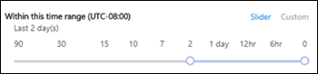

# Berichttracering in het Beveiligings- en compliancecentrumMessage trace in the Security & Compliance Center

## Functies voor bericht traceringMessage trace features

Bericht tracering in het beveiligings & compliance volgen worden e-mailberichten verzonden wanneer ze worden verzonden via uw Exchange Online-organisatie.Message trace in the Security & Compliance Center follows email messages as they travel through your Exchange Online organization. U kunt bepalen of een bericht is ontvangen, afgewezen, uitgesteld of geleverd door de service.You can determine if a message was received, rejected, deferred, or delivered by the service. Ook ziet u welke acties zijn uitgevoerd op het bericht voordat het de definitieve status bereikte.It also shows what actions were taken on the message before it reached its final status.

Bericht tracering in het nalevings centrum voor beveiliging & verbetert de oorspronkelijke bericht tracering die beschikbaar is in het Exchange Admin Center (SBV).Message trace in the Security & Compliance Center improves upon the original message trace that was available in the Exchange admin center (EAC). U kunt de gegevens van de bericht tracering gebruiken om op efficiënte wijze vragen van gebruikers te beantwoorden over wat er is gebeurd met berichten, problemen met de e-mail stroom oplossen en beleidswijzigingen valideren.You can use the information from message trace to efficiently answer user questions about what happened to messages, troubleshoot mail flow issues, and validate policy changes.

> [!NOTE]
>
> - Als u een bericht tracering wilt uitvoeren, moet u lid zijn van de rollen groepen Organisatiebeheer, Compliance Management of Help Desk.To do a message trace, you need to be a member of the Organization Management, Compliance Management or Help Desk role groups. Zie [Machtigingen in het Beveiligings- & compliancecentrum](permissions-in-the-security-and-compliance-center.md) voor meer informatie.For more information, see [Permissions in the Security & Compliance Center](permissions-in-the-security-and-compliance-center.md).
>
> - De maximale hoeveelheid berichten die in de resultaten worden weergegeven, is afhankelijk van het type rapport dat u hebt geselecteerd (Zie de sectie [Rapporttype kiezen](#choose-report-type) voor meer informatie).The maximum number of messages that are displayed in the results depends on the report type you selected (see the [Choose report type](#choose-report-type) section for details). Met de cmdlet [Get-HistoricalSearch](https://docs.microsoft.com/powershell/module/exchange/get-historicalsearch) in Exchange Online PowerShell of zelfstandige EOP PowerShell worden alle berichten in de resultaten als resultaat gegeven.The [Get-HistoricalSearch](https://docs.microsoft.com/powershell/module/exchange/get-historicalsearch) cmdlet in Exchange Online PowerShell or standalone EOP PowerShell returns all messages in the results.

## Bericht tracering openenOpen message trace

1. Open het beveiligings & nalevings centrum op <https://protection.office.com> .Open the Security & Compliance Center at <https://protection.office.com>.

2. Vouw de **e-mail stroom**uit en selecteer vervolgens **bericht traceren**.Expand **Mail flow**, and then select **Message trace**.

## Pagina bericht tracerenMessage trace page

Van hieruit kunt u een nieuwe standaardtracering starten door te klikken op de knop **een spoor starten** .From here you can start a new default trace by clicking on the **Start a trace** button. Hiermee wordt gezocht naar alle berichten voor alle afzenders en geadresseerden voor de afgelopen twee dagen.This will search for all messages for all senders and recipients for the last two days. U kunt ook een van de opgeslagen query's uit de beschikbare query categorieën gebruiken en deze vervolgens als uitgangspunt gebruiken als uitgangspunt voor uw eigen query's:Or you can use one of the stored queries from the available query categories and either run them as-is or use them as starting points for your own queries:

- **Standaardquery's**: ingebouwde Query's van microsoft 365.**Default queries**: Built-in queries provided by Microsoft 365.

- **Aangepaste query's**: query's die zijn opgeslagen door beheerders in uw organisatie voor toekomstig gebruik.**Custom queries**: Queries saved by admins in your organization for future use.

- Voor het uitvoeren van **query's die niet zijn opgeslagen**: de laatste tien meest recente query's.**Autosaved queries**: The last ten most recently run queries. In deze lijst kunt u eenvoudig verdergaan waar u gebleven was.This list makes it simple to pick up where you left off.

Op deze pagina vindt u een sectie met **downloadbare rapporten** voor de verzoeken die u hebt ingediend, en de rapporten zelf wanneer ze kunnen worden gedownload.Also on this page is a **Downloadable reports** section for the requests you've submitted, as well as the reports themselves when they're are available for download.

## Opties voor een nieuwe bericht traceringOptions for a new message trace

### Filteren op afzenders en geadresseerdenFilter by senders and recipients

De standaardwaarden zijn **alle afzenders** en **alle geadresseerden**, maar u kunt de volgende velden gebruiken om de resultaten te filteren:The default values are **All senders** and **All recipients**, but you can use the following fields to filter the results:

- **Door deze personen**: Klik in dit veld om een of meer afzenders van uw organisatie te selecteren.**By these people**: Click in this field to select one or more senders from your organization. U kunt ook een naam typen en de items in de lijst worden gefilterd door wat u hebt getypt, net zoals een zoekpagina.You can also start to type a name and the items in the list will be filtered by what you've typed, much like how a search page behaves.

- **Voor deze personen**: Klik in dit veld om een of meer geadresseerden in uw organisatie te selecteren.**To these people**: Click in this field to select one or more recipients in your organization.

> [!NOTE]
> U kunt ook de e-mailadressen van externe afzenders en geadresseerden typen.You can also type the email addresses of external senders and recipients. Jokertekens worden ondersteund (bijvoorbeeld `*@contoso.com` ), maar u kunt niet meerdere jokertekens gebruiken in hetzelfde veld.Wildcards are supported (for example, `*@contoso.com`), but you can't use multiple wildcard entries in the same field at the same time.    U kunt meerdere lijsten van afzenders of geadresseerden plakken, gescheiden door puntkomma's ( `;` ).You can paste multiple senders or recipients lists separated by semicolons (`;`). spaties ( `\s` ), regeleinden ( `\r` ) of volgende regels ( `\n` ).spaces (`\s`), carriage returns (`\r`), or next lines (`\n`).

### TijdsbereikTime range

De standaardwaarde is **2 dagen**, maar u kunt datum/tijd-bereiken opgeven van maximaal 90 dagen.The default value is **2 days**, but you can specify date/time ranges of up to 90 days. Wanneer u datum/tijd-bereiken gebruikt, kunt u het volgende doen:When you use date/time ranges, consider these issues:

- Standaard selecteert u het tijdsbereik in de **schuifregelaar** met een tijdlijn.By default, you select the time range in **Slider** view using a time line. U kunt alleen de dag-en tijdinstellingen selecteren die worden weergegeven.You can only select the day or time settings that are displayed. Als u probeert een in-tussen waarde te selecteren, wordt de Bel begin/einde uitgelijnd met de dichtstbijzijnde weergegeven instelling.Trying to select an in-between value will snap the start/end bubble to the nearest displayed setting.

  

  U kunt ook overschakelen naar een **aangepaste** weergave, waarin u de waarden voor de **begindatum** en de **einddatum** kunt opgeven (waaronder tijden), en u kunt ook de **Tijdzone** voor het datum/tijd-bereik selecteren.But, you can also switch to **Custom** view where you can specify the **Start date** and **End date** values (including times), and you can also select the **Time zone** for the date/time range. Houd er rekening mee dat de **Tijdzone** instelling van toepassing is op zowel de query-invoer als de queryresultaten.Note that the **Time zone** setting applies to both your query inputs and your query results.

  

  Voor 10 dagen of minder zijn de resultaten direct beschikbaar als **overzichts** rapport.For 10 days or less, the results are available instantly as a **Summary** report. Als u een tijdsbereik opgeeft dat nog iets langer is dan 10 dagen, wordt het resultaat vertraagd omdat dit alleen beschikbaar is als het downloadbare CSV-bestand ( **uitgebreide samenvatting** of **uitgebreide** rapporten).If you specify a time range that's even slightly greater than 10 days, the results will be delayed as they are only available as a downloadable CSV file ( **Enhanced summary** or **Extended** reports).

  Zie voor meer informatie over de verschillende soorten rapporten de sectie [Rapporttype kiezen](#choose-report-type) in dit onderwerp.For more information about the different report types, see the [Choose report type](#choose-report-type) section in this topic.

  **Opmerking**: een uitgebreide samenvatting en uitgebreide rapporten worden gemaakt met behulp van gearchiveerde berichten traceringsgegevens, en het kan tot enkele uren duren voordat het rapport kan worden gedownload.**Note**: Enhanced summary and Extended reports are prepared using archived message trace data, and it can take up to several hours before your report is available for download. Afhankelijk van het aantal andere beheerders heeft ook een vertraging ingediend voor het uitvoeren van de verwerking voor uw aanvraag in de wachtrij, voordoend.Depending on how many other admins have also submitted report requests around the same time, you might also notice a delay before processing starts for your queued request.

- Wanneer u een query opslaat in de **Schuif** weergave, wordt het relatieve tijdsbereik opgeslagen (bijvoorbeeld 3 dagen na vandaag).Saving a query in **Slider** view saves the relative time range (for example, 3 days from today). Wanneer u een query opslaat in de **aangepaste** weergave, wordt het absolute datum/tijdbereik opgeslagen, bijvoorbeeld 2018-05-06 13:00 in 2018-05-08 18:00).Saving a query in **Custom** view saves the absolute date/time range (for example, 2018-05-06 13:00 to 2018-05-08 18:00).

### Meer zoekoptiesMore search options

#### LeveringsstatusDelivery status

U kunt de standaardwaarde voor **alle** geselecteerde waarden wijzigen of een van de volgende waarden selecteren om de resultaten te filteren:You can leave the default value **All** selected, or you can select one of the following values to filter the results:

- **Bezorgd**: het bericht is afgeleverd op de bestemming.**Delivered**: The message was successfully delivered to the intended destination.

- **In behandeling**: de bezorging van het bericht wordt (opnieuw) geprobeerd.**Pending**: Delivery of the message is being attempted or re-attempted.

- **Uitgebreid**: een ontvanger van een distributiegroep is uitgebreid vóór de levering aan de afzonderlijke leden van de groep.**Expanded**: A distribution group recipient was expanded before delivery to the individual members of the group.

- **Mislukt**: het bericht is niet bezorgd.**Failed**: The message was not delivered.

- **Quarantaine**: het bericht is in quarantaine geplaatst (als spam, bulkmail of phishing).**Quarantined**: The message was quarantined (as spam, bulk mail, or phishing). Zie voor meer informatie [Gequarantinee e-mailberichten in EOP](quarantine-email-messages.md).For more information, see [Quarantined email messages in EOP](quarantine-email-messages.md).

- **Gefilterd als spam**: het bericht heeft spam genoemd, en is geweigerd of geblokkeerd (niet quarantaine).**Filtered as spam**: The message was identified spam, and was rejected or blocked (not quarantined).

- **Status verkrijgen:** Het bericht is onlangs ontvangen door Microsoft 365, maar er zijn nog geen statusgegevens beschikbaar.**Getting status:** The message was recently received by Microsoft 365, but no other status data is yet available. Kom over enkele minuten terug.Check back in a few minutes.

**Opmerking**: de waarden **die in behandeling** **zijn**, worden weergegeven en **als spam filteren** , zijn alleen beschikbaar voor zoekopdrachten van minder dan 10 dagen.**Note**: The values **Pending,** **Quarantined**, and **Filter as spam** are only available for searches less than 10 days. Er kan ook een 5 tot 10 minuut vertraging zijn tussen de werkelijke en gemelde afleverings status.Also, there might be a 5 to 10 minute delay between the actual and reported delivery status.

#### Bericht-idMessage ID

Dit is de internetbericht-ID (ook wel bekend als de client-ID) die wordt gevonden in het veld **bericht-id:** koptekst in de kop van het bericht.This is the internet message ID (also known as the Client ID) that's found in the **Message-ID:** header field in the message header. Gebruikers kunnen u deze waarde geven om specifieke berichten te onderzoeken.Users can give you this value to investigate specific messages.

Deze waarde is constant voor de levenscyclus van het bericht.This value is constant for the lifetime of the message. Voor berichten die zijn gemaakt in Microsoft 365 of Exchange, heeft de waarde de notatie `<GUID@ServerFQDN>` , inclusief de punthaken ( \< \> ).For messages created in Microsoft 365 or Exchange, the value is in the format `<GUID@ServerFQDN>`, including the angle brackets (\< \>). Bijvoorbeeld `<d9683b4c-127b-413a-ae2e-fa7dfb32c69d@DM3NAM06BG401.Eop-nam06.prod.protection.outlook.com>`.For example, `<d9683b4c-127b-413a-ae2e-fa7dfb32c69d@DM3NAM06BG401.Eop-nam06.prod.protection.outlook.com>`. Voor andere berichtensystemen kunnen verschillende syntaxis waarden worden gebruikt.Other messaging systems might use different syntax or values. Deze waarde moet uniek zijn, maar niet op alle e-mail systemen voldoet aan deze vereiste.This value is supposed to be unique, but not all email systems strictly follow this requirement. Als het veld **bericht-id:** geen koptekst bevat of leeg is voor inkomende berichten van externe bronnen, wordt een willekeurige waarde toegewezen.If the **Message-ID:** header field doesn't exist or is blank for incoming messages from external sources, an arbitrary value is assigned.

Wanneer u de **bericht-id** gebruikt om de resultaten te filteren, moet u ervoor zorgen dat u de volledige tekenreeks opneemt, ook geen punthaken.When you use **Message ID** to filter the results, be sure to include the full string, including any angle brackets.

#### RichtingDirection

U kunt de standaardwaarde **allemaal** selecteren, of u kunt **inkomende** berichten (berichten verzonden naar geadresseerden in uw organisatie) of **uitgaande** berichten (berichten die zijn verzonden door gebruikers in uw organisatie) selecteren om de resultaten te filteren.You can leave the default value **All** selected, or you can select **Inbound** (messages sent to recipients in your organization) or **Outbound** (messages sent from users in your organization) to filter the results.

#### Oorspronkelijk IP-adres van clientOriginal client IP address

U kunt de resultaten van client IP addressiseren om gehacke computers te onderzoeken die grote hoeveelheden spam of malware verzenden.You can filer the results by client IP address to investigate hacked computers that are sending large amounts of spam or malware. Hoewel het lijkt alsof de berichten afkomstig zijn van meerdere afzenders, is het mogelijk dat dezelfde computer alle berichten genereert.Although the messages might appear to come from multiple senders, it's likely that the same computer is generating all of the messages.

**Opmerking**: de IP-adresgegevens van de client zijn slechts tien dagen beschikbaar en zijn alleen beschikbaar in de **uitgebreide samenvatting** of **uitgebreide** rapporten (downloadbare CSV-bestanden).**Note**: The client IP address information is only available for 10 days, and is only available in the **Enhanced summary** or **Extended** reports (downloadable CSV files).

### Rapporttype kiezenChoose report type

De beschikbare rapporttypen zijn:The available report types are:

- **Overzicht**: beschikbaar als het tijdsbereik kleiner is dan 10 dagen en geen extra filteropties vereist.**Summary**: Available if the time range is less than 10 days, and requires no additional filtering options. De resultaten zijn bijna direct beschikbaar nadat u op **zoeken**hebt geklikt.The results are available almost immediately after you click **Search**. Het rapport levert tot 20000 resultaten.The report returns up to 20000 results.

- **Uitgebreid overzicht** of **uitgebreid**: deze rapporten zijn alleen beschikbaar als CSV-bestanden die kunnen worden gedownload en u hebt een of meer van de volgende filteropties, ongeacht het tijdsbereik: **door deze personen**, **voor deze personen**of **bericht-id**vereist.**Enhanced summary** or **Extended**: These reports are only available as downloadable CSV files, and require one or more of the following filtering options regardless of the time range: **By these people**, **To these people**, or **Message ID**. U kunt jokertekens gebruiken voor de afzenders of de geadresseerden (bijvoorbeeld \* @contoso. com).You can use wildcards for the senders or the recipients (for example, \*@contoso.com). Het verbeterde overzichtsrapport levert tot 50000 resultaten.The Enhanced summary report returns up to 50000 results. Het uitgebreide rapport levert tot 1000 resultaten.The Extended report returns up to 1000 results.

**Opmerkingen**:**Notes**:

- Uitgebreide samenvattings-en uitgebreide rapporten worden gemaakt met behulp van gearchiveerde berichten traceringsgegevens, en het kan tot enkele uren duren voordat het rapport kan worden gedownload.Enhanced summary and Extended reports are prepared using archived message trace data, and it can take up to several hours before your report is available to download. Afhankelijk van het aantal andere beheerders heeft ook een vertraging voor het verzenden van een aanvraag ingediend, maar u kunt ook een vertraging doen voordat uw aanvraag in de wachtrij wordt verwerkt.Depending on how many other admins have also submitted report requests around the same time, you might also notice a delay before your queued request starts to be processed.

- Hoewel u een uitgebreid overzicht of uitgebreid rapport voor datum/tijd-bereik kunt selecteren, zijn meestal de laatste vier uur gearchiveerde gegevens niet beschikbaar voor deze twee typen rapporten.While you can select an Enhanced summary or Extended report for any date/time range, commonly the last four hours of archived data will not yet be available for these two types of reports.

Wanneer u op **volgende**klikt, wordt er een overzichtspagina weergegeven met de filteropties die u hebt geselecteerd, een unieke (bewerkbaar) titel voor het rapport en het e-mailadres dat de melding ontvangt wanneer de bericht tracering wordt voltooid (ook in een van de geaccepteerde domeinen van uw organisatie).When you click **Next**, you're presented with a summary page that lists the filtering options that you selected, a unique (editable) title for the report, and the email address that receives the notification when the message trace completes (also editable, and must be in one of your organization's accepted domains). Klik op **rapport voorbereiden** voor het verzenden van de bericht tracering.Click **Prepare report** to submit the message trace. Op de hoofdpagina van **bericht tracering** ziet u de status van het rapport in de sectie **downloadbare rapporten** .On the main **Message trace** page, you can see the status of the report in the **Downloadable reports** section.

Zie de volgende sectie voor meer informatie over de gegevens die worden geretourneerd in de verschillende rapporttypen.For more information about the information that's returned in the different report types, see the next section.

## Resultaten van bericht traceringMessage trace results

De verschillende soorten rapporten retourneren verschillende niveaus met informatie.The different report types return different levels of information. In de volgende secties vindt u een beschrijving van de informatie die beschikbaar is in de verschillende rapporten.The information that's available in the different reports is described in the following sections.

### Uitvoer van overzichtsrapportSummary report output

Na het uitvoeren van de bericht tracering, worden de resultaten weergegeven, gesorteerd op aflopende datum/tijd (nieuwste eerst).After running the message trace, the results will be listed, sorted by descending date/time (most recent first).

Het overzichtsrapport bevat de volgende informatie:The summary report contains the following information:

- **Datum**: de datum en tijd waarop het bericht is ontvangen door de service, volgens de geconfigureerde UTC-tijdzone.**Date**: The date and time at which the message was received by the service, using the configured UTC time zone.

- **Afzender**: het e-mailadres van de afzender (*alias* @ *domein*).**Sender**: The email address of the sender (*alias*@*domain*).

- **Geadresseerde**: het e-mailadres van de ontvanger of geadresseerden.**Recipient**: The email address of the recipient or recipients. Voor een bericht dat naar meerdere geadresseerden is verzonden, staat er één regel per geadresseerde.For a message sent to multiple recipients, there's one line per recipient. Als de ontvanger een distributiegroep, een dynamische distributiegroep of een beveiligingsgroep met e-mail is, is de groep de eerste geadresseerde en moet elk lid van de groep op een afzonderlijke regel worden ingesteld.If the recipient is a distribution group, dynamic distribution group, or mail-enabled security group, the group will be the first recipient, and then each member of the group is on a separate line.

- **Onderwerp**: de eerste 256 tekens van het veld **onderwerp:** van het bericht.**Subject**: The first 256 characters of the message's **Subject:** field.

- **Status**: deze waarden worden beschreven in de sectie [bezorgings status](#delivery-status) .**Status**: These values are described in the [Delivery status](#delivery-status) section.

De eerste 250 resultaten worden standaard geladen en direct verkrijgbaar.By default, the first 250 results are loaded and readily available. Wanneer u omlaag schuift, wordt er een kleine onderbreking met de volgende batch resultaten geladen.When you scroll down, there's a slight pause as the next batch of results are loaded. In plaats van schuiven, kunt u op **Alles laden** klikken om alle resultaten van maximaal 10.000 te laden.Instead of scrolling, you can click **Load all** to load all of the results up to a maximum of 10,000.

U kunt op de kolomkoppen klikken om de resultaten te sorteren op de waarden in deze kolom in oplopende of aflopende volgorde.You can click on the column headers to sort the results by the values in that column in ascending or descending order.

U kunt op **resultaten filteren** klikken om de resultaten te filteren op een of meer kolommen.You can click **Filter results** to filter the results by one or more columns.

U kunt de resultaten exporteren nadat u een of meer rijen hebt geselecteerd door te klikken op **resultaten exporteren** en vervolgens **alle resultaten exporteren**, **geladen resultaten exporteren**of **exporteren**selecteren.You can export the results after you've selected one or more rows by clicking **Export results** and then selecting **Export all results**, **Export loaded results**, or **Export selected**.

#### Gerelateerde records zoeken voor dit berichtFind related records for this message

Gerelateerde berichten records zijn records die dezelfde bericht-ID hebben.Related message records are records that shared the same Message ID. Vergeet niet dat er slechts één bericht tussen twee personen kan worden gegenereerd.Remember, even a single message sent between two people can generate multiple records. Het aantal records is groter als het bericht van invloed is op de expansie van distributiegroepen, doorstuur berichten, e-mail stroom regels (ook wel een zogenaamde transportregels genoemd), enzovoort.The number of records increases when the message is affected by distribution group expansion, forwarding, mail flow rules (also known as transport rules), etc.

Nadat u het selectievakje van een rij hebt geselecteerd, kunt u verwante records voor het bericht vinden door te klikken op de knop **gerelateerde zoeken** die wordt weergegeven, of door **meer opties**  \> **voor het zoeken naar gerelateerde records zoeken voor dit bericht**te selecteren.After you select a row's check box, you can find related records for the message by clicking the **Find related** button that appears, or by selecting **More options**  \> **Find related records for this message**).

Zie voor meer informatie over de bericht-ID de sectie bericht-ID eerder in dit onderwerp.For more information about the Message ID, see the Message ID section earlier in this topic.

#### Details van bericht traceringMessage trace details

U kunt in de uitvoer van het overzichtsrapport Details van een bericht weergeven door een van de volgende methoden te gebruiken:In the summary report output, you can view details about a message by using either of the following methods:

- Selecteer de rij (Klik ergens in de rij, behalve het selectievakje).Select the row (click anywhere in the row except the check box).

- Schakel het selectievakje van de rij in en klik op meer **Opties**  \> **bericht weergeven**.Select the row's check box and click **More options**  \> **View message details**.

   

De details van de bericht tracering bevatten de volgende aanvullende informatie die niet aanwezig is in het overzichtsrapport:The message trace details contain the following additional information that's not present in the summary report:

- **Berichtgebeurtenissen**: deze sectie bevat classificaties waarmee de acties worden gecategoriseerd die de service bij berichten aanneemt.**Message events**: This section contains classifications that help categorize the actions that the service takes on messages. **Enkele van de interessantste gebeurtenissen** die u mogelijk ondervindt, zijn:**Some of the more interesting events** that you might encounter are:

  - **Ontvangen**: het bericht is ontvangen door de service.**Receive**: The message was received by the service.

  - **Verzenden**: het bericht is verzonden door de service.**Send**: The message was sent by the service.

  - **Mislukt**: het bericht kan niet worden bezorgd.**Fail**: The message failed to be delivered.

  - **Delivery**: het bericht is afgeleverd in een postvak.**Deliver**: The message was delivered to a mailbox.

  - **Expand**: het bericht is verzonden naar een distributiegroep die is uitgevouwen.**Expand**: The message was sent to a distribution group that was expanded.

  - **Overdracht**: geadresseerden zijn verplaatst naar een gesplitst bericht vanwege inhoudsconversie, limieten voor geadresseerden van berichten of agenten.**Transfer**: Recipients were moved to a bifurcated message because of content conversion, message recipient limits, or agents.

  - **Defer**: de bezorging van het bericht is uitgesteld en er wordt later mogelijk een nieuwe poging gedaan.**Defer**: The message delivery was postponed and might be re-attempted later.

  - **Opgelost**: het bericht wordt doorgestuurd naar een nieuw adres voor de ontvanger op basis van een zoekactie in Active Directory.**Resolved**: The message was redirected to a new recipient address based on an Active Directory look up. Wanneer dit wordt weergegeven, wordt het oorspronkelijke adres van de ontvanger in een aparte rij in de bericht tracering weergegeven, samen met de laatste bezorgingsstatus van het bericht.When this happens, the original recipient address is listed in a separate row in the message trace along with the final delivery status for the message.

  Opmerkingen:Notes:

  - Als een bericht wordt weergegeven dat met succesvol is afgeleverd, worden er meerdere **gebeurtenissen** in de bericht tracering gegenereerd.An uneventful message that's successfully delivered will generate multiple **Event** entries in the message trace.

  - Deze lijst is niet volledig bedoeld.This list is not meant to be exhaustive. Zie [gebeurtenistypen in het logboek voor het bijhouden van berichten](https://docs.microsoft.com/Exchange/mail-flow/transport-logs/message-tracking#event-types-in-the-message-tracking-log)voor beschrijvingen van meer gebeurtenissen.For descriptions of more events, see [Event types in the message tracking log](https://docs.microsoft.com/Exchange/mail-flow/transport-logs/message-tracking#event-types-in-the-message-tracking-log). Let op: deze koppeling is een Exchange-Server (on-premises Exchange) onderwerp.Note that this link is an Exchange Server (on-premises Exchange) topic.

- **Meer informatie**: deze sectie bevat de volgende informatie:**More information**: This section contains the following details:

  - **Bericht-id**: deze waarde wordt beschreven in de sectie [bericht-id](#message-id) , eerder in dit onderwerp.**Message ID**: This value is described in the [Message ID](#message-id) section earlier in this topic. Bijvoorbeeld `<d9683b4c-127b-413a-ae2e-fa7dfb32c69d@DM3NAM06BG401.Eop-nam06.prod.protection.outlook.com>`.For example, `<d9683b4c-127b-413a-ae2e-fa7dfb32c69d@DM3NAM06BG401.Eop-nam06.prod.protection.outlook.com>`.

  - **Berichtgrootte****Message size**

  - **Van IP**: het IP-adres van de computer die het bericht heeft verzonden.**From IP**: The IP address of the computer that sent the message. Voor uitgaande berichten verzonden via Exchange Online is deze waarde leeg.For outbound messages sent from Exchange Online, this value is blank.

  - **Naar IP**: het IP-adres of de adressen waarop de service heeft geprobeerd het bericht te bezorgen.**To IP**: The IP address or addresses where the service attempted to deliver the message. Als het bericht meerdere geadresseerden heeft, worden deze weergegeven.If the message has multiple recipients, these are displayed. Voor inkomende berichten die naar Exchange Online worden verzonden, is deze waarde leeg.For inbound messages sent to Exchange Online, this value is blank.

### Verbeterde overzichtsrapportenEnhanced summary reports

In het gedeelte **downloadbare rapporten** kunnen beschikbare (voltooide) verbeterde overzichtsrapporten worden weergegeven wanneer u begint met het traceren van berichten.Available (completed) Enhanced summary reports are available in the **Downloadable reports** section at the beginning message trace. De volgende informatie is beschikbaar in het rapport:The following information is available in the report:

- **origin_timestamp** \* : de datum en tijd waarop het bericht oorspronkelijk is ontvangen door de service, volgens de geconfigureerde UTC-tijdzone.**origin_timestamp**\*: The date and time when the message was initially received by the service, using the configured UTC time zone.

- **sender_address**: het e-mailadres van de afzender (*alias* @ *domein*).**sender_address**: The sender's email address (*alias*@*domain*).

- **Recipient_status**: de status van de bezorging van het bericht aan de geadresseerde.**Recipient_status**: The status of the delivery of the message to the recipient. Als het bericht naar meerdere geadresseerden is verzonden, worden alle geadresseerden en de bijbehorende status weergegeven in de indeling: \<*email address*\> ## \<*status*\> .If the message was sent to multiple recipients, it will show all the recipients and the corresponding status for each, in the format: \<*email address*\>##\<*status*\>. Bijvoorbeeld:For example:

  - **# #Receive, verzenden** betekent dat het bericht is ontvangen door de service en naar de bestemming is verzonden.**##Receive, Send** means the message was received by the service and was sent to the intended destination.

  - **# #Receive, mislukt** betekent dat het bericht is ontvangen door de service, maar dat de levering voor de bestemming mislukt.**##Receive, Fail** means the message was received by the service but delivery to the intended destination failed.

  - **# #Receive, delivert** dit betekent dat het bericht is ontvangen door de service en is bezorgd in het postvak van de geadresseerde.**##Receive, Deliver** means the message was received by the service and was delivered to the recipient's mailbox.

- **message_subject**: de eerste 256 tekens van het veld **onderwerp** van het bericht.**message_subject**: The first 256 characters of the message's **Subject** field.

- **total_bytes**: de grootte van het bericht in bytes, inclusief bijlagen.**total_bytes**: The size of the message in bytes, including attachments.

- **message_id**: deze waarde wordt beschreven in de sectie [bericht-id](#message-id) , eerder in dit onderwerp.**message_id**: This value is described in the [Message ID](#message-id) section earlier in this topic. Bijvoorbeeld `<d9683b4c-127b-413a-ae2e-fa7dfb32c69d@DM3NAM06BG401.Eop-nam06.prod.protection.outlook.com>`.For example, `<d9683b4c-127b-413a-ae2e-fa7dfb32c69d@DM3NAM06BG401.Eop-nam06.prod.protection.outlook.com>`.

- **network_message_id**: een unieke id voor de bericht-id die wordt doorgevoerd in alle kopieën van het bericht dat kan worden gemaakt vanwege bifurcation of distributiegroepen.**network_message_id**: A unique message ID value that persists across all copies of the message that might be created due to bifurcation or distribution group expansion. Een voorbeeld van een waarde is `1341ac7b13fb42ab4d4408cf7f55890f` .An example value is `1341ac7b13fb42ab4d4408cf7f55890f`.

- **original_client_ip**: het IP-adres van de client van de afzender.**original_client_ip**: The IP address of the sender's client.

- **richting**: Hiermee wordt aangegeven of het bericht inkomende (1) naar uw organisatie is verzonden of uitgaande (2) uit uw organisatie is verzonden.**directionality**: Indicates whether the message was sent inbound (1) to your organization, or whether it was sent outbound (2) from your organization.

- **connector_id**: de naam van de bron-of doel verbindingslijn.**connector_id**: The name of the source or destination connector. Zie voor meer informatie over connectors in Exchange Online de [e-mail stroom configureren met connectors in Office 365](https://docs.microsoft.com/Exchange/mail-flow-best-practices/use-connectors-to-configure-mail-flow/use-connectors-to-configure-mail-flow).For more information about connectors in Exchange Online, see [Configure mail flow using connectors in Office 365](https://docs.microsoft.com/Exchange/mail-flow-best-practices/use-connectors-to-configure-mail-flow/use-connectors-to-configure-mail-flow).

- **delivery_priority** \* : of het bericht is verzonden met de prioriteit **hoog**, **laag**of **normaal** .**delivery_priority**\*: Whether the message was sent with **High**, **Low**, or **Normal** priority.

\*Deze eigenschappen zijn alleen beschikbaar in uitgebreide overzichtsrapporten.\*These properties are only available in Enhanced summary reports.

### Uitgebreide rapportenExtended reports

Beschikbare (voltooide) uitgebreide rapporten zijn beschikbaar in de sectie **downloadbare rapporten** , aan het begin van de bericht tracering.Available (completed) Extended reports are available in the **Downloadable reports** section at the beginning of message trace. Vrijwel alle informatie in een uitgebreid overzichtsrapport is beschikbaar in een uitgebreid rapport (met uitzondering van **origin_timestamp** en **delivery_priority**).Virtually all of the information from an Enhanced summary report is available in an Extended report (with the exception of **origin_timestamp** and **delivery_priority**). De volgende aanvullende informatie is alleen beschikbaar in een uitgebreid rapport:The following additional information is only available in an Extended report:

- **client_ip**: het IP-adres van de e-mailserver of Messaging-client die het bericht heeft ingediend.**client_ip**: The IP address of the email server or messaging client that submitted the message.

- **client_hostname**: de hostnaam of de FQDN-naam van de e-mailserver of de Messaging-client die het bericht heeft ingediend.**client_hostname**: The host name or FQDN of the email server or messaging client that submitted the message.

- **server_IP**: het IP-adres van de bron-of doelserver.**server_ip**: The IP address of the source or destination server.

- **server_hostname**: de HOSTNAAM of FQDN-naam van de doelserver.**server_hostname**: The host name or FQDN of the destination server.

- **source_context**: extra informatie die is gekoppeld aan het **bron** veld.**source_context**: Extra information associated with the **source** field. Bijvoorbeeld:For example:

  - `Protocol Filter Agent`

  - `3489061114359050000`

- **bron**: het onderdeel Exchange Online dat verantwoordelijk is voor de gebeurtenis.**source**: The Exchange Online component that's responsible for the event. Bijvoorbeeld:For example:

  - `AGENT`

  - `MAILBOXRULE`

  - `SMTP`

- **event_id**: deze corresponderen met de waarden van de **bericht gebeurtenis** die worden beschreven in de sectie [gerelateerde records zoeken voor dit bericht](#find-related-records-for-this-message) .**event_id**: These correspond to the **Message event** values that are explained in the [Find related records for this message](#find-related-records-for-this-message) section.

- **internal_message_id**: een bericht-id die is toegewezen door de Exchange Online-server die het bericht momenteel verwerkt.**internal_message_id**: A message identifier that's assigned by the Exchange Online server that's currently processing the message.

- **recipient_address**: de e-mailadressen van de geadresseerden van het bericht.**recipient_address**: The email addresses of the message's recipients. Meerdere e-mailadressen worden gescheiden door puntkomma's (;).Multiple email addresses are separated by the semicolon character (;).

- **recipient_count**: het totale aantal geadresseerden in het bericht.**recipient_count**: The total number of recipients in the message.

- **related_recipient_address**: gebruikt met `EXPAND` , `REDIRECT` en `RESOLVE` gebeurtenissen om andere e-mailadressen van de geadresseerde weer te geven die aan het bericht zijn gekoppeld.**related_recipient_address**: Used with `EXPAND`, `REDIRECT`, and `RESOLVE` events to display other recipient email addresses that are associated with the message.

- **naslag**: dit veld bevat aanvullende informatie over specifieke typen gebeurtenissen.**reference**: This field contains additional information for specific types of events. Bijvoorbeeld:For example:

  - **DSN**: bevat de koppeling van het rapport, dit is de **message_id** waarde van de bijbehorende melding voor de afleverings status (ook wel bekend als DSN, bericht over niet-uitgevoerde bezorging, NDR of stuiteren) als er een DSN wordt gegenereerd voor deze gebeurtenis.**DSN**: Contains the report link, which is the **message_id** value of the associated delivery status notification (also known as a DSN, non-delivery report, NDR, or bounce message) if a DSN is generated subsequent to this event. Als dit een DSN-bericht is, bevat dit veld de **message_id** waarde van het oorspronkelijke bericht waarvoor de DSN is gegenereerd.If this is a DSN message, this field contains the **message_id** value of the original message that the DSN was generated for.

  - **Expand**: bevat de **related_recipient_address** waarde van de gerelateerde berichten.**EXPAND**: Contains the **related_recipient_address** value of the related messages.

  - **Receive**: kan de **message_id** waarde van het bijbehorende bericht bevatten als het bericht is gegenereerd door andere processen (bijvoorbeeld regels voor Postvak in).**RECEIVE**: Might contain the **message_id** value of the related message if the message was generated by other processes (for example, Inbox rules).

  - **Verzenden**: bevat de **internal_message_id** waarde van eventuele DSN-berichten.**SEND**: Contains the **internal_message_id** value of any DSN messages.

  - **Transfer**: bevat de **internal_message_id** waarde van het bericht dat wordt gevorkeerd (bijvoorbeeld via inhoudsconversie, limieten voor geadresseerden van berichten of agenten).**TRANSFER**: Contains the **internal_message_id** value of the message that's being forked (for example, by content conversion, message recipient limits, or agents).

  - **MAILBOXRULE**: bevat de **internal_message_id** waarde van het inkomende bericht waarmee de regel voor Postvak in het uitgaande bericht heeft gegenereerd.**MAILBOXRULE**: Contains the **internal_message_id** value of the inbound message that caused the Inbox rule to generate the outbound message.

    Voor andere typen gebeurtenissen is dit veld meestal leeg.For other types of events, this field is usually blank.

- **return_path**: het retour-e-mailadres dat is opgegeven met de opdracht **mail from en** die het bericht heeft verzonden.**return_path**: The return email address specified by the **MAIL FROM** command that sent the message. Hoewel dit veld nooit leeg is, kan de waarde van het adres voor de null-afzender worden weergegeven `<>` .Although this field is never empty, it can have the null sender address value represented as `<>`.

- **message_info**: aanvullende informatie over het bericht.**message_info**: Additional information about the message. Bijvoorbeeld:For example:

  - De datum en tijd van het bericht voor de oorsprong van de gebeurtenissen in UTC voor `DELIVER` en `SEND` gebeurtenissen.The message origination date-time in UTC for `DELIVER` and `SEND` events. De datum en tijd van de origine is de tijd waarop het bericht de Exchange Online-organisatie voor het eerst heeft ingevoerd.The origination date-time is the time when the message first entered the Exchange Online organization. De UTC-datum en-tijd worden weergegeven in de ISO 8601-notatie voor datum-/tijdnotatie: `yyyy-mm-ddThh:mm:ss.fffZ` , waarbij `yyyy` = jaar, `mm` = maand, `dd` = dag, `T` de waarde van het begin van de tijdcomponent, = `hh` Hour, `mm` = minuut, `ss` = seconde, `fff` = fracties van een seconde en `Z` `Zulu` een andere manier om UTC aan te duiden.The UTC date-time is represented in the ISO 8601 date-time format: `yyyy-mm-ddThh:mm:ss.fffZ`, where `yyyy` = year, `mm` = month, `dd` = day, `T` indicates the beginning of the time component, `hh` = hour, `mm` = minute, `ss` = second, `fff` = fractions of a second, and `Z` signifies `Zulu`, which is another way to denote UTC.

  - Verificatiefouten.Authentication errors. U kunt bijvoorbeeld de waarde `11a` en het type verificatie zien dat is gebruikt toen de verificatiefout optrad.For example, you might see the value `11a` and the type of authentication that was used when the authentication error occurred.

- **tenant_id**: een GUID-waarde die staat voor de Exchange Online-organisatie (bijvoorbeeld `39238e87-b5ab-4ef6-a559-af54c6b07b42` ).**tenant_id**: A GUID value that represents the Exchange Online organization (for example, `39238e87-b5ab-4ef6-a559-af54c6b07b42`).

- **original_server_ip**: het IP-adres van de oorspronkelijke server.**original_server_ip**: The IP address of the original server.

- **custom_data**: bevat gegevens met betrekking tot specifieke gebeurtenistypen.**custom_data**: Contains data related to specific event types. Zie de volgende secties voor meer informatie.For more information, see the following sections.

#### waarden custom_datacustom_data values

Het **custom_data** veld voor een `AGENTINFO` gebeurtenis wordt gebruikt door diverse Exchange Online-agenten om gegevens in te voeren voor het verwerken van berichten.The **custom_data** field for an `AGENTINFO` event is used by a variety of Exchange Online agents to log message processing details. De volgende secties bevatten een beschrijving van de meest interessante medewerkers.Some of the more interesting agents are described in the following sections.

#### Spam filter agentSpam filter agent

Een **custom_data** waarde waarmee begint met `S:SFA` van de spamfilter agent.A **custom_data** value that starts with `S:SFA` is from the spam filter agent. De belangrijkste gegevens worden beschreven in de volgende tabel:The key details are described in the following table:

****

|ValueValue|BeschrijvingDescription|
|---|---|
|`SFV=NSPM`|Het bericht is gemarkeerd als niet-spam en is verzonden naar de geadresseerden.The message was marked as non-spam and was sent to the intended recipients.|
|`SFV=SPM`|Het bericht is gemarkeerd als spam door antispam filteren (ook wel het filteren van inhoud genoemd).The message was marked as spam by anti-spam filtering (also known as content filtering).|
|`SFV=BLK`|Filteren is overgeslagen en het bericht is geblokkeerd, omdat het afkomstig is van een geblokkeerde afzender.Filtering was skipped and the message was blocked because it originated from a blocked sender.|
|`SFV=SKS`|Het bericht is gemarkeerd als spam voordat ze werden verwerkt door antispam filters.The message was marked as spam prior to being processed by anti-spam filtering. Dit omvat berichten die het bericht heeft vergeleken met een e-mail stroom regel (ook wel een transportregel genoemd) om deze automatisch als spam te markeren en alle extra filters over te slaan.This includes messages where the message matched a mail flow rule (also known as a transport rule) to automatically mark it as spam and bypass all additional filtering.|
|`SCL=<number>`|Voor meer informatie over de verschillende SCL-waarden en wat ze betekenen, raadpleegt u [spam niveaus](spam-confidence-levels.md).For more information about the different SCL values and what they mean, see [Spam confidence levels](spam-confidence-levels.md).|
|`PCL=<number>`|De waarde van het PCL-betrouwbaarheidsniveau van het bericht.The Phishing Confidence Level (PCL) value of the message. Dit kan op dezelfde manier worden geïnterpreteerd als de waarden van SCL die worden beschreven in de [betrouwbaarheid van spam niveaus](spam-confidence-levels.md).These can be interpreted the same way as the SCL values documented in [Spam confidence levels](spam-confidence-levels.md).|
|`DI=SB`|De afzender van het bericht is geblokkeerd.The sender of the message was blocked.|
|`DI=SQ`|Het bericht is in quarantaine geplaatst.The message was quarantined.|
|`DI=SD`|Het bericht is verwijderd.The message was deleted.|
|`DI=SJ`|Het bericht is verzonden naar de map Ongewenste E-mail van de geadresseerde.The message was sent to the recipient's Junk Email folder.|
|`DI=SN`|Het bericht is gerouteerd via de normale uitgaande bezorgings groep.The message was routed through the normal outbound delivery pool.|
|`DI=SO`|Het bericht is gerouteerd via de meer bezorgings pool voor risico risico.The message was routed through the higher risk delivery pool. Zie voor meer informatie de [groep hoog risico voor uitgaande berichten](high-risk-delivery-pool-for-outbound-messages.md).For more information, see [High-risk delivery pool for outbound messages](high-risk-delivery-pool-for-outbound-messages.md).|
|`SFS=[a]|SFS=[b]`|Dit betekent dat de spam regels overeenkomen.This denotes that spam rules were matched.|
|`IPV=CAL`|Het bericht is toegestaan door de spamfilters, omdat het IP-adres is opgegeven in een lijst met toegestane IP-adressen in het verbindings filter.The message was allowed through the spam filters because the IP address was specified in an IP Allow list in the connection filter.|
|`H=<EHLOstring>`|De HELO- of EHLO-tekenreeks van de verbindende e-mailserver.The HELO or EHLO string of the connecting email server.|
|`PTR=<ReverseDNS>`|De PTR-record van het verzendende IP-adres, ook wel het omgekeerde DNS-adres genoemd.The PTR record of the sending IP address, also known as the reverse DNS address.|
|

Een voorbeeld **custom_data** waarde voor een bericht dat is gefilterd op spam als volgt:An example **custom_data** value for a message that's filtered for spam like this:

`S:SFA=SUM|SFV=SPM|IPV=CAL|SRV=BULK|SFS=470454002|SFS=349001|SCL=9|SCORE=-1|LIST=0|DI=SN|RD=ftmail.inc.com|H=ftmail.inc.com|CIP=98.129.140.74|SFP=1501|ASF=1|CTRY=US|CLTCTRY=|LANG=en|LAT=287|LAT=260|LAT=18;`

#### Filter agent voor schadelijke softwareMalware filter agent

Een **custom_data** waarde waarmee begint met `S:AMA` van de malware-filter agent.A **custom_data** value that starts with `S:AMA` is from the malware filter agent. De belangrijkste gegevens worden beschreven in de volgende tabel:The key details are described in the following table:

****

|ValueValue|BeschrijvingDescription|
|---|---|
|`AMA=SUM|v=1|`wel`AMA=EV|v=1``AMA=SUM|v=1|` or `AMA=EV|v=1`|Het bericht is gevonden voor het opnemen van malware.The message was determined to contain malware. `SUM`Hiermee wordt aangegeven dat de malware is gedetecteerd door een aantal motoren.`SUM` indicates the malware could've been detected by any number of engines. `EV`Hiermee wordt aangegeven dat de malware is gedetecteerd door een bepaalde engine.`EV` indicates the malware was detected by a specific engine. Wanneer malware wordt gedetecteerd door een engine, worden de volgende acties geactiveerd.When malware is detected by an engine this triggers the subsequent actions.|
|`Action=r`|Het bericht is vervangen.The message was replaced.|
|`Action=p`|Het bericht is overgeslagen.The message was bypassed.|
|`Action=d`|Het bericht is uitgesteld.The message was deferred.|
|`Action=s`|Het bericht is verwijderd.The message was deleted.|
|`Action=st`|Het bericht is overgeslagen.The message was bypassed.|
|`Action=sy`|Het bericht is overgeslagen.The message was bypassed.|
|`Action=ni`|Het bericht is geweigerd.The message was rejected.|
|`Action=ne`|Het bericht is geweigerd.The message was rejected.|
|`Action=b`|Het bericht is geblokkeerd.The message was blocked.|
|`Name=<malware>`|De naam van de schadelijke software die is gedetecteerd.The name of the malware that was detected.|
|`File=<filename>`|De naam van het bestand dat de schadelijke software bevat.The name of the file that contained the malware.|
|

Een voorbeeld **custom_data** waarde voor een bericht dat schadelijke software bevat, ziet er als volgt uit:An example **custom_data** value for a message that contains malware looks like this:

`S:AMA=SUM|v=1|action=b|error=|atch=1;S:AMA=EV|engine=M|v=1|sig=1.155.974.0|name=DOS/Test_File|file=filename;S:AMA=EV|engine=A|v=1|sig=201707282038|name=Test_File|file=filename`

#### Transport regel agentTransport Rule agent

Een **custom_data** waarde die begint met `S:TRA` , is afkomstig van de transport regel agent voor de regels voor de e-mail stroom (ook wel een transportregel genoemd).A **custom_data** value that starts with`S:TRA` is from the Transport Rule agent for mail flow rules (also known as transport rules). De belangrijkste gegevens worden beschreven in de volgende tabel:The key details are described in the following table:

****

|ValueValue|BeschrijvingDescription|
|---|---|
|`ETR|ruleId=<guid>`|De regel-ID die overeenkomt.The rule ID that was matched.|
|`St=<datetime>`|De datum en tijd in UTC waarop de regel overeenkomst is opgetreden.The date and time in UTC when the rule match occurred.|
|`Action=<ActionDefinition>`|De actie die is toegepast.The action that was applied. Zie [acties voor e-mail stroom regels in Exchange Online](https://docs.microsoft.com/exchange/security-and-compliance/mail-flow-rules/mail-flow-rule-actions)voor een lijst met beschikbare acties.For a list of available actions, see [Mail flow rule actions in Exchange Online](https://docs.microsoft.com/exchange/security-and-compliance/mail-flow-rules/mail-flow-rule-actions).|
|`Mode=<Mode>`|De modus van de regel.The mode of the rule. Geldige waarden zijn:Valid values are:  \* **Afdwingen**: alle acties op de regel worden afgedwongen.\* **Enforce**: All actions on the rule will be enforced.  \* **Test met beleids tips:**: alle acties voor beleidsregels worden verzonden, maar andere afdwing acties worden niet uitgevoerd.\* **Test with Policy Tips:**: Any Policy Tip actions will be sent, but other enforcement actions will not be acted on.  \* **Test zonder beleids tips**: acties worden weergegeven in een logboekbestand, maar afzenders worden op geen enkele manier op de hoogte gesteld en handhavings acties worden niet uitgevoerd.\* **Test without Policy Tips**: Actions will be listed in a log file, but senders will not be notified in any way, and enforcement actions will not be acted on.|
|

Een voorbeeld **custom_data** waarde voor een bericht die voldoet aan de voorwaarden van een e-mail stroom regel, ziet er als volgt uit:An example **custom_data** value for a messages that matches the conditions of a mail flow rule looks like this:

`S:TRA=ETR|ruleId=19a25eb2-3e43-4896-ad9e-47b6c359779d|st=7/17/2017 12:31:25 AM|action=ApplyHtmlDisclaimer|sev=1|mode=Enforce`
