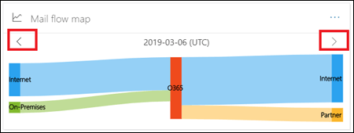
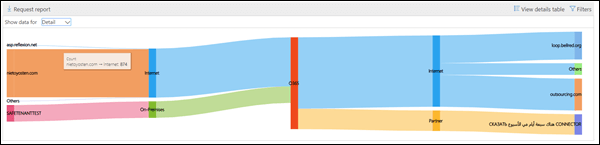

# Het kaartrapport van de poststroom

In dit rapport wordt inzicht gegeven in de manier waarop e-mail door uw Office 365-organisatie stroomt. U deze informatie gebruiken om patronen te leren, afwijkingen te identificeren en problemen op te lossen wanneer deze zich voordoen.

## Widget E-mailstroomkaart

Standaard toont de e-mailstroomkaart het e-mailstroompatroon op hoog niveau van de vorige dag. U de linker- en rechterpijlen verschillende dagen gebruiken. Als u de muiscursor boven elk gebied in het rapport plaatst, wordt het volume van e-mail van en naar uw Office 365-organisatie weergegeven, zoals weergegeven in het volgende diagram:

## Overzicht

Als u op de widget **E-mailstroomkaart** klikt, gaat u naar het kaartrapport van de **mailstroom.** Hier u meer gedetailleerd rapportniveau zien, u op Tabel Details weergeven klikken om gedetailleerde gegevens te bekijken. U het gedetailleerde rapport ook downloaden door op Rapport Aanvragen te klikken.

## Details

Standaard worden **gegevens weergeven voor** ingesteld op het **waardeoverzicht**. Wanneer u op de vervolgkeuzelijst klikt en **Details**selecteert, schakelt de weergave over naar de details op domeinniveau.

De bovenste afzender- en geadresseerdedomeinen worden vermeld en de rest wordt in **Andere** geplaatst, zoals weergegeven in de volgende diagrammen:

## Gerelateerde inzichten

Gerelateerde inzichten worden weergegeven onder de e-mailstroomkaart als ze beschikbaar zijn (bijvoorbeeld het inzicht in het verzenddomein of het inzicht in de maillus).

## Zie ook

Zie Inzichten in de [stroomstromen in het Security & Compliance Center](mail-flow-insights-v2.md)voor meer informatie over andere e-mailstroom-inzichten in het dashboard voor e-mailstroom.
