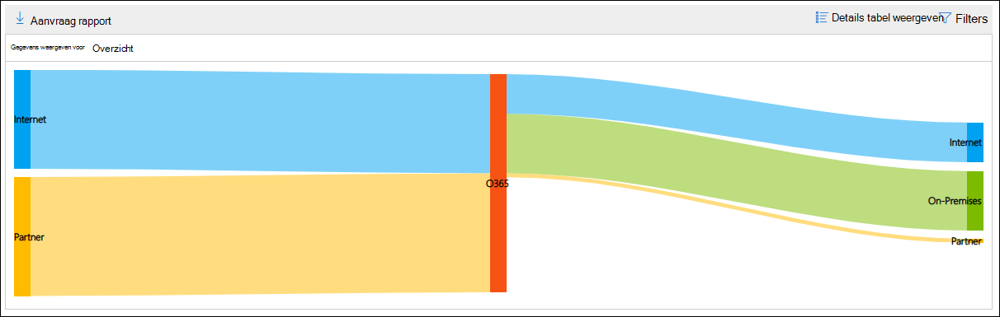
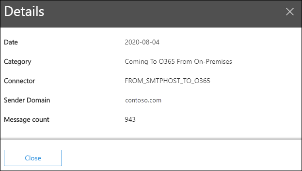

# De kaart voor de e-mail stroom in het Beveiligingscentrum beveiligings &Mail flow map in the Security & Compliance Center

De **e-mail stroom kaart** in het [Dashboard voor e-mail stroom](mail-flow-insights-v2.md) in het [Beveiligingscentrum beveiligings &](https://protection.office.com) biedt inzicht in de manier waarop e-mail stromen via uw organisatie worden doorgevoerd.The **Mail flow map** in the [Mail flow dashboard](mail-flow-insights-v2.md) in the [Security & Compliance Center](https://protection.office.com) gives insight as to how mail flows through your organization. U kunt deze gegevens gebruiken om patronen te ontdekken, afwijkingen te identificeren en problemen op te lossen.You can use this information to learn patterns, identify anomalies, and fix issues as they occur.

Standaard toont de widget de e-mail stroom patroon van de vorige dag in een grafiek die een *Sankey* -diagram wordt genoemd.By default, the widget shows the mail flow pattern from the previous day in a chart known as a *Sankey* diagram. U kunt de pijl-links  rechts gebruiken  om informatie uit verschillende dagen weer te geven.You can use the left arrow  and right arrow  to show information from different days. Elke andere kleur vertegenwoordigt een e-mail stroom via een andere binnenkomende of uitgaande connector (of zonder connectors).Each different color represents mail flow over a different inbound or outbound connector (or without using connectors). Als u de muisaanwijzer boven een bepaalde kleur houdt, wordt het aantal berichten weergegeven voor dat type verbindingslijn.If you hover over a specific color, the number of messages is displayed for that type of connector.

## Rapportweergave voor de e-mail stroom kaartReport view for the Mail flow map

Als u op de widget **e-mail stroom kaart** klikt, gaat u naar het rapport met de **e-mail stroom kaart** .Clicking on the **Mail flow map** widget will take you to the **Mail flow map** report.

De volgende grafieken zijn beschikbaar in de rapportweergave:The following charts are available in the report view:

- **Gegevens weergeven voor: overzicht**: dit is een grotere weergave van de widget.**Show data for: Overview**: This is basically a larger view of the widget. Als u de muisaanwijzer boven een bepaalde kleur houdt, wordt het aantal berichten weergegeven voor dat type verbindingslijn.If you hover over a specific color, the number of messages is displayed for that type of connector.

  

- **Gegevens weergeven voor: detail**: in deze weergave worden details weergegeven over de connectors en doeldomeinen.**Show data for: Detail**: This view shows details about the connectors and destination domains. De meeste e-mailadressen van de afzender en de ontvanger worden weergegeven en de rest wordt in **andere**gebieden meegenomen.The top sender and recipient domains are listed, and the rest are put in **Others**. Als u de muisaanwijzer boven een bepaalde kleur en sectie houdt, wordt het aantal berichten weergegeven.If you hover over a specific color and section, the number of messages is displayed.

  

Als u op **filters** in een rapportweergave klikt, kunt u een datumbereik opgeven met de **begindatum** en **einddatum**.If you click **Filters** in a report view, you can specify a date range with **Start date** and **End date**.

Als u het rapport voor een specifiek datumbereik naar een of meer geadresseerden wilt verzenden, klikt u op **Download aanvragen**.To email the report for a specific date range to one or more recipients, click **Request download**.

Gerelateerde inzichten worden weergegeven onder de weergave voor de e-mail stroom, als deze beschikbaar zijn (bijvoorbeeld de oplossing voor de [oplossing potentiële e-mail](mfi-mail-loop-insight.md)).Related insights are shown beneath the Mail flow map if they're available (for example, the [Fix possible mail loop insight](mfi-mail-loop-insight.md)).

## De tabel weergave Details voor de e-mail stroom kaartDetails table view for the Mail flow map

Als u in een rapportweergave op **Details tabel weergeven** klikt, wordt de volgende informatie weergegeven:If you click **View details table** in a report view, the following information is shown:

- **Einddatum****Date**
- **Categorie****Category**
- **Service provider van connector/derden****Connector / Third-party service provider**
- **Domein afzender/ontvanger****Sender/Recipient domain**
- **Aantal berichten****Message count**

Als u in een weergave met detail tabellen op **filters** klikt, kunt u een datumbereik opgeven met de **begindatum** en **einddatum**.If you click **Filters** in a details table view, you can specify a date range with **Start date** and **End date**.

Als u een rij selecteert, worden dezelfde gegevens weergegeven in een flyout:If you select a row, similar details are shown in a flyout:

Als u het rapport voor een specifiek datumbereik naar een of meer geadresseerden wilt verzenden, klikt u op **Download aanvragen**.To email the report for a specific date range to one or more recipients, click **Request download**.

Als u terug wilt gaan naar de weergave rapporten, klikt u op **rapport weergeven**.To go back to the reports view, click **View report**.

## Zie ookSee also

Zie voor meer informatie over andere inzichten in het dashboard voor e-mail stroom de [e-mail stroom inzichten in het artikel over de beveiliging & nalevings centrum](mail-flow-insights-v2.md).For information about other insights in the Mail flow dashboard, see [Mail flow insights in the Security & Compliance Center](mail-flow-insights-v2.md).
