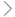

# E-mailstroommap in het beveiligings- & compliancecentrum

[!INCLUDE [Microsoft 365 Defender rebranding](../includes/microsoft-defender-for-office.md)]

**Van toepassing op**
- [Exchange Online Protection](exchange-online-protection-overview.md)
- [Abonnement 1 en abonnement 2 voor Microsoft Defender voor Office 365](defender-for-office-365.md)
- [Microsoft 365 Defender](../defender/microsoft-365-defender.md)

De **e-mailstroommap** in het [e-mailstroomdashboard](mail-flow-insights-v2.md) in & [Beveiligingscentrum](https://protection.office.com) geeft inzicht in de manier waarop e-mail door uw organisatie loopt. U kunt deze informatie gebruiken om patronen te leren, afwijkingen te identificeren en problemen op te lossen wanneer deze zich voordoen.

Standaard wordt in de widget het e-mailstroompatroon van de vorige dag weergegeven in een grafiek die bekend staat als een *Sankey-diagram.* U kunt de pijl-links en pijl-rechts pijl-rechts   geven. Elke andere kleur vertegenwoordigt de e-mailstroom over een andere binnenkomende of uitgaande verbindingslijn (of zonder verbindingslijnen). Als u de muisaanwijzer op een bepaalde kleur beweegt, wordt het aantal berichten weergegeven voor dat type verbindingslijn.

## Rapportweergave voor de e-mailstroommap

Als u op de widget **E-mailstroomkaart** klikt, gaat u naar het **rapport E-mailstroomkaart.**

De volgende grafieken zijn beschikbaar in de rapportweergave:

- **Gegevens weergeven voor: Overzicht:** Dit is in feite een grotere weergave van de widget. Als u de muisaanwijzer op een bepaalde kleur beweegt, wordt het aantal berichten weergegeven voor dat type verbindingslijn.

  

- **Gegevens weergeven voor: Detail:** In deze weergave ziet u details over de verbindingslijnen en doeldomeinen. De belangrijkste afzender- en geadresseerdedomeinen worden weergegeven en de rest wordt in Anderen **geplaatst.** Als u de muisaanwijzer boven een bepaalde kleur en sectie beweegt, wordt het aantal berichten weergegeven.

  

Als u in **een rapportweergave** op Filters klikt, kunt u een datumbereik opgeven met **Begindatum** en **Einddatum.**

Als u het rapport voor een bepaald datumbereik wilt e-mailen naar een of meer geadresseerden, klikt u op **Downloaden aanvragen.**

Verwante inzichten worden weergegeven onder de e-mailstroomkaart als deze beschikbaar zijn (bijvoorbeeld het inzicht in mogelijke [e-maillus oplossen).](mfi-mail-loop-insight.md)

## Tabelweergave Details voor de e-mailstroommap

Als u in **een rapportweergave op Detailstabel** weergeven klikt, worden de volgende gegevens weergegeven:

- **Datum**
- **Categorie**
- **Connector / Externe serviceprovider**
- **Domein afzender/geadresseerde**
- **Aantal berichten**

Als u in een detailtabelweergave op **Filters** klikt, kunt u een datumbereik opgeven met **Begindatum** en **Einddatum.**

Als u een rij selecteert, worden soortgelijke details weergegeven in een flyout:

Als u het rapport voor een bepaald datumbereik wilt e-mailen naar een of meer geadresseerden, klikt u op **Downloaden aanvragen.**

Als u terug wilt gaan naar de rapportweergave, klikt u op **Rapport weergeven.**

## Zie ook

Zie E-mailstroominzichten in het Beveiligings- & compliancecentrum voor meer informatie over andere inzichten [in het e-mailstroomdashboard.](mail-flow-insights-v2.md)
