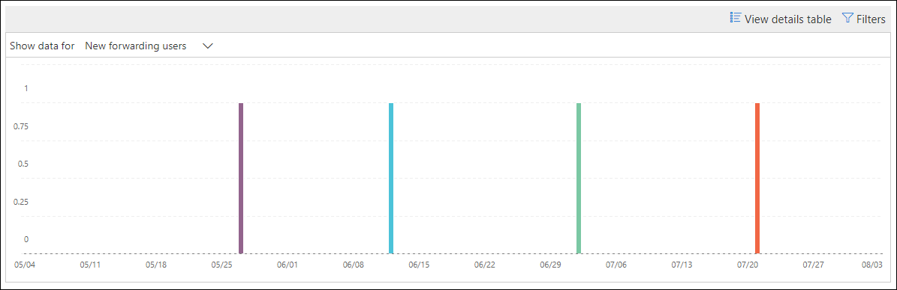
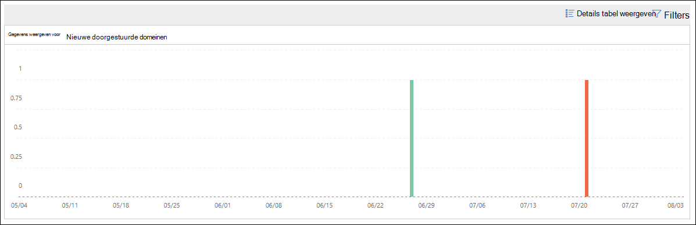

# Nieuwe gebruikers die e-mail inzicht doorsturen in de beveiligings & nalevings centrum

[!INCLUDE [Microsoft 365 Defender rebranding](../includes/microsoft-defender-for-office.md)]

Het verdacht wanneer nieuwe gebruikersaccounts in uw organisatie zich plotseling voor het doorsturen van e-mailberichten naar externe domeinen.

De **nieuwe domeinen waarnaar e-mail inzicht wordt doorgestuurd** in de [beveiliging & nalevings centrum](https://protection.office.com) meldt dat u een melding krijgt wanneer nieuwe gebruikers in uw organisatie berichten doorsturen naar externe domeinen. Deze voorwaarde kan worden gebruikt voor het maken van beheerdersaccounts waarmee de nieuwe gebruikers zijn gemanipuleerd. Als u vermoedt dat de accounts zijn aangetast, raadpleegt u [reageren op een gemanipuleerd e-mailaccount](responding-to-a-compromised-email-account.md).

Dit inzicht wordt alleen weergegeven als het probleem zich voordoet, en wordt weergegeven op de pagina voor het [doorsturen van rapporten](view-mail-flow-reports.md#forwarding-report) .

Wanneer u op de widget klikt, verschijnt er een flyout waar u meer informatie kunt vinden over de doorgestuurde berichten, waaronder een koppeling naar het [rapport met doorsturen van wijzigingen](#forwarding-modifications-report) , zoals verderop in dit artikel wordt beschreven.

U kunt deze detailpagina ook raadplegen wanneer u het inzicht selecteert nadat u op **AllesWeergeven** hebt geklikt in het gebied **belangrijkste inzichten &** gebied voor aanbevelingen ( \> **Dashboard** rapporten of <https://protection.office.com/insightdashboard> ).

U kunt klikken op de koppeling **Zie het rapport dat is gekoppeld** aan de Insight-koppeling om naar het **rapport met doorstuur wijzigingen** te gaan, zoals in de volgende sectie is beschreven.

## Rapport over wijzigingen doorsturen

In het rapport met de **doorstuur wijzigingen** ziet u informatie over berichten die automatisch worden doorgestuurd van afzenders in uw organisatie:

- Zojuist gemaakte accounts die berichten doorsturen naar externe domeinen.
- Accounts die berichten doorsturen naar externe domeinen die nooit zijn doorgestuurd naar andere afzenders in uw organisatie.

Dit soort doorgestuurde berichten kan een beveiligings-of nalevings risico vormen, en kan worden aangeduid met gemanipuleerde accounts.

Het rapport bevat gegevens voor maximaal 90 dagen. In het rapport worden standaardgegevens weergegeven voor de laatste 7 dagen.

Dit rapport is niet rechtstreeks beschikbaar in het dash [Board voor e-mail stroom](mail-flow-insights-v2.md) of in het [Dashboard rapporten](view-mail-flow-reports.md). U krijgt niet alleen te klikken op de koppeling **Zie het rapport in verband met een inzicht** in de **nieuwe gebruikers die e-mail inzicht doorsturen** :

- Op de koppeling **meldingen doorsturen** klikken in de details van de [nieuwe domeinen die worden doorgestuurd naar e-mail](mfi-new-domains-being-forwarded-email.md).
- Opening <https://protection.office.com/reportv2?id=MailFlowNewForwarding> .

### Rapportweergave voor het rapport voor het doorsturen van wijzigingen

De volgende grafieken zijn beschikbaar in de rapportweergave:

- **Gegevens weergeven voor: nieuwe doorstuur gebruikers**:

  

- **Gegevens weergeven voor: nieuwe forwarding domains**:

  

Als u op **filters** in een rapportweergave klikt, kunt u een datumbereik opgeven met de **begindatum** en **einddatum**.

### De tabel weergave Details voor het rapport met wijzigingen doorsturen

Als u op **detail tabel weergeven** klikt, is de informatie die wordt weergegeven, afhankelijk van de grafiek die u bekijkt:

- **Gegevens weergeven voor: nieuwe doorstuur gebruikers**:

  - **Naam**: het e-mailadres van de afzender.
  - **Type forwarding**
  - **Adres van ontvanger**
  - **Details**
  - **Getal**
  - **Eerste doorstuur datum**

- **Gegevens weergeven voor: nieuwe forwarding domains**:

  - **Naam**: het e-mail domein van de afzender.
  - **Type forwarding**
  - **Adres van ontvanger**
  - **Details**
  - **Getal**
  - **Eerste doorstuur datum**

Als u in een weergave met detail tabellen op **filters** klikt, kunt u een datumbereik opgeven met de **begindatum** en **einddatum**.

Als u een rij in de tabel selecteert, wordt een flyout met **Details** weergegeven met de volgende informatie:

- **Naam**: dit is het e-mailadres van de afzender (van **gegevens weergeven voor: nieuwe weergave voor doorstuur gebruikers** ) of het e-mail domein van de afzender (van **gegevens weergeven voor: nieuwe weergave met forwarding domains** ).
- **Type forwarding**
- **Ontvanger**
- **Details**
- **Getal**
- **Begindatum**
- **Aanbeveling**: van hieruit kunt u klikken op de koppeling voor het beheren van de gebruiker in het microsoft 365-Beheercentrum.

Als u terug wilt gaan naar de weergave rapporten, klikt u op **rapport weergeven**.

## Verwante onderwerpen

Zie voor meer informatie over andere inzichten in het dashboard voor e-mail stroom de [e-mail stroom inzichten in het artikel over de beveiliging & nalevings centrum](mail-flow-insights-v2.md).
