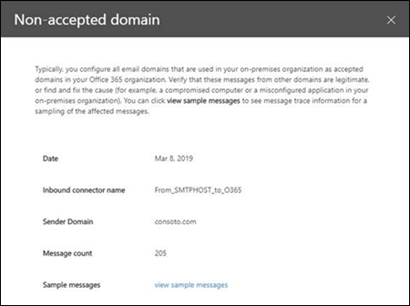

# Rapport over niet-geaccepteerd domein in de beveiligings & nalevings centrum

[!INCLUDE [Microsoft 365 Defender rebranding](../includes/microsoft-defender-for-office.md)]

Het **niet-geaccepteerde domein** rapport op het [Dashboard voor e-mail stroom](mail-flow-insights-v2.md) in de [beveiligings & nalevings centrum](https://protection.office.com) geeft informatie weer over berichten van de on-premises e-mail organisatie waarbij het domein van de afzender niet is geconfigureerd als een geaccepteerd domein in uw Microsoft 365-organisatie.

In Microsoft 365 kunnen deze berichten worden beperkt als we gegevens hebben om te bewijzen dat de intentie van deze berichten schadelijk is. Daarom is het belangrijk om te begrijpen wat er gebeurt en om het probleem te verhelpen.

## Rapportweergave voor het niet-geaccepteerde domein rapport

Door te klikken op het diagram in het **niet-geaccepteerde domein** object, gaat u naar het rapport **niet-geaccepteerd domein** .

Standaard wordt de activiteit voor alle desbetreffende verbindingslijnen weergegeven. Als u op **gegevens weergeven** klikt, kunt u een specifieke verbindingslijn selecteren in de vervolgkeuzelijst.

Als u de muisaanwijzer over een gegevenspunt (dag) van de grafiek houdt, ziet u het totale aantal berichten voor de verbindingslijn.

## De tabel weergave Details voor het niet-geaccepteerde domein rapport

Als u in een rapportweergave op **Details tabel weergeven** klikt, wordt de volgende informatie weergegeven:

- **Datum**
- **Naam van inkomende connector**
- **Afzenderdomein**
- **Aantal berichten**
- **Voorbeeldberichten**: de bericht-id's van een voorbeeld van de betreffende berichten.

Als u in een weergave met detail tabellen op **filters** klikt, kunt u een datumbereik opgeven met de **begindatum** en **einddatum**.

Als u het rapport voor een specifiek datumbereik naar een of meer geadresseerden wilt verzenden, klikt u op **Download aanvragen**.

Wanneer u een rij in de tabel selecteert, wordt een flyout met de volgende informatie weergegeven:

- **Datum**
- **Naam van inkomende connector**
- **Afzenderdomein**
- **Aantal berichten**
- **Voorbeeldberichten**: u kunt op **voorbeeldberichten weergeven** klikken om de resultaten van de [bericht tracering](message-trace-scc.md) te zien voor een voorbeeld van de betreffende berichten.

Als u terug wilt gaan naar de weergave rapporten, klikt u op **rapport weergeven**.

## Verwante onderwerpen

Zie voor meer informatie over andere inzichten in het dashboard voor e-mail stroom de [e-mail stroom inzichten in het artikel over de beveiliging & nalevings centrum](mail-flow-insights-v2.md).
