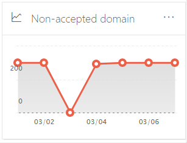

# Rapport over niet-geaccepteerd domein in de beveiligings & nalevings centrumNon-accepted domain report in the Security & Compliance Center

Het **niet-geaccepteerde domein** rapport op het [Dashboard voor e-mail stroom](mail-flow-insights-v2.md) in de beveiligings & nalevings centrum geeft informatie weer over berichten van de on-premises e-mail organisatie waarbij het domein van de afzender niet is geconfigureerd als een geaccepteerd domein in uw Microsoft 365-organisatie.The **Non-accepted domain** report in the [Mail flow dashboard](mail-flow-insights-v2.md) in the Security & Compliance Center displays information about messages from your on-premises email organization where the sender's domain isn't configured as an accepted domain in your Microsoft 365 organization.

In Microsoft 365 kunnen deze berichten worden beperkt als we gegevens hebben om te bewijzen dat de intentie van deze berichten schadelijk is.Microsoft 365 might throttle these messages if we have data to prove that the intent of these messages is malicious. Daarom is het belangrijk om te begrijpen wat er gebeurt en om het probleem te verhelpen.Therefore, it's important for you to understand what's happening and to fix the issue.

## Rapportweergave voor het niet-geaccepteerde domein rapportReport view for the Non-accepted domain report

Door te klikken op het diagram in het **niet-geaccepteerde domein** object, gaat u naar het rapport **niet-geaccepteerd domein** .Clicking the chart on the **Non-accepted domain** widget will take you to the **Non-accepted domain** report.

Standaard wordt de activiteit voor alle desbetreffende verbindingslijnen weergegeven.By default, the activity for all affected connectors is shown. Als u op **gegevens weergeven**klikt, kunt u een specifieke verbindingslijn selecteren in de vervolgkeuzelijst.If you click **Show data for**, you can select a specific connector from the dropdown.

Als u de muisaanwijzer over een gegevenspunt (dag) van de grafiek houdt, ziet u het totale aantal berichten voor de verbindingslijn.If you hover over a data point (day) in the chart, you'll see the total number of messages for the connector.

## De tabel weergave Details voor het niet-geaccepteerde domein rapportDetails table view for the Non-accepted domain report

Als u in een rapportweergave op **Details tabel weergeven** klikt, wordt de volgende informatie weergegeven:If you click **View details table** in a report view, the following information is shown:

- **Einddatum****Date**
- **Naam van inkomende connector****Inbound connector name**
- **Afzenderdomein****Sender domain**
- **Aantal berichten****Message count**
- **Voorbeeldberichten**: de bericht-id's van een voorbeeld van de betreffende berichten.**Sample messages**: The message IDs of a sample of affected messages.

Als u in een weergave met detail tabellen op **filters** klikt, kunt u een datumbereik opgeven met de **begindatum** en **einddatum**.If you click **Filters** in a details table view, you can specify a date range with **Start date** and **End date**.

Als u het rapport voor een specifiek datumbereik naar een of meer geadresseerden wilt verzenden, klikt u op **Download aanvragen**.To email the report for a specific date range to one or more recipients, click **Request download**.

Wanneer u een rij in de tabel selecteert, wordt een flyout met de volgende informatie weergegeven:When you select a row in the table, a flyout appears with the following information:

- **Einddatum****Date**
- **Naam van inkomende connector****Inbound connector name**
- **Afzenderdomein****Sender domain**
- **Aantal berichten****Message count**
- **Voorbeeldberichten**: u kunt op **voorbeeldberichten weergeven** klikken om de resultaten van de [bericht tracering](message-trace-scc.md) te zien voor een voorbeeld van de betreffende berichten.**Sample messages**: You can click **View sample messages** to see the [message trace](message-trace-scc.md) results for a sample of the affected messages.

Als u terug wilt gaan naar de weergave rapporten, klikt u op **rapport weergeven**.To go back to the reports view, click **View report**.

## Verwante onderwerpenRelated topics

Zie voor meer informatie over andere inzichten in het dashboard voor e-mail stroom de [e-mail stroom inzichten in het artikel over de beveiliging & nalevings centrum](mail-flow-insights-v2.md).For information about other insights in the Mail flow dashboard, see [Mail flow insights in the Security & Compliance Center](mail-flow-insights-v2.md).
