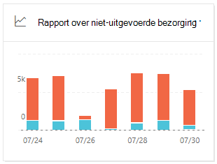
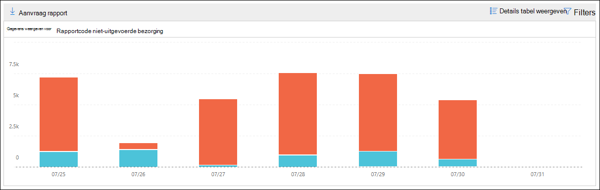

# Rapport over niet-uitgevoerde bezorging van de beveiligings & nalevings centrumNon-delivery report in the Security & Compliance Center

[!INCLUDE [Microsoft 365 Defender rebranding](../includes/microsoft-defender-for-office.md)]

Het **rapport over niet-** uitgevoerde bezorging van het [Dashboard voor e-mail stroom](mail-flow-insights-v2.md) in het [Beveiligingscentrum van beveiligings &](https://protection.office.com) bevat de belangrijkste foutcodes in rapporten over niet-uitgevoerde bezorging (ook wel ndr's genoemd) voor gebruikers in uw organisatie.The **Non-delivery report** in the [Mail flow dashboard](mail-flow-insights-v2.md) in the [Security & Compliance Center](https://protection.office.com) shows the most-encountered error codes in non-delivery reports (also known as NDRs or bounce messages) for users in your organization. Dit rapport toont de details van Ndr's, zodat u problemen met de bezorging van e-mail kunt oplossen.This report shows the details of NDRs so you can troubleshoot email delivery problems.

## Rapportweergave voor het rapport over niet-uitgevoerde bezorgingReport view for the Non-delivery report

Door te klikken op de widget **niet-bezorgingsrapport** gaat u naar het **rapport niet-** uitgevoerde bezorging.Clicking on the **Non-delivery report** widget will take you to the **Non-delivery report**.

Standaard wordt de activiteit voor alle foutcodes weergegeven.By default, the activity for all error codes is shown. Als u op **gegevens weergeven** klikt, kunt u een specifieke foutcode selecteren in de vervolgkeuzelijst.If you click **Show data for**, you can select a specific error code from the dropdown.

Als u een bepaalde kleur (foutcode) op een specifieke dag van de grafiek aanwijst, ziet u het totale aantal berichten voor de fout.If you hover over a specific color (error code) on a specific day in the chart, you'll see the total number of messages for the error.

## De tabel weergave Details voor het rapport over niet-uitgevoerde bezorgingDetails table view for the Non-delivery report

Als u in een rapportweergave op **Details tabel weergeven** klikt, wordt de volgende informatie weergegeven:If you click **View details table** in a report view, the following information is shown:

- **Datum****Date**
- **Rapportcode niet-uitgevoerde bezorging****Non-delivery report code**
- **Getal****Count**
- **Voorbeeldberichten**: de bericht-id's van een voorbeeld van de betreffende berichten.**Sample messages**: The message IDs of a sample of affected messages.

Als u in een weergave met detail tabellen op **filters** klikt, kunt u een datumbereik opgeven met de **begindatum** en **einddatum**.If you click **Filters** in a details table view, you can specify a date range with **Start date** and **End date**.

Als u het rapport voor een specifiek datumbereik naar een of meer geadresseerden wilt verzenden, klikt u op **Download aanvragen**.To email the report for a specific date range to one or more recipients, click **Request download**.

Wanneer u een rij in de tabel selecteert, wordt een flyout met de volgende informatie weergegeven:When you select a row in the table, a flyout appears with the following information:

- **Datum****Date**
- **Rapportcode voor niet-** uitgevoerde bezorging: u kunt op de link klikken voor meer informatie over de oorzaken en oplossingen voor de specifieke foutcode.**Non-delivery report code**: You can click on the link to find for more information about the causes and solutions for the specific error code.
- **Getal****Count**
- **Voorbeeldberichten**: u kunt op **voorbeeldberichten weergeven** klikken om de resultaten van de [bericht tracering](message-trace-scc.md) te zien voor een voorbeeld van de betreffende berichten.**Sample messages**: You can click **View sample messages** to see the [message trace](message-trace-scc.md) results for a sample of the affected messages.

## Verwante onderwerpenRelated topics

Zie voor meer informatie over andere inzichten in het dashboard voor e-mail stroom de [e-mail stroom inzichten in het artikel over de beveiliging & nalevings centrum](mail-flow-insights-v2.md).For information about other insights in the Mail flow dashboard, see [Mail flow insights in the Security & Compliance Center](mail-flow-insights-v2.md).
