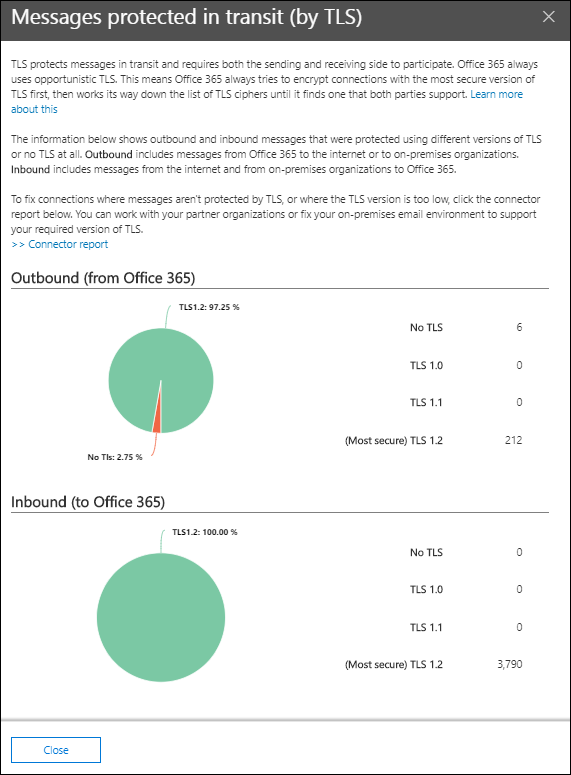

# Uitgaand en binnenkomende e-mail stroom inzicht in de beveiligings & nalevings centrumOutbound and inbound mail flow insight in the Security & Compliance Center

De **uitgaande en binnenkomende e-mail stroom** informatie in het [Dashboard voor e-mail stroom](mail-flow-insights-v2.md) in de beveiligings & nalevings centrum combineert de informatie uit het [verbindings rapport](view-mail-flow-reports.md#connector-report) en het voormalige **TLS-overzichtsrapport** op één plaats.The **Outbound and inbound mail flow** insight in the [Mail flow dashboard](mail-flow-insights-v2.md) in the Security & Compliance Center combines the information from the [Connector report](view-mail-flow-reports.md#connector-report) and the former **TLS overview report** in one place.

Het object geeft de TLS-versleuteling weer die wordt gebruikt voor de verbinding wanneer berichten worden bezorgd en van uw organisatie.The widget displays the TLS encryption that's used for the connection when messages are delivered to and from your organization. De verbindingen die zijn gemaakt met andere e-mailservices, worden versleuteld door TLS wanneer TLS aan beide kanten wordt aangeboden.The connections that are established with other email services are encrypted by TLS when TLS is offered by both sides. De widget biedt een momentopname van de laatste week van de e-mail stroom.The widget offers a snapshot of the last week of mail flow.

De gegevens in de widget hebben betrekking op connectors en TLS-berichtbeveiliging in Microsoft 365.The information in the widget is related to connectors and TLS message protection in Microsoft 365. Zie de volgende onderwerpen voor meer informatie:For more information, see these topics:

- [De e-mail stroom configureren met connectorsConfigure mail flow using connectors](https://docs.microsoft.com/exchange/mail-flow-best-practices/use-connectors-to-configure-mail-flow/use-connectors-to-configure-mail-flow)
- [Hoe Exchange Online TLS gebruikt om verbinding te maken met e-mail verbindingenHow Exchange Online uses TLS to secure email connections](https://docs.microsoft.com/microsoft-365/compliance/exchange-online-uses-tls-to-secure-email-connections)
- [Technische naslaginformatie over versleuteling in Microsoft 365Technical reference details about encryption in Microsoft 365](https://docs.microsoft.com/microsoft-365/compliance/technical-reference-details-about-encryption)

## Bericht beveiligd in transit (via TLS)Message protected in transit (by TLS)

Wanneer u klikt op **Details weergeven** in de widget, ziet u in het bericht met de **tekst in het bericht in transit (per TLS)** de TLS-beveiliging voor berichten die uw organisatie binnenkomen en verlaten.When you click **View Details** on the widget, the **Message protected in transit (by TLS)** flyout shows you the TLS protection for messages entering and leaving your organization.

Op dit moment TLS 1,2 is de veiligste versie van TLS die wordt aangeboden door Microsoft 365.Currently, TLS 1.2 is the most secure version of TLS that's offered by Microsoft 365. Vaak moet u weten wat de TLS-codering is die wordt gebruikt voor nalevingscontroles.Often, you'll need to know the TLS encryption that's being used for compliance audits. U hebt waarschijnlijk geen rechtstreekse relatie met de meeste bron-en doel-e-mailservers (u bezit ze niet, en hebt geen Microsoft), dus hebt u niet veel opties om de TLS-versleuteling te verbeteren die door die servers wordt gebruikt.You probably don't have a direct relationship with most of the source and destination email servers (you don't own them, and neither does Microsoft), so you don't have many options to improve the TLS encryption that's used by those servers.

U kunt echter ook gebruikmaken van [connectors](https://docs.microsoft.com/exchange/mail-flow-best-practices/use-connectors-to-configure-mail-flow/use-connectors-to-configure-mail-flow) om te zorgen dat u de beste beschikbare TLS-beveiliging voor berichten die zijn verzonden tussen uw e-mailservers en microsoft 365.But, you can use [connectors](https://docs.microsoft.com/exchange/mail-flow-best-practices/use-connectors-to-configure-mail-flow/use-connectors-to-configure-mail-flow) to ensure the best available TLS protection for messages that are sent between your email servers and Microsoft 365. De e-mail stroom tussen Microsoft 365 en uw eigen e-mailservers of servers die deel uitmaken van uw partners, is vaak belangrijker en gevoeliger dan gewone berichten, dus wilt u extra beveiliging en waakzaamheid op deze berichten toepassen.Mail flow between Microsoft 365 and your own email servers or servers that belong to your partners is often more important and sensitive than regular messages, so you'll want to apply extra security and vigilance to those messages.

U kunt een upgrade uitvoeren naar uw eigen e-mailservers of deze oplossing voor het verbeteren van de gebruikte TLS-versleuteling of contact opnemen met uw partners.You can upgrade or fix your own email servers to improve the TLS encryption that's being used, or reach out to your partners to do the same. In het **rapport connector** ziet u het e-mail stroom volume en de TLS-versleuteling voor berichten die gebruikmaken van uw microsoft 365-connectors.The **Connector Report** displays both mail flow volume and TLS encryption for messages that use your Microsoft 365 connectors.

U kunt klikken op de koppeling van het **verbindingslijn** om naar het [verbindings rapport](view-mail-flow-reports.md#connector-report)te gaan.You can click the **Connector report** link to go to the [Connector report](view-mail-flow-reports.md#connector-report). Mogelijk zijn de volgende inzichten beschikbaar op de pagina van het **connector rapport** als de bijbehorende voorwaarde is gedetecteerd:The following insights might be available on the **Connector report** page if the associated condition has been detected:

- **Binnenkomende partner connector met significante TLS 1.0-e-mail stroom****Inbound Partner connector seeing significant TLS1.0 mail flow**
- **Binnenkomende OnPremises-connector met significante TLS 1.0-e-mail stroom****Inbound OnPremises connector seeing significant TLS1.0 mail flow**

Voor TLS 1,0-verbindingen moet u eerst uw e-mailserver of de server van uw partner of een upgrade naar de server of een oplossing voorkomen, zodat er geen problemen worden weergegeven wanneer TLS 1,0 voor ondersteuning in Microsoft 365 uiteindelijk is afgeschaft.For TLS 1.0 connections, you really need to get your email server or your partner's server upgraded or fixed to avoid any issues when TLS 1.0 support is eventually deprecated in Microsoft 365.

## Zie ookSee also

Zie voor meer informatie over andere inzichten in het dashboard voor e-mail stroom de [e-mail stroom inzichten in het artikel over de beveiliging & nalevings centrum](mail-flow-insights-v2.md).For information about other insights in the Mail flow dashboard, see [Mail flow insights in the Security & Compliance Center](mail-flow-insights-v2.md).
