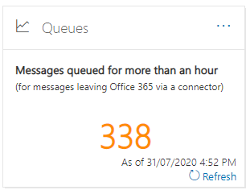
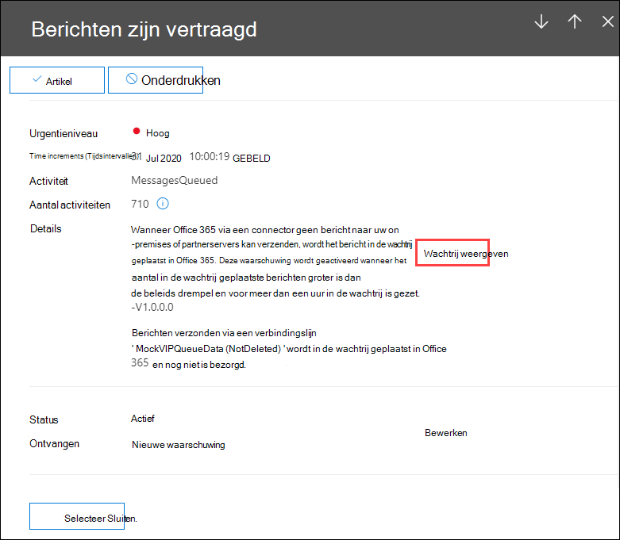

# Inzicht in wachtrijen in het beveiligings- & compliancecentrum

[!INCLUDE [Microsoft 365 Defender rebranding](../includes/microsoft-defender-for-office.md)]

**Van toepassing op**
- [Exchange Online Protection](exchange-online-protection-overview.md)
- [Abonnement 1 en abonnement 2 voor Microsoft Defender voor Office 365](defender-for-office-365.md)
- [Microsoft 365 Defender](../defender/microsoft-365-defender.md)

Wanneer berichten niet kunnen worden verzonden vanuit uw organisatie naar uw on-premises e-mailservers of partner-e-mailservers met connectors, worden de berichten in de wachtrij geplaatst in Microsoft 365. Veelvoorkomende voorbeelden die deze voorwaarde veroorzaken zijn:

- De verbindingslijn is onjuist geconfigureerd.
- Er zijn netwerk- of firewallwijzigingen aangebracht in uw on-premises omgeving.

Microsoft 365 blijft 24 uur lang proberen om te leveren. Na 24 uur verlopen de berichten en worden ze geretourneerd aan de afzenders in niet-bezorgingsrapporten (ook wel bekend als een NDR of bounce-berichten).

Als het e-mailvolume in de wachtrij de vooraf gedefinieerde drempel overschrijdt (de standaardwaarde is 200 berichten), is de informatie beschikbaar op de volgende locaties:

- Het **inzicht in wachtrijen** in het [e-mailstroomdashboard](mail-flow-insights-v2.md) in [& Beveiligingscentrum.](https://protection.office.com) Zie het inzicht wachtrijen in de sectie [E-mailstroomdashboard](#queues-insight-in-the-mail-flow-dashboard) in dit artikel voor meer informatie.

- Er wordt een waarschuwing weergegeven in **Recente waarschuwingen op** het dashboard Waarschuwingen in & [Beveiligingscentrum](https://protection.office.com) ( \> **Waarschuwingendashboard** of <https://protection.office.com/alertsdashboard> ).

  

- Beheerders ontvangen een e-mailmelding op basis van de configuratie van het standaardwaarschuwingsbeleid met de naam **Berichten zijn vertraagd.** Zie de volgende sectie als u de instellingen voor meldingen voor deze waarschuwing wilt configureren.

  Zie Waarschuwingsbeleid in het Beveiligings- & compliancecentrum voor meer [informatie over waarschuwingsbeleid.](../../compliance/alert-policies.md)

## Wachtrijwaarschuwingen aanpassen

1. Ga in [het & Compliancecentrum](https://protection.office.com)naar  \> **Waarschuwingenwaarschuwingsbeleid** of open <https://protection.office.com/alertpolicies> .

2. Zoek en selecteer **op de** pagina Waarschuwingsbeleid het beleid met de naam Berichten **zijn vertraagd.**

3. In de **fly-out Bericht is vertraagd** die wordt geopend, kunt u de waarschuwing in- of uitschakelen en de instellingen voor meldingen configureren.

   

   - **Status:** U kunt de waarschuwing in- of uitschakelen.

   - **E-mailontvangers** **en limiet voor dagelijkse meldingen:** Klik op Bewerken **om** de volgende instellingen te configureren:

4. Als u de instellingen voor meldingen wilt configureren, klikt u op **Bewerken.** Configureer **de volgende instellingen** in het flyout Beleid bewerken dat wordt weergegeven:

   - **E-mailmeldingen verzenden:** de standaardwaarde is ingeschakeld.
   - **E-mailontvangers:** De standaardwaarde is **TenantAdmins.**
   - **Dagelijkse meldingslimiet:** De standaardwaarde is **Geen limiet.**
   - **Drempelwaarde:** de standaardwaarde is 200.

   

5. Wanneer u klaar bent, klikt u op **Opslaan** en **sluiten.**

## Inzicht in wachtrijen in het e-mailstroomdashboard

Zelfs als het berichtvolume in de wachtrij de drempelwaarde niet heeft  overschreden en een waarschuwing heeft gegenereerd, kunt u nog steeds het inzicht Wachtrijen in het e-mailstroomdashboard gebruiken om berichten te zien die langer dan een uur in de wachtrij staan en actie ondernemen voordat het aantal in de wachtrij geplaatste berichten te groot wordt. 

Als u op het aantal berichten in de widget klikt, wordt er een fly-out met berichten **in** de wachtrij weergegeven met de volgende informatie:

- **Aantal in de wachtrij geplaatste berichten**
- **Naam van** verbindingslijn: Klik op de naam van de verbindingslijn om de verbindingslijn te beheren in het Exchange-beheercentrum (EAC).
- **De begintijd van de wachtrij**
- **Oudste berichten verlopen**
- **Doelserver**
- **Laatste IP-adres**
- **Laatste fout**
- **Oplossen: er** zijn veelvoorkomende problemen en oplossingen beschikbaar. Als de koppeling **Nu oplossen** beschikbaar is, klikt u erop om het probleem op te lossen. Klik anders op beschikbare koppelingen voor meer informatie over de fout en mogelijke oplossingen.

Hetzelfde flyout wordt weergegeven nadat  u in de details van een waarschuwing op Wachtrij weergeven **hebt** geklikt.

## Zie ook

Zie E-mailstroominzichten in het Beveiligings- & compliancecentrum voor meer informatie over andere inzichten [in het e-mailstroomdashboard.](mail-flow-insights-v2.md)
