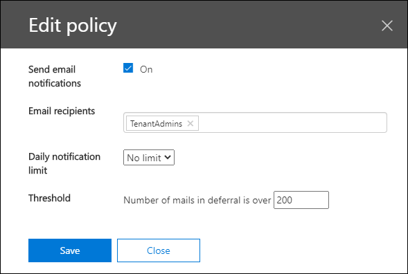

# Inzicht in wachtrijen in het beveiligings & nalevings centrum

Wanneer berichten niet vanuit uw organisatie kunnen worden verzonden naar uw on-premises e-mailservers en e-mailservers met connectors, worden de berichten in de wachtrij geplaatst in Microsoft 365. Veelgebruikte voorbeelden die deze voorwaarde veroorzaken:

- De verbindingslijn is onjuist geconfigureerd.
- Uw on-premises omgeving heeft een netwerk-of firewall wijziging.

Microsoft 365 blijft opnieuw proberen na 24 uur. Na 24 uur verloopt de berichten en gaan ze terug naar de afzenders in rapporten over niet-uitgevoerde bezorging (ook wel Ndr's of stuiterende berichten).

Als het e-mail volume in de wachtrij de vooraf gedefinieerde drempelwaarde overschrijdt (de standaardwaarde is 200-berichten), is de informatie beschikbaar op de volgende locaties:

- De **wachtrijen** zijn te zien in het [Dashboard voor de e-mail stroom](mail-flow-insights-v2.md) van het [beveiligings & nalevings centrum](https://protection.office.com). Zie voor meer informatie de [wachtrijen inzichtelijk in de sectie e-mail stroom dashboard](#queues-insight-in-the-mail-flow-dashboard) in dit onderwerp.
  
- Er wordt een waarschuwing weergegeven bij **recente meldingen** het dashboard waarschuwingen in het [compliance-Beveiligingscentrum van beveiligings &](https://protection.office.com) (**waarschuwingen** \> **Dashboard** of <https://protection.office.com/alertsdashboard> ).

  

- Beheerders ontvangen een e-mail melding op basis van de configuratie van het standaard waarschuwings beleid met de naam **berichten zijn vertraagd**. Zie de volgende sectie voor informatie over het configureren van de instellingen voor meldingen voor deze waarschuwing.

  Zie voor meer informatie over waarschuwings beleidsregels [een waarschuwings beleid in het beveiligings & nalevings centrum](../../compliance/alert-policies.md).

## Wachtrij waarschuwingen aanpassen

1. Ga in het [beveiligings & nalevings centrum](https://protection.office.com)naar **Alerts** \> **waarschuwings beleid** voor meldingen of open <https://protection.office.com/alertpolicies> .

2. Ga naar de pagina met **waarschuwings beleidsregels** en selecteer het beleid **met de naam vertraagde berichten**.

3. In het **bericht zijn vertraagde** flyout die wordt geopend, kunt u de melding in-of uitschakelen en de instellingen voor meldingen configureren.

   

   - **Status**: u kunt de melding in-of uitschakelen.

   - Geadresseerden en **meldingen** **per E-mail ontvangen** : Klik op **bewerken** om de volgende instellingen te configureren:

4. Klik op **bewerken**om de instellingen voor meldingen te configureren. Configureer de volgende instellingen in de flyout **beleidsregels bewerken** die wordt weergegeven:

   - **E-mail meldingen verzenden**: de standaardwaarde is ingeschakeld.
   - **Geadresseerden voor e-mail**: de standaardwaarde is **TenantAdmins**.
   - **Dagelijkse meldings limiet**: de standaardwaarde is **geen limiet**.
   - **Drempel**waarde: de standaardwaarde is 200.

   

5. Wanneer u klaar bent, klikt u op **Opslaan** en **sluiten**.

## Inzicht in wachtrijen in het dashboard voor e-mail stromen

Ook als het volume van de wachtrij niet de drempelwaarde heeft overschreden en een waarschuwing heeft gegenereerd, kunt u nog steeds het inzicht in de **wachtrijen** van het [Dashboard voor e-mail stroom](mail-flow-insights-v2.md) gebruiken om berichten weer te geven die zijn gefactureerd voor meer dan één uur en om actie te ondernemen voordat het aantal berichten in de wachtrij te groot wordt weergegeven.

Als u op het aantal berichten in het object klikt, wordt een flyout met de berichten in de **wachtrij** weergegeven met de volgende informatie:

- **Aantal berichten in de wachtrij**
- **Naam connector**: Klik op de naam van de verbindingslijn om de connector te beheren in het Exchange-Beheercentrum.
- **Begintijd wachtrij**
- **Oudste berichten verlopen**
- **Doelserver**
- **Laatste IP-adres**
- **Laatste fout**
- **Oplossing**: er zijn veelvoorkomende problemen en oplossingen beschikbaar. Als de koppeling **nu repareren** beschikbaar is, klikt u erop om het probleem op te lossen. U kunt ook op een van de beschikbare koppelingen klikken voor meer informatie over de fout en mogelijke oplossingen.

Wanneer u op **wachtrij weergeven** klikt, wordt dezelfde flyout weergegeven wanneer u op wachtrij weergeven klikt voor de details van een **bericht zijn uitgesteld** .

## Zie ook

Zie voor meer informatie over andere inzichten in het dashboard voor e-mail stroom de [e-mail stroom inzichten in het artikel over de beveiliging & nalevings centrum](mail-flow-insights-v2.md).
