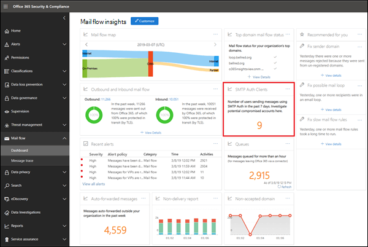

# SMTP Auth-clients rapporterenSMTP Auth clients report

In het rapport **SMTP Auth-clients** wordt het gebruik van het SMTP Auth-clientindieningsprotocol door gebruikers of systeemaccounts in uw organisatie benadrukt.The **SMTP Auth clients** report highlights the use of the SMTP Auth client submission protocol by users or system accounts in your organization. Dit verouderde protocol (dat het eindpunt smtp.office365.com) biedt alleen basisverificatie en is gevoelig voor gebruik door gecompromitteerde accounts om e-mail te verzenden.This legacy protocol (which uses the endpoint smtp.office365.com) only offers Basic authentication, and is susceptible to being used by compromised accounts to send email.  Met dit rapport u controleren op ongebruikelijke activiteit.This report allows you to check for unusual activity. Het toont ook de TLS-gebruiksgegevens voor clients of apparaten die SMTP Auth gebruiken.It also shows the TLS usage data for clients or devices using SMTP Auth.

De widget die wordt weergegeven in het dashboard Mail Flow geeft het aantal gebruikers of serviceaccounts aan dat het SMTP Auth-protocol in de afgelopen 7 dagen heeft gebruikt.The widget that's shown in the Mail Flow dashboard indicates the number of users or service accounts that have used the SMTP Auth protocol in the last 7 days.

Als u op de widget klikt, wordt een flyout geopend die een geaggregeerde weergave biedt van het TLS-gebruik en de volumes van de afgelopen week.Clicking on the widget opens a flyout that provides an aggregated view of the TLS usage and volumes for the last week.

Wanneer u op de koppeling **SMTP Auth-klantenrapport** klikt, ziet u twee hoofdgegevensdraaipunten en twee gegevensweergaven.When you click on the **SMTP Auth Clients Report** link, you'll see two main data pivots and two data views. De gegevensdraaipunten zijn het **verzendvolume** en **tls-gebruik**.The data pivots are the **Sending Volume** and **TLS Usage**. De gegevensweergaven zijn de grafiek en de detailstabel.The data views are the chart and the details table.

In de weergave **Volume verzenden** wordt het aantal berichten weergegeven dat is verzonden met SMTP Auth voor het opgegeven tijdsbereik.The **Sending Volume** view shows the number of messages that were sent using SMTP Auth for the specified time range. U het bereik aanpassen door op **Filters**te klikken.You can adjust the range by clicking **Filters**. De grafiek is geordend op afzenderdomein.The chart is organized by sender domain. U afzonderlijke gegevens voor elk domein bekijken door het domein te selecteren in de **vervolgkeuzelijst Gegevens weergeven voor.**You can see separate data for each domain by selecting the domain in the **Show data for** drop down.

U gedetailleerde informatie over de afzenders bekijken en hun berichttelt door op **de tabel Details weergeven**te klikken.You can view detailed information about the senders and their message counts by clicking **View details table**. Als u wilt terugkeren naar de grafiek, klikt u op **Rapport weergeven**.To return to the chart, click **View report**.

De **TLS-gebruikspil** is belangrijk vanwege de aanstaande afschaffing van TLS1.0 en TLS1.1 in Office 365.The **TLS Usage** pivot is important due to the upcoming deprecation of TLS1.0 and TLS1.1 in Office 365. Veel oudere apparaten en toepassingen kunnen geen e-mail verzenden als ze alleen TLS1.0 met SMTP Auth kunnen gebruiken. Met deze draaiknop u gebruikers en systeemaccounts identificeren en actie ondernemen die nog steeds oudere versies van TLS gebruiken.Many legacy devices and applications will be unable to send email if they are only capable of using TLS1.0 with SMTP Auth. This pivot allows you to identify and take action on users and system accounts that are still using older versions of TLS.

U gedetailleerde informatie over de afzenders bekijken, de versies van TLS die ze gebruiken met SMTP Auth en hun bericht telt door op **de tabel Details weergeven**te klikken.You can view detailed information about the senders, the versions of TLS they are using with SMTP Auth, and their message counts by clicking **View details table**. Als u wilt terugkeren naar de grafiek, klikt u op **Rapport weergeven**.To return to the chart, click **View report**.

U ook een meer gedetailleerde versie van het rapport downloaden door op Rapport aanvragen te klikken.You can also download a more detailed version of the report by clicking Request report.

## Zie ookSee also

Zie Inzicht in [e-mailstroom in het Security & Compliance Center](mail-flow-insights-v2.md)voor meer informatie over andere e-mailstroominzichten in het dashboard voor e-mailstromen.For more information about other mail flow insights in the mail flow dashboard, see [Mail flow insights in the Security & Compliance Center](mail-flow-insights-v2.md).
