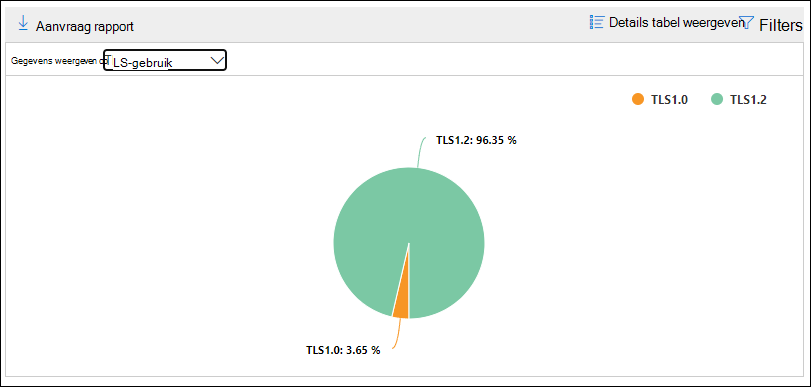

# Client-auth-clients inzicht en rapporteren in de beveiligings & nalevings centrum

[!INCLUDE [Microsoft 365 Defender rebranding](../includes/microsoft-defender-for-office.md)]

De **SMTP auth-clients** bieden inzicht in in het [Dashboard voor de e-mail stroom](mail-flow-insights-v2.md) en het bijbehorende [SMTP-](#smtp-auth-clients-report) auth-client rapport in het [nalevings centrum voor beveiligings &](https://protection.office.com) het gebruik van het SMTP-verificatieprotocol voor clientverificatie door gebruikers of systeemaccounts in uw organisatie. Dit oudere protocol (met het eindpunt smtp.office365.com) biedt alleen basisverificatie en kan worden gebruikt door gemanipuleerde accounts om e-mail te verzenden. In het inzicht en de rapportage kunt u controleren op ongebruikelijke activiteiten voor e-mail inzendingen van SMTP-verificatie. Ook de TLS-gebruiksgegevens voor clients of apparaten worden weergegeven met SMTP-AUTH.

De widget geeft het aantal gebruikers of serviceaccounts aan dat het SMTP-authenticatieprotocol in de afgelopen 7 dagen heeft gebruikt.

Als u op het aantal berichten in het object klikt, wordt een flyout **SMTP auth clients** weergegeven. Het flyout biedt een geaggregeerde weergave van het TLS-gebruik en de volumes voor de laatste week.

U kunt op de koppeling naar de **SMTP-auth-clients** klikken om naar de lijst met SMTP-verificatie clients te gaan, zoals wordt beschreven in de volgende sectie.

## SMTP-verificatierapport voor clients

### Rapportweergave voor het rapport met SMTP-verificatie clients

In het rapport worden standaardgegevens weergegeven voor de laatste 7 dagen, maar de gegevens zijn beschikbaar voor de laatste 90 dagen.

De sectie overzicht bevat de volgende grafieken:

- **Gegevens weergeven voor: verzenden volume** : in de grafiek worden standaard de SMTP-auth-client berichten weergegeven die zijn verzonden vanuit alle domeinen ( **gegevens weergeven voor: alle domeinen** van de afzender worden standaard geselecteerd). U kunt de resultaten filteren op een bepaald domein van de afzender door op **gegevens weergeven voor** te klikken en het domein van de afzender in de vervolgkeuzelijst te selecteren. Als u een specifiek gegevenspunt (dag) aanwijst, wordt het aantal berichten weergegeven.

  

- **Gegevens weergeven op: TLS** : de grafiek bevat het percentage van TLS-gebruik voor alle SMTP auth-client berichten tijdens de geselecteerde tijdsperiode. Met deze grafiek kunt u de gebruikers en systeemaccounts identificeren en er actie ondernemen wanneer u nog oudere versies van TLS gebruikt.

  

Als u op **filters** in een rapportweergave klikt, kunt u een datumbereik opgeven met de **begindatum** en **einddatum**.

Klik op **rapportaanvragen** om een gedetailleerde versie van het rapport in een e-mailbericht te ontvangen. U kunt het datumbereik en de geadresseerden opgeven waarop u het rapport wilt ontvangen.

### Weergave Details voor het rapport met SMTP-verificatie clients

Als u op **detail tabel weergeven** klikt, is de informatie die wordt weergegeven, afhankelijk van de grafiek die u bekijkt:

- **Gegevens weergeven voor: verzenden volume** : de volgende informatie wordt weergegeven in een tabel:

  - **Adres afzender**
  - **Aantal berichten**

  Als u een rij selecteert, worden de gegevens in een flyout weergegeven.

- **Gegevens weergeven op: TLS-gebruik** : de volgende informatie wordt weergegeven in een tabel:

  - **Adres afzender**
  - **TLS 1.0%**\*
  - **TLS 1,1%**\*
  - **TLS 1.2%**\*
  - **Aantal berichten**

  \* In deze kolom ziet u het percentage en het aantal berichten van de afzender.

Als u in een weergave met detail tabellen op **filters** klikt, kunt u een datumbereik opgeven met de **begindatum** en **einddatum**.

Als u een rij selecteert, worden dezelfde gegevens weergegeven in een flyout:

Klik op **rapportaanvragen** om een gedetailleerde versie van het rapport in een e-mailbericht te ontvangen. U kunt het datumbereik en de geadresseerden opgeven waarop u het rapport wilt ontvangen.

Als u terug wilt gaan naar de weergave rapporten, klikt u op **rapport weergeven**.

## Verwante onderwerpen

Zie voor meer informatie over andere inzichten in het dashboard voor e-mail stroom de [e-mail stroom inzichten in het artikel over de beveiliging & nalevings centrum](mail-flow-insights-v2.md).
