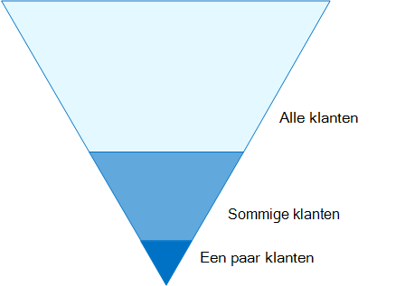

# Configuratie van identiteiten en apparaattoegangIdentity and device access configurations

De moderne beveiligings verbinding van uw organisatie breidt nu buiten het netwerk tot het gebruik van gebruikers van Cloud apps vanaf elke locatie met een groot aantal apparaten.The modern security perimeter of your organization now extends beyond your network to include users accessing cloud-based apps from any location with a variety of devices. Uw beveiligingsinfrastructuur moet bepalen of een bepaalde toegangsaanvraag moet worden toegewezen en onder welke voorwaarden.Your security infrastructure needs to determine whether a given access request should be granted and under what conditions. 

Deze bepaling dient te worden gebaseerd op het gebruikersaccount van de aanmelding, het gebruikte apparaat, de app die de gebruiker gebruikt voor Access, de locatie van waaraf de toegangsaanvraag wordt ingediend en een evaluatie van het risico van de aanvraag.This determination should be based on the user account of the sign-in, the device being used, the app the user is using for access, the location from which the access request is made, and an assessment of the risk of the request. Op deze manier zorgt u ervoor dat alleen goedgekeurde gebruikers en apparaten toegang hebben tot uw belangrijke bronnen.This capability helps ensure that only approved users and devices can access your critical resources.

In deze reeks artikelen wordt beschreven welke configuraties van de vereisten voor identiteiten en toegang hebben tot uw apparaten en een set van Azure Active Directory (Azure AD) voorwaardelijke toegang, Microsoft intune en andere beleidsregels om de toegang tot Microsoft 365 te beveiligen voor Office 365-apps en-services, andere SaaS-Services en on-premises toepassingen die zijn gepubliceerd met Azure AD Application proxy.This series of articles describes a set of identity and device access prerequisite configurations and a set of Azure Active Directory (Azure AD) Conditional Access, Microsoft Intune, and other policies to secure access to Microsoft 365 for enterprise cloud apps and services, other SaaS services, and on-premises applications published with Azure AD Application Proxy.

De instellingen en het beleid voor identiteit en toegang worden in drie lagen geadviseerd: basisbescherming, gevoelige bescherming en bescherming voor omgevingen met zeer gereguleerde of geclassificeerde gegevens.Identity and device access settings and policies are recommended in three tiers: baseline protection, sensitive protection, and protection for environments with highly regulated or classified data. Deze lagen en de bijbehorende configuraties bieden een consistent beveiligingsniveau van uw gegevens, identiteiten en apparaten.These tiers and their corresponding configurations provide consistent levels of protection across your data, identities, and devices.

Deze mogelijkheden en de bijbehorende aanbevelingen:These capabilities and their recommendations:

- Wordt ondersteund in Microsoft 365 E3 en Microsoft 365 E5.Are supported in Microsoft 365 E3 and Microsoft 365 E5.
- Worden afgestemd op de [Microsoft Secure Score](https://docs.microsoft.com/microsoft-365/security/mtp/microsoft-secure-score) en de [Score Score in azure AD](https://docs.microsoft.com/azure/active-directory/fundamentals/identity-secure-score), en zullen deze scores voor uw organisatie toenemen.Are aligned with [Microsoft Secure Score](https://docs.microsoft.com/microsoft-365/security/mtp/microsoft-secure-score) as well as [identity score in Azure AD](https://docs.microsoft.com/azure/active-directory/fundamentals/identity-secure-score), and will increase these scores for your organization.
- U wordt aangeraden deze [vijf stappen uit te voeren om uw identiteits infrastructuur te beschermen](https://docs.microsoft.com/azure/security/azure-ad-secure-steps).Will help you implement these [five steps to securing your identity infrastructure](https://docs.microsoft.com/azure/security/azure-ad-secure-steps).

Als uw organisatie unieke omgevings eisen of complexe vereisten heeft, kunt u deze aanbevelingen als uitgangspunt gebruiken.If your organization has unique environment requirements or complexities, use these recommendations as a starting point. De meeste organisaties kunnen deze aanbevelingen evenwel implementeren.However, most organizations can implement these recommendations as prescribed.

>[!Note]
>Microsoft verkoopt ook licenties voor Enterprise Mobility + Security (EMS) voor Office 365-abonnementen.Microsoft also sells Enterprise Mobility + Security (EMS) licenses for Office 365 subscriptions. EMS E3 en EMS E5 zijn gelijk aan de mogelijkheden van Microsoft 365 E3 en Microsoft 365 E5.EMS E3 and EMS E5 capabilities are equivalent to those in Microsoft 365 E3 and Microsoft 365 E5. Zie [EMS-abonnementen](https://www.microsoft.com/en-us/microsoft-365/enterprise-mobility-security/compare-plans-and-pricing) voor de details.See [EMS plans](https://www.microsoft.com/en-us/microsoft-365/enterprise-mobility-security/compare-plans-and-pricing) for the details.
>

## DoelgroepIntended audience

Deze aanbevelingen zijn bedoeld voor Enterprise Architects en IT-professionals die bekend zijn met de productiviteits-en beveiligingsservices van Microsoft 365 Cloud, waaronder Azure AD (Identity), Microsoft intune (Apparaatbeheer) en Azure Information Protection (gegevensbescherming).These recommendations are intended for enterprise architects and IT professionals who are familiar with Microsoft 365 cloud productivity and security services, which includes Azure AD (identity), Microsoft Intune (device management), and Azure Information Protection (data protection).

### Klant omgevingCustomer environment

De aanbevolen beleidsregels gelden voor Enterprise-organisaties die zowel in de Microsoft-Cloud werken en voor klanten met een hybride identiteits infrastructuur, een on-premises AD DS-forest (Active Directory Domain Services) dat wordt gesynchroniseerd met een Azure AD-Tenant.The recommended policies are applicable to enterprise organizations operating both entirely within the Microsoft cloud and for customers with hybrid identity infrastructure, which is an on-premises Active Directory Domain Services (AD DS) forest that is synchronized with an Azure AD tenant.

Tal van de geboden aanbevelingen zijn afhankelijk van de services die alleen beschikbaar zijn in Microsoft 365 E5, Microsoft 365 E3 met de identiteit & invoegtoepassing Threat Protection, EMS E5 of Azure Premium P2.Many of the provided recommendations rely on services available only with Microsoft 365 E5, Microsoft 365 E3 with the Identity & Threat Protection add-on, EMS E5, or Azure Premium P2 licenses.

Voor organisaties die deze licenties niet hebben, adviseert Microsoft minimaal [beveiligingsstandaarden](https://docs.microsoft.com/azure/active-directory/fundamentals/concept-fundamentals-security-defaults)te implementeren, die deel uitmaken van alle microsoft 365-abonnementen.For those organizations who do not have these licenses, Microsoft recommends you at least implement [security defaults](https://docs.microsoft.com/azure/active-directory/fundamentals/concept-fundamentals-security-defaults), which is included with all Microsoft 365 plans. 

### VoorbehoudCaveats

Uw organisatie kan onderworpen zijn aan wettelijke of andere nalevingsvereisten, waaronder specifieke aanbevelingen waarbij u beleidsregels moet toepassen die afwijken van deze aanbevolen configuraties.Your organization may be subject to regulatory or other compliance requirements, including specific recommendations that may require you to apply policies that diverge from these recommended configurations. Deze configuraties bevelen gebruiks besturingselementen voor voor gebruik die niet historisch beschikbaar waren.These configurations recommend usage controls that have not historically been available. We raden u aan deze besturingselementen te onderscheiden omdat ze een evenwicht tussen beveiliging en productiviteit aangeven.We recommend these controls because we believe they represent a balance between security and productivity.  

We hebben ons de beste account voor een grote verscheidenheid aan de beschermings vereisten voor de organisatie, maar we kunnen niet op de hoogte worden gesteld van alle mogelijke eisen of voor alle unieke aspecten van uw organisatie.We've done our best to account for a wide variety of organizational protection requirements, but we're not able to account for all possible requirements or for all the unique aspects of your organization.

## Drie niveaus van beschermingThree tiers of protection

De meeste organisaties hebben specifieke vereisten inzake beveiliging en gegevensbescherming.Most organizations have specific requirements regarding security and data protection. Deze vereisten hangen af van het sector segment en van functie functies binnen organisaties.These requirements vary by industry segment and by job functions within organizations. Voor uw wettelijke afdeling en beheerders zijn mogelijk extra beveiligings-en informatie beschermingsfuncties nodig voor de e-mail correspondentie die niet is vereist voor andere business units.For example, your legal department and administrators might require additional security and information protection controls around their email correspondence that are not required for other business units. 

Elke bedrijfstak heeft ook een eigen set gespecialiseerde voorschriften.Each industry also has their own set of specialized regulations. In plaats van een lijst te maken met alle mogelijke beveiligingsopties of een aanbevelingen per sector segment of functie, zijn er aanbevelingen voor drie verschillende niveaus van beveiliging en bescherming die kunnen worden toegepast op basis van de granulatie van uw behoeften.Rather than providing a list of all possible security options or a recommendation per industry segment or job function, recommendations have been provided for three different tiers of security and protection that can be applied based on the granularity of your needs.

- **Basislijn beveiliging**: u wordt aangeraden een minimum standaard te creëren voor het beschermen van gegevens, evenals de identiteiten en apparaten die toegang hebben tot uw gegevens.**Baseline protection**: We recommend you establish a minimum standard for protecting data, as well as the identities and devices that access your data. U kunt deze aanbevelingen volgen om krachtige standaardbeveiliging te bieden die voldoet aan de behoeften van vele organisaties.You can follow these baseline recommendations to provide strong default protection that meets the needs of many organizations.
- **Gevoelige beveiliging**: sommige klanten hebben een subset van gegevens die op een hoger niveau moeten worden beveiligd, of alle gegevens moeten worden beveiligd op een hoger niveau.**Sensitive protection**: Some customers have a subset of data that must be protected at higher levels, or they may require all data to be protected at a higher level. U kunt betere beveiliging toepassen op alle of specifieke gegevenssets in uw Microsoft 365-omgeving.You can apply increased protection to all or specific data sets in your Microsoft 365 environment. U wordt aangeraden identiteiten en apparaten te beschermen die toegang hebben tot gevoelige gegevens met vergelijkbare beveiligingsniveaus.We recommend protecting identities and devices that access sensitive data with comparable levels of security.  
- **Zeer gereguleerd**: sommige organisaties hebben mogelijk een kleine hoeveelheid gegevens die in hoge mate is geclassificeerd, dat wil zeggen handelsgeheimen of een gereguleerde gegevens.**Highly regulated**: Some organizations may have a small amount of data that is highly classified, constitutes trade secrets, or is regulated data. Microsoft biedt mogelijkheden om organisaties te helpen aan deze vereisten te voldoen, waaronder extra bescherming voor identiteiten en apparaten.Microsoft provides capabilities to help organizations meet these requirements, including added protection for identities and devices.

In deze richtlijnen wordt uitgelegd hoe u beveiliging voor identiteiten en apparaten kunt implementeren voor elk van deze beveiligingsniveaus.This guidance shows you how to implement protection for identities and devices for each of these tiers of protection. U kunt deze richtlijnen gebruiken als uitgangspunt voor uw organisatie en de beleidsregels aanpassen zodat ze voldoen aan de specifieke vereisten van uw organisatie.Use this guidance as a starting point for your organization and adjust the policies to meet your organization's specific requirements.

Het is belangrijk dat u een consistent beveiligingsniveau gebruikt voor uw gegevens, identiteiten en apparaten.It's important to use consistent levels of protection across your data, identities, and devices. Als u bijvoorbeeld deze richtlijnen implementeert, moet u ervoor zorgen dat u uw gegevens beveiligt tegen vergelijkbare niveaus.For example, if you implement this guidance, be sure to protect your data at comparable levels. 

Het model **identiteit en beveiliging voor Microsoft 365** Architecture laat u zien welke mogelijkheden vergelijkbaar zijn.The **Identity and device protection for Microsoft 365** architecture model shows you which capabilities are comparable.

    [Weergeven als een PDF-bestand](../../downloads/MSFT_cloud_architecture_identity&device_protection.pdf) \| [Downloaden als een PDF-bestand](https://github.com/MicrosoftDocs/microsoft-365-docs/raw/public/microsoft-365/downloads/MSFT_cloud_architecture_identity&device_protection.pdf) \| [Downloaden als een Visio](https://github.com/MicrosoftDocs/microsoft-365-docs/raw/public/microsoft-365/downloads/MSFT_cloud_architecture_identity&device_protection.vsdx)  [View as a PDF](../../downloads/MSFT_cloud_architecture_identity&device_protection.pdf) \| [Download as a PDF](https://github.com/MicrosoftDocs/microsoft-365-docs/raw/public/microsoft-365/downloads/MSFT_cloud_architecture_identity&device_protection.pdf)  \| [Download as a Visio](https://github.com/MicrosoftDocs/microsoft-365-docs/raw/public/microsoft-365/downloads/MSFT_cloud_architecture_identity&device_protection.vsdx)

Zie ook de oplossing [gegevensbescherming implementeren voor data privacy Regulation](../../solutions/information-protection-deploy.md) voor informatie over de bescherming van informatie die is opgeslagen in microsoft 365.Additionally, see the [Deploy information protection for data privacy regulations](../../solutions/information-protection-deploy.md) solution to protect information stored in Microsoft 365.

## Beveiliging en productiviteits commerciële commerciële afschrijvingSecurity and productivity trade-offs

Voor de implementatie van een beveiligingsstrategie zijn commerciële zaken tussen beveiliging en productiviteit vereist.Implementing any security strategy requires trade-offs between security and productivity. Het is handig om te bepalen hoe elke beslissing van invloed is op het saldo van beveiliging, functionaliteit en gebruiksgemak.It's helpful to evaluate how each decision affects the balance of security, functionality, and ease of use.

De verstrekte aanbevelingen zijn gebaseerd op de volgende beginselen:The recommendations provided are based on the following principles:

- Ken uw gebruikers en flexibiliteit toe aan de vereisten voor beveiliging en functionele.Know your users and be flexible to their security and functional requirements.
- Pas een beveiligingsbeleid toe op tijd en zorg ervoor dat het zinvol is.Apply a security policy just in time and ensure it is meaningful.

## Services en concepten voor de bescherming van identiteit en beveiliging van apparatenServices and concepts for identity and device access protection

Microsoft 365 voor Enterprise is ontworpen voor grote organisaties zodat iedereen creatieve advertenties kan maken en veilig kan samenwerken.Microsoft 365 for enterprise is designed for large organizations to empower everyone to be creative and work together securely.

In deze sectie wordt een overzicht gegeven van de services en functies van Microsoft 365 die belangrijk zijn voor identiteits-en Apparaattoegang.This section provides an overview of the Microsoft 365 services and capabilities that are important for identity and device access.

### Azure ADAzure AD

Azure AD biedt een volledige suite met mogelijkheden voor identiteitsbeheer.Azure AD provides a full suite of identity management capabilities. We raden u aan gebruik te maken van deze mogelijkheden voor een veilige toegang.We recommend using these capabilities to secure access.

| FunctieCapability or feature | BeschrijvingDescription | LicentiesLicensing |
|:-------|:-----|:-------|
| [Multi-factor Authentication (MFA)Multi-factor authentication (MFA)](/azure/active-directory/authentication/concept-mfa-howitworks) | Voor MFA moeten gebruikers twee soorten verificatie bieden, zoals een gebruikerswachtwoord plus een melding van de Microsoft Authenticator-app of een telefoongesprek.MFA requires users to provide two forms of verification, such as a user password plus a notification from the Microsoft Authenticator app or a phone call. MFA reduceert sterk het risico dat gestolen referenties kunnen worden gebruikt om toegang te krijgen tot uw omgeving.MFA greatly reduces the risk that stolen credentials can be used to access your environment. Microsoft 365 maakt gebruik van de Azure multi-factor Authentication Service voor op MFA gebaseerde aanmeldinformatie.Microsoft 365 uses the Azure Multi-Factor Authentication service for MFA-based sign-ins. | Microsoft 365 E3 of E5Microsoft 365 E3 or E5 |
| [Voorwaardelijke toegangConditional Access](/azure/active-directory/conditional-access/overview) | Azure AD evalueert de voorwaarden van de gebruikersaanmelding en gebruikt voorwaardelijke toegangsbeleid om te bepalen welke toegang is toegestaan.Azure AD evaluates the conditions of the user sign-in and uses Conditional Access policies to determine the allowed access. In deze richtlijnen wordt uitgelegd hoe u een voorwaardelijk toegangsbeleid moet maken om de naleving van een apparaat te vereisen voor toegang tot gevoelige gegevens.For example, in this guidance we show you how to create a Conditional Access policy to require device compliance for access to sensitive data. Hierdoor wordt het risico voor hackers met hun eigen apparaat en gestolen referenties sterk beperkt.This greatly reduces the risk that a hacker with their own device and stolen credentials can access your sensitive data. De bescherming beschermt ook gevoelige informatie op de apparaten, aangezien de apparaten moeten voldoen aan specifieke vereisten voor de gezondheid en beveiliging.It also protects sensitive data on the devices, because the devices must meet specific requirements for health and security. | Microsoft 365 E3 of E5Microsoft 365 E3 or E5 |
| [Azure AD-groepenAzure AD groups](/azure/active-directory/fundamentals/active-directory-manage-groups) | Beleidsregels voor voorwaardelijke toegang en Apparaatbeheer met intune en zelfs machtigingen voor bestanden en sites in uw organisatie afhankelijk van de toewijzing aan gebruikersaccounts of Azure AD-groepen.Conditional Access policies, device management with Intune, and even permissions to files and sites in your organization rely on the assignment to user accounts or Azure AD groups. We raden u aan om Azure AD-groepen te maken die overeenkomen met het niveau van bescherming dat u implementeert.We recommend you create Azure AD groups that correspond to the levels of protection you are implementing. Uw personeelsleden hebben bijvoorbeeld waarschijnlijk een hogere waarde voor de doelwit van hackers.For example, your executive staff are likely higher value targets for hackers. Daarom is het verstandig om de gebruikersaccounts van deze werknemers toe te voegen aan een Azure AD-groep en deze groep toe te wijzen aan het beleid voor voorwaardelijke toegang en andere beleidsregels die een hoger beschermingsniveau voor Access afdwingen.Therefore, it makes sense to add the user accounts of these employees to an Azure AD group and assign this group to Conditional Access policies and other policies that enforce a higher level of protection for access. | Microsoft 365 E3 of E5Microsoft 365 E3 or E5 |
| [ApparaatregistratieDevice enrollment](/azure/active-directory/devices/overview) | U registreert een apparaat in azure AD om een identiteit voor het apparaat te maken.You enroll a device into Azure AD to create an identity for the device. Deze identiteit wordt gebruikt om het apparaat te verifiëren wanneer een gebruiker zich aanmeldt en voorwaardelijke Access-beleidsregels toe te passen waarvoor domein-of compatibele Pc's zijn vereist.This identity is used to authenticate the device when a user signs in and to apply Conditional Access policies that require domain-joined or compliant PCs. Voor deze richtlijnen gebruiken we de registratie van het apparaat voor het automatisch registreren van Windows-computers die lid zijn van het domein.For this guidance, we use device enrollment to automatically enroll domain-joined Windows computers. Registratie van apparaten is een vereiste voor het beheren van apparaten met intune.Device enrollment is a prerequisite for managing devices with Intune. | Microsoft 365 E3 of E5Microsoft 365 E3 or E5 |
| [Azure AD Identity ProtectionAzure AD Identity Protection](/azure/active-directory/identity-protection/overview) | Hiermee kunt u mogelijke problemen detecteren die van invloed zijn op de identiteiten van uw organisatie en de geautomatiseerde herstel beleidsregels configureren voor slecht, gemiddeld en intensief aanmelden van Risico's en gebruikers risico.Enables you to detect potential vulnerabilities affecting your organization's identities and configure automated remediation policy to low, medium, and high sign-in risk and user risk. Deze richtlijnen zijn van toepassing op het toepassen van regels voor voorwaardelijke toegang voor verificatie met meerdere factoren.This guidance relies on this risk evaluation to apply Conditional Access policies for multi-factor authentication. Deze richtlijnen bestaan ook uit een beleid voor voorwaardelijke toegang waarvoor gebruikers hun wachtwoord moeten wijzigen als er High Risk-activiteiten worden gedetecteerd voor hun account.This guidance also includes a Conditional Access policy that requires users to change their password if high-risk activity is detected for their account. | Microsoft 365 E5, Microsoft 365 E3 met de identiteit & invoegtoepassing Threat Protection, EMS E5 of Azure Premium P2Microsoft 365 E5, Microsoft 365 E3 with the Identity & Threat Protection add-on, EMS E5, or Azure Premium P2 licenses |
| [Selfservice voor wachtwoordherstel (SSPR)Self-service password reset (SSPR)](/azure/active-directory/authentication/concept-sspr-howitworks) | Laat uw gebruikers hun wachtwoord veilig opnieuw instellen en zonder dat de beheerder van de helpdesk de mogelijkheid biedt te zijn om meerdere verificatiemethoden voor de beheerder te verifiëren.Allow your users to reset their passwords securely and without help-desk intervention, by providing verification of multiple authentication methods that the administrator can control. | Microsoft 365 E3 of E5Microsoft 365 E3 or E5 |
| [Azure AD-wachtwoordbeveiligingAzure AD password protection](https://docs.microsoft.com/azure/active-directory/authentication/concept-password-ban-bad) | Bekende zwakke wachtwoorden en hun varianten detecteren en blokkeren en extra zwakke termen die specifiek zijn voor uw organisatie.Detect and block known weak passwords and their variants and additional weak terms that are specific to your organization. Standaardlijsten met verboden wachtwoorden worden automatisch toegepast op alle gebruikers in een Azure AD-tenant.Default global banned password lists are automatically applied to all users in an Azure AD tenant. U kunt aanvullende vermeldingen definiëren in een aangepaste lijst met geblokkeerde wachtwoorden.You can define additional entries in a custom banned password list. Als gebruikers hun wachtwoord wijzigen of opnieuw instellen, worden deze verboden wachtwoordlijsten ingeschakeld om het gebruik van sterke wachtwoorden af te dwingen.When users change or reset their passwords, these banned password lists are checked to enforce the use of strong passwords. |  Microsoft 365 E3 of E5Microsoft 365 E3 or E5 |
||||

Hier volgen de onderdelen van toegang voor identiteit en apparaten, inclusief objecten, instellingen en subservices van intune en Azure AD.Here are the components of identity and device access, including Intune and Azure AD objects, settings, and subservices.

### Microsoft IntuneMicrosoft Intune

[Intune](https://docs.microsoft.com/intune/introduction-intune) is de service voor het beheer van mobiele apparaten met de cloud van Microsoft.[Intune](https://docs.microsoft.com/intune/introduction-intune) is Microsoft's cloud-based mobile device management service. Met deze richtlijnen wordt het Apparaatbeheer voor Windows-Pc's met intune aanbevolen en worden de configuraties voor nalevingsbeleid aanbevolen.This guidance recommends device management of Windows PCs with Intune and recommends device compliance policy configurations. InTune Hiermee bepaalt u of de apparaten compatibel zijn en worden deze gegevens naar Azure AD verzonden voor gebruik wanneer u voorwaardelijke toegangsbeleid toepast.Intune determines whether devices are compliant and sends this data to Azure AD to use when applying Conditional Access policies.

#### InTune-app-beveiligingIntune app protection

Met behulp van [intune-app-beveiligings](https://docs.microsoft.com/intune/app-protection-policy) beleid kunt u de gegevens van uw organisatie beschermen in mobiele apps, met of zonder dat u apparaten registreert bij beheer.[Intune app protection](https://docs.microsoft.com/intune/app-protection-policy) policies can be used to protect your organization's data in mobile apps, with or without enrolling devices into management. InTune helpt de informatie te beschermen en te zorgen dat uw werknemers nog steeds productief zijn en gegevensverlies kunnen voorkomen.Intune helps protect information, making sure your employees can still be productive, and preventing data loss. Als u beleidsregels op het niveau van de app implementeert, kunt u de toegang tot bedrijfsbronnen beperken en de gegevens in het beheer van uw IT-afdeling bewaren.By implementing app-level policies, you can restrict access to company resources and keep data within the control of your IT department.

In deze richtlijnen wordt uitgelegd hoe u aanbevolen beleidsregels maakt om het gebruik van goedgekeurde apps af te dwingen en om te bepalen hoe deze apps kunnen worden gebruikt met uw zakelijke gegevens.This guidance shows you how to create recommended policies to enforce the use of approved apps and to determine how these apps can be used with your business data.

### Microsoft 365Microsoft 365

In deze richtlijnen wordt uitgelegd hoe u een set beleidsregels implementeert ter bescherming van de toegang tot Microsoft 365-cloudservices, waaronder Microsoft teams, Exchange Online, SharePoint Online en OneDrive voor bedrijven.This guidance shows you how to implement a set of policies to protect access to Microsoft 365 cloud services, including Microsoft Teams, Exchange Online, SharePoint Online, and OneDrive for Business. U wordt ook aangeraden om dit beleid te implementeren, maar u kunt ook het beschermingsniveau voor uw Tenant verhogen met behulp van de volgende bronnen:In addition to implementing these policies, we recommend you also raise the level of protection for your tenant using these resources:

- [Je tenant configureren voor betere beveiligingConfigure your tenant for increased security](tenant-wide-setup-for-increased-security.md)

  Aanbevelingen die van toepassing zijn op de basisbeveiliging van de Tenant.Recommendations that apply to baseline security for your tenant.

- [Beveiligingsplan: de belangrijkste punten voor de eerste 30 dagen, 90 dagen en langerSecurity roadmap: Top priorities for the first 30 days, 90 days, and beyond](security-roadmap.md)

  Aanbevelingen voor logboekregistratie, Data Governance, beheerderstoegang en beveiliging van bedreigingen.Recommendations that include logging, data governance, admin access, and threat protection.

### Windows 10- en Microsoft 365-apps voor ondernemingenWindows 10 and Microsoft 365 Apps for enterprise

Windows 10 met Microsoft 365-apps for Enterprise is de aanbevolen clientomgeving voor Pc's.Windows 10 with Microsoft 365 Apps for enterprise is the recommended client environment for PCs. U wordt aangeraden Windows 10 te maken omdat Azure zodanig is ontworpen dat dit de soepelste ervaring kan bieden voor zowel on-premises als Azure AD.We recommend Windows 10 because Azure is designed to provide the smoothest experience possible for both on-premises and Azure AD. Windows 10 omvat ook geavanceerde beveiligingsfuncties die kunnen worden beheerd via intune.Windows 10 also includes advanced security capabilities that can be managed through Intune. Microsoft 365-apps voor Enterprise omvat de nieuwste versies van Office-toepassingen.Microsoft 365 Apps for enterprise includes the latest versions of Office applications. Dit maakt gebruik van moderne verificatie, wat veiliger is en een vereiste voor voorwaardelijke toegang.These use modern authentication, which is more secure and a requirement for Conditional Access. Deze apps zijn ook uitgebreid met uitgebreide beveiligings-en compliance-tools.These apps also include enhanced security and compliance tools.

## De mogelijkheden van deze functies op de drie niveaus van bescherming toepassenApplying these capabilities across the three tiers of protection

De volgende tabel bevat een overzicht van de aanbevelingen voor het gebruik van deze mogelijkheden over de drie niveaus van bescherming.The following table summarizes our recommendations for using these capabilities across the three tiers of protection.

|BeveiligingsmechanismeProtection mechanism|BasislijnBaseline|GevoeligSensitive|Sterk gereglementeerdHighly regulated|
|:-------------------|:-------|:--------|:---------------|
|**MFA afdwingen****Enforce MFA**|Bij normaal of hoger risico voor aanmeldingOn medium or above sign-in risk|Met een laag of hoger aanmeldings risicoOn low or above sign-in risk|Voor alle nieuwe sessiesOn all new sessions|
|**Wachtwoordwijziging afdwingen****Enforce password change**|Voor gebruikers met een hoog risicoFor high-risk users|Voor gebruikers met een hoog risicoFor high-risk users|Voor gebruikers met een hoog risicoFor high-risk users|
|**InTune-toepassingsbeveiliging afdwingen****Enforce Intune application protection**|JaYes|JaYes|JaYes|
|**InTune-inschrijving afdwingen voor een apparaat met een eigen organisatie****Enforce Intune enrollment for organization-owned device**|U moet beschikken over een compatibele of domeincomputer, maar wel uw eigen apparaten (BYOD)-telefoons en-tablets toe te passen.Require a compliant or domain-joined PC, but allow bring-your-own devices (BYOD) phones and tablets|Een compatibel of domein bijgevoegd apparaat vereisenRequire a compliant or domain-joined device|Een compatibel of domein bijgevoegd apparaat vereisenRequire a compliant or domain-joined device|

## Eigendom van het apparaatDevice ownership

De bovenstaande tabel weerspiegelt de trend voor veel organisaties voor de ondersteuning van een combinatie van apparaten met de eigen organisatie, alsook persoonlijke of BYODs om mobiele productiviteit in het personeel in te schakelen.The above table reflects the trend for many organizations to support a mix of organization-owned devices, as well as personal or BYODs to enable mobile productivity across the workforce. Beleidsregels voor het intune-app-beveiliging zorgen ervoor dat e-mailberichten in exfiltrating worden beveiligd vanuit de mobiele Outlook-app en andere Office Mobile-apps, zowel voor organisatie-als BYODs.Intune app protection policies ensure that email is protected from exfiltrating out of the Outlook mobile app and other Office mobile apps, on both organization-owned devices and BYODs.  

U wordt aangeraden apparaten te beheren via intune of domein, zodat u extra bescherming en beheer kunt toepassen.We recommend organization-owned devices be managed by Intune or domain-joined to apply additional protections and control. Afhankelijk van de beschikbaarheid van gegevens kan uw organisatie er ook voor kiezen om BYODs niet toe te staan voor specifieke gebruikersnamen of bepaalde apps.Depending on data sensitivity, your organization may choose to not allow BYODs for specific user populations or specific apps.

## Implementatie en uw appsDeployment and your apps

Voordat u de configuratie en toegang van de identiteit en Apparaattoegang voor uw met Azure AD-geïntegreerde apps configureert en gebruikt, moet u het volgende doen:Prior to configuring and rolling out identity and device access configuration for your Azure AD-integrated apps, you must: 

- Bepaal de apps die in uw organisatie worden gebruikt die u wilt beveiligen.Decide which apps used in your organization you want to protect. 
- U kunt deze lijst met apps analyseren om te bepalen welke beleids sets de juiste beveiligingsniveaus hebben.Analyze this list of apps to determine the sets of policies that provide appropriate levels of protection. 

  U mag geen aparte sets met beleidsregels maken voor de app, omdat het beheer van de beleidsregels lastig kan worden.You should not create separate sets of policies each for app because management of them can become cumbersome. Microsoft raadt u aan uw apps te groeperen die dezelfde beveiligingsvereisten voor dezelfde gebruikers hebben.Microsoft recommends that you group your apps that have the same protection requirements for the same users. 

  U kunt bijvoorbeeld één set beleidsregels met alle Microsoft 365-apps opnemen voor al uw gebruikers voor basisbescherming en een tweede set beleidsregels voor alle gevoelige apps, zoals de toepassingen die worden gebruikt voor human resources of financiële afdelingen, en deze op deze groepen toepassen.For example, you could have one set of policies that include all Microsoft 365 apps for all of your users for baseline protection and a second set of policies for all sensitive apps, such as those used by human resources or finance departments, and apply them to those groups. 

Wanneer u hebt vastgesteld welke beleidsregels u wilt beveiligen voor de apps die u wilt beveiligen, rollen de beleidsregels incrementeel samen met de juiste problemen.Once you have determined the set of policies for the apps you want to secure, roll the policies out to your users incrementally, addressing issues along the way.  

U kunt bijvoorbeeld de beleidsregels die worden gebruikt voor uw Microsoft 365-apps configureren voor alleen Exchange Online met de aanvullende wijzigingen voor Exchange.For example, configure the policies that will be used for all your Microsoft 365 apps for just Exchange Online with the additional changes for Exchange. U kunt deze beleidsregels samen met uw gebruikers meedoen en de problemen omzeilen.Roll these policies out to your users and work through any issues. Vervolgens voegt u een team toe met de aanvullende wijzigingen en gaat u dit voor uw gebruikers.Then, add Teams with its additional changes and roll this out to your users. Vervolgens voegt u SharePoint toe met de aanvullende wijzigingen.Then, add SharePoint with its additional changes. Ga verder met het toevoegen van de rest van uw apps totdat u deze basis beleidsregels met alle Microsoft 365-apps kunt configureren.Continue adding the rest of your apps until you can confidently configure these baseline policies to include all Microsoft 365 apps. 

Voor uw gevoelige apps moet u ook een verzameling beleidsregels maken en één app tegelijk toevoegen en alle eventuele problemen omzeilen totdat deze allemaal zijn opgenomen in de beleids reeks voor de gevoelige app.Similarly, for your sensitive apps, create the set of policies and add one app at a time and work through any issues until they are all included in the sensitive app policy set. 

Microsoft adviseert geen beleids sets te maken die van toepassing zijn op alle apps, omdat dit kan leiden tot enkele onbedoelde configuraties.Microsoft recommends that you do not create policy sets that apply to all apps because it can result in some unintended configurations. Beleidsregels waarmee u alle apps kunt blokkeren, kunnen uw beheerders niet kunnen vergrendelen van de Azure-Portal en uitzonderingen kunnen niet worden geconfigureerd voor belangrijke eindpunten zoals Microsoft Graph.For example, policies that block all apps could lock your admins out of the Azure portal and exclusions cannot be configured for important endpoints such as Microsoft Graph. 

## Stappen voor het configureren van identiteit en ApparaattoegangSteps in the process of configuring identity and device access

1. Configureer vereisten voor de identiteit en de instellingen hiervan.Configure prerequisite identity features and their settings.
2. Configureer de algemene identiteit en toegang tot regels voor voorwaardelijke toegang.Configure the common identity and access Conditional Access policies.
3. Beleidsregels voor voorwaardelijke toegang configureren voor gast en externe gebruikers.Configure Conditional Access policies for guest and external users.
4. Beleidsregels voor voorwaardelijke toegang configureren voor Microsoft 365 Cloud-apps zoals Microsoft teams, Exchange Online en SharePoint.Configure Conditional Access policies for Microsoft 365 cloud apps such as Microsoft Teams, Exchange Online, and SharePoint.

<!--
After you have configured identity and device access, see the [Azure AD feature deployment guide](https://docs.microsoft.com/azure/active-directory/fundamentals/active-directory-deployment-checklist-p2) for a phased checklist of additional features to consider and [Azure AD Identity Governance](https://docs.microsoft.com/azure/active-directory/governance/) to protect, monitor, and audit access.  
--> 

## Volgende stapNext step

[Vereisten voor het implementeren van identiteits-en ApparaattoegangPrerequisite work for implementing identity and device access policies](identity-access-prerequisites.md)
