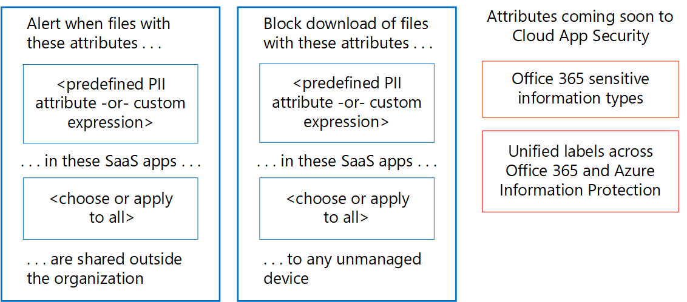

# Controleer op lekken van persoonlijke gegevensMonitor for leaks of personal data

[!INCLUDE [Microsoft 365 Defender rebranding](../includes/microsoft-defender-for-office.md)]

Er zijn veel hulpmiddelen die kunnen worden gebruikt om het gebruik en het transport van persoonlijke gegevens te bewaken.There are many tools that can be used to monitor the use and transport of personal data. Dit onderwerp beschrijft drie hulpmiddelen die goed werken.This topic describes three tools that work well.

In de afbeelding:In the illustration:

- Begin met Microsoft 365-rapporten voor preventie van gegevensverlies voor het bewaken van persoonlijke gegevens in SharePoint Online, OneDrive voor Bedrijven en e-mail in transit.Start with Microsoft 365 data loss prevention reports for monitoring personal data in SharePoint Online, OneDrive for Business, and email in transit. Deze rapporten geven het grootste detailniveau voor het bewaken van persoonlijke gegevens.These reports provide the greatest level of detail for monitoring personal data. Deze rapporten bevatten echter niet alle services in Office 365.However, these reports don't include all services in Office 365.

- Gebruik vervolgens waarschuwingsbeleid en het controlelogboek om de activiteit in alle services te controleren.Next, use alert policies and the audit log to monitor activity across services. Stel doorlopende bewaking in of doorzoek het auditlogboek om een incident te onderzoeken.Set up ongoing monitoring or search the audit log to investigate an incident. Het auditlogboek werkt in alle services - Sway, Power BI, eDiscovery, Dynamics 365, Microsoft Flow, Microsoft Teams, Beheerdersactiviteit, OneDrive voor Bedrijven, SharePoint Online, mail in transit en postvakken in rust.The audit log works across services—Sway, Power BI, eDiscovery, Dynamics 365, Microsoft Flow, Microsoft Teams, Admin activity, OneDrive for Business, SharePoint Online, mail in transit, and mailboxes at rest. Skype-gesprekken worden in de mailboxen in rust opgenomen.Skype conversations are included in mailboxes at rest.

- Ten slotte kunt u Microsoft Cloud App Security gebruiken om bestanden met gevoelige gegevens in andere SaaS-providers te bewaken.Finally, Use Microsoft Cloud App Security to monitor files with sensitive data in other SaaS providers. Binnenkort is het mogelijk om gevoelige informatietypen en geïntegreerde labels te gebruiken voor Azure Information Protection en Office met Cloud app Security.Coming soon is the ability to use sensitive information types and unified labels across Azure Information Protection and Office with Cloud App Security. U kunt beleid instellen dat van toepassing is op al uw SaaS-apps of specifieke apps (zoals Box).You can set up policies that apply to all of your SaaS apps or specific apps (like Box). Cloud App Security vindt geen bestanden in Exchange Online, inclusief bestanden die zijn bijgevoegd bij e-mail.Cloud App Security doesn't discover files in Exchange Online, including files attached to email.

## Rapporten voor preventie van gegevensverliesData loss prevention reports

Nadat u uw DLP-beleid (Data Loss Prevention) heeft gemaakt, moet u controleren of het werkt zoals u het bedoeld heeft en of het u helpt om aan de regels te blijven voldoen.After you create your data loss prevention (DLP) policies, you'll want to verify that they're working as you intended and helping you to stay compliant. Met de DLP-rapporten in Office 365 kunt u snel het aantal DLP-beleidsovereenkomsten, onderdrukkingen of foutieve positieven bekijken. Zie of ze in de loop van de tijd omhoog of omlaag gaan, filter het rapport op verschillende manieren en bekijk meer details door een punt op een lijn in de grafiek te selecteren.With the DLP reports in Office 365, you can quickly view the number of DLP policy matches, overrides, or false positives; see whether they're trending up or down over time; filter the report in different ways; and view more details by selecting a point on a line on the graph.

Met de DLP-rapporten kunt u het volgende doen:You can use the DLP reports to:

- Focus op specifieke tijdsperiodes en begrijp de redenen voor pieken en trends.Focus on specific time periods and understand the reasons for spikes and trends.

- Ontdek bedrijfsprocessen die strijdig zijn met het DLP-beleid van uw organisatie.Discover business processes that violate your organization's DLP policies.

- Begrijp de zakelijke impact van het DLP-beleid.Understand any business impact of the DLP policies.

- Bekijk de redenen die door gebruikers zijn ingediend bij het oplossen van een beleidstip door het beleid te negeren of een fout-positief te melden.View the justifications submitted by users when they resolve a policy tip by overriding the policy or reporting a false positive.

- Controleer de naleving van een specifiek DLP-beleid door alle overeenkomsten voor dat beleid weer te geven.Verify compliance with a specific DLP policy by showing any matches for that policy.

- Bekijk een lijst met bestanden met gevoelige gegevens die overeenkomen met uw DLP-beleid in het detailvenster.View a list of files with sensitive data that matches your DLP policies in the details pane.

Daarnaast kunt u met de DLP-rapporten uw DLP-beleid nauwkeurig afstemmen terwijl u ze in de testmodus uitvoert.In addition, you can use the DLP reports to fine-tune your DLP policies as you run them in test mode.

DLP-rapporten zijn te vinden in het beveiligingscentrum en het compliancecentrum.DLP reports are in the security center and the compliance center. Navigeer naar rapporten \> Rapporten weergeven.Navigate to Reports \> View reports. Ga onder preventie van gegevensverlies (DLP) naar DLP-beleid en regelovereenkomsten of DLP foute positieven en overschrijvingen.Under Data loss prevention (DLP), go to either DLP policy and rule matches or DLP false positives and overrides.

Zie [de rapporten weergeven voor preventie van gegevensverlies](https://docs.microsoft.com/microsoft-365/compliance/view-the-dlp-reports)voor meer informatie.For more information, see [View the reports for data loss prevention](https://docs.microsoft.com/microsoft-365/compliance/view-the-dlp-reports).

## controlelogboek en waarschuwingsbeleidaudit log and alert policies

Het auditlogboek bevat gebeurtenissen van Exchange Online, SharePoint Online, OneDrive voor Bedrijven, Azure Active Directory, Microsoft Teams, Power BI, Sway en andere services.The audit log contains events from Exchange Online, SharePoint Online, OneDrive for Business, Azure Active Directory, Microsoft Teams, Power BI, Sway, and other services.

Het beveiligingscentrum en het compliancecentrum bieden twee manieren om het auditlogboek te controleren en erover te rapporteren:The security center and compliance center provide two ways to monitor and report against the audit log:

- Waarschuwingsbeleid instellen, waarschuwingen bekijken en trends volgen - Gebruik het waarschuwingsbeleid en de dashboardinstrumenten in het beveiligingscentrum of het compliancecentrum.Set up alert policies, view alerts, and monitor trends—Use the alert policy and alert dashboard tools in either the security center or compliance center.

- Direct in het auditlogboek zoeken: Zoek naar alle gebeurtenissen in een gespecificeerd datumbereik.Search the audit log directly: Search for all events in a specified date rage. U kunt de resultaten ook filteren op basis van specifieke criteria, zoals de gebruiker die de actie heeft uitgevoerd, de actie of het doelobject.Or you can filter the results based on specific criteria, such as the user who performed the action, the action, or the target object.

Teams voor informatiebeveiliging en compliance kunnen deze hulpmiddelen gebruiken om proactief activiteiten te bekijken die worden uitgevoerd door zowel eindgebruikers als beheerders in services.Information security and compliance teams can use these tools to proactively review activities performed by both end users and administrators across services. Automatische waarschuwingen kunnen worden geconfigureerd om e-mailmeldingen te verzenden wanneer bepaalde activiteiten plaatsvinden op specifieke siteverzamelingen. Bijvoorbeeld wanneer inhoud wordt gedeeld van sites waarvan bekend is dat ze AVG-gerelateerde informatie bevatten.Automatic alerts can be configured to send email notifications when certain activities occur on specific site collections - for example when content is shared from sites known to contain GDPR-related information. Hierdoor kunnen deze teams gebruikers opvolgen om ervoor te zorgen dat het beveiligingsbeleid van het bedrijf wordt gevolgd of om aanvullende training te geven.This allows those teams to follow up with users to ensure that corporate security policies are followed, or to provide additional training.

Informatiebeveiligingsteams kunnen ook in het auditlogboek zoeken om vermoedelijke datalekken te onderzoeken en zowel de oorzaak als de omvang van de inbreuk te bepalen.Information security teams can also search the audit log to investigate suspected data breaches and determine both root cause and the extent of the breach. Deze ingebouwde mogelijkheid vergemakkelijkt de naleving van artikel 33 en 34 van de AVG, die vereisen dat binnen een bepaalde periode meldingen worden gedaan aan de toezichthoudende autoriteit en aan de betrokkenen zelf van een datalek.This built-in capability facilitates compliance with article 33 and 34 of the GDPR, which require notifications be provided to the GDPR supervisory authority and to the data subjects themselves of a data breach within a specific time period. Vermeldingen in het auditlogboek worden binnen de service slechts 90 dagen bewaard. Het wordt vaak aanbevolen en veel organisaties vereisen dat deze logboeken voor langere tijd worden bewaard.Audit log entries are only retained for 90 days within the service - it is often recommended and many organizations required that these logs be retained for longer periods of time.

Er zijn oplossingen beschikbaar die zich via de Microsoft Management Activity API abonneren op de Unified Audit Logs en die zowel logboekvermeldingen kunnen opslaan als geavanceerde dashboards en waarschuwingen kunnen bieden.Solutions are available that subscribe to the Unified Audit Logs through the Microsoft Management Activity API and can both store log entries as needed, and provide advanced dashboards and alerts. Een voorbeeld is [Microsoft Operations Management Suite (OMS)](https://docs.microsoft.com/azure/operations-management-suite/oms-solution-office-365).One example is [Microsoft Operations Management Suite (OMS)](https://docs.microsoft.com/azure/operations-management-suite/oms-solution-office-365).

Meer informatie over het waarschuwingsbeleid en het doorzoeken van het auditlogboek:More information about alert policies and searching the audit log:

- [Waarschuwingsbeleid in de beveiligings- en compliancecentra van Microsoft 365Alert policies in the Microsoft 365 security and compliance centers](https://docs.microsoft.com/microsoft-365/compliance/alert-policies)

- [Zoeken in het auditlogboek naar gebruikers- en beheerdersactiviteit in Office 365](https://docs.microsoft.com/microsoft-365/compliance/search-the-audit-log) (Inleiding)[Search the audit log for user and admin activity in Office 365](https://docs.microsoft.com/microsoft-365/compliance/search-the-audit-log) (introduction)

- [Auditlogboeken zoeken in- of uitschakelen](https://docs.microsoft.com/microsoft-365/compliance/turn-audit-log-search-on-or-off).[Turn audit log search on or off](https://docs.microsoft.com/microsoft-365/compliance/turn-audit-log-search-on-or-off)

- [Zoeken in het auditlogboekSearch the audit log](https://docs.microsoft.com/microsoft-365/compliance/search-the-audit-log-in-security-and-compliance)

- [Search-UnifiedAuditLog](https://docs.microsoft.com/powershell/module/exchange/search-unifiedauditlog) (cmdlet)[Search-UnifiedAuditLog](https://docs.microsoft.com/powershell/module/exchange/search-unifiedauditlog) (cmdlet)

- [Gedetailleerde eigenschappen in het auditlogboekDetailed properties in the audit log](https://docs.microsoft.com/microsoft-365/compliance/detailed-properties-in-the-office-365-audit-log)

## Microsoft Cloud App SecurityMicrosoft Cloud App Security

Met Microsoft Cloud App Security kunt u andere SaaS-apps ontdekken die worden gebruikt in uw netwerken en gevoelige gegevens die van en naar deze apps zijn verzonden.Microsoft Cloud App Security helps you discover other SaaS apps in use across your networks and sensitive data sent to and from these apps.

Microsoft Cloud App Security is een uitgebreide service die uitgebreide zichtbaarheid, gedetailleerde controle en verbeterde bescherming tegen bedreigingen biedt voor uw cloud-apps.Microsoft Cloud App Security is a comprehensive service providing deep visibility, granular controls, and enhanced threat protection for your cloud apps. Het identificeert meer dan 15.000 cloudtoepassingen in uw netwerk, vanaf alle apparaten, en biedt risicoanalyse en doorlopende risicobeoordeling en-analyse.It identifies more than 15,000 cloud applications in your network-from all devices-and provides risk scoring and ongoing risk assessment and analytics. Geen agents vereist: informatie verzameld uit uw firewalls en proxy's geeft u volledige zichtbaarheid en context voor het cloudgebruik en schaduw-IT.No agents required: information is collected from your firewalls and proxies to give you complete visibility and context for cloud usage and shadow IT.

Om uw cloudomgeving beter te begrijpen, biedt de Cloud App Security-onderzoeksfunctie uitgebreid inzicht in alle activiteiten, bestanden en accounts voor goedgekeurde en beheerde apps.To better understand your cloud environment, the Cloud App Security investigate feature provides deep visibility into all activities, files, and accounts for sanctioned and managed apps. U kunt gedetailleerde informatie op bestandsniveau verkrijgen en ontdekken waar gegevens naartoe gaan in de cloud-apps.You can gain detailed information on a file level and discover where data travels in the cloud apps.

De volgende illustratie toont bijvoorbeeld twee Cloud App Security-beleidsregels die kunnen helpen bij AVG.For examples, the following illustration demonstrates two Cloud App Security policies that can help with GDPR.

Het eerste beleid waarschuwt wanneer bestanden met een vooraf gedefinieerd PII-kenmerk of aangepaste expressie die u kiest, buiten de organisatie worden gedeeld vanuit de SaaS-apps die u kiest.The first policy alerts when files with a predefined PII attribute or custom expression that you choose is shared outside the organization from the SaaS apps that you choose.

Het tweede beleid blokkeert het downloaden van bestanden naar een onbeheerd apparaat.The second policy blocks downloads of files to any unmanaged device. U kiest de kenmerken in de bestanden waarnaar u wilt zoeken en de SaaS-apps waarop u het beleid wilt toepassen.You choose the attributes within the files to look for and the SaaS apps you want the policy to apply to.

Deze kenmerktypen komen binnenkort beschikbaar in Cloud App Security:These attribute types are coming soon to Cloud App Security:

- Gevoelige informatietypenSensitive information types
- Geïntegreerde labels in Microsoft 365 en Azure Information ProtectionUnified labels across Microsoft 365 and Azure Information Protection

### Cloud App Security-dashboardCloud App Security dashboard

Als u de Cloud App Security nog niet gebruikt, begint u met het starten van de app.If you haven't yet started to use Cloud App Security, begin by starting it up. Voor toegang tot Cloud App Security: <https://portal.cloudappsecurity.com>.To access Cloud App Security: <https://portal.cloudappsecurity.com>.

Opmerking: zorg ervoor dat u 'Bestanden automatisch scannen naar classificatielabels van Azure Information Protection' (in Algemene instellingen) inschakelt wanneer u aan de slag gaat met Cloud App Security of voordat u labels toewijst.Note: Be sure to enable 'Automatically scan files for Azure Information Protection classification labels' (in General settings) when getting started with Cloud App Security or before you assign labels. Na de installatie worden bestaande bestanden niet opnieuw gescand door Cloud App Security totdat ze worden gewijzigd.After setup, Cloud App Security does not scan existing files again until they are modified.

Meer informatie:More information:

- [Cloud App Security implementerenDeploy Cloud App Security](https://docs.microsoft.com/cloud-app-security/getting-started-with-cloud-app-security)

- [Meer informatie over Microsoft Cloud App SecurityMore information about Microsoft Cloud App Security](https://www.microsoft.com/cloud-platform/cloud-app-security)

- [Blokkeer downloads van gevoelige informatie met behulp van de Microsoft Cloud App Security-proxyBlock downloads of sensitive information using the Microsoft Cloud App Security proxy](https://docs.microsoft.com/cloud-app-security/use-case-proxy-block-session-aad)

## Voorbeeld van bestands- en activiteitenbeleid om het delen van persoonlijke gegevens te detecterenExample file and activity policies to detect sharing of personal data

### Het delen van bestanden met PII opsporen: creditcardnummerDetect sharing of files containing PII — Credit card number

Waarschuwen wanneer een bestand met een creditcardnummer wordt gedeeld vanuit een goedgekeurde cloud-app.Alert when a file containing a credit card number is shared from an approved cloud app.

****

|BesturingselementControl|InstellingenSettings|
|---|---|
|BeleidstypePolicy type|BestandsbeleidFile policy|
|BeleidssjabloonPolicy template|Geen sjabloonNo template|
|Ernst van beleidPolicy severity|HoogHigh|
|CategorieCategory|DLPDLP|
|FilterinstellingenFilter settings|Toegangsniveau = openbaar (internet), openbaar, externAccess level = Public (Internet), Public, External 
 App = \<select apps\> (gebruik deze instelling als je de bewaking wilt beperken tot specifieke SaaS-apps)App = \<select apps\> (use this setting if you want to limit monitoring to specific SaaS apps)|
|Toepassen opApply to|Alle bestanden, alle eigenarenAll files, all owners|
|InhoudsinspectieContent inspection|Bevat bestanden die voldoen aan een huidige expressie: alle landen: financiën: creditcardnummerIncludes files that match a present expression: All countries: Finance: Credit card number 
 Vereis geen relevante context: niet aangevinkt (deze instelling komt zowel overeen met trefwoorden als met regex)Don't require relevant context: unchecked (this setting will match keywords as well as regex) 
 Bevat bestanden met ten minste 1 overeenkomstIncludes files with at least 1 match 
 De laatste vier tekens van de fout opsporen: ingeschakeldUnmask the last 4 characters of the violation: checked|
|WaarschuwingenAlerts|Een waarschuwing maken voor elk overeenkomend bestand: ingeschakeldCreate an alert for each matching file: checked 
 Dagelijkse waarschuwingslimiet: 1000Daily alert limit: 1000 
 Een waarschuwing als e-mail selecteren: ingeschakeldSelect an alert as email: checked 
 Aan: infosec@contoso.comTo: infosec@contoso.com|
|BeheermodelGovernance|Microsoft OneDrive voor BedrijvenMicrosoft OneDrive for Business 
 Privé maken: vink Externe gebruikers verwijderen aan.Make private: check Remove External Users 
 Alle andere instellingen: uitgeschakeldAll other settings: unchecked 
 Microsoft SharePoint OnlineMicrosoft SharePoint Online 
 Privé maken: vink Externe gebruikers verwijderen aan.Make private: check Remove External Users 
 Alle andere instellingen: uitgeschakeldAll other settings: unchecked|
|

Vergelijkbare beleidsregels:Similar policies:

- Het delen van bestanden met PII-e-mailadres opsporenDetect sharing of Files containing PII - Email Address
- Het delen van bestanden met PII-paspoortnummer opsporenDetect sharing of Files containing PII - Passport Number

### Detecteer klant- of HR-gegevens in Box of OneDrive voor BedrijvenDetect Customer or HR Data in Box or OneDrive for Business

Waarschuwen wanneer een bestand met het label Klantgegevens of HR-gegevens wordt geüpload naar OneDrive voor Bedrijven of Box.Alert when a file labeled as Customer Data or HR Data is uploaded to OneDrive for Business or Box.

Opmerkingen:Notes:

- Voor het bewaken van Box moet een connector worden geconfigureerd met de API-connector SDK.Box monitoring requires a connector be configured using the API Connector SDK.
- Dit beleid vereist functies die momenteel in de preview-versie privé zijn.This policy requires capabilities that are currently in private preview.

****

|BesturingselementControl|InstellingenSettings|
|---|---|
|BeleidstypePolicy type|ActiviteitenbeleidActivity policy|
|BeleidssjabloonPolicy template|Geen sjabloonNo template|
|Ernst van beleidPolicy severity|HoogHigh|
|CategorieCategory|Besturingselement delenSharing Control|
|Reageren opAct on|Afzonderlijke activiteitSingle activity|
|FilterinstellingenFilter settings|Activiteitstype = bestand uploadenActivity type = Upload File 
 App = Microsoft OneDrive voor Bedrijven en BoxApp = Microsoft OneDrive for Business and Box 
 Classificatielabel (momenteel in privépreview): Azure Information Protection = klantgegevens, personeelszaken (salarisgegevens, personeelszaken), werknemersgegevensClassification Label (currently in private preview): Azure Information Protection = Customer Data, Human Resources—Salary Data, Human Resources—Employee Data|
|WaarschuwingenAlerts|Een waarschuwing maken: ingeschakeldCreate an alert: checked 
 Dagelijkse waarschuwingslimiet: 1000Daily alert limit: 1000 
 Een waarschuwing als e-mail selecteren: ingeschakeldSelect an alert as email: checked 
 Aan: infosec@contoso.comTo: infosec@contoso.com|
|BeheermodelGovernance|Alle appsAll apps 
 Gebruiker in quarantaine plaatsen: ingeschakeldPut user in quarantine: check 
 Alle andere instellingen: uitgeschakeldAll other settings: unchecked 
 Office 365Office 365 
 Gebruiker in quarantaine plaatsen: ingeschakeldPut user in quarantine: check 
 Alle andere instellingen: uitgeschakeldAll other settings: unchecked|
|

Vergelijkbare beleidsregels:Similar policies:

- Detecteer grote downloads van klantgegevens of HR-gegevens - Waarschuw wanneer een groot aantal bestanden met klantgegevens of HR-gegevens in een korte periode wordt gedownload door een enkele gebruiker.Detect large downloads of Customer data or HR Data—Alert when a large number of files containing customer data or HR data have been detected being downloaded by a single user within a short period of time.
- Detecteer het delen van klant- en HR-gegevens - Waarschuw wanneer bestanden met klant- of HR-gegevens worden gedeeld.Detect Sharing of Customer and HR Data—Alert when files containing Customer or HR Data are shared.
