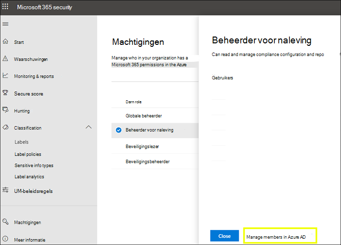

# Machtigingen in het Microsoft 365-compliancecentrum en het Microsoft 365-beveiligingscentrum

[!INCLUDE [Microsoft 365 Defender rebranding](../includes/microsoft-defender-for-office.md)]

Uw organisatie moet de beveiligings- en compliance-scenario's beheren met betrekking tot alle services van Microsoft 365. En u hebt de flexibiliteit nodig om de juiste beheerdersmachtigingen aan de juiste personen in de IT-groep van uw organisatie te geven. Via het Microsoft 365-beveiligingscentrum of het Microsoft 365-compliancecentrum kunt u machtigingen centraal beheren voor alle taken die zijn gerelateerd aan beveiliging of naleving.

Nadat de globale beheerder deze beheerdersrollen heeft toegewezen, hebben de beheerders toegang tot de functies en gegevens van alle services in Microsoft 365, zoals Microsoft 365-beveiligingscentrum, Microsoft 365-compliancecentrum, Azure, Office 365 en Enterprise Mobility + Security.

## Wat zijn de Microsoft 365-rollen?

De rollen die worden weergegeven in het Microsoft 365-compliancecentrum en het Microsoft 365-beveiligingscentrum zijn Azure Active Directory-rollen. Deze rollen zijn ontworpen om te worden samengevoegd met functies in de IT-groep van uw organisatie, zodat u een persoon gemakkelijk alle benodigde machtigingen kunt geven om hun werk te doen.

****

|Rol|Beschrijving|
|---|---|
|**Globale beheerder**|Gebruikers met deze rol hebben toegang tot alle beheerfuncties in alle Microsoft 365-services. Alleen globale beheerders kunnen andere beheerdersrollen toewijzen.|
|**Beheerder van nalevings-gegevens**|Gebruikers met deze rol kunnen de gegevens van uw organisatie bijhouden in Microsoft 365, zorgen ervoor dat de organisatie is beveiligd en krijgen inzicht in eventuele problemen om risico's te beperken.|
|**Beheerder voor naleving**|Gebruikers met deze rol kunnen uw organisatie helpen bij de naleving van wettelijke vereisten, het beheren van eDiscovery-aanvragen en het beheren van beleidsregels voor gegevensbeheer met betrekking tot Microsoft 365-locaties, -identiteiten en -apps.|
|**Beveiligingsoperator**|Gebruikers met deze rol kunnen actieve bedreigingen van uw Microsoft 365-gebruikers, -apparaten en -inhoud bekijken, onderzoeken en oplossen.|
|**Beveiligingslezer**|Gebruikers met deze rol kunnen actieve bedreigingen voor uw Microsoft 365-gebruikers, -apparaten en -inhoud weergeven en onderzoeken, maar zijn (in tegenstelling tot de beveiligingsoperator) niet gemachtigd om te reageren door actie te ondernemen.|
|**Beveiligingsbeheerder**|Gebruikers met deze rol kunnen de algehele beveiliging van uw organisatie controleren door beveiligingsbeleid te beheren, de beveiligingsanalyse en rapporten in de Microsoft 365-producten te evalueren en op de hoogte te blijven van mogelijke dreigingen.|
|

## Waar hebben de Microsoft 365-rollen toegang tot?

Hier vindt u de beschikbare rollen en wat personen in deze rollen kunnen doen.

### Globale beheerder

Gebruikers met deze rol hebben toegang tot alle administratieve functies in Azure Active Directory, alsook services die gebruikmaken van Azure Active Directory-identiteiten, zoals Microsoft 365-beveiligingscentrum, Microsoft 365-compliancecentrum, Exchange Online, SharePoint Online en Skype voor Bedrijven Online. De persoon die zich aanmeldt voor de Azure Active Directory-Tenant, wordt een globale beheerder. Alleen globale beheerders kunnen andere beheerdersrollen toewijzen. Er kunnen meerdere globale beheerders zijn binnen uw bedrijf. Globale beheerders kunnen het wachtwoord voor elke gebruiker en andere beheerders opnieuw instellen.

### Beheerder voor naleving

Gebruikers met deze rol hebben machtigingen voor het beheren van nalevingsfuncties in het Microsoft 365-compliancecentrum, het Microsoft 365-beheercentrum, Azure en Beveiligings- en compliancecentrum. Gebruikers kunnen ook alle functies van het Exchange-beheercentrum en Teams & Skype voor Bedrijven-beheercentrum beheren en ondersteuningstickets maken voor Azure en Microsoft 365.

****

|In deze service...|De beheerder voor naleving kan...|
|---|---|
|[**Microsoft 365-compliancecentrum**](https://compliance.microsoft.com/)|De gegevens van uw organisatie in Microsoft 365-services beheren en beschermen.    Nalevingswaarschuwingen beheren.|
|[**Compliancebeheer**](https://docs.microsoft.com/microsoft-365/compliance/compliance-manager)|De wettelijke nalevingsactiviteiten van uw organisatie bijhouden, toewijzen en verifiëren.|
|[**Beveiligings- en compliancecentrum**](https://docs.microsoft.com/microsoft-365/admin/add-users/about-admin-roles)|Gegevensbeheer uitvoeren.    Wettelijke en gegevensonderzoeken uitvoeren.    Verzoeken van gegevenssubjecten beheren.|
|[**Intune**](https://docs.microsoft.com/intune/role-based-access-control)|Alle audit-gegevens van Intune weergeven.|
|[**Cloud App Security**](https://docs.microsoft.com/cloud-app-security/manage-admins)|Heeft alleen-lezen machtigingen en kan waarschuwingen beheren.    Kan bestandsbeleid maken en wijzigen en handelingen voor het beheren van bestanden goedkeuren.    Kan alle ingebouwde rapporten bekijken bij Gegevensbeheer.|
|

### Beheerder van nalevingsgegevens

Gebruikers met deze rol hebben machtigingen om gegevens te beveiligen en te volgen in het Microsoft 365-compliancecentrum, het Microsoft 365-beheercentrum en Azure. Gebruikers kunnen ook alle functies van het Exchange-beheercentrum, Compliancebeheer en Teams & Skype voor Bedrijven-beheercentrum beheren en ondersteuningstickets maken voor Azure en Microsoft 365.

****

|In deze service...|De gegevensbeheerder voor naleving kan...|
|---|---|
|[**Microsoft 365-compliancecentrum**](https://compliance.microsoft.com/)|De gegevens van uw organisatie in Microsoft 365-services beheren en beschermen.    Nalevingswaarschuwingen beheren.    Gevoeligheidslabels beheren|
|[**Compliancebeheer**](https://docs.microsoft.com/microsoft-365/compliance/compliance-manager)|De wettelijke nalevingsactiviteiten van uw organisatie bijhouden, toewijzen en verifiëren.|
|[**Beveiligings- en compliancecentrum**](https://docs.microsoft.com/microsoft-365/admin/add-users/about-admin-roles)|Gegevensbeheer uitvoeren.    Wettelijke en gegevensonderzoeken uitvoeren.    Verzoeken van gegevenssubjecten beheren.    Gevoeligheidslabels beheren|
|[**Intune**](https://docs.microsoft.com/intune/role-based-access-control) (binnenkort beschikbaar)|Alle audit-gegevens van Intune weergeven.|
|[**Cloud App Security**](https://docs.microsoft.com/cloud-app-security/manage-admins)|Alleen-lezen machtigingen gebruiken om informatie te bekijken.  Waarschuwingen beheren.    Bestandsbeleid maken en wijzigen en handelingen voor het beheren van bestanden goedkeuren.    Alle ingebouwde rapporten bij Gegevensbeheer bekijken.|
|

### Beveiligingsbeheerder

Gebruikers met deze rol hebben machtigingen voor het beheren van beveiligingsfuncties in het Microsoft 365-beveiligingscentrum, Azure Active Directory Identity Protection, Azure Information Protection en Beveiligings- en compliancecentrum.

****

|In deze service...|De beveiligingsbeheerder kan...|
|---|---|
|[**Microsoft 365-beveiligingscentrum**](https://security.microsoft.com/)|Beveiligingsbeleid van de Microsoft 365-services controleren.     Beveiligingsbedreigingen en -meldingen beheren.    Rapporten bekijken.    Gevoeligheidslabels beheren.|
|**Identity Protection Center**|Doe alles wat de Beveiligingslezer kan, plus voer alle Identity Protection Center-werkzaamheden uit, met uitzondering van het opnieuw instellen van wachtwoorden.|
|[**Privileged Identity Management**](https://docs.microsoft.com/azure/active-directory/privileged-identity-management/pim-configure)|Doe alles wat de Beveiligingslezer kan.    **Kan** geen functietoewijzingen of -instellingen in Azure AD beheren.|
|[**Beveiligings- en compliancecentrum**](https://docs.microsoft.com/microsoft-365/admin/add-users/about-admin-roles)|Beveiligingsbeleid beheren.    Beveiligingsrisico's bekijken, onderzoeken en oplossen    Rapporten bekijken.    Gevoeligheidslabels beheren.|
|**Microsoft Defender for Identity**|Toezicht houden op verdachte beveiligingsactiviteiten en hierop reageren.|
|**Microsoft Defender voor Eindpunt en EDR**|Rollen toewijzen.    Machinegroepen beheren.    Bedreigingsdetectie en automatisch herstel van eindpunten configureren.    Meldingen bekijken, onderzoeken en hierop reageren.|
|[**Intune**](https://docs.microsoft.com/intune/role-based-access-control)|Informatie over gebruikers, apparaten, implementatie, configuratie en toepassingen bekijken.    **Kan** geen wijzigingen doorvoeren in Intune.|
|[**Cloud App Security**](https://docs.microsoft.com/cloud-app-security/manage-admins)|Beheerders, beleid en instellingen toevoegen, logboeken uploaden en beheeracties uitvoeren.|
|[**Azure Defender**](https://docs.microsoft.com/azure/role-based-access-control/built-in-roles) (binnenkort beschikbaar)|Beveiligingsbeleid en beveiligingsstatus bekijken, beveiligingsbeleid bewerken, meldingen en aanbevelingen bekijken en meldingen en aanbevelingen verwijderen.|
|[**Office 365-servicestatus**](https://docs.microsoft.com/microsoft-365/enterprise/view-service-health)|De status van Office 365-services bekijken.|
|

### Beveiligingsoperator

Gebruikers met deze rol kunnen meldingen beheren en hebben globale alleen-lezentoegang tot beveiligingsfuncties, inclusief alle informatie in het Microsoft 365-beveiligingscentrum, Azure Active Directory, Identity Protection, Privileged Identity Management, alsook de mogelijkheid om aanmeldingsrapporten en auditlogboeken van Azure Active Directory te lezen en toegang te krijgen tot het Beveiligings- en compliancecentrum.

****

|In deze service...|De beveiligingsoperator kan...|
|---|---|
|[**Microsoft 365-beveiligingscentrum**](https://security.microsoft.com/)|Doe alles wat de Beveiligingslezer kan.    Beveiligingsrisico's bekijken, onderzoeken en oplossen.|
|**Identity Protection Center** (binnenkort beschikbaar)|Doe alles wat de Beveiligingslezer kan.|
|[**Privileged Identity Management**](https://docs.microsoft.com/azure/active-directory/privileged-identity-management/pim-configure)|Doe alles wat de Beveiligingslezer kan.|
|[**Beveiligings- en compliancecentrum**](https://docs.microsoft.com/microsoft-365/admin/add-users/about-admin-roles)|Doe alles wat de Beveiligingslezer kan.    Beveiligingsrisico's bekijken, onderzoeken en oplossen|
|**Microsoft Defender voor Eindpunt en EDR**|Doe alles wat de Beveiligingslezer kan.    Meldingen bekijken, onderzoeken en hierop reageren.|
|[**Intune**](https://docs.microsoft.com/intune/role-based-access-control)|Informatie over gebruikers, apparaten, implementatie, configuratie en toepassingen bekijken.    **Kan** geen wijzigingen doorvoeren in Intune.|
|[**Cloud App Security**](https://docs.microsoft.com/cloud-app-security/manage-admins)|Doe alles wat de Beveiligingslezer, plus meldingen bekijken en verwijderen.|
|[**Office 365-servicestatus**](https://docs.microsoft.com/microsoft-365/enterprise/view-service-health)|De status van Office 365-services bekijken.|
|

### Beveiligingslezer

Gebruikers met deze rol hebben globale alleen-lezentoegang tot beveiligingsfuncties, inclusief alle informatie in het Microsoft 365-beveiligingscentrum, Azure Active Directory, Identity Protection, Privileged Identity Management, alsook de mogelijkheid om aanmeldingsrapporten en auditlogboeken van Azure Active Directory te lezen en toegang te krijgen tot het Beveiligings- en compliancecentrum.

****

|In deze service...|De beveiligingslezer kan...|
|---|---|
|[**Microsoft 365-beveiligingscentrum**](https://security.microsoft.com/)|Beveiligingsbeleid van de Microsoft 365-services bekijken.    Beveiligingsbedreigingen en -meldingen bekijken.    Rapporten bekijken.|
|**Identity Protection Center**|Alle beveiligingsrapporten en informatie over instellingen van beveiligingsfuncties lezen: anti-spam, versleuteling, preventie van gegevensverlies (DLP), anti-malware, Defender voor Office 365, anti-phishing en regels voor e-mailstroom (ook wel transportregels genoemd).|
|[**Privileged Identity Management**](https://docs.microsoft.com/azure/active-directory/privileged-identity-management/pim-configure)|Alleen-lezentoegang gebruiken om alle informatie in Azure AD PIM te bekijken: beleid en rapporten voor Azure AD-roltoewijzingen, beveiligingscontroles en (in de toekomst) beleidsgegevens en -rapporten voor andere scenario's dan Azure AD-roltoewijzing.    **Kan** niet aanmelden bij Azure AD PIM of hier wijzigingen aanbrengen. In het PIM-portal of via PowerShell kan iemand in deze rol extra rollen activeren (bijvoorbeeld globale beheerder of beheerder van rolbevoegdheden), als de gebruiker hiervoor in aanmerking komt.|
|[**Beveiligings- en compliancecentrum**](https://docs.microsoft.com/microsoft-365/admin/add-users/about-admin-roles)|Beveiligingsbeleid bekijken.    Beveiligingsrisico's bekijken en onderzoeken.    Rapporten bekijken.|
|**Microsoft Defender voor Eindpunt en EDR**|Meldingen bekijken en onderzoeken.|
|[**Intune**](https://docs.microsoft.com/intune/role-based-access-control)|Informatie over gebruikers, apparaten, implementatie, configuratie en toepassingen bekijken.    **Kan** geen wijzigingen doorvoeren in Intune.|
|[**Cloud App Security**](https://docs.microsoft.com/cloud-app-security/manage-admins)|Alleen-lezen machtigingen gebruiken om informatie te bekijken.    Waarschuwingen beheren.|
|[**Azure Defender**](https://docs.microsoft.com/azure/role-based-access-control/built-in-roles)|Aanbevelingen en meldingen bekijken.    Beveiligingsbeleid bekijken.    Beveiligingsstatus bekijken, maar geen wijzigingen aanbrengen.|
|[**Office 365-servicestatus**](https://docs.microsoft.com/microsoft-365/enterprise/view-service-health)|De status van Office 365-services bekijken.|
|

## Globale beheerders kunnen rollen beheren in Azure Active Directory

Wanneer u in het Microsoft 365-compliancecentrum en het Microsoft 365-beveiligingscentrum een rol selecteert, kunt u de bijbehorende toewijzingen bekijken. Als u deze toewijzingen echter wilt beheren, moet u naar de Azure Active Directory gaan.

Zie [Beheerdersrollen bekijken en toewijzen in Azure Active Directory](https://docs.microsoft.com/azure/active-directory/users-groups-roles/directory-manage-roles-portal) voor meer informatie.

## Rollen in een service beheren in plaats van Azure Active Directory

De rollen die worden weergegeven in het Microsoft 365-compliancecentrum en het Microsoft 365-beveiligingscentrum, worden ook weergegeven in de services waar ze machtigingen hebben. Zo kunt u deze rollen bijvoorbeeld zien in het Beveiligings- en compliancecentrum.

### Overname doorbreken

Het is belangrijk om te weten dat u deze rollen in Azure Active Directory centraal beheert voor **alle** Microsoft 365-services. Wanneer u echter een rol in een specifieke service beheert, zoals het Beveiligings- en compliancecentrum, beheert u de rol **alleen** voor die specifieke service. De toewijzingen en machtigingen voor een rol in een service vervangen alle machtigingen die zijn verleend aan de Azure Active Directory-rol.

Dit kan nuttig zijn - wanneer een persoon bijvoorbeeld wordt toegewezen aan de rol van beveiligingsbeheerder, is deze persoon niet gemachtigd om incidenten te beheren. Maar u kunt de machtigingen in Microsoft Defender voor Eindpunt gebruiken om hen de specifieke machtiging voor het beheren van incidenten in die service te geven.

## Waar vind ik informatie over rollen voor elke Microsoft 365-service?

Als u een gebruiker toewijst aan een van de beheerdersrollen voor naleving of beveiliging in Microsoft 365, geeft u die gebruiker machtigingen voor een aantal Microsoft 365-services. Gebruik de onderstaande links voor meer informatie over de specifieke machtigingen voor een rol in elke service.

****

|Microsoft 365-service|Informatie over rollen|
|---|---|
|Beheerdersrollen in abonnementen voor Office 365- en Microsoft 365 voor Bedrijven|[Microsoft 365-beheersrollen](https://docs.microsoft.com/microsoft-365/admin/add-users/about-admin-roles?view=o365-worldwide)|
|Azure Active Directory (Azure AD) en Azure AD Identity Protection|[Azure AD-beheerdersrollen](https://docs.microsoft.com/azure/active-directory/users-groups-roles/directory-assign-admin-roles)|
|Microsoft Defender for Identity|[Microsoft Defender for Identity-rolgroepen](https://docs.microsoft.com/azure-advanced-threat-protection/atp-role-groups)|
|Azure Information Protection|[Azure AD-beheerdersrollen](https://docs.microsoft.com/azure/active-directory/users-groups-roles/directory-assign-admin-roles)|
|Compliancebeheer|[Compliancebeheer](https://docs.microsoft.com/microsoft-365/compliance/compliance-manager-setup#set-user-permissions-and-assign-roles)|
|Exchange Online|[Toegangsbeheer in Exchange op basis van rollen](https://docs.microsoft.com/exchange/understanding-role-based-access-control-exchange-2013-help)|
|Intune|[Toegangsbeheer in Intune op basis van rollen](https://docs.microsoft.com/intune/role-based-access-control)|
|Managed Desktop|[Azure AD-beheerdersrollen](https://docs.microsoft.com/azure/active-directory/users-groups-roles/directory-assign-admin-roles)|
|Microsoft Cloud App Security|[Toegangsbeheer op basis van rollen](https://docs.microsoft.com/cloud-app-security/manage-admins)|
|Beveiligings- en compliancecentrum|[Microsoft 365-beheersrollen](permissions-in-the-security-and-compliance-center.md)|
|Privileged Identity Management|[Azure AD-beheerdersrollen](https://docs.microsoft.com/azure/active-directory/users-groups-roles/directory-assign-admin-roles)|
|Secure Score|[Azure AD-beheerdersrollen](https://docs.microsoft.com/azure/active-directory/users-groups-roles/directory-assign-admin-roles)|
|SharePoint Online|[Azure AD-beheerdersrollen](https://docs.microsoft.com/azure/active-directory/users-groups-roles/directory-assign-admin-roles)    [Over de SharePoint-beheerdersrollen in Office 365](https://docs.microsoft.com/sharepoint/sharepoint-admin-role)|
|Teams/Skype voor Bedrijven|[Azure AD-beheerdersrollen](https://docs.microsoft.com/azure/active-directory/users-groups-roles/directory-assign-admin-roles)|
|Microsoft Defender voor Eindpunt |[Op rollen gebaseerd Microsoft Defender voor Eindpunt-toegangsbeheer](https://docs.microsoft.com/windows/security/threat-protection/windows-defender-atp/rbac-windows-defender-advanced-threat-protection)|
|

## Wat wordt er binnenkort beschikbaar?

We werken nog steeds aan machtigingen in het Microsoft 365-compliancecentrum en Microsoft 365-beveiligingscentrum. Zo werken we momenteel bijvoorbeeld aan ondersteuning voor de mogelijkheid om:

- De rollen die worden weergegeven in het Microsoft 365-compliancecentrum en het Microsoft 365-beveiligingscentrum te beheren, in plaats van dat u naar het Azure Active Directory moet gaan.

- Rollen aan te passen door specifieke machtigingen toe te voegen of te verwijderen.

- Aangepaste rollen te maken met machtigingen die u zelf kiest.
