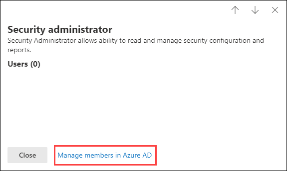

# Machtigingen in het Microsoft 365-compliancecentrum en het Microsoft 365-beveiligingscentrumPermissions in the Microsoft 365 compliance center and Microsoft 365 security center

Uw organisatie moet de beveiligings- en compliance-scenario's beheren met betrekking tot alle services van Microsoft 365.Your organization needs to manage security and compliance scenarios that span all the Microsoft 365 services. En u hebt de flexibiliteit nodig om de juiste beheerdersmachtigingen aan de juiste personen in de IT-groep van uw organisatie te geven.And you need the flexibility to give the right admin permissions to the right people in your organization's IT group. Via het Microsoft 365-beveiligingscentrum of het Microsoft 365-compliancecentrum kunt u machtigingen centraal beheren voor alle taken die zijn gerelateerd aan beveiliging of naleving.By using the Microsoft 365 security center or Microsoft 365 compliance center, you can manage permissions centrally for all tasks related to security or compliance.

Nadat de globale beheerder deze beheerdersrollen heeft toegewezen, hebben de beheerders toegang tot de functies en gegevens van alle services in Microsoft 365, zoals Microsoft 365-beveiligingscentrum, Microsoft 365-compliancecentrum, Azure, Office 365 en Enterprise Mobility + Security.After the global administrator assigns these admin roles, the admins have access to features and data that span all services in Microsoft 365, such as the Microsoft 365 security center, Microsoft 365 compliance center, Azure, Office 365, and Enterprise Mobility + Security.

## Wat zijn de Microsoft 365-rollen?What the Microsoft 365 roles are

De rollen die worden weergegeven in het Microsoft 365-compliancecentrum en het Microsoft 365-beveiligingscentrum zijn Azure Active Directory-rollen.The roles that appear in the Microsoft 365 compliance center and Microsoft 365 security center are Azure Active Directory roles. Deze rollen zijn ontworpen om te worden samengevoegd met functies in de IT-groep van uw organisatie, zodat u een persoon gemakkelijk alle benodigde machtigingen kunt geven om hun werk te doen.These roles are designed to align with job functions in your organization's IT group, making it easy to give a person all the permissions necessary to get their job done.

|**Rol****Role**|**Beschrijving****Description**|
|:-----|:-----|
|**Globale beheerder****Global administrator**|Gebruikers met deze rol hebben toegang tot alle beheerfuncties in alle Microsoft 365-services.Users with this role have access to all administrative features in all Microsoft 365 services. Alleen globale beheerders kunnen andere beheerdersrollen toewijzen.Only global administrators can assign other administrator roles.|
|**Beheerder van nalevings-gegevens****Compliance data administrator**|Gebruikers met deze rol kunnen de gegevens van uw organisatie bijhouden in Microsoft 365, zorgen ervoor dat de organisatie is beveiligd en krijgen inzicht in eventuele problemen om risico's te beperken.Users with this role can keep track of your organization's data across Microsoft 365, make sure it's protected, and get insights into any issues to help mitigate risks.|
|**Beheerder voor naleving****Compliance administrator**|Gebruikers met deze rol kunnen uw organisatie helpen bij de naleving van wettelijke vereisten, het beheren van eDiscovery-aanvragen en het beheren van beleidsregels voor gegevensbeheer met betrekking tot Microsoft 365-locaties, -identiteiten en -apps.Users with this role can help your organization stay compliant with any regulatory requirements, manage eDiscovery cases, and maintain data governance policies across Microsoft 365 locations, identities, and apps.|
|**Beveiligingsoperator****Security operator**|Gebruikers met deze rol kunnen actieve bedreigingen van uw Microsoft 365-gebruikers, -apparaten en -inhoud bekijken, onderzoeken en oplossen.Users with this role can view, investigate, and respond to active threats to your Microsoft 365 users, devices, and content.|
|**Beveiligingslezer****Security reader**|Gebruikers met deze rol kunnen actieve bedreigingen voor uw Microsoft 365-gebruikers, -apparaten en -inhoud weergeven en onderzoeken, maar zijn (in tegenstelling tot de beveiligingsoperator) niet gemachtigd om te reageren door actie te ondernemen.Users with this role can view and investigate active threats to your Microsoft 365 users, devices, and content, but (unlike the Security operator) they do not have permissions to respond by taking action.|
|**Beveiligingsbeheerder****Security administrator**|Gebruikers met deze rol kunnen de algehele beveiliging van uw organisatie controleren door beveiligingsbeleid te beheren, de beveiligingsanalyse en rapporten in de Microsoft 365-producten te evalueren en op de hoogte te blijven van mogelijke dreigingen.Users with this role can control your organization's overall security by managing security policies, reviewing security analytics and reports across Microsoft 365 products, and staying up-to-speed on the threat landscape.|

## Waar hebben de Microsoft 365-rollen toegang tot?What the Microsoft 365 roles have access to

Hier vindt u de beschikbare rollen en wat personen in deze rollen kunnen doen.Here are the available roles and what people assigned to them can do.

### Globale beheerderGlobal administrator

Gebruikers met deze rol hebben toegang tot alle administratieve functies in Azure Active Directory, alsook services die gebruikmaken van Azure Active Directory-identiteiten, zoals Microsoft 365-beveiligingscentrum, Microsoft 365-compliancecentrum, Exchange Online, SharePoint Online en Skype voor Bedrijven Online.Users with this role have access to all administrative features in Azure Active Directory, as well as services that use Azure Active Directory identities like Microsoft 365 security center, Microsoft 365 compliance center, Exchange Online, SharePoint Online, and Skype for Business Online. De persoon die zich aanmeldt voor de Azure Active Directory-Tenant, wordt een globale beheerder.The person who signs up for the Azure Active Directory tenant becomes a global administrator. Alleen globale beheerders kunnen andere beheerdersrollen toewijzen.Only global administrators can assign other administrator roles. Er kunnen meerdere globale beheerders zijn binnen uw bedrijf.There can be more than one global administrator at your company. Globale beheerders kunnen het wachtwoord voor elke gebruiker en andere beheerders opnieuw instellen.Global admins can reset the password for any user and all other administrators.

### Beheerder voor nalevingCompliance administrator

Gebruikers met deze rol hebben machtigingen voor het beheren van nalevingsfuncties in het Microsoft 365-compliancecentrum, het Microsoft 365-beheercentrum, Azure en Office 365-beveiligings- en compliancecentrum.Users with this role have permissions to manage compliance-related features in the Microsoft 365 compliance center, Microsoft 365 admin center, Azure, and Office 365 Security & Compliance Center. Gebruikers kunnen ook alle functies van het Exchange-beheercentrum en Teams & Skype voor Bedrijven-beheercentrum beheren en ondersteuningstickets maken voor Azure en Microsoft 365.Users can also manage all features within the Exchange admin center and Teams & Skype for Business admin center and create support tickets for Azure and Microsoft 365.

|**In deze service...****In this service...**|**Kan de beheerder voor naleving...****The compliance administrator can...**|
|:-----|:-----|
|[**Microsoft 365-compliancecentrum****Microsoft 365 compliance center**](https://compliance.microsoft.com/)|De gegevens van uw organisatie in Microsoft 365-services beheren en beschermen.Protect and manage your organization's data across Microsoft 365 services.    Nalevingswaarschuwingen beheren.Manage compliance alerts.|
|[**Compliance Score****Compliance Score**](https://docs.microsoft.com/office365/securitycompliance/meet-data-protection-and-regulatory-reqs-using-microsoft-cloud)|De wettelijke nalevingsactiviteiten van uw organisatie bijhouden, toewijzen en verifiëren.Track, assign, and verify your organization's regulatory compliance activities.|
|[**Office 365-beveiligings- en compliancecentrum****Office 365 Security & Compliance Center**](https://docs.microsoft.com/office365/admin/add-users/about-admin-roles)|Gegevensbeheer uitvoeren.Manage data governance.    Wettelijke en gegevensonderzoeken uitvoeren.Perform legal and data investigation.    Verzoeken van gegevenssubjecten beheren.Manage Data Subject Request.|
|[**Intune****Intune**](https://docs.microsoft.com/intune/role-based-access-control)|Alle audit-gegevens van Intune weergeven.View all Intune audit data.|
|[**Cloud App Security****Cloud App Security**](https://docs.microsoft.com/cloud-app-security/manage-admins)|Heeft alleen-lezen machtigingen en kan waarschuwingen beheren.Has read-only permissions and can manage alerts.    Kan bestandsbeleid maken en wijzigen en handelingen voor het beheren van bestanden goedkeuren.Can create and modify file policies and allow file governance actions.    Kan alle ingebouwde rapporten bekijken bij Gegevensbeheer.Can view all the built-in reports under Data Management.|

### Beheerder van nalevingsgegevensCompliance data administrator

Gebruikers met deze rol hebben machtigingen om gegevens te beveiligen en te volgen in het Microsoft 365-compliancecentrum, het Microsoft 365-beheercentrum en Azure.Users with this role have permissions to protect and track data in the Microsoft 365 compliance center, Microsoft 365 admin center, and Azure. Gebruikers kunnen ook alle functies van het Exchange-beheercentrum, Compliance Score en Teams & Skype voor Bedrijven-beheercentrum beheren en ondersteuningstickets maken voor Azure en Microsoft 365.Users can also manage all features within the Exchange admin center, Compliance Score, and Teams & Skype for Business admin center and create support tickets for Azure and Microsoft 365.

|**In deze service...****In this service...**|**Kan de beheerder van nalevingsgegevens...****The compliance data administrator can...**|
|:-----|:-----|
|[**Microsoft 365-compliancecentrum****Microsoft 365 compliance center**](https://compliance.microsoft.com/)|De gegevens van uw organisatie in Microsoft 365-services beheren en beschermen.Protect and manage your organization's data across Microsoft 365 services.    Nalevingswaarschuwingen beheren.Manage compliance alerts.    Gevoeligheidslabels beherenManage sensitivity labels|
|[**Compliance Score****Compliance Score**](https://docs.microsoft.com/office365/securitycompliance/meet-data-protection-and-regulatory-reqs-using-microsoft-cloud)|De wettelijke nalevingsactiviteiten van uw organisatie bijhouden, toewijzen en verifiëren.Track, assign, and verify your organization's regulatory compliance activities.|
|[**Office 365-beveiligings- en compliancecentrum****Office 365 Security & Compliance Center**](https://docs.microsoft.com/office365/admin/add-users/about-admin-roles)|Gegevensbeheer uitvoeren.Manage data governance.    Wettelijke en gegevensonderzoeken uitvoeren.Perform legal and data investigation.    Verzoeken van gegevenssubjecten beheren.Manage Data Subject Request.    Gevoeligheidslabels beherenManage sensitivity labels|
|[**Intune**](https://docs.microsoft.com/intune/role-based-access-control) (binnenkort beschikbaar)[**Intune**](https://docs.microsoft.com/intune/role-based-access-control) (coming soon)|Alle audit-gegevens van Intune weergeven.View all Intune audit data.|
|[**Cloud App Security****Cloud App Security**](https://docs.microsoft.com/cloud-app-security/manage-admins)|Alleen-lezen machtigingen gebruiken om informatie te bekijken.Use read-only permissions to view information.  Waarschuwingen beheren.Manage alerts.    Bestandsbeleid maken en wijzigen en handelingen voor het beheren van bestanden goedkeuren.Create and modify file policies and allow file governance actions.    Alle ingebouwde rapporten bij Gegevensbeheer bekijken.View all the built-in reports under Data Management.|

### BeveiligingsbeheerderSecurity administrator

Gebruikers met deze rol hebben machtigingen voor het beheren van beveiligingsfuncties in het Microsoft 365-beveiligingscentrum, Azure Active Directory Identity Protection, Azure Information Protection en Office 365-beveiligings- en compliancecentrum.Users with this role have permissions to manage security-related features in the Microsoft 365 security center, Azure Active Directory Identity Protection, Azure Information Protection, and Office 365 Security & Compliance Center.

|**In deze service...****In this service...**|**Kan de beveiligingsbeheerder...****The security administrator can...**|
|:-----|:-----|
|[**Microsoft 365-beveiligingscentrum****Microsoft 365 security center**](https://security.microsoft.com/)|Beveiligingsbeleid van de Microsoft 365-services controleren.Monitor security-related policies across Microsoft 365 services.     Beveiligingsbedreigingen en -meldingen beheren.Manage security threats and alerts.    Rapporten bekijken.View reports.    Gevoeligheidslabels beheren.Manage sensitivity labels.|
|**Identity Protection Center****Identity Protection Center**|Doe alles wat de Beveiligingslezer kan, plus voer alle Identity Protection Center-werkzaamheden uit, met uitzondering van het opnieuw instellen van wachtwoorden.Do everything the Security Reader role can, plus  perform all Identity Protection Center operations, except for reset passwords.|
|[**Privileged Identity Management****Privileged Identity Management**](https://docs.microsoft.com/azure/active-directory/privileged-identity-management/pim-configure)|Doe alles wat de Beveiligingslezer kan.Do everything the Security Reader role can.    **Kan** geen functietoewijzingen of -instellingen in Azure AD beheren.**Cannot** manage Azure AD role assignments or settings.|
|[**Office 365-beveiligings- en compliancecentrum****Office 365 Security & Compliance Center**](https://docs.microsoft.com/office365/admin/add-users/about-admin-roles)|Beveiligingsbeleid beheren.Manage security policies.    Beveiligingsrisico's bekijken, onderzoeken en oplossenView, investigate, and respond to security threats    Rapporten bekijken.View reports.    Gevoeligheidslabels beheren.Manage sensitivity labels.|
|**Azure Advanced Threat Protection****Azure Advanced Threat Protection**|Toezicht houden op verdachte beveiligingsactiviteiten en hierop reageren.Monitor and respond to suspicious security activity.|
|**Windows Defender ATP en EDR****Windows Defender ATP and EDR**|Rollen toewijzen.Assign roles.    Machinegroepen beheren.Manage machine groups.    Bedreigingsdetectie en automatisch herstel van eindpunten configureren.Configure endpoint threat detection and automated remediation.    Meldingen bekijken, onderzoeken en hierop reageren.View, investigate, and respond to alerts.|
|[**Intune****Intune**](https://docs.microsoft.com/intune/role-based-access-control)|Informatie over gebruikers, apparaten, implementatie, configuratie en toepassingen bekijken.Views user, device, enrollment, configuration, and application information.    **Kan** geen wijzigingen doorvoeren in Intune.**Cannot** make changes to Intune.|
|[**Cloud App Security****Cloud App Security**](https://docs.microsoft.com/cloud-app-security/manage-admins)|Beheerders, beleid en instellingen toevoegen, logboeken uploaden en beheeracties uitvoeren.Add admins, add policies and settings, upload logs and perform governance actions.|
|[**Azure Security Center**](https://docs.microsoft.com/azure/role-based-access-control/built-in-roles) (binnenkort beschikbaar)[**Azure Security Center**](https://docs.microsoft.com/azure/role-based-access-control/built-in-roles) (coming soon)|Beveiligingsbeleid en beveiligingsstatus bekijken, beveiligingsbeleid bewerken, meldingen en aanbevelingen bekijken en meldingen en aanbevelingen verwijderen.View security policies, view security states, edit security policies, view alerts and recommendations, dismiss alerts and recommendations.|
|[**Office 365-servicestatus****Office 365 service health**](https://docs.microsoft.com/office365/enterprise/view-service-health)|De status van Office 365-services bekijken.View the health of Office 365 services.|

### BeveiligingsoperatorSecurity operator

Gebruikers met deze rol kunnen meldingen beheren en hebben globale alleen-lezentoegang tot beveiligingsfuncties, inclusief alle informatie in het Microsoft 365-beveiligingscentrum, Azure Active Directory, Identity Protection, Privileged Identity Management, alsook de mogelijkheid om aanmeldingsrapporten en auditlogboeken van Azure Active Directory te lezen en toegang te krijgen tot het Office 365-beveiligings- en compliancecentrum.Users with this role can manage alerts and have global read-only access on security-related feature, including all information in the Microsoft 365 security center, Azure Active Directory, Identity Protection, Privileged Identity Management, as well as the ability to read Azure Active Directory sign-in reports and audit logs, and in Office 365 Security & Compliance Center.

|**In deze service...****In this service...**|**Kan de beveiligingsoperator...****The security operator can...**|
|:-----|:-----|
|[**Microsoft 365-beveiligingscentrum****Microsoft 365 security center**](https://security.microsoft.com/)|Doe alles wat de Beveiligingslezer kan.Do everything the Security Reader role can.    Beveiligingsrisico's bekijken, onderzoeken en oplossen.View, investigate, and respond to security alerts.|
|**Identity Protection Center** (binnenkort beschikbaar)**Identity Protection Center** (coming soon)|Doe alles wat de Beveiligingslezer kan.Do everything the Security Reader role can.|
|[**Privileged Identity Management****Privileged Identity Management**](https://docs.microsoft.com/azure/active-directory/privileged-identity-management/pim-configure)|Doe alles wat de Beveiligingslezer kan.Do everything the Security Reader role can.|
|[**Office 365-beveiligings- en compliancecentrum****Office 365 Security & Compliance Center**](https://docs.microsoft.com/office365/admin/add-users/about-admin-roles)|Doe alles wat de Beveiligingslezer kan.Do everything the Security Reader role can.    Beveiligingsrisico's bekijken, onderzoeken en oplossenView, investigate, and respond to security threats|
|**Windows Defender ATP en EDR****Windows Defender ATP and EDR**|Doe alles wat de Beveiligingslezer kan.Do everything the Security Reader role can.    Meldingen bekijken, onderzoeken en hierop reageren.View, investigate, and respond to alerts.|
|[**Intune****Intune**](https://docs.microsoft.com/intune/role-based-access-control)|Informatie over gebruikers, apparaten, implementatie, configuratie en toepassingen bekijken.Views user, device, enrollment, configuration, and application information.    **Kan** geen wijzigingen doorvoeren in Intune.**Cannot** make changes to Intune.|
|[**Cloud App Security****Cloud App Security**](https://docs.microsoft.com/cloud-app-security/manage-admins)|Doe alles wat de Beveiligingslezer, plus meldingen bekijken en verwijderen.Do everything the Security Reader role can, plus view and dismiss alerts.|
|[**Office 365-servicestatus****Office 365 service health**](https://docs.microsoft.com/office365/enterprise/view-service-health)|De status van Office 365-services bekijken.View the health of Office 365 services.|

### BeveiligingslezerSecurity reader

Gebruikers met deze rol hebben globale alleen-lezentoegang tot beveiligingsfuncties, inclusief alle informatie in het Microsoft 365-beveiligingscentrum, Azure Active Directory, Identity Protection, Privileged Identity Management, alsook de mogelijkheid om aanmeldingsrapporten en auditlogboeken van Azure Active Directory te lezen en toegang te krijgen tot het Office 365-beveiligings- en compliancecentrum.Users with this role have global read-only access on security-related feature, including all information in the Microsoft 365 security center, Azure Active Directory, Identity Protection, Privileged Identity Management, as well as the ability to read Azure Active Directory sign-in reports and audit logs, and in Office 365 Security & Compliance Center.

|**In deze service...****In this service...**|**Kan de beveiligingslezer...****The security reader can...**|
|:-----|:-----|
|[**Microsoft 365-beveiligingscentrum****Microsoft 365 security center**](https://security.microsoft.com/)|Beveiligingsbeleid van de Microsoft 365-services bekijken.View security-related policies across Microsoft 365 services.    Beveiligingsbedreigingen en -meldingen bekijken.View security threats and alerts.    Rapporten bekijken.View reports.|
|**Identity Protection Center****Identity Protection Center**|Alle beveiligingsrapporten en informatie over instellingen van beveiligingsfuncties lezen: anti-spam, versleuteling, preventie van gegevensverlies (DLP), anti-malware, Advanced Threat Protection (ATP), anti-phishing en regels voor e-mailstroom (ook wel transportregels genoemd).Read all security reports and settings information for security features: anti-spam, encryption, data loss prevention (DLP), anti-malware, Advanced Threat Protection (ATP), anti-phishing, and mail flow rules (also known as transport rules).|
|[**Privileged Identity Management****Privileged Identity Management**](https://docs.microsoft.com/azure/active-directory/privileged-identity-management/pim-configure)|Alleen-lezentoegang gebruiken om alle informatie in Azure AD PIM te bekijken: beleid en rapporten voor Azure AD-roltoewijzingen, beveiligingscontroles en (in de toekomst) beleidsgegevens en -rapporten voor andere scenario's dan Azure AD-roltoewijzing.Use read-only access to view all information surfaced in Azure AD PIM: Policies and reports for Azure AD role assignments, security reviews, and (in the future) policy data and reports for scenarios other than Azure AD role assignment.    **Kan** niet aanmelden bij Azure AD PIM of hier wijzigingen aanbrengen.**Cannot** sign up for Azure AD PIM or make any changes to it. In het PIM-portal of via PowerShell kan iemand in deze rol extra rollen activeren (bijvoorbeeld globale beheerder of beheerder van rolbevoegdheden), als de gebruiker hiervoor in aanmerking komt.In the PIM portal or via PowerShell, someone in this role can activate additional roles (for example, Global Admin or Privileged Role Administrator), if the user is a eligible for them.|
|[**Office 365-beveiligings- en compliancecentrum****Office 365 Security & Compliance Center**](https://docs.microsoft.com/office365/admin/add-users/about-admin-roles)|Beveiligingsbeleid bekijken.View security policies.    Beveiligingsrisico's bekijken en onderzoeken.View and investigate security threats.    Rapporten bekijken.View reports.|
|**Windows Defender ATP en EDR****Windows Defender ATP and EDR**|Meldingen bekijken en onderzoeken.View and investigate alerts.|
|[**Intune****Intune**](https://docs.microsoft.com/intune/role-based-access-control)|Informatie over gebruikers, apparaten, implementatie, configuratie en toepassingen bekijken.Views user, device, enrollment, configuration, and application information.    **Kan** geen wijzigingen doorvoeren in Intune.**Cannot** make changes to Intune.|
|[**Cloud App Security****Cloud App Security**](https://docs.microsoft.com/cloud-app-security/manage-admins)|Alleen-lezen machtigingen gebruiken om informatie te bekijken.Use read-only permissions to view information.    Waarschuwingen beheren.Manage alerts.|
|[**Azure Security Center****Azure Security Center**](https://docs.microsoft.com/azure/role-based-access-control/built-in-roles)|Aanbevelingen en meldingen bekijken.View recommendations and alerts.    Beveiligingsbeleid bekijken.View security policies.    Beveiligingsstatus bekijken, maar geen wijzigingen aanbrengen.View security states, but cannot make changes.|
|[**Office 365-servicestatus****Office 365 service health**](https://docs.microsoft.com/office365/enterprise/view-service-health)|De status van Office 365-services bekijken.View the health of Office 365 services.|

## Globale beheerders kunnen rollen beheren in Azure Active DirectoryGlobal administrators can manage roles in Azure Active Directory

Wanneer u in het Microsoft 365-compliancecentrum en het Microsoft 365-beveiligingscentrum een rol selecteert, kunt u de bijbehorende toewijzingen bekijken.In the Microsoft 365 compliance center and Microsoft 365 security center, when you select a role, you can view its assignments. Als u deze toewijzingen echter wilt beheren, moet u naar de Azure Active Directory gaan.But to manage those assignments, you need to go to the Azure Active Directory.

Zie [Beheerdersrollen bekijken en toewijzen in Azure Active Directory](https://docs.microsoft.com/azure/active-directory/users-groups-roles/directory-manage-roles-portal) voor meer informatie.For more information, see [View and assign administrator roles in Azure Active Directory](https://docs.microsoft.com/azure/active-directory/users-groups-roles/directory-manage-roles-portal).

## Rollen in een service beheren in plaats van Azure Active DirectoryManaging roles in a service instead of Azure Active Directory

De rollen die worden weergegeven in het Microsoft 365-compliancecentrum en het Microsoft 365-beveiligingscentrum, worden ook weergegeven in de services waar ze machtigingen hebben.The roles that appear in the Microsoft 365 compliance center and Microsoft 365 security center also appear in the services where they have permissions. Zo kunt u deze rollen bijvoorbeeld zien in het Office 365-beveiligings- en compliancecentrum.For example, you can see these roles in the Office 365 Security & Compliance Center.

### Overname doorbrekenBreaking inheritance

Het is belangrijk om te weten dat u deze rollen in Azure Active Directory centraal beheert voor **alle** Microsoft 365-services.It's important to understand that you when you manage these roles in Azure Active Directory, you're doing so centrally for **all** Microsoft 365 services. Wanneer u echter een rol in een specifieke service beheert, zoals het Office 365-beveiligings- en compliancecentrum, beheert u de rol **alleen** voor die specifieke service.However, when you manage a role in a specific service, such as the Office 365 Security & Compliance Center, you're managing the role for **only** that specific service. De toewijzingen en machtigingen voor een rol in een service vervangen alle machtigingen die zijn verleend aan de Azure Active Directory-rol.The assignments and permissions for a role in a service override any permissions granted to the Azure Active Directory role.

Dit kan nuttig zijn - wanneer een persoon bijvoorbeeld wordt toegewezen aan de rol van beveiligingsbeheerder, is deze persoon niet gemachtigd om incidenten te beheren.This can be useful – for example, if a person is assigned to the Security administrator role, they don't have permissions to manage incidents. Maar u kunt de machtigingen in Windows Defender Advanced Thread Protection gebruiken om hen de specifieke machtiging voor het beheren van incidenten in die service te geven.But you can use the permissions in Windows Defender Advanced Threat Protection to give them the specific permission for incident management in that service.

## Waar vind ik informatie over rollen voor elke Microsoft 365-service?Where to find role information for each Microsoft 365 service

Als u een gebruiker toewijst aan een van de beheerdersrollen voor naleving of beveiliging in Microsoft 365, geeft u die gebruiker machtigingen voor een aantal Microsoft 365-services.By assigning a user to one of the Microsoft 365 compliance or security admin roles, you give that user permissions to a range of Microsoft 365 services. Gebruik de onderstaande links voor meer informatie over de specifieke machtigingen voor een rol in elke service.Use the links below to find more information about the specific permissions for a role in each service.

|**Microsoft 365-service****Microsoft 365 service**|**Informatie over rollen****Role info**|
|:-----|:-----|
|Beheerdersrollen in abonnementen voor Office 365- en Microsoft 365 voor BedrijvenAdmin roles in Office 365 and Microsoft 365 business plans|[Office 365-beheerdersrollenOffice 365 admin roles](https://docs.microsoft.com/office365/admin/add-users/about-admin-roles?view=o365-worldwide)|
|Azure Active Directory (Azure AD) en Azure AD Identity ProtectionAzure Active Directory (Azure AD) and Azure AD Identity Protection|[Azure AD-beheerdersrollenAzure AD admin roles](https://docs.microsoft.com/azure/active-directory/users-groups-roles/directory-assign-admin-roles)|
|Azure Advanced Threat ProtectionAzure Advanced Threat Protection|[Azure ATP-rolgroepenAzure ATP role groups](https://docs.microsoft.com/azure-advanced-threat-protection/atp-role-groups)|
|Azure Information ProtectionAzure Information Protection|[Azure AD-beheerdersrollenAzure AD admin roles](https://docs.microsoft.com/azure/active-directory/users-groups-roles/directory-assign-admin-roles)|
|Compliance ScoreCompliance Score|[Compliance Score-rollenCompliance Score roles](https://docs.microsoft.com/microsoft-365/compliance/compliance-score-setup#set-user-permissions-and-assign-roles)|
|Exchange OnlineExchange Online|[Toegangsbeheer in Exchange op basis van rollenExchange role-based access control](https://docs.microsoft.com/exchange/understanding-role-based-access-control-exchange-2013-help)|
|IntuneIntune|[Toegangsbeheer in Intune op basis van rollenIntune role-based access control](https://docs.microsoft.com/intune/role-based-access-control)|
|Managed DesktopManaged Desktop|[Azure AD-beheerdersrollenAzure AD admin roles](https://docs.microsoft.com/azure/active-directory/users-groups-roles/directory-assign-admin-roles)|
|Microsoft Cloud App SecurityMicrosoft Cloud App Security|[Toegangsbeheer op basis van rollenRole-based access control](https://docs.microsoft.com/cloud-app-security/manage-admins)|
|Office 365-beveiligings- en compliancecentrumOffice 365 Security & Compliance Center|[Office 365-beheerdersrollenOffice 365 admin roles](https://docs.microsoft.com/office365/SecurityCompliance/permissions-in-the-security-and-compliance-center)|
|Privileged Identity ManagementPrivileged Identity Management|[Azure AD-beheerdersrollenAzure AD admin roles](https://docs.microsoft.com/azure/active-directory/users-groups-roles/directory-assign-admin-roles)|
|Secure ScoreSecure Score|[Azure AD-beheerdersrollenAzure AD admin roles](https://docs.microsoft.com/azure/active-directory/users-groups-roles/directory-assign-admin-roles)|
|SharePoint OnlineSharePoint Online|[Azure AD-beheerdersrollenAzure AD admin roles](https://docs.microsoft.com/azure/active-directory/users-groups-roles/directory-assign-admin-roles)    [Over de SharePoint-beheerdersrollen in Office 365About the SharePoint admin role in Office 365](https://docs.microsoft.com/sharepoint/sharepoint-admin-role)|
|Teams/Skype voor BedrijvenTeams/Skype for Business|[Azure AD-beheerdersrollenAzure AD admin roles](https://docs.microsoft.com/azure/active-directory/users-groups-roles/directory-assign-admin-roles)|
|Windows Defender Advanced Threat ProtectionWindows Defender Advanced Threat Protection|[Toegangsbeheer in Windows Defender ATP op basis van rollenWindows Defender ATP role-based access control](https://docs.microsoft.com/windows/security/threat-protection/windows-defender-atp/rbac-windows-defender-advanced-threat-protection)|

## Wat wordt er binnenkort beschikbaar?What is coming soon

We werken nog steeds aan machtigingen in het Microsoft 365-compliancecentrum en Microsoft 365-beveiligingscentrum.We're still working on permissions in the Microsoft 365 compliance center and Microsoft 365 security center. Zo werken we momenteel bijvoorbeeld aan ondersteuning voor de mogelijkheid om:For example, we're currently working on support for the ability to:

- De rollen die worden weergegeven in het Microsoft 365-compliancecentrum en het Microsoft 365-beveiligingscentrum te beheren, in plaats van dat u naar het Azure Active Directory moet gaan.Manage roles in the Microsoft 365 compliance center and Microsoft 365 security center, instead of going to Azure Active Directory.

- Rollen aan te passen door specifieke machtigingen toe te voegen of te verwijderen.Customize roles by adding or removing specific permissions.

- Aangepaste rollen te maken met machtigingen die u zelf kiest.Create custom roles with permissions that you choose.
