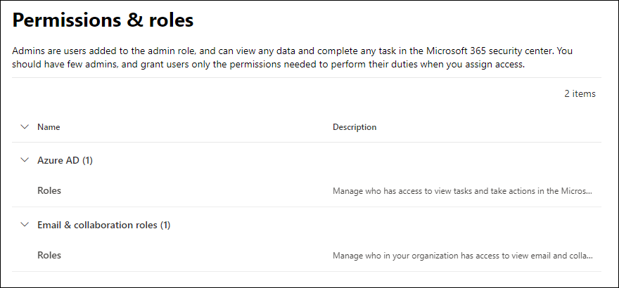

# Machtigingen in de Microsoft 365 Defender-portalPermissions in the Microsoft 365 Defender portal

[!INCLUDE [Microsoft 365 Defender rebranding](../includes/microsoft-defender-for-office.md)]

**Van toepassing op****Applies to**
- [Exchange Online ProtectionExchange Online Protection](exchange-online-protection-overview.md)
- [Abonnement 1 en abonnement 2 voor Microsoft Defender voor Office 365Microsoft Defender for Office 365 plan 1 and plan 2](defender-for-office-365.md)
- [Microsoft 365 DefenderMicrosoft 365 Defender](../defender/microsoft-365-defender.md)

U moet beveiligingsscenario's beheren voor alle Microsoft 365-services.You need to manage security scenarios that span all the Microsoft 365 services. En u hebt de flexibiliteit nodig om de juiste beheerdersmachtigingen aan de juiste personen uw organisatie te geven.And you need the flexibility to give the right admin permissions to the right people in your organization.

De Microsoft 365 Defender-portal op <https://security.microsoft.com> biedt ondersteuning voor het rechtstreeks beheren van machtigingen voor gebruikers die beveiligingstaken uitvoeren in Microsoft 365.The Microsoft 365 Defender portal at <https://security.microsoft.com> supports directly managing permissions for users who perform security tasks in Microsoft 365. Door de Microsoft 365 Defender-portal te gebruiken voor het beheren van machtigingen, kunt u machtigingen centraal beheren voor alle taken met betrekking tot beveiliging.By using the Microsoft 365 Defender portal to manage permissions, you can manage permissions centrally for all tasks related to security.

Ga naar **Machtigingen en rollen** of <https://security.microsoft.com/securitypermissions> om machtigingen in de Microsoft 365 Defender-portal te beheren.To manage permissions in the Microsoft 365 Defender portal, go to **Permissions & roles** or <https://security.microsoft.com/securitypermissions>. U moet een **globale beheerder** zijn of lid zijn van de rollengroep **Organisatiebeheer** in de Microsoft 365 Defender-portal.You need to be a **global administrator** or a member of the **Organization Management** role group in the Microsoft 365 Defender portal. Met name de rol **Rollenbeheer** stelt gebruikers in staat om rollengroepen in de Microsoft 365 Defender-portal te bekijken, te maken en te wijzigen. Standaard wordt die rol alleen toegewezen aan de rollengroep **Organisatiebeheer**.Specifically, the **Role Management** role allows users to view, create, and modify role groups in the Microsoft 365 Defender portal, and by default, that role is assigned only to the **Organization Management** role group.

> [!NOTE]
> Zie [Machtigingen in het Microsoft 365-compliancecentrum](../../compliance/microsoft-365-compliance-center-permissions.md) voor informatie over machtigingen in het Microsoft 365-compliancecentrum.For information about permissions in the Microsoft 365 compliance center, see [Permissions in the Microsoft 365 compliance center](../../compliance/microsoft-365-compliance-center-permissions.md).

## Relatie van leden, rollen en rollengroepenRelationship of members, roles, and role groups

Machtigingen in de Microsoft 365 Defender-portal zijn gebaseerd op het machtigingsmodel voor toegangsbeheer op basis van rollen (RBAC).Permissions in the Microsoft 365 Defender portal are based on the role-based access control (RBAC) permissions model. RBAC is hetzelfde machtigingsmodel dat wordt gebruikt door de meeste Microsoft 365-services. Als u bekend bent met de machtigingsstructuur in deze services, zal het verlenen van machtigingen in de Microsoft 365 Defender-portal u bekend voorkomen.RBAC is the same permissions model that's used by most Microsoft 365 services, so if you're familiar with the permission structure in these services, granting permissions in the Microsoft 365 Defender portal will be very familiar.

Een **rol** verleent de machtigingen om een reeks taken uit te voeren.A **role** grants the permissions to do a set of tasks.

Een **rollengroep** is een set rollen waarmee personen hun werk kunnen doen in de Microsoft 365 Defender-portal.A **role group** is a set of roles that lets people do their jobs in the Microsoft 365 Defender portal. De rollengroep Beheerders Aanvalssimulatie bevat bijvoorbeeld de rol Beheerder Aanvalssimulatie om alle aspecten van aanvalssimulatietraining te maken en te beheren.For example, the Attack Simulator Administrators role group includes the Attack Simulator Admin role to create and manage all aspects of attack simulation training.

De Microsoft 365 Defender-portal bevat standaard rollenroepen voor de meest voorkomende taken en functies die u moet toewijzen.The Microsoft 365 Defender portal includes default role groups for the most common tasks and functions that you'll need to assign. Over het algemeen raden we u aan alleen individuele gebruikers als **leden** aan de standaard rollengroepen toe te voegen.Generally, we recommend simply adding individual users as **members** to the default role groups.

## Rollen en rollengroepen in de Microsoft 365 Defender-portalRoles and role groups in the Microsoft 365 Defender portal

De volgende typen rollen en rollengroepen zijn beschikbaar in **Machtigingen en rollen** in de Microsoft 365 Defender-portal:The following types of roles and role groups are available in **Permissions & roles** in the Microsoft 365 Defender portalr:

- **Microsoft Azure Active Directory-rollen**: U kunt de rollen en toegewezen gebruikers weergeven, maar u kunt ze niet rechtstreeks in de Microsoft 365 Defender-portal beheren.**Azure AD roles**: You can view the roles and assigned users, but you can't manage them directly in the Microsoft 365 Defender portal. Azure AD-rollen zijn centrale rollen die machtigingen toewijzen voor **alle** Microsoft 365-services.Azure AD roles are central roles that assign permissions for **all** Microsoft 365 services.

- **E-mail- en samenwerkingsrollen**: dit zijn dezelfde rollengroepen die beschikbaar zijn in het Beveiligings- en compliancecentrum, maar u kunt ze rechtstreeks in de Microsoft 365 Defender-portal beheren.**Email & collaboration roles**: These are the same role groups that are available in the Security & Compliance Center, but you can manage them directly in the Microsoft 365 Defender portal. De machtigingen die u hier toewijst, zijn specifiek voor hde et Microsoft 365 Defender-portal, het Microsoft 365-compliancecentrum en het Beveiligings- en compliancecentrum. Ze omvatten niet alle machtigingen die nodig zijn in andere Microsoft 365-werkbelastingen.The permissions that you assign here are specific to the Microsoft 365 Defender portal, the Microsoft 365 compliance center, and the Security & Compliance Center, and don't cover all of the permissions that are needed in other Microsoft 365 workloads.

### Informatie over Microsoft Azure Active Directory-rollen in de Microsoft 365 Defender-portalAzure AD roles in the Microsoft 365 Defender portal

Wanneer u naar **E-mail- en samenwerkingsrollen** \> **Machtigingen en rollen** \> **Microsoft Azure AD-rollen** \> **Rollen** (of rechtstreeks naar <https://security.microsoft.com/aadpermissions>) gaat, ziet u de Microsoft Azure AD-rollen die in deze sectie worden beschreven.When you go **Email & collaboration roles** \> **Permissions & roles** \> **Azure AD roles** \> **Roles** (or directly to <https://security.microsoft.com/aadpermissions>) you'll see the Azure AD roles that are described in this section.

Wanneer u een rol selecteert, verschijnt er een vervolgmenu met de beschrijving van de rol en de gebruikerstoewijzingen.When you select a role, a details flyout that contains the description of the role and the user assignments appears. Maar als u deze opdrachten wilt beheren, klikt u op **Leden beheren in Microsoft Azure AD** in het vervolgmenu.But to manage those assignments, you need to click **Manage members in Azure AD** in the details flyout.

Zie [Beheerdersrollen bekijken en toewijzen in Azure Active Directory](/azure/active-directory/users-groups-roles/directory-manage-roles-portal) voor meer informatie.For more information, see [View and assign administrator roles in Azure Active Directory](/azure/active-directory/users-groups-roles/directory-manage-roles-portal).

 

****

|RolRole|BeschrijvingDescription|
|---|---|
|**Globale beheerder****Global administrator**|Gebruikers met deze rol hebben toegang tot alle beheerfuncties in alle Microsoft 365-services.Access to all administrative features in all Microsoft 365 services. Alleen globale beheerders kunnen andere beheerdersrollen toewijzen.Only global administrators can assign other administrator roles. Zie [Globale beheerder/Bedrijfsbeheerder](/azure/active-directory/roles/permissions-reference#global-administrator--company-administrator) voor meer informatie.For more information, see [Global Administrator / Company Administrator](/azure/active-directory/roles/permissions-reference#global-administrator--company-administrator).|
|**Beheerder van nalevingsgegevens****Compliance data administrator**|Houd de gegevens van uw organisatie bij in Microsoft 365, zorg ervoor dat de organisatie beveiligd is en krijg inzicht in eventuele problemen om risico's te beperken.Keep track of your organization's data across Microsoft 365, make sure it's protected, and get insights into any issues to help mitigate risks. Zie [Beheerder van nalevingsgegevens](/azure/active-directory/roles/permissions-reference#compliance-data-administrator) voor meer informatie.For more information, see [Compliance Data Administrator](/azure/active-directory/roles/permissions-reference#compliance-data-administrator).|
|**Beheerder voor naleving****Compliance administrator**|Help uw organisatie bij de naleving van wettelijke vereisten, het beheren van eDiscovery-aanvragen en het beheren van beleidsregels voor gegevensbeheer met betrekking tot Microsoft 365-locaties, -identiteiten en -apps.Help your organization stay compliant with any regulatory requirements, manage eDiscovery cases, and maintain data governance policies across Microsoft 365 locations, identities, and apps. Zie [Beheerder voor naleving](/azure/active-directory/roles/permissions-reference#compliance-administrator) voor meer informatie.For more information, see [Compliance Administrator](/azure/active-directory/roles/permissions-reference#compliance-administrator).|
|**Beveiligingsoperator****Security operator**|Bekijk, onderzoek en reageer op actieve bedreigingen van uw Microsoft 365-gebruikers, -apparaten en -inhoud.View, investigate, and respond to active threats to your Microsoft 365 users, devices, and content. Zie [Beveiligingsoperator](/azure/active-directory/roles/permissions-reference#security-operator) voor meer informatie.For more information, see [Security Operator](/azure/active-directory/roles/permissions-reference#security-operator).|
|**Beveiligingslezer****Security reader**|Bekijk en onderzoek actieve bedreigingen voor uw Microsoft 365-gebruikers, -apparaten en -inhoud, maar u hebt (in tegenstelling tot de beveiligingsoperator) geen machtiging om te reageren door actie te ondernemen.View and investigate active threats to your Microsoft 365 users, devices, and content, but (unlike the Security operator) they do not have permissions to respond by taking action. Zie [Beveiligingslezer](/azure/active-directory/roles/permissions-reference#security-reader) voor meer informatie.For more information, see [Security Reader](/azure/active-directory/roles/permissions-reference#security-reader).|
|**Beveiligingsbeheerder****Security administrator**|Controleer de algehele beveiliging van uw organisatie door beveiligingsbeleid te beheren, de beveiligingsanalyse en rapporten in de Microsoft 365-producten te evalueren en op de hoogte te blijven van mogelijke dreigingen.Control your organization's overall security by managing security policies, reviewing security analytics and reports across Microsoft 365 products, and staying up-to-speed on the threat landscape. Zie [Beveiligingsbeheerder](/azure/active-directory/roles/permissions-reference#security-administrator) voor meer informatie.For more information, see [Security Administrator](/azure/active-directory/roles/permissions-reference#security-administrator).|
|**Globale lezer****Global reader**|De alleen-lezen versie van de rol **Globale beheerder**.The read-only version of the **Global administrator** role. Bekijk alle instellingen en administratieve informatie in Microsoft 365.View all settings and administrative information across Microsoft 365. Zie [Globale lezer](/azure/active-directory/roles/permissions-reference#global-reader) voor meer informatie.For more information, see [Global Reader](/azure/active-directory/roles/permissions-reference#global-reader).|
|**Beheerder voor aanvalssimulatie****Attack simulation administrator**|Creëer en beheer alle aspecten van het maken van [aanvalssimulaties](attack-simulation-training.md), het starten/plannen van een simulatie en het beoordelen van simulatieresultaten.Create and manage all aspects of [attack simulation](attack-simulation-training.md) creation, launch/scheduling of a simulation, and the review of simulation results. Zie voor meer informatie de [Simulatiebeheerder voor aanvallen](/azure/active-directory/roles/permissions-reference#attack-simulation-administrator).For more information, see [Attack Simulation Administrator](/azure/active-directory/roles/permissions-reference#attack-simulation-administrator).|
|**Auteur nettolading aanvallen****Attack payload author**|Maak nettoladingen voor aanvallen, maar start of plan ze niet.Create attack payloads but not actually launch or schedule them. Zie voor meer informatie [Auteur nettolading aanvallen](/azure/active-directory/roles/permissions-reference#attack-payload-author).For more information, see [Attack Payload Author](/azure/active-directory/roles/permissions-reference#attack-payload-author).|
|

### E-mail- en samenwerkingsrollen in de Microsoft 365 Defender-portalEmail & collaboration roles in the Microsoft 365 Defender portal

Wanneer u naar **E-mail- en samenwerkingsrollen** \> **Machtigingen en rollen** \> **E-mail- en samenwerkingsrollen** \> **Rollen** (of rechtstreeks naar <https://security.microsoft.com/emailandcollabpermissions>) gaat, ziet u dezelfde rollengroepen die beschikbaar zijn in het Beveiligings- en compliancecentrum.When you go to **Email & collaboration roles** \> **Permissions & roles** \> **Email & collaboration roles** \> **Roles** (or directly to <https://security.microsoft.com/emailandcollabpermissions>) you'll see the same role groups that are available in the Security & Compliance Center.

Voor volledige informatie over deze rolgroepen, zie [Machtigingen in het Beveiligings- en compliancecentrum](permissions-in-the-security-and-compliance-center.md)For complete information about these role groups, see [Permissions in the Security & Compliance Center](permissions-in-the-security-and-compliance-center.md)

#### Het lidmaatschap van de e-mail- en samenwerkingsrollen wijzigen in de Microsoft 365 Defender-portalModify Email & collaboration role membership in the Microsoft 365 Defender portal

1. Ga in de Microsoft 365 Defender-portal naar **E-mail- en samenwerkingsrollen** \> **Machtigingen en rollen** \> **E-mail- en samenwerkingsrollen** \> **Rollen**.In the Microsoft 365 Defender portal, go to **Email & collaboration roles** \> **Permissions & roles** \> **Email & collaboration roles** \> **Roles**.

2. Selecteer op de pagina **Machtigingen** die wordt geopend de rollengroep die u wilt wijzigen in de lijst.In the **Permissions** page that opens, select the role group that you want to modify from the list. U kunt op de kolomkop **Naam** klikken om de lijst op naam te sorteren, of u kunt op **Zoeken**  klikken om de rollengroep te vinden.You can click on the **Name** column header to sort the list by name, or you can click **Search**  to find the role group.

3. Klik in het vervolgmenu met details van rollengroep dat wordt weergegeven op **Bewerken** in het gedeelte **Leden**.In the role group details flyout that appears, click **Edit** in the **Members** section.

4. Voer een van de volgende stappen uit op de pagina **Leden kiezen bewerken** die wordt weergegeven:In the **Editing choose members** page that appears, do one of the following steps:
   - Als er geen leden van de rollengroep zijn, klikt u op **Leden kiezen**.If there are no role group members, click **Choose members**.
   - Als er bestaande leden van de rollengroep zijn, klikt u op **Bewerken**If there are existing role group members, click **Edit**

5. Voer een van de volgende stappen uit in het vervolgmenu **Leden kiezen** dat wordt weergegeven:In the **Choose members** flyout that appears, do one of the following steps:

   - Klik op **Toevoegen**.Click **Add**. Selecteer een of meer gebruikers in de lijst met gebruikers die wordt weergegeven.In the list of users that appears, select one or more users. U kunt ook klikken op het  **Zoeken** om gebruikers te zoeken en te selecteren.Or, you can click **Search**  to find and select users.

     Wanneer u de gebruikers hebt geselecteerd die u wilt toevoegen, klikt u op **Toevoegen**.When you've selected the users that you want to add, click **Add**.

   - Klik op **Verwijderen**.Click **Remove**. Selecteer een of meer bestaande leden.Select one or more of the existing members. U kunt ook klikken op het  **Zoeken** om leden te zoeken en te selecteren.Or, you can click **Search**  to find and select members.

     Wanneer u de gebruikers hebt geselecteerd die u wilt verwijderen, klikt u op **Verwijderen**.When you've selected the users that you want to remove, click **Remove**.

6. Klik in het vervolgmenu **Leden kiezen** op **Klaar**.Back on the **Choose members** flyout, click **Done**.

7. Klik op de pagina **Bewerken leden kiezen** op **Opslaan**.Back on the **Editing choose members** page, click **Save**.

8. Klik in het vervolgmenu met details van de rollengroep op **Klaar**.Back on the role group details flyout, click **Done**.
