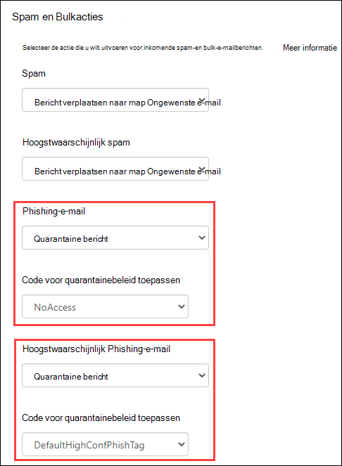
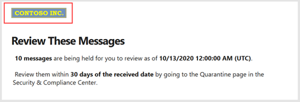
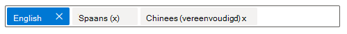
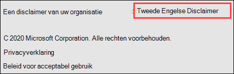
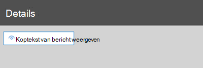
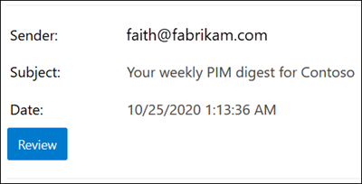
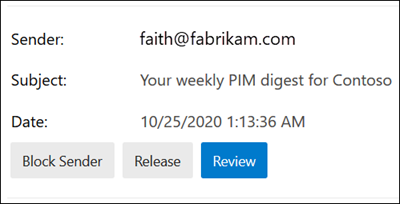

# <a name="quarantine-tags"></a>Quarantainelabels

> [!NOTE]
> De functies die in dit artikel worden beschreven, zijn momenteel in de Preview-versie beschikbaar, zijn niet voor iedereen beschikbaar en kunnen worden gewijzigd.

Met quarantainelabels in Exchange Online Protection (EOP) kunnen beheerders bepalen wat gebruikers in quarantaine kunnen doen aan berichten in quarantaine op basis van hoe het bericht in quarantaine is geplaatst.

EOP heeft normaal gezien bepaalde interactiviteitsniveaus toegestaan of voorkomen voor berichten in [quarantaine](find-and-release-quarantined-messages-as-a-user.md) en in [spammeldingen voor eindgebruikers.](use-spam-notifications-to-release-and-report-quarantined-messages.md) Eindgebruikers kunnen bijvoorbeeld berichten die in quarantaine zijn geplaatst door spamfilters als spam of bulksgewijs weergeven en vrijgeven, maar ze kunnen geen berichten die in quarantaine zijn geplaatst, weergeven of vrijgeven als zeer vertrouwelijk phishing.

Voor [ondersteunde beveiligingsfuncties](#step-2-assign-a-quarantine-tag-to-supported-features)geven quarantainelabels aan wat gebruikers mogen doen in spammeldingen voor eindgebruikers en in hun in quarantaine geplaatste berichten in quarantaine (berichten waarvoor de gebruiker geadresseerde is). Standaard quarantainecodes worden automatisch toegewezen om de historische mogelijkheden voor eindgebruikers van berichten in quarantaine af te dwingen. U kunt ook aangepaste quarantainelabels maken en toewijzen om te voorkomen dat eindgebruikers specifieke acties uitvoeren op berichten in quarantaine.

De afzonderlijke machtigingen worden gecombineerd in de volgende vooraf ingestelde machtigingsgroepen:

- Geen toegang
- Beperkte toegang
- Volledige toegang

De beschikbare afzonderlijke machtigingen en wat al dan niet is opgenomen in de vooraf ingestelde machtigingsgroepen worden in de volgende tabel beschreven:

|Machtiging|Geen toegang|Beperkte toegang|Volledige toegang|
|---|:---:|:---:|:---:|
|**Afzender toestaan** _(PermissionToAllowSender)_||||
|**Afzender blokkeren** (_PermissionToBlockSender_)||||
|**Delete** (_PermissionToDelete_)||||
|**Preview** (_PermissionToPreview_)||||
|**Toestaan dat geadresseerden een bericht uit quarantaine vrijgeven** _(PermissionToRelease)_||||
|**Toestaan dat geadresseerden een bericht uit quarantaine** worden vrijgegeven _(PermissionToRequestRelease)_||||
|

Als u niet wilt dat de standaardmachtigingen in de vooraf ingestelde machtigingsgroepen worden gebruikt, kunt u aangepaste machtigingen gebruiken wanneer u aangepaste quarantainelabels maakt of wijzigt. Zie de sectie met machtigingsdetails voor [quarantainetags](#quarantine-tag-permission-details) verderf in dit artikel voor meer informatie over wat elke machtiging doet.

U maakt en wijst quarantainelabels toe in het beveiligings- & compliancecentrum of in PowerShell (Exchange Online PowerShell voor Microsoft 365-organisaties met Exchange Online-postvakken; zelfstandige EOP PowerShell in EOP-organisaties zonder Exchange Online-postvakken).

## <a name="what-do-you-need-to-know-before-you-begin"></a>Wat moet u weten voordat u begint?

- U opent het beveiligings- en compliancecentrum in <https://protection.office.com/>. Als u rechtstreeks naar de pagina **Quarantainelabels wilt** gaan, opent u <https://protection.office.com/quarantineTags> .

- Zie [Verbinding maken met Exchange Online PowerShell](https://docs.microsoft.com/powershell/exchange/connect-to-exchange-online-powershell) als u verbinding wilt maken met Exchange Online PowerShell. Zie [Verbinding maken met Exchange Online Protection PowerShell](https://docs.microsoft.com/powershell/exchange/connect-to-exchange-online-protection-powershell) als je verbinding wilt maken met zelfstandige EOP PowerShell.

- Als u quarantainelabels wilt weergeven, maken, wijzigen of  verwijderen,  moet u lid zijn van de rollen Organisatiebeheer of Beveiligingsbeheerder in het [beveiligings- & compliancecentrum.](permissions-in-the-security-and-compliance-center.md)

## <a name="step-1-create-quarantine-tags-in-the-security--compliance-center"></a>Stap 1: Quarantainelabels maken in het & compliancecentrum

1. Ga in het & compliancecentrum naar **Beleid** voor bedreigingsbeheer en \>  selecteer **quarantainelabels.**

2. Selecteer Aangepaste **tag toevoegen op** de pagina **Quarantainelabels.**

3. De **wizard Nieuwe label** wordt geopend. Voer op **de pagina Labelnaam** een korte, maar unieke naam in het veld **Labelnaam** in. U moet de tag in de komende stappen identificeren en op naam selecteren. Klik op Volgende wanneer u klaar **bent.**

4. Selecteer een **van de volgende waarden** op de pagina Toegang tot bericht geadresseerde:
   - **Geen toegang**
   - **Beperkte toegang**
   - **Volledige toegang**

   De afzonderlijke machtigingen die zijn opgenomen in deze machtigingsgroepen worden eerder in dit artikel beschreven.

   Als u aangepaste machtigingen wilt opgeven, selecteert u **Specifieke toegang instellen (Geavanceerd)** en configureert u de volgende instellingen:

     - **Select release action preference:** Select one of the following values:
       - **Geen releaseactie:** dit is de standaardwaarde.
       - **Geadresseerden toestaan een bericht uit quarantaine vrij te laten**
       - **Toestaan dat geadresseerden een bericht uit quarantaine worden vrijgegeven**

     - **Selecteer extra acties die geadresseerden in quarantaine** kunnen uitvoeren: Selecteer enkele, alle of geen van de volgende waarden:
       - **Verwijderen**
       - **Voorbeeld**
       - **Afzender toestaan**
       - **Afzender blokkeren**

   Deze machtigingen en hun effect op berichten in quarantaine en in [](#quarantine-tag-permission-details) spammeldingen voor eindgebruikers worden beschreven in de sectie machtigingsdetails van de quarantainetag verder op het einde van dit artikel.

   Klik op Volgende wanneer u klaar **bent.**

5. Controleer de **instellingen** op de pagina Overzicht die wordt weergegeven. U kunt bij **elke** instelling op Bewerken klikken om deze te wijzigen.

   Klik op Verzenden wanneer u **klaar bent.**

6. Klik **op Klaar** op de bevestigingspagina die wordt weergegeven.

U bent nu klaar om de quarantainetag toe te wijzen aan een quarantainefunctie, zoals beschreven in de [sectie stap 2.](#step-2-assign-a-quarantine-tag-to-supported-features)

### <a name="create-quarantine-tags-in-powershell"></a>Quarantainelabels maken in PowerShell

Als u liever PowerShell gebruikt om quarantainelabels te maken, maakt u verbinding met Exchange Online PowerShell of Exchange Online Protection PowerShell en gebruikt u de cmdlet **New-QuarantineTag.** U kunt uit twee verschillende methoden kiezen:

- Gebruik de parameter _EndUserQuarantinePermissionsValue._
- Gebruik de parameter _EndUserQuarantinePermissions._

Deze methoden worden in de volgende secties beschreven.

#### <a name="use-the-enduserquarantinepermissionsvalue-parameter"></a>De parameter EndUserQuarantinePermissionsValue gebruiken

Als u een quarantainetag wilt maken met de parameter _EndUserQuarantinePermissionsValue,_ gebruikt u de volgende syntaxis:

```powershell
New-QuarantineTag -Name "<UniqueName>" -EndUserQuarantinePermissionsValue <0 to 236>
```

De parameter _EndUserQuarantinePermissionsValue_ gebruikt een decimale waarde die wordt geconverteerd uit een binaire waarde. De binaire waarde komt overeen met de beschikbare quarantainemachtigingen voor eindgebruikers in een specifieke volgorde. Voor elke machtiging is de waarde 1 gelijk aan Waar en de waarde 0 is gelijk aan Onwaar.

De vereiste volgorde en waarden voor elke afzonderlijke machtiging in vooraf ingestelde machtigingsgroepen worden in de volgende tabel beschreven:

****

|Machtiging|Geen toegang|Beperkte toegang|Volledige toegang|
|---|:---:|:---:|:---:|
|PermissionToAllowSender|0|0|1|
|PermissionToBlockSender|0|1|1|
|PermissionToDelete|0|1|1|
|PermissionToDownload<sup>\*</sup>|0|0|0|
|PermissionToPreview|0|1|1|
|PermissionToRelease<sup>\*\*</sup>|0|0|1|
|PermissionToRequestRelease<sup>\*\*</sup>|0|1|0|
|PermissionToViewHeader<sup>\*</sup>|0|0|0|
|Binaire waarde|00000000|01101010|11101100|
|Te gebruiken decimale waarde|0|106|236|

<sup>\*</sup> Deze waarde is momenteel altijd 0. Voor PermissionToViewHeader wordt met waarde 0  de knop Berichtkopweergave niet verborgen in de details van het in quarantaine geplaatste bericht (de knop is altijd beschikbaar).

<sup>\*\*</sup> Stel niet beide waarden in op 1. Stel een voor 1 en de andere op 0 of stel beide in op 0.

In dit voorbeeld wordt een nieuwe quarantainetagnaam NoAccess gemaakt waarin de machtiging Geen toegang wordt toegewezen, zoals beschreven in de vorige tabel.

```powershell
New-QuarantineTag -Name NoAccess -EndUserQuarantinePermissionsValue 0
```

Gebruik voor machtigingen met beperkte toegang de waarde 106. Gebruik voor machtigingen voor volledige toegang de waarde 236.

Gebruik voor aangepaste machtigingen de vorige tabel om de binaire waarde op te halen die overeenkomt met de 3D-machtigingen. Converteert de binaire waarde naar een decimale waarde en gebruik de decimale waarde voor de parameter _EndUserQuarantinePermissionsValue._

Zie Nieuwe quarantainetag voor gedetailleerde syntaxis- en [parameterinformatie.](https://docs.microsoft.com/powershell/module/exchange/new-quarantinetag)

#### <a name="use-the-enduserquarantinepermissions-parameter"></a>De parameter EndUserQuarantinePermissions gebruiken

Als u een quarantainetag wilt maken met de parameter _EndUserQuarantinePermissionsValue,_ gaat u als volgt te werk:

A. Sla een quarantainemachtigingsobject op in een variabele met de cmdlet **New-QuarantinePermissions.**

<p>

B. Gebruik de variabele als de _waarde EndUserQuarantinePermissions_ in de **opdracht Nieuwe quarantainetag.**

##### <a name="step-a-store-a-quarantine-permissions-object-in-a-variable"></a>Stap A: Een object met quarantainemachtigingen opslaan in een variabele

Gebruik de volgende syntaxis:

```powershell
$<VariableName> = New-QuarantinePermissions [-PermissionToAllowSender <$true | $False>] [-PermissionToBlockSender <$true | $False>] [-PermissionToDelete <$true | $False>] [-PermissionToPreview <$true | $False>] [-PermissionToRelease <$true | $False>] [-PermissionToRequestRelease <$true | $False>]
```

De standaardwaarde voor ongebruikte parameters is, dus u hoeft alleen de parameters te gebruiken waarop `$false` u de waarde wilt `$true` instellen.

De volgende voorbeelden laten zien hoe u machtigingsobjecten maakt die overeenkomen met de vooraf ingestelde machtigingsgroepen:

- **Geen toegang:**

  ```powershell
  $NoAccess = New-QuarantinePermissions
  ```

- **Beperkte toegang:**

  ```powershell
  $LimitedAccess = New-QuarantinePermissions -PermissionToBlockSender $true -PermissionToDelete $true -PermissionToPreview $true -PermissionToRequestRelease $true
  ```

- **Volledige toegang:**

  ```powershell
  $FullAccess = New-QuarantinePermissions -PermissionToAllowSender $true -PermissionToBlockSender $true -PermissionToDelete $true -PermissionToPreview $true -PermissionToRelease $true
  ```

Als u de waarden wilt zien die u hebt ingesteld, kunt u de naam van de variabele als opdracht uitvoeren (bijvoorbeeld de opdracht `$NoAccess` uitvoeren).

Stel voor aangepaste machtigingen niet zowel de parameters _PermissionToRelease_ als _PermissionToRequestRelease_ in op `$true` . Stel een aan `$true` en laat de andere weg als , of laat beide als `$false` `$false` .

U kunt ook een bestaande machtigingsobjectvariabele wijzigen nadat u deze hebt gemaakt, maar voordat u deze gebruikt met de cmdlet **Set-QuarantinePermissions.**

Zie [New-QuarantinePermissions](https://docs.microsoft.com/powershell/module/exchange/new-quarantinepermissions) en [Set-QuarantinePermissions](https://docs.microsoft.com/powershell/module/exchange/set-quarantinepermissions)voor gedetailleerde syntaxis- en parameterinformatie.

##### <a name="step-b-use-the-variable-in-the-new-quarantinetag-command"></a>Stap B: De variabele gebruiken in de New-QuarantineTag opdracht

Nadat u het machtigingsobject in een variabele hebt gemaakt en opgeslagen, gebruikt u de variabele voor de parameterwaarde _EndUserQuarantinePermission_ in de volgende opdracht Nieuwe **quarantainetag:**

```powershell
New-QuarantineTag -Name "<UniqueName>" -EndUserQuarantinePermissions $<VariableName>
```

In dit voorbeeld wordt een nieuwe quarantainetag met de naam LimitedAccess gemaakt met behulp van het machtigingsobject dat in de vorige stap is `$LimitedAccess` beschreven en gemaakt.

```powershell
New-QuarantineTag -Name LimitedAccess -EndUserQuarantinePermissions $LimitedAccess
```

Zie Nieuwe quarantainetag voor gedetailleerde syntaxis- en [parameterinformatie.](https://docs.microsoft.com/powershell/module/exchange/new-quarantinetag)

## <a name="step-2-assign-a-quarantine-tag-to-supported-features"></a>Stap 2: Een quarantainetag toewijzen aan ondersteunde functies

In _ondersteunde_ beveiligingsfuncties die berichten of bestanden in quarantaine plaatsen (automatisch of als een configureerbare actie), kunt u een quarantainetag toewijzen aan de beschikbare quarantaineacties. Functies voor het in quarantaine plaatsen van berichten en de beschikbaarheid van quarantainelabels worden in de volgende tabel beschreven:

****

|Functie|Worden quarantainelabels ondersteund?|Standaard gebruikte quarantainecodes|
|---|:---:|---|
|[Antispambeleid:](configure-your-spam-filter-policies.md) <ul><li>**Spam** (_SpamAction_)</li><li>**Zeer betrouwbaarheidspam** _(HighConfidenceSpamAction)_</li><li>**Phishing-e-mail** (_PhishSpamAction)_</li><li>**Zeer betrouwbaarheids-phishing-e-mail** _(HighConfidencePhishAction)_</li><li>**Bulk-e-mail** _(BulkSpamAction)_</li></ul>|Ja|<ul><li>DefaultSpamTag (volledige toegang)</li><li>DefaultHighConfSpamTag (volledige toegang)</li><li>DefaultPhishTag (volledige toegang)</li><li>DefaultHighConfPhishTag (geen toegang)</li><li>DefaultBulkTag (volledige toegang)</li></ul>
|Anti-phishingbeleid: <ul><li>[Spoof intelligence protection](set-up-anti-phishing-policies.md#spoof-settings) _(AuthenticationFailAction)_</li><li>[Imitatiebeveiliging:](set-up-anti-phishing-policies.md#impersonation-settings-in-anti-phishing-policies-in-microsoft-defender-for-office-365)<sup>\*</sup> <ul><li>**Als e-mail wordt verzonden door een gemitmiteerde gebruiker** _(TargetedUserProtectionAction)_</li><li>**Als e-mail wordt verzonden door een gemitmiteerd domein** _(TargetedDomainProtectionAction)_</li><li>**Postvakinformatie** \> **Als e-mail wordt verzonden door een gemitmiteerde gebruiker** _(MailboxIntelligenceProtectionAction)_</li></ul></li></ul></ul>|Nee|n.t.t.|
|[Anti-malwarebeleid:](configure-anti-malware-policies.md)alle gedetecteerde berichten worden altijd in quarantaine geplaatst.|Nee|n.t.t.|
|[Veilige bijlagen voor SharePoint, OneDrive en Microsoft Teams](atp-for-spo-odb-and-teams.md)|Nee|n.t.t.|
|[E-mailstroomregels](https://docs.microsoft.com/exchange/security-and-compliance/mail-flow-rules/mail-flow-rules) (ook wel transportregels genoemd) met de actie: Bezorg het bericht **in de gehoste quarantaine** _(quarantaine)._|Nee|n.t.t.|
|

<sup>\*</sup> Instellingen voor imitatiebeveiliging zijn alleen beschikbaar in anti-phishingbeleid in Microsoft Defender voor Office 365.

Als u tevreden bent met de machtigingen van de eindgebruiker die standaard in quarantaine worden weergegeven, hoeft u niets te doen. Als u de mogelijkheden van de eindgebruiker (beschikbare knoppen) wilt aanpassen in spammeldingen voor eindgebruikers of in berichten in quarantaine, kunt u een aangepaste quarantainetag toewijzen.

### <a name="assign-quarantine-tags-in-anti-spam-policies-in-the-security--compliance-center"></a>Wijs quarantainelabels toe in antispambeleid in het & compliancecentrum

Volledige instructies voor het maken en wijzigen van antispambeleid worden beschreven in [Antispambeleid configureren in EOP.](configure-your-spam-filter-policies.md)

1. Ga in het & Compliancecentrum naar  Beleid voor bedreigingsbeheer en \>  \> selecteer **Antispam.** Of open <https://protection.office.com/antispam> .

2. Zoek en selecteer een bestaand antispambeleid dat u wilt bewerken of maak een nieuw antispambeleid.

3. Vouw in de flyout met beleidsdetails de **sectie Spam-** en bulkacties uit.

4. Als u het  quarantainebericht hebt geselecteerd voor de actie  van een beschikbaar spamfilterprogramma, is het vakje Quarantainebeleidstag toepassen beschikbaar om de quarantainetag voor dat etiket te selecteren.

   **Opmerking:** Wanneer u een nieuw beleid maakt, wordt met een lege quarantainetagwaarde voor spamfilters aangegeven dat de standaard-quarantainetag voor dat etiket wordt gebruikt. Wanneer u het beleid later bewerkt, worden de lege waarden vervangen door de werkelijke standaardtagnamen in quarantaine, zoals beschreven in de vorige tabel.

   

5. Klik op **Opslaan** wanneer u gereed bent.

#### <a name="assign-quarantine-tags-in-anti-spam-policies-in-powershell"></a>Quarantainelabels toewijzen in antispambeleid in PowerShell

Als u liever PowerShell gebruikt om quarantainelabels toe te wijzen in antispambeleid, maakt u verbinding met Exchange Online PowerShell of Exchange Online Protection PowerShell en gebruikt u de volgende syntaxis:

```powershell
<New-HostedContentFilterPolicy -Name "<Unique name>" | Set-HostedContentFilterPolicy -Identity "<Policy name>">  [-SpamAction Quarantine] [-SpamQuarantineTag <QuarantineTagName>] [-HighConfidenceSpamAction Quarantine] [-HighConfidenceSpamQuarantineTag <QuarantineTagName>] [-PhishSpamAction Quarantine] [-PhishQuarantineTag <QuarantineTagName>] [-HighConfidencePhishQuarantineTag <QuarantineTagName>] [-BulkSpamAction Quarantine] [-BulkQuarantineTag <QuarantineTagName>] ...
```

**Opmerkingen**:

- De standaardwaarde voor de parameter _HighConfidencePhishAction_ is Quarantaine, dus u hoeft de actie Quarantaine niet in te stellen voor snelle phishingdetectie in nieuw antispambeleid. Voor alle andere spamfilters in nieuw of bestaand antispambeleid is de quarantainetag alleen effectief als de actiewaarde Quarantaine is. Voer de volgende opdracht uit om de actiewaarden in bestaand antispambeleid te bekijken:

  ```powershell
  Get-HostedContentFilterPolicy | Format-Table Name,*SpamAction,HighConfidencePhishAction
  ```

  Zie de instellingen voor het [antispambeleid](recommended-settings-for-eop-and-office365-atp.md#eop-anti-spam-policy-settings)van EOP voor informatie over de standaardactiewaarden en de aanbevolen actiewaarden voor Standaard en Strikt.

- Een spamfilter zonder een bijbehorende quarantainetagparameter betekent dat de [standaard quarantainetag](#step-2-assign-a-quarantine-tag-to-supported-features) voor die spam wordt gebruikt.

  U hoeft alleen een standaard quarantainetag te vervangen door een aangepaste quarantainetag als u de standaardmogelijkheden van eindgebruikers voor berichten in quarantaine wilt wijzigen.

- Voor een nieuw antispambeleid in PowerShell is een spamfilterbeleid (instellingen) vereist dat de cmdlet **New-HostedContentFilterPolicy** wordt gebruikt en er een nieuwe regel voor het filteren van ongewenste e-mail (geadresseerdenfilters) wordt gebruikt met de cmdlet **New-HostedContentFilterRule.** Zie [PowerShell gebruiken om antispambeleid te maken](configure-your-spam-filter-policies.md#use-powershell-to-create-anti-spam-policies)voor instructies.

In dit voorbeeld wordt een nieuw spamfilterbeleid met de naam Onderzoeksafdeling gemaakt met de volgende instellingen:

- De actie voor alle spamfilters is ingesteld op Quarantaine.
- De aangepaste quarantainetag met de naam  NoAccess, die geen toegangsmachtigingen  toewijst, vervangt standaard quarantainelabels die nog niet standaard Geen toegangsmachtigingen toewijzen.

```powershell
New-HostedContentFilterPolicy -Name Research Department -SpamAction Quarantine -SpamQuarantineTag NoAccess -HighConfidenceSpamAction Quarantine -HighConfidenceSpamQuarantineTag NoAction -PhishSpamAction Quarantine -PhishQuarantineTag NoAction -BulkSpamAction Quarantine -BulkQuarantineTag NoAccess
```

Zie [New-HostedContentFilterPolicy](https://docs.microsoft.com/powershell/module/exchange/new-hostedcontentfilterpolicy) voor gedetailleerde syntaxis- en parameterinformatie.

In dit voorbeeld wordt het bestaande spamfilterbeleid met de naam Human Resources wijzigt. De actie voor de spam quarantaineverplaatsing is ingesteld op Quarantaine en de aangepaste quarantainetag met de naam NoAccess wordt toegewezen.

```powershell
Set-HostedContentFilterPolicy -Identity "Human Resources" -SpamAction Quarantine -SpamQuarantineTag NoAccess
```

Zie [Set-HostedContentFilterPolicy](https://docs.microsoft.com/powershell/module/exchange/set-hostedcontentfilterpolicy) voor gedetailleerde syntaxis- en parameterinformatie.

## <a name="configure-global-quarantine-notification-settings-in-the-security--compliance-center"></a>Algemene instellingen voor quarantainemeldingen configureren in het & Compliancecentrum

Met de algemene instellingen voor quarantainelabels kunt u spammeldingen voor eindgebruikers aanpassen die worden verzonden naar geadresseerden van berichten die in quarantaine zijn geplaatst. Zie spammeldingen voor eindgebruikers voor meer informatie [over deze meldingen.](use-spam-notifications-to-release-and-report-quarantined-messages.md)

1. Ga in het & compliancecentrum naar **Beleid** voor bedreigingsbeheer en \>  selecteer **quarantainelabels.**

2. Selecteer globale **instellingen op de** pagina **Quarantainelabels.**

3. Configureer **enkele** of alle volgende instellingen in de flyout met instellingen voor quarantainemeldingen:

   - **Gebruik mijn bedrijfslogo:** selecteer deze optie om het standaard-Microsoft-logo te vervangen dat boven aan spammeldingen voor eindgebruikers wordt gebruikt. Voordat u dit doet, moet u de instructies in [Microsoft 365-thema](../../admin/setup/customize-your-organization-theme.md) aanpassen voor uw organisatie volgen om uw aangepaste logo te uploaden.

     In de volgende schermafbeelding ziet u een aangepast logo in een spammelding voor eindgebruikers:

     

   - **Kies taal:** spammeldingen voor eindgebruikers zijn al gelokaliseerd op basis van de taalinstellingen van de geadresseerde. U kunt aangepaste tekst in verschillende talen opgeven voor de waarden **Weergavenaam** en **Vrijwaring.**

     Selecteer ten minste één taal in het vak voor de eerste taal en klik op **Toevoegen.** U kunt meerdere talen selecteren door na elke **taal** te klikken op Toevoegen. Een sectietaalvak bevat alle talen die u hebt geselecteerd:

     

   - **Weergavenaam:** pas de weergavenaam van de afzender aan die wordt gebruikt in spammeldingen voor eindgebruikers.

     Voor elke taal die u hebt toegevoegd, selecteert u de taal in het tweede taalvak (klik niet op de X) en typt u de wante tekstwaarde in het vak **Weergavenaam.**

     In de volgende schermafbeelding ziet u de aangepaste weergavenaam in een spammelding voor eindgebruikers:

     

   - **Vrijwaring:** voeg een aangepaste vrijwaring toe aan het einde van spammeldingen voor eindgebruikers. De gelokaliseerde tekst, **een vrijwaring van uw organisatie:** wordt altijd eerst opgenomen, gevolgd door de tekst die u opgeeft.

     Voor elke taal die u hebt toegevoegd, selecteert u de taal in het tweede taalvak (klik niet op de X) en typt u de wante tekstwaarde in het **vrijwaringsvak.**

     In de volgende schermafbeelding ziet u de aangepaste vrijwaring in een spammelding voor eindgebruikers:

     

## <a name="view-quarantine-tags-in-the-security--compliance-center"></a>Quarantainelabels weergeven in het beveiligings- & compliancecentrum

1. Ga in het & compliancecentrum naar **Beleid** voor bedreigingsbeheer en \>  selecteer **quarantainelabels.**

- Als u de instellingen van ingebouwde of aangepaste quarantainetags wilt weergeven, selecteert u de quarantainetag in de lijst (schakel het selectievakje niet in).

- Als u de globale instellingen wilt weergeven, **selecteert u Globale instellingen**

### <a name="view-quarantine-tags-in-powershell"></a>Quarantainelabels weergeven in PowerShell

Als u liever PowerShell gebruikt om quarantainelabels weer te geven, gaat u op een van de volgende stappen te werk:

- Voer de volgende opdracht uit om een overzichtslijst met alle ingebouwde of aangepaste tags weer te geven:

  ```powershell
  Get-QuarantineTag | Format-Table Name
  ```

- Als u de instellingen van ingebouwde of aangepaste quarantainetags wilt weergeven, vervangt u de naam van de quarantainetag en voer \<TagName\> u de volgende opdracht uit:

  ```powershell
  Get-QuarantineTag -Identity "<TagName>"
  ```

- Voer de volgende opdracht uit om de algemene instellingen weer te geven:

  ```powershell
  Get-QuarantineTag -QuarantineTagType GlobalQuarantineTag
  ```

Zie [Get-HostedContentFilterPolicy](https://docs.microsoft.com/powershell/module/exchange/get-hostedcontentfilterpolicy) voor gedetailleerde syntaxis- en parameterinformatie.

## <a name="remove-quarantine-tags-in-the-security--compliance-center"></a>Quarantainelabels verwijderen in het beveiligings- & compliancecentrum

**Opmerkingen**:

- U kunt ingebouwde quarantainelabels niet verwijderen.

- Voordat u een aangepaste quarantainetag verwijdert, controleert u of deze niet wordt gebruikt. Voer bijvoorbeeld de volgende opdracht uit in PowerShell:

  ```powershell
  Get-HostedContentFilterPolicy | Format-List Name,*QuarantineTag
  ```

  Als de quarantainetag wordt gebruikt, [vervangt u de toegewezen quarantainetag](#step-2-assign-a-quarantine-tag-to-supported-features) voordat u deze verwijdert.

1. Ga in het & compliancecentrum naar **Beleid** voor bedreigingsbeheer en \>  selecteer **quarantainelabels.**

2. Selecteer op **de pagina Quarantainelabels** de aangepaste quarantainetag die u wilt verwijderen en klik op **Tag verwijderen.**

3. Klik **op Tag verwijderen** in het bevestigingsvenster dat wordt weergegeven.

### <a name="remove-quarantine-tags-in-powershell"></a>Quarantainelabels verwijderen in PowerShell

Als u liever PowerShell gebruikt om een aangepaste quarantainetag te verwijderen, vervangt u de naam van de quarantainetag en voer u \<TagName\> de volgende opdracht uit:

```powershell
Remove-QuarantineTag -Identity "<TagName>"
```

Zie [Remove-QuarantineTag](https://docs.microsoft.com/powershell/module/exchange/remove-quarantinetag)voor gedetailleerde syntaxis- en parameterinformatie.

## <a name="quarantine-tag-permission-details"></a>Machtigingsdetails voor quarantainetag

In de volgende secties worden de effecten beschreven van vooraf ingestelde machtigingsgroepen en afzonderlijke machtigingen voor de details van berichten in quarantaine en in spammeldingen voor eindgebruikers.

### <a name="preset-permissions-groups"></a>Vooraf ingestelde machtigingsgroepen

In de tabel aan het begin van dit artikel staan de afzonderlijke machtigingen die zijn opgenomen in vooraf ingestelde machtigingsgroepen.

#### <a name="no-access"></a>Geen toegang

Als de quarantainetag de machtiging Geen **toegang** (geen machtigingen) toewijst, krijgen gebruikers nog steeds bepaalde basislijnfuncties:

- **Berichtdetails in quarantaine:** **de knop Berichtkop** weergeven is altijd beschikbaar.

  

- **Spammeldingen voor eindgebruikers:** De knop Controleren waarmee de gebruiker in quarantaine wordt geplaatst, is altijd beschikbaar. 

  

#### <a name="limited-access"></a>Beperkte toegang

Als de quarantainetag de machtigingen voor beperkte **toegang** toewijst, krijgen gebruikers de volgende mogelijkheden:

- **Details van berichten in quarantaine:** de volgende knoppen zijn beschikbaar:
  - **Release aanvragen**
  - **Berichtkop weergeven**
  - **Voorbeeld van bericht**
  - **Afzender blokkeren**
  - **Uit quarantaine verwijderen**

  

- **Spammeldingen voor eindgebruikers:** de volgende knoppen zijn beschikbaar:
  - **Afzender blokkeren**
  - **Controleren**

  

#### <a name="full-access"></a>Volledige toegang

Als aan de quarantainetag de machtiging Volledige **toegang** (alle beschikbare machtigingen) wordt toegewezen, krijgen gebruikers de volgende mogelijkheden:

- **Details van berichten in quarantaine:** de volgende knoppen zijn beschikbaar:
  - **Releasebericht**
  - **Berichtkop weergeven**
  - **Voorbeeld van bericht**
  - **Afzender blokkeren**
  - **Afzender toestaan**
  - **Uit quarantaine verwijderen**

  

- **Spammeldingen voor eindgebruikers:** de volgende knoppen zijn beschikbaar:
  - **Afzender blokkeren**
  - **Release**
  - **Controleren**

  

### <a name="individual-permissions"></a>Afzonderlijke machtigingen

> [!NOTE]
> Vergeet niet dat gebruikers altijd de knoppen krijgen die worden beschreven in de [sectie Geen toegang.](#no-access) Deze knoppen zijn niet opgenomen in de afzonderlijke machtigingsbeschrijvingen.

#### <a name="allow-sender-permission"></a>Machtigingen voor afzender toestaan

Met **de machtiging Afzender** toestaan _(PermissionToAllowSender)_ wordt de toegang tot de knop besturingselementen waarmee gebruikers de afzender van het in quarantaine geplaatste bericht gemakkelijk aan hun lijst met veilige afzenders kunnen toevoegen.

- **Berichtdetails in quarantaine:**
  - **Toestaan dat** afzendermachtigingen zijn ingeschakeld: **de knop Afzender toestaan** is beschikbaar.
  - **Toestaan dat afzendermachtigingen** zijn uitgeschakeld: **De knop Afzender** toestaan is niet beschikbaar.

- **Spammeldingen voor eindgebruikers:** Geen effect.

Zie Voorkomen dat vertrouwde [afzenders](https://support.microsoft.com/office/274ae301-5db2-4aad-be21-25413cede077#__toc304379666) worden geblokkeerd en Gebruik Exchange Online PowerShell om de lijst met veilige afzenders voor een postvak te configureren voor meer informatie over de lijst met [veilige afzenders.](configure-junk-email-settings-on-exo-mailboxes.md#use-exchange-online-powershell-to-configure-the-safelist-collection-on-a-mailbox)

#### <a name="block-sender-permission"></a>Machtigingen voor afzender blokkeren

Met **de machtiging Afzender** blokkeren _(PermissionToBlockSender)_ wordt de toegang tot de knop bestuurd, zodat gebruikers de afzender van het bericht in quarantaine gemakkelijk kunnen toevoegen aan de lijst met geblokkeerde afzenders.

- **Details van berichten in quarantaine:**
  - **Afzendermachtiging** blokkeren ingeschakeld: de **knop Afzender blokkeren** is beschikbaar.
  - **Afzendermachtiging** blokkeren uitgeschakeld: **De knop Afzender** blokkeren is niet beschikbaar.

- **Spammeldingen voor eindgebruikers:**
  - **Afzendermachtiging** blokkeren uitgeschakeld: **De knop Afzender** blokkeren is niet beschikbaar.
  - **Afzendermachtiging** blokkeren ingeschakeld: de **knop Afzender blokkeren** is beschikbaar.

Zie Berichten van iemand blokkeren en [](https://support.microsoft.com/office/274ae301-5db2-4aad-be21-25413cede077#__toc304379667) Exchange Online PowerShell gebruiken om de lijst met veilige afzenders voor een postvak te configureren voor meer informatie over de lijst [met geblokkeerde afzenders.](configure-junk-email-settings-on-exo-mailboxes.md#use-exchange-online-powershell-to-configure-the-safelist-collection-on-a-mailbox)

#### <a name="delete-permission"></a>Machtiging voor verwijderen

De **machtiging** Verwijderen _(PermissionToDelete)_ bepaalt de mogelijkheid voor gebruikers om hun berichten (berichten waarin de gebruiker geadresseerde is) te verwijderen uit quarantaine.

- **Berichtdetails in quarantaine:**
  - **Machtiging** verwijderen ingeschakeld: de **knop Verwijderen** uit quarantaine is beschikbaar.
  - **Machtiging** verwijderen uitgeschakeld: de **knop Verwijderen** uit quarantaine is niet beschikbaar.

- **Spammeldingen voor eindgebruikers:** Geen effect.

#### <a name="preview-permission"></a>Machtiging voorbeeld

Met **de machtiging** Preview _(PermissionToPreview)_ kunnen gebruikers een voorbeeld van hun berichten in quarantaine bekijken.

- **Berichtdetails in quarantaine:**
  - **Machtiging** voorbeeld ingeschakeld: de **knop Voorbeeldbericht** is beschikbaar.
  - **Machtiging voorbeeld** uitgeschakeld: De **knop Voorbeeldbericht** is niet beschikbaar.

- **Spammeldingen voor eindgebruikers:** Geen effect.

#### <a name="allow-recipients-to-release-a-message-from-quarantine-permission"></a>Toestaan dat geadresseerden een bericht uit quarantainemachtigingen vrijgeven

Met **De machtiging Toestaan** dat geadresseerden een bericht uit quarantaine verwijderen _(PermissionToRelease),_ bepaalt u of gebruikers berichten in quarantaine rechtstreeks en zonder goedkeuring van een beheerder kunnen vrijgeven.

- **Berichtdetails in quarantaine:**
  - Machtiging ingeschakeld: de **knop Releasebericht** is beschikbaar.
  - Machtiging uitgeschakeld: de **knop Releasebericht** is niet beschikbaar.

- **Spammeldingen voor eindgebruikers:**
  - Machtiging ingeschakeld: de **knop Release** is beschikbaar.
  - Machtiging uitgeschakeld: de **knop Release** is niet beschikbaar.

#### <a name="allow-recipients-to-request-a-message-to-be-released-from-quarantine-permission"></a>Geadresseerden toestaan een bericht uit quarantainemachtiging te laten worden vrijgegeven

De **machtiging Toestaan** dat geadresseerden een bericht uit quarantaine verwijderen  _(PermissionToRequestRelease)_ bepaalt de mogelijkheid van gebruikers om de release van hun in quarantaine geplaatste berichten aan te vragen. Het bericht wordt pas uitgebracht nadat een beheerder de aanvraag heeft goedgekeurd.

- **Berichtdetails in quarantaine:**
  - Machtiging ingeschakeld: de **knop Releaseaanvraag** is beschikbaar.
  - Machtiging uitgeschakeld: de **knop Releaseaanvraag** is niet beschikbaar.

- **Spammeldingen voor eindgebruikers:** de **knop Release** is niet beschikbaar.
