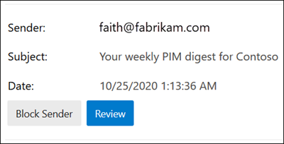

# <a name="quarantine-tags"></a><span data-ttu-id="fdac4-103">Quarantainelabels</span><span class="sxs-lookup"><span data-stu-id="fdac4-103">Quarantine tags</span></span>

> [!NOTE]
> <span data-ttu-id="fdac4-104">De functies die in dit artikel worden beschreven, zijn momenteel beschikbaar in Preview, zijn niet voor iedereen beschikbaar en kunnen worden gewijzigd.</span><span class="sxs-lookup"><span data-stu-id="fdac4-104">The features that are described in this article are currently in Preview, aren't available to everyone, and are subject to change.</span></span>

<span data-ttu-id="fdac4-105">Met quarantainelabels in Exchange Online Protection (EOP) kunnen beheerders bepalen wat gebruikers kunnen doen met hun in quarantaine geplaatste berichten op basis van de manier waarop het bericht in quarantaine is geplaatst.</span><span class="sxs-lookup"><span data-stu-id="fdac4-105">Quarantine tags in Exchange Online Protection (EOP) allow admins to control what users are able to do to their quarantined messages based on how the message arrived in quarantine.</span></span>

<span data-ttu-id="fdac4-106">EOP heeft vanouds bepaalde interactiviteitsniveaus toegestaan of voorkomen voor berichten in [quarantaine](find-and-release-quarantined-messages-as-a-user.md) en in [spammeldingen van eindgebruikers.](use-spam-notifications-to-release-and-report-quarantined-messages.md)</span><span class="sxs-lookup"><span data-stu-id="fdac4-106">EOP has traditionally allowed or prevented certain levels of interactivity for messages in [quarantine](find-and-release-quarantined-messages-as-a-user.md) and in [end-user spam notifications](use-spam-notifications-to-release-and-report-quarantined-messages.md).</span></span> <span data-ttu-id="fdac4-107">Eindgebruikers kunnen bijvoorbeeld berichten bekijken en vrijgeven die in quarantaine zijn geplaatst door antispamfilters als spam of bulksgewijs, maar ze kunnen berichten die in quarantaine zijn geplaatst, niet weergeven of vrijgeven als phishing met veel vertrouwen.</span><span class="sxs-lookup"><span data-stu-id="fdac4-107">For example, end-users can view and release messages that were quarantined by anti-spam filtering as spam or bulk, but they can't view or release messages that were quarantined as high confidence phishing.</span></span>

<span data-ttu-id="fdac4-108">Voor [ondersteunde](#step-2-assign-a-quarantine-tag-to-supported-features)beveiligingsfuncties geven quarantainelabels aan wat gebruikers mogen doen in spammeldingen van eindgebruikers en in hun in quarantaine geplaatste berichten in quarantaine (berichten waarbij de gebruiker een geadresseerde is).</span><span class="sxs-lookup"><span data-stu-id="fdac4-108">For [supported protection features](#step-2-assign-a-quarantine-tag-to-supported-features), quarantine tags specify what users are allowed to do in end-user spam notification messages and in their quarantined messages in quarantine (messages where the user is a recipient).</span></span> <span data-ttu-id="fdac4-109">Standaard quarantainelabels worden automatisch toegewezen om de historische mogelijkheden voor eindgebruikers af te dwingen voor in quarantaine geplaatste berichten.</span><span class="sxs-lookup"><span data-stu-id="fdac4-109">Default quarantine tags are automatically assigned to enforce the historical capabilities for end-users on quarantined messages.</span></span> <span data-ttu-id="fdac4-110">U kunt ook aangepaste quarantainelabels maken en toewijzen om te voorkomen dat eindgebruikers specifieke acties uitvoeren op in quarantaine geplaatste berichten.</span><span class="sxs-lookup"><span data-stu-id="fdac4-110">Or, you can create and assign custom quarantine tags to allow or prevent end-users from performing specific actions on quarantined messages.</span></span>

<span data-ttu-id="fdac4-111">De afzonderlijke machtigingen worden gecombineerd in de volgende vooraf ingestelde machtigingsgroepen:</span><span class="sxs-lookup"><span data-stu-id="fdac4-111">The individual permissions are combined into the following preset permission groups:</span></span>

- <span data-ttu-id="fdac4-112">Geen toegang</span><span class="sxs-lookup"><span data-stu-id="fdac4-112">No access</span></span>
- <span data-ttu-id="fdac4-113">Beperkte toegang</span><span class="sxs-lookup"><span data-stu-id="fdac4-113">Limited access</span></span>
- <span data-ttu-id="fdac4-114">Volledige toegang</span><span class="sxs-lookup"><span data-stu-id="fdac4-114">Full access</span></span>

<span data-ttu-id="fdac4-115">De beschikbare afzonderlijke machtigingen en wat al dan niet is opgenomen in de vooraf ingestelde machtigingsgroepen, worden in de volgende tabel beschreven:</span><span class="sxs-lookup"><span data-stu-id="fdac4-115">The available individual permissions and what's included or not included in the preset permission groups are described in the following table:</span></span>

<br>

****

|<span data-ttu-id="fdac4-116">Machtiging</span><span class="sxs-lookup"><span data-stu-id="fdac4-116">Permission</span></span>|<span data-ttu-id="fdac4-117">Geen toegang</span><span class="sxs-lookup"><span data-stu-id="fdac4-117">No access</span></span>|<span data-ttu-id="fdac4-118">Beperkte toegang</span><span class="sxs-lookup"><span data-stu-id="fdac4-118">Limited access</span></span>|<span data-ttu-id="fdac4-119">Volledige toegang</span><span class="sxs-lookup"><span data-stu-id="fdac4-119">Full access</span></span>|
|---|:---:|:---:|:---:|
|<span data-ttu-id="fdac4-120">**Afzender toestaan** (_PermissionToAllowSender_)</span><span class="sxs-lookup"><span data-stu-id="fdac4-120">**Allow sender** (_PermissionToAllowSender_)</span></span>||||
|<span data-ttu-id="fdac4-122">**Afzender blokkeren** (_PermissionToBlockSender_)</span><span class="sxs-lookup"><span data-stu-id="fdac4-122">**Block sender** (_PermissionToBlockSender_)</span></span>||||
|<span data-ttu-id="fdac4-125">**Verwijderen** (_PermissionToDelete_)</span><span class="sxs-lookup"><span data-stu-id="fdac4-125">**Delete** (_PermissionToDelete_)</span></span>||||
|<span data-ttu-id="fdac4-128">**Preview** (_PermissionToPreview_)</span><span class="sxs-lookup"><span data-stu-id="fdac4-128">**Preview** (_PermissionToPreview_)</span></span>||||
|<span data-ttu-id="fdac4-131">**Geadresseerden toestaan een bericht uit quarantaine te laten** gaan (_PermissionToRelease_)</span><span class="sxs-lookup"><span data-stu-id="fdac4-131">**Allow recipients to release a message from quarantine** (_PermissionToRelease_)</span></span>||||
|<span data-ttu-id="fdac4-133">**Ontvangers toestaan om een bericht uit quarantaine** te laten gaan (_PermissionToRequestRelease_)</span><span class="sxs-lookup"><span data-stu-id="fdac4-133">**Allow recipients to request a message to be released from quarantine** (_PermissionToRequestRelease_)</span></span>||||
|

<span data-ttu-id="fdac4-135">Als de standaardmachtigingen in de vooraf ingestelde machtigingsgroepen u niet be staan, kunt u aangepaste machtigingen gebruiken wanneer u aangepaste quarantainelabels maakt of wijzigt.</span><span class="sxs-lookup"><span data-stu-id="fdac4-135">If you don't like the default permissions in the preset permission groups, you can use custom permissions when you create or modify custom quarantine tags.</span></span> <span data-ttu-id="fdac4-136">Zie de sectie Machtigingsgegevens voor [](#quarantine-tag-permission-details) quarantainelabels verder in dit artikel voor meer informatie over wat elke machtiging doet.</span><span class="sxs-lookup"><span data-stu-id="fdac4-136">For more information about what each permission does, see the [Quarantine tag permission details](#quarantine-tag-permission-details) section later in this article.</span></span>

<span data-ttu-id="fdac4-137">U maakt en wijst quarantainelabels toe in het Beveiligings- & Compliancecentrum of in PowerShell (Exchange Online PowerShell voor Microsoft 365-organisaties met Exchange Online-postvakken; zelfstandige EOP PowerShell in EOP-organisaties zonder Exchange Online-postvakken).</span><span class="sxs-lookup"><span data-stu-id="fdac4-137">You create and assign quarantine tags in the Security & Compliance Center or in PowerShell (Exchange Online PowerShell for Microsoft 365 organizations with Exchange Online Mailboxes; standalone EOP PowerShell in EOP organizations without Exchange Online mailboxes).</span></span>

## <a name="what-do-you-need-to-know-before-you-begin"></a><span data-ttu-id="fdac4-138">Wat moet u weten voordat u begint?</span><span class="sxs-lookup"><span data-stu-id="fdac4-138">What do you need to know before you begin?</span></span>

- <span data-ttu-id="fdac4-139">U opent het Beveiligings- en compliancecentrum in <https://protection.office.com/>.</span><span class="sxs-lookup"><span data-stu-id="fdac4-139">You open the Security & Compliance Center at <https://protection.office.com/>.</span></span> <span data-ttu-id="fdac4-140">Als u rechtstreeks naar de pagina **Quarantainelabels wilt** gaan, opent u <https://protection.office.com/quarantineTags> .</span><span class="sxs-lookup"><span data-stu-id="fdac4-140">To go directly to the **Quarantine tags** page, open <https://protection.office.com/quarantineTags>.</span></span>

- <span data-ttu-id="fdac4-141">Zie [Verbinding maken met Exchange Online PowerShell](/powershell/exchange/connect-to-exchange-online-powershell) als u verbinding wilt maken met Exchange Online PowerShell.</span><span class="sxs-lookup"><span data-stu-id="fdac4-141">To connect to Exchange Online PowerShell, see [Connect to Exchange Online PowerShell](/powershell/exchange/connect-to-exchange-online-powershell).</span></span> <span data-ttu-id="fdac4-142">Zie [Verbinding maken met Exchange Online Protection PowerShell](/powershell/exchange/connect-to-exchange-online-protection-powershell) als je verbinding wilt maken met zelfstandige EOP PowerShell.</span><span class="sxs-lookup"><span data-stu-id="fdac4-142">To connect to standalone EOP PowerShell, see [Connect to Exchange Online Protection PowerShell](/powershell/exchange/connect-to-exchange-online-protection-powershell).</span></span>

- <span data-ttu-id="fdac4-143">Als u quarantainelabels wilt weergeven, maken, wijzigen of  verwijderen,  moet u lid zijn van de rollen Organisatiebeheer of Beveiligingsbeheerder in het [Beveiligings- & Compliancecentrum.](permissions-in-the-security-and-compliance-center.md)</span><span class="sxs-lookup"><span data-stu-id="fdac4-143">To view, create, modify, or remove quarantine tags, you need to be a member of the **Organization Management** or **Security Administrator** roles in the [Security & Compliance Center](permissions-in-the-security-and-compliance-center.md).</span></span>

## <a name="step-1-create-quarantine-tags-in-the-security--compliance-center"></a><span data-ttu-id="fdac4-144">Stap 1: Quarantainelabels maken in het beveiligings- & compliancecentrum</span><span class="sxs-lookup"><span data-stu-id="fdac4-144">Step 1: Create quarantine tags in the Security & Compliance Center</span></span>

1. <span data-ttu-id="fdac4-145">Ga in het & Compliancecentrum naar **Bedreigingsbeleid** \>  en selecteer vervolgens **Quarantainelabels.**</span><span class="sxs-lookup"><span data-stu-id="fdac4-145">In the Security & Compliance Center, go to **Threat management** \> **Policy** and then select **Quarantine tags**.</span></span>

2. <span data-ttu-id="fdac4-146">Selecteer op **de pagina Quarantainelabels** **de optie Aangepaste tag toevoegen.**</span><span class="sxs-lookup"><span data-stu-id="fdac4-146">On the **Quarantine tags** page, select **Add custom tag**.</span></span>

3. <span data-ttu-id="fdac4-147">De **wizard Nieuwe tag** wordt geopend.</span><span class="sxs-lookup"><span data-stu-id="fdac4-147">The **New tag** wizard opens.</span></span> <span data-ttu-id="fdac4-148">Voer op **de pagina Tagnaam** een korte, maar unieke naam in het veld **Naam van** tag in.</span><span class="sxs-lookup"><span data-stu-id="fdac4-148">On the **Tag name** page, enter a brief but unique name in the **Tag name** field.</span></span> <span data-ttu-id="fdac4-149">U moet de tag identificeren en selecteren op naam in de komende stappen.</span><span class="sxs-lookup"><span data-stu-id="fdac4-149">You'll need to identify and select the tag by name in upcoming steps.</span></span> <span data-ttu-id="fdac4-150">Wanneer u klaar bent, klikt u op **Volgende.**</span><span class="sxs-lookup"><span data-stu-id="fdac4-150">When you're finished, click **Next**.</span></span>

4. <span data-ttu-id="fdac4-151">Selecteer op **de pagina Berichttoegang** van geadresseerde een van de volgende waarden:</span><span class="sxs-lookup"><span data-stu-id="fdac4-151">On the **Recipient message access** page, select one of the following values:</span></span>
   - <span data-ttu-id="fdac4-152">**Geen toegang**</span><span class="sxs-lookup"><span data-stu-id="fdac4-152">**No access**</span></span>
   - <span data-ttu-id="fdac4-153">**Beperkte toegang**</span><span class="sxs-lookup"><span data-stu-id="fdac4-153">**Limited access**</span></span>
   - <span data-ttu-id="fdac4-154">**Volledige toegang**</span><span class="sxs-lookup"><span data-stu-id="fdac4-154">**Full access**</span></span>

   <span data-ttu-id="fdac4-155">De afzonderlijke machtigingen die in deze machtigingsgroepen zijn opgenomen, worden eerder in dit artikel beschreven.</span><span class="sxs-lookup"><span data-stu-id="fdac4-155">The individual permissions that are included in these permission groups are described earlier in this article.</span></span>

   <span data-ttu-id="fdac4-156">Als u aangepaste machtigingen wilt opgeven, **selecteert u Specifieke toegang instellen (Geavanceerd)** en configureert u de volgende instellingen:</span><span class="sxs-lookup"><span data-stu-id="fdac4-156">To specify custom permissions, select **Set specific access (Advanced)** and configure the following settings:</span></span>

     - <span data-ttu-id="fdac4-157">**Selecteer releaseactievoorkeur**: Selecteer een van de volgende waarden:</span><span class="sxs-lookup"><span data-stu-id="fdac4-157">**Select release action preference**: Select one of the following values:</span></span>
       - <span data-ttu-id="fdac4-158">**Geen releaseactie:** dit is de standaardwaarde.</span><span class="sxs-lookup"><span data-stu-id="fdac4-158">**No release action**: This is the default value.</span></span>
       - <span data-ttu-id="fdac4-159">**Geadresseerden toestaan een bericht uit quarantaine te plaatsen**</span><span class="sxs-lookup"><span data-stu-id="fdac4-159">**Allow recipients to release a message from quarantine**</span></span>
       - <span data-ttu-id="fdac4-160">**Geadresseerden toestaan om een bericht uit quarantaine te laten worden geplaatst**</span><span class="sxs-lookup"><span data-stu-id="fdac4-160">**Allow recipients to request a message to be released from quarantine**</span></span>

     - <span data-ttu-id="fdac4-161">**Selecteer extra acties die geadresseerden kunnen uitvoeren op in quarantaine** geplaatste berichten: Selecteer enkele, alle of geen van de volgende waarden:</span><span class="sxs-lookup"><span data-stu-id="fdac4-161">**Select additional actions recipients can take on quarantined messages**: Select some, all, or none of the following values:</span></span>
       - <span data-ttu-id="fdac4-162">**Verwijderen**</span><span class="sxs-lookup"><span data-stu-id="fdac4-162">**Delete**</span></span>
       - <span data-ttu-id="fdac4-163">**Voorbeeld**</span><span class="sxs-lookup"><span data-stu-id="fdac4-163">**Preview**</span></span>
       - <span data-ttu-id="fdac4-164">**Afzender toestaan**</span><span class="sxs-lookup"><span data-stu-id="fdac4-164">**Allow sender**</span></span>
       - <span data-ttu-id="fdac4-165">**Afzender blokkeren**</span><span class="sxs-lookup"><span data-stu-id="fdac4-165">**Block sender**</span></span>

   <span data-ttu-id="fdac4-166">Deze machtigingen en het effect ervan op in quarantaine geplaatste [](#quarantine-tag-permission-details) berichten en in spammeldingen van eindgebruikers worden beschreven in de sectie Machtigingsgegevens van quarantainelabels verder in dit artikel.</span><span class="sxs-lookup"><span data-stu-id="fdac4-166">These permissions and their effect on quarantined messages and in end-user spam notifications are described in the [Quarantine tag permission details](#quarantine-tag-permission-details) section later in this article.</span></span>

   <span data-ttu-id="fdac4-167">Wanneer u klaar bent, klikt u op **Volgende.**</span><span class="sxs-lookup"><span data-stu-id="fdac4-167">When you're finished, click **Next**.</span></span>

5. <span data-ttu-id="fdac4-168">Controleer de **instellingen** op de pagina Overzicht die wordt weergegeven.</span><span class="sxs-lookup"><span data-stu-id="fdac4-168">On the **Summary** page that appears, review your settings.</span></span> <span data-ttu-id="fdac4-169">U kunt op **Bewerken op elke** instelling klikken om deze te wijzigen.</span><span class="sxs-lookup"><span data-stu-id="fdac4-169">You can click **Edit** on each setting to modify it.</span></span>

   <span data-ttu-id="fdac4-170">Wanneer u klaar bent, klikt u op **Verzenden.**</span><span class="sxs-lookup"><span data-stu-id="fdac4-170">When you're finished, click **Submit**.</span></span>

6. <span data-ttu-id="fdac4-171">Klik **op Klaar** op de bevestigingspagina die wordt weergegeven.</span><span class="sxs-lookup"><span data-stu-id="fdac4-171">Click **Done** on the confirmation page that appears.</span></span>

<span data-ttu-id="fdac4-172">U bent nu klaar om de quarantainetag toe te wijzen aan een quarantainefunctie, zoals beschreven in de sectie Stap [2.](#step-2-assign-a-quarantine-tag-to-supported-features)</span><span class="sxs-lookup"><span data-stu-id="fdac4-172">Now you are ready to assign the quarantine tag to a quarantine feature as described in the [Step 2](#step-2-assign-a-quarantine-tag-to-supported-features) section.</span></span>

### <a name="create-quarantine-tags-in-powershell"></a><span data-ttu-id="fdac4-173">Quarantainelabels maken in PowerShell</span><span class="sxs-lookup"><span data-stu-id="fdac4-173">Create quarantine tags in PowerShell</span></span>

<span data-ttu-id="fdac4-174">Als u Liever PowerShell gebruikt om quarantainelabels te maken, maakt u verbinding met Exchange Online PowerShell of Exchange Online Protection PowerShell en gebruikt u de **cmdlet New-QuarantineTag.**</span><span class="sxs-lookup"><span data-stu-id="fdac4-174">If you'd rather use PowerShell to create quarantine tags, connect to Exchange Online PowerShell or Exchange Online Protection PowerShell and use the **New-QuarantineTag** cmdlet.</span></span> <span data-ttu-id="fdac4-175">U kunt kiezen uit twee verschillende methoden:</span><span class="sxs-lookup"><span data-stu-id="fdac4-175">You have two different methods to choose from:</span></span>

- <span data-ttu-id="fdac4-176">Gebruik de _parameter EndUserQuarantinePermissionsValue._</span><span class="sxs-lookup"><span data-stu-id="fdac4-176">Use the _EndUserQuarantinePermissionsValue_ parameter.</span></span>
- <span data-ttu-id="fdac4-177">Gebruik de _parameter EndUserQuarantinePermissions._</span><span class="sxs-lookup"><span data-stu-id="fdac4-177">Use the _EndUserQuarantinePermissions_ parameter.</span></span>

<span data-ttu-id="fdac4-178">Deze methoden worden in de volgende secties beschreven.</span><span class="sxs-lookup"><span data-stu-id="fdac4-178">These methods are described in the following sections.</span></span>

#### <a name="use-the-enduserquarantinepermissionsvalue-parameter"></a><span data-ttu-id="fdac4-179">De parameter EndUserQuarantinePermissionsValue gebruiken</span><span class="sxs-lookup"><span data-stu-id="fdac4-179">Use the EndUserQuarantinePermissionsValue parameter</span></span>

<span data-ttu-id="fdac4-180">Als u een quarantainetag wilt maken met de parameter _EndUserQuarantinePermissionsValue,_ gebruikt u de volgende syntaxis:</span><span class="sxs-lookup"><span data-stu-id="fdac4-180">To create a quarantine tag using the _EndUserQuarantinePermissionsValue_ parameter, use the following syntax:</span></span>

```powershell
New-QuarantineTag -Name "<UniqueName>" -EndUserQuarantinePermissionsValue <0 to 236>
```

<span data-ttu-id="fdac4-181">De _parameter EndUserQuarantinePermissionsValue_ gebruikt een decimale waarde die wordt geconverteerd van een binaire waarde.</span><span class="sxs-lookup"><span data-stu-id="fdac4-181">The _EndUserQuarantinePermissionsValue_ parameter uses a decimal value that's converted from a binary value.</span></span> <span data-ttu-id="fdac4-182">De binaire waarde komt overeen met de beschikbare quarantainemachtigingen voor eindgebruikers in een specifieke volgorde.</span><span class="sxs-lookup"><span data-stu-id="fdac4-182">The binary value corresponds to the available end-user quarantine permissions in a specific order.</span></span> <span data-ttu-id="fdac4-183">Voor elke machtiging is de waarde 1 gelijk aan Waar en is de waarde 0 gelijk aan Onwaar.</span><span class="sxs-lookup"><span data-stu-id="fdac4-183">For each permission, the value 1 equals True and the value 0 equals False.</span></span>

<span data-ttu-id="fdac4-184">De vereiste volgorde en waarden voor elke afzonderlijke machtiging in vooraf ingestelde machtigingsgroepen worden in de volgende tabel beschreven:</span><span class="sxs-lookup"><span data-stu-id="fdac4-184">The required order and values for each individual permission in preset permission groups are described in the following table:</span></span>

<br>

****

|<span data-ttu-id="fdac4-185">Machtiging</span><span class="sxs-lookup"><span data-stu-id="fdac4-185">Permission</span></span>|<span data-ttu-id="fdac4-186">Geen toegang</span><span class="sxs-lookup"><span data-stu-id="fdac4-186">No access</span></span>|<span data-ttu-id="fdac4-187">Beperkte toegang</span><span class="sxs-lookup"><span data-stu-id="fdac4-187">Limited access</span></span>|<span data-ttu-id="fdac4-188">Volledige toegang</span><span class="sxs-lookup"><span data-stu-id="fdac4-188">Full access</span></span>|
|---|:---:|:---:|:---:|
|<span data-ttu-id="fdac4-189">PermissionToAllowSender</span><span class="sxs-lookup"><span data-stu-id="fdac4-189">PermissionToAllowSender</span></span>|<span data-ttu-id="fdac4-190">0</span><span class="sxs-lookup"><span data-stu-id="fdac4-190">0</span></span>|<span data-ttu-id="fdac4-191">0</span><span class="sxs-lookup"><span data-stu-id="fdac4-191">0</span></span>|<span data-ttu-id="fdac4-192">1</span><span class="sxs-lookup"><span data-stu-id="fdac4-192">1</span></span>|
|<span data-ttu-id="fdac4-193">PermissionToBlockSender</span><span class="sxs-lookup"><span data-stu-id="fdac4-193">PermissionToBlockSender</span></span>|<span data-ttu-id="fdac4-194">0</span><span class="sxs-lookup"><span data-stu-id="fdac4-194">0</span></span>|<span data-ttu-id="fdac4-195">1</span><span class="sxs-lookup"><span data-stu-id="fdac4-195">1</span></span>|<span data-ttu-id="fdac4-196">1</span><span class="sxs-lookup"><span data-stu-id="fdac4-196">1</span></span>|
|<span data-ttu-id="fdac4-197">PermissionToDelete</span><span class="sxs-lookup"><span data-stu-id="fdac4-197">PermissionToDelete</span></span>|<span data-ttu-id="fdac4-198">0</span><span class="sxs-lookup"><span data-stu-id="fdac4-198">0</span></span>|<span data-ttu-id="fdac4-199">1</span><span class="sxs-lookup"><span data-stu-id="fdac4-199">1</span></span>|<span data-ttu-id="fdac4-200">1</span><span class="sxs-lookup"><span data-stu-id="fdac4-200">1</span></span>|
|<span data-ttu-id="fdac4-201">PermissionToDownload<sup>\*</sup></span><span class="sxs-lookup"><span data-stu-id="fdac4-201">PermissionToDownload<sup>\*</sup></span></span>|<span data-ttu-id="fdac4-202">0</span><span class="sxs-lookup"><span data-stu-id="fdac4-202">0</span></span>|<span data-ttu-id="fdac4-203">0</span><span class="sxs-lookup"><span data-stu-id="fdac4-203">0</span></span>|<span data-ttu-id="fdac4-204">0</span><span class="sxs-lookup"><span data-stu-id="fdac4-204">0</span></span>|
|<span data-ttu-id="fdac4-205">PermissionToPreview</span><span class="sxs-lookup"><span data-stu-id="fdac4-205">PermissionToPreview</span></span>|<span data-ttu-id="fdac4-206">0</span><span class="sxs-lookup"><span data-stu-id="fdac4-206">0</span></span>|<span data-ttu-id="fdac4-207">1</span><span class="sxs-lookup"><span data-stu-id="fdac4-207">1</span></span>|<span data-ttu-id="fdac4-208">1</span><span class="sxs-lookup"><span data-stu-id="fdac4-208">1</span></span>|
|<span data-ttu-id="fdac4-209">PermissionToRelease<sup>\*\*</sup></span><span class="sxs-lookup"><span data-stu-id="fdac4-209">PermissionToRelease<sup>\*\*</sup></span></span>|<span data-ttu-id="fdac4-210">0</span><span class="sxs-lookup"><span data-stu-id="fdac4-210">0</span></span>|<span data-ttu-id="fdac4-211">0</span><span class="sxs-lookup"><span data-stu-id="fdac4-211">0</span></span>|<span data-ttu-id="fdac4-212">1</span><span class="sxs-lookup"><span data-stu-id="fdac4-212">1</span></span>|
|<span data-ttu-id="fdac4-213">PermissionToRequestRelease<sup>\*\*</sup></span><span class="sxs-lookup"><span data-stu-id="fdac4-213">PermissionToRequestRelease<sup>\*\*</sup></span></span>|<span data-ttu-id="fdac4-214">0</span><span class="sxs-lookup"><span data-stu-id="fdac4-214">0</span></span>|<span data-ttu-id="fdac4-215">1</span><span class="sxs-lookup"><span data-stu-id="fdac4-215">1</span></span>|<span data-ttu-id="fdac4-216">0</span><span class="sxs-lookup"><span data-stu-id="fdac4-216">0</span></span>|
|<span data-ttu-id="fdac4-217">PermissionToViewHeader<sup>\*</sup></span><span class="sxs-lookup"><span data-stu-id="fdac4-217">PermissionToViewHeader<sup>\*</sup></span></span>|<span data-ttu-id="fdac4-218">0</span><span class="sxs-lookup"><span data-stu-id="fdac4-218">0</span></span>|<span data-ttu-id="fdac4-219">0</span><span class="sxs-lookup"><span data-stu-id="fdac4-219">0</span></span>|<span data-ttu-id="fdac4-220">0</span><span class="sxs-lookup"><span data-stu-id="fdac4-220">0</span></span>|
|<span data-ttu-id="fdac4-221">Binaire waarde</span><span class="sxs-lookup"><span data-stu-id="fdac4-221">Binary value</span></span>|<span data-ttu-id="fdac4-222">00000000</span><span class="sxs-lookup"><span data-stu-id="fdac4-222">00000000</span></span>|<span data-ttu-id="fdac4-223">01101010</span><span class="sxs-lookup"><span data-stu-id="fdac4-223">01101010</span></span>|<span data-ttu-id="fdac4-224">11101100</span><span class="sxs-lookup"><span data-stu-id="fdac4-224">11101100</span></span>|
|<span data-ttu-id="fdac4-225">Decimaal te gebruiken waarde</span><span class="sxs-lookup"><span data-stu-id="fdac4-225">Decimal value to use</span></span>|<span data-ttu-id="fdac4-226">0</span><span class="sxs-lookup"><span data-stu-id="fdac4-226">0</span></span>|<span data-ttu-id="fdac4-227">106</span><span class="sxs-lookup"><span data-stu-id="fdac4-227">106</span></span>|<span data-ttu-id="fdac4-228">236</span><span class="sxs-lookup"><span data-stu-id="fdac4-228">236</span></span>|
|

<span data-ttu-id="fdac4-229"><sup>\*</sup> Op dit moment is deze waarde altijd 0.</span><span class="sxs-lookup"><span data-stu-id="fdac4-229"><sup>\*</sup> Currently, this value is always 0.</span></span> <span data-ttu-id="fdac4-230">Voor PermissionToViewHeader verbergt de waarde 0 de knop **Berichtkopweergave** niet in de details van het in quarantaine geplaatste bericht (de knop is altijd beschikbaar).</span><span class="sxs-lookup"><span data-stu-id="fdac4-230">For PermissionToViewHeader, the value 0 doesn't hide the **View message header** button in the details of the quarantined message (the button is always available).</span></span>

<span data-ttu-id="fdac4-231"><sup>\*\*</sup> Stel beide waarden niet in op 1.</span><span class="sxs-lookup"><span data-stu-id="fdac4-231"><sup>\*\*</sup> Don't set both of these values to 1.</span></span> <span data-ttu-id="fdac4-232">Stel een op 1 en de andere in op 0 of stel beide in op 0.</span><span class="sxs-lookup"><span data-stu-id="fdac4-232">Set one to 1 and the other to 0, or set both to 0.</span></span>

<span data-ttu-id="fdac4-233">In dit voorbeeld wordt een nieuwe naam van de quarantainetag NoAccess gemaakt die de machtiging Geen toegang toewijst, zoals beschreven in de vorige tabel.</span><span class="sxs-lookup"><span data-stu-id="fdac4-233">This example creates a new quarantine tag name NoAccess that assigns the No access permissions as described in the previous table.</span></span>

```powershell
New-QuarantineTag -Name NoAccess -EndUserQuarantinePermissionsValue 0
```

<span data-ttu-id="fdac4-234">Gebruik de waarde 106 voor beperkte toegangsmachtigingen.</span><span class="sxs-lookup"><span data-stu-id="fdac4-234">For Limited access permissions, use the value 106.</span></span> <span data-ttu-id="fdac4-235">Voor machtigingen voor volledige toegang gebruikt u de waarde 236.</span><span class="sxs-lookup"><span data-stu-id="fdac4-235">For Full access permissions, use the value 236.</span></span>

<span data-ttu-id="fdac4-236">Voor aangepaste machtigingen gebruikt u de vorige tabel om de binaire waarde te krijgen die overeenkomt met de gepersonaliseerde machtigingen.</span><span class="sxs-lookup"><span data-stu-id="fdac4-236">For custom permissions, use the previous table to get the binary value that corresponds to the permissions you want.</span></span> <span data-ttu-id="fdac4-237">Converteert de binaire waarde naar een decimale waarde en gebruik de decimaalwaarde voor de parameter _EndUserQuarantinePermissionsValue._</span><span class="sxs-lookup"><span data-stu-id="fdac4-237">Convert the binary value to a decimal value and use the decimal value for the _EndUserQuarantinePermissionsValue_ parameter.</span></span>

<span data-ttu-id="fdac4-238">Zie [New-QuarantineTag](/powershell/module/exchange/new-quarantinetag)voor gedetailleerde syntaxis- en parametergegevens.</span><span class="sxs-lookup"><span data-stu-id="fdac4-238">For detailed syntax and parameter information, see [New-QuarantineTag](/powershell/module/exchange/new-quarantinetag).</span></span>

#### <a name="use-the-enduserquarantinepermissions-parameter"></a><span data-ttu-id="fdac4-239">De parameter EndUserQuarantinePermissions gebruiken</span><span class="sxs-lookup"><span data-stu-id="fdac4-239">Use the EndUserQuarantinePermissions parameter</span></span>

<span data-ttu-id="fdac4-240">Als u een quarantainetag wilt maken met _de parameter EndUserQuarantinePermissionsValue,_ gaat u als volgt te werk:</span><span class="sxs-lookup"><span data-stu-id="fdac4-240">To create a quarantine tag using the _EndUserQuarantinePermissionsValue_ parameter, do the following steps:</span></span>

<span data-ttu-id="fdac4-241">A.</span><span class="sxs-lookup"><span data-stu-id="fdac4-241">A.</span></span> <span data-ttu-id="fdac4-242">Sla een quarantainemachtigingsobject op in een variabele met de **cmdlet New-QuarantinePermissions.**</span><span class="sxs-lookup"><span data-stu-id="fdac4-242">Store a quarantine permissions object in a variable using the **New-QuarantinePermissions** cmdlet.</span></span>

<p>

<span data-ttu-id="fdac4-243">B.</span><span class="sxs-lookup"><span data-stu-id="fdac4-243">B.</span></span> <span data-ttu-id="fdac4-244">Gebruik de variabele als _de waarde EndUserQuarantinePermissions_ in de **opdracht New-QuarantineTag.**</span><span class="sxs-lookup"><span data-stu-id="fdac4-244">Use the variable as the _EndUserQuarantinePermissions_ value in the **New-QuarantineTag** command.</span></span>

##### <a name="step-a-store-a-quarantine-permissions-object-in-a-variable"></a><span data-ttu-id="fdac4-245">Stap A: Een quarantainemachtigingsobject opslaan in een variabele</span><span class="sxs-lookup"><span data-stu-id="fdac4-245">Step A: Store a quarantine permissions object in a variable</span></span>

<span data-ttu-id="fdac4-246">Gebruik de volgende syntaxis:</span><span class="sxs-lookup"><span data-stu-id="fdac4-246">Use the following syntax:</span></span>

```powershell
$<VariableName> = New-QuarantinePermissions [-PermissionToAllowSender <$true | $False>] [-PermissionToBlockSender <$true | $False>] [-PermissionToDelete <$true | $False>] [-PermissionToPreview <$true | $False>] [-PermissionToRelease <$true | $False>] [-PermissionToRequestRelease <$true | $False>]
```

<span data-ttu-id="fdac4-247">De standaardwaarde voor ongebruikte parameters is , dus u hoeft alleen de parameters te gebruiken waarop u de waarde `$false` wilt `$true` instellen.</span><span class="sxs-lookup"><span data-stu-id="fdac4-247">The default value for any unused parameters is `$false`, so you only need to use the parameters where you want to set value to `$true`.</span></span>

<span data-ttu-id="fdac4-248">In de volgende voorbeelden kunt u zien hoe u machtigingsobjecten maakt die overeenkomen met de vooraf ingestelde machtigingengroepen:</span><span class="sxs-lookup"><span data-stu-id="fdac4-248">The following examples show how to create permission objects that correspond to the preset permissions groups:</span></span>

- <span data-ttu-id="fdac4-249">**Geen toegang:**</span><span class="sxs-lookup"><span data-stu-id="fdac4-249">**No access**:</span></span>

  ```powershell
  $NoAccess = New-QuarantinePermissions
  ```

- <span data-ttu-id="fdac4-250">**Beperkte toegang:**</span><span class="sxs-lookup"><span data-stu-id="fdac4-250">**Limited access**:</span></span>

  ```powershell
  $LimitedAccess = New-QuarantinePermissions -PermissionToBlockSender $true -PermissionToDelete $true -PermissionToPreview $true -PermissionToRequestRelease $true
  ```

- <span data-ttu-id="fdac4-251">**Volledige toegang:**</span><span class="sxs-lookup"><span data-stu-id="fdac4-251">**Full access**:</span></span>

  ```powershell
  $FullAccess = New-QuarantinePermissions -PermissionToAllowSender $true -PermissionToBlockSender $true -PermissionToDelete $true -PermissionToPreview $true -PermissionToRelease $true
  ```

<span data-ttu-id="fdac4-252">Als u de waarden wilt zien die u hebt ingesteld, moet u de variabelenaam uitvoeren als een opdracht (bijvoorbeeld de opdracht `$NoAccess` uitvoeren).</span><span class="sxs-lookup"><span data-stu-id="fdac4-252">To see the values that you've set, run the variable name as a command (for example, run the command `$NoAccess`).</span></span>

<span data-ttu-id="fdac4-253">Stel voor aangepaste machtigingen de parameters _PermissionToRelease_ en _PermissionToRequestRelease_ niet in op `$true` .</span><span class="sxs-lookup"><span data-stu-id="fdac4-253">For custom permissions, don't set both the _PermissionToRelease_ and _PermissionToRequestRelease_ parameters to `$true`.</span></span> <span data-ttu-id="fdac4-254">Stel de `$true` ene in en laat de andere als `$false` , of laat beide als `$false` .</span><span class="sxs-lookup"><span data-stu-id="fdac4-254">Set one to `$true` and leave the other as `$false`, or leave both as `$false`.</span></span>

<span data-ttu-id="fdac4-255">U kunt ook een bestaande objectvariabele voor machtigingen wijzigen nadat u deze hebt gemaakt, maar voordat u deze gebruikt met de cmdlet **Set-QuarantinePermissions.**</span><span class="sxs-lookup"><span data-stu-id="fdac4-255">You can also modify an existing permissions object variable after you create but before you use it by using the **Set-QuarantinePermissions** cmdlet.</span></span>

<span data-ttu-id="fdac4-256">Zie [New-QuarantinePermissions](/powershell/module/exchange/new-quarantinepermissions) and [Set-QuarantinePermissions](/powershell/module/exchange/set-quarantinepermissions)voor gedetailleerde syntaxis- en parametergegevens.</span><span class="sxs-lookup"><span data-stu-id="fdac4-256">For detailed syntax and parameter information, see [New-QuarantinePermissions](/powershell/module/exchange/new-quarantinepermissions) and [Set-QuarantinePermissions](/powershell/module/exchange/set-quarantinepermissions).</span></span>

##### <a name="step-b-use-the-variable-in-the-new-quarantinetag-command"></a><span data-ttu-id="fdac4-257">Stap B: De variabele gebruiken in de New-QuarantineTag opdracht</span><span class="sxs-lookup"><span data-stu-id="fdac4-257">Step B: Use the variable in the New-QuarantineTag command</span></span>

<span data-ttu-id="fdac4-258">Nadat u het machtigingsobject in een variabele hebt gemaakt en opgeslagen, gebruikt u de variabele voor de _parameterwaarde EndUserQuarantinePermission_ in de volgende opdracht **New-QuarantineTag:**</span><span class="sxs-lookup"><span data-stu-id="fdac4-258">After you've created and stored the permissions object in a variable, use the variable for the _EndUserQuarantinePermission_ parameter value in the following **New-QuarantineTag** command:</span></span>

```powershell
New-QuarantineTag -Name "<UniqueName>" -EndUserQuarantinePermissions $<VariableName>
```

<span data-ttu-id="fdac4-259">In dit voorbeeld wordt een nieuwe quarantainetag met de naam LimitedAccess gemaakt met behulp van het machtigingsobject dat in de vorige stap is beschreven `$LimitedAccess` en gemaakt.</span><span class="sxs-lookup"><span data-stu-id="fdac4-259">This example creates a new quarantine tag named LimitedAccess using the `$LimitedAccess` permissions object that was described and created in the previous step.</span></span>

```powershell
New-QuarantineTag -Name LimitedAccess -EndUserQuarantinePermissions $LimitedAccess
```

<span data-ttu-id="fdac4-260">Zie [New-QuarantineTag](/powershell/module/exchange/new-quarantinetag)voor gedetailleerde syntaxis- en parametergegevens.</span><span class="sxs-lookup"><span data-stu-id="fdac4-260">For detailed syntax and parameter information, see [New-QuarantineTag](/powershell/module/exchange/new-quarantinetag).</span></span>

## <a name="step-2-assign-a-quarantine-tag-to-supported-features"></a><span data-ttu-id="fdac4-261">Stap 2: Een quarantainetag toewijzen aan ondersteunde functies</span><span class="sxs-lookup"><span data-stu-id="fdac4-261">Step 2: Assign a quarantine tag to supported features</span></span>

<span data-ttu-id="fdac4-262">In _ondersteunde_ beveiligingsfuncties die berichten of bestanden in quarantaine plaatsen (automatisch of als een configureerbare actie), kunt u een quarantainelabel toewijzen aan de beschikbare quarantaineacties.</span><span class="sxs-lookup"><span data-stu-id="fdac4-262">In _supported_ protection features that quarantine messages or files (automatically or as a configurable action), you can assign a quarantine tag to the available quarantine actions.</span></span> <span data-ttu-id="fdac4-263">Functies die berichten in quarantaine plaatsen en de beschikbaarheid van quarantainelabels worden beschreven in de volgende tabel:</span><span class="sxs-lookup"><span data-stu-id="fdac4-263">Features that quarantine messages and the availability of quarantine tags are described in the following table:</span></span>

<br>

****

|<span data-ttu-id="fdac4-264">Functie</span><span class="sxs-lookup"><span data-stu-id="fdac4-264">Feature</span></span>|<span data-ttu-id="fdac4-265">Worden quarantainelabels ondersteund?</span><span class="sxs-lookup"><span data-stu-id="fdac4-265">Quarantine tags supported?</span></span>|<span data-ttu-id="fdac4-266">Standaard quarantainelabels gebruikt</span><span class="sxs-lookup"><span data-stu-id="fdac4-266">Default quarantine tags used</span></span>|
|---|:---:|---|
|<span data-ttu-id="fdac4-267">[Antispambeleid:](configure-your-spam-filter-policies.md)</span><span class="sxs-lookup"><span data-stu-id="fdac4-267">[Anti-spam policies](configure-your-spam-filter-policies.md):</span></span> <ul><li><span data-ttu-id="fdac4-268">**Spam** (_SpamAction_)</span><span class="sxs-lookup"><span data-stu-id="fdac4-268">**Spam** (_SpamAction_)</span></span></li><li><span data-ttu-id="fdac4-269">**Spam met hoog vertrouwen** _(HighConfidenceSpamAction)_</span><span class="sxs-lookup"><span data-stu-id="fdac4-269">**High confidence spam** (_HighConfidenceSpamAction_)</span></span></li><li><span data-ttu-id="fdac4-270">**Phishing-e-mail** (_PhishSpamAction_)</span><span class="sxs-lookup"><span data-stu-id="fdac4-270">**Phishing email** (_PhishSpamAction_)</span></span></li><li><span data-ttu-id="fdac4-271">**Phishing-e-mail** met hoog vertrouwen _(HighConfidencePhishAction)_</span><span class="sxs-lookup"><span data-stu-id="fdac4-271">**High confidence phishing email** (_HighConfidencePhishAction_)</span></span></li><li><span data-ttu-id="fdac4-272">**Bulk-e-mail** (_BulkSpamAction_)</span><span class="sxs-lookup"><span data-stu-id="fdac4-272">**Bulk email** (_BulkSpamAction_)</span></span></li></ul>|<span data-ttu-id="fdac4-273">Ja</span><span class="sxs-lookup"><span data-stu-id="fdac4-273">Yes</span></span>|<ul><li><span data-ttu-id="fdac4-274">DefaultSpamTag (volledige toegang)</span><span class="sxs-lookup"><span data-stu-id="fdac4-274">DefaultSpamTag (Full access)</span></span></li><li><span data-ttu-id="fdac4-275">DefaultHighConfSpamTag (Volledige toegang)</span><span class="sxs-lookup"><span data-stu-id="fdac4-275">DefaultHighConfSpamTag (Full access)</span></span></li><li><span data-ttu-id="fdac4-276">DefaultPhishTag (volledige toegang)</span><span class="sxs-lookup"><span data-stu-id="fdac4-276">DefaultPhishTag (Full access)</span></span></li><li><span data-ttu-id="fdac4-277">DefaultHighConfPhishTag (Geen toegang)</span><span class="sxs-lookup"><span data-stu-id="fdac4-277">DefaultHighConfPhishTag (No access)</span></span></li><li><span data-ttu-id="fdac4-278">DefaultBulkTag (Volledige toegang)</span><span class="sxs-lookup"><span data-stu-id="fdac4-278">DefaultBulkTag (Full access)</span></span></li></ul>
|<span data-ttu-id="fdac4-279">Anti-phishingbeleid:</span><span class="sxs-lookup"><span data-stu-id="fdac4-279">Anti-phishing policies:</span></span> <ul><li><span data-ttu-id="fdac4-280">[Spoof intelligence protection](set-up-anti-phishing-policies.md#spoof-settings) (_AuthenticationFailAction_)</span><span class="sxs-lookup"><span data-stu-id="fdac4-280">[Spoof intelligence protection](set-up-anti-phishing-policies.md#spoof-settings) (_AuthenticationFailAction_)</span></span></li><li><span data-ttu-id="fdac4-281">[Imitatiebeveiliging:](set-up-anti-phishing-policies.md#impersonation-settings-in-anti-phishing-policies-in-microsoft-defender-for-office-365)<sup>\*</sup></span><span class="sxs-lookup"><span data-stu-id="fdac4-281">[Impersonation protection](set-up-anti-phishing-policies.md#impersonation-settings-in-anti-phishing-policies-in-microsoft-defender-for-office-365):<sup>\*</sup></span></span> <ul><li><span data-ttu-id="fdac4-282">**Als e-mail wordt verzonden door een imiteerde gebruiker** (_TargetedUserProtectionAction_)</span><span class="sxs-lookup"><span data-stu-id="fdac4-282">**If email is sent by an impersonated user** (_TargetedUserProtectionAction_)</span></span></li><li><span data-ttu-id="fdac4-283">**Als e-mail wordt verzonden door een nagebootsd domein** (_TargetedDomainProtectionAction_)</span><span class="sxs-lookup"><span data-stu-id="fdac4-283">**If email is sent by an impersonated domain** (_TargetedDomainProtectionAction_)</span></span></li><li><span data-ttu-id="fdac4-284">**Postvakintelligentie** \> **Als e-mail wordt verzonden door een imiteerde gebruiker** (_MailboxIntelligenceProtectionAction_)</span><span class="sxs-lookup"><span data-stu-id="fdac4-284">**Mailbox intelligence** \> **If email is sent by an impersonated user** (_MailboxIntelligenceProtectionAction_)</span></span></li></ul></li></ul></ul>|<span data-ttu-id="fdac4-285">Nee</span><span class="sxs-lookup"><span data-stu-id="fdac4-285">No</span></span>|<span data-ttu-id="fdac4-286">n/a</span><span class="sxs-lookup"><span data-stu-id="fdac4-286">n/a</span></span>|
|<span data-ttu-id="fdac4-287">[Anti-malwarebeleid:](configure-anti-malware-policies.md)Alle gedetecteerde berichten worden altijd in quarantaine geplaatst.</span><span class="sxs-lookup"><span data-stu-id="fdac4-287">[Anti-malware policies](configure-anti-malware-policies.md): All detected messages are always quarantined.</span></span>|<span data-ttu-id="fdac4-288">Nee</span><span class="sxs-lookup"><span data-stu-id="fdac4-288">No</span></span>|<span data-ttu-id="fdac4-289">n/a</span><span class="sxs-lookup"><span data-stu-id="fdac4-289">n/a</span></span>|
|[<span data-ttu-id="fdac4-290">Veilige bijlagen voor SharePoint, OneDrive en Microsoft Teams</span><span class="sxs-lookup"><span data-stu-id="fdac4-290">Safe Attachments for SharePoint, OneDrive, and Microsoft Teams</span></span>](mdo-for-spo-odb-and-teams.md)|<span data-ttu-id="fdac4-291">Nee</span><span class="sxs-lookup"><span data-stu-id="fdac4-291">No</span></span>|<span data-ttu-id="fdac4-292">n/a</span><span class="sxs-lookup"><span data-stu-id="fdac4-292">n/a</span></span>|
|<span data-ttu-id="fdac4-293">[Regels voor e-mailstroom](/exchange/security-and-compliance/mail-flow-rules/mail-flow-rules) (ook wel transportregels genoemd) met de actie: Het bericht verzenden **naar de gehoste quarantaine** _(Quarantaine)._</span><span class="sxs-lookup"><span data-stu-id="fdac4-293">[Mail flow rules](/exchange/security-and-compliance/mail-flow-rules/mail-flow-rules) (also known as transport rules) with the action: **Deliver the message to the hosted quarantine** (_Quarantine_).</span></span>|<span data-ttu-id="fdac4-294">Nee</span><span class="sxs-lookup"><span data-stu-id="fdac4-294">No</span></span>|<span data-ttu-id="fdac4-295">n/a</span><span class="sxs-lookup"><span data-stu-id="fdac4-295">n/a</span></span>|
|

<span data-ttu-id="fdac4-296"><sup>\*</sup> Instellingen voor imitatiebeveiliging zijn alleen beschikbaar in anti-phishingbeleid in Microsoft Defender voor Office 365.</span><span class="sxs-lookup"><span data-stu-id="fdac4-296"><sup>\*</sup> Impersonation protection settings are available only in anti-phishing policies in Microsoft Defender for Office 365.</span></span>

<span data-ttu-id="fdac4-297">Als u tevreden bent met de machtigingen voor eindgebruikers die worden geleverd door de standaard quarantainelabels, hoeft u niets te doen.</span><span class="sxs-lookup"><span data-stu-id="fdac4-297">If you're happy with the end-user permissions that are provided by the default quarantine tags, you don't need to do anything.</span></span> <span data-ttu-id="fdac4-298">Als u de mogelijkheden van eindgebruikers (beschikbare knoppen) wilt aanpassen in spammeldingen van eindgebruikers of in in quarantaine geplaatste berichtgegevens, kunt u een aangepaste quarantainetag toewijzen.</span><span class="sxs-lookup"><span data-stu-id="fdac4-298">If you want to customize the end-user capabilities (available buttons) in end-user spam notifications or in quarantined message details, you can assign a custom quarantine tag.</span></span>

### <a name="assign-quarantine-tags-in-anti-spam-policies-in-the-security--compliance-center"></a><span data-ttu-id="fdac4-299">Quarantainelabels toewijzen in antispambeleid in het beveiligings- & compliancecentrum</span><span class="sxs-lookup"><span data-stu-id="fdac4-299">Assign quarantine tags in anti-spam policies in the Security & Compliance Center</span></span>

<span data-ttu-id="fdac4-300">Volledige instructies voor het maken en wijzigen van antispambeleid worden beschreven in [Antispambeleid](configure-your-spam-filter-policies.md)configureren in EOP.</span><span class="sxs-lookup"><span data-stu-id="fdac4-300">Full instructions for creating and modifying anti-spam policies are described in [Configure anti-spam policies in EOP](configure-your-spam-filter-policies.md).</span></span>

1. <span data-ttu-id="fdac4-301">Ga in het & Compliancecentrum naar **Beleid** voor bedreigingsbeheer \>  \> en selecteer vervolgens **Antispam.**</span><span class="sxs-lookup"><span data-stu-id="fdac4-301">In the Security & Compliance Center, go to **Threat management** \> **Policy** \> and then select **Anti-spam**.</span></span> <span data-ttu-id="fdac4-302">Of open <https://protection.office.com/antispam> .</span><span class="sxs-lookup"><span data-stu-id="fdac4-302">Or, open <https://protection.office.com/antispam>.</span></span>

2. <span data-ttu-id="fdac4-303">Zoek en selecteer een bestaand antispambeleid dat u wilt bewerken of maak een nieuw antispambeleid.</span><span class="sxs-lookup"><span data-stu-id="fdac4-303">Find and select an existing anti-spam policy to edit, or create a new anti-spam policy.</span></span>

3. <span data-ttu-id="fdac4-304">Vouw in de flyout beleidsdetails de sectie **Spam en bulkacties** uit.</span><span class="sxs-lookup"><span data-stu-id="fdac4-304">In the policy details flyout, expand the **Spam and bulk actions** section.</span></span>

4. <span data-ttu-id="fdac4-305">Als u Quarantainebericht hebt geselecteerd voor de actie van  een beschikbare uitspraak voor het filteren van spam, is het vakJe quarantainebeleidtag toepassen beschikbaar om de quarantainetag voor dat vonnis te selecteren. </span><span class="sxs-lookup"><span data-stu-id="fdac4-305">If you've selected **Quarantine message** for the action of an available spam filtering verdict, the **Apply quarantine policy tag** box is available for you to select the quarantine tag for that verdict.</span></span>

   <span data-ttu-id="fdac4-306">**Opmerking:** Wanneer u een nieuw beleid maakt, geeft een lege quarantainetagwaarde voor een vonnis voor spamfilters aan dat de standaard quarantainetag voor dat vonnis wordt gebruikt.</span><span class="sxs-lookup"><span data-stu-id="fdac4-306">**Note**: When you create a new policy, a blank quarantine tag value for a spam filtering verdict indicates the default quarantine tag for that verdict is used.</span></span> <span data-ttu-id="fdac4-307">Wanneer u het beleid later bewerkt, worden de lege waarden vervangen door de werkelijke standaardnamen van quarantainelabels zoals beschreven in de vorige tabel.</span><span class="sxs-lookup"><span data-stu-id="fdac4-307">When you later edit the policy, the blank values are replaced by the actual default quarantine tag names as described in the previous table.</span></span>

   

5. <span data-ttu-id="fdac4-309">Klik op **Opslaan** wanneer u gereed bent.</span><span class="sxs-lookup"><span data-stu-id="fdac4-309">When you're finished, click **Save**.</span></span>

#### <a name="assign-quarantine-tags-in-anti-spam-policies-in-powershell"></a><span data-ttu-id="fdac4-310">Quarantainelabels toewijzen in antispambeleid in PowerShell</span><span class="sxs-lookup"><span data-stu-id="fdac4-310">Assign quarantine tags in anti-spam policies in PowerShell</span></span>

<span data-ttu-id="fdac4-311">Als u Liever PowerShell gebruikt om quarantainelabels toe te wijzen in antispambeleid, maakt u verbinding met Exchange Online PowerShell of Exchange Online Protection PowerShell en gebruikt u de volgende syntaxis:</span><span class="sxs-lookup"><span data-stu-id="fdac4-311">If you'd rather use PowerShell to assign quarantine tags in anti-spam policies, connect to Exchange Online PowerShell or Exchange Online Protection PowerShell and use the following syntax:</span></span>

```powershell
<New-HostedContentFilterPolicy -Name "<Unique name>" | Set-HostedContentFilterPolicy -Identity "<Policy name>">  [-SpamAction Quarantine] [-SpamQuarantineTag <QuarantineTagName>] [-HighConfidenceSpamAction Quarantine] [-HighConfidenceSpamQuarantineTag <QuarantineTagName>] [-PhishSpamAction Quarantine] [-PhishQuarantineTag <QuarantineTagName>] [-HighConfidencePhishQuarantineTag <QuarantineTagName>] [-BulkSpamAction Quarantine] [-BulkQuarantineTag <QuarantineTagName>] ...
```

<span data-ttu-id="fdac4-312">**Opmerkingen**:</span><span class="sxs-lookup"><span data-stu-id="fdac4-312">**Notes**:</span></span>

- <span data-ttu-id="fdac4-313">De standaardwaarde voor de parameter _HighConfidencePhishAction_ is Quarantaine, dus u hoeft de actie Quarantaine niet in te stellen voor phishingdetectie met veel vertrouwen in nieuwe antispambeleidsregels.</span><span class="sxs-lookup"><span data-stu-id="fdac4-313">The default value for the _HighConfidencePhishAction_ parameter is Quarantine, so you don't need to set the Quarantine action for high confidence phishing detections in new anti-spam policies.</span></span> <span data-ttu-id="fdac4-314">Voor alle andere vonnissen voor spamfilters in nieuw of bestaand antispambeleid is de quarantainetag alleen van kracht als de actiewaarde Quarantaine is.</span><span class="sxs-lookup"><span data-stu-id="fdac4-314">For all other spam filtering verdicts in new or existing anti-spam policies, the quarantine tag is only effective if the action value is Quarantine.</span></span> <span data-ttu-id="fdac4-315">Voer de volgende opdracht uit om de actiewaarden in bestaand antispambeleid te bekijken:</span><span class="sxs-lookup"><span data-stu-id="fdac4-315">To see the action values in existing anti-spam policies, run the following command:</span></span>

  ```powershell
  Get-HostedContentFilterPolicy | Format-Table Name,*SpamAction,HighConfidencePhishAction
  ```

  <span data-ttu-id="fdac4-316">Zie [EOP-antispambeleidsinstellingen](recommended-settings-for-eop-and-office365.md#eop-anti-spam-policy-settings)voor EOP voor informatie over de standaardactiewaarden en de aanbevolen actiewaarden voor Standaard en Strikt.</span><span class="sxs-lookup"><span data-stu-id="fdac4-316">For information about the default action values and the recommended action values for Standard and Strict, see [EOP anti-spam policy settings](recommended-settings-for-eop-and-office365.md#eop-anti-spam-policy-settings).</span></span>

- <span data-ttu-id="fdac4-317">Een vonnis voor spamfilters zonder een bijbehorende quarantainetagparameter betekent dat de [standaard quarantainetag](#step-2-assign-a-quarantine-tag-to-supported-features) voor dat vonnis wordt gebruikt.</span><span class="sxs-lookup"><span data-stu-id="fdac4-317">A spam filtering verdict without a corresponding quarantine tag parameter means the [default quarantine tag](#step-2-assign-a-quarantine-tag-to-supported-features) for that verdict is used.</span></span>

  <span data-ttu-id="fdac4-318">U hoeft alleen een standaard quarantainetag te vervangen door een aangepaste quarantainetag als u de standaardmogelijkheden van eindgebruikers voor in quarantaine geplaatste berichten wilt wijzigen.</span><span class="sxs-lookup"><span data-stu-id="fdac4-318">You only need to replace a default quarantine tag with a custom quarantine tag if you want to change the default end-user capabilities on quarantined messages.</span></span>

- <span data-ttu-id="fdac4-319">Voor een nieuw antispambeleid in PowerShell is een spamfilterbeleid (instellingen) vereist met de cmdlet **New-HostedContentFilterPolicy** en een nieuwe spamfilterregel (ontvangersfilters) met de cmdlet **New-HostedContentFilterRule.**</span><span class="sxs-lookup"><span data-stu-id="fdac4-319">A new anti-spam policy in PowerShell requires a spam filter policy (settings) using the **New-HostedContentFilterPolicy** cmdlet and a new spam filter rule (recipient filters) using the **New-HostedContentFilterRule** cmdlet.</span></span> <span data-ttu-id="fdac4-320">Zie [PowerShell gebruiken om antispambeleid te maken](configure-your-spam-filter-policies.md#use-powershell-to-create-anti-spam-policies)voor instructies.</span><span class="sxs-lookup"><span data-stu-id="fdac4-320">For instructions, see [Use PowerShell to create anti-spam policies](configure-your-spam-filter-policies.md#use-powershell-to-create-anti-spam-policies).</span></span>

<span data-ttu-id="fdac4-321">In dit voorbeeld wordt een nieuw spamfilterbeleid met de naam Onderzoeksafdeling gemaakt met de volgende instellingen:</span><span class="sxs-lookup"><span data-stu-id="fdac4-321">This example creates a new spam filter policy named Research Department with the following settings:</span></span>

- <span data-ttu-id="fdac4-322">De actie voor alle vonnissen voor spamfilters is ingesteld op Quarantaine.</span><span class="sxs-lookup"><span data-stu-id="fdac4-322">The action for all spam filtering verdicts is set to Quarantine.</span></span>
- <span data-ttu-id="fdac4-323">De aangepaste quarantainetag met de naam  NoAccess die Geen toegangsmachtigingen  toewijst, vervangt standaard quarantainelabels die standaard geen toegangsmachtigingen toewijzen.</span><span class="sxs-lookup"><span data-stu-id="fdac4-323">The custom quarantine tag named NoAccess that assigns **No access** permissions replaces any default quarantine tags that don't already assign **No access** permissions by default.</span></span>

```powershell
New-HostedContentFilterPolicy -Name Research Department -SpamAction Quarantine -SpamQuarantineTag NoAccess -HighConfidenceSpamAction Quarantine -HighConfidenceSpamQuarantineTag NoAction -PhishSpamAction Quarantine -PhishQuarantineTag NoAction -BulkSpamAction Quarantine -BulkQuarantineTag NoAccess
```

<span data-ttu-id="fdac4-324">Zie [New-HostedContentFilterPolicy](/powershell/module/exchange/new-hostedcontentfilterpolicy) voor gedetailleerde syntaxis- en parameterinformatie.</span><span class="sxs-lookup"><span data-stu-id="fdac4-324">For detailed syntax and parameter information, see [New-HostedContentFilterPolicy](/powershell/module/exchange/new-hostedcontentfilterpolicy).</span></span>

<span data-ttu-id="fdac4-325">Dit voorbeeld wijzigt het bestaande spamfilterbeleid met de naam Human Resources.</span><span class="sxs-lookup"><span data-stu-id="fdac4-325">This example modifies the existing spam filter policy named Human Resources.</span></span> <span data-ttu-id="fdac4-326">De actie voor de quarantaine van spam is ingesteld op Quarantaine en de aangepaste quarantainetag noAccess wordt toegewezen.</span><span class="sxs-lookup"><span data-stu-id="fdac4-326">The action for the spam quarantine verdict is set to Quarantine, and the custom quarantine tag named NoAccess is assigned.</span></span>

```powershell
Set-HostedContentFilterPolicy -Identity "Human Resources" -SpamAction Quarantine -SpamQuarantineTag NoAccess
```

<span data-ttu-id="fdac4-327">Zie [Set-HostedContentFilterPolicy](/powershell/module/exchange/set-hostedcontentfilterpolicy) voor gedetailleerde syntaxis- en parameterinformatie.</span><span class="sxs-lookup"><span data-stu-id="fdac4-327">For detailed syntax and parameter information, see [Set-HostedContentFilterPolicy](/powershell/module/exchange/set-hostedcontentfilterpolicy).</span></span>

## <a name="configure-global-quarantine-notification-settings-in-the-security--compliance-center"></a><span data-ttu-id="fdac4-328">Instellingen voor globale quarantainemeldingen configureren in & Beveiligingscentrum</span><span class="sxs-lookup"><span data-stu-id="fdac4-328">Configure global quarantine notification settings in the Security & Compliance Center</span></span>

<span data-ttu-id="fdac4-329">Met de algemene instellingen voor quarantainelabels kunt u de spammeldingen van eindgebruikers aanpassen die worden verzonden naar geadresseerden van berichten die in quarantaine zijn geplaatst.</span><span class="sxs-lookup"><span data-stu-id="fdac4-329">The global settings for quarantine tags allow you to customize the end-user spam notifications that are sent to recipients of messages that were quarantined.</span></span> <span data-ttu-id="fdac4-330">Zie [Spammeldingen](use-spam-notifications-to-release-and-report-quarantined-messages.md)voor eindgebruikers voor meer informatie over deze meldingen.</span><span class="sxs-lookup"><span data-stu-id="fdac4-330">For more information about these notifications, see [End-user spam notifications](use-spam-notifications-to-release-and-report-quarantined-messages.md).</span></span>

1. <span data-ttu-id="fdac4-331">Ga in het & Compliancecentrum naar **Bedreigingsbeleid** \>  en selecteer vervolgens **Quarantainelabels.**</span><span class="sxs-lookup"><span data-stu-id="fdac4-331">In the Security & Compliance Center, go to **Threat management** \> **Policy** and then select **Quarantine tags**.</span></span>

2. <span data-ttu-id="fdac4-332">Selecteer globale instellingen op **de** pagina **Quarantainelabels.**</span><span class="sxs-lookup"><span data-stu-id="fdac4-332">On the **Quarantine tags** page, select **Global settings**.</span></span>

3. <span data-ttu-id="fdac4-333">Configureer **enkele** of alle volgende instellingen in het flyout Quarantainemeldingsinstellingen dat wordt geopend:</span><span class="sxs-lookup"><span data-stu-id="fdac4-333">In the **Quarantine notification settings** flyout that opens, configure some or all of the following settings:</span></span>

   - <span data-ttu-id="fdac4-334">**Mijn bedrijfslogo gebruiken:** Selecteer deze optie om het standaard Microsoft-logo te vervangen dat boven aan spammeldingen van eindgebruikers wordt gebruikt.</span><span class="sxs-lookup"><span data-stu-id="fdac4-334">**Use my company logo**: Select this option to replace the default Microsoft logo that's use at the top of end-user spam notifications.</span></span> <span data-ttu-id="fdac4-335">Voordat u dit doet, moet u de instructies volgen in [Het Microsoft 365-thema](../../admin/setup/customize-your-organization-theme.md) aanpassen voor uw organisatie om uw aangepaste logo te uploaden.</span><span class="sxs-lookup"><span data-stu-id="fdac4-335">Before you do this, you need to follow the instructions in [Customize the Microsoft 365 theme for your organization](../../admin/setup/customize-your-organization-theme.md) to upload your custom logo.</span></span>

     <span data-ttu-id="fdac4-336">In de volgende schermafbeelding ziet u een aangepast logo in een spammelding voor eindgebruikers:</span><span class="sxs-lookup"><span data-stu-id="fdac4-336">The following screenshot shows a custom logo in an end-user spam notification:</span></span>

     

   - <span data-ttu-id="fdac4-338">**Taal kiezen:** spammeldingen van eindgebruikers zijn al gelokaliseerd op basis van de taalinstellingen van de geadresseerde.</span><span class="sxs-lookup"><span data-stu-id="fdac4-338">**Choose language**: End-user spam notifications are already localized based on the recipient's language settings.</span></span> <span data-ttu-id="fdac4-339">U kunt aangepaste tekst opgeven in verschillende talen voor de **waarden Weergavenaam** en **Vrijwaring.**</span><span class="sxs-lookup"><span data-stu-id="fdac4-339">You can specify customized text in different languages for the **Display name** and **Disclaimer** values.</span></span>

     <span data-ttu-id="fdac4-340">Selecteer ten minste n taal in het vak eerste taal en klik vervolgens op **Toevoegen.**</span><span class="sxs-lookup"><span data-stu-id="fdac4-340">Select at least one language from the first language box and then click **Add**.</span></span> <span data-ttu-id="fdac4-341">U kunt meerdere talen selecteren door na elke taal op **Toevoegen** te klikken.</span><span class="sxs-lookup"><span data-stu-id="fdac4-341">You can select multiple languages by clicking **Add** after each one.</span></span> <span data-ttu-id="fdac4-342">In een sectietaalvak ziet u alle talen die u hebt geselecteerd:</span><span class="sxs-lookup"><span data-stu-id="fdac4-342">A section language box shows all of the languages that you've selected:</span></span>

     

   - <span data-ttu-id="fdac4-344">**Weergavenaam:** Pas de weergavenaam van de afzender aan die wordt gebruikt in spammeldingen van eindgebruikers.</span><span class="sxs-lookup"><span data-stu-id="fdac4-344">**Display name**: Customize the sender's display name that's used in end-user spam notifications.</span></span>

     <span data-ttu-id="fdac4-345">Voor elke taal die u hebt toegevoegd, selecteert u de taal in het vak tweede taal (klik niet op de X) en typt u de tekstwaarde die u wilt gebruiken in het vak **Weergavenaam.**</span><span class="sxs-lookup"><span data-stu-id="fdac4-345">For each language that you've added, select the language in the second language box (don't click on the X) and enter the text value you want in the **Display name** box.</span></span>

     <span data-ttu-id="fdac4-346">In de volgende schermafbeelding ziet u de aangepaste weergavenaam in een spammelding voor eindgebruikers:</span><span class="sxs-lookup"><span data-stu-id="fdac4-346">The following screenshot shows the customized display name in an end-user spam notification:</span></span>

     

   - <span data-ttu-id="fdac4-348">**Vrijwaring:** Voeg een aangepaste vrijwaring toe aan de onderkant van spammeldingen van eindgebruikers.</span><span class="sxs-lookup"><span data-stu-id="fdac4-348">**Disclaimer**: Add a custom disclaimer to the bottom of end-user spam notifications.</span></span> <span data-ttu-id="fdac4-349">De gelokaliseerde tekst, **Een vrijwaring van uw organisatie:** wordt altijd eerst opgenomen, gevolgd door de tekst die u opgeeft.</span><span class="sxs-lookup"><span data-stu-id="fdac4-349">The localized text, **A disclaimer from your organization:** is always included first, followed by the text you specify.</span></span>

     <span data-ttu-id="fdac4-350">Voor elke taal die u hebt toegevoegd, selecteert u de taal in het vak tweede taal (klik niet op de X) en typt u de tekstwaarde die u wilt gebruiken in het vak **Vrijwaring.**</span><span class="sxs-lookup"><span data-stu-id="fdac4-350">For each language that you've added, select the language in the second language box  (don't click the X) and enter the text value you want in the **Disclaimer** box.</span></span>

     <span data-ttu-id="fdac4-351">In de volgende schermafbeelding ziet u de aangepaste vrijwaring in een spammelding voor eindgebruikers:</span><span class="sxs-lookup"><span data-stu-id="fdac4-351">The following screenshot shows the customized disclaimer in an end-user spam notification:</span></span>

     

## <a name="view-quarantine-tags-in-the-security--compliance-center"></a><span data-ttu-id="fdac4-353">Quarantainelabels weergeven in het beveiligings- & compliancecentrum</span><span class="sxs-lookup"><span data-stu-id="fdac4-353">View quarantine tags in the Security & Compliance Center</span></span>

1. <span data-ttu-id="fdac4-354">Ga in het & Compliancecentrum naar **Bedreigingsbeleid** \>  en selecteer vervolgens **Quarantainelabels.**</span><span class="sxs-lookup"><span data-stu-id="fdac4-354">In the Security & Compliance Center, go to **Threat management** \> **Policy** and then select **Quarantine tags**.</span></span>

- <span data-ttu-id="fdac4-355">Als u de instellingen van ingebouwde of aangepaste quarantainelabels wilt weergeven, selecteert u de quarantainetag in de lijst (schakel het selectievakje niet in).</span><span class="sxs-lookup"><span data-stu-id="fdac4-355">To view the settings of built-in or custom quarantine tags, select the quarantine tag from the list (don't select the check box).</span></span>

- <span data-ttu-id="fdac4-356">Als u de algemene instellingen wilt weergeven, **selecteert** u Algemene instellingen</span><span class="sxs-lookup"><span data-stu-id="fdac4-356">To view the global settings, select **Global settings**</span></span>

### <a name="view-quarantine-tags-in-powershell"></a><span data-ttu-id="fdac4-357">Quarantainelabels weergeven in PowerShell</span><span class="sxs-lookup"><span data-stu-id="fdac4-357">View quarantine tags in PowerShell</span></span>

<span data-ttu-id="fdac4-358">Als u Liever PowerShell gebruikt om quarantainelabels weer te geven, gaat u als volgt te werk:</span><span class="sxs-lookup"><span data-stu-id="fdac4-358">If you'd rather use PowerShell to view quarantine tags, do any of the following steps:</span></span>

- <span data-ttu-id="fdac4-359">Voer de volgende opdracht uit als u een overzichtslijst met alle ingebouwde of aangepaste tags wilt weergeven:</span><span class="sxs-lookup"><span data-stu-id="fdac4-359">To view a summary list of all built-in or custom tags, run the following command:</span></span>

  ```powershell
  Get-QuarantineTag | Format-Table Name
  ```

- <span data-ttu-id="fdac4-360">Als u de instellingen van ingebouwde of aangepaste quarantainelabels wilt weergeven, vervangt u de naam van de quarantainetag en voer u \<TagName\> de volgende opdracht uit:</span><span class="sxs-lookup"><span data-stu-id="fdac4-360">To view the settings of built-in or custom quarantine tags, replace \<TagName\> with the name of the quarantine tag, and run the following command:</span></span>

  ```powershell
  Get-QuarantineTag -Identity "<TagName>"
  ```

- <span data-ttu-id="fdac4-361">Voer de volgende opdracht uit om de algemene instellingen weer te geven:</span><span class="sxs-lookup"><span data-stu-id="fdac4-361">To view the global settings, run the following command:</span></span>

  ```powershell
  Get-QuarantineTag -QuarantineTagType GlobalQuarantineTag
  ```

<span data-ttu-id="fdac4-362">Zie [Get-HostedContentFilterPolicy](/powershell/module/exchange/get-hostedcontentfilterpolicy) voor gedetailleerde syntaxis- en parameterinformatie.</span><span class="sxs-lookup"><span data-stu-id="fdac4-362">For detailed syntax and parameter information, see [Get-HostedContentFilterPolicy](/powershell/module/exchange/get-hostedcontentfilterpolicy).</span></span>

## <a name="remove-quarantine-tags-in-the-security--compliance-center"></a><span data-ttu-id="fdac4-363">Quarantainelabels verwijderen in het beveiligings- & compliancecentrum</span><span class="sxs-lookup"><span data-stu-id="fdac4-363">Remove quarantine tags in the Security & Compliance Center</span></span>

<span data-ttu-id="fdac4-364">**Opmerkingen**:</span><span class="sxs-lookup"><span data-stu-id="fdac4-364">**Notes**:</span></span>

- <span data-ttu-id="fdac4-365">U kunt ingebouwde quarantainelabels niet verwijderen.</span><span class="sxs-lookup"><span data-stu-id="fdac4-365">You can't remove built-in quarantine tags.</span></span>

- <span data-ttu-id="fdac4-366">Controleer voordat u een aangepaste quarantainetag verwijdert of deze niet wordt gebruikt.</span><span class="sxs-lookup"><span data-stu-id="fdac4-366">Before you remove a custom quarantine tag, verify that it's not being used.</span></span> <span data-ttu-id="fdac4-367">Voer bijvoorbeeld de volgende opdracht uit in PowerShell:</span><span class="sxs-lookup"><span data-stu-id="fdac4-367">For example, run the following command in PowerShell:</span></span>

  ```powershell
  Get-HostedContentFilterPolicy | Format-List Name,*QuarantineTag
  ```

  <span data-ttu-id="fdac4-368">Als de quarantainetag wordt gebruikt, [vervangt u de toegewezen quarantainetag](#step-2-assign-a-quarantine-tag-to-supported-features) voordat u deze verwijdert.</span><span class="sxs-lookup"><span data-stu-id="fdac4-368">If the quarantine tag is being used, [replace the assigned quarantine tag](#step-2-assign-a-quarantine-tag-to-supported-features) before you remove it.</span></span>

1. <span data-ttu-id="fdac4-369">Ga in het & Compliancecentrum naar **Bedreigingsbeleid** \>  en selecteer vervolgens **Quarantainelabels.**</span><span class="sxs-lookup"><span data-stu-id="fdac4-369">In the Security & Compliance Center, go to **Threat management** \> **Policy** and then select **Quarantine tags**.</span></span>

2. <span data-ttu-id="fdac4-370">Selecteer op **de pagina Quarantainelabels** de aangepaste quarantainetag die u wilt verwijderen en klik op **Tag verwijderen.**</span><span class="sxs-lookup"><span data-stu-id="fdac4-370">On the **Quarantine tags** page, select the custom quarantine tag that you want to remove, and the click **Delete tag**.</span></span>

3. <span data-ttu-id="fdac4-371">Klik **op Tag verwijderen** in het bevestigingsdialoogvenster dat wordt weergegeven.</span><span class="sxs-lookup"><span data-stu-id="fdac4-371">Click **Remove tag** in the confirmation dialog that appears.</span></span>

### <a name="remove-quarantine-tags-in-powershell"></a><span data-ttu-id="fdac4-372">Quarantainelabels verwijderen in PowerShell</span><span class="sxs-lookup"><span data-stu-id="fdac4-372">Remove quarantine tags in PowerShell</span></span>

<span data-ttu-id="fdac4-373">Als u Liever PowerShell gebruikt om een aangepaste quarantainetag te verwijderen, vervangt u de naam van de quarantainetag en voer u \<TagName\> de volgende opdracht uit:</span><span class="sxs-lookup"><span data-stu-id="fdac4-373">If you'd rather use PowerShell to remove a custom quarantine tag, replace \<TagName\> with the name of the quarantine tag, and run the following command:</span></span>

```powershell
Remove-QuarantineTag -Identity "<TagName>"
```

<span data-ttu-id="fdac4-374">Zie [Remove-QuarantineTag](/powershell/module/exchange/remove-quarantinetag)voor gedetailleerde syntaxis- en parametergegevens.</span><span class="sxs-lookup"><span data-stu-id="fdac4-374">For detailed syntax and parameter information, see [Remove-QuarantineTag](/powershell/module/exchange/remove-quarantinetag).</span></span>

## <a name="quarantine-tag-permission-details"></a><span data-ttu-id="fdac4-375">Machtigingsgegevens voor quarantainelabels</span><span class="sxs-lookup"><span data-stu-id="fdac4-375">Quarantine tag permission details</span></span>

<span data-ttu-id="fdac4-376">In de volgende secties worden de effecten beschreven van vooraf ingestelde machtigingsgroepen en afzonderlijke machtigingen in de details van in quarantaine geplaatste berichten en in spammeldingen van eindgebruikers.</span><span class="sxs-lookup"><span data-stu-id="fdac4-376">The following sections describe the effects of preset permission groups and individual permissions in the details of quarantined messages and in end-user spam notifications.</span></span>

### <a name="preset-permissions-groups"></a><span data-ttu-id="fdac4-377">Vooraf ingestelde machtigingengroepen</span><span class="sxs-lookup"><span data-stu-id="fdac4-377">Preset permissions groups</span></span>

<span data-ttu-id="fdac4-378">De afzonderlijke machtigingen die zijn opgenomen in vooraf ingestelde machtigingsgroepen, worden weergegeven in de tabel aan het begin van dit artikel.</span><span class="sxs-lookup"><span data-stu-id="fdac4-378">The individual permissions that are included in preset permission groups are listed in the table at the beginning of this article.</span></span>

#### <a name="no-access"></a><span data-ttu-id="fdac4-379">Geen toegang</span><span class="sxs-lookup"><span data-stu-id="fdac4-379">No access</span></span>

<span data-ttu-id="fdac4-380">Als de quarantainetag  geen toegangsmachtigingen (geen machtigingen) toewijst, krijgen gebruikers nog steeds enkele basislijnfuncties:</span><span class="sxs-lookup"><span data-stu-id="fdac4-380">If the quarantine tag assigns the **No access** permissions (no permissions), users still get some baseline capabilities:</span></span>

- <span data-ttu-id="fdac4-381">**Berichtdetails in quarantaine:** **de knop Berichtkop** weergeven is altijd beschikbaar.</span><span class="sxs-lookup"><span data-stu-id="fdac4-381">**Quarantined message details**: The **View message header** button is always available.</span></span>

  

- <span data-ttu-id="fdac4-383">**Spammeldingen van eindgebruikers:** **de** knop Controleren waarmee de gebruiker in quarantaine naar het bericht gaat, is altijd beschikbaar.</span><span class="sxs-lookup"><span data-stu-id="fdac4-383">**End-user spam notifications**: The **Review** button that takes the user to the message in quarantine is always available.</span></span>

  

#### <a name="limited-access"></a><span data-ttu-id="fdac4-385">Beperkte toegang</span><span class="sxs-lookup"><span data-stu-id="fdac4-385">Limited access</span></span>

<span data-ttu-id="fdac4-386">Als met de quarantainetag de machtiging Beperkte **toegang** wordt toegewezen, krijgen gebruikers de volgende mogelijkheden:</span><span class="sxs-lookup"><span data-stu-id="fdac4-386">If the quarantine tag assigns the **Limited access** permissions, users get the following capabilities:</span></span>

- <span data-ttu-id="fdac4-387">**Details van berichten in quarantaine**: De volgende knoppen zijn beschikbaar:</span><span class="sxs-lookup"><span data-stu-id="fdac4-387">**Quarantined message details**: The following buttons are available:</span></span>
  - <span data-ttu-id="fdac4-388">**Release aanvragen**</span><span class="sxs-lookup"><span data-stu-id="fdac4-388">**Request release**</span></span>
  - <span data-ttu-id="fdac4-389">**Berichtkop weergeven**</span><span class="sxs-lookup"><span data-stu-id="fdac4-389">**View message header**</span></span>
  - <span data-ttu-id="fdac4-390">**Voorbeeld van bericht**</span><span class="sxs-lookup"><span data-stu-id="fdac4-390">**Preview message**</span></span>
  - <span data-ttu-id="fdac4-391">**Afzender blokkeren**</span><span class="sxs-lookup"><span data-stu-id="fdac4-391">**Block sender**</span></span>
  - <span data-ttu-id="fdac4-392">**Uit quarantaine verwijderen**</span><span class="sxs-lookup"><span data-stu-id="fdac4-392">**Remove from quarantine**</span></span>

  

- <span data-ttu-id="fdac4-394">**Spammeldingen voor eindgebruikers:** De volgende knoppen zijn beschikbaar:</span><span class="sxs-lookup"><span data-stu-id="fdac4-394">**End-user spam notifications**: The following buttons are available:</span></span>
  - <span data-ttu-id="fdac4-395">**Afzender blokkeren**</span><span class="sxs-lookup"><span data-stu-id="fdac4-395">**Block sender**</span></span>
  - <span data-ttu-id="fdac4-396">**Controle**</span><span class="sxs-lookup"><span data-stu-id="fdac4-396">**Review**</span></span>

  

#### <a name="full-access"></a><span data-ttu-id="fdac4-398">Volledige toegang</span><span class="sxs-lookup"><span data-stu-id="fdac4-398">Full access</span></span>

<span data-ttu-id="fdac4-399">Als de quarantainetag  de machtiging volledige toegang (alle beschikbare machtigingen) toewijst, krijgen gebruikers de volgende mogelijkheden:</span><span class="sxs-lookup"><span data-stu-id="fdac4-399">If the quarantine tag assigns the **Full access** permissions (all available permissions), users get the following capabilities:</span></span>

- <span data-ttu-id="fdac4-400">**Details van berichten in quarantaine**: De volgende knoppen zijn beschikbaar:</span><span class="sxs-lookup"><span data-stu-id="fdac4-400">**Quarantined message details**: The following buttons are available:</span></span>
  - <span data-ttu-id="fdac4-401">**Releasebericht**</span><span class="sxs-lookup"><span data-stu-id="fdac4-401">**Release message**</span></span>
  - <span data-ttu-id="fdac4-402">**Berichtkop weergeven**</span><span class="sxs-lookup"><span data-stu-id="fdac4-402">**View message header**</span></span>
  - <span data-ttu-id="fdac4-403">**Voorbeeld van bericht**</span><span class="sxs-lookup"><span data-stu-id="fdac4-403">**Preview message**</span></span>
  - <span data-ttu-id="fdac4-404">**Afzender blokkeren**</span><span class="sxs-lookup"><span data-stu-id="fdac4-404">**Block sender**</span></span>
  - <span data-ttu-id="fdac4-405">**Afzender toestaan**</span><span class="sxs-lookup"><span data-stu-id="fdac4-405">**Allow sender**</span></span>
  - <span data-ttu-id="fdac4-406">**Uit quarantaine verwijderen**</span><span class="sxs-lookup"><span data-stu-id="fdac4-406">**Remove from quarantine**</span></span>

  

- <span data-ttu-id="fdac4-408">**Spammeldingen voor eindgebruikers:** De volgende knoppen zijn beschikbaar:</span><span class="sxs-lookup"><span data-stu-id="fdac4-408">**End-user spam notifications**: The following buttons are available:</span></span>
  - <span data-ttu-id="fdac4-409">**Afzender blokkeren**</span><span class="sxs-lookup"><span data-stu-id="fdac4-409">**Block sender**</span></span>
  - <span data-ttu-id="fdac4-410">**Release**</span><span class="sxs-lookup"><span data-stu-id="fdac4-410">**Release**</span></span>
  - <span data-ttu-id="fdac4-411">**Controle**</span><span class="sxs-lookup"><span data-stu-id="fdac4-411">**Review**</span></span>

  

### <a name="individual-permissions"></a><span data-ttu-id="fdac4-413">Afzonderlijke machtigingen</span><span class="sxs-lookup"><span data-stu-id="fdac4-413">Individual permissions</span></span>

> [!NOTE]
> <span data-ttu-id="fdac4-414">Vergeet niet dat gebruikers altijd de knoppen krijgen die worden beschreven in [de sectie Geen toegang.](#no-access)</span><span class="sxs-lookup"><span data-stu-id="fdac4-414">Remember, users always get the buttons described in the [No access](#no-access) section.</span></span> <span data-ttu-id="fdac4-415">Deze knoppen zijn niet opgenomen in de afzonderlijke machtigingsbeschrijvingen.</span><span class="sxs-lookup"><span data-stu-id="fdac4-415">These buttons are not included in the individual permission descriptions.</span></span>

#### <a name="allow-sender-permission"></a><span data-ttu-id="fdac4-416">Afzendermachtiging toestaan</span><span class="sxs-lookup"><span data-stu-id="fdac4-416">Allow sender permission</span></span>

<span data-ttu-id="fdac4-417">Met **de machtiging Afzender** toestaan _(PermissionToAllowSender)_ wordt de toegang tot de knop besturingselementen waarmee gebruikers de afzender van het in quarantaine geplaatste bericht gemakkelijk kunnen toevoegen aan de lijst met Safe afzenders.</span><span class="sxs-lookup"><span data-stu-id="fdac4-417">The **Allow sender** permission (_PermissionToAllowSender_) controls access to the button that allows users to conveniently add the quarantined message sender to their Safe Senders list.</span></span>

- <span data-ttu-id="fdac4-418">**Details van berichten in quarantaine:**</span><span class="sxs-lookup"><span data-stu-id="fdac4-418">**Quarantined message details**:</span></span>
  - <span data-ttu-id="fdac4-419">**Afzendermachtiging** toestaan ingeschakeld: **de knop Afzender toestaan** is beschikbaar.</span><span class="sxs-lookup"><span data-stu-id="fdac4-419">**Allow sender** permission enabled: The **Allow sender** button is available.</span></span>
  - <span data-ttu-id="fdac4-420">**Afzendermachtiging** toestaan uitgeschakeld: **de knop Afzender toestaan** is niet beschikbaar.</span><span class="sxs-lookup"><span data-stu-id="fdac4-420">**Allow sender** permission disabled: The **Allow sender** button is not available.</span></span>

- <span data-ttu-id="fdac4-421">**Spammeldingen van eindgebruikers:** Geen effect.</span><span class="sxs-lookup"><span data-stu-id="fdac4-421">**End-user spam notifications**: No effect.</span></span>

<span data-ttu-id="fdac4-422">Zie Voorkomen dat vertrouwde [afzenders](https://support.microsoft.com/office/274ae301-5db2-4aad-be21-25413cede077#__toc304379666) worden geblokkeerd en Gebruik Exchange Online PowerShell om de [safelistverzameling](configure-junk-email-settings-on-exo-mailboxes.md#use-exchange-online-powershell-to-configure-the-safelist-collection-on-a-mailbox)in een postvak te configureren voor meer informatie over de lijst met Safe-afzenders.</span><span class="sxs-lookup"><span data-stu-id="fdac4-422">For more information about the Safe Senders list, see [Prevent trusted senders from being blocked](https://support.microsoft.com/office/274ae301-5db2-4aad-be21-25413cede077#__toc304379666) and [Use Exchange Online PowerShell to configure the safelist collection on a mailbox](configure-junk-email-settings-on-exo-mailboxes.md#use-exchange-online-powershell-to-configure-the-safelist-collection-on-a-mailbox).</span></span>

#### <a name="block-sender-permission"></a><span data-ttu-id="fdac4-423">Afzendermachtiging blokkeren</span><span class="sxs-lookup"><span data-stu-id="fdac4-423">Block sender permission</span></span>

<span data-ttu-id="fdac4-424">De **machtiging Afzender blokkeren** _(PermissionToBlockSender)_ bepaalt de toegang tot de knop waarmee gebruikers de afzender van het in quarantaine geplaatste bericht gemakkelijk kunnen toevoegen aan hun lijst met geblokkeerde afzenders.</span><span class="sxs-lookup"><span data-stu-id="fdac4-424">The **Block sender** permission (_PermissionToBlockSender_) controls access to the button that allows users to conveniently add the quarantined message sender to their Blocked Senders list.</span></span>

- <span data-ttu-id="fdac4-425">**Details van berichten in quarantaine:**</span><span class="sxs-lookup"><span data-stu-id="fdac4-425">**Quarantined message details**:</span></span>
  - <span data-ttu-id="fdac4-426">**Afzendermachtiging** blokkeren ingeschakeld: de **knop Afzender blokkeren** is beschikbaar.</span><span class="sxs-lookup"><span data-stu-id="fdac4-426">**Block sender** permission enabled: The **Block sender** button is available.</span></span>
  - <span data-ttu-id="fdac4-427">**Afzendermachtiging** blokkeren uitgeschakeld: de **knop Afzender blokkeren** is niet beschikbaar.</span><span class="sxs-lookup"><span data-stu-id="fdac4-427">**Block sender** permission disabled: The **Block sender** button is not available.</span></span>

- <span data-ttu-id="fdac4-428">**Spammeldingen voor eindgebruikers:**</span><span class="sxs-lookup"><span data-stu-id="fdac4-428">**End-user spam notifications**:</span></span>
  - <span data-ttu-id="fdac4-429">**Afzendermachtiging** blokkeren uitgeschakeld: de **knop Afzender blokkeren** is niet beschikbaar.</span><span class="sxs-lookup"><span data-stu-id="fdac4-429">**Block sender** permission disabled: The **Block sender** button is not available.</span></span>
  - <span data-ttu-id="fdac4-430">**Afzendermachtiging** blokkeren ingeschakeld: de **knop Afzender blokkeren** is beschikbaar.</span><span class="sxs-lookup"><span data-stu-id="fdac4-430">**Block sender** permission enabled: The **Block sender** button is available.</span></span>

<span data-ttu-id="fdac4-431">Zie Berichten van iemand blokkeren en [](https://support.microsoft.com/office/274ae301-5db2-4aad-be21-25413cede077#__toc304379667) Gebruik Exchange Online PowerShell om de safelistverzameling in een postvak te configureren voor meer informatie over de lijst geblokkeerde [afzenders.](configure-junk-email-settings-on-exo-mailboxes.md#use-exchange-online-powershell-to-configure-the-safelist-collection-on-a-mailbox)</span><span class="sxs-lookup"><span data-stu-id="fdac4-431">For more information about the Blocked Senders list, see [Block messages from someone](https://support.microsoft.com/office/274ae301-5db2-4aad-be21-25413cede077#__toc304379667) and [Use Exchange Online PowerShell to configure the safelist collection on a mailbox](configure-junk-email-settings-on-exo-mailboxes.md#use-exchange-online-powershell-to-configure-the-safelist-collection-on-a-mailbox).</span></span>

#### <a name="delete-permission"></a><span data-ttu-id="fdac4-432">Machtiging voor verwijderen</span><span class="sxs-lookup"><span data-stu-id="fdac4-432">Delete permission</span></span>

<span data-ttu-id="fdac4-433">Met **de machtiging** Verwijderen _(PermissionToDelete)_ wordt de mogelijkheid van gebruikers om hun berichten (berichten waar de gebruiker een geadresseerde is) uit quarantaine te verwijderen.</span><span class="sxs-lookup"><span data-stu-id="fdac4-433">The **Delete** permission (_PermissionToDelete_) controls the ability to of users to delete their messages (messages where the user is a recipient) from quarantine.</span></span>

- <span data-ttu-id="fdac4-434">**Details van berichten in quarantaine:**</span><span class="sxs-lookup"><span data-stu-id="fdac4-434">**Quarantined message details**:</span></span>
  - <span data-ttu-id="fdac4-435">**Machtiging** verwijderen ingeschakeld: de **knop Verwijderen uit quarantaine** is beschikbaar.</span><span class="sxs-lookup"><span data-stu-id="fdac4-435">**Delete** permission enabled: The **Remove from quarantine** button is available.</span></span>
  - <span data-ttu-id="fdac4-436">**Machtiging** verwijderen uitgeschakeld: de **knop Verwijderen uit quarantaine** is niet beschikbaar.</span><span class="sxs-lookup"><span data-stu-id="fdac4-436">**Delete** permission disabled: The **Remove from quarantine** button is not available.</span></span>

- <span data-ttu-id="fdac4-437">**Spammeldingen van eindgebruikers:** Geen effect.</span><span class="sxs-lookup"><span data-stu-id="fdac4-437">**End-user spam notifications**: No effect.</span></span>

#### <a name="preview-permission"></a><span data-ttu-id="fdac4-438">Voorbeeldmachtiging</span><span class="sxs-lookup"><span data-stu-id="fdac4-438">Preview permission</span></span>

<span data-ttu-id="fdac4-439">De **machtiging Voorbeeld** (_PermissionToPreview_) bepaalt de mogelijkheid voor gebruikers om een voorbeeld van hun berichten in quarantaine te bekijken.</span><span class="sxs-lookup"><span data-stu-id="fdac4-439">The **Preview** permission (_PermissionToPreview_) controls the ability to of users to preview their messages in quarantine.</span></span>

- <span data-ttu-id="fdac4-440">**Details van berichten in quarantaine:**</span><span class="sxs-lookup"><span data-stu-id="fdac4-440">**Quarantined message details**:</span></span>
  - <span data-ttu-id="fdac4-441">**Voorbeeldmachtiging** ingeschakeld: de **knop Voorbeeldbericht** is beschikbaar.</span><span class="sxs-lookup"><span data-stu-id="fdac4-441">**Preview** permission enabled: The **Preview message** button is available.</span></span>
  - <span data-ttu-id="fdac4-442">**Voorbeeldmachtiging** uitgeschakeld: de **knop Voorbeeldbericht** is niet beschikbaar.</span><span class="sxs-lookup"><span data-stu-id="fdac4-442">**Preview** permission disabled: The **Preview message** button is not available.</span></span>

- <span data-ttu-id="fdac4-443">**Spammeldingen van eindgebruikers:** Geen effect.</span><span class="sxs-lookup"><span data-stu-id="fdac4-443">**End-user spam notifications**: No effect.</span></span>

#### <a name="allow-recipients-to-release-a-message-from-quarantine-permission"></a><span data-ttu-id="fdac4-444">Toestaan dat geadresseerden een bericht vrijgeven van quarantainemachtigingen</span><span class="sxs-lookup"><span data-stu-id="fdac4-444">Allow recipients to release a message from quarantine permission</span></span>

<span data-ttu-id="fdac4-445">Met **De machtiging** Toestaan dat geadresseerden een bericht vrijgeven van quarantainemachtigingen _(PermissionToRelease)_ bepaalt de mogelijkheid van gebruikers om hun in quarantaine geplaatste berichten rechtstreeks en zonder de goedkeuring van een beheerder vrij te geven.</span><span class="sxs-lookup"><span data-stu-id="fdac4-445">The **Allow recipients to release a message from quarantine** permission (_PermissionToRelease_) controls the ability of users to release their quarantined messages directly and without the approval of an admin.</span></span>

- <span data-ttu-id="fdac4-446">**Details van berichten in quarantaine:**</span><span class="sxs-lookup"><span data-stu-id="fdac4-446">**Quarantined message details**:</span></span>
  - <span data-ttu-id="fdac4-447">Machtiging ingeschakeld: de **knop Bericht vrijgeven** is beschikbaar.</span><span class="sxs-lookup"><span data-stu-id="fdac4-447">Permission enabled: The **Release message** button is available.</span></span>
  - <span data-ttu-id="fdac4-448">Machtiging uitgeschakeld: de **knop Bericht vrijgeven** is niet beschikbaar.</span><span class="sxs-lookup"><span data-stu-id="fdac4-448">Permission disabled: The **Release message** button is not available.</span></span>

- <span data-ttu-id="fdac4-449">**Spammeldingen voor eindgebruikers:**</span><span class="sxs-lookup"><span data-stu-id="fdac4-449">**End-user spam notifications**:</span></span>
  - <span data-ttu-id="fdac4-450">Machtiging ingeschakeld: de **knop Release** is beschikbaar.</span><span class="sxs-lookup"><span data-stu-id="fdac4-450">Permission enabled: The **Release** button is available.</span></span>
  - <span data-ttu-id="fdac4-451">Machtiging uitgeschakeld: de **knop Release** is niet beschikbaar.</span><span class="sxs-lookup"><span data-stu-id="fdac4-451">Permission disabled: The **Release** button is not available.</span></span>

#### <a name="allow-recipients-to-request-a-message-to-be-released-from-quarantine-permission"></a><span data-ttu-id="fdac4-452">Ontvangers toestaan om een bericht te vragen om uit quarantainemachtigingen te worden vrijgegeven</span><span class="sxs-lookup"><span data-stu-id="fdac4-452">Allow recipients to request a message to be released from quarantine permission</span></span>

<span data-ttu-id="fdac4-453">Met **De machtiging** Geadresseerden toestaan om een bericht uit quarantainemachtigingen te verwijderen  _(PermissionToRequestRelease)_ bepaalt de mogelijkheid van gebruikers om de release van hun in quarantaine geplaatste berichten aan te vragen.</span><span class="sxs-lookup"><span data-stu-id="fdac4-453">The **Allow recipients to request a message to be released from quarantine** permission (_PermissionToRequestRelease_) controls the ability of users to _request_ the release of their quarantined messages.</span></span> <span data-ttu-id="fdac4-454">Het bericht wordt alleen uitgebracht nadat een beheerder de aanvraag heeft goedgekeurd.</span><span class="sxs-lookup"><span data-stu-id="fdac4-454">The message is only released after an admin approves the request.</span></span>

- <span data-ttu-id="fdac4-455">**Details van berichten in quarantaine:**</span><span class="sxs-lookup"><span data-stu-id="fdac4-455">**Quarantined message details**:</span></span>
  - <span data-ttu-id="fdac4-456">Machtiging ingeschakeld: de **knop Release aanvragen** is beschikbaar.</span><span class="sxs-lookup"><span data-stu-id="fdac4-456">Permission enabled: The **Request release** button is available.</span></span>
  - <span data-ttu-id="fdac4-457">Machtiging uitgeschakeld: de **knop Release** aanvragen is niet beschikbaar.</span><span class="sxs-lookup"><span data-stu-id="fdac4-457">Permission disabled: The **Request release** button is not available.</span></span>

- <span data-ttu-id="fdac4-458">**Spammeldingen van eindgebruikers:** de **knop Release** is niet beschikbaar.</span><span class="sxs-lookup"><span data-stu-id="fdac4-458">**End-user spam notifications**: The **Release** button is not available.</span></span>