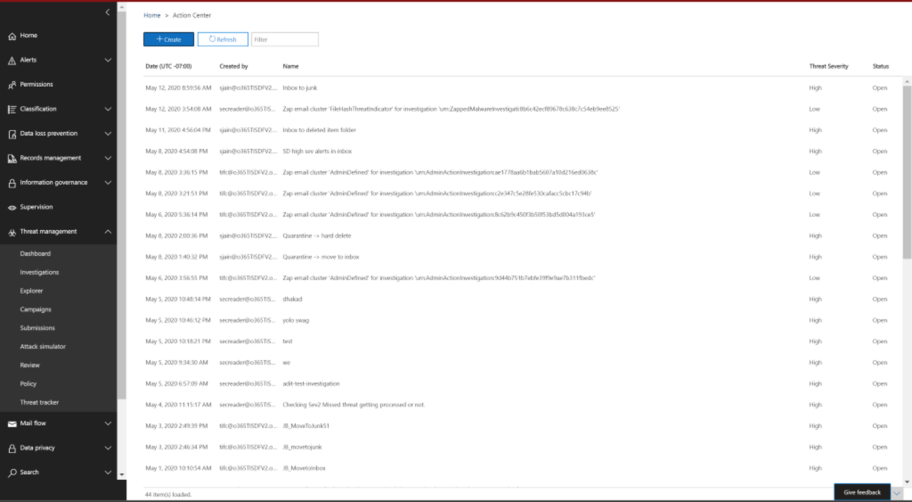

# Kwaadwillende e-mailberichten herstellen die worden bezorgd in Office 365

[!INCLUDE [Microsoft 365 Defender rebranding](../includes/microsoft-defender-for-office.md)]

Herstel houdt in dat u een voorgeschreven actie neemt tegen een bedreiging. Kwaadwillende e-mailberichten die naar uw organisatie worden verzonden, kunnen worden opgeschoond door het systeem, via het automatisch wissen van 0 uur (ZAP), of door beveiligings teams via herstelacties zoals *verplaatsen naar Postvak in*, *verplaatsen naar ongewenste e-mail*,  *verplaatsen naar verwijderde items*, *ongedaan* maken of verwijderen. Microsoft Defender voor Office 365 P2/E5 stelt beveiligings teams in staat bedreigingen te herstellen in de e-mail-en samenwerkings functionaliteit via handmatig en automatisch onderzoek.

> [!NOTE]
> Voor het herstellen van kwaadaardige e-mail hebben beveiligings teams de rol *zoeken en wissen* toegewezen. Roltoewijzing wordt uitgevoerd via machtigingen in het beveiligings-en compliance Center.

## Wat u moet weten voordat u begint

Beheerders kunnen de juiste actie ondernemen voor e-mailberichten, maar als ze zijn goedgekeurd, moeten ze de rol zoeken en de functie voor het *opschonen* van de beheerder toewijzen via **beveiliging & machtigingen voor compliance Center** \> . Zonder dat de rol ' zoeken en wissen ' aan een van de rol-groepen is toegevoegd, kunnen ze de actie niet uitvoeren.

## Handmatige en geautomatiseerde herstel

*Handmatige jacht* doet zich voor wanneer beveiligings teams handmatig hun bedreigingen identificeren met behulp van de functies voor zoekacties en filteren in de bedreigings Verkenner. Het handmatig doorsturen van e-mail kan worden geactiveerd via elke e-mail weergave (*malware*, *phishing* of *alle e-mail*) nadat u een reeks e-mailberichten hebt geïdentificeerd die moeten worden hersteld.

> [!div class="mx-imgBorder"]
> 

Met behulp van de bedreigings Verkenner kunt u op verschillende manieren e-mailberichten selecteren:

- Selecteer e-mailberichten met de hand: filters in verschillende weergaven gebruiken. Selecteer maximaal 100 e-mailberichten voor herstel.

- Query selectie: Selecteer een hele query met de knop **Alles selecteren** . Dezelfde query wordt ook weergegeven in het Actiecentrum: Details van het verzenden van e-mail.

- Query selectie met uitsluiting: soms wilt u e-mailberichten herstellen door een gehele query te selecteren en bepaalde e-mailberichten handmatig te uitsluiten van de query. Als u dit wilt doen, kunt een beheerder het selectievakje **Alles selecteren** en omlaag schuiven om e-mailberichten niet handmatig uit te sluiten. De query kan maximaal 1.000 e-mailberichten bevatten. Het maximale aantal uitsluitingen is 100.

Nadat u e-mailberichten hebt geselecteerd via de Threat Explorer, kunt u uw werk starten door rechtstreeks actie te ondernemen of door e-mailberichten te versturen voor een actie:

- Rechtstreeks goedkeuren: wanneer acties zoals *verplaatsen naar Postvak in*, naar *ongewenste e-mail* gaan, naar *Verwijderde items gaan*, een *tijdelijke verwijdering* of *permanent* verwijderen worden geselecteerd door beveiligingspersoneel met de juiste machtigingen, en worden de volgende stappen in herbemiddeling gevolgd, begint het herstelproces om de geselecteerde actie uit te voeren. Een tijdelijke flyout toont een herstelbewerking.

- Goedkeuring in twee stappen: een actie toevoegen aan een herstelbewerking kan worden uitgevoerd door beheerders die niet de juiste machtigingen hebben of de actie die moet worden uitgevoerd. In dit geval worden de gerichte e-mailberichten toegevoegd aan een herstel container. Er is een goedkeuring nodig voordat het herstel wordt uitgevoerd.

**Automatisch onderzoek-en antwoord** acties worden geactiveerd door waarschuwingen of door de bescherming van beveiligingsactiviteiten van de Threat Explorer. Dit kan aanbevolen herstelacties bevatten die moeten worden goedgekeurd door een team van beveiligingsactiviteiten. Deze acties worden opgenomen op het tabblad **actie** bij automatisch onderzoek.

> [!div class="mx-imgBorder"]
> 

Alle herstelbewerkingen (directe goedkeuring of goedkeuring van twee stappen) die zijn gemaakt in de Threat Explorer, en de goedgekeurde acties die afkomstig zijn van geautomatiseerde tests worden weergegeven in het Actiecentrum. U opent deze via het linker navigatie deel  venster onder \> **Actiecentrum** nakijken.

> [!div class="mx-imgBorder"]
> 

In het Actiecentrum worden alle herstelacties voor de afgelopen 30 dagen weergegeven. Acties die worden uitgevoerd via de bedreigings Verkenner, worden weergegeven op basis van de naam van het beveiligingsteam dat bij het maken van de herstelbewerking is uitgevoerd. Acties die via geautomatiseerde onderzoek worden verricht, hebben titels die beginnen met de verwante waarschuwing die het onderzoek heeft geactiveerd, zoals ' ZAP-e-mail cluster... '

Open elk herstelitem om informatie hierover weer te geven, zoals de naam, de aanmaakdatum, de beschrijving, de ernst van de bedreiging en de status. Ook de volgende twee tabbladen worden weergegeven.

- Tabblad **e-mail verzending** : hier ziet u het aantal e-mailberichten dat u hebt verzonden via de Threat Explorer of automatische onderzoek. Deze e-mailberichten kunnen actie ondernemen of niet op actie ondernemen.

  > [!div class="mx-imgBorder"]
  > 

  - **Actie**: e-mailberichten op de volgende locaties in het Cloud postvak kunnen op en worden verplaatst:
    - Postvak in
    - Ongewenste e-mail
    - Map verwijderd
    - Tijdelijke, verwijderde map

      > [!NOTE]
      > U kunt op dit moment alleen een gebruiker met toegang tot het postvak herstellen items uit een tijdelijke map verwijderen.

  - **Niet-actioneel**: e-mailberichten op de volgende locaties kunnen niet worden uitgevoerd op het tijdstip van herstelactie of zijn verplaatst.
    - Quarantaine
    - Map met verwijderde vaste mappen
    - On-premises/extern
    - Mislukt/neergezet

  Verdachte berichten zijn gecategoriseerd als herstelbaar of niet-herstelbaar. In de meeste gevallen kunt u verholpen berichten en niet-herstelbare berichten combineren totale aantal verzonden berichten. In zeldzame gevallen is dit niet waar. Dit kan gebeuren vanwege systeem vertragingen, time-outs of verlopen berichten. Berichten lopen af op basis van de bewaarperiode van de bedreigings Verkenner voor uw organisatie.

  U wordt aangeraden om oude berichten te herstellen nadat u de bewaarperiode voor de bedreiging van de organisatie hebt hersteld, maar u kunt het probleem mogelijk oplossen door de items opnieuw te herstellen als u nummer inconsistenties ziet. Herstel updates worden in enkele uren meestal vernieuwd voor vertragingen van het systeem.

  Als de bewaarperiode voor e-mailberichten in de bedreigings Verkenner 30 dagen duurt en u terugkeert naar e-mailberichten van 29-30, wordt het aantal verzending van e-mailberichten mogelijk niet altijd opgeteld. De e-mailberichten zijn mogelijk al na verloop van de bewaarperiode.

  Als hersteltijden in de status ' in uitvoering ' voor een tijdje blijven staan, is dit waarschijnlijk vanwege een systeem vertraging. Het kan een paar uur duren voordat het probleem is verholpen. Mogelijk ziet u variaties in e-mail verzendingen, omdat sommige e-mailberichten mogelijk niet zijn opgenomen in het begin van het herstel vanwege systeem vertragingen. Het is een goed idee om in dergelijke gevallen opnieuw te herstellen.

  > [!NOTE]
  > Voor de beste resultaten moet het herstel plaatsvinden in batches van 50.000 of minder.

  Alleen herstelbare e-mailberichten worden verwerkt tijdens het herstel. Niet-herstelbare e-mailberichten kunnen niet worden doorgevoerd in het Office 365-e-mailsysteem, aangezien ze niet zijn opgeslagen in Cloud postvakken.

  Beheerders kunnen op elk gewenst manier van e-mailberichten in quarantaine overstappen, maar deze e-mailberichten verlopen uit de quarantaine als ze niet handmatig worden verwijderd. E-mailberichten die zijn gequarantined omdat schadelijke inhoud niet toegankelijk zijn voor gebruikers, dient het beveiligingspersoneel geen actie te ondernemen om bedreigingen in quarantaine te verwijderen. Als het e-mailadres on-premises of extern is, kan de gebruiker contact met u opnemen om het verdachte e-mailadres te verhelpen. Of de beheerders kunnen gebruikmaken van aparte e-mailserver-en beveiligingshulpprogramma's voor verwijdering. Deze e-mailberichten kunnen worden geïdentificeerd door het toepassen van de *bezorgingslocatie = on-premises* extern filter in de Threat Explorer. Voor mislukte of genegeerde e-mailberichten of e-mailberichten die niet toegankelijk zijn voor gebruikers, zijn er geen e-mailberichten die kunnen worden verminderd, aangezien deze e-mailberichten het postvak niet bereiken.

  In de volgende afbeelding ziet u hoe een inzending in het Actiecentrum uitziet. Een herstel kan meerdere inzendingen bevatten. Wanneer meerdere acties worden goedgekeurd via één automatisch onderzoek, wordt elk e-mailbericht of e-mail cluster actie in dezelfde herbemiddeling weergegeven als een andere aanvraag.

  > [!div class="mx-imgBorder"]
  > 

  Selecteer een item voor de verzending van een e-mail om de details van die herstelfunctie weer te geven, zoals de query (wanneer herstel wordt geactiveerd via geautomatiseerde onderzoeken of de Threat Explorer via een query) en de begin-en eindtijd van herstel. Ook wordt een lijst weergegeven met berichten die zijn ingediend voor herstel. Wanneer berichten vanuit de bewaarperiode van de bedreigings Verkenner worden verplaatst, verdwijnen de berichten uit deze lijst. De lijst geeft ook individuele berichten weer die kunnen worden hersteld.

- **Actie logboeken**: dit tabblad bevat de berichten die zijn doorgevoerd, waaronder de goedkeuringsdatum, de beheerder die de actie, actie, status en aantallen heeft goedgekeurd.

  Status kan zijn:

  - **Begonnen**: herstel wordt geactiveerd.
  - **In de wachtrij geplaatst**: herbemiddeling is in de wachtrij geplaatst voor het beperken van e-mailberichten.
  - Wordt **uitgevoerd**: de beperking wordt uitgevoerd.
  - **Voltooid**: de beperking van alle herstelbare e-mailberichten is voltooid of met een aantal mislukte pogingen.
  - **Mislukt**: er zijn geen herstelbewerkingen gelukt.

  Wanneer alleen herstelbare e-mailberichten kunnen worden vastgelegd, wordt het opschonen van elke e-mail weergegeven als geslaagd of mislukt. Vanuit het totale aantal opherstel bare e-mails, geslaagde en mislukte beperkingen worden gerapporteerd.

  - **Gelukt**: de gewenste actie voor herstelbare e-mailberichten is voltooid. Een beheerder wil bijvoorbeeld e-mailberichten uit postvakken verwijderen, dus de beheerder gaat de actie van de Soft-e-mailberichten verwijderen. Als u na het uitvoeren van de actie een herstelbaar e-mailbericht niet kunt vinden in de oorspronkelijke map, wordt de status weergegeven als voltooid.

  - **Fout**: de gewenste actie voor herstelbare e-mailberichten mislukt. Een beheerder wil bijvoorbeeld e-mailberichten uit postvakken verwijderen, dus de beheerder gaat de actie van de Soft-e-mailberichten verwijderen. Als na het uitvoeren van de actie een herstelbaar e-mailbericht nog steeds wordt weergegeven in het postvak, wordt de status weergeven als mislukt.

  Selecteer een item in het Actielogboek om details van herstel weer te geven. Als de Details ' succesvol ' of ' niet gevonden in Postvak ' zijn, is dat item al uit het postvak verwijderd. Soms is er een systeemfout tijdens het herstel. In deze gevallen is het verstandig om herstel te herhalen.

  In geval van grote batches herstellen, kunt u ook berichten verzenden voor herbemiddeling via e-mail verzendingen en berichten die via het Actielogboek zijn hergevoerd. De export limiet wordt verhoogd tot afgesloten 100k records.

  Herstel is een krachtig hulpmiddel om bedreigingen te beperken en verdachte e-mailberichten te adresseren. Een organisatie helpt een organisatie veilig te houden.
