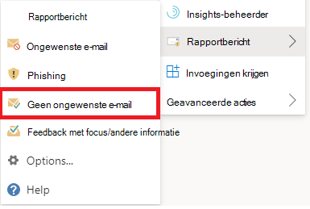

# Fout-positieven en fout-negatieven rapporteren in Outlook

[!INCLUDE [Microsoft 365 Defender rebranding](../includes/microsoft-defender-for-office.md)]

**Van toepassing op**
- [Exchange Online Protection](exchange-online-protection-overview.md)
- [Abonnement 1 en abonnement 2 voor Microsoft Defender voor Office 365](defender-for-office-365.md)
- [Microsoft 365 Defender](../defender/microsoft-365-defender.md)

> [!NOTE]
> Als u een beheerder bent in een Microsoft 365 organisatie met Exchange Online postvakken, raden we u aan de portal Inzendingen te gebruiken in het Beveiligings- & Compliancecentrum. Zie Beheerdersinzending gebruiken om [verdachte spam, phish, URL's en](admin-submission.md)bestanden in te dienen bij Microsoft voor meer informatie.

In Microsoft 365 organisaties met postvakken in Exchange Online of on-premises postvakken met hybride moderne verificatie, kunt u fout-positieven (goede e-mail die is geblokkeerd of verzonden naar ongewenste map) en onwaar negatieven (ongewenste e-mail of phish die in het Postvak IN is bezorgd) indienen bij Exchange Online Protection (EOP).

## Wat moet u weten voordat u begint?

- Voor de beste gebruikersinzendingservaring gebruikt u de invoeging Rapportbericht of de invoeging Phishing melden.

- Houd er rekening mee dat deze invoegtoepassing werkt Outlook op alle platforms: op het web, iOS, Android en desktop.

- Als u een beheerder bent in een organisatie met Exchange Online postvakken, gebruikt u de portal Inzendingen in het Beveiligings- & Compliancecentrum. Zie Beheerdersinzending gebruiken om [verdachte spam, phish, URL's en](admin-submission.md)bestanden in te dienen bij Microsoft voor meer informatie.

- U kunt configureren om berichten rechtstreeks naar Microsoft te verzenden, een postvak dat u opgeeft of beide. Zie Beleidsregels voor [gebruikersinzendingen voor meer informatie.](user-submission.md)

- Zie Het rapportbericht inschakelen of de phishing-invoegvoegingen rapporteren voor meer informatie over het verkrijgen en inschakelen van het rapportbericht of de [phishing-invoegvoegingen.](enable-the-report-message-add-in.md)

- Zie Berichten en bestanden rapporteren aan Microsoft voor meer informatie over het rapporteren van berichten [aan Microsoft.](report-junk-email-messages-to-microsoft.md)

## De functie Rapportbericht gebruiken

### Ongewenste e-mailberichten en phishingberichten rapporteren

Voor berichten in het Postvak IN of een andere e-mailmap, behalve Ongewenste e-mail, gebruikt u de volgende methode om spam- en phishingberichten te melden:

1. Klik op **de** drie puntjes Meer acties in de rechterbovenhoek van het geselecteerde bericht, klik in de vervolgkeuzelijst op Bericht rapporteren en selecteer **vervolgens Ongewenste** e-mail of **Phishing.** 

   > [!div class="mx-imgBorder"]
   > 

   > [!div class="mx-imgBorder"]
   > 

2. De geselecteerde berichten worden naar Microsoft verzonden voor analyse en:

   - Verplaatst naar de map Ongewenste e-mail als deze is gerapporteerd als spam.

   - Verwijderd als dit is gerapporteerd als phishing.

### Berichten rapporteren die geen ongewenste e-mail zijn

1. Klik op **de** drie puntjes Meer acties in de rechterbovenhoek van het geselecteerde bericht, klik in de vervolgkeuzelijst op Bericht rapporteren en klik vervolgens op **Geen ongewenste e-mail.** 

   > [!div class="mx-imgBorder"]
   > 

   > [!div class="mx-imgBorder"]
   > 

2. Het geselecteerde bericht wordt ter analyse naar Microsoft verzonden en verplaatst naar Postvak IN of een andere opgegeven map.

## Gerapporteerde berichten weergeven en controleren

Als u berichten wilt bekijken die gebruikers rapporteren aan Microsoft, hebt u de volgende opties:

- Gebruik de portal Beheerdersinzendingen. Zie Gebruikersinzendingen [weergeven bij Microsoft voor meer informatie.](admin-submission.md#view-user-submissions-to-microsoft)

- Maak een regel voor de e-mailstroom (ook wel transportregel genoemd) om kopieën van gerapporteerde berichten te verzenden. Zie Regels voor [e-mailstroom gebruiken voor](/exchange/security-and-compliance/mail-flow-rules/use-rules-to-see-what-users-are-reporting-to-microsoft)instructies om te zien wat gebruikers rapporteren aan Microsoft.
