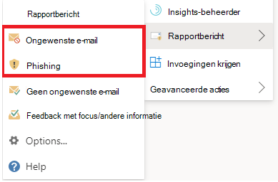

# Fout-positieven en fout-negatieven rapporteren in OutlookReport false positives and false negatives in Outlook

[!INCLUDE [Microsoft 365 Defender rebranding](../includes/microsoft-defender-for-office.md)]

**Van toepassing op****Applies to**
- [Exchange Online ProtectionExchange Online Protection](exchange-online-protection-overview.md)
- [Abonnement 1 en abonnement 2 voor Microsoft Defender voor Office 365Microsoft Defender for Office 365 plan 1 and plan 2](defender-for-office-365.md)
- [Microsoft 365 DefenderMicrosoft 365 Defender](../defender/microsoft-365-defender.md)

> [!NOTE]
> Als u een beheerder bent in een Microsoft 365 organisatie met Exchange Online postvakken, raden we u aan de portal Inzendingen te gebruiken in het Beveiligings- & Compliancecentrum.If you're an admin in a Microsoft 365 organization with Exchange Online mailboxes, we recommend that you use the Submissions portal in the Security & Compliance Center. Zie Beheerdersinzending gebruiken om [verdachte spam, phish, URL's en](admin-submission.md)bestanden in te dienen bij Microsoft voor meer informatie.For more information, see [Use Admin Submission to submit suspected spam, phish, URLs, and files to Microsoft](admin-submission.md).

In Microsoft 365 organisaties met postvakken in Exchange Online of on-premises postvakken met hybride moderne verificatie, kunt u fout-positieven (goede e-mail die is geblokkeerd of verzonden naar ongewenste map) en onwaar negatieven (ongewenste e-mail of phish die in het Postvak IN is bezorgd) indienen bij Exchange Online Protection (EOP).In Microsoft 365 organizations with mailboxes in Exchange Online or on-premises mailboxes using hybrid modern authentication, you can submit false positives (good email that was blocked or sent to junk folder) and false negatives (unwanted email or phish that was delivered to the inbox) to Exchange Online Protection (EOP).

## Wat moet u weten voordat u begint?What do you need to know before you begin?

- Voor de beste gebruikersinzendingservaring gebruikt u de invoeging Rapportbericht of de invoeging Phishing melden.For the best user submission experience, use the Report Message add-in or the Report Phishing add-in.

- Houd er rekening mee dat deze invoegtoepassing werkt Outlook op alle platforms: op het web, iOS, Android en desktop.Note that this add-in works for Outlook in all platforms—on the web, iOS, Android, and Desktop.

- Als u een beheerder bent in een organisatie met Exchange Online postvakken, gebruikt u de portal Inzendingen in het Beveiligings- & Compliancecentrum.If you're an admin in an organization with Exchange Online mailboxes, use the Submissions portal in the Security & Compliance Center. Zie Beheerdersinzending gebruiken om [verdachte spam, phish, URL's en](admin-submission.md)bestanden in te dienen bij Microsoft voor meer informatie.For more information, see [Use Admin Submission to submit suspected spam, phish, URLs, and files to Microsoft](admin-submission.md).

- U kunt configureren om berichten rechtstreeks naar Microsoft te verzenden, een postvak dat u opgeeft of beide.You can configure to send messages directly to Microsoft, a mailbox you specify, or both. Zie Beleidsregels voor [gebruikersinzendingen voor meer informatie.](user-submission.md)For more information, see [User submissions policies](user-submission.md).

- Zie Het rapportbericht inschakelen of de phishing-invoegvoegingen rapporteren voor meer informatie over het verkrijgen en inschakelen van het rapportbericht of de [phishing-invoegvoegingen.](enable-the-report-message-add-in.md)For more information on how to get and enable the Report Message or the Report Phishing add-ins, see [Enable the Report Message or the Report Phishing add-ins](enable-the-report-message-add-in.md).

- Zie Berichten en bestanden rapporteren aan Microsoft voor meer informatie over het rapporteren van berichten [aan Microsoft.](report-junk-email-messages-to-microsoft.md)For more information about reporting messages to Microsoft, see [Report messages and files to Microsoft](report-junk-email-messages-to-microsoft.md).

## De functie Rapportbericht gebruikenUse the Report Message feature

### Ongewenste e-mailberichten en phishingberichten rapporterenReport junk and phishing messages

Voor berichten in het Postvak IN of een andere e-mailmap, behalve Ongewenste e-mail, gebruikt u de volgende methode om spam- en phishingberichten te melden:For messages in the Inbox or any other email folder except Junk Email, use the following method to report spam and phishing messages:

1. Klik op **de** drie puntjes Meer acties in de rechterbovenhoek van het geselecteerde bericht, klik in de vervolgkeuzelijst op Bericht rapporteren en selecteer **vervolgens Ongewenste** e-mail of **Phishing.** Click the **More actions** ellipses on the top-right corner of the selected message, click **Report message** from the dropdown menu, and then select **Junk** or **Phishing**.
  
   > [!div class="mx-imgBorder"]
   > 

   > [!div class="mx-imgBorder"]
   > 

2. De geselecteerde berichten worden naar Microsoft verzonden voor analyse en:The selected messages will be sent to Microsoft for analysis and:

   - Verplaatst naar de map Ongewenste e-mail als deze is gerapporteerd als spam.Moved to the Junk Email folder if it was reported as spam.

   - Verwijderd als dit is gerapporteerd als phishing.Deleted if it was reported as phishing.
   
### Berichten rapporteren die geen ongewenste e-mail zijnReport messages that are not junk

1. Klik op **de** drie puntjes Meer acties in de rechterbovenhoek van het geselecteerde bericht, klik in de vervolgkeuzelijst op Bericht rapporteren en klik vervolgens op **Geen ongewenste e-mail.** Click the **More actions** ellipses on the top-right corner of the selected message, click **Report message** from the dropdown menu, and then click **Not Junk**.  

   > [!div class="mx-imgBorder"]
   > 

   > [!div class="mx-imgBorder"]
   > 

2. Het geselecteerde bericht wordt ter analyse naar Microsoft verzonden en verplaatst naar Postvak IN of een andere opgegeven map.The selected message will be sent to Microsoft for analysis and moved to Inbox or any other specified folder.

## Gerapporteerde berichten weergeven en controlerenView and review reported messages

Als u berichten wilt bekijken die gebruikers rapporteren aan Microsoft, hebt u de volgende opties:To review messages that users report to Microsoft, you have these options:

- Gebruik de portal Beheerdersinzendingen.Use the Admin Submissions portal. Zie Gebruikersinzendingen [weergeven bij Microsoft voor meer informatie.](admin-submission.md#view-user-submissions-to-microsoft)For more information, see [View user submissions to Microsoft](admin-submission.md#view-user-submissions-to-microsoft).

- Maak een regel voor de e-mailstroom (ook wel transportregel genoemd) om kopieën van gerapporteerde berichten te verzenden.Create a mail flow rule (also known as a transport rule) to send copies of reported messages. Zie Regels voor [e-mailstroom gebruiken voor](use-mail-flow-rules-to-see-what-your-users-are-reporting-to-microsoft.md)instructies om te zien wat uw gebruikers rapporteren aan Microsoft.For instructions, see [Use mail flow rules to see what your users are reporting to Microsoft](use-mail-flow-rules-to-see-what-your-users-are-reporting-to-microsoft.md).