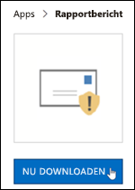

# Fout-positieven en onwaar-negatieven rapporteren in Outlook

[!INCLUDE [Microsoft 365 Defender rebranding](../includes/microsoft-defender-for-office.md)]

**Van toepassing op**
- [Exchange Online Protection](exchange-online-protection-overview.md)
- [Abonnement 1 en abonnement 2 voor Microsoft Defender voor Office 365](defender-for-office-365.md)
- [Microsoft 365 Defender](../defender/microsoft-365-defender.md)

> [!NOTE]
> Als u een beheerder bent in een Microsoft 365-organisatie met Exchange Online-postvakken, raden we u aan de portal Inzendingen te gebruiken in het Beveiligings- & Compliancecentrum. Zie Beheerdersinzending gebruiken om [verdachte spam, phish, URL's en](admin-submission.md)bestanden in te dienen bij Microsoft voor meer informatie.

In Microsoft 365-organisaties met postvakken in Exchange Online of on-premises postvakken die gebruikmaken van hybride moderne verificatie, kunt u false positives (goede e-mail gemarkeerd als spam) en onwaar negatieven (slechte e-mail en phish toegestaan) indienen bij Exchange Online Protection (EOP).

## Dingen die u moet onthouden voordat u de functie Rapportbericht gebruikt

- Voor de beste gebruikersinzendingservaring gebruikt u de invoeging Rapportbericht of de invoeging Phishing melden.

- Houd er rekening mee dat deze invoegtoepassing werkt voor Outlook op alle platforms, op het web, iOS, Android en desktop.

- Als u een beheerder bent in een organisatie met Exchange Online-postvakken, gebruikt u de portal Inzendingen in het Beveiligings- & Compliancecentrum. Zie Beheerdersinzending gebruiken om [verdachte spam, phish, URL's en](admin-submission.md)bestanden in te dienen bij Microsoft voor meer informatie.

- U kunt configureren om berichten rechtstreeks naar Microsoft te verzenden, een postvak dat u opgeeft of beide. Zie Beleidsregels voor [gebruikersinzendingen voor meer informatie.](user-submission.md)

- Zie Berichten en bestanden rapporteren aan Microsoft voor meer informatie over het rapporteren van berichten [aan Microsoft.](report-junk-email-messages-to-microsoft.md)

## De functie Rapportbericht gebruiken

### Ongewenste e-mailberichten en phishingberichten rapporteren

Voor berichten in het Postvak IN of een andere e-mailmap, behalve Ongewenste e-mail, gebruikt u de volgende methode om spam- en phishingberichten te melden:

1. Klik op **de** drie puntjes Meer acties in de rechterbovenhoek van het geselecteerde bericht, klik in de vervolgkeuzelijst op Bericht rapporteren en selecteer **vervolgens Ongewenste** e-mail of **Phishing.** 
  
   > [!div class="mx-imgBorder"]
   > 

   > [!div class="mx-imgBorder"]
   > 

2. De geselecteerde berichten worden naar Microsoft verzonden voor analyse en:

   - Verplaatst naar de map Ongewenste e-mail als deze is gerapporteerd als spam.

   - Verwijderd als dit is gerapporteerd als phishing.
   
### Berichten rapporteren die geen ongewenste e-mail zijn

1. Klik op **de** drie puntjes Meer acties in de rechterbovenhoek van het geselecteerde bericht, klik in de vervolgkeuzelijst op Bericht rapporteren en klik vervolgens op **Geen ongewenste e-mail.**   

   > [!div class="mx-imgBorder"]
   > 

   > [!div class="mx-imgBorder"]
   > 

2. Het geselecteerde bericht wordt ter analyse naar Microsoft verzonden en verplaatst naar Postvak IN of een andere opgegeven map.

## De invoegvoegingen Rapportbericht en Phishing melden inschakelen

Met de invoegvoegingen Rapportbericht en Rapport phishing voor de webversie van Outlook en Outlook (voorheen Bekend als Outlook Web App) kunnen personen eenvoudig onwaar-positieven (goede e-mail die als slecht is gemarkeerd) of onwaar negatieven (slechte e-mail toegestaan) rapporteren aan Microsoft en haar gelieerde bedrijven voor analyse. 

Microsoft gebruikt deze inzendingen om de effectiviteit van e-mailbeveiligingstechnologieën te verbeteren. Stel dat mensen veel berichten rapporteren met de invoeging Phishing melden. Deze informatie wordt in het beveiligingsdashboard en andere rapporten opgedoken. Het beveiligingsteam van uw organisatie kan deze informatie gebruiken als een indicatie dat anti-phishingbeleid mogelijk moet worden bijgewerkt. 

U kunt de invoeging Rapportbericht of Phishing melden installeren. Als u wilt dat uw gebruikers zowel spam- als phishingberichten rapporteren, implementeert u de invoeging Rapportbericht in uw organisatie. Zie De invoegvoegapp Rapportbericht inschakelen voor meer informatie. 

De invoegoptie Rapportbericht biedt de optie om zowel spam- als phishingberichten te rapporteren. Beheerders kunnen de invoeging Rapportbericht voor de organisatie inschakelen en afzonderlijke gebruikers kunnen het zelf installeren. 

De invoegvoegvoegoptie Phishing melden biedt de optie om alleen phishingberichten te rapporteren. Beheerders kunnen de invoeging Phishing melden inschakelen voor de organisatie en afzonderlijke gebruikers kunnen deze zelf installeren. 

Als u een individuele gebruiker bent, kunt u beide invoegvoegingen voor uzelf inschakelen.

f u een globale beheerder of een Exchange Online-beheerder bent en Exchange is geconfigureerd voor OAuth-verificatie, u kunt de invoegvoeging Rapportbericht en de invoeging Phishing melden inschakelen voor uw organisatie. Beide invoegvoegingen zijn nu beschikbaar via [Gecentraliseerde implementatie.](../../admin/manage/centralized-deployment-of-add-ins.md)

## Wat moet u weten voordat u begint?

- Zowel de invoeging Report Message als de invoeging Report Phishing werkt met de meeste Microsoft 365-abonnementen en de volgende producten:

  - De webversie van Outlook
  - Outlook 2013 SP1 of hoger
  - Outlook 2016 voor Mac
  - Outlook inbegrepen bij Microsoft 365-apps voor Enterprise
  - Outlook-app voor iOS en Android

- Beide invoegvakken zijn niet beschikbaar voor gedeelde postvakken of postvakken in on-premises Exchange-organisaties.

- Uw bestaande webbrowser moet werken met zowel de invoegvoegingen Rapportbericht als Phishing melden. Maar als u merkt dat de invoegvoeging niet beschikbaar is of niet werkt zoals verwacht, probeert u een andere browser.

- Voor organisatie-installaties moet de organisatie zijn geconfigureerd voor het gebruik van OAuth-verificatie. Zie Bepalen of gecentraliseerde implementatie van invoegvoegingen werkt [voor uw organisatie voor meer informatie.](../../admin/manage/centralized-deployment-of-add-ins.md)

- Beheerders moeten lid zijn van de rollengroep Globale beheerders. Zie [Machtigingen in het Beveiligings- & compliancecentrum](permissions-in-the-security-and-compliance-center.md) voor meer informatie.

## De invoegvoegvoegvoeging Rapportbericht ontvangen

### De invoeging voor uzelf krijgen

1. Ga naar de Microsoft AppSource bij <https://appsource.microsoft.com/marketplace/apps> en zoek naar de invoeging Rapportbericht. Als u rechtstreeks naar de invoeging Rapportbericht wilt gaan, gaat u naar <https://appsource.microsoft.com/product/office/wa104381180> .

2. Klik **op NU krijgen.**

   

3. Bekijk in het dialoogvenster dat wordt weergegeven de gebruiksvoorwaarden en het privacybeleid en klik vervolgens op **Doorgaan.**

4. Meld u aan met uw werk- of schoolaccount (voor zakelijk gebruik) of uw Microsoft-account (voor persoonlijk gebruik).

Nadat de invoegvoegvoeging is geïnstalleerd en ingeschakeld, ziet u de volgende pictogrammen:

- In Outlook ziet het pictogram er als volgende uit:

  > [!div class="mx-imgBorder"]
  > 

- In de webversie van Outlook ziet het pictogram er als volgende uit:

  > [!div class="mx-imgBorder"]
  > 

### De invoeging voor uw organisatie krijgen

> [!NOTE]
> Het kan tot 12 uur duren voordat de invoegvoeging wordt weergegeven in uw organisatie.

1. Ga in het Microsoft 365-beheercentrum  naar de pagina Instellingen \> **invoegvoegingen** op <https://admin.microsoft.com/AdminPortal/Home#/Settings/AddIns> . Als u de invoegpagina niet ziet,  gaat u naar de koppeling Geïntegreerde apps met instellingen boven aan de pagina Geïntegreerde  \>  \>  **apps.**

2. Selecteer **Invoegvoegvoeging implementeren** boven aan de pagina en selecteer vervolgens **Volgende.**

   

3. Controleer de informatie in het **fly-out Nieuwe invoegsel** implementeren dat wordt weergegeven en klik vervolgens op **Volgende.**

4. Klik op de volgende pagina op **Kiezen uit de Store.**

   

5. Klik in het vak Zoeken op de  pagina Selecteer **invoegbericht** dat wordt weergegeven, voer **Rapportbericht** in en klik vervolgens op **zoekpictogram**  . Zoek rapportbericht in de lijst met **resultaten** en klik vervolgens op **Toevoegen.**

   

6. Controleer in het dialoogvenster dat wordt weergegeven de licentie- en privacygegevens en klik vervolgens op **Doorgaan.**

7. Configureer de volgende instellingen op de **pagina Invoeging** configureren die wordt weergegeven:

   - **Toegewezen gebruikers:** Selecteer een van de volgende waarden:

     - **Iedereen** (standaard)
     - **Specifieke gebruikers/groepen**
     - **Alleen ik**

   - **Implementatiemethode:** Selecteer een van de volgende waarden:

     - **Opgelost (standaard)**: De invoeging wordt automatisch geïmplementeerd voor de opgegeven gebruikers en kan niet worden verwijderd.
     - **Beschikbaar:** Gebruikers kunnen de invoegvoeging installeren bij **Home** \> **Get-invoegvoegingen** beheerd door \> **beheerder.**
     - **Optioneel:** De invoeging wordt automatisch geïmplementeerd voor de opgegeven gebruikers, maar ze kunnen ervoor kiezen deze te verwijderen.

   

   Wanneer u klaar bent, klikt u op **Implementeren.**

8. Op de **pagina Rapportbericht** implementeren dat wordt weergegeven, ziet u een voortgangsrapport, gevolgd door een bevestiging dat de invoegvoeging is geïmplementeerd. Nadat u de informatie hebt gelezen, klikt u op **Volgende**.

   

9. Controleer de gegevens op de **pagina Invoeging** aankondigen die wordt weergegeven en klik op **Sluiten.**

   

## Instellingen controleren of bewerken voor de invoegvoegbewerking Rapportbericht

1. Ga in het Microsoft 365-beheercentrum  naar de pagina Instellingen \> **invoegvoegingen** op <https://admin.microsoft.com/AdminPortal/Home#/Settings/AddIns> . Als u de invoegpagina niet ziet,  gaat u naar de koppeling Geïntegreerde apps met instellingen boven aan de pagina Geïntegreerde  \>  \>  **apps.**

   

2. Zoek en selecteer de **invoeging Rapportbericht.**

3. In het **flyout Rapportbericht bewerken** dat wordt weergegeven, controleert en bewerkt u de instellingen die geschikt zijn voor uw organisatie. Klik op **Opslaan** wanneer u gereed bent.

   

## De invoeging Phishing melden

### De invoeging voor uzelf krijgen

1. Ga naar de Microsoft AppSource op <https://appsource.microsoft.com/marketplace/apps> en zoek naar de invoeging Phishing melden.

2. Klik **op NU krijgen.**

3. Bekijk in het dialoogvenster dat wordt weergegeven de gebruiksvoorwaarden en het privacybeleid en klik vervolgens op **Doorgaan.**

4. Meld u aan met uw werk- of schoolaccount (voor zakelijk gebruik) of uw Microsoft-account (voor persoonlijk gebruik).

Nadat de invoegvoegvoeging is geïnstalleerd en ingeschakeld, ziet u de volgende pictogrammen:

- In Outlook ziet het pictogram er als volgende uit:

  

- In de webversie van Outlook ziet het pictogram er als volgende uit:

  > [!div class="mx-imgBorder"]
  > 

### De invoeging voor uw organisatie krijgen

> [!NOTE]
> Het kan tot 12 uur duren voordat de invoegvoeging wordt weergegeven in uw organisatie.

1. Ga in het Microsoft 365-beheercentrum  naar de pagina Instellingen \> **invoegvoegingen** op <https://admin.microsoft.com/AdminPortal/Home#/Settings/AddIns> . Als u de invoegpagina niet ziet,  gaat u naar de koppeling Geïntegreerde apps met instellingen boven aan de pagina Geïntegreerde  \>  \>  **apps.**

2. Selecteer **Invoegvoegvoeging implementeren** boven aan de pagina en selecteer vervolgens **Volgende.**

   

3. Controleer de informatie in het **fly-out Nieuwe invoegsel** implementeren dat wordt weergegeven en klik vervolgens op **Volgende.**

4. Klik op de volgende pagina op **Kiezen uit de Store.**

   

5. Klik in het vak Zoeken op de  **pagina** Invoeg toevoegen selecteren die wordt weergegeven, voer **Rapport phishing** in en klik vervolgens op **zoekpictogram**  . Zoek in de lijst met resultaten **naar Rapport phishing** en klik vervolgens op **Toevoegen.**

6. Controleer in het dialoogvenster dat wordt weergegeven de licentie- en privacygegevens en klik vervolgens op **Doorgaan.**

7. Configureer de volgende instellingen op de **pagina Invoeging** configureren die wordt weergegeven:

   - **Toegewezen gebruikers:** Selecteer een van de volgende waarden:

     - **Iedereen** (standaard)
     - **Specifieke gebruikers/groepen**
     - **Alleen ik**

   - **Implementatiemethode:** Selecteer een van de volgende waarden:

     - **Opgelost (standaard)**: De invoeging wordt automatisch geïmplementeerd voor de opgegeven gebruikers en kan niet worden verwijderd.
     - **Beschikbaar:** Gebruikers kunnen de invoegvoeging installeren bij **Home** \> **Get-invoegvoegingen** beheerd door \> **beheerder.**
     - **Optioneel:** De invoeging wordt automatisch geïmplementeerd voor de opgegeven gebruikers, maar ze kunnen ervoor kiezen deze te verwijderen.

   Wanneer u klaar bent, klikt u op **Implementeren.**

8. Op de **pagina Rapport phishing implementeren** dat wordt weergegeven, ziet u een voortgangsrapport, gevolgd door een bevestiging dat de invoeging is geïmplementeerd. Nadat u de informatie hebt gelezen, klikt u op **Volgende**.

9. Controleer de gegevens op de **pagina Invoeging** aankondigen die wordt weergegeven en klik op **Sluiten.**

## Instellingen controleren of bewerken voor de invoeging Phishingrapport

1. Ga in het Microsoft 365-beheercentrum  naar de pagina Instellingen \> **invoegvoegingen** op <https://admin.microsoft.com/AdminPortal/Home#/Settings/AddIns> . Als u de invoegpagina niet ziet,  gaat u naar de koppeling Geïntegreerde apps met instellingen boven aan de pagina Geïntegreerde  \>  \>  **apps.**

2. Zoek en selecteer de **invoeging Phishing** melden.

3. In het **flyout Rapport phishing bewerken** dat de instellingen voor uw organisatie wordt weergegeven, controleren en bewerken. Klik op **Opslaan** wanneer u gereed bent.

## Gerapporteerde berichten weergeven en controleren

Als u berichten wilt bekijken die gebruikers rapporteren aan Microsoft, hebt u de volgende opties:

- Gebruik de portal Beheerdersinzendingen. Zie Gebruikersinzendingen [weergeven bij Microsoft voor meer informatie.](admin-submission.md#view-user-submissions-to-microsoft)

- Maak een regel voor de e-mailstroom (ook wel transportregel genoemd) om kopieën van gerapporteerde berichten te verzenden. Zie Regels voor [e-mailstroom gebruiken voor](use-mail-flow-rules-to-see-what-your-users-are-reporting-to-microsoft.md)instructies om te zien wat uw gebruikers rapporteren aan Microsoft.