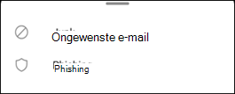

# Ongewenste e-mail en malafide e-mailberichten in Outlook voor iOS en Android melden in Exchange OnlineReport junk and phishing email in Outlook for iOS and Android in Exchange Online

[!INCLUDE [Microsoft 365 Defender rebranding](../includes/microsoft-defender-for-office.md)]

In Microsoft 365-organisaties met postvakken in Exchange Online of on-premises postvakken met [hybride moderne verificatie](https://docs.microsoft.com/microsoft-365/enterprise/hybrid-modern-auth-overview)kunt u de ingebouwde rapportopties in Outlook voor IOS en Android gebruiken voor het verzenden van onjuiste positieven (goede e-mailberichten die als spam zijn gemarkeerd), fout-negatieven (onjuiste e-mail toegestaan) en phishingberichten voor Exchange Online Protection (EOP).In Microsoft 365 organizations with mailboxes in Exchange Online or on-premises mailboxes using [hybrid modern authentication](https://docs.microsoft.com/microsoft-365/enterprise/hybrid-modern-auth-overview), you can use the built-in reporting options in Outlook for iOS and Android to submit false positives (good email marked as spam), false negatives (bad email allowed), and phishing messages to Exchange Online Protection (EOP).

## Wat moet u weten voordat u begintWhat do you need to know before you begin

- Als u een beheerder bent van een organisatie met postvakken van Exchange Online, raden we u aan om de portal voor ingediende vragen te gebruiken in het beveiligings & nalevings centrum.If you're an admin in an organization with Exchange Online mailboxes, we recommend that you use the Submissions portal in the Security & Compliance Center. Zie voor meer informatie [beheer van beheerders gebruiken om verdachte spam, phishing, url's en bestanden naar Microsoft te verzenden](admin-submission.md).For more information, see [Use Admin Submission to submit suspected spam, phish, URLs, and files to Microsoft](admin-submission.md).

- U kunt gerapporteerde berichten configureren voor kopiëren of omleiden naar een door u opgegeven postvak.You can configure reported messages to be copied or redirected to a mailbox that you specify. Zie voor meer informatie [beleidsregels voor gebruikers ingediend](user-submission.md).For more information, see [User Submissions policies](user-submission.md).

- Zie [berichten en bestanden rapporteren aan Microsoft](report-junk-email-messages-to-microsoft.md)voor meer informatie over het rapporteren van berichten aan Microsoft.For more information about reporting messages to Microsoft, see [Report messages and files to Microsoft](report-junk-email-messages-to-microsoft.md).

  > [!NOTE]
  > Als het rapporteren van ongewenste e-mail voor Outlook is uitgeschakeld in het beleid voor het indienen van gebruikers, worden ongewenste e-mail of phishing-berichten verplaatst naar de map Ongewenste E-mail en niet gerapporteerd aan de beheerder of Microsoft.If junk email reporting is disabled for Outlook in the user submission policy, junk or phishing messages will be moved to the Junk folder and not reported to your admin or Microsoft.

## Spamberichten en phishingberichten melden in Outlook voor iOS en AndroidReport spam and phishing messages in Outlook for iOS and Android

Voor berichten in het postvak in of een andere e-mailmap met uitzondering van ongewenste E-mail voert u de volgende stappen uit om spam en phishing-berichten te rapporteren voor iOS en Android:For messages in the Inbox, or any other email folder except Junk Email, use the following steps to report spam and phishing messages for iOS and Android:

1. Selecteer een of meer berichten.Select one or more messages.
2. Tik in de rechterbovenhoek op de drie verticale stippen.In the top-right corner tap on the three vertical dots. Het actiemenu wordt geopend.The action menu opens.

   

3. Tik op **Ongewenste E-mail rapporteren** en selecteer vervolgens **ongewenste e-mail** of **phishing**.Tap **Report junk** and then select **Junk** or **Phishing**.

   

4. In het dialoogvenster dat wordt weergegeven, kunt u op **rapport** of **Nee bedankt**klikken.In the dialog that appears, you can choose **Report** or **No Thanks**. Als u **geen dank**hebt getikt, **wordt het bericht** naar de map Ongewenste e-mail verplaatst, als **u de map** hebt getikt.On selecting **No Thanks**, if you tapped **Junk** the message moves to the Junk Email folder, if you tapped **Phishing** the message moves to the Deleted Items folder. Selecteer **rapport** om ook een kopie van het bericht naar Microsoft te verzenden.Select **Report** to also send a copy of the message to Microsoft.

   

Als u van gedachten verandert, selecteert u **ongedaan maken** in de pop-upmelding die wordt weergegeven.If you change your mind, select **Undo** on the toast notification that appears. Het bericht blijft staan in de map Postvak in.The message remains in the Inbox folder.

## Niet-spamberichten rapporteren van de map Ongewenste E-mail in Outlook voor iOS en AndroidReport non-spam messages from the Junk folder in Outlook for iOS and Android

In de map Ongewenste E-mail voert u de volgende stappen uit om spam fout-positieven te rapporteren:In the Junk folder, use the following steps to report spam false positives:

1. Selecteer een of meer berichten.Select one or more messages.
2. Tik in de rechterbovenhoek op de drie verticale stippen.In the top-right corner tap on the three vertical dots. Het actiemenu wordt geopend.The action menu opens.

   

3. Tik op **geen ongewenste e-mail**.Tap **Not junk**.

Er verschijnt een melding dat het e-mailbericht is verplaatst naar uw postvak in.A toast notification appears that the email has moved to your Inbox. Als u van gedachten verandert, selecteert u **ongedaan maken** in de pop-upmelding.If you change your mind, select **Undo** on the toast notification. Het e-mailbericht blijft in de map Ongewenste E-mail staan.The email remains in the Junk folder.
