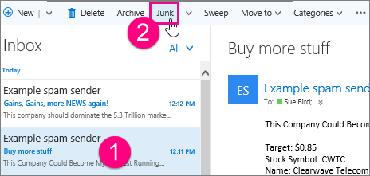

# Ongewenste e-mail en phishing-scams melden in de webversie van Outlook

Het kan frustrerend zijn wanneer gebruikers in uw organisatie ongewenste e-mail ontvangen of een belangrijke e-mail missen omdat deze verkeerd is geïdentificeerd als spam. We verfijnen voortdurend de Exchange Online Protection (EOP) spamfilters om nauwkeuriger te zijn, en u en uw eindgebruikers kunnen u helpen met dit proces; Gebruikers van Microsoft Outlook on the Web kunnen ongewenste (spam) en phishing-scams melden met behulp van ingebouwde opties voor e-mailrapportage. U Microsoft ook laten weten of een e-mail ten onrechte is geïdentificeerd als ongewenste e-mail (spam).

## Ongewenste berichten verzenden in de webversie van Outlook

Ga als lid van het e-mailbericht naar Microsoft:

1. Klik op het ongewenste bericht en klik vervolgens op **Ongewenste e-mail** op de werkbalk. Hiermee wordt het bericht verplaatst naar uw map ongewenste e-mail en wordt de afzender toegevoegd aan de lijst met geblokkeerde afzenders.

   

   > [!NOTE]
   > U ook met de rechtermuisknop op een bericht klikken om een menu weer te geven en op **Markeren als ongewenste e-mail**klikken.

   U een ongewenste bericht rapporteren vanuit uw **inbox** of de map **Verwijderde items.**

2. Er wordt een dialoogvenster geopend met de vraag of u een kopie van het ongewenste e-mailbericht naar Microsoft wilt verzenden voor analyse. Klik **op rapport** om het bericht naar het Microsoft Spam Analysis Team te sturen. Schakel optioneel het selectievakje **Dit bericht niet opnieuw weergeven** in als u toekomstige ongewenste berichten automatisch aan Microsoft wilt verzenden zonder dat u wordt gevraagd.

   

   > [!TIP]
   > Zelfs als u het selectievakje **Dit bericht niet opnieuw weergeven** inschakelt, u later uw voorkeuren voor het melden van ongewenste e-mail wijzigen door toegang te krijgen tot de weergave-instellingen in de webversie van Outlook. (Je hebt toegang tot deze instellingen via het uitrustingsmenu naast je naambord.)

## Phishing-scamberichten verzenden in de webversie van Outlook

Ga als lid van microsoft een phishing-scambericht naar microsoft:

1. Klik op het phishing-scambericht, klik op de pijl-omlaag naast **Ongewenste e-mail**en klik vervolgens op **Phishing** op de werkbalk. Office 365 blokkeert de afzender niet omdat afzenders van phishing-scamberichten zich doorgaans voordoen als legitieme afzenders. Voeg desgevraagd de afzender toe aan de lijst met geblokkeerde afzenders door de instructies in het onderwerp [Ongewenste e-mail en spam in de webversie van Outlook te](https://support.office.com/article/db786e79-54e2-40cc-904f-d89d57b7f41d)volgen.

   

   U ook met de rechtermuisknop op een bericht klikken om een menu weer te geven en op **Markeren als phishing**klikken.

   U een phishing-scambericht melden vanuit uw **inbox** of de map **Verwijderde items.**

2. Voor sommige organisaties wordt een dialoogvenster geopend met de vraag of u een kopie van de phishing-scam-e-mail naar Microsoft wilt verzenden voor analyse. Klik **op rapport** om het bericht naar het Microsoft Spam Analysis Team te sturen. Deze rapportageoptie is momenteel beschikbaar voor een beperkt aantal organisaties; u wordt mogelijk niet gevraagd om een phishing-scam te melden bij Microsoft.

## Geen ongewenste berichten verzenden in de webversie van Outlook

Wanneer een bericht door Office 365 ten onrechte als ongewenste e-mail is geïdentificeerd, dient u een bericht in als 'geen ongewenste' bij Microsoft:

1. Klik in de e-mailmap Ongewenste e-mail op het bericht en klik vervolgens op **Geen ongewenstee items** op de werkbalk. Hiermee wordt het bericht naar uw **Postvak IN verplaatst** en wordt de afzender toegevoegd aan uw lijst met veilige afzenders.

   U ook met de rechtermuisknop op een bericht in de map Ongewenste e-mail klikken om een menu weer te geven en op **Markeren als geen ongewenste e-mail**te klikken.

2. Er wordt een dialoogvenster geopend met de vraag of u een kopie van het niet-ongewenste e-mailbericht naar Microsoft wilt verzenden voor analyse. Klik **op rapport** om het bericht naar het Microsoft Spam Analysis Team te verzenden..

## Voor meer informatie

[Meer informatie over ongewenste e-mail en phishing](https://support.microsoft.com/article/86c1d76f-4d5a-4967-9647-35665dc17c31)

[Invoegtoepassing voor ongewenste e-mail rapportage voor Microsoft Outlook](https://docs.microsoft.com/office365/securitycompliance/junk-email-reporting-add-in-for-microsoft-outlook)
