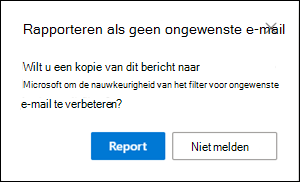

# <a name="report-junk-and-phishing-email-in-outlook-on-the-web-in-exchange-online"></a>Ongewenste e-mail en malafide e-mailberichten in de webversie van Outlook melden in Exchange Online

In Microsoft 365-organisaties met postvakken in Exchange Online kunt u gebruikmaken van de ingebouwde rapportopties in de webversie van Outlook (voorheen Outlook Web app) voor het verzenden van foutberichten (goede e-mailberichten die als spam zijn gemarkeerd), onjuiste negatieven (onjuiste e-mail toegestaan) en phishingberichten voor Exchange Online Protection (EOP).

## <a name="what-do-you-need-to-know-before-you-begin"></a>Wat moet u weten voordat u begint?

- Als u een beheerder bent van een organisatie met postvakken van Exchange Online, raden we u aan om de portal voor ingediende vragen te gebruiken in het beveiligings & nalevings centrum. Zie voor meer informatie [beheer van beheerders gebruiken om verdachte spam, phishing, url's en bestanden naar Microsoft te verzenden](admin-submission.md).

- Beheerders kunnen gebruikers de mogelijkheid bieden om berichten te rapporteren aan Microsoft in de webversie van Outlook. Zie voor meer informatie de sectie het [melden van ongewenste e-mail in Outlook op het web in-of uitschakelen](#disable-or-enable-junk-email-reporting-in-outlook-on-the-web) verderop in dit onderwerp.

- U kunt gerapporteerde berichten configureren voor kopiëren of omleiden naar een door u opgegeven postvak. Zie voor meer informatie [een postvak opgeven voor het overzetten van gebruikers van spam en phishing-berichten in Exchange Online](user-submission.md).

- Zie [berichten en bestanden rapporteren aan Microsoft](report-junk-email-messages-to-microsoft.md)voor meer informatie over het rapporteren van berichten aan Microsoft.

## <a name="report-spam-and-phishing-messages-in-outlook-on-the-web"></a>Spam en phishing-berichten rapporteren in de webversie van Outlook

1. Voor berichten in het postvak in of een andere e-mailmap met uitzondering van ongewenste E-mail, gebruikt u een van de volgende methoden om spamberichten en phishingberichten te melden:

   - Selecteert u het bericht, klikt u op **ongewenste e-mail** op de werkbalk en selecteert u vervolgens **ongewenste e-mail** of **phishing**.

     

   - Selecteer een of meer berichten, klik met de rechtermuisknop en selecteer vervolgens **markeren als ongewenst**.

2. Klik in het dialoogvenster dat wordt weergegeven op **rapport**. Als u van gedachten verandert, klikt u op **niet melden**.

   |Ongewenste e-mail|Phishing|
   |:---:|:---:|
   |||

3. De geselecteerde berichten worden naar Microsoft verzonden voor analyse. Als u wilt controleren of de berichten zijn verzonden, opent u de map **verzonden items** om de verzonden berichten te bekijken.

## <a name="report-non-spam-and-phishing-messages-from-the-junk-email-folder-in-outlook-on-the-web"></a>Niet-spamberichten en phishingberichten melden in de map Ongewenste E-mail in de webversie van Outlook

1. Gebruik in de map Ongewenste E-mail een van de volgende methoden om spam in te stellen:

   - Selecteer het bericht, klik op **geen ongewenste e-mail** op de werkbalk en selecteer **geen ongewenste e-mail** of **phishing**.

     

   - Selecteer een of meer berichten, klik met de rechtermuisknop en selecteer **markeren als niet-ongewenste e-mail**.

2. In het dialoogvenster dat wordt weergegeven, leest u de informatie en klikt u op **rapport**. Als u van gedachten verandert, klikt u op **niet melden**.

   |Geen ongewenste e-mail|Phishing|
   |:---:|:---:|
   |||

3. De geselecteerde berichten worden naar Microsoft verzonden voor analyse. Als u wilt controleren of de berichten zijn verzonden, opent u de map **verzonden items** om de verzonden berichten te bekijken.

## <a name="disable-or-enable-junk-email-reporting-in-outlook-on-the-web"></a>Rapportage van ongewenste e-mail in-of uitschakelen in de webversie van Outlook

Standaard kunnen gebruikers spam in de webversie van Outlook melden, geen valse negatieven en phishingberichten met Microsoft voor analyse. Beheerders kunnen de beleidsregels voor het postvak van Outlook configureren in Exchange Online PowerShell om te voorkomen dat gebruikers spam fout-en spamberichten van Microsoft rapporteren. U kunt de mogelijkheid van gebruikers om phishingberichten te rapporteren niet uitschakelen voor Microsoft.

### <a name="what-do-you-need-to-know-before-you-begin"></a>Wat moet u weten voordat u begint?

- Zie [Verbinding maken met Exchange Online PowerShell](https://docs.microsoft.com/powershell/exchange/connect-to-exchange-online-powershell) als u verbinding wilt maken met Exchange Online PowerShell.

- U moet beschikken over bepaalde machtigingen om deze procedures te kunnen uitvoeren. Specifiek hebt u de rollen voor het **beleid voor geadresseerden** of **e-mail geadresseerden** nodig in Exchange Online, die standaard zijn toegewezen aan de rollen groepen **Organisatiebeheer** en **geadresseerden beheren** . Zie [rollen groepen wijzigen in Exchange Online](https://docs.microsoft.com/Exchange/permissions-exo/role-groups#modify-role-groups)voor meer informatie over rollen groepen in Exchange Online.

- Elke organisatie heeft een standaardbeleid met de naam OwaMailboxPolicy-standaard, maar u kunt aangepaste beleidsregels maken. Aangepaste beleidsregels worden toegepast op gebruikers met een bereik vóór het standaardbeleid. Zie voor meer informatie over de beleidsregels van de webversie van Outlook voor informatie over de beleidsregels voor het Postvak [in Exchange Online](https://docs.microsoft.com/Exchange/clients-and-mobile-in-exchange-online/outlook-on-the-web/outlook-web-app-mailbox-policies).

- Als u het rapporteren van ongewenste e-mail uitschakelt, wordt de mogelijkheid om een bericht niet te markeren als ongewenst of niet-ongewenste e-mail in de webversie van Outlook. Als u een bericht in de map Ongewenste e-mail selecteert en op **geen ongewenste e-mail** klikt, wordt \> **Not junk** het bericht nog steeds naar het postvak in verplaatst. Als u een bericht in een andere e-mailmap selecteert en op **ongewenste** e-mail klikt, wordt \> **Junk** het bericht nog steeds verplaatst naar de map Ongewenste e-mail. Wat niet langer beschikbaar is, is de mogelijkheid om het bericht aan Microsoft te melden.

### <a name="use-exchange-online-powershell-to-disable-or-enable-junk-email-reporting-in-outlook-on-the-web"></a>PowerShell van Exchange Online gebruiken voor het in-of uitschakelen van de rapportage van ongewenste e-mail in de webversie van Outlook

1. Voer de volgende opdracht uit om uw bestaande postvak beleidsregels en de status van rapporten voor ongewenste e-mail te zoeken in de webversie van Outlook:

   ```powershell
   Get-OwaMailboxPolicy | Format-Table Name,ReportJunkEmailEnabled
   ```

2. Gebruik de volgende syntaxis om het rapporteren van ongewenste e-mail in de webversie van Outlook uit of in te schakelen:

   ```powershell
   Set-OwaMailboxPolicy -Identity "<OWAMailboxPolicyName>" -ReportJunkEmailEnabled <$true | $false>
   ```

   In dit voorbeeld wordt rapportage van ongewenste e-mail in het standaardbeleid uitgeschakeld.

   ```powershell
   Set-OwaMailboxPolicy -Identity "OwaMailboxPolicy-Default" -ReportJunkEmailEnabled $false
   ```

   In dit voorbeeld wordt het rapporteren van ongewenste e-mail ingeschakeld in het aangepaste beleid genaamd contoso managers.

   ```powershell
   Set-OwaMailboxPolicy -Identity "Contoso Managers" -ReportJunkEmailEnabled $true
   ```

Zie [Get-OwaMailboxPolicy](https://docs.microsoft.com/powershell/module/exchange/get-owamailboxpolicy) en [set-OwaMailboxPolicy](https://docs.microsoft.com/powershell/module/exchange/set-owamailboxpolicy)voor gedetailleerde syntaxis-en parameterinformatie.

### <a name="how-do-you-know-this-worked"></a>Hoe weet u of dit heeft gewerkt?

Ga op een van de volgende manieren te werk om te controleren of u de rapportage voor ongewenste e-mail hebt ingeschakeld of uitgeschakeld in de webversie van Outlook:

- In Exchange Online PowerShell voert u de volgende opdracht uit en controleert u de waarde van de eigenschap **ReportJunkEmailEnabled** :

  ```powershell
  Get-OwaMailboxPolicy | Format-Table Name,ReportJunkEmailEnabled
  ```

- Het postvak van een gebruiker openen in de webversie van Outlook Selecteer een bericht in het postvak in, klik op **ongewenste** \> **e-mail** en controleer of het bericht aan Microsoft wordt gemeld of niet wordt weergegeven.<sup>\*</sup>

- Open het postvak van een gebruiker in de webversie van Outlook, selecteer een bericht in de map Ongewenste e-mail, klik op **ongewenste** \> **e-mail** en controleer of het bericht aan Microsoft is of niet wordt weergegeven.<sup>\*</sup>

<sup>\*</sup> Gebruikers kunnen de prompt voor het melden van het bericht verbergen en het bericht nog steeds rapporteren. Ga als volgt te werk om deze instelling te controleren in de webversie van Outlook:

1. Klik op **instellingen**  \> **alle Outlook** \> **-instellingen ongewenste e-mail**weer te geven.
2. Controleer in de sectie **rapportage** de waarde: **vragen voordat u een rapport verzendt**.

   
