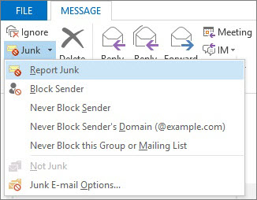

# Ongewenste e-mailberichten melden aan Microsoft

De invoegtoepassing Microsoft Voor het melden van ongewenste e-mail voor Microsoft Office Outlook biedt verschillende manieren om ongewenste e-mailberichten te melden:

- Vanaf het outlook-lint

- Vanuit je Postvak IN

- Vanuit een geopend e-mailbericht

Met de invoegtoepassing Voor het melden voor ongewenste e-mailrapportage u rapporten indienen bij de EOP-service (Microsoft Exchange Online Protection). Als uw postvak niet door de service wordt beschermd, heeft het indienen van uw ongewenste e-mailrapport geen invloed op uw spamfilters. Beheerders kunnen meer informatie krijgen over spam-instellingen die van toepassing zijn op een hele organisatie bij [Lijsten met veilige afzenders maken in Office 365](create-safe-sender-lists-in-office-365.md) en [Lijsten met geblokkeerde afzenders maken in Office 365](create-block-sender-lists-in-office-365.md). Deze zijn handig als u controle op administratorniveau hebt en u valse positieven of valse negatieven wilt voorkomen.

> [!TIP]
> U ook spamberichten rechtstreeks naar Microsoft verzenden met behulp van het [junk@office365.microsoft.com](mailto:junk@office365.microsoft.com) e-mailadres en fout-positieve (niet-spam)berichten met behulp van het [not_junk@office365.microsoft.com](mailto:not_junk@office365.microsoft.com) e-mailadres. Zie [Spam, niet-spam en phishing-scamberichten verzenden voor analyse voor](submit-spam-non-spam-and-phishing-scam-messages-to-microsoft-for-analysis.md)meer informatie.

### Ongewenste e-mailberichten vanuit Outlook rapporteren

[De invoegtoepassing Rapportbericht gebruiken](https://support.office.com/article/b5caa9f1-cdf3-4443-af8c-ff724ea719d2)

### Ongewenste e-mailberichten vanuit uw Postvak IN rapporteren

1. Klik met de rechtermuisknop op het bericht of de berichten die u als ongewenste e-mail wilt melden.

2. Selecteer **Ongewenste e-mail** en klik op **Ongewenste e-mail melden**.
    

3. Het dialoogvenster **Invoegtoepassing microsoft-e-mailrapportage** wordt geopend. Als u zeker weet dat u de berichten die u als ongewenste e-mail hebt geselecteerd, wilt verzenden, klikt u op **Ja**.
    

    > [!NOTE]
    > Als u dit bevestigingsbericht niet wilt ontvangen bij het verzenden van ongewenste berichten, schakelt u **Dit bericht niet meer weergeven in.**

De geselecteerde berichten worden naar Microsoft verzonden voor analyse en verplaatst naar de map Ongewenste e-mail. Als u wilt bevestigen dat de berichten zijn verzonden, opent u de map **Verzonden items** om de ingediende berichten weer te geven.

### Een ongewenste e-mailbericht melden vanuit een geopend bericht

1. Klik vanuit een geopend bericht op de knop **Ongewenste e-mail melden** op het berichtlint. Klik bijvoorbeeld op **Ongewenste** \> **e-mail** 

2. Het dialoogvenster **Invoegtoepassing microsoft-e-mailrapportage** wordt geopend. Als u zeker weet dat u het bericht wilt verzenden dat u als ongewenste e-mail hebt geselecteerd, klikt u op **Ja**.
    

    > [!NOTE]
    > Als u dit bevestigingsbericht niet wilt ontvangen bij het verzenden van ongewenste berichten, schakelt u **Dit bericht niet meer weergeven in.**

Het geselecteerde bericht wordt naar Microsoft verzonden voor analyse en verplaatst naar de map Ongewenste e-mail. Als u wilt bevestigen dat het bericht is verzonden, opent u de map **Verzonden items** om het ingediende bericht weer te geven.
