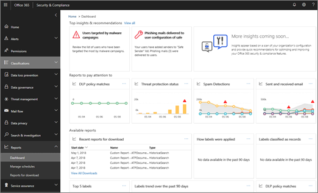

# Slimme rapporten en inzichten in het &amp; Office 365 Security Compliance CenterSmart reports and insights in the Office 365 Security &amp; Compliance Center

Als u deel uitmaakt van het Office 365-beveiligingsteam van uw organisatie en over de benodigde machtigingen beschikt [in het Office 365 Security &amp; Compliance Center,](permissions-in-the-security-and-compliance-center.md)hebt u toegang tot verschillende rapporten, waaronder slimme rapporten en inzichten.If you are part of your organization's Office 365 security team and have the necessary [permissions assigned in the Office 365 Security &amp; Compliance Center](permissions-in-the-security-and-compliance-center.md), you can access a variety of reports, including smart reports and insights. Lees dit artikel om een overzicht te krijgen van deze rapporten en inzichten, en waar u verder gaan voor meer informatie over specifieke rapporten.Read this article to get an overview of these reports and insights, and where to go to learn more about specific reports.
      
## Overzicht van slimme rapporten en inzichtenSmart reports and insights overview

Bewakingsmogelijkheden die beschikbaar zijn in &amp; het Office 365 Security Compliance Center omvatten slimme rapporten en inzichten waarmee uw beveiligings- en compliancebeheerders zich kunnen concentreren op problemen met hoge prioriteit, zoals beveiligingsaanvallen of verhoogde verdachte activiteiten.Monitoring capabilities available in the Office 365 Security &amp; Compliance Center include smart reports and insights that enable your security and compliance administrators to focus on high-priority issues, such as security attacks or increased suspicious activity. In een dashboard lijken slimme rapporten en inzichten op de volgende afbeelding:In a dashboard, smart reports and insights resemble the following image:
  

  
Naast het markeren van probleemgebieden, bevatten slimme rapporten en inzichten aanbevelingen en koppelingen om gegevens te bekijken en te verkennen en ook snelle acties uit te voeren.In addition to highlighting problem areas, smart reports and insights include recommendations and links to view and explore data and also take quick actions. Als uw organisatie bijvoorbeeld plotseling een groot aantal e-mailberichten heeft die door eindgebruikers als spam worden gemarkeerd, wordt u mogelijk geadviseerd om uw antispambeleid opnieuw te bekijken om ervoor te zorgen dat het juiste beschermingsniveau aanwezig is.For example, if your organization suddenly has a high number of email messages being marked as spam by end users, you might be advised to revisit your anti-spam policies to ensure the right level of protection is in place.
  
De volgende walkthroughs laten zien hoe u navigeren tussen &amp; inzichten, gedetailleerde rapporten en dashboards in het Security Compliance Center:The following walkthroughs illustrate how you can navigate between insights, detailed reports, and dashboards in the Security &amp; Compliance Center:
  
- [Walkthrough: Van een dashboard naar een inzichtWalkthrough: From a dashboard to an insight](from-a-dashboard-to-an-insight.md)
    
- [Walkthrough: Van een gedetailleerd rapport naar een inzichtWalkthrough: From a detailed report to an insight](from-a-detailed-report-to-an-insight.md)
    
- [Walkthrough: Van een inzicht naar een gedetailleerd rapportWalkthrough: From an insight to a detailed report](from-an-insight-to-a-detailed-report.md)
    
## Typen rapporten in &amp; het Security Compliance CenterTypes of reports in the Security &amp; Compliance Center

Een breed scala aan rapporten &amp; zijn beschikbaar in het Security Compliance Center.A wide variety of reports are available in the Security &amp; Compliance Center. (Ga naar **Dashboard** **Rapporten** \> om een totaalweergave te krijgen.) In de volgende tabel worden beschikbare rapporten met koppelingen weergegeven voor meer informatie:(Go to **Reports** \> **Dashboard** to get an all-up view.) The following table lists available reports with links to learn more: 
  
|**Type informatie****Type of information**|**Hoe er te komen****How to get there**|**Waar te gaan om meer te leren****Where to go to learn more**|
|:-----|:-----|:-----|
|\*\*Rapporten &amp; \*\* van security compliance center (allup)**Security &amp; Compliance Center reports** (all up)    Topinzichten en aanbevelingen en &amp; koppelingen naar rapporten over beveiligingsnaleving, waaronder rapporten over preventie van gegevensverlies, labels, e-mailbeveiligingsrapporten, rapporten over geavanceerde bedreigingsbeveiliging en meerTop insights and recommendations, and links to Security &amp; Compliance reports, including data loss prevention reports, labels, email security reports, Advanced Threat Protection reports, and more    |Ga in &amp; het Security Compliance Center naar **Het Dashboard** **Rapporten** \>In the Security &amp; Compliance Center, go to **Reports** \> **Dashboard**   |[Rapporten bewaken en weergeven in het Microsoft 365-beveiligingscentrumMonitor and view reports in the Microsoft 365 security center](../mtp/monitoring-and-reporting.md)   |
|**Preventie van gegevensverlies****Data loss prevention**   Beleid voor het voorkomen van gegevensverlies komt overeen met, fout-positieven en overschrijvingen en koppelingen om beleid te maken of te bewerkenData loss prevention policy matches, false positives and overrides, and links to create or edit policies    |Ga in &amp; het Security Compliance Center naar **beleid** voor het **voorkomen** \> van gegevensverliesIn the Security &amp; Compliance Center, go to **Data loss prevention** \> **Policy**   |[Bekijk de rapporten voor preventie van gegevensverliesView the reports for data loss prevention](../../compliance/view-the-dlp-reports.md)   |
|**Data governance****Data governance**   Informatie over hoe labels worden toegepast, labels geclassificeerd als records, labeltrends en meerInformation about how labels are applied, labels classified as records, label trends, and more    |Ga in &amp; het Security Compliance Center naar **Dashboard** **Informatiebeheer** \>In the Security &amp; Compliance Center, go to **Information governance** \> **Dashboard**   |[Bekijk de rapporten over gegevensbeheerView the data governance reports](../../compliance/view-the-data-governance-reports.md)   |
|**Threat management dashboard** (dit wordt ook wel het beveiligingsdashboard en het Threat Intelligence-dashboard genoemd)**Threat management dashboard** (this is also referred to as the Security dashboard and the Threat Intelligence dashboard)    Bedreigingsdetecties, malwaretrends, topgerichte gebruikers, details over verzonden en ontvangen e-mailberichten en meerThreat detections, malware trends, top targeted users, details about sent and received email messages, and more    |Ga in &amp; het Security Compliance Center naar **Dashboard** **Threat management** \>In the Security &amp; Compliance Center, go to **Threat management** \> **Dashboard**   |[Overzicht van beveiligingsdashboardSecurity dashboard overview](security-dashboard.md)   |
|**Threat Explorer** (ook wel Explorer genoemd) of **Real-time detecties****Threat explorer** (also referred to as Explorer) or **Real-time detections**   Vermoedelijke malware gedetecteerd in e-mail en bestanden in Office 365Suspected malware detected in email and files in Office 365    |Ga in &amp; het Security Compliance Center naar **Threat management** \> **Explorer** of **Real-time detections**In the Security &amp; Compliance Center, go to **Threat management** \> **Explorer** or **Real-time detections**  |[Threat Explorer (of realtime detecties)Threat Explorer (or real-time detections)](threat-explorer.md)   |
|**Geavanceerde bedreigingsbeveiliging en e-mailbeveiligingsrapporten****Advanced Threat Protection and email security reports**   E-mailbeveiligingsrapporten en bedreigingsbeveiligingsrapporten (waaronder malware, spam, phishing en spoofing-rapporten)Email security and threat protection reports (including malware, spam, phishing, and spoofing reports)    |Ga in &amp; het Security Compliance Center naar **Het Dashboard** **Rapporten** \>In the Security &amp; Compliance Center, go to **Reports** \> **Dashboard**   |[Rapporten weergeven voor geavanceerde bedreigingsbeveiliging van Office 365View reports for Office 365 Advanced Threat Protection](view-reports-for-atp.md)    [E-mailbeveiligingsrapporten weergeven in het Security &amp; Compliance CenterView email security reports in the Security &amp; Compliance Center](view-email-security-reports.md)   |
|**E-mailstroom****Mail flow**   Informatie over verzonden en ontvangen e-mailberichten, recente waarschuwingen, topafzenders en ontvangers, e-maildoorstuurrapporten en meerInformation about sent and received email messages, recent alerts, top senders and recipients, email forwarding reports, and more    |Ga in &amp; het Security Compliance Center naar **Dashboard** **Voor e-mailstroom** \>In the Security &amp; Compliance Center, go to **Mail flow** \> **Dashboard**   |[Inzichten in de mailstroom in het Security & Compliance CenterMail flow insights in the Security & Compliance Center](mail-flow-insights-v2.md)  |
|**AVG naleving****GDPR compliance**   Informatie over GDPR-naleving, inclusief koppelingen naar betrokkenen, labeltrends en actieve &amp; gesloten gevallenInformation about GDPR compliance, including links to data subjects, label trends, and active &amp; closed cases    |Ga in &amp; het Security Compliance Center naar **het GDPR-dashboard** **voor gegevensprivacy** \>In the Security &amp; Compliance Center, go to **Data privacy** \> **GDPR dashboard**   |[Office 365 Informatiebescherming voor GDPROffice 365 Information Protection for GDPR](https://docs.microsoft.com/office365/enterprise/office-365-information-protection-for-gdpr)   |
|**Controlelogboek****Audit log**   Informatie over Office 365-activiteiten, gebruikers, bestanden of mappen en meerInformation about Office 365 activities, users, files or folders, and more    |Ga in &amp; het Security Compliance Center naar **Search &amp; investigation** \> **Audit log search**In the Security &amp; Compliance Center, go to **Search &amp; investigation** \> **Audit log search**   |[Het controlelogboek doorzoeken in het &amp; Office 365 Security Compliance CenterSearch the audit log in the Office 365 Security &amp; Compliance Center](../../compliance/search-the-audit-log-in-security-and-compliance.md)   |
|**Nalevingsrapporten****Compliance reports**   FedRAMP-rapporten, governance-, risico- en nalevingsrapporten, ISO-rapporten voor informatiebeveiliging en audit- en beoordelingsrapporten van serviceorganisatiecontrolesFedRAMP reports, governance, risk and compliance reports, ISO information security management reports, and Service Organization Controls audit and assessment reports    |Ga in &amp; het Security Compliance Center naar **nalevingsrapporten** **voor servicebeveiliging** \>In the Security &amp; Compliance Center, go to **Service assurance** \> **Compliance reports**   |[Plannen voor &amp; naleving van beveiliging in Office 365Plan for security &amp; compliance in Office 365](../../compliance/plan-for-security-and-compliance.md)   |
  
## Volgende stappenNext steps

Nu u een overzicht hebt van rapporten en inzichten, is uw volgende stap om te leren hoe u rapporten aanpassen, beheren en downloaden.Now that you have an overview of reports and insights, your next step is to learn how to customize, manage, and download reports. Zie de volgende artikelen:See the following articles:
  
- [Een planning maken voor een &amp; rapport in het Security Compliance CenterCreate a schedule for a report in the Security &amp; Compliance Center](create-a-schedule-for-a-report.md)
    
- [Schema's voor meerdere &amp; rapporten beheren in het Security Compliance CenterManage schedules for multiple reports in the Security &amp; Compliance Center](manage-schedules-for-multiple-reports.md)
    
- [Een aangepast rapport downloaden &amp; in het Security Compliance CenterDownload a custom report in the Security &amp; Compliance Center](set-up-and-download-a-custom-report.md)
    
- [Bestaande rapporten downloaden &amp; in het Security Compliance CenterDownload existing reports in the Security &amp; Compliance Center](download-existing-reports.md)
    
## Verwante onderwerpenRelated topics

[Rapporten bewaken en weergeven in het Microsoft 365-beveiligingscentrumMonitor and view reports in the Microsoft 365 security center](../mtp/monitoring-and-reporting.md)
  
[Beschermen tegen bedreigingen in Office 365Protect against threats in Office 365](protect-against-threats.md)
  

