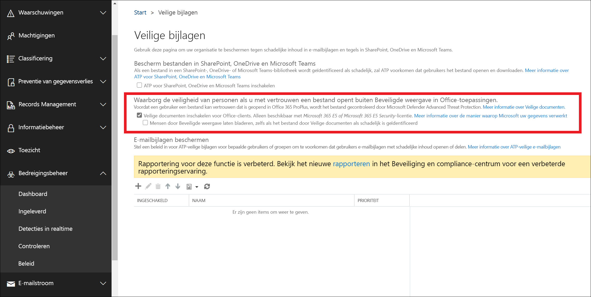

# <a name="safe-documents-in-office-365-advanced-threat-protection"></a>Veilige documenten in geavanceerde bedreigingsbeveiliging van Office 365

Veilige documenten is een functie in Office 365 Advanced Threat Protection (ATP) die [Microsoft Defender Advanced Threat Protection](https://docs.microsoft.com/windows/security/threat-protection/microsoft-defender-atp/microsoft-defender-advanced-threat-protection) gebruikt om documenten en bestanden te scannen die zijn geopend in de beveiligde [weergave.](https://support.office.com/article/d6f09ac7-e6b9-4495-8e43-2bbcdbcb6653)

## <a name="what-do-you-need-to-know-before-you-begin"></a>Wat moet u weten voordat u begint?

- Deze functie is alleen beschikbaar voor gebruikers met de Microsoft 365 E5- of Microsoft 365 E5-beveiligingslicentie.

- Veilige documenten zijn momenteel beschikbaar voor openbare preview, beschikbaar voor gebruikers die deel uitmaken van het [Office Insider-programma](https://insider.office.com/en-us/join) op het 'Maandelijkse kanaal (Targeted)' met Office Version 2002 (12527.20092) of hoger. Deze functie is standaard uitgeschakeld en moet worden ingeschakeld door de beveiligingsbeheerder.

- Alleen de Regio VAN de VS wordt momenteel ondersteund voor compatibele bestandsverwerking (Alle bestanden reizen naar de Amerikaanse regio om te scannen). Steun voor de REGIO VK/EU is gepland in een toekomstige update.

- Zie Verbinding maken met [Exchange Online PowerShell](https://docs.microsoft.com/powershell/exchange/exchange-online/connect-to-exchange-online-powershell/connect-to-exchange-online-powershell)als u verbinding wilt maken met Exchange Online PowerShell. Zie Verbinding maken met [PowerShell](https://docs.microsoft.com/powershell/exchange/exchange-eop/connect-to-exchange-online-protection-powershell)voor de beveiliging van Exchange Online.

- U moet machtigingen toegewezen krijgen voordat u de procedures in dit onderwerp uitvoeren. Als u Veilige documenten wilt inschakelen en configureren, moet u lid zijn van de rolgroepen **Organisatiebeheer** of **Beveiligingsbeheerder.** Zie [Machtigingen in het Office 365 Security & Compliance Center](permissions-in-the-security-and-compliance-center.md)voor meer informatie over rolgroepen in het Security & Compliance Center.

## <a name="use-the-office-365-security--compliance-center-to-configure-safe-documents"></a>Het Office 365 Security & Compliance Center gebruiken om veilige documenten te configureren

1. Open het Office 365 Security <https://protection.office.com>& Compliance Center op .

2. Ga naar Beleid voor **bedreigingsbeheer** \> **Policy** \> **ATP Safe Attachments**.

3. Configureer in de helpmensen veilig wanneer ze erop vertrouwen dat een bestand buiten de sectie **Beveiligde weergave in Office-toepassingen** wordt geopend, een van de volgende instellingen configureren:

   - **Veilige documenten voor Office-clients inschakelen (Bestanden worden ook naar Microsoft Cloud verzonden voor diepe analyses)**

   - **Laat mensen door beveiligde weergave klikken, zelfs als veilige documenten het bestand als kwaadaardig identificeert:** we raden u aan deze optie niet in te schakelen.

4. Klik op **Opslaan** wanneer u gereed bent.



### <a name="use-exchange-online-powershell-or-exchange-online-protection-powershell-to-configure-safe-documents"></a>Exchange Online PowerShell of Exchange Online Protection PowerShell gebruiken om veilige documenten te configureren

Gebruik de volgende syntaxis:

```powershell
Set-AtpPolicyForO365 -EnableSafeDocs <$true|$false> -AllowSafeDocsOpen <$true|$false>
```

- Met de parameter _EnableSafeDocs_ worden veilige documenten voor de hele organisatie ingeschakeld of uitgeschakeld.

- Met de parameter _AllowSafeDocsOpen_ of voorkomt u dat gebruikers de beveiligde weergave verlaten (dat wil zeggen het openen van het document) als het document is geïdentificeerd als kwaadaardig.

Met dit voorbeeld kunnen veilige documenten voor de hele organisatie worden ingeschakeld en wordt voorkomen dat gebruikers documenten openen die zijn geïdentificeerd als kwaadaardig vanuit de beveiligde weergave.

```powershell
Set-AtpPolicyForO365 -EnableSafeDocs $true -AllowSafeDocsOpen $false
```

Zie [Set-AtpPolicyForO365](https://docs.microsoft.com/powershell/module/exchange/advanced-threat-protection/set-atppolicyforo365)voor gedetailleerde syntaxis- en parametergegevens.

### <a name="how-do-i-know-this-worked"></a>Hoe weet ik dat dit werkte?

Ga als volgt te werk om te controleren of u Veilige documenten hebt ingeschakeld en geconfigureerd, een van de volgende stappen:

- Ga in het Security & Compliance Center naar \> **Beveiligingsbeleid** \> **ATP Safe Attachments**en controleer de selecties in de sectie **Help-mensen die veilig blijven wanneer ze een bestand vertrouwen om buiten de sectie Beveiligde weergave in Office-toepassingen te openen.** **Threat management**

- Voer de volgende opdracht uit in Exchange Online PowerShell en controleer de eigenschapswaarden:

  ```powershell
  Get-AtpPolicyForO365 | Format-List *SafeDocs*
  ```
